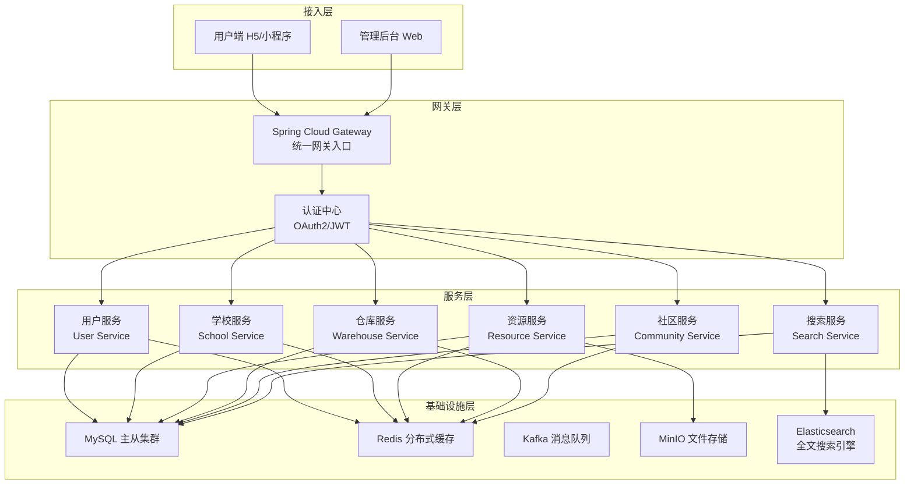
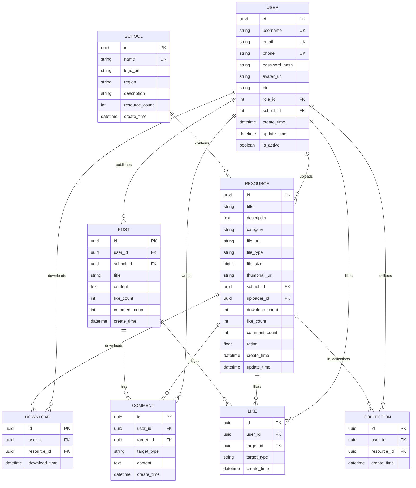

# CampusShare 后端项目规划与开发指南

## 第一部分：项目概述与愿景

### 1.1 项目背景

CampusShare 是字节跳动教育板块旗下的一款校园资源共享平台，旨在连接全国高校学生，打破校际壁垒，促进优质教育资源的流通与共享。平台支持学生上传、下载学习资料，参与社区讨论，构建一个活跃、开放、互助的校园资源共享生态系统。

在字节跳动，我们始终相信“科技改变教育”的力量。CampusShare 不仅是一个技术产品，更是一个连接知识与学生的桥梁。通过精准的资源分类、智能的搜索推荐、完善的用户激励体系，我们致力于让每一位学生都能高效地获取所需的学习资源，让知识的光芒照亮每一个校园角落。

### 1.2 核心价值主张

CampusShare 的核心价值主张可以概括为三个关键词：**连接**、**共享**、**成长**。

**连接**：我们将全国数千所高校的学生连接在一起，打破信息孤岛，让优质资源不再局限于某一所学校或某一地区。

**共享**：我们构建了一个安全、便捷的资源共享平台，让学生能够轻松地上传自己的学习成果，下载他人的宝贵资料，实现知识的价值最大化。

**成长**：我们相信每一次分享都是一次成长。通过分享，学生深化自己的理解；通过下载，学生拓宽自己的视野。CampusShare 见证每一位用户的成长轨迹。

### 1.3 产品功能矩阵

CampusShare 平台的功能可以分为四大模块，每个模块都经过精心设计，确保用户体验流畅、功能实用。

**用户认证模块**是整个平台的基础，包括用户注册、登录、密码找回、第三方登录（微信、QQ）等功能。我们采用 JWT Token 的无状态认证方案，确保系统的高可用性和水平扩展能力。

**学校资源模块**是平台的核心功能，用户可以在这个模块中浏览各高校的优质资源。资源支持多维度分类（学科、类型、年级）、关键词搜索、智能推荐等功能。每个资源详情页展示资源的完整信息，包括上传者信息、下载次数、评价评分、相关推荐等。

**仓库管理模块**帮助用户管理自己的资料。用户可以查看自己上传的所有资源，也可以查看自己下载过的资源。支持资源编辑、删除、收藏等操作。仓库还提供分类管理功能，用户可以自定义分类标签来整理自己的资料。

**社区互动模块**是平台的社交属性体现。用户可以在各个学校论坛发表留言、参与讨论、点赞评论。个人主页展示用户的动态信息，包括上传资料记录、论坛发言历史、获赞情况等。这个模块的设计灵感来源于贴吧，但更加现代化和轻量化。

### 1.4 目标用户画像

CampusShare 的目标用户是全国高校在校学生，特别是以下几类用户群体：

**大一新生**需要大量的通识课程资料、专业入门指南、新生攻略等，他们渴望快速融入大学生活，获取高质量的学习资源。

**考研党**需要历年真题、考研资料、学长学姐的经验分享，他们对资料的完整性和时效性要求较高。

**期末复习生**需要各科目的复习资料、历年试卷、重点笔记，他们对资料的搜索效率和精准度有较高要求。

**竞赛选手**需要各类学科竞赛的资料、优秀作品案例、解题思路分享，他们对专业深度资料有强烈需求。

## 第二部分：技术架构设计

### 2.1 整体技术架构图

CampusShare 后端采用微服务架构设计，确保系统具备高可用、高性能、可扩展的特性。整个架构分为接入层、服务层、数据层、基础设施层四个层次。



### 2.2 技术栈选型与理由

CampusShare 后端的技术栈选择遵循字节跳动内部的技术标准，兼顾先进性与稳定性，确保系统能够支撑业务的快速迭代和海量并发访问。

**Java 17** 作为主要开发语言，充分利用其新特性（如 Records、Pattern Matching、Sealed Classes），提升开发效率和代码质量。字节跳动在 Java 技术栈上有深厚的积累，Java 17 的 LTS 版本确保了长期支持。

**Spring Boot 3.x** 是整个后端框架的基础，提供了开箱即用的配置、自动装配、健康检查等能力。我们采用 Spring Boot 3.2+ 版本，充分利用其对 Java 17 的原生支持和 GraalVM 原生编译能力。

**Spring Cloud Alibaba** 提供了微服务治理的完整解决方案，包括 Nacos（服务注册与配置中心）、Sentinel（流量控制与熔断）、Seata（分布式事务）等组件。这些组件在阿里云和字节跳动内部都有大规模生产环境的验证。

**MySQL 8.0** 是主要的关系型数据库，选择主从架构确保读写分离和故障容灾。MySQL 8.0 的 JSON 支持、窗口函数、CTE 等新特性为业务实现提供了强大的 SQL 能力。

**Redis 7.x** 用于缓存热点数据、分布式锁、Session 管理等场景。我们采用 Redis Cluster 模式确保高可用，支持百万级 QPS 的缓存访问。

**Kafka 3.x** 作为消息队列，用于处理异步消息、事件驱动架构、系统解耦等场景。在 CampusShare 中，Kafka 主要用于资源上传事件、用户行为日志、搜索索引更新等异步处理。

**MinIO** 是对象存储服务，用于存储用户上传的文件（文档、图片、压缩包等）。MinIO 兼容 S3 协议，支持高并发访问，成本可控，适合私有化部署场景。

**Elasticsearch 8.x** 用于全文搜索场景，支持资源标题、描述、标签的全文检索，以及复杂的过滤和聚合查询。

### 2.3 服务拆分与职责边界

CampusShare 后端拆分为六个核心微服务，每个服务职责单一、独立部署，通过 HTTP/REST 或 RPC 通信。

**用户服务（User Service）**是平台的基础服务，负责用户注册、登录、信息管理、权限验证等功能。用户服务维护用户表、角色表、权限表等核心数据实体。对外提供用户信息查询、认证授权、密码管理等接口。

**学校服务（School Service）**管理全国高校的基础信息，包括学校名称、校徽、简介、地区等。学校服务还维护学校与资源的关系，提供学校排名、热门学校等数据。

**资源服务（Resource Service）**是平台的核心业务服务，负责资源的增删改查、分类管理、下载统计、评价评分等功能。资源服务对接 MinIO 进行文件存储，对接 Elasticsearch 提供搜索能力。

**仓库服务（Warehouse Service）**管理用户的个人仓库，包括我上传的资源、我下载的资源、收藏夹等功能。仓库服务提供资源整理、批量操作等便捷功能。

**社区服务（Community Service）**负责社区互动功能，包括论坛发帖、评论回复、点赞关注、用户动态等。社区服务支持@提及、话题标签等社交功能。

**搜索服务（Search Service）**提供统一的搜索能力，整合资源搜索、用户搜索、学校搜索等场景。搜索服务对接 Elasticsearch，支持全文检索、分词、相关性排序等高级功能。

### 2.4 数据库设计预览

CampusShare 的数据库设计遵循范式化原则，同时针对读写性能做了适当的反规范化处理。



### 2.5 API 设计规范

CampusShare 后端 API 采用 RESTful 设计规范，遵循字节跳动内部的 API 设计标准。

**基础规范**包括：统一使用 HTTPS 协议、响应格式统一为 JSON、UTF-8 编码、时间格式使用 ISO 8601 标准。

**URL 规范**采用资源导向的设计：`/api/v1/{resource}/{id}/{sub-resource}`。例如：`/api/v1/users/123/posts` 表示获取用户123的所有帖子。

**认证规范**：除公开接口外，所有接口都需要携带 JWT Token。Token 通过 Authorization Header 传递，格式为 `Bearer {token}`。

**分页规范**：列表接口统一支持 `page`（页码，从1开始）和 `pageSize`（每页数量，默认20）参数。响应中包含 `total`（总数）、`page`（当前页）、`pageSize`（每页数量）、`data`（数据列表）。

**错误规范**：使用标准 HTTP 状态码。响应体包含 `code`（业务错误码）、`message`（错误信息）、`data`（业务数据）三个字段。

以下是一个典型的用户登录接口设计示例：

```json
POST /api/v1/auth/login
Content-Type: application/json

{
  "account": "user@example.com",
  "password": "encrypted_password",
  "rememberMe": true
}

响应示例：
{
  "code": 200,
  "message": "登录成功",
  "data": {
    "token": "eyJhbGciOiJIUzI1NiIsInR5cCI6IkpXVCJ9...",
    "refreshToken": "eyJhbGciOiJIUzI1NiIsInR5cCI6IkpXVCJ9...",
    "expiresIn": 7200,
    "user": {
      "id": "550e8400-e29b-41d4-a716-446655440000",
      "username": "student123",
      "email": "user@example.com",
      "phone": "13800138000",
      "avatar": "https://cdn.campusshare.com/avatars/xxx.jpg",
      "role": "user",
      "school": {
        "id": "1",
        "name": "深圳大学"
      }
    }
  }
}
```

## 第三部分：开发流程与团队协作

### 3.1 字节跳动开发流程概述

CampusShare 后端开发遵循字节跳动内部标准的敏捷开发流程，采用“需求 → 设计 → 开发 → 测试 → 部署 → 运维”的闭环管理模式。

**迭代周期**：采用双周迭代模式，每两周为一个 Sprint。每个 Sprint 包含计划会议（Sprint Planning）、每日站会（Daily Standup）、评审会议（Sprint Review）和回顾会议（Sprint Retrospective）四个核心环节。

**需求管理**：使用内部平台（如 Lark/飞书）进行需求管理和任务追踪。需求以 User Story 的形式描述，包含验收标准（Acceptance Criteria）和估算工作量（Story Point）。

**代码管理**：采用 Git Flow 分支管理策略。`main` 分支为主分支，`develop` 分支为开发分支，`feature/*` 为功能分支，`hotfix/*` 为热修复分支。所有代码合并需要通过 Code Review。

**持续集成/持续部署（CI/CD）**：使用内部 CI/CD 平台，实现代码提交自动触发构建、测试、部署流程。测试覆盖率需要达到 80% 以上才能合并到主分支。

### 3.2 项目团队结构

CampusShare 后端项目团队建议配置如下，根据项目规模和阶段可以灵活调整。

**后端负责人（1人）**：负责整体技术架构设计、核心模块开发、技术难题攻关、代码审查、团队技术指导。

**后端开发工程师（3-4人）**：负责各微服务的详细设计和开发实现，参与技术方案讨论，编写单元测试和集成测试。

**测试工程师（1-2人）**：负责测试用例编写、接口测试、性能测试、自动化测试脚本开发。

**运维工程师（1人，可兼任）**：负责环境搭建、部署配置、监控告警、故障应急响应。

### 3.3 开发环境规划

**本地开发环境**：每位开发人员需要在本地配置完整的开发环境，包括 JDK 17、Maven/Gradle、IDE（IntelliJ IDEA）、Docker Desktop、本地 MySQL 和 Redis。

**开发服务器环境**：部署一套开发环境供团队共享，用于集成测试和功能演示。开发环境配置相对较低，但需要包含所有中间件（MySQL、Redis、Kafka、MinIO、Elasticsearch）。

**测试环境**：独立部署的测试环境，与开发环境隔离。测试环境配置接近生产环境，用于进行性能测试和用户验收测试。

**预发布环境**：与生产环境完全一致的部署，用于上线前的最终验证。

**生产环境**：最终上线运行的环境，部署在字节跳动云平台或合作云服务商。

### 3.4 项目里程碑规划

CampusShare 后端开发分为四个主要阶段，预计总周期为 12-16 周。

**第一阶段：基础设施与核心框架（第1-4周）**

这个阶段的主要目标是搭建项目骨架、完成技术验证、跑通核心流程。具体任务包括：项目工程结构搭建、数据库设计与初始化、用户认证模块开发、统一网关与配置中心部署、基础设施组件集成（MySQL、Redis、Kafka）、开发文档编写。

**第二阶段：核心业务模块开发（第5-8周）**

这个阶段的主要目标是完成学校服务、资源服务、仓库服务的详细设计和开发。具体任务包括：学校信息管理功能、资源上传下载功能、文件存储集成、搜索功能开发（Elasticsearch）、资源分类与标签管理、API 接口开发与调试。

**第三阶段：社区与高级功能（第9-12周）**

这个阶段的主要目标是完成社区服务、消息通知、性能优化等工作。具体任务包括：论坛发帖与评论功能、点赞关注功能、用户动态功能、消息通知系统、用户激励体系、性能优化与压力测试。

**第四阶段：上线准备与优化（第13-16周）**

这个阶段的主要目标是完成上线准备、系统优化、运维体系建设。具体任务包括：生产环境部署配置、监控告警配置、安全加固与渗透测试、灾备方案设计、运维手册编写、用户手册与培训。

## 第四部分：第一阶段详细规划

### 4.1 第一阶段目标与交付物

第一阶段是整个项目的基石，需要产出高质量、可扩展、易维护的代码框架。第一阶段结束时，需要交付以下成果物：

**代码交付物**：完整的后端项目代码仓库，包含 Spring Boot 主项目和所有微服务模块。所有代码通过静态代码检查和单元测试。

**文档交付物**：《技术架构设计文档》、《数据库设计文档》、《接口设计文档》、《开发环境搭建指南》、《编码规范手册》。

**流程交付物**：跑通完整的用户注册、登录、获取用户信息的业务流程。所有核心接口能够正常调用和返回预期结果。

### 4.2 第一阶段详细任务分解

#### 任务1：项目工程结构搭建（2-3天）

**任务描述**：搭建 Spring Boot 微服务项目工程结构，采用 Maven Multi-Module 项目管理。

**具体工作内容**：

- 创建主项目父 POM，包含所有子模块的依赖管理
- 创建 common 模块，存放公共工具类、常量定义、异常类等
- 创建 user-service 模块，用户服务子项目
- 创建 api-gateway 模块，统一网关子项目
- 配置 Git 仓库，建立分支管理策略
- 集成 SonarQube 代码检查
- 配置 Maven 镜像和私有仓库

**验收标准**：

- 所有子模块能够独立编译和启动
- 项目能够成功打包成 JAR 文件
- Git 分支策略已建立并文档化

**示例代码结构**：

```
campushare-backend/
├── pom.xml                          # 父 POM 文件
├── campushare-common/               # 公共模块
│   ├── pom.xml
│   └── src/
│       ├── main/java/
│       │   └── com/campushare/common/
│       │       ├── constant/       # 常量定义
│       │       ├── exception/       # 异常定义
│       │       ├── result/          # 统一响应封装
│       │       ├── utils/           # 工具类
│       │       └── enums/           # 枚举类
│       └── test/java/
├── campushare-user/                 # 用户服务
│   ├── pom.xml
│   └── src/
│       ├── main/java/
│       │   └── com/campushare/user/
│       │       ├── controller/      # 控制器层
│       │       ├── service/         # 服务层
│       │       ├── repository/      # 数据访问层
│       │       ├── entity/          # 实体类
│       │       ├── dto/             # 数据传输对象
│       │       ├── config/         # 配置类
│       │       └── UserApplication.java
│       └── test/java/
├── campushare-gateway/              # API 网关
│   ├── pom.xml
│   └── src/
│       └── main/java/
│           └── com/campushare/gateway/
│               ├── config/         # 网关配置
│               ├── filter/         # 过滤器
│               └── GatewayApplication.java
└── docker/                          # Docker 配置
    ├── docker-compose.yml
    └── mysql/
        └── init.sql
```

#### 任务2：数据库设计与初始化（2-3天）

**任务描述**：完成用户模块相关的数据库设计，包括用户表、角色表、权限表，并完成数据库初始化脚本。

**具体工作内容**：

- 设计用户表（users）结构，包含用户名、邮箱、手机号、密码等字段
- 设计角色表（roles）和用户角色关联表（user_roles）
- 编写数据库初始化 SQL 脚本
- 配置 MySQL 连接池（HikariCP）
- 创建 MySQL Docker 容器并初始化数据
- 使用 Flyway 或 Liquibase 管理数据库版本

**验收标准**：

- 数据库表结构设计合理，符合范式化要求
- 初始化脚本能够成功执行
- 能够通过 JDBC 连接并操作数据库

**数据库建表语句示例**：

```sql
-- 创建用户表
CREATE TABLE users (
    id VARCHAR(36) PRIMARY KEY COMMENT '用户ID',
    username VARCHAR(50) NOT NULL UNIQUE COMMENT '用户名',
    email VARCHAR(100) UNIQUE COMMENT '邮箱',
    phone VARCHAR(20) UNIQUE COMMENT '手机号',
    password_hash VARCHAR(255) NOT NULL COMMENT '密码哈希',
    avatar_url VARCHAR(500) COMMENT '头像URL',
    bio VARCHAR(200) COMMENT '个人简介',
    school_id VARCHAR(36) COMMENT '所属学校ID',
    status TINYINT DEFAULT 1 COMMENT '账号状态：1-正常，0-禁用',
    create_time TIMESTAMP DEFAULT CURRENT_TIMESTAMP COMMENT '创建时间',
    update_time TIMESTAMP DEFAULT CURRENT_TIMESTAMP ON UPDATE CURRENT_TIMESTAMP COMMENT '更新时间',
    INDEX idx_username (username),
    INDEX idx_email (email),
    INDEX idx_phone (phone),
    INDEX idx_school (school_id)
) ENGINE=InnoDB DEFAULT CHARSET=utf8mb4 COLLATE=utf8mb4_unicode_ci COMMENT='用户表';

-- 创建角色表
CREATE TABLE roles (
    id INT PRIMARY KEY AUTO_INCREMENT COMMENT '角色ID',
    role_name VARCHAR(50) NOT NULL UNIQUE COMMENT '角色名称',
    role_code VARCHAR(50) NOT NULL UNIQUE COMMENT '角色编码',
    description VARCHAR(200) COMMENT '角色描述',
    create_time TIMESTAMP DEFAULT CURRENT_TIMESTAMP COMMENT '创建时间'
) ENGINE=InnoDB DEFAULT CHARSET=utf8mb4 COLLATE=utf8mb4_unicode_ci COMMENT='角色表';

-- 创建用户角色关联表
CREATE TABLE user_roles (
    id INT PRIMARY KEY AUTO_INCREMENT,
    user_id VARCHAR(36) NOT NULL,
    role_id INT NOT NULL,
    create_time TIMESTAMP DEFAULT CURRENT_TIMESTAMP,
    UNIQUE KEY uk_user_role (user_id, role_id),
    FOREIGN KEY (user_id) REFERENCES users(id) ON DELETE CASCADE,
    FOREIGN KEY (role_id) REFERENCES roles(id) ON DELETE CASCADE
) ENGINE=InnoDB DEFAULT CHARSET=utf8mb4 COLLATE=utf8mb4_unicode_ci COMMENT='用户角色关联表';

-- 插入初始角色数据
INSERT INTO roles (role_name, role_code, description) VALUES
('普通用户', 'USER', '普通注册用户'),
('管理员', 'ADMIN', '系统管理员');
```

#### 任务3：统一网关与配置中心部署（2-3天）

**任务描述**：部署 Spring Cloud Gateway 和 Nacos 配置中心，实现统一的请求入口和配置管理。

**具体工作内容**：

- 部署 Nacos Server（单机模式用于开发环境）
- 配置 Nacos 作为服务注册中心
- 配置 Nacos 作为配置中心
- 开发 Gateway 网关服务
- 配置网关路由规则
- 实现 JWT Token 验证过滤器
- 配置跨域（CORS）规则

**验收标准**：

- Nacos 控制台能够正常访问
- 网关能够将请求路由到后端服务
- 未携带有效 Token 的请求被拒绝访问

**网关配置示例**：

```yaml
# application.yml
spring:
  application:
    name: campushare-gateway
  cloud:
    nacos:
      discovery:
        server-addr: ${NACOS_HOST:localhost}:8848
        namespace: ${NACOS_NAMESPACE:public}
      config:
        server-addr: ${NACOS_HOST:localhost}:8848
        file-extension: yaml
    gateway:
      routes:
        - id: user-service
          uri: lb://campushare-user
          predicates:
            - Path=/api/v1/users/**
          filters:
            - StripPrefix=1
        - id: school-service
          uri: lb://campushare-school
          predicates:
            - Path=/api/v1/schools/**
          filters:
            - StripPrefix=1
      globalcors:
        corsConfigurations:
          '[/**]':
            allowedOrigins: "*"
            allowedMethods: "*"
            allowedHeaders: "*"
            allowCredentials: false

jwt:
  secret: ${JWT_SECRET:your-256-bit-secret-key-for-jwt-signing}
  expiration: 7200000
```

#### 任务4：用户认证模块开发（5-7天）

**任务描述**：完成用户注册、登录、密码找回、Token 刷新等认证相关功能。

**具体工作内容**：

- 实现用户注册接口（手机号注册、邮箱注册）
- 实现用户登录接口（账号密码登录）
- 实现密码找回接口（发送验证码、重置密码）
- 实现 Token 刷新接口
- 实现用户信息查询和修改接口
- 集成 Redis 存储验证码和 Token
- 实现密码加密（BCrypt）和盐值处理
- 实现接口限流防止暴力破解

**验收标准**：

- 用户能够成功注册并收到验证码
- 用户能够使用正确凭据登录并获取 Token
- Token 能够正常使用并正确解析用户信息
- 密码重置功能能够正常工作

**核心接口清单**：

| 接口路径 | 请求方法 | 功能描述 | 认证要求 |
|---------|---------|---------|---------|
| /auth/register | POST | 用户注册 | 否 |
| /auth/login | POST | 用户登录 | 否 |
| /auth/send-code | POST | 发送验证码 | 否 |
| /auth/reset-password | POST | 重置密码 | 否 |
| /auth/refresh-token | POST | 刷新Token | 否 |
| /users/me | GET | 获取当前用户信息 | 是 |
| /users/me | PUT | 修改当前用户信息 | 是 |
| /users/me/password | PUT | 修改密码 | 是 |

**关键代码示例**：

```java
@RestController
@RequestMapping("/auth")
@RequiredArgsConstructor
public class AuthController {
    
    private final AuthService authService;
    private final JwtTokenProvider jwtTokenProvider;
    
    @PostMapping("/login")
    public Result<LoginResponse> login(@RequestBody @Valid LoginRequest request) {
        // 验证用户凭据
        User user = authService.authenticate(request.getAccount(), request.getPassword());
        
        // 生成 Token
        String token = jwtTokenProvider.generateToken(user.getId(), user.getUsername());
        String refreshToken = jwtTokenProvider.generateRefreshToken(user.getId());
        
        // 构建响应
        LoginResponse response = LoginResponse.builder()
            .token(token)
            .refreshToken(refreshToken)
            .expiresIn(jwtTokenProvider.getExpiration())
            .user(UserDTO.fromEntity(user))
            .build();
        
        return Result.success(response);
    }
}
```

```java
@Service
@RequiredArgsConstructor
@Slf4j
public class AuthService {
    
    private final UserRepository userRepository;
    private final RedisTemplate<String, String> redisTemplate;
    private final PasswordEncoder passwordEncoder;
    private final JwtTokenProvider jwtTokenProvider;
    
    @Transactional
    public User register(RegisterRequest request) {
        // 验证验证码
        String cachedCode = redisTemplate.opsForValue().get("verify:code:" + request.getAccount());
        if (!request.getVerifyCode().equals(cachedCode)) {
            throw new BusinessException("验证码错误");
        }
        
        // 检查账号是否已存在
        if (userRepository.existsByAccount(request.getAccount())) {
            throw new BusinessException("账号已存在");
        }
        
        // 创建用户
        User user = User.builder()
            .username(request.getUsername())
            .email(request.getAccountType().equals("email") ? request.getAccount() : null)
            .phone(request.getAccountType().equals("phone") ? request.getAccount() : null)
            .passwordHash(passwordEncoder.encode(request.getPassword()))
            .status(1)
            .build();
        
        return userRepository.save(user);
    }
    
    public User authenticate(String account, String password) {
        User user = userRepository.findByAccount(account)
            .orElseThrow(() -> new BusinessException("账号或密码错误"));
        
        if (!passwordEncoder.matches(password, user.getPasswordHash())) {
            throw new BusinessException("账号或密码错误");
        }
        
        if (user.getStatus() == 0) {
            throw new BusinessException("账号已被禁用");
        }
        
        return user;
    }
}
```

#### 任务5：开发文档编写（贯穿整个阶段）

**任务描述**：编写完整的技术文档，包括架构设计、接口设计、开发规范等。

**需要输出的文档**：

- 《CampusShare 技术架构设计文档 v1.0》
- 《CampusShare 数据库设计文档 v1.0》
- 《CampusShare 接口设计文档 v1.0》
- 《CampusShare 开发环境搭建指南 v1.0》
- 《CampusShare 代码编码规范 v1.0》

**文档要求**：

- 使用 Markdown 格式编写
- 包含架构图、流程图、时序图等可视化内容
- 提供完整的代码示例
- 文档存放在项目的 `docs/` 目录下
- 使用 Git 进行版本管理

## 第五部分：工具与环境配置

### 5.1 开发工具推荐

**IntelliJ IDEA**：字节跳动推荐的 Java IDE，Ultimate 版本支持 Spring Boot、数据库、REST Client 等丰富功能。配置 IDEA 代码模板，遵循团队编码规范。

**Visual Studio Code**：轻量级编辑器，适合查看代码、编写文档、运行脚本。

**Navicat Premium**：数据库管理工具，支持 MySQL 连接、表结构设计、数据管理等。

**Postman**：API 测试工具，用于接口调试和自动化测试。

**Docker Desktop**：容器化开发环境，快速启动 MySQL、Redis、Kafka 等中间件。

**Git**：版本控制系统，使用 Sourcetree 或 GitKraken 可视化工具辅助管理分支。

**MobaXterm** 或 **Xshell**：终端工具，连接远程服务器进行部署和运维。

### 5.2 开发环境快速搭建脚本

以下是一个自动化搭建开发环境的脚本，可以快速启动所有需要的中间件：

```yaml
# docker-compose.yml
version: '3.8'

services:
  # MySQL 数据库
  mysql:
    image: mysql:8.0
    container_name: campushare-mysql
    environment:
      MYSQL_ROOT_PASSWORD: root123456
      MYSQL_DATABASE: campushare
      MYSQL_USER: campushare
      MYSQL_PASSWORD: campushare123
    ports:
      - "3306:3306"
    volumes:
      - mysql_data:/var/lib/mysql
      - ./mysql/init.sql:/docker-entrypoint-initdb.d/init.sql
    command: --default-authentication-plugin=mysql_native_password
    healthcheck:
      test: ["CMD", "mysqladmin", "ping", "-h", "localhost"]
      interval: 10s
      timeout: 5s
      retries: 5

  # Redis 缓存
  redis:
    image: redis:7-alpine
    container_name: campushare-redis
    ports:
      - "6379:6379"
    volumes:
      - redis_data:/data
    healthcheck:
      test: ["CMD", "redis-cli", "ping"]
      interval: 10s
      timeout: 3s
      retries: 5

  # Nacos 配置中心
  nacos:
    image: nacos/nacos-server:v2.2.3
    container_name: campushare-nacos
    environment:
      MODE: standalone
      SPRING_DATASOURCE_PLATFORM: mysql
      JVM_XMS: 512m
      JVM_XMX: 512m
    ports:
      - "8848:8848"
      - "9848:9848"
    volumes:
      - nacos_data:/home/nacos/data
    healthcheck:
      test: ["CMD", "curl", "-f", "http://localhost:8848/nacos"]
      interval: 15s
      timeout: 10s
      retries: 5

  # Kafka 消息队列
  kafka:
    image: bitnami/kafka:3.6
    container_name: campushare-kafka
    environment:
      ALLOW_PLAINTEXT_LISTENER: yes
      KAFKA_CFG_ZOOKEEPER_CONNECT: zookeeper:2181
      KAFKA_CFG_LISTENERS: PLAINTEXT://:9092
      KAFKA_CFG_ADVERTISED_LISTENERS: PLAINTEXT://localhost:9092
    ports:
      - "9092:9092"
    depends_on:
      - zookeeper
    healthcheck:
      test: ["CMD", "kafka-topics.sh", "--bootstrap-server", "localhost:9092", "--list"]
      interval: 30s
      timeout: 10s
      retries: 5

  zookeeper:
    image: bitnami/zookeeper:3.9
    container_name: campushare-zookeeper
    environment:
      ALLOW_ANONYMOUS_LOGIN: yes
    ports:
      - "2181:2181"

  # MinIO 对象存储
  minio:
    image: minio/minio:latest
    container_name: campushare-minio
    environment:
      MINIO_ROOT_USER: minioadmin
      MINIO_ROOT_PASSWORD: minioadmin123
    ports:
      - "9000:9000"
      - "9001:9001"
    volumes:
      - minio_data:/data
    command: server /data --console-address ":9001"
    healthcheck:
      test: ["CMD", "curl", "-f", "http://localhost:9000/minio/health/live"]
      interval: 15s
      timeout: 5s
      retries: 5

volumes:
  mysql_data:
  redis_data:
  nacos_data:
  minio_data:
```

### 5.3 本地开发配置

**hosts 文件配置**：将服务名称映射到本地地址，方便本地开发。

```
# CampusShare 开发环境
127.0.0.1 mysql
127.0.0.1 redis
127.0.0.1 nacos
127.0.0.1 kafka
127.0.0.1 minio
```

**环境变量配置**：在 IDE 中配置以下环境变量或创建 `application-dev.yml` 配置文件。

```yaml
# application-dev.yml
spring:
  datasource:
    url: jdbc:mysql://localhost:3306/campushare?useUnicode=true&characterEncoding=utf-8&serverTimezone=Asia/Shanghai
    username: campushare
    password: campushare123
  redis:
    host: localhost
    port: 6379
  cloud:
    nacos:
      discovery:
        server-addr: localhost:8848
      config:
        server-addr: localhost:8848

jwt:
  secret: your-256-bit-secret-key-for-jwt-signing-campushare
  expiration: 7200000
  refresh-expiration: 604800000

minio:
  endpoint: http://localhost:9000
  access-key: minioadmin
  secret-key: minioadmin123
  bucket-name: campushare
```

## 第六部分：编码规范与最佳实践

### 6.1 Java 编码规范要点

**命名规范**：类名使用 UpperCamelCase（如 UserService、LoginController），方法名和变量名使用 lowerCamelCase（如 getUserById、userName）。常量使用 UPPER_SNAKE_CASE（如 MAX_RETRY_COUNT）。包名全部小写（如 com.campushare.common）。

**代码格式**：使用 Google Java Style Guide 作为代码格式化标准。Indent 使用 4 个空格，方法之间空一行，运算符前后空格，if/for/while 语句必须使用大括号。

**异常处理**：业务异常使用自定义 BusinessException，不推荐直接抛出 Exception。使用 @ControllerAdvice 统一处理异常并返回统一格式的响应。日志记录使用 Slf4j，日志级别选择合理（DEBUG、INFO、WARN、ERROR）。

**注释规范**：类和方法必须添加 Javadoc 注释，说明功能、参数、返回值。关键业务逻辑添加行内注释。使用 TODO 标记未完成的工作。

### 6.2 RESTful API 设计规范

**URL 设计规范**：URL 使用小写字母和连字符（如 `/user-profiles`），不使用动词，使用名词表示资源（如 `/users` 而不是 `/getUsers`）。使用复数形式表示集合资源。层级关系使用嵌套 URL（如 `/users/{id}/posts`）。

**HTTP 方法规范**：GET 用于查询资源，POST 用于创建资源，PUT 用于更新资源（完整更新），PATCH 用于部分更新资源，DELETE 用于删除资源。

**响应状态码规范**：200 OK（成功查询或更新）、201 Created（成功创建）、204 No Content（成功删除）、400 Bad Request（请求参数错误）、401 Unauthorized（未认证）、403 Forbidden（无权限）、404 Not Found（资源不存在）、500 Internal Server Error（服务器内部错误）。

### 6.3 Git 提交规范

**提交信息格式**：`[类型] 简短描述（可选的详细描述）`

**类型标识**：feat（新功能）、fix（Bug修复）、docs（文档更新）、style（代码格式调整）、refactor（重构）、test（测试相关）、chore（构建或辅助工具变动）。

**提交示例**：

```
feat: 实现用户登录功能

- 添加用户认证接口
- 集成JWT Token
- 添加密码加密存储
- 编写单元测试

Closes #123
```

## 第七部分：后续阶段预览

### 7.1 第二阶段预览：核心业务模块

第二阶段将重点开发学校服务和资源服务，实现平台的核心价值。

**学校服务开发任务**：

- 学校 CRUD 接口开发
- 学校搜索和推荐功能
- 学校排名和统计接口

**资源服务开发任务**：

- 资源上传和存储（集成 MinIO）
- 资源列表和详情接口
- 资源分类和标签管理
- 资源下载和统计

**搜索服务开发任务**：

- Elasticsearch 集群部署
- 搜索索引设计和同步
- 全文搜索功能实现

### 7.2 第三阶段预览：社区与高级功能

第三阶段将重点开发社区服务，实现用户的社交互动需求。

**社区服务开发任务**：

- 论坛发帖和评论功能
- 点赞和收藏功能
- 用户动态生成
- @提及和话题标签

**消息通知系统**：

- 实时消息推送（WebSocket）
- 消息通知中心
- 站内信功能

### 7.3 第四阶段预览：上线准备

第四阶段将进行全面的上线准备工作，确保系统稳定可靠。

**性能优化**：

- 接口性能分析和优化
- 数据库索引优化
- 缓存策略优化
- 异步处理优化

**安全加固**：

- 接口鉴权完善
- SQL 注入防护
- XSS 攻击防护
- CSRF 防护
- 接口限流和熔断

**监控运维**：

- 监控告警配置（Prometheus + Grafana）
- 日志收集和分析（ELK Stack）
- 链路追踪（SkyWalking）
- 灾备方案设计

## 结语

CampusShare 后端项目的开发是一个系统性工程，需要团队密切协作、严格按照规范执行。第一阶段的成功将为后续开发奠定坚实的基础。

作为字节跳动教育板块的重要产品，CampusShare 承载着“让优质教育资源触手可及”的使命。我们相信，通过严谨的技术设计、高效的团队协作、持续的产品迭代，CampusShare 必将成为校园资源共享领域的标杆产品。

让我们携手共进，用技术的力量连接每一所校园，让知识的火花在每一位学生心中绽放！

---

**文档版本**：v1.0  
**编写日期**：2024年  
**编写部门**：字节跳动教育板块 - CampusShare 项目组  
**文档状态**：初稿，待评审  
**下一步行动**：组织技术评审会议，确认架构设计和开发计划