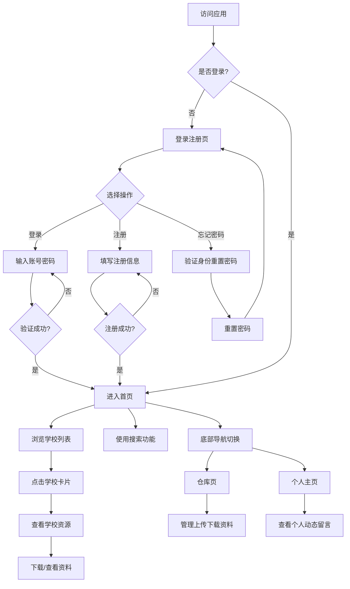

# CampusShare 产品需求文档

## 1. 产品概述
CampusShare是一款校园资源共享H5应用，旨在搭建一个连接各大高校学生的资源共享平台。学生可以分享学习资料、下载他人资源、参与讨论，实现校园资源的有效流通和价值最大化。
- **核心目标**：打破校际壁垒，促进教育资源公平共享，帮助学生更高效地获取学习资料
- **目标用户**：全国各大高校在校学生，尤其是需要跨校获取学习资源的学生群体

## 2. 核心功能

### 2.1 用户角色
| 角色 | 注册方式 | 核心权限 |
|------|---------|---------|
| 普通用户 | 手机号/邮箱注册 | 浏览资源、下载资料、上传资料、参与讨论、管理个人主页 |
| 游客 | 无需注册 | 仅可浏览首页学校列表，无法查看资源详情 |

### 2.2 功能模块
1. **登录注册页**：登录、注册（手机号/邮箱）、忘记密码、记住密码
2. **首页**：顶部搜索栏、学校卡片列表、底部导航栏
3. **仓库页**：我的上传、我的下载、资料分类管理
4. **个人主页**：个人动态、论坛留言、资料统计、个人设置

### 2.3 页面详情
| 页面名称 | 模块名称 | 功能描述 |
|---------|---------|---------|
| 登录注册页 | 登录表单 | 用户名/手机号/邮箱登录，密码输入，记住密码选项，登录按钮 |
| 登录注册页 | 注册表单 | 手机号注册、邮箱注册两种方式，验证码验证，密码设置 |
| 登录注册页 | 忘记密码 | 通过手机号或邮箱找回密码，验证身份后重置密码 |
| 首页 | 顶部搜索栏 | 输入关键词搜索学校、资料、用户 |
| 首页 | 学校卡片列表 | 圆角方框卡片展示学校校徽和名称，点击进入学校详情 |
| 首页 | 底部导航栏 | 首页、仓库、个人主页三个主要导航入口 |
| 仓库页 | 我的上传 | 展示用户上传的所有资料，支持编辑、删除操作 |
| 仓库页 | 我的下载 | 展示用户下载的所有资料，支持重新下载、收藏操作 |
| 仓库页 | 资料分类 | 按学科、类型、时间等维度分类管理资料 |
| 个人主页 | 个人动态 | 类似贴吧的用户动态展示，显示用户上传资料、发表留言的历史记录 |
| 个人主页 | 论坛留言 | 用户在各个论坛发表的留言和讨论记录 |
| 个人主页 | 资料统计 | 上传数量、下载次数、获赞数量等数据统计 |
| 个人主页 | 个人设置 | 头像、昵称、密码、绑定手机/邮箱等个人设置 |

## 3. 核心流程

### 3.1 用户注册登录流程
用户首次访问应用时，看到登录页面。如果未注册，点击注册按钮进入注册流程，可选择手机号或邮箱注册，填写基本信息并设置密码。注册成功后自动跳转到首页。已注册用户可直接登录，勾选"记住密码"后下次自动填充登录信息。忘记密码的用户可通过手机号或邮箱验证身份后重置密码。

### 3.2 首页浏览流程
用户登录后进入首页，首页顶部为搜索栏，支持搜索学校、资料和用户。页面主体为学校卡片列表，每个卡片包含学校校徽和名称，采用圆角方框设计，排列整齐。用户点击学校卡片后可进入该校的资源列表。底部为固定导航栏，包含首页、仓库、个人主页三个主要功能入口。

### 3.3 资源管理流程
用户在仓库页可查看自己上传和下载的所有资料。上传资料时填写资料名称、分类、描述等信息。下载的资料按时间倒序展示，支持收藏和重新下载。用户可对资料进行分类管理，方便后续查找。

### 3.4 社区互动流程
用户在个人主页可查看自己的所有动态，包括上传的资料和在论坛发表的留言。类似贴吧的展示形式，支持点赞、评论等互动功能。其他用户可访问个人主页查看公开的资料和动态。

## 4. 用户界面设计

### 4.1 设计风格
- **主色调**：清爽的蓝色系（参考Twitter的蓝色#1DA1F2和Google的蓝绿色#4285F4），辅以白色和浅灰色
- **辅助色**：深灰色文字（#14171A）、浅灰色背景（#F5F8FA）、绿色成功提示（#17BF63）
- **按钮风格**：圆角矩形按钮，主按钮使用品牌蓝色，次按钮使用白色边框
- **字体**：系统默认字体，标题使用16-20px粗体，正文使用14-16px常规体
- **布局风格**：卡片式布局，顶部固定搜索栏，底部固定导航栏，中间内容区域可滚动
- **图标风格**：简洁线性图标，颜色与主色调保持一致
- **整体风格**：简约现代，大量留白，清晰的视觉层次

### 4.2 页面设计概览
| 页面名称 | 模块名称 | UI元素 |
|---------|---------|---------|
| 登录注册页 | 登录表单 | 居中卡片式布局，白色背景，蓝色主按钮，输入框带图标，底部有注册和忘记密码链接 |
| 登录注册页 | 注册表单 | 分步式表单，手机号/邮箱输入框，验证码输入，密码设置，进度指示器 |
| 登录注册页 | 忘记密码 | 简洁的单步流程，输入手机号或邮箱，发送验证码，重置密码表单 |
| 首页 | 顶部搜索栏 | 固定顶部，白色背景，圆角搜索框，搜索图标，输入时显示下拉建议 |
| 首页 | 学校卡片列表 | 2列网格布局，圆角方框卡片（border-radius: 12px），白色卡片背景，阴影效果，校徽居中显示，学校名称在下方 |
| 首页 | 底部导航栏 | 固定底部，白色背景，3个图标按钮，当前页面高亮显示，图标带文字标签 |
| 仓库页 | 标签切换 | 顶部标签栏，"我的上传"和"我的下载"两个标签，选中标签带下划线 |
| 仓库页 | 资料列表 | 卡片式列表，每个卡片包含资料缩略图、名称、分类标签、时间、操作按钮 |
| 个人主页 | 个人信息卡 | 顶部圆形头像，用户昵称，简介，关注/粉丝数量，编辑按钮 |
| 个人主页 | 动态列表 | 类似贴吧的卡片式动态，包含内容、图片、时间、点赞评论按钮 |

### 4.3 响应式设计
- **桌面优先**：设计以桌面端为主，最小宽度1200px，最大宽度1440px居中显示
- **移动端适配**：在桌面设计基础上进行移动端适配，支持375px-768px宽度范围
- **触控优化**：移动端按钮和卡片点击区域不小于44px，支持手势操作如滑动切换

### 4.4 交互动效
- **页面跳转**：使用淡入淡出动画，持续时间300ms
- **按钮反馈**：点击时颜色加深，添加轻微缩放效果
- **卡片悬停**：桌面端鼠标悬停时卡片轻微上浮，添加阴影
- **加载状态**：骨架屏加载效果，渐变动画
- **下拉刷新**：移动端支持下拉刷新功能，带旋转图标