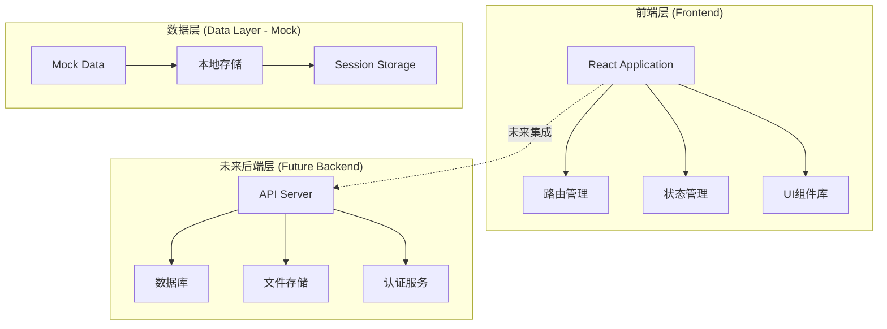
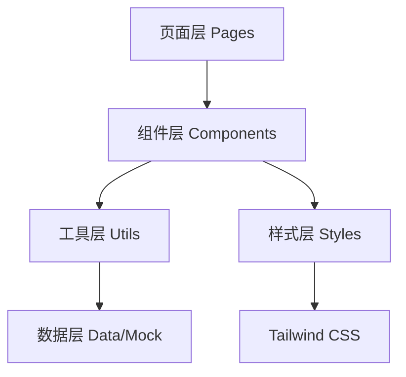
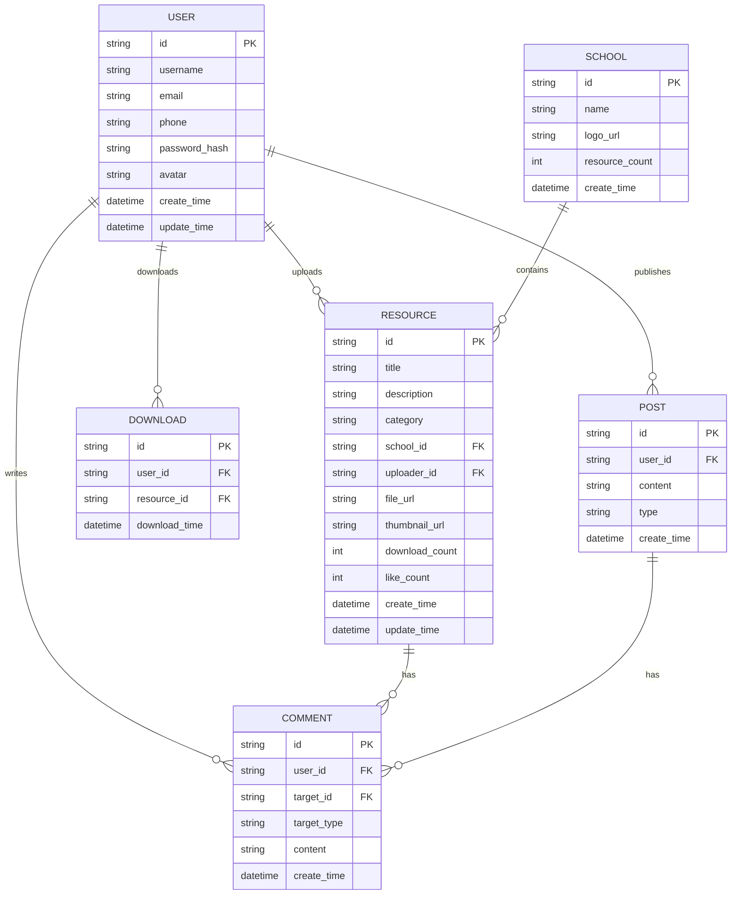

# CampusShare 技术架构文档

## 1. 架构设计

### 1.1 整体架构


### 1.2 前端架构分层


## 2. 技术说明

### 2.1 前端技术栈
- **框架**: React 18
- **UI库**: Tailwind CSS 3
- **构建工具**: Vite
- **路由**: React Router v6
- **状态管理**: React Context API + useReducer (轻量级状态管理)
- **图标**: Lucide React (简洁线性图标库)
- **字体**: 系统默认字体栈

### 2.2 初始化工具
- **项目初始化**: Vite + React模板
- **命令**: `npm create vite@latest campushare -- --template react`

### 2.3 后端技术栈
- **当前阶段**: 暂不实现后端，使用Mock数据
- **未来规划**: Spring Boot + MySQL + Redis + Kafka (用户Java技术栈)

### 2.4 数据管理
- **当前阶段**: 使用本地Mock数据和Session Storage模拟用户状态
- **用户认证**: 前端模拟登录状态，使用Session Storage存储用户信息和token
- **资料数据**: 使用静态JSON文件模拟资料数据

## 3. 路由定义

| 路由路径 | 页面名称 | 功能描述 |
|---------|---------|---------|
| `/` | 登录注册页 | 用户登录、注册、找回密码的入口页面 |
| `/home` | 首页 | 学校卡片列表，搜索功能 |
| `/school/:schoolId` | 学校详情页 | 展示特定学校的资源列表（未来实现） |
| `/warehouse` | 仓库页 | 我的上传、我的下载资料管理 |
| `/profile` | 个人主页 | 个人动态、论坛留言、资料统计 |

### 3.1 路由守卫
- **认证路由**: `/home`, `/warehouse`, `/profile` 需要登录才能访问
- **游客路由**: `/` 登录注册页可公开访问
- **跳转逻辑**: 未登录用户访问认证路由时自动跳转到登录页

## 4. API定义（未来后端接口设计）

### 4.1 用户认证接口
```typescript
// 用户登录
POST /api/auth/login
Request: {
  account: string;  // 手机号、邮箱或用户名
  password: string;
  rememberMe?: boolean;
}
Response: {
  code: number;
  data: {
    token: string;
    user: {
      id: string;
      username: string;
      email: string;
      phone: string;
      avatar: string;
    };
  };
}

// 用户注册
POST /api/auth/register
Request: {
  registerType: 'phone' | 'email';
  account: string;  // 手机号或邮箱
  password: string;
  verifyCode: string;
  username: string;
}
Response: {
  code: number;
  message: string;
  data: {
    token: string;
    user: User;
  };
}

// 发送验证码
POST /api/auth/send-verify-code
Request: {
  type: 'phone' | 'email';
  account: string;
}
Response: {
  code: number;
  message: string;
}

// 重置密码
POST /api/auth/reset-password
Request: {
  account: string;
  verifyCode: string;
  newPassword: string;
}
Response: {
  code: number;
  message: string;
}
```

### 4.2 学校接口
```typescript
// 获取学校列表
GET /api/schools
Query: {
  keyword?: string;  // 搜索关键词
  page?: number;
  pageSize?: number;
}
Response: {
  code: number;
  data: {
    schools: School[];
    total: number;
  };
}

// 学校数据结构
interface School {
  id: string;
  name: string;
  logo: string;  // 校徽URL
  resourceCount: number;  // 资源数量
}
```

### 4.3 资源接口
```typescript
// 获取资源列表
GET /api/resources
Query: {
  schoolId?: string;
  category?: string;
  keyword?: string;
  page?: number;
  pageSize?: number;
}
Response: {
  code: number;
  data: {
    resources: Resource[];
    total: number;
  };
}

// 资源数据结构
interface Resource {
  id: string;
  title: string;
  description: string;
  category: string;
  schoolId: string;
  uploaderId: string;
  uploaderName: string;
  downloadCount: number;
  likeCount: number;
  createTime: string;
  updateTime: string;
  fileUrl: string;
  thumbnail: string;
}
```

### 4.4 用户资料接口
```typescript
// 获取用户上传的资源
GET /api/users/:userId/uploads
Query: {
  page?: number;
  pageSize?: number;
}
Response: {
  code: number;
  data: {
    resources: Resource[];
    total: number;
  };
}

// 获取用户下载的资源
GET /api/users/:userId/downloads
Query: {
  page?: number;
  pageSize?: number;
}
Response: {
  code: number;
  data: {
    resources: Resource[];
    total: number;
  };
}
```

### 4.5 社区接口
```typescript
// 获取用户动态
GET /api/users/:userId/posts
Query: {
  page?: number;
  pageSize?: number;
}
Response: {
  code: number;
  data: {
    posts: Post[];
    total: number;
  };
}

// 动态数据结构
interface Post {
  id: string;
  userId: string;
  userName: string;
  userAvatar: string;
  content: string;
  images?: string[];
  likeCount: number;
  commentCount: number;
  createTime: string;
  type: 'upload' | 'comment' | 'share';  // 动态类型
}
```

## 5. 数据模型（未来数据库设计）

### 5.1 实体关系图


### 5.2 数据定义语言（DDL）

```sql
-- 用户表
CREATE TABLE users (
    id VARCHAR(36) PRIMARY KEY,
    username VARCHAR(50) NOT NULL UNIQUE,
    email VARCHAR(100) UNIQUE,
    phone VARCHAR(20) UNIQUE,
    password_hash VARCHAR(255) NOT NULL,
    avatar VARCHAR(255),
    create_time TIMESTAMP DEFAULT CURRENT_TIMESTAMP,
    update_time TIMESTAMP DEFAULT CURRENT_TIMESTAMP ON UPDATE CURRENT_TIMESTAMP,
    INDEX idx_username (username),
    INDEX idx_email (email),
    INDEX idx_phone (phone)
);

-- 学校表
CREATE TABLE schools (
    id VARCHAR(36) PRIMARY KEY,
    name VARCHAR(100) NOT NULL UNIQUE,
    logo_url VARCHAR(255),
    resource_count INT DEFAULT 0,
    create_time TIMESTAMP DEFAULT CURRENT_TIMESTAMP,
    INDEX idx_name (name)
);

-- 资源表
CREATE TABLE resources (
    id VARCHAR(36) PRIMARY KEY,
    title VARCHAR(200) NOT NULL,
    description TEXT,
    category VARCHAR(50),
    school_id VARCHAR(36) NOT NULL,
    uploader_id VARCHAR(36) NOT NULL,
    file_url VARCHAR(255) NOT NULL,
    thumbnail_url VARCHAR(255),
    download_count INT DEFAULT 0,
    like_count INT DEFAULT 0,
    create_time TIMESTAMP DEFAULT CURRENT_TIMESTAMP,
    update_time TIMESTAMP DEFAULT CURRENT_TIMESTAMP ON UPDATE CURRENT_TIMESTAMP,
    FOREIGN KEY (school_id) REFERENCES schools(id),
    FOREIGN KEY (uploader_id) REFERENCES users(id),
    INDEX idx_school (school_id),
    INDEX idx_uploader (uploader_id),
    INDEX idx_category (category),
    FULLTEXT idx_title_desc (title, description)
);

-- 下载记录表
CREATE TABLE downloads (
    id VARCHAR(36) PRIMARY KEY,
    user_id VARCHAR(36) NOT NULL,
    resource_id VARCHAR(36) NOT NULL,
    download_time TIMESTAMP DEFAULT CURRENT_TIMESTAMP,
    FOREIGN KEY (user_id) REFERENCES users(id),
    FOREIGN KEY (resource_id) REFERENCES resources(id),
    INDEX idx_user (user_id),
    INDEX idx_resource (resource_id)
);

-- 动态表
CREATE TABLE posts (
    id VARCHAR(36) PRIMARY KEY,
    user_id VARCHAR(36) NOT NULL,
    content TEXT NOT NULL,
    type ENUM('upload', 'comment', 'share') NOT NULL,
    create_time TIMESTAMP DEFAULT CURRENT_TIMESTAMP,
    FOREIGN KEY (user_id) REFERENCES users(id),
    INDEX idx_user (user_id),
    INDEX idx_type (type)
);

-- 评论表
CREATE TABLE comments (
    id VARCHAR(36) PRIMARY KEY,
    user_id VARCHAR(36) NOT NULL,
    target_id VARCHAR(36) NOT NULL,
    target_type ENUM('resource', 'post') NOT NULL,
    content TEXT NOT NULL,
    create_time TIMESTAMP DEFAULT CURRENT_TIMESTAMP,
    FOREIGN KEY (user_id) REFERENCES users(id),
    INDEX idx_user (user_id),
    INDEX idx_target (target_id, target_type)
);
```

## 6. 项目目录结构

```
campushare/
├── public/
│   └── index.html
├── src/
│   ├── assets/          # 静态资源
│   │   ├── images/      # 图片资源
│   │   └── icons/       # 图标资源
│   ├── components/      # 可复用组件
│   │   ├── common/      # 通用组件
│   │   │   ├── Button.jsx
│   │   │   ├── Input.jsx
│   │   │   ├── Card.jsx
│   │   │   └── NavBar.jsx
│   │   ├── auth/        # 认证相关组件
│   │   │   ├── LoginForm.jsx
│   │   │   ├── RegisterForm.jsx
│   │   │   └── ForgotPasswordForm.jsx
│   │   ├── home/        # 首页组件
│   │   │   ├── SearchBar.jsx
│   │   │   └── SchoolCard.jsx
│   │   ├── warehouse/   # 仓库页组件
│   │   │   ├── ResourceCard.jsx
│   │   │   └── TabSwitch.jsx
│   │   └── profile/     # 个人主页组件
│   │       ├── ProfileCard.jsx
│   │       └── PostCard.jsx
│   ├── pages/           # 页面组件
│   │   ├── AuthPage.jsx
│   │   ├── HomePage.jsx
│   │   ├── WarehousePage.jsx
│   │   └── ProfilePage.jsx
│   ├── context/         # Context状态管理
│   │   └── AuthContext.jsx
│   ├── data/            # Mock数据
│   │   ├── schools.json
│   │   ├── resources.json
│   │   └── users.json
│   ├── utils/           # 工具函数
│   │   ├── auth.js      # 认证相关工具
│   │   ├── storage.js   # 本地存储工具
│   │   └── validation.js # 表单验证工具
│   ├── styles/          # 全局样式
│   │   └── index.css
│   ├── router/          # 路由配置
│   │   └── index.jsx
│   ├── App.jsx          # 根组件
│   └── main.jsx         # 入口文件
├── .gitignore
├── package.json
├── vite.config.js
├── tailwind.config.js
└── postcss.config.js
```

## 7. 开发规范

### 7.1 命名规范
- **文件命名**: 组件文件使用PascalCase（如 `SchoolCard.jsx`）
- **变量命名**: 使用camelCase（如 `userName`）
- **常量命名**: 使用UPPER_SNAKE_CASE（如 `API_BASE_URL`）
- **CSS类名**: 使用Tailwind CSS工具类，自定义类使用kebab-case

### 7.2 组件规范
- 每个组件独立一个文件
- 使用函数组件和Hooks
- 组件顶部添加注释说明组件功能
- Props使用解构赋值，并添加默认值和类型检查

### 7.3 Git提交规范
- `feat`: 新功能
- `fix`: 修复Bug
- `docs`: 文档更新
- `style`: 代码格式调整
- `refactor`: 重构代码
- `test`: 测试相关
- `chore`: 构建工具或辅助工具变动

## 8. 性能优化策略

### 8.1 前端性能优化
- **代码分割**: 使用React.lazy和Suspense进行路由级代码分割
- **图片优化**: 使用合适的图片格式和尺寸，延迟加载图片
- **虚拟列表**: 长列表使用虚拟滚动优化性能
- **缓存策略**: 利用浏览器缓存和Service Worker缓存静态资源

### 8.2 用户体验优化
- **骨架屏**: 数据加载时显示骨架屏，提升感知速度
- **预加载**: 预加载关键资源，如首屏图片和字体
- **动画优化**: 使用CSS动画和transform优化动画性能
- **响应式设计**: 确保在不同设备上都有良好的用户体验