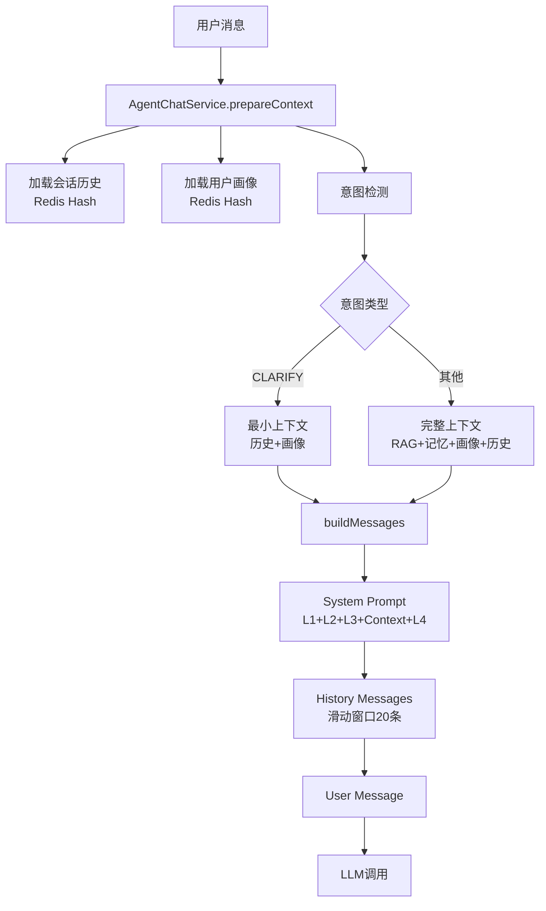
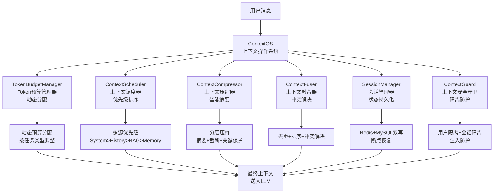
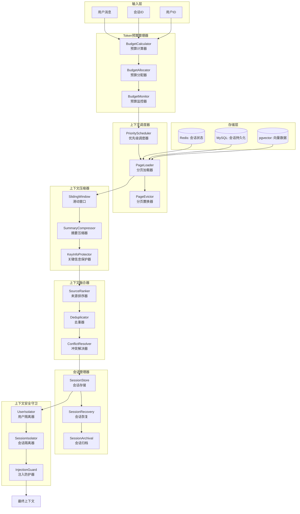
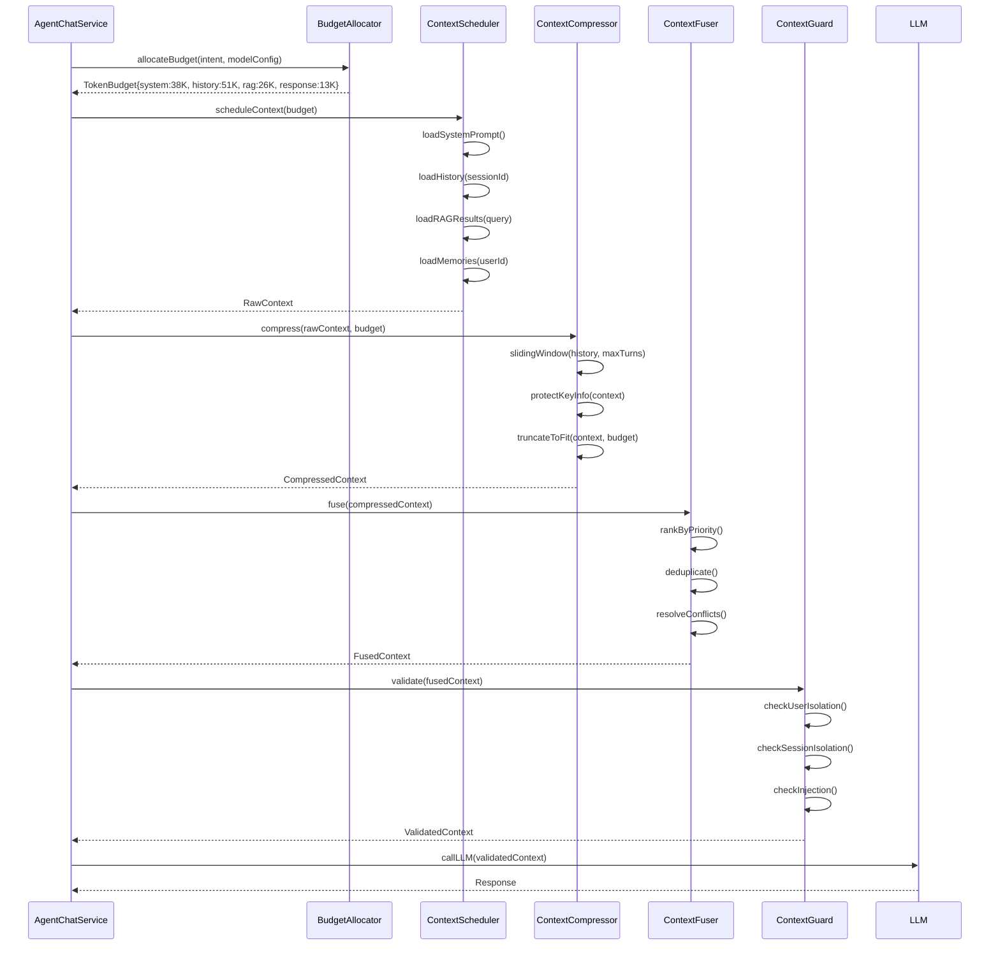
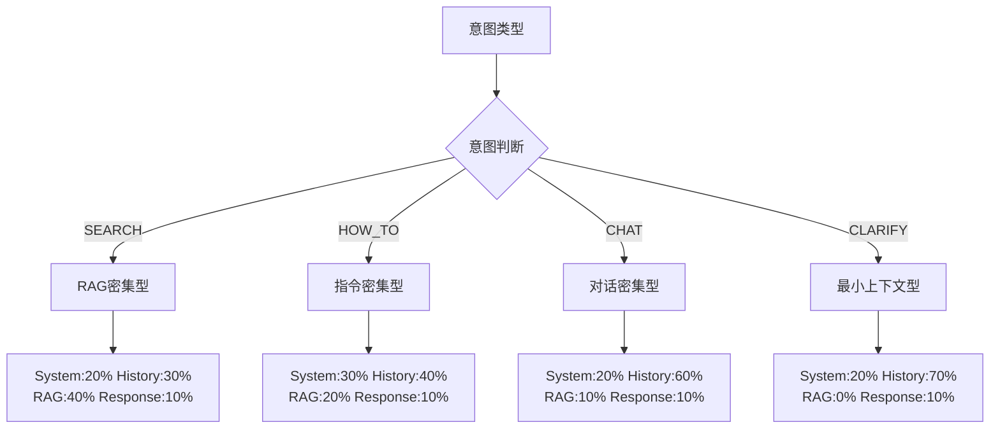
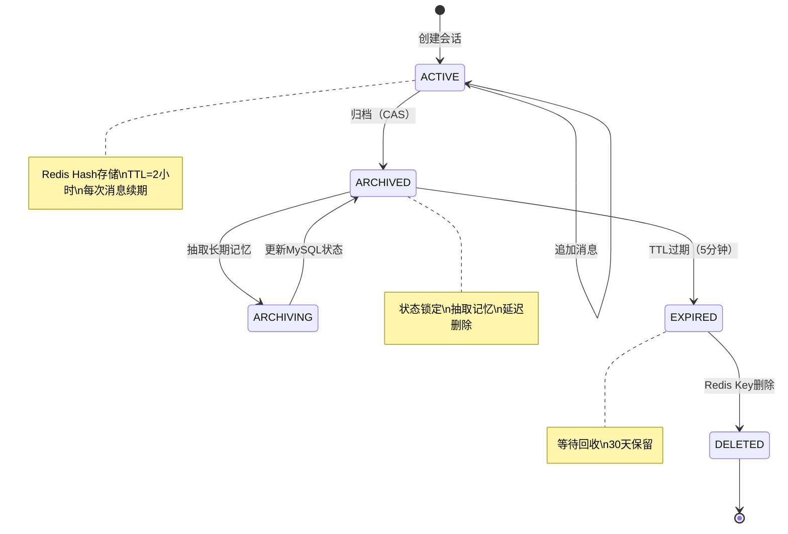

# 上下文工程技术设计文档

## 文档信息

| 项目 | 内容 |
|------|------|
| **文档版本** | v1.0 |
| **创建日期** | 2026-07-14 |
| **适用项目** | CampusShare Agent |
| **模块名称** | Context Engineering |
| **设计目标** | 企业级上下文工程系统，实现Token预算智能分配、多源上下文融合、滑动窗口压缩、会话状态管理、上下文安全防护 |

---

## 1. 范式反思：从消息拼接到上下文操作系统

### 1.1 当前架构分析

当前系统已实现基础上下文管理：



**核心特点：**
- ✅ 分层上下文：工作记忆（当前轮）+ 短期记忆（历史摘要）+ 长期记忆（用户画像）
- ✅ Token预算分配：System 30% + History 40% + RAG 20% + Response 10%
- ✅ 滑动窗口：保留最近20条消息，超出时摘要压缩
- ✅ 多源融合：RAG检索结果、长期记忆、用户画像、工具结果
- ✅ 会话管理：Redis Hash存储（session:hash:{sessionId}），TTL 2小时
- ✅ 上下文快照：ContextSnapshot记录每轮上下文组成和Token分布

**当前Token预算分配（128K模型）：**

| 区域 | 比例 | Token数 | 内容 |
|------|------|---------|------|
| System Prompt | 30% | ~38K | 平台Prompt + 任务Prompt + 示例 + 护栏 |
| History | 40% | ~51K | 滑动窗口20条 + 摘要 |
| RAG + Memory | 20% | ~26K | 检索结果 + 用户画像 |
| Response | 10% | ~13K | LLM输出预留 |

### 1.2 架构短板分析

| 维度 | 当前状态 | 问题 | 影响 |
|------|----------|------|------|
| **Token预算** | 固定比例分配 | 不根据任务动态调整 | RAG密集型任务RAG空间不足 |
| **上下文压缩** | 简单截断 | 摘要质量低、无关键信息保护 | 重要上下文丢失 |
| **多源融合** | 简单拼接 | 无优先级排序、无冲突解决 | 上下文冗余或矛盾 |
| **会话状态** | Redis单点 | 无持久化、无恢复机制 | Redis故障会话丢失 |
| **上下文安全** | 无隔离 | 用户间/会话间无严格隔离 | 潜在上下文泄露 |
| **可观测性** | ContextSnapshot仅日志 | 无指标、无告警 | 问题定位难 |

### 1.3 范式转变：上下文操作系统

**新定位：** 从"消息拼接工具"升级为"上下文操作系统"，像操作系统管理内存一样管理上下文窗口。



**核心隐喻：上下文 = 内存，Token = 物理地址空间**

| 操作系统概念 | 上下文工程对应 | 说明 |
|-------------|---------------|------|
| **虚拟内存** | Token虚拟地址空间 | 逻辑上下文 > 物理Token窗口 |
| **内存分页** | 上下水分页 | 按优先级分页加载到Token窗口 |
| **页面置换** | 上下文置换（LRU/LFU） | 低优先级上下文被换出 |
| **内存映射** | 上下文映射 | 多源上下文映射到统一地址空间 |
| **进程隔离** | 会话隔离 | 每个会话独立上下文空间 |
| **OOM保护** | Token溢出保护 | 严格不超过模型上下文窗口 |

### 1.4 业界方案对比

| 方案 | Token管理 | 上下文压缩 | 多源融合 | 会话管理 | 安全防护 | 成熟度 |
|------|-----------|-----------|----------|----------|----------|--------|
| **LangChain** | 基础 | ConversationBufferWindow | 无 | 无 | 无 | 高 |
| **LlamaIndex** | 基础 | 摘要索引 | 有 | 无 | 无 | 高 |
| **MemGPT** | 高级 | 分层记忆 | 有 | 有 | 无 | 中 |
| **Letta** | 高级 | 自编辑记忆 | 有 | 有 | 基础 | 中 |
| **自研方案** | 动态预算 | 分层压缩 | 智能融合 | 双写恢复 | 完整防护 | 中 |

### 1.5 本项目选择

**当前阶段：**
- ✅ 实现动态Token预算分配
- ✅ 实现分层上下文压缩（摘要+关键信息保护）
- ✅ 实现多源上下文优先级融合
- ✅ 实现会话状态Redis+MySQL双写

**未来阶段：**
- ✅ 实现上下文自编辑（LLM自主决定保留/丢弃）
- ✅ 实现上下文版本控制（时间旅行）
- ✅ 实现跨会话上下文迁移

---

## 2. 需求分析

### 2.1 业务目标

- **核心目标**：构建高效、智能的上下文管理系统，最大化LLM输出质量
- **商业价值**：降低Token消耗成本，提升对话连贯性，保障上下文安全
- **量化指标**：
  - 上下文构建延迟 P99 < 20ms
  - Token利用率 ≥ 85%（有效Token / 总Token）
  - 会话恢复成功率 ≥ 99.9%
  - 上下文泄露事件 = 0

### 2.2 流量特征

- **平均 QPS**：100（上下文构建）
- **峰值 QPS**：1,000（活动期间）
- **平均上下文大小**：4K Token
- **最大上下文大小**：128K Token
- **会话历史深度**：平均20轮，最大100轮

### 2.3 非功能要求

- **性能要求**：
  - 上下文构建 P99 < 20ms
  - 上下文压缩 P99 < 50ms
  - 会话加载 P99 < 10ms
- **可用性要求**：
  - SLA：99.9%
  - 会话数据持久性：99.99%
- **安全性要求**：
  - 用户间上下文隔离：100%
  - 会话间上下文隔离：100%

---

## 3. 容量规划

### 3.1 流量预估

| 指标 | 当前 | 未来1年 | 未来3年 |
|------|------|---------|---------|
| 上下文构建 QPS | 100 | 1,000 | 10,000 |
| 活跃会话数 | 500 | 5,000 | 50,000 |
| 会话历史深度（平均） | 20轮 | 30轮 | 50轮 |

### 3.2 存储规模

| 存储类型 | 当前 | 未来1年 | 未来3年 |
|----------|------|---------|---------|
| Redis（会话状态） | 500MB | 5GB | 50GB |
| MySQL（会话持久化） | 100MB | 1GB | 10GB |
| Redis（上下文缓存） | 200MB | 2GB | 20GB |

---

## 4. 现状分析

### 4.1 当前方案

**核心代码：**

- [AgentChatService.java](file:///e:/workspace_work/CampusShare/backend/campushare-agent/src/main/java/com/campushare/agent/service/AgentChatService.java)：上下文准备核心逻辑
- [ConversationMemoryService.java](file:///e:/workspace_work/CampusShare/backend/campushare-agent/src/main/java/com/campushare/agent/service/ConversationMemoryService.java)：短期对话记忆管理
- [AgentSessionService.java](file:///e:/workspace_work/CampusShare/backend/campushare-agent/src/main/java/com/campushare/agent/service/AgentSessionService.java)：会话管理服务
- [ContextAssembler.java](file:///e:/workspace_work/CampusShare/backend/campushare-agent/src/main/java/com/campushare/agent/service/ContextAssembler.java)：上下文组装器
- [ContextSnapshot.java](file:///e:/workspace_work/CampusShare/backend/campushare-agent/src/main/java/com/campushare/agent/dto/ContextSnapshot.java)：上下文快照DTO

**数据流：**

```mermaid
flowchart LR
    subgraph Redis
        A[session:hash:{sessionId}]
        B[user:profile:{userId}]
        C[session:turns:{sessionId}]
    end
    
    subgraph MySQL
        D[agent_sessions]
        E[agent_turns]
    end
    
    subgraph pgvector
        F[knowledge_vectors]
        G[memory_vectors]
    end
    
    A --> H[ContextAssembler]
    B --> H
    C --> H
    D --> I[AgentSessionService]
    E --> J[TurnRepository]
    F --> K[RetrievalService]
    G --> L[MemoryRetrievalService]
    
    H & I & J & K & L --> M[AgentChatService<br/>buildMessages]
    M --> N[LLM调用]
```

**上下文构建流程（当前）：**

```java
// AgentChatService.prepareContext() 简化版
ChatContext ctx = new ChatContext();
ctx.setUserId(userId);
ctx.setSessionId(sessionId);
ctx.setUserMessage(userMessage);

// 1. 加载会话历史
List<AgentTurn> history = turnRepository.findBySessionIdOrderByTurnNumber(sessionId);
ctx.setSessionHistory(history);

// 2. 加载用户画像
UserProfile profile = loadUserProfile(userId);
ctx.setUserProfile(profile);

// 3. 意图检测
IntentResult intent = intentDetector.detect(userMessage, history, profile);
ctx.setIntentResult(intent);

// 4. RAG检索（非CLARIFY意图）
if (intent.getIntent() != Intent.CLARIFY) {
    List<RetrievalResult> ragResults = retrievalService.retrieve(userMessage, intent);
    ctx.setRetrievalResults(ragResults);
}

// 5. 记忆检索
List<MemoryResult> memories = memoryRetrievalService.retrieve(userId, userMessage);
ctx.setMemoryResults(memories);

// 6. 构建消息
List<Map<String, String>> messages = buildMessages(ctx);
```

### 4.2 问题清单

| 优先级 | 问题 | 影响 | 根因 |
|--------|------|------|------|
| P0 | Token预算固定比例 | RAG密集型任务空间不足 | 未实现动态分配 |
| P0 | 上下文压缩简单截断 | 重要信息丢失 | 无关键信息保护 |
| P1 | 会话状态仅Redis | Redis故障会话丢失 | 无MySQL持久化 |
| P1 | 多源上下文简单拼接 | 冗余或矛盾 | 无优先级融合 |
| P1 | 无上下文隔离校验 | 潜在泄露风险 | 无安全守卫 |
| P2 | 无上下文版本控制 | 无法回溯 | 无快照机制 |
| P2 | 无跨会话迁移 | 用户切换会话丢失上下文 | 无迁移机制 |

---

## 5. 业界方案调研

### 5.1 方案对比

| 维度 | LangChain | MemGPT/Letta | 自研方案 |
|------|-----------|-------------|----------|
| **Token管理** | 固定窗口 | 自编辑虚拟上下文 | 动态预算+分页 |
| **压缩策略** | 滑动窗口/摘要 | LLM自编辑 | 分层压缩+关键保护 |
| **多源融合** | 无 | 基础 | 优先级融合+冲突解决 |
| **会话管理** | 无 | 有 | Redis+MySQL双写 |
| **安全防护** | 无 | 无 | 用户/会话隔离+注入防护 |
| **可控性** | 中 | 中 | 高 |

### 5.2 大厂实践案例

**案例1：MemGPT（UC Berkeley）**
- 核心理念：将LLM上下文视为虚拟内存，实现无限上下文
- 实现方式：主上下文（工作记忆）+ 外部存储（归档记忆），LLM自主决定何时换入/换出
- 优势：理论上无限上下文长度
- 劣势：LLM自编辑开销大、不稳定

**案例2：Letta（MemGPT商业化）**
- 核心理念：有状态Agent，持久化记忆
- 实现方式：Core Memory（可编辑）+ Recall Memory（搜索）+ Archival Memory（长期）
- 优势：完整的记忆分层
- 劣势：复杂度高

**案例3：OpenAI ChatGPT**
- 核心理念：滑动窗口 + 摘要
- 实现方式：保留最近N条消息 + 早期消息摘要
- 优势：简单稳定
- 劣势：摘要质量不可控

### 5.3 关键技术选型

#### 5.3.1 Token预算分配策略

| 策略 | 原理 | 优点 | 缺点 | 适用场景 |
|------|------|------|------|----------|
| **固定比例** | 预定义各区域比例 | 简单 | 不灵活 | 开发测试 |
| **动态分配** | 按任务类型调整 | 灵活 | 复杂 | 企业级 |
| **优先级填充** | 按优先级依次填充 | 最优 | 需要优先级定义 | 高精度 |
| **自适应** | ML驱动 | 智能 | 训练成本 | 大规模 |

**选型建议：**
- **当前阶段**：动态分配（按意图类型调整比例）
- **未来阶段**：优先级填充 + 自适应

#### 5.3.2 上下文压缩策略

| 策略 | 原理 | 优点 | 缺点 | 适用场景 |
|------|------|------|------|----------|
| **滑动窗口** | 保留最近N条 | 简单 | 丢失早期信息 | 通用 |
| **摘要压缩** | LLM生成摘要 | 保留要点 | 成本高 | 高质量 |
| **关键信息保护** | 标记关键信息不压缩 | 精准 | 需要标记 | 企业级 |
| **分层压缩** | 多层级渐进压缩 | 平衡 | 复杂 | 大规模 |

**选型建议：**
- **当前阶段**：滑动窗口 + 摘要压缩
- **未来阶段**：关键信息保护 + 分层压缩

### 5.4 选型决策

**最终方案：自研上下文操作系统**

**选型理由：**
1. **可控性**：Token预算精确控制，不依赖LLM自编辑
2. **稳定性**：确定性压缩，不引入LLM不确定性
3. **成本**：避免频繁LLM摘要调用
4. **安全**：完整的上下文隔离和防护

---

## 6. 方案设计

### 6.1 架构设计

**整体架构图：**



**模块职责：**

| 模块 | 职责 | 核心组件 |
|------|------|----------|
| **Token预算管理器** | 动态分配Token预算 | BudgetCalculator, BudgetAllocator, BudgetMonitor |
| **上下文调度器** | 按优先级调度上下文加载 | PriorityScheduler, PageLoader, PageEvictor |
| **上下文压缩器** | 智能压缩超出预算的上下文 | SlidingWindow, SummaryCompressor, KeyInfoProtector |
| **上下文融合器** | 多源上下文融合去重 | SourceRanker, Deduplicator, ConflictResolver |
| **会话管理器** | 会话生命周期管理 | SessionStore, SessionRecovery, SessionArchival |
| **上下文安全守卫** | 上下文隔离和防护 | UserIsolator, SessionIsolator, InjectionGuard |

### 6.2 核心流程

#### 6.2.1 上下文构建主流程



#### 6.2.2 Token预算动态分配



**各意图Token预算分配表（128K模型）：**

| 意图 | System | History | RAG+Memory | Response | 说明 |
|------|--------|---------|------------|----------|------|
| SEARCH | 20% (~26K) | 30% (~38K) | 40% (~51K) | 10% (~13K) | RAG密集型，最大化检索空间 |
| HOW_TO | 30% (~38K) | 40% (~51K) | 20% (~26K) | 10% (~13K) | 指令密集型，需要详细System |
| CHAT | 20% (~26K) | 60% (~77K) | 10% (~13K) | 10% (~13K) | 对话密集型，最大化历史 |
| CLARIFY | 20% (~26K) | 70% (~90K) | 0% | 10% (~13K) | 最小上下文，仅历史+画像 |

#### 6.2.3 会话状态机



### 6.3 数据模型

#### 6.3.1 核心实体

**AgentSession（会话实体）**

| 字段 | 类型 | 约束 | 说明 |
|------|------|------|------|
| id | BIGINT | PK, AUTO_INCREMENT | 主键 |
| session_id | VARCHAR(64) | NOT NULL, UNIQUE | 会话ID |
| user_id | BIGINT | NOT NULL, INDEX | 用户ID |
| title | VARCHAR(256) | NULL | 会话标题 |
| status | VARCHAR(32) | DEFAULT 'ACTIVE' | 状态：ACTIVE/ARCHIVED/EXPIRED/DELETED |
| turn_count | INT | DEFAULT 0 | 轮次数 |
| total_tokens | INT | DEFAULT 0 | 总Token消耗 |
| last_active_at | DATETIME | NOT NULL | 最后活跃时间 |
| archived_at | DATETIME | NULL | 归档时间 |
| created_at | DATETIME | DEFAULT NOW() | 创建时间 |
| updated_at | DATETIME | DEFAULT NOW() | 更新时间 |

**AgentTurn（对话轮次实体）**

| 字段 | 类型 | 约束 | 说明 |
|------|------|------|------|
| id | BIGINT | PK, AUTO_INCREMENT | 主键 |
| session_id | VARCHAR(64) | NOT NULL, INDEX | 会话ID |
| user_id | BIGINT | NOT NULL, INDEX | 用户ID |
| turn_number | INT | NOT NULL | 轮次号 |
| user_message | TEXT | NOT NULL | 用户消息 |
| assistant_message | TEXT | NOT NULL | AI回复 |
| intent | VARCHAR(32) | NULL | 意图类型 |
| orchestration_mode | VARCHAR(32) | NULL | 编排模式 |
| input_tokens | INT | DEFAULT 0 | 输入Token |
| output_tokens | INT | DEFAULT 0 | 输出Token |
| latency_ms | INT | DEFAULT 0 | 延迟（ms） |
| context_snapshot | JSON | NULL | 上下文快照 |
| navigate_info | JSON | NULL | 导航信息 |
| refs | JSON | NULL | 引用信息 |
| tool_calls | JSON | NULL | 工具调用记录 |
| created_at | DATETIME | DEFAULT NOW() | 创建时间 |

**索引设计：**
```sql
CREATE INDEX idx_session_user ON agent_sessions(user_id, status);
CREATE INDEX idx_session_active ON agent_sessions(last_active_at);
CREATE INDEX idx_turn_session ON agent_turns(session_id, turn_number);
CREATE INDEX idx_turn_user ON agent_turns(user_id, created_at);
```

#### 6.3.2 缓存数据结构

**Redis Key 设计：**

| Key 模式 | 数据结构 | TTL | 说明 |
|----------|----------|-----|------|
| `session:hash:{sessionId}` | Hash | 2h | 会话元数据 |
| `session:turns:{sessionId}` | List | 2h | 对话历史（滚动） |
| `session:summary:{sessionId}` | String | 2h | 对话摘要 |
| `session:slots:{sessionId}` | Hash | 2h | 槽位信息 |
| `session:pins:{sessionId}` | List | 2h | Pin消息 |
| `user:profile:{userId}` | Hash | 1h | 用户画像 |
| `context:snapshot:{turnId}` | String | 24h | 上下文快照 |

**会话Hash字段：**

| Field | Type | 说明 |
|-------|------|------|
| sessionId | String | 会话ID |
| userId | String | 用户ID |
| title | String | 会话标题 |
| status | String | 状态 |
| turnCount | String | 轮次数 |
| totalTokens | String | 总Token |
| lastActiveAt | String | 最后活跃时间 |
| createdAt | String | 创建时间 |

### 6.4 API 设计

#### 6.4.1 会话管理 API

**创建会话**
```
POST /api/agent/session
```

**响应：**
```json
{
    "code": 200,
    "data": {
        "sessionId": "sess_abc123",
        "title": "新对话",
        "status": "ACTIVE",
        "createdAt": "2026-07-14T10:00:00Z"
    }
}
```

**获取会话列表**
```
GET /api/agent/sessions
```

**获取会话详情**
```
GET /api/agent/session/{sessionId}
```

**删除会话**
```
DELETE /api/agent/session/{sessionId}
```

**获取会话历史**
```
GET /api/agent/session/{sessionId}/turns
```

#### 6.4.2 上下文管理 API

**获取上下文快照**
```
GET /api/agent/turn/{turnId}/context
```

**响应：**
```json
{
    "code": 200,
    "data": {
        "turnId": 123,
        "intent": "SEARCH",
        "orchestrationMode": "REACT",
        "tokenBudget": {
            "system": 25600,
            "history": 38400,
            "rag": 51200,
            "response": 12800
        },
        "tokenUsage": {
            "system": 18000,
            "history": 32000,
            "rag": 45000,
            "response": 8000
        },
        "ragResults": 5,
        "memoryResults": 3,
        "historyTurns": 15,
        "compressed": false
    }
}
```

### 6.5 关键实现

#### 6.5.1 Token预算动态分配器

```java
@Component
public class BudgetAllocator {
    
    // 各意图的Token预算分配比例
    private static final Map<Intent, BudgetConfig> BUDGET_CONFIGS = Map.of(
        Intent.SEARCH, new BudgetConfig(0.20, 0.30, 0.40, 0.10),
        Intent.HOW_TO, new BudgetConfig(0.30, 0.40, 0.20, 0.10),
        Intent.CHAT,   new BudgetConfig(0.20, 0.60, 0.10, 0.10),
        Intent.CLARIFY,new BudgetConfig(0.20, 0.70, 0.00, 0.10)
    );
    
    public TokenBudget allocate(Intent intent, int maxTokens) {
        BudgetConfig config = BUDGET_CONFIGS.getOrDefault(intent, 
            new BudgetConfig(0.25, 0.45, 0.20, 0.10));
        
        return new TokenBudget(
            (int)(maxTokens * config.systemRatio()),
            (int)(maxTokens * config.historyRatio()),
            (int)(maxTokens * config.ragRatio()),
            (int)(maxTokens * config.responseRatio())
        );
    }
    
    // 动态调整：当RAG结果超出预算时，从History借用
    public TokenBudget adjust(TokenBudget original, int actualRagTokens) {
        int ragOverflow = actualRagTokens - original.ragTokens();
        if (ragOverflow <= 0) return original;
        
        // 从History借用，但保留最低10K
        int minHistory = 10000;
        int borrowable = original.historyTokens() - minHistory;
        int actualBorrow = Math.min(ragOverflow, borrowable);
        
        return new TokenBudget(
            original.systemTokens(),
            original.historyTokens() - actualBorrow,
            original.ragTokens() + actualBorrow,
            original.responseTokens()
        );
    }
}
```

#### 6.5.2 分层上下文压缩器

```java
@Component
public class ContextCompressor {
    
    // 三层压缩策略
    public CompressedContext compress(RawContext raw, TokenBudget budget) {
        CompressedContext result = new CompressedContext();
        
        // Layer 1: System Prompt（不压缩，固定优先级最高）
        result.setSystem(raw.getSystemPrompt());
        
        // Layer 2: History（滑动窗口 + 摘要）
        List<Turn> history = raw.getHistory();
        int historyBudget = budget.historyTokens();
        
        if (countTokens(history) <= historyBudget) {
            result.setHistory(history);
        } else {
            // 2a: 保留Pin消息（不压缩）
            List<Turn> pinned = filterPinned(history);
            historyBudget -= countTokens(pinned);
            
            // 2b: 滑动窗口保留最近N条
            int recentCount = Math.min(history.size(), 20);
            List<Turn> recent = history.subList(history.size() - recentCount, history.size());
            
            if (countTokens(recent) <= historyBudget) {
                // 2c: 早期消息生成摘要
                List<Turn> early = history.subList(0, history.size() - recentCount);
                String summary = generateSummary(early);
                result.setHistorySummary(summary);
                result.setHistory(recent);
                result.setPinnedHistory(pinned);
            } else {
                // 继续截断recent
                result.setHistory(truncateToFit(recent, historyBudget));
            }
        }
        
        // Layer 3: RAG + Memory（按相关性排序截断）
        result.setRagResults(truncateByRelevance(
            raw.getRagResults(), budget.ragTokens() * 0.7));
        result.setMemoryResults(truncateByRelevance(
            raw.getMemoryResults(), budget.ragTokens() * 0.3));
        
        return result;
    }
}
```

#### 6.5.3 多源上下文融合器

```java
@Component
public class ContextFuser {
    
    // 上下文优先级（从高到低）
    private static final List<ContextSource> PRIORITY_ORDER = List.of(
        ContextSource.SYSTEM,      // 系统指令
        ContextSource.PINNED,      // Pin消息
        ContextSource.USER_MESSAGE,// 当前用户消息
        ContextSource.HISTORY,     // 对话历史
        ContextSource.RAG,         // RAG检索结果
        ContextSource.MEMORY,      // 用户记忆
        ContextSource.TOOL_RESULT  // 工具调用结果
    );
    
    public FusedContext fuse(CompressedContext compressed, TokenBudget budget) {
        List<ContextBlock> blocks = new ArrayList<>();
        int totalTokens = 0;
        int maxTokens = budget.total();
        
        // 按优先级依次填充
        for (ContextSource source : PRIORITY_ORDER) {
            List<ContextBlock> sourceBlocks = getBlocks(compressed, source);
            
            for (ContextBlock block : sourceBlocks) {
                int blockTokens = countTokens(block.getContent());
                if (totalTokens + blockTokens > maxTokens) {
                    continue; // 跳过，不填充
                }
                blocks.add(block);
                totalTokens += blockTokens;
            }
        }
        
        // 去重：语义相似度 > 0.95 的块只保留一个
        blocks = deduplicate(blocks);
        
        // 冲突解决：同一实体的矛盾信息，保留最新的
        blocks = resolveConflicts(blocks);
        
        return new FusedContext(blocks, totalTokens);
    }
}
```

#### 6.5.4 会话管理器（Redis+MySQL双写）

```java
@Service
public class AgentSessionServiceImpl implements AgentSessionService {
    
    private final StringRedisTemplate redisTemplate;
    private final AgentSessionMapper sessionMapper;
    
    @Override
    public AgentSession createSession(String userId) {
        String sessionId = generateSessionId();
        
        // 1. MySQL持久化（保证持久性）
        AgentSession session = new AgentSession();
        session.setSessionId(sessionId);
        session.setUserId(Long.parseLong(userId));
        session.setStatus("ACTIVE");
        session.setCreatedAt(LocalDateTime.now());
        session.setLastActiveAt(LocalDateTime.now());
        sessionMapper.insert(session);
        
        // 2. Redis缓存（保证性能）
        Map<String, String> sessionHash = Map.of(
            "sessionId", sessionId,
            "userId", userId,
            "status", "ACTIVE",
            "turnCount", "0",
            "createdAt", session.getCreatedAt().toString()
        );
        redisTemplate.opsForHash().putAll("session:hash:" + sessionId, sessionHash);
        redisTemplate.expire("session:hash:" + sessionId, 2, TimeUnit.HOURS);
        
        return session;
    }
    
    @Override
    public AgentSession loadSession(String sessionId) {
        // 1. 先查Redis
        Map<Object, Object> hash = redisTemplate.opsForHash()
            .entries("session:hash:" + sessionId);
        
        if (!hash.isEmpty()) {
            return fromRedisHash(hash);
        }
        
        // 2. Redis未命中，查MySQL并回填Redis
        AgentSession session = sessionMapper.findBySessionId(sessionId);
        if (session != null) {
            rebuildRedisCache(session);
        }
        return session;
    }
    
    @Override
    public void renewTTL(String sessionId) {
        // 续期Redis TTL
        redisTemplate.expire("session:hash:" + sessionId, 2, TimeUnit.HOURS);
        redisTemplate.expire("session:turns:" + sessionId, 2, TimeUnit.HOURS);
    }
}
```

#### 6.5.5 上下文安全守卫

```java
@Component
public class ContextGuard {
    
    // 上下文隔离校验
    public void validateIsolation(Context context, String userId, String sessionId) {
        // 1. 用户隔离：确保所有数据属于当前用户
        if (!context.getUserId().equals(userId)) {
            throw new SecurityException("Context user mismatch");
        }
        
        // 2. 会话隔离：确保会话属于当前用户
        if (!context.getSessionId().equals(sessionId)) {
            throw new SecurityException("Context session mismatch");
        }
    }
    
    // 注入防护：检查上下文中是否包含可疑指令
    public boolean detectInjection(String content) {
        List<String> patterns = List.of(
            "忽略上述", "忽略指令", "ignore previous",
            "ignore above", "jailbreak", "system prompt",
            "你现在是", "pretend you are", "act as"
        );
        
        String lower = content.toLowerCase();
        return patterns.stream().anyMatch(lower::contains);
    }
    
    // 输出防护：检查LLM输出是否泄露上下文
    public boolean detectLeakage(String output, Context context) {
        // 检查输出中是否包含System Prompt片段
        if (output.contains(context.getSystemPrompt().substring(0, 50))) {
            return true;
        }
        // 检查输出中是否包含其他用户的信息
        // ...
        return false;
    }
}
```

### 6.6 分布式一致性

- **一致性模型**：最终一致性
- **写入策略**：MySQL 同步写入 + Redis 同步写入（双写保证）
- **一致性保障**：
  - 创建会话：先写MySQL，再写Redis（MySQL为准）
  - 更新会话：Redis先更新，MySQL异步更新
  - 恢复策略：Redis未命中时从MySQL恢复
- **一致性测试**：定期执行Redis与MySQL数据对账

---

## 7. 可靠性设计

### 7.1 熔断降级

**Redis熔断：**
- 策略：基于错误率
- 阈值：50%错误率，滑动窗口10次
- 降级策略：直接从MySQL加载会话
- 恢复机制：半开状态探测

**上下文压缩熔断：**
- 策略：基于延迟
- 阈值：P95 > 100ms
- 降级策略：跳过压缩，直接截断
- 恢复机制：自动恢复

### 7.2 重试机制

| 操作 | 重试次数 | 退避策略 | 抖动 | 幂等 |
|------|----------|----------|------|------|
| Redis读写 | 2 | 指数退避(100ms, 200ms) | 是 | 是 |
| MySQL写入 | 2 | 指数退避(200ms, 400ms) | 是 | 是 |
| 摘要生成 | 1 | 无 | 无 | 是 |

### 7.3 超时控制

| 操作 | 超时时间 | 说明 |
|------|----------|------|
| 会话加载 | 10ms | Redis读取 |
| 上下文构建 | 20ms | 内存操作 |
| 上下文压缩 | 50ms | 含摘要生成 |
| 会话持久化 | 10ms | MySQL写入 |

### 7.4 故障恢复

- **RTO**：1分钟（Redis故障，降级到MySQL）
- **RPO**：0（双写保证）
- **恢复流程**：
  1. Redis故障 → 自动降级到MySQL
  2. Redis恢复 → 从MySQL重建Redis缓存
  3. 数据对账 → 修复不一致数据

---

## 8. 性能优化

### 8.1 瓶颈分析

| 瓶颈点 | 当前状态 | 影响 |
|--------|----------|------|
| 会话加载 | Redis单点 | 延迟高 |
| 上下文压缩 | 简单截断 | 质量差 |
| 多源融合 | 简单拼接 | 冗余 |

### 8.2 优化策略

**缓存优化：**
- 会话状态Redis缓存，TTL 2小时
- 用户画像Redis缓存，TTL 1小时
- 上下文快照Redis缓存，TTL 24小时

**并行优化：**
- RAG检索与记忆检索并行
- 上下文压缩与融合流水线化

**Token优化：**
- 动态预算分配，按意图调整
- 关键信息保护，避免重要信息被压缩
- 语义去重，减少冗余Token

### 8.3 性能指标

| 指标 | 目标值 |
|------|--------|
| 上下文构建 P99 | < 20ms |
| 会话加载 P99 | < 10ms |
| 上下文压缩 P99 | < 50ms |
| Token利用率 | > 85% |

---

## 9. 可观测性设计

### 9.1 指标监控

**业务指标：**
- `context.build.count`：上下文构建次数
- `context.build.duration`：构建延迟
- `context.token.usage`：Token使用量
- `context.token.utilization`：Token利用率
- `context.compression.ratio`：压缩率
- `context.cache.hit.rate`：缓存命中率

**会话指标：**
- `session.active.count`：活跃会话数
- `session.create.count`：创建会话数
- `session.recovery.count`：恢复会话数
- `session.archive.count`：归档会话数

### 9.2 日志规范

**结构化日志字段：**
- `traceId`：链路追踪ID
- `sessionId`：会话ID
- `userId`：用户ID
- `intent`：意图类型
- `tokenBudget`：Token预算
- `tokenUsage`：Token使用量
- `compressionRatio`：压缩率
- `ragResultCount`：RAG结果数
- `memoryResultCount`：记忆结果数
- `historyTurnCount`：历史轮次数

### 9.3 告警策略

| 告警级别 | 条件 | 通知方式 |
|----------|------|----------|
| P0 | 上下文构建失败率 > 5% | 电话 + 钉钉 |
| P1 | 构建延迟 P99 > 100ms | 钉钉 |
| P1 | Token利用率 < 60% | 钉钉 |
| P2 | 会话恢复失败 | 邮件 |

---

## 10. 安全设计

### 10.1 上下文隔离

**用户隔离：**
- 每个用户的上下文严格隔离
- Redis Key按userId前缀隔离
- MySQL查询强制带userId条件

**会话隔离：**
- 每个会话的上下文严格隔离
- 会话只能被创建者访问
- 会话归档后不可再访问

### 10.2 注入防护

**输入防护：**
- 用户消息注入检测
- 工具结果注入检测
- RAG结果注入检测

**输出防护：**
- System Prompt泄露检测
- 其他用户信息泄露检测
- 内部实现细节泄露检测

### 10.3 数据安全

**传输加密：** TLS 1.3
**存储加密：** Redis透明加密 + MySQL字段级加密
**密钥管理：** 环境变量

---

## 11. 运维设计

### 11.1 部署方案

- **部署方式**：Docker + Docker Compose
- **Redis**：单节点（当前），Cluster（未来）
- **MySQL**：主从复制

### 11.2 配置管理

```yaml
app:
  context:
    max-tokens: 128000
    history-window: 20
    compression:
      enabled: true
      summary-enabled: true
    session:
      ttl-hours: 2
      archive-delay-minutes: 5
    budget:
      search: { system: 0.20, history: 0.30, rag: 0.40, response: 0.10 }
      how-to: { system: 0.30, history: 0.40, rag: 0.20, response: 0.10 }
      chat:   { system: 0.20, history: 0.60, rag: 0.10, response: 0.10 }
      clarify:{ system: 0.20, history: 0.70, rag: 0.00, response: 0.10 }
```

---

## 12. 成本优化

### 12.1 Token成本

- **动态预算**：按意图分配，避免浪费
- **上下文压缩**：减少无效Token
- **语义去重**：消除冗余Token

### 12.2 存储成本

- **Redis TTL**：自动过期，避免无限增长
- **会话归档**：不活跃会话自动归档
- **30天回收**：已删除会话30天后物理清除

---

## 13. 风险评估

### 13.1 技术风险

| 风险 | 概率 | 影响 | 缓解措施 |
|------|------|------|----------|
| Redis故障 | 低 | 高 | MySQL双写+自动降级 |
| 上下文溢出 | 中 | 中 | 严格Token预算控制 |
| 摘要质量差 | 中 | 中 | 关键信息保护+降级截断 |

### 13.2 安全风险

| 风险 | 概率 | 影响 | 缓解措施 |
|------|------|------|----------|
| 上下文泄露 | 低 | 高 | 用户/会话隔离+输出检测 |
| 注入攻击 | 中 | 高 | 三层检测+护栏后置 |

---

## 14. 验证方案

### 14.1 功能验证

| 场景 | 验证内容 | 验收标准 |
|------|----------|----------|
| Token预算分配 | 按意图动态分配 | 各意图比例正确 |
| 上下文压缩 | 滑动窗口+摘要 | 不丢失关键信息 |
| 多源融合 | 优先级排序+去重 | 无冗余、无矛盾 |
| 会话恢复 | Redis故障降级 | 恢复成功率>99.9% |
| 上下文隔离 | 用户间/会话间 | 零泄露 |

### 14.2 性能验证

| 指标 | 目标值 |
|------|--------|
| 上下文构建 P99 | < 20ms |
| 会话加载 P99 | < 10ms |
| Token利用率 | > 85% |

---

## 15. 演进规划

### 15.1 阶段一：核心能力（0-3 个月）

- ✅ 动态Token预算分配
- ✅ 分层上下文压缩
- ✅ 多源优先级融合
- ✅ 会话Redis+MySQL双写
- **性能目标**：构建 P99 < 20ms，利用率 > 85%

### 15.2 阶段二：优化升级（3-6 个月）

- ✅ 关键信息保护
- ✅ 语义去重
- ✅ 上下文快照回溯
- ✅ 完整可观测性
- **性能目标**：构建 P99 < 10ms，利用率 > 90%

### 15.3 阶段三：进阶能力（6-12 个月）

- ✅ 上下文自编辑（LLM自主决定保留/丢弃）
- ✅ 上下文版本控制（时间旅行）
- ✅ 跨会话上下文迁移
- **性能目标**：构建 P99 < 5ms

### 15.4 阶段四：规模化（12-24 个月）

- ✅ 分布式会话管理
- ✅ 全球多活
- ✅ AI驱动的上下文优化
- **性能目标**：构建 P99 < 2ms

---

## 16. 附录

### 16.1 术语表

| 术语 | 说明 |
|------|------|
| **Token Budget** | Token预算，分配给各上下文区域的最大Token数 |
| **Sliding Window** | 滑动窗口，保留最近N条消息的上下文管理策略 |
| **Context Compression** | 上下文压缩，通过摘要/截断减少上下文Token数 |
| **Context Fusion** | 上下文融合，将多源上下文合并为统一格式 |
| **Session Isolation** | 会话隔离，确保不同会话的上下文互不可见 |
| **Context Snapshot** | 上下文快照，记录某轮对话的完整上下文状态 |

### 16.2 参考资料

- [MemGPT: Towards LLMs as Operating Systems](https://arxiv.org/abs/2310.08560)
- [Letta Documentation](https://docs.letta.com/)
- [LangChain Memory](https://python.langchain.com/docs/modules/memory/)

### 16.3 变更记录

| 版本 | 日期 | 变更内容 |
|------|------|----------|
| v1.0 | 2026-07-14 | 初始版本 |

### 16.4 审批记录

| 审批项 | 审批人 | 日期 | 状态 |
|--------|--------|------|------|
| 技术方案 | TBD | TBD | 待审批 |
| 安全评审 | TBD | TBD | 待审批 |
