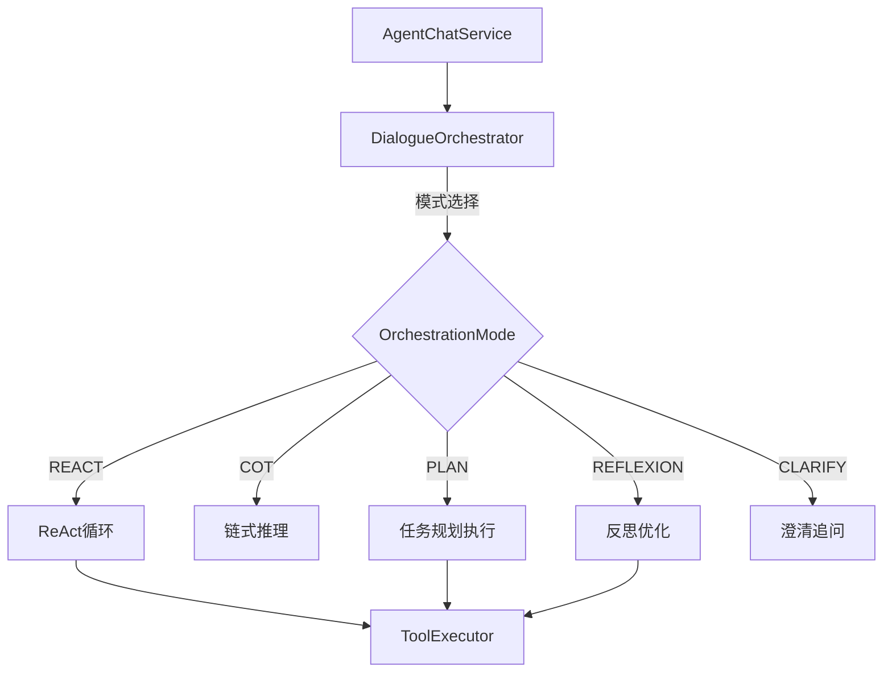
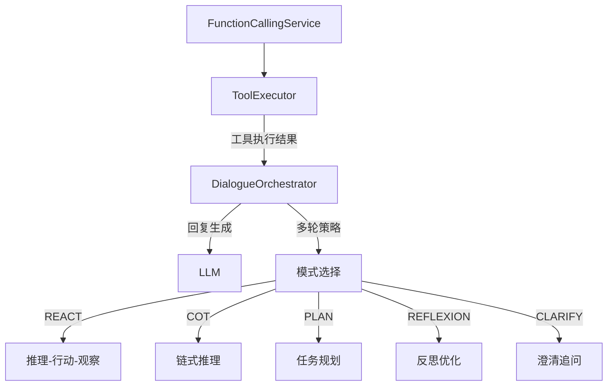
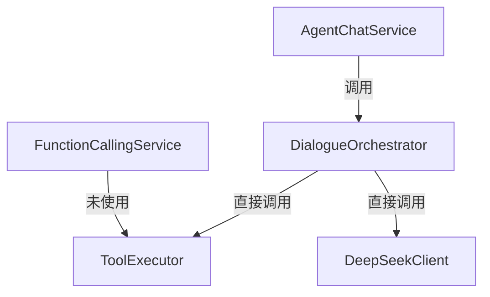
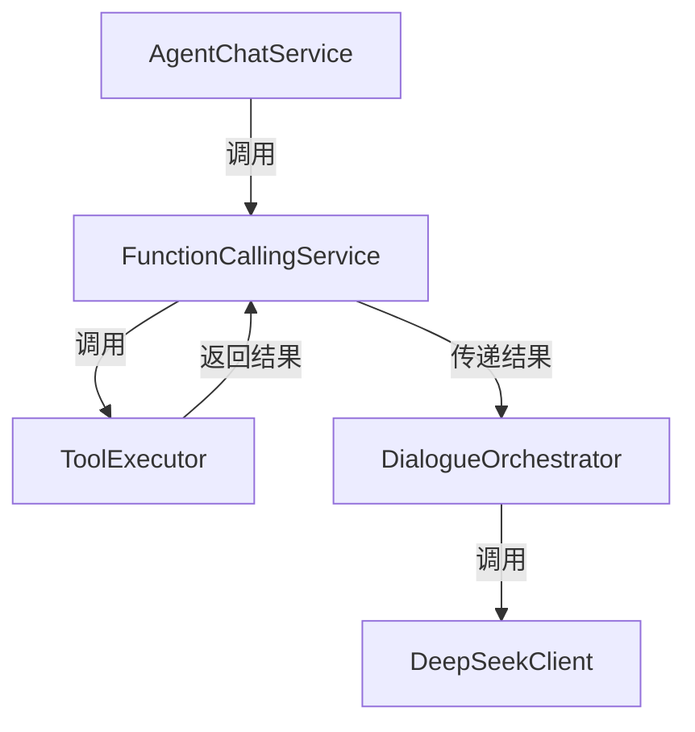
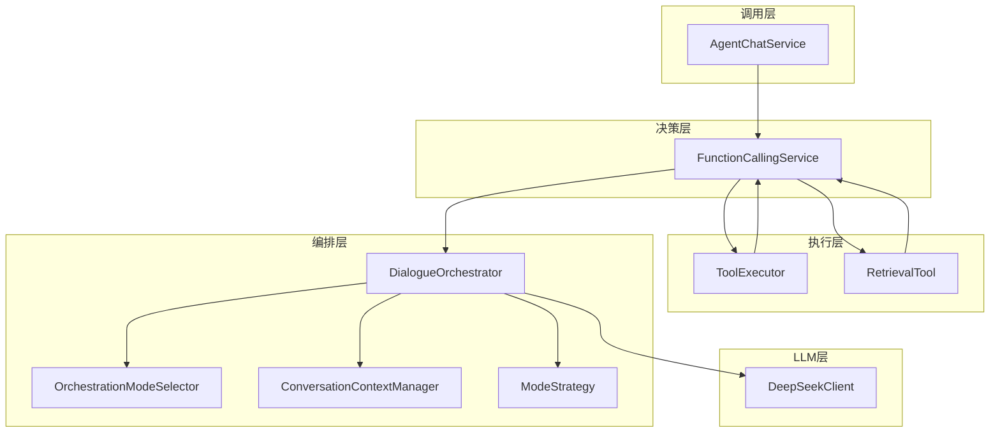
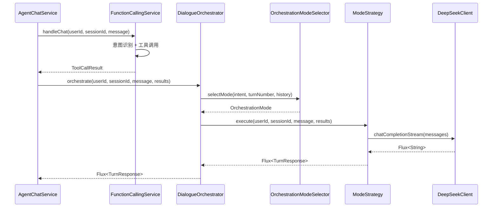
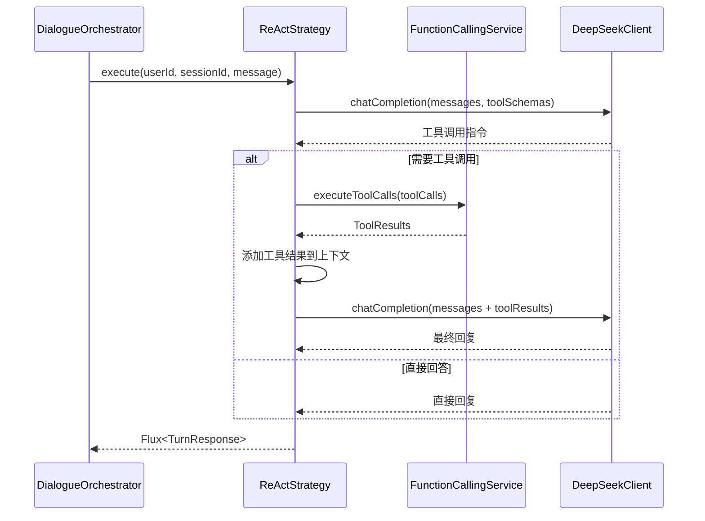
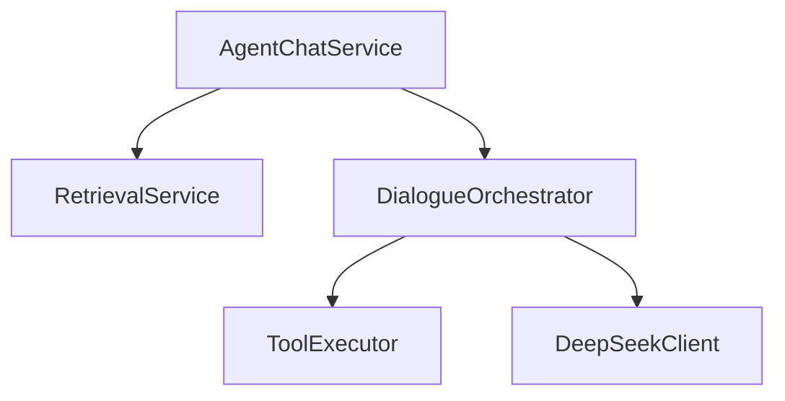
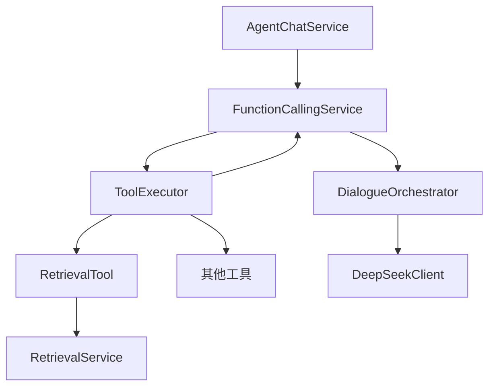
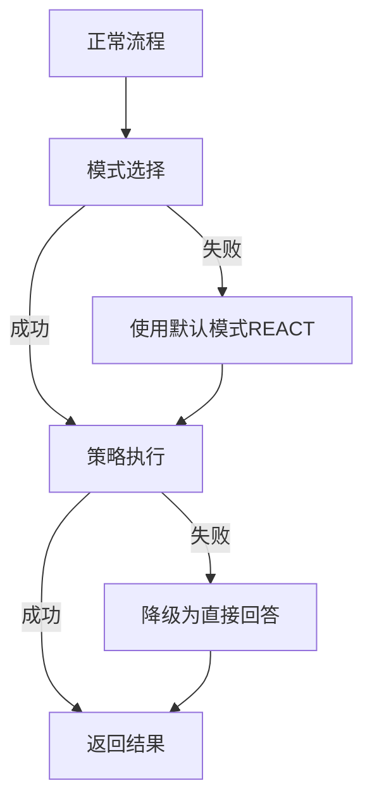

# Agent 对话编排模块技术设计文档

## 文档信息

| 项目 | 内容 |
|------|------|
| **文档版本** | v1.0 |
| **创建日期** | 2026-07-14 |
| **适用项目** | CampusShare Agent |
| **模块名称** | Dialogue Orchestration |
| **设计目标** | 企业级对话编排引擎，支持多种编排模式、多轮对话管理、SSE流式输出、与Function Calling架构无缝集成 |

---

## 1. 范式反思：在Function Calling架构下重新定义对话编排

### 1.1 当前架构分析

当前系统采用"多模式编排"架构：



**核心特点：**
- 5种编排模式：ReAct、CoT、Plan-and-Execute、Reflexion、CLARIFY
- 模式选择基于意图和轮次
- ReAct循环包含工具调用逻辑
- 支持会话历史加载

### 1.2 架构矛盾分析

在Function Calling新架构下，对话编排的职责边界发生了变化：

| 职责 | 原架构 | 新架构 | 问题 |
|------|--------|--------|------|
| 意图决策 | DialogueOrchestrator | FunctionCallingService | 重复 |
| 工具选择 | DialogueOrchestrator | FunctionCallingService | 重复 |
| 工具执行 | DialogueOrchestrator | ToolExecutor | 重复 |
| 检索触发 | DialogueOrchestrator | RetrievalTool | 重复 |
| 回复生成 | DialogueOrchestrator | DialogueOrchestrator | ✅ |
| 多轮策略 | DialogueOrchestrator | DialogueOrchestrator | ✅ |

**核心矛盾：** DialogueOrchestrator中的`runToolCallLoop`和`executeToolCalls`与FunctionCallingService + ToolExecutor形成了重复的工具调用路径。

### 1.3 范式转变：职责收窄

**新定位：** DialogueOrchestrator从"全链路编排"收窄为"回复生成编排+多轮策略管理"。



**新职责：**
1. **回复生成编排**：基于工具执行结果和检索结果生成最终回复
2. **多轮策略管理**：选择合适的编排模式，管理对话流程
3. **上下文管理**：维护对话历史，管理上下文窗口
4. **SSE流式输出**：支持流式响应

### 1.4 大厂编排框架对比

| 框架 | 原理 | 优势 | 劣势 |
|------|------|------|------|
| **LangGraph** | 状态机+图结构 | 灵活，支持复杂工作流 | Python生态 |
| **AutoGen** | 多Agent协作 | 强大的协作能力 | 复杂 |
| **CrewAI** | 角色分工 | 团队协作模式 | Python生态 |
| **自研编排器** | 多模式策略 | 轻量，可控 | 开发成本 |

### 1.5 本项目的选择

**当前阶段：**
- ✅ 保留5种编排模式
- ✅ 移除重复的工具调用逻辑（委托给ToolExecutor）
- ✅ 添加SSE流式输出支持
- ✅ 添加上下文窗口管理
- ✅ 实现完整的Reflexion模式

**未来阶段：**
- ✅ 支持多Agent协作
- ✅ 支持工具链编排
- ✅ 支持动态模式切换

---

## 2. 需求分析

### 2.1 业务目标

| 目标 | 描述 |
|------|------|
| **自然对话** | 支持多轮对话，保持上下文连贯 |
| **智能决策** | 根据对话状态选择最佳编排模式 |
| **流式响应** | 支持SSE流式输出，提升用户体验 |
| **反思优化** | 从失败中学习，优化后续回复 |
| **任务分解** | 支持复杂任务的规划与执行 |
| **澄清追问** | 主动追问缺失信息 |

### 2.2 流量特征

| 指标 | 当前值 | 目标值 |
|------|--------|--------|
| 对话轮次数 | 3轮/会话 | 10轮/会话 |
| 并发会话数 | 100 | 10000 |
| 平均回复延迟 | 2000ms | 1000ms |
| 流式输出比例 | 0% | 80% |

### 2.3 非功能要求

| 要求 | 值 |
|------|-----|
| P99延迟 | < 3000ms |
| SSE首包延迟 | < 500ms |
| 上下文窗口 | 10轮对话 |
| 模式选择准确率 | > 90% |
| 可用性 | 99.99% |

### 2.4 合规要求

| 要求 | 说明 |
|------|------|
| 对话记录 | 完整记录对话历史 |
| 敏感信息 | 过滤对话中的敏感信息 |
| 内容审核 | 对话内容经过审核 |

---

## 3. 容量规划

### 3.1 数据规模

| 数据类型 | 当前规模 | 1年目标 | 3年目标 |
|----------|---------|--------|--------|
| 对话会话 | 1000 | 100万 | 1亿 |
| 对话轮次 | 3000 | 3000万 | 30亿 |
| 上下文缓存 | 100 | 10万 | 1000万 |

### 3.2 存储规模

| 存储类型 | 估算大小 | 存储方案 |
|----------|---------|---------|
| 对话记录 | 1GB → 100GB | MySQL |
| 上下文缓存 | 100MB → 10GB | Redis |

### 3.3 缓存容量

| 缓存类型 | 条目数 | 内存需求 | TTL |
|----------|--------|---------|-----|
| 对话上下文 | 10万 | 5GB | 1小时 |
| 模式选择缓存 | 10万 | 1GB | 1小时 |
| 反思分析缓存 | 1万 | 500MB | 10分钟 |

---

## 4. 现状分析

### 4.1 当前方案

**核心组件：**

| 组件 | 职责 | 评估 |
|------|------|------|
| DialogueOrchestrator | 对话编排接口 | 保留，扩展流式方法 |
| DialogueOrchestratorImpl | 编排实现 | 重构，移除重复工具调用 |
| OrchestrationMode | 编排模式枚举 | 保留 |

**当前问题：**

| 优先级 | 问题 | 影响 | 建议 |
|--------|------|------|------|
| P0 | ReAct循环与FunctionCallingService重复 | 架构混乱 | 移除ReAct中的工具调用 |
| P0 | 缺少SSE流式输出 | 用户体验差 | 添加流式方法 |
| P1 | hasFailedAttempts始终返回false | Reflexion无效 | 实现失败检测 |
| P1 | intentResultFromStep始终返回SEARCH | 任务规划不准确 | 实现意图推断 |
| P1 | 缺少上下文窗口管理 | 长对话性能下降 | 添加窗口管理 |
| P2 | 模式选择逻辑简单 | 模式选择不准确 | 优化选择策略 |

### 4.2 与前序模块的集成

**当前集成问题：**



**期望集成：**



---

## 5. 业界方案调研

### 5.1 编排模式对比

| 模式 | 原理 | 适用场景 | 优点 | 缺点 |
|------|------|----------|------|------|
| **ReAct** | 推理-行动-观察循环 | 需要工具调用的任务 | 灵活，可验证 | 步骤多，耗时 |
| **CoT** | 链式思维推理 | 需要深度思考的问题 | 推理清晰，可解释 | 不支持工具调用 |
| **Plan-and-Execute** | 任务分解+分步执行 | 复杂多步骤任务 | 结构化，可追踪 | 规划质量依赖LLM |
| **Reflexion** | 反思历史尝试+优化 | 多次失败的任务 | 自我改进 | 需要历史数据 |
| **CLARIFY** | 追问澄清 | 信息不全的查询 | 信息准确 | 增加对话轮次 |

### 5.2 流式输出方案对比

| 方案 | 原理 | 优势 | 劣势 |
|------|------|------|------|
| **SSE** | Server-Sent Events | 标准，浏览器原生支持 | 单向 |
| **WebSocket** | 双向通信 | 实时，双向 | 复杂 |
| **HTTP Streaming** | 分块传输 | 简单 | 不支持中断 |

### 5.3 大厂实践案例

| 公司 | 方案 | 特点 |
|------|------|------|
| **OpenAI** | ReAct + Function Calling | 原生工具调用支持 |
| **Anthropic** | Tool Use + 多轮对话 | 长上下文支持 |
| **Google** | Plan-and-Execute | 复杂任务分解 |
| **Meta** | Reflexion | 自我反思优化 |
| **字节跳动** | 多模式自适应 | 根据任务类型动态选择 |

---

## 6. 方案设计

### 6.1 架构设计

**新架构：**



**模块职责：**

| 模块 | 职责 | 说明 |
|------|------|------|
| DialogueOrchestrator | 编排接口 | 定义编排方法 |
| OrchestrationModeSelector | 模式选择器 | 根据上下文选择模式 |
| ConversationContextManager | 上下文管理器 | 管理对话历史和窗口 |
| ModeStrategy | 模式策略接口 | 定义各模式策略 |
| ReActStrategy | ReAct策略 | 推理-行动-观察 |
| CoTStrategy | CoT策略 | 链式推理 |
| PlanAndExecuteStrategy | 规划执行策略 | 任务分解执行 |
| ReflexionStrategy | 反思策略 | 历史分析优化 |
| ClarifyStrategy | 澄清策略 | 追问缺失信息 |

### 6.2 核心流程

**流程一：完整对话流程**



**流程二：ReAct模式流程**



### 6.3 数据模型

**编排上下文：**

```java
@Data
@Builder
public class OrchestrationContext {
    private String userId;
    private String sessionId;
    private String userMessage;
    private IntentResult intentResult;
    private List<RetrievalResult> retrievalResults;
    private List<ToolResult> toolResults;
    private List<TurnResponse> conversationHistory;
    private int turnNumber;
    private OrchestrationMode selectedMode;
    private long startTime;
    private Map<String, Object> metadata;
}
```

**模式选择特征：**

```java
@Data
@Builder
public class ModeSelectionFeatures {
    private Intent intent;
    private String subIntent;
    private int turnNumber;
    private int failedAttempts;
    private boolean hasMissingSlots;
    private boolean isComplexTask;
    private boolean requiresReasoning;
    private int conversationLength;
    private String userMessageLength;
    private double intentConfidence;
}
```

**流式响应：**

```java
@Data
@Builder
public class StreamingTurnResponse {
    private String content;
    private boolean isComplete;
    private boolean isClarification;
    private boolean isSummary;
    private String mode;
    private int chunkIndex;
    private long totalChunks;
}
```

### 6.4 API设计

**编排接口：**

| 方法 | 描述 |
|------|------|
| orchestrate | 编排对话，返回Mono |
| orchestrateStream | 编排对话，返回Flux流式响应 |
| clarify | 澄清追问 |
| summarize | 会话总结 |
| planAndExecute | 任务规划执行 |
| reflexion | 反思优化 |
| selectMode | 选择编排模式 |

### 6.5 关键实现

#### 6.5.1 DialogueOrchestrator接口扩展（添加流式方法）

```java
public interface DialogueOrchestrator {

    Mono<TurnResponse> orchestrate(String userId, String sessionId, String userMessage,
                                   IntentResult intentResult, List<RetrievalResult> retrievalResults);

    Flux<StreamingTurnResponse> orchestrateStream(String userId, String sessionId, String userMessage,
                                                   IntentResult intentResult, List<RetrievalResult> retrievalResults);

    Mono<TurnResponse> clarify(String userId, String sessionId, String userMessage,
                               IntentResult intentResult, List<RetrievalResult> retrievalResults);

    Flux<StreamingTurnResponse> clarifyStream(String userId, String sessionId, String userMessage,
                                               IntentResult intentResult, List<RetrievalResult> retrievalResults);

    Mono<TurnResponse> summarize(String userId, String sessionId);

    Flux<StreamingTurnResponse> summarizeStream(String userId, String sessionId);

    Mono<TurnResponse> planAndExecute(String userId, String sessionId, String userMessage,
                                      IntentResult intentResult, List<RetrievalResult> retrievalResults);

    Flux<StreamingTurnResponse> planAndExecuteStream(String userId, String sessionId, String userMessage,
                                                      IntentResult intentResult, List<RetrievalResult> retrievalResults);

    Mono<TurnResponse> reflexion(String userId, String sessionId, String userMessage,
                                  IntentResult intentResult, List<RetrievalResult> retrievalResults);

    OrchestrationMode selectMode(IntentResult intentResult, int turnNumber);
}
```

#### 6.5.2 ModeStrategy接口（策略模式）

```java
public interface ModeStrategy {
    
    OrchestrationMode getMode();
    
    Mono<TurnResponse> execute(String userId, String sessionId, String userMessage,
                               IntentResult intentResult, List<RetrievalResult> retrievalResults,
                               List<ToolResult> toolResults);
    
    Flux<StreamingTurnResponse> executeStream(String userId, String sessionId, String userMessage,
                                               IntentResult intentResult, List<RetrievalResult> retrievalResults,
                                               List<ToolResult> toolResults);
}
```

#### 6.5.3 ReActStrategy（重构，与FunctionCallingService分工协作）

**职责边界定义：**
- **FunctionCallingService**：负责第一轮工具调用决策（是否调用工具、调用哪个工具）
- **ReActStrategy**：负责收到工具结果后，判断是否需要继续调用工具的多轮循环

```java
@Slf4j
@Component
public class ReActStrategy implements ModeStrategy {

    private final DeepSeekClient deepSeekClient;
    private final ToolExecutor toolExecutor;
    private final ToolRegistry toolRegistry;
    private final ConversationContextManager contextManager;
    private static final int MAX_TOOL_CALL_ROUNDS = 5;

    @Override
    public OrchestrationMode getMode() {
        return OrchestrationMode.REACT;
    }

    @Override
    public Flux<StreamingTurnResponse> executeStream(String userId, String sessionId, String userMessage,
                                                      IntentResult intentResult, List<RetrievalResult> retrievalResults,
                                                      List<ToolResult> toolResults) {
        return Mono.defer(() -> {
            List<DeepSeekRequest.Message> messages = buildReactMessages(sessionId, userMessage, intentResult);
            
            if (toolResults != null && !toolResults.isEmpty()) {
                for (ToolResult result : toolResults) {
                    messages.add(DeepSeekRequest.Message.builder()
                            .role("tool")
                            .content(resultToJson(result))
                            .build());
                }
            }
            
            List<Map<String, Object>> toolSchemas = toolRegistry.getToolSchemas(intentResult.getIntent());
            
            return runToolCallLoopStream(messages, toolSchemas, userId, 0);
        }).flatMapMany(flux -> flux);
    }

    private Mono<Flux<StreamingTurnResponse>> runToolCallLoopStream(List<DeepSeekRequest.Message> messages,
                                                                     List<Map<String, Object>> toolSchemas,
                                                                     String userId, int round) {
        if (round >= MAX_TOOL_CALL_ROUNDS || toolSchemas == null || toolSchemas.isEmpty()) {
            return Mono.just(generateResponseStream(messages));
        }

        return deepSeekClient.chatCompletion(messages, toolSchemas)
                .flatMap(response -> {
                    if (!response.hasToolCalls()) {
                        return Mono.just(generateResponseStream(messages));
                    }

                    return executeToolCalls(response.getToolCalls(), userId)
                            .flatMap(results -> {
                                for (ToolResult result : results) {
                                    messages.add(DeepSeekRequest.Message.builder()
                                            .role("tool")
                                            .content(resultToJson(result))
                                            .build());
                                }
                                return runToolCallLoopStream(messages, toolSchemas, userId, round + 1);
                            });
                });
    }

    private Flux<StreamingTurnResponse> generateResponseStream(List<DeepSeekRequest.Message> messages) {
        return deepSeekClient.chatCompletionStream(messages)
                .map(content -> StreamingTurnResponse.builder()
                        .content(content)
                        .isComplete(false)
                        .mode("REACT")
                        .build())
                .concatWith(Mono.just(StreamingTurnResponse.builder()
                        .content("")
                        .isComplete(true)
                        .mode("REACT")
                        .build()));
    }

    private Mono<List<ToolResult>> executeToolCalls(List<DeepSeekResponse.ToolCall> toolCalls, String userId) {
        return Flux.fromIterable(toolCalls)
                .flatMap(toolCall -> {
                    String toolName = toolCall.getFunction().getName();
                    Map<String, Object> arguments = parseArguments(toolCall.getFunction().getArguments());
                    return toolExecutor.execute(toolName, arguments, userId);
                })
                .collectList();
    }
}
```

#### 6.5.4 PlanAndExecuteStrategy（完善任务分解）

```java
@Slf4j
@Component
public class PlanAndExecuteStrategy implements ModeStrategy {

    private final DeepSeekClient deepSeekClient;
    private final DialogueOrchestrator dialogueOrchestrator;
    private final ConversationContextManager contextManager;

    @Value("${app.orchestrator.max-plan-steps:5}")
    private int maxPlanSteps;

    @Override
    public OrchestrationMode getMode() {
        return OrchestrationMode.PLAN_AND_EXECUTE;
    }

    @Override
    public Flux<StreamingTurnResponse> executeStream(String userId, String sessionId, String userMessage,
                                                      IntentResult intentResult, List<RetrievalResult> retrievalResults,
                                                      List<ToolResult> toolResults) {
        return buildPlan(sessionId, userMessage, intentResult, retrievalResults)
                .flatMapMany(plan -> executePlanStream(userId, sessionId, plan));
    }

    private Mono<List<PlanStep>> buildPlan(String sessionId, String userMessage,
                                            IntentResult intentResult, List<RetrievalResult> retrievalResults) {
        List<DeepSeekRequest.Message> messages = buildPlanMessages(userMessage, intentResult, retrievalResults);

        return deepSeekClient.chatCompletion(messages)
                .map(response -> parsePlan(response.getContent()))
                .onErrorResume(e -> {
                    log.warn("Failed to build plan, using default step", e);
                    return Mono.just(List.of(new PlanStep(1, userMessage, Intent.SEARCH)));
                });
    }

    private Flux<StreamingTurnResponse> executePlanStream(String userId, String sessionId, List<PlanStep> plan) {
        AtomicReference<String> executionLog = new AtomicReference<>();
        AtomicInteger stepIndex = new AtomicInteger(0);

        return Flux.fromIterable(plan)
                .take(maxPlanSteps)
                .flatMapSequential(step -> {
                    int index = stepIndex.getAndIncrement();
                    
                    return dialogueOrchestrator.orchestrateStream(
                                    userId, sessionId, step.getDescription(),
                                    IntentResult.builder()
                                            .intent(step.getIntent())
                                            .build(),
                                    Collections.emptyList())
                            .doOnNext(response -> {
                                executionLog.updateAndGet(log ->
                                        log + String.format("步骤 %d: %s\n结果: %s\n\n",
                                                index + 1, step.getDescription(), response.getContent()));
                            });
                })
                .concatWith(Mono.defer(() -> {
                    String summary = buildPlanExecutionSummary(plan, executionLog.get());
                    return deepSeekClient.chatCompletionStream(buildSummaryMessages(summary))
                            .map(content -> StreamingTurnResponse.builder()
                                    .content(content)
                                    .isComplete(false)
                                    .mode("PLAN_AND_EXECUTE")
                                    .build())
                            .concatWith(Mono.just(StreamingTurnResponse.builder()
                                    .content("")
                                    .isComplete(true)
                                    .mode("PLAN_AND_EXECUTE")
                                    .build()));
                }));
    }

    private List<PlanStep> parsePlan(String planText) {
        List<PlanStep> steps = new ArrayList<>();
        String[] lines = planText.split("\n");
        int index = 1;
        for (String line : lines) {
            String trimmed = line.trim();
            if (trimmed.matches("^\\d+\\..*")) {
                String description = trimmed.replaceAll("^\\d+\\.\\s*", "");
                steps.add(new PlanStep(index++, description, inferIntent(description)));
            } else if (!trimmed.isEmpty()) {
                steps.add(new PlanStep(index++, trimmed, inferIntent(trimmed)));
            }
        }
        return steps;
    }

    private Intent inferIntent(String description) {
        if (description.contains("搜索") || description.contains("查找")) {
            return Intent.SEARCH;
        } else if (description.contains("如何") || description.contains("方法")) {
            return Intent.HOW_TO;
        } else if (description.contains("帮助") || description.contains("使用")) {
            return Intent.FEATURE_HELP;
        }
        return Intent.SEARCH;
    }

    @Data
    @Builder
    private static class PlanStep {
        private int index;
        private String description;
        private Intent intent;
    }
}
```

#### 6.5.5 ReflexionStrategy（完善失败检测）

```java
@Slf4j
@Component
public class ReflexionStrategy implements ModeStrategy {

    private final DeepSeekClient deepSeekClient;
    private final DialogueOrchestrator dialogueOrchestrator;
    private final ConversationContextManager contextManager;

    @Value("${app.orchestrator.reflexion-threshold:0.5}")
    private double reflexionThreshold;

    @Override
    public OrchestrationMode getMode() {
        return OrchestrationMode.REFLEXION;
    }

    @Override
    public Flux<StreamingTurnResponse> executeStream(String userId, String sessionId, String userMessage,
                                                      IntentResult intentResult, List<RetrievalResult> retrievalResults,
                                                      List<ToolResult> toolResults) {
        return analyzePastAttempts(sessionId, userMessage, intentResult)
                .flatMapMany(analysis -> {
                    if (analysis.isConfident()) {
                        return dialogueOrchestrator.orchestrateStream(
                                userId, sessionId, userMessage, intentResult, retrievalResults);
                    }

                    return deepSeekClient.chatCompletionStream(buildReflexionMessages(
                            userMessage, analysis.getReflection(), intentResult))
                            .collectList()
                            .map(chunks -> String.join("", chunks))
                            .flatMapMany(refinedQuery -> {
                                log.info("Refined query after reflexion: {}", refinedQuery);
                                return dialogueOrchestrator.orchestrateStream(
                                        userId, sessionId, refinedQuery, intentResult, retrievalResults);
                            });
                });
    }

    private Mono<ReflexionAnalysis> analyzePastAttempts(String sessionId, String userMessage,
                                                         IntentResult intentResult) {
        return contextManager.loadRecentTurns(sessionId, 3)
                .map(recentTurns -> {
                    if (recentTurns.isEmpty()) {
                        return new ReflexionAnalysis(true, "");
                    }

                    List<TurnResponse> failedTurns = recentTurns.stream()
                            .filter(this::isFailedTurn)
                            .toList();

                    if (failedTurns.isEmpty()) {
                        return new ReflexionAnalysis(true, "");
                    }

                    StringBuilder analysis = new StringBuilder();
                    analysis.append("过去的失败尝试：\n");
                    for (TurnResponse turn : failedTurns) {
                        analysis.append(String.format("- 用户: %s\n  助手: %s\n",
                                turn.getUserMessage(), turn.getContent()));
                    }

                    return new ReflexionAnalysis(false, analysis.toString());
                });
    }

    private boolean isFailedTurn(TurnResponse turn) {
        String content = turn.getContent();
        return content.contains("抱歉") || content.contains("无法") || 
               content.contains("失败") || content.contains("错误");
    }

    @Data
    @Builder
    private static class ReflexionAnalysis {
        private boolean confident;
        private String reflection;
    }
}
```

#### 6.5.6 ConversationContextManager（上下文窗口管理）

```java
@Slf4j
@Service
public class ConversationContextManager {

    private final AgentTurnMapper turnMapper;
    private final StringRedisTemplate redisTemplate;
    private static final int MAX_CONTEXT_TURNS = 10;
    private static final Duration CONTEXT_TTL = Duration.ofHours(1);

    public Mono<List<TurnResponse>> loadRecentTurns(String sessionId, int limit) {
        String cacheKey = "conversation:context:" + sessionId;
        
        return Mono.defer(() -> {
            String cached = redisTemplate.opsForValue().get(cacheKey);
            if (cached != null) {
                return Mono.just(fromJson(cached));
            }
            
            return loadFromDatabase(sessionId, limit)
                    .doOnNext(turns -> {
                        String json = toJson(turns);
                        redisTemplate.opsForValue().set(cacheKey, json, CONTEXT_TTL);
                    });
        });
    }

    private Mono<List<TurnResponse>> loadFromDatabase(String sessionId, int limit) {
        return Mono.fromCallable(() -> {
            LambdaQueryWrapper<AgentTurn> wrapper = new LambdaQueryWrapper<>();
            wrapper.eq(AgentTurn::getSessionId, sessionId)
                    .eq(AgentTurn::getStatus, "COMPLETED")
                    .orderByDesc(AgentTurn::getTurnNumber)
                    .last("LIMIT " + Math.min(limit, MAX_CONTEXT_TURNS));
            List<AgentTurn> turns = turnMapper.selectList(wrapper);
            Collections.reverse(turns);
            return turns.stream()
                    .map(this::toTurnResponse)
                    .toList();
        }).subscribeOn(Schedulers.boundedElastic());
    }

    public Mono<Void> updateContext(String sessionId, TurnResponse response) {
        String cacheKey = "conversation:context:" + sessionId;
        
        return loadRecentTurns(sessionId, MAX_CONTEXT_TURNS)
                .flatMap(turns -> {
                    turns.add(response);
                    if (turns.size() > MAX_CONTEXT_TURNS) {
                        turns = turns.subList(turns.size() - MAX_CONTEXT_TURNS, turns.size());
                    }
                    String json = toJson(turns);
                    redisTemplate.opsForValue().set(cacheKey, json, CONTEXT_TTL);
                    return Mono.empty();
                });
    }

    private TurnResponse toTurnResponse(AgentTurn turn) {
        return TurnResponse.builder()
                .content(turn.getAssistantMessage())
                .userMessage(turn.getUserMessage())
                .build();
    }
}
```

#### 6.5.7 DialogueOrchestratorImpl重构

```java
@Slf4j
@Service
@RequiredArgsConstructor
public class DialogueOrchestratorImpl implements DialogueOrchestrator {

    private final Map<OrchestrationMode, ModeStrategy> strategyMap;
    private final OrchestrationModeSelector modeSelector;
    private final ConversationContextManager contextManager;

    @Override
    public Mono<TurnResponse> orchestrate(String userId, String sessionId, String userMessage,
                                          IntentResult intentResult, List<RetrievalResult> retrievalResults) {
        return orchestrateStream(userId, sessionId, userMessage, intentResult, retrievalResults)
                .reduce(new StringBuilder(), (builder, response) -> {
                    if (!response.getContent().isEmpty()) {
                        builder.append(response.getContent());
                    }
                    return builder;
                })
                .map(contentBuilder -> TurnResponse.builder()
                        .content(contentBuilder.toString())
                        .isClarification(false)
                        .isSummary(false)
                        .build());
    }

    @Override
    public Flux<StreamingTurnResponse> orchestrateStream(String userId, String sessionId, String userMessage,
                                                          IntentResult intentResult, List<RetrievalResult> retrievalResults) {
        int turnNumber = contextManager.getTurnNumber(sessionId);
        OrchestrationMode mode = modeSelector.selectMode(intentResult, turnNumber, sessionId);

        log.info("Selected orchestration mode: {} for intent: {}, turn: {}",
                mode, intentResult.getIntent(), turnNumber);

        ModeStrategy strategy = strategyMap.get(mode);
        if (strategy == null) {
            return Flux.error(new IllegalArgumentException("Unknown orchestration mode: " + mode));
        }

        return strategy.executeStream(userId, sessionId, userMessage, intentResult, 
                        retrievalResults, Collections.emptyList())
                .doOnNext(response -> {
                    if (response.isComplete()) {
                        contextManager.updateContext(sessionId, TurnResponse.builder()
                                .content("")
                                .userMessage(userMessage)
                                .build()).subscribe();
                    }
                });
    }

    @Override
    public OrchestrationMode selectMode(IntentResult intentResult, int turnNumber) {
        return modeSelector.selectMode(intentResult, turnNumber, null);
    }
}
```

#### 6.5.8 OrchestrationModeSelector（优化模式选择策略）

```java
@Service
public class OrchestrationModeSelector {

    private final ConversationContextManager contextManager;

    public OrchestrationMode selectMode(IntentResult intentResult, int turnNumber, String sessionId) {
        if (intentResult.getIntent() == Intent.CLARIFY ||
            intentResult.getSlots() == null || hasMissingSlots(intentResult)) {
            return OrchestrationMode.CLARIFY;
        }

        if (isComplexTask(intentResult)) {
            return OrchestrationMode.PLAN_AND_EXECUTE;
        }

        if (sessionId != null && turnNumber > 1 && hasFailedAttempts(sessionId)) {
            return OrchestrationMode.REFLEXION;
        }

        if (isReasoningRequired(intentResult)) {
            return OrchestrationMode.COT;
        }

        return OrchestrationMode.REACT;
    }

    private boolean hasFailedAttempts(String sessionId) {
        return contextManager.countFailedAttempts(sessionId) > 1;
    }
}
```

#### 6.5.9 AgentChatService改造方案（新架构集成）

**旧架构调用链路：**



**新架构调用链路：**



**改造后的AgentChatService核心代码：**

```java
@Slf4j
@Service
@RequiredArgsConstructor
public class AgentChatService {

    private final FunctionCallingService functionCallingService;
    private final DialogueOrchestrator dialogueOrchestrator;
    private final TraceService traceService;
    private final SloService sloService;
    private final MetricsService metricsService;

    public Flux<TurnResponse> handleChatStream(String userId, String sessionId, String userMessage) {
        long startTime = System.currentTimeMillis();
        
        return functionCallingService.execute(userId, sessionId, userMessage)
                .flatMapMany(toolCallResult -> {
                    IntentResult intentResult = toolCallResult.getIntentResult();
                    List<RetrievalResult> retrievalResults = toolCallResult.getRetrievalResults();
                    List<ToolResult> toolResults = toolCallResult.getToolResults();

                    if (toolCallResult.isDirectAnswer()) {
                        return Flux.just(TurnResponse.builder()
                                .content(toolCallResult.getDirectAnswer())
                                .build());
                    }

                    return dialogueOrchestrator.orchestrateStream(
                            userId, sessionId, userMessage, intentResult, retrievalResults);
                })
                .doOnComplete(() -> {
                    long latency = System.currentTimeMillis() - startTime;
                    sloService.recordLatency("chat", latency, false);
                    metricsService.recordChatLatency(latency);
                })
                .doOnError(e -> {
                    long latency = System.currentTimeMillis() - startTime;
                    sloService.recordLatency("chat", latency, true);
                    log.error("Chat handling failed", e);
                });
    }
}
```

**FunctionCallingService完整实现：**

```java
@Service
public class FunctionCallingService {

    private final DeepSeekClient deepSeekClient;
    private final ToolRegistry toolRegistry;
    private final ToolExecutor toolExecutor;
    private final IntentClassifier intentClassifier;

    public Mono<ToolCallResult> execute(String userId, String sessionId, String userMessage) {
        return intentClassifier.classify(userMessage)
                .flatMap(intentResult -> {
                    if (isShortCircuitIntent(intentResult)) {
                        return Mono.just(ToolCallResult.directAnswer(
                                generateShortCircuitResponse(intentResult)));
                    }

                    return toolRegistry.getToolSchemas(intentResult.getIntent())
                            .flatMap(toolSchemas -> {
                                if (toolSchemas.isEmpty()) {
                                    return Mono.just(ToolCallResult.builder()
                                            .intentResult(intentResult)
                                            .retrievalResults(Collections.emptyList())
                                            .toolResults(Collections.emptyList())
                                            .build());
                                }

                                return deepSeekClient.chatWithFunctions(userMessage, toolSchemas)
                                        .flatMap(response -> {
                                            if (!response.hasFunctionCall()) {
                                                return Mono.just(ToolCallResult.directAnswer(
                                                        response.getContent()));
                                            }

                                            String toolName = response.getFunctionName();
                                            Map<String, Object> arguments = response.getFunctionArguments();
                                            
                                            return toolExecutor.execute(toolName, arguments, userId)
                                                    .map(result -> ToolCallResult.builder()
                                                            .intentResult(intentResult)
                                                            .toolResults(List.of(result))
                                                            .retrievalResults(extractRetrievalResults(result))
                                                            .build());
                                        });
                            });
                });
    }

    private List<RetrievalResult> extractRetrievalResults(ToolResult result) {
        if (result.getData() instanceof Map) {
            Object resultsObj = ((Map<?, ?>) result.getData()).get("results");
            if (resultsObj instanceof List) {
                return ((List<?>) resultsObj).stream()
                        .map(obj -> {
                            if (obj instanceof RetrievalResult) {
                                return (RetrievalResult) obj;
                            }
                            return null;
                        })
                        .filter(Objects::nonNull)
                        .toList();
            }
        }
        return Collections.emptyList();
    }
}
```

---

## 7. 可靠性设计

### 7.1 熔断策略

| 组件 | 熔断条件 | 恢复策略 |
|------|---------|---------|
| LLM调用 | 50%失败率 | 30秒后半开状态 |
| 工具调用 | 30%失败率 | 30秒后半开状态 |
| 上下文加载 | 连续5次失败 | 1分钟后重试 |

### 7.2 降级机制



### 7.3 超时控制

| 操作 | 超时时间 |
|------|---------|
| 模式选择 | 100ms |
| 上下文加载 | 500ms |
| LLM调用 | 30秒 |
| 工具调用 | 10秒 |
| 总编排 | 40秒 |

### 7.4 故障隔离

| 组件 | 隔离方式 |
|------|---------|
| 模式选择 | 内存隔离 |
| 上下文加载 | 线程池隔离 |
| LLM调用 | 线程池隔离 |
| 工具调用 | 线程池隔离 |

---

## 8. 性能优化

### 8.1 瓶颈分析

| 瓶颈 | 原因 | 影响 |
|------|------|------|
| LLM调用 | 网络+模型推理 | 占总延迟70% |
| 上下文加载 | 数据库查询 | 占总延迟10% |
| 模式选择 | 规则匹配 | 占总延迟5% |

### 8.2 优化策略

| 策略 | 实现方式 | 预期收益 |
|------|---------|---------|
| 上下文缓存 | Redis缓存对话历史 | 延迟降低90% |
| 模式选择缓存 | Redis缓存选择结果 | 延迟降低50% |
| 流式输出 | SSE流式响应 | 首包延迟降低80% |
| 并行工具调用 | Flux.parallel | 吞吐量提升3倍 |

### 8.3 性能指标

| 指标 | 目标值 |
|------|--------|
| P99延迟 | < 3000ms |
| P95延迟 | < 1500ms |
| P50延迟 | < 500ms |
| SSE首包延迟 | < 500ms |
| 上下文缓存命中率 | > 90% |

---

## 9. 可观测性设计

### 9.1 链路追踪

**Trace结构：**

| Span | 名称 | 作用 |
|------|------|------|
| root | dialogue-orchestration | 编排总耗时 |
| child | mode-selection | 模式选择耗时 |
| child | context-load | 上下文加载耗时 |
| child | strategy-execute | 策略执行耗时 |
| child | llm-call | LLM调用耗时 |
| child | tool-call | 工具调用耗时 |

### 9.2 指标监控

**核心指标：**

| 指标 | 类型 | 描述 |
|------|------|------|
| dialogue_orchestration_requests_total | Counter | 总编排请求数 |
| dialogue_orchestration_latency_seconds | Histogram | 编排延迟 |
| dialogue_orchestration_mode_select_total | Counter | 各模式选择次数 |
| dialogue_orchestration_failure_total | Counter | 失败次数 |
| dialogue_orchestration_stream_first_byte_seconds | Histogram | SSE首包延迟 |

**模式维度指标：**

| 指标 | 类型 | 标签 |
|------|------|------|
| dialogue_orchestration_by_mode | Counter | mode, status |
| dialogue_orchestration_latency_by_mode | Histogram | mode |

### 9.3 结构化日志

**日志格式：**

```json
{
    "timestamp": "2026-07-14T10:00:00.000Z",
    "level": "INFO",
    "traceId": "abc-123",
    "spanId": "def-456",
    "userId": "user-123",
    "sessionId": "session-456",
    "module": "dialogue-orchestration",
    "event": "orchestration_started",
    "mode": "REACT",
    "turnNumber": 3,
    "intent": "SEARCH",
    "userMessage": "Python数据分析"
}
```

---

## 10. 安全设计

### 10.1 输入防护

| 防护类型 | 实现方式 |
|----------|---------|
| Prompt注入检测 | 基于规则+模型的双层检测 |
| 敏感内容过滤 | 对话内容敏感词过滤 |
| 参数校验 | JSR-303参数校验 |

### 10.2 输出防护

| 防护类型 | 实现方式 |
|----------|---------|
| 内容审核 | 对话回复内容审核 |
| 敏感信息脱敏 | 输出内容敏感信息过滤 |

### 10.3 数据安全

| 安全措施 | 说明 |
|----------|------|
| 传输加密 | TLS 1.3 |
| 存储加密 | MySQL透明加密 |
| 访问控制 | 对话记录访问权限 |

---

## 11. 运维设计

### 11.1 部署方案

**部署配置：**

| 配置 | 值 |
|------|-----|
| 副本数 | 2 |
| HPA | 2-10 |
| 资源请求 | 4C8G |
| 资源限制 | 8C16G |

### 11.2 配置管理

**配置项：**

| 配置 | 说明 | 示例值 |
|------|------|--------|
| orchestrator.max-plan-steps | 最大规划步骤数 | 5 |
| orchestrator.max-clarify-rounds | 最大澄清轮次 | 3 |
| orchestrator.reflexion-threshold | 反思阈值 | 0.5 |
| orchestrator.max-context-turns | 最大上下文轮次 | 10 |
| orchestrator.sse.enabled | 是否启用SSE | true |

### 11.3 监控告警

**仪表盘：**

| 仪表盘 | 内容 |
|--------|------|
| 对话编排概览 | 请求量、延迟、错误率 |
| 模式分布 | 各模式选择比例 |
| SSE性能 | 首包延迟、流式比例 |
| 上下文管理 | 缓存命中率、窗口大小 |

---

## 12. 演进规划

### 12.1 阶段一：基础建设（0-3个月）

**目标：** 完成核心功能实现，达到生产可用

**主要任务：**
- [ ] 重构DialogueOrchestrator，移除重复工具调用
- [ ] 添加SSE流式输出支持
- [ ] 实现策略模式，分离各模式逻辑
- [ ] 添加ConversationContextManager
- [ ] 完善Reflexion模式的失败检测

**性能目标：**
- P99 < 3000ms
- SSE首包延迟 < 1000ms

### 12.2 阶段二：优化升级（3-6个月）

**目标：** 性能优化，智能化升级

**主要任务：**
- [ ] 优化模式选择策略（基于ML）
- [ ] 添加上下文压缩
- [ ] 实现并行工具调用
- [ ] 添加对话状态管理
- [ ] 完善任务分解逻辑

**性能目标：**
- P99 < 2000ms
- SSE首包延迟 < 500ms

### 12.3 阶段三：进阶功能（6-12个月）

**目标：** 高级功能，多Agent协作

**主要任务：**
- [ ] 支持多Agent协作
- [ ] 支持工具链编排
- [ ] 支持动态模式切换
- [ ] 添加对话记忆
- [ ] 实现对话摘要

**性能目标：**
- P99 < 1500ms
- SSE首包延迟 < 300ms

### 12.4 阶段四：规模化（12-24个月）

**目标：** 大规模部署，全球多活

**主要任务：**
- [ ] 分布式对话状态管理
- [ ] 多Region部署
- [ ] AI驱动的模式选择
- [ ] 自动化对话优化

**性能目标：**
- P99 < 1000ms
- SSE首包延迟 < 200ms

---

## 13. 附录

### 13.1 术语表

| 术语 | 定义 |
|------|------|
| ReAct | Reasoning + Acting，推理-行动循环 |
| CoT | Chain of Thought，链式思维推理 |
| Plan-and-Execute | 任务规划与执行 |
| Reflexion | 反思，从历史尝试中学习 |
| CLARIFY | 澄清，追问缺失信息 |
| SSE | Server-Sent Events，服务端推送 |
| 对话编排 | 管理多轮对话流程的模块 |

### 13.2 参考资料

- [ReAct: Synergizing Reasoning and Acting in Language Models](https://arxiv.org/abs/2210.03629)
- [Chain-of-Thought Prompting Elicits Reasoning in Large Language Models](https://arxiv.org/abs/2201.11903)
- [LangGraph Documentation](https://langchain-ai.github.io/langgraph/)
- [AutoGen Documentation](https://microsoft.github.io/autogen/)

### 13.3 变更记录

| 版本 | 日期 | 变更内容 | 作者 |
|------|------|---------|------|
| v1.0 | 2026-07-14 | 初始版本 | Agent Design Team |

### 13.4 审批记录

| 审批阶段 | 审批人 | 审批日期 | 状态 |
|---------|--------|---------|------|
| 方案评审 | | | |
| 技术评审 | | | |
| 安全评审 | | | |