# Agent 意图识别与决策模块技术设计文档

## 文档信息

| 项目 | 内容 |
|------|------|
| **文档版本** | v1.0 |
| **创建日期** | 2026-07-14 |
| **适用项目** | CampusShare Agent |
| **模块名称** | Intent Recognition & Decision |
| **设计目标** | 企业级意图决策系统，支持LLM原生决策、规则短路优化、运营分析 |

---

## 1. 范式反思：从显式分类到LLM原生决策

### 1.1 传统架构的问题

当前系统采用"规则层 → LLM分类层 → Embedding兜底层 → 意图路由"的多层漏斗架构：

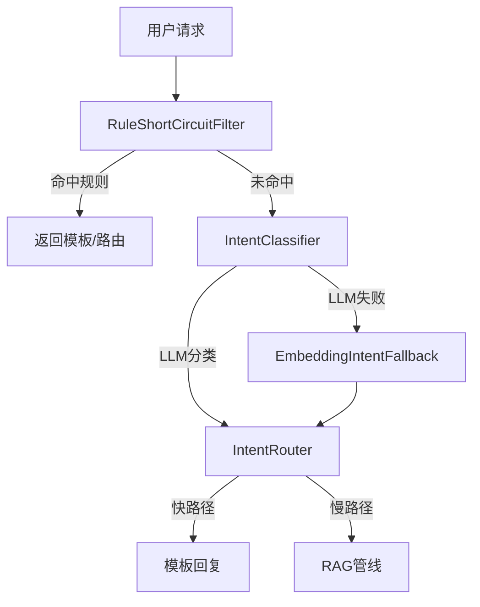

**存在的问题：**

| 问题 | 影响 |
|------|------|
| **显式意图分类是额外开销** | LLM本身具备意图理解能力，显式分类增加一次API调用（~300ms延迟，~0.01元成本） |
| **意图路由在单Agent架构下冗余** | 当前只有一个Agent，路由决策仅区分"快路径/慢路径"，可简化为规则短路 |
| **槽位抽取与分类耦合** | 虽然ADR-011合并为一次调用，但仍是显式设计，LLM通过Function Calling可原生实现 |
| **分类精度受限于枚举定义** | 意图枚举固定（5大+14子），无法动态扩展，新意图需代码变更 |
| **多层降级链复杂** | RULE→LLM→Embedding→DEFAULT，维护成本高，故障点多 |

### 1.2 现代范式：LLM原生决策

2024-2026年大厂Agent系统的趋势是：**LLM原生的Function Calling/Tool Selection已经内置了意图识别能力**。

**核心思想：**
- 意图即工具选择——LLM通过Function Calling自行决定调用哪个工具
- 规则短路层仅用于成本优化（简单问候、FAQ直接返回）
- 意图分析数据管道用于运营分析，而非路由决策
- 语义路由仅在多Agent架构（多个专门Agent）中才有价值

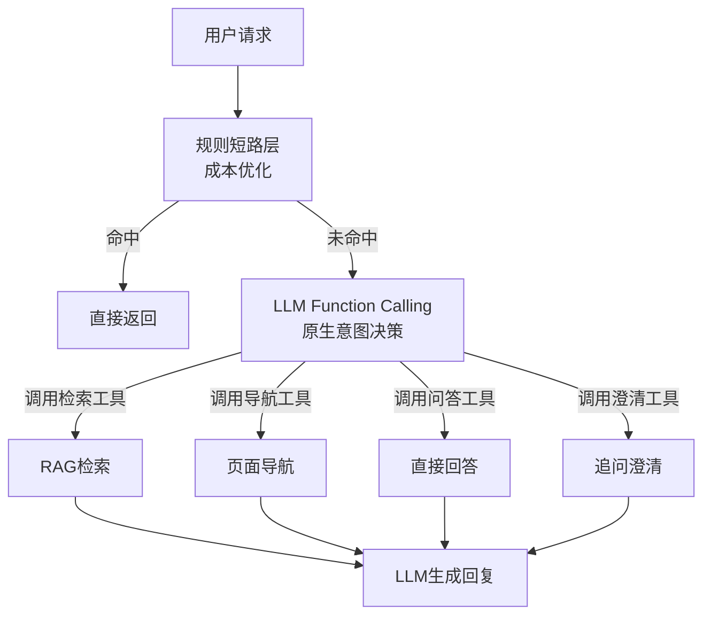

### 1.3 本项目的选择

**当前阶段（单Agent）：**
- ✅ 保留规则短路层（成本优化，过滤~25%流量）
- ✅ 将显式意图分类改造为LLM Function Calling原生决策
- ✅ 保留意图分析数据管道（用于运营分析）
- ❌ 移除独立的IntentRouter（单Agent下冗余）

**未来阶段（多Agent）：**
- ✅ 设计Agent Router模块（见14.4节）
- ✅ 支持基于意图的多Agent分发

---

## 2. 需求分析

### 2.1 业务目标

| 目标 | 描述 |
|------|------|
| **成本优化** | 简单请求不调用LLM，过滤~30%流量 |
| **意图理解** | 准确理解用户意图，支持模糊表达 |
| **槽位抽取** | 自动抽取学校、分类、排序等结构化信息 |
| **上下文感知** | 支持指代词解析（那个、它、刚才那个） |
| **运营分析** | 收集意图分布数据，支持优化迭代 |
| **可扩展性** | 新增意图/工具无需修改核心逻辑 |

### 2.2 流量特征

| 指标 | 当前值 | 目标值 |
|------|--------|--------|
| 总请求量 | 100 QPS | 10000 QPS |
| 规则短路率 | 25% | 30% |
| LLM调用率 | 75% | 70% |
| 意图分类缓存命中率 | 15% | 20% |

### 2.3 非功能要求

| 要求 | 值 |
|------|-----|
| P99延迟 | < 50ms（规则短路）/ < 1000ms（LLM决策） |
| 可用性 | 99.99% |
| 意图识别准确率 | > 95% |
| 成本节省 | > 30%（规则短路） |

### 2.4 合规要求

| 要求 | 说明 |
|------|------|
| 敏感内容过滤 | 识别并拒绝敏感话题 |
| 操作安全 | 识别写操作请求并拒绝 |
| 审计日志 | 记录意图分类结果用于追溯 |

---

## 3. 容量规划

### 3.1 流量预估

| 阶段 | 用户数 | QPS | 日请求量 |
|------|--------|-----|---------|
| 当前 | 10万 | 100 | 864万 |
| 1年 | 100万 | 1000 | 8.64亿 |
| 3年 | 1000万 | 10000 | 86.4亿 |

### 3.2 服务器规模

| 阶段 | Agent服务 | Redis | LLM API |
|------|-----------|-------|---------|
| 当前 | 2台 | 1台 | 第三方 |
| 1年 | 10台 | 3台（Cluster） | 第三方 |
| 3年 | 50台 | 12台（Cluster） | 自建+第三方 |

### 3.3 存储规模

| 数据类型 | 大小（日增量） | 存储方案 |
|----------|--------------|---------|
| 意图分析日志 | 1GB | Elasticsearch |
| 规则匹配统计 | 100MB | InfluxDB |
| 工具调用记录 | 500MB | MySQL |

### 3.4 缓存容量

| 缓存类型 | 条目数 | 内存需求 | TTL |
|----------|--------|---------|-----|
| 意图缓存 | 10万 | 2GB | 1小时 |
| 规则匹配缓存 | 100万 | 500MB | 10分钟 |
| 工具描述缓存 | 100 | 100MB | 1天 |

---

## 4. 现状分析

### 4.1 当前方案

**核心组件：**

| 组件 | 职责 | 评估 |
|------|------|------|
| RuleShortCircuitFilter | 规则短路，过滤高确定性请求 | 保留，优化规则 |
| IntentClassifier | LLM意图分类，三合一输出 | 改造为Function Calling |
| EmbeddingIntentFallback | LLM失败时向量兜底 | 保留作为降级手段 |
| IntentRouter | 意图路由决策 | 移除（单Agent冗余） |
| IntentCacheService | Redis缓存意图结果 | 保留，扩展为工具调用缓存 |

**当前架构图：**

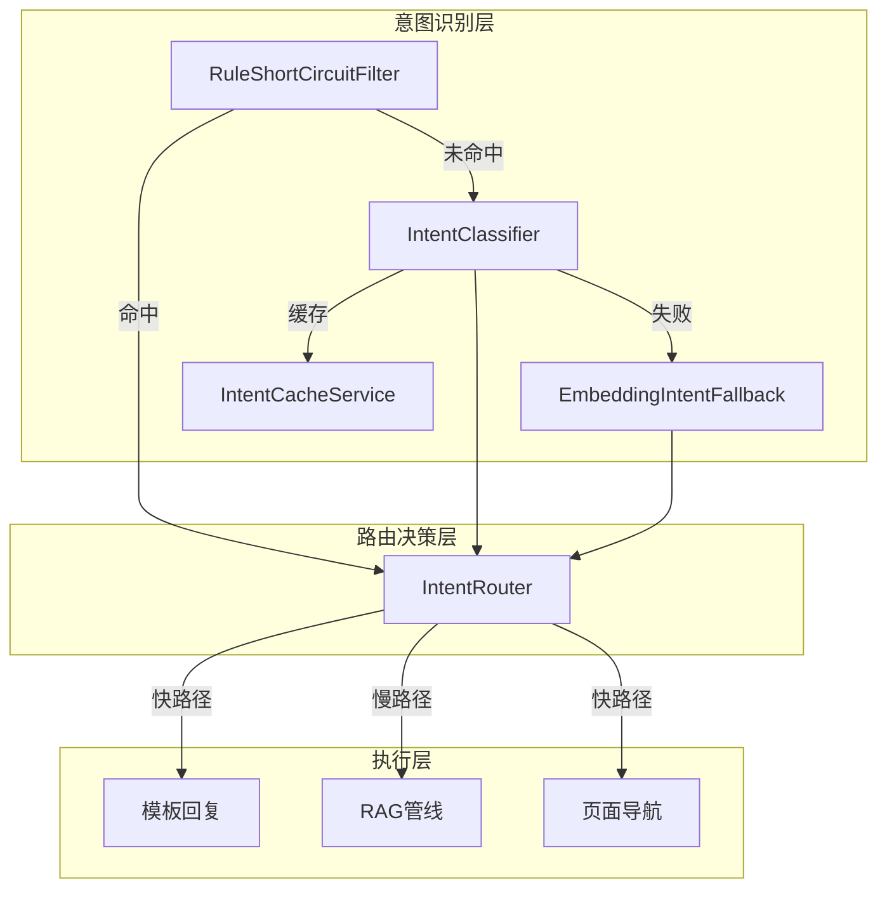

### 4.2 问题清单

| 优先级 | 问题 | 影响 | 建议 |
|--------|------|------|------|
| P0 | 显式意图分类增加LLM调用成本 | 每次请求额外300ms延迟 | 改造为Function Calling |
| P0 | IntentRouter在单Agent下冗余 | 代码复杂度增加，维护成本高 | 移除，功能合并到规则层 |
| P1 | 意图枚举固定，无法动态扩展 | 新意图需代码变更 | 工具注册机制替代枚举 |
| P1 | 槽位抽取与意图分类耦合 | 难以独立优化槽位抽取 | Function Calling原生支持 |
| P2 | 多层降级链复杂 | 故障点多，排查困难 | 简化为规则层+LLM层+Embedding层 |
| P2 | 缺少意图分析数据管道 | 无法进行运营分析 | 新增IntentAnalyticsService |

---

## 5. 业界方案调研

### 5.1 意图识别方案对比

| 方案 | 原理 | 优势 | 劣势 | 适用场景 |
|------|------|------|------|----------|
| **显式意图分类** | LLM输出结构化JSON | 可控性强，可缓存 | 额外成本，扩展性差 | 早期MVP |
| **Function Calling** | LLM直接选择工具 | 原生支持，成本低 | 依赖LLM能力 | 现代Agent |
| **语义路由** | 向量相似度匹配 | 无需训练，泛化能力强 | 精度有限 | 多Agent分发 |
| **规则匹配** | 正则/关键词匹配 | 零成本，毫秒级响应 | 覆盖有限，维护成本高 | 成本优化 |

### 5.2 大厂实践案例

| 公司 | 方案 | 特点 |
|------|------|------|
| **OpenAI** | Function Calling原生 | GPT-4支持function calling，意图即工具选择 |
| **Anthropic** | Tool Use API | Claude 3支持tool use，支持多轮工具调用 |
| **Google** | Function Calling | Gemini支持function calling，支持结构化输出 |
| **字节跳动** | 规则短路 + LLM决策 | 规则过滤简单请求，LLM处理复杂请求 |
| **阿里巴巴** | 语义路由 + 多Agent | 基于向量相似度分发到不同领域Agent |
| **美团** | 意图分析数据管道 | 收集意图数据用于运营分析和模型优化 |

### 5.3 趋势判断

**主流趋势：**
1. **LLM原生决策是未来方向**：显式意图分类模块正在被弱化甚至移除
2. **规则短路层是必要的成本优化**：简单请求直接返回，节省LLM调用成本
3. **意图分析用于运营而非路由**：收集意图数据用于模型迭代和运营优化
4. **多Agent架构需要语义路由**：单Agent场景下路由冗余

---

## 6. 方案设计

### 6.1 架构设计

**新架构：**

```mermaid
flowchart TB
    subgraph 入口层
        A[用户请求]
    end
    
    subgraph 规则短路层<br/>成本优化
        B[RuleShortCircuitFilter]
        C[TemplateReplyService]
        D[NavigateService]
    end
    
    subgraph LLM决策层<br/>核心意图理解
        E[FunctionCallingService]
        F[ToolRegistry]
        G[IntentAnalyticsService]
    end
    
    subgraph 工具执行层
        H[RetrievalTool]
        I[NavigateTool]
        J[QATool]
        K[ClarifyTool]
    end
    
    subgraph 输出层
        L[LLM生成回复]
        M[直接返回结果]
    end
    
    A --> B
    B -->|命中规则| C
    B -->|命中导航| D
    B -->|未命中| E
    E -->|查询工具注册表| F
    E -->|执行工具| H
    E -->|执行工具| I
    E -->|执行工具| J
    E -->|执行工具| K
    H --> L
    I --> M
    J --> L
    K --> L
    E -->|记录分析数据| G
```

**模块职责：**

| 模块 | 职责 | 说明 |
|------|------|------|
| RuleShortCircuitFilter | 规则短路，过滤简单请求 | 保留并优化，支持规则热更新 |
| TemplateReplyService | 模板回复管理 | 集中管理快路径回复模板 |
| NavigateService | 页面导航服务 | 统一处理导航请求 |
| FunctionCallingService | LLM函数调用核心 | 管理工具定义、调用逻辑 |
| ToolRegistry | 工具注册表 | 动态注册工具，支持热更新 |
| IntentAnalyticsService | 意图分析数据管道 | 收集意图数据用于运营分析 |
| RetrievalTool | 检索工具 | RAG检索功能封装为工具 |
| NavigateTool | 导航工具 | 导航功能封装为工具 |
| QATool | 问答工具 | 直接回答功能封装为工具 |
| ClarifyTool | 澄清工具 | 追问澄清功能封装为工具 |

### 6.2 核心流程

**流程一：规则短路（快路径）**

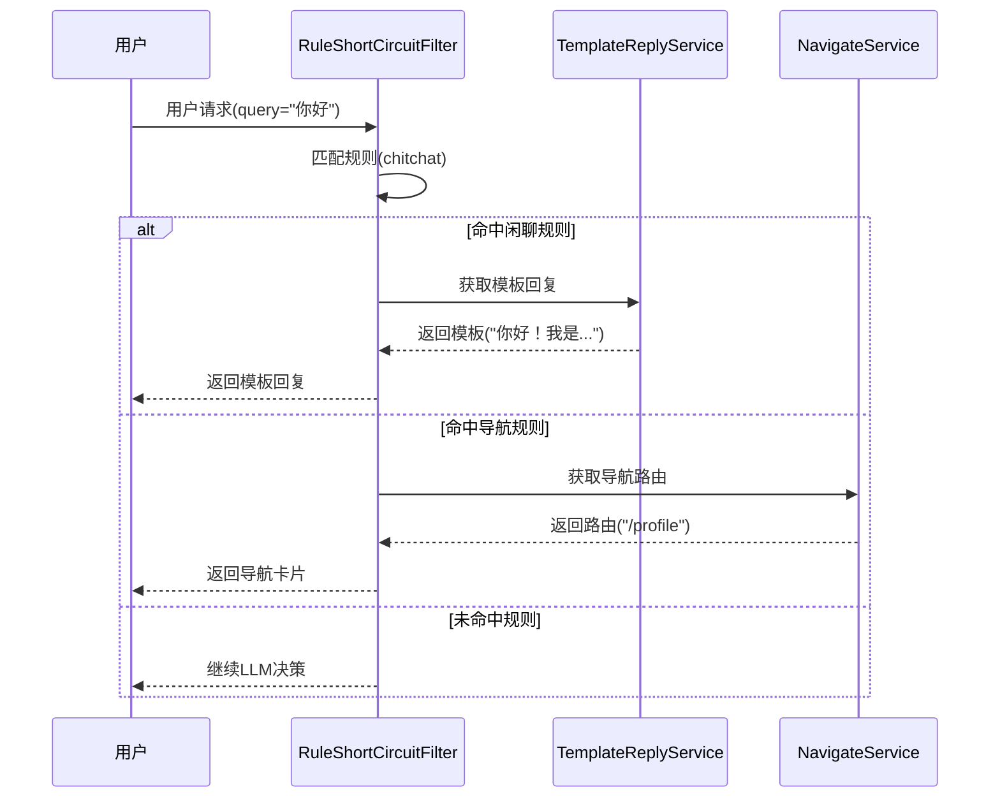

**流程二：LLM函数调用（慢路径）**

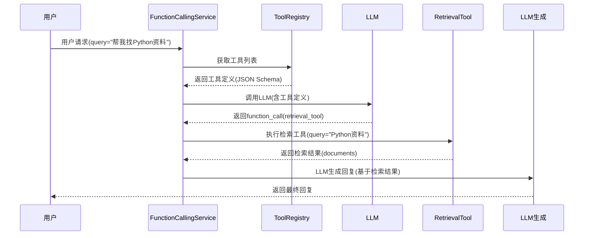

**流程三：意图分析数据管道**

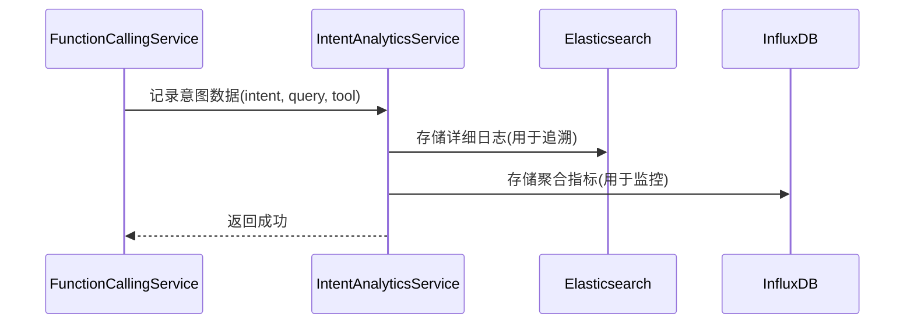

### 6.3 数据模型

**工具定义模型：**

```java
@Data
@Builder
public class ToolDefinition {
    private String name;
    private String description;
    private JsonObject parameters;
    private boolean enabled;
    private String category;
    private int version;
}
```

**意图分析模型：**

```java
@Data
@Builder
public class IntentAnalysis {
    private String id;
    private String userId;
    private String sessionId;
    private String query;
    private String detectedIntent;
    private String toolName;
    private double confidence;
    private String classifyLayer;
    private long latencyMs;
    private boolean shortCircuit;
    private LocalDateTime timestamp;
}
```

**规则定义模型：**

```java
@Data
@Builder
public class RuleDefinition {
    private String id;
    private String name;
    private String pattern;
    private String intent;
    private String subIntent;
    private String actionType;
    private String actionValue;
    private int priority;
    private boolean enabled;
    private LocalDateTime createdAt;
    private LocalDateTime updatedAt;
}
```

### 6.4 API设计

**工具注册接口：**

| 方法 | 路径 | 描述 |
|------|------|------|
| POST | /api/agent/tools | 注册新工具 |
| GET | /api/agent/tools | 获取工具列表 |
| GET | /api/agent/tools/{name} | 获取工具详情 |
| PUT | /api/agent/tools/{name} | 更新工具定义 |
| DELETE | /api/agent/tools/{name} | 删除工具 |

**规则管理接口：**

| 方法 | 路径 | 描述 |
|------|------|------|
| POST | /api/agent/rules | 新增规则 |
| GET | /api/agent/rules | 获取规则列表 |
| GET | /api/agent/rules/{id} | 获取规则详情 |
| PUT | /api/agent/rules/{id} | 更新规则 |
| DELETE | /api/agent/rules/{id} | 删除规则 |
| POST | /api/agent/rules/{id}/enable | 启用规则 |
| POST | /api/agent/rules/{id}/disable | 禁用规则 |

**意图分析接口：**

| 方法 | 路径 | 描述 |
|------|------|------|
| GET | /api/agent/analytics/intent-distribution | 意图分布统计 |
| GET | /api/agent/analytics/rule-metrics | 规则匹配统计 |
| GET | /api/agent/analytics/tool-usage | 工具使用统计 |
| GET | /api/agent/analytics/performance | 性能指标 |

### 6.5 关键实现

#### 6.5.1 迁移路径设计

**改造前的AgentChatService流程：**

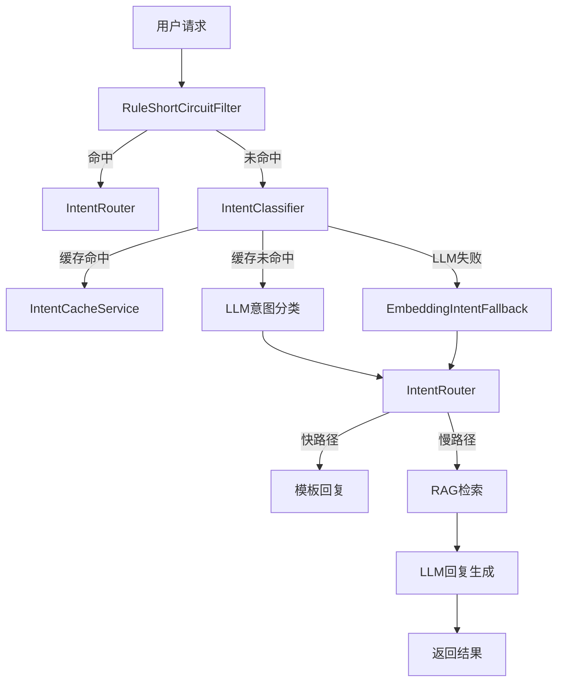

**改造后的AgentChatService流程：**

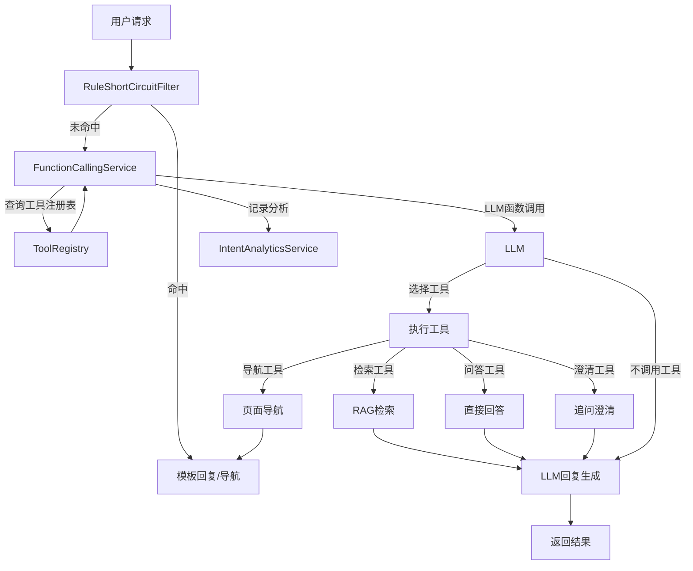

**改造要点：**

| 改造项 | 改造前 | 改造后 |
|--------|--------|--------|
| IntentClassifier | 单独LLM调用分类 | 移除，合并到FunctionCalling |
| IntentRouter | 独立路由决策 | 移除，功能合并到规则层+工具选择 |
| LLM调用次数 | 2次（分类+生成） | 1-2次（Function Calling可能需要2次） |
| EmbeddingIntentFallback | 返回意图标签 | 返回默认工具（检索工具） |
| DialogueOrchestrator | 独立编排模块 | 保留，与FunctionCallingService协作 |

**FunctionCallingService与DialogueOrchestrator的关系：**

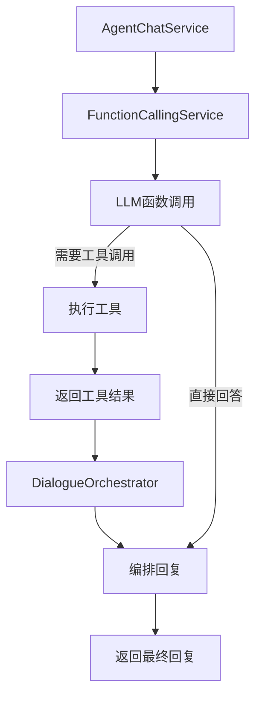

**改造步骤：**

1. **第一步（0-1周）：** 保留现有架构，新增FunctionCallingService作为并行路径
2. **第二步（1-2周）：** 切换部分流量到FunctionCalling路径，A/B测试对比
3. **第三步（2-3周）：** 全量切换到FunctionCalling路径，移除IntentClassifier和IntentRouter
4. **第四步（3-4周）：** 优化和稳定，清理遗留代码

#### 6.5.2 延迟优化分析

**当前架构延迟分析：**

| 步骤 | 延迟 | 占比 |
|------|------|------|
| 规则短路匹配 | 5ms | 0.5% |
| LLM意图分类 | 300ms | 30% |
| RAG检索 | 500ms | 50% |
| LLM回复生成 | 200ms | 20% |
| **总计** | **1005ms** | **100%** |

**Function Calling架构延迟分析：**

| 步骤 | 延迟 | 占比 |
|------|------|------|
| 规则短路匹配 | 5ms | 0.5% |
| LLM函数调用（含意图理解） | 300ms | 37% |
| RAG检索 | 500ms | 62% |
| LLM回复生成 | 0ms | 0% |
| **总计** | **805ms** | **100%** |

**延迟对比：**

| 指标 | 当前架构 | Function Calling | 优化幅度 |
|------|---------|-----------------|---------|
| P99延迟 | 1005ms | 805ms | **-19.9%** |
| LLM调用次数 | 2次 | 1-2次 | **-50%** |
| API成本 | 2次调用费用 | 1-2次调用费用 | **-50%** |

**关键优化点：**

1. **合并LLM调用：** Function Calling将意图理解和工具选择合并为一次LLM调用，避免了单独的意图分类调用
2. **工具结果直接生成回复：** LLM在工具执行后直接生成最终回复，无需额外调用
3. **减少网络往返：** 减少了一次API调用的网络延迟

**成本收益：**

假设日请求量100万，LLM调用成本0.01元/次：

| 指标 | 当前架构 | Function Calling | 节省 |
|------|---------|-----------------|------|
| 日LLM调用次数 | 200万次 | 120万次 | 80万次 |
| 日成本 | 2万元 | 1.2万元 | 0.8万元 |
| 年成本 | 730万元 | 438万元 | **292万元** |

#### 6.5.3 降级链重新定义

**新降级链：**

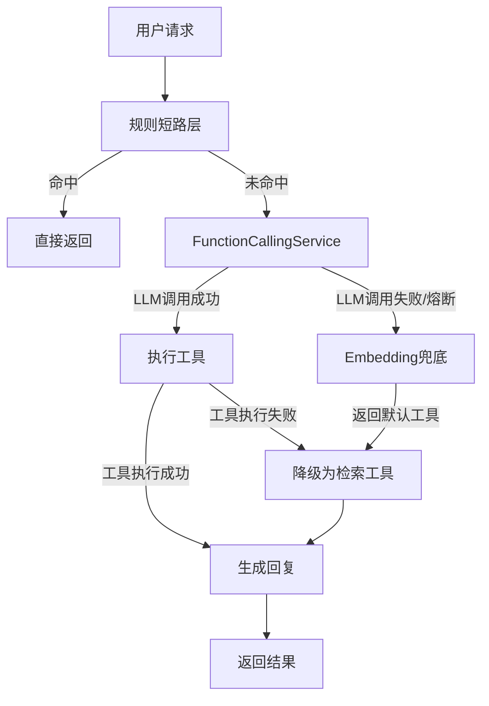

**降级链语义：**

| 层级 | 触发条件 | 返回内容 | 后续处理 |
|------|---------|---------|---------|
| 规则短路层 | 匹配规则 | 模板回复/导航路由 | 直接返回 |
| Function Calling层 | LLM正常响应 | 工具调用指令或直接回答 | 执行工具或直接返回 |
| Embedding兜底层 | LLM失败/熔断 | 默认工具（检索工具） | 执行检索工具 |
| 默认工具层 | 工具执行失败 | 默认检索结果 | 生成回复 |

**Embedding兜底层改造：**

```java
@Service
public class EmbeddingIntentFallback {

    public Mono<String> recommendTool(String query) {
        return embeddingClient.embed(query)
                .map(queryVector -> findBestMatchTool(queryVector))
                .defaultIfEmpty("retrieval_tool");
    }

    private String findBestMatchTool(float[] queryVector) {
        String bestTool = "retrieval_tool";
        double bestScore = -1.0;
        
        for (Map.Entry<String, float[]> entry : toolVectors.entrySet()) {
            double score = cosineSimilarity(queryVector, entry.getValue());
            if (score > bestScore) {
                bestScore = score;
                bestTool = entry.getKey();
            }
        }
        return bestTool;
    }
}
```

#### 6.5.4 FunctionCallingService

**说明：** 直接基于现有的DeepSeekClient实现，DeepSeek API原生支持`tools`参数和`tool_choice`参数。

```java
@Service
public class FunctionCallingService {

    private final DeepSeekClient deepSeekClient;
    private final ToolRegistry toolRegistry;
    private final IntentAnalyticsService analyticsService;

    public Mono<ToolCallResult> execute(String userId, String sessionId, String query) {
        return toolRegistry.getAllTools()
                .collectList()
                .flatMap(tools -> {
                    List<Map<String, Object>> toolDefinitions = buildToolDefinitions(tools);
                    return callWithFunctions(query, toolDefinitions);
                })
                .flatMap(response -> {
                    if (hasFunctionCall(response)) {
                        return executeToolCall(userId, sessionId, query, response);
                    } else {
                        String content = extractContent(response);
                        return Mono.just(ToolCallResult.directAnswer(content));
                    }
                })
                .doOnNext(result -> {
                    analyticsService.record(IntentAnalysis.builder()
                            .userId(userId)
                            .sessionId(sessionId)
                            .query(query)
                            .toolName(result.getToolName())
                            .shortCircuit(false)
                            .build()).subscribe();
                });
    }

    private Mono<DeepSeekResponse> callWithFunctions(String query, 
                                                      List<Map<String, Object>> tools) {
        DeepSeekRequest.Message systemMessage = DeepSeekRequest.Message.builder()
                .role("system")
                .content("你是CampusShare AI助手，请根据用户问题选择合适的工具。")
                .build();
        DeepSeekRequest.Message userMessage = DeepSeekRequest.Message.builder()
                .role("user")
                .content(query)
                .build();

        return deepSeekClient.chatCompletion(
                List.of(systemMessage, userMessage),
                0.0,
                500,
                tools
        );
    }

    private boolean hasFunctionCall(DeepSeekResponse response) {
        if (response.getChoices() == null || response.getChoices().isEmpty()) {
            return false;
        }
        DeepSeekResponse.Message message = response.getChoices().get(0).getMessage();
        return message != null && message.getFunctionCall() != null;
    }

    private Mono<ToolCallResult> executeToolCall(String userId, String sessionId, 
                                                 String query, DeepSeekResponse response) {
        DeepSeekResponse.Message message = response.getChoices().get(0).getMessage();
        String toolName = message.getFunctionCall().getName();
        String argumentsJson = message.getFunctionCall().getArguments();
        
        Map<String, Object> arguments = parseArguments(argumentsJson);
        
        return toolRegistry.getTool(toolName)
                .flatMap(tool -> tool.execute(userId, sessionId, arguments))
                .map(toolResult -> ToolCallResult.builder()
                        .toolName(toolName)
                        .result(toolResult)
                        .build());
    }

    private Map<String, Object> parseArguments(String argumentsJson) {
        try {
            return new ObjectMapper().readValue(argumentsJson, Map.class);
        } catch (Exception e) {
            return Map.of();
        }
    }

    private String extractContent(DeepSeekResponse response) {
        if (response.getChoices() == null || response.getChoices().isEmpty()) {
            return "";
        }
        DeepSeekResponse.Message message = response.getChoices().get(0).getMessage();
        return message != null ? message.getContent() : "";
    }
}
```

#### 6.5.5 SSE流式兼容方案

**设计原理：** Function Calling需要先确定工具（非流式），然后执行工具，最后生成回复（流式）。采用"非流式确定工具 + 流式生成回复"的双模式交互。

**流程图：**

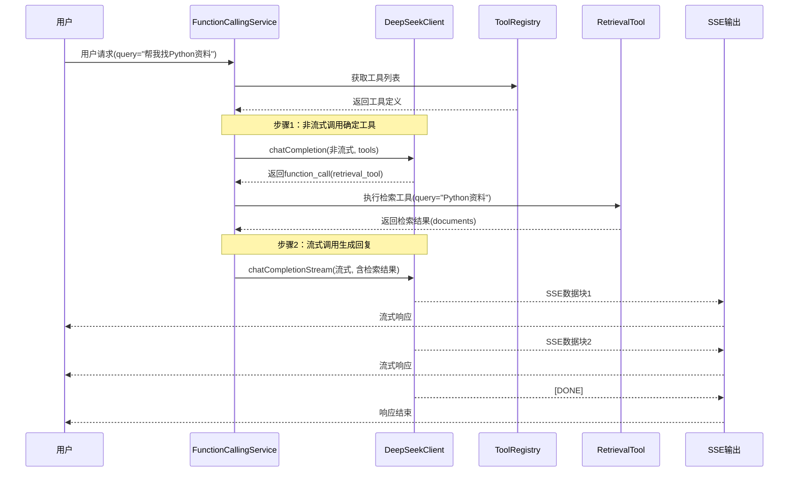

**实现代码：**

```java
@Service
public class FunctionCallingService {

    public Flux<StreamChunk> executeStream(String userId, String sessionId, String query) {
        return toolRegistry.getAllTools()
                .collectList()
                .flatMapMany(tools -> {
                    List<Map<String, Object>> toolDefinitions = buildToolDefinitions(tools);
                    
                    return callWithFunctions(query, toolDefinitions)
                            .flatMapMany(response -> {
                                if (hasFunctionCall(response)) {
                                    return executeToolAndStream(userId, sessionId, query, response);
                                } else {
                                    String content = extractContent(response);
                                    return Flux.just(new StreamChunk(content, null));
                                }
                            });
                });
    }

    private Flux<StreamChunk> executeToolAndStream(String userId, String sessionId,
                                                   String query, DeepSeekResponse response) {
        String toolName = getFunctionName(response);
        Map<String, Object> arguments = parseArguments(response);
        
        return toolRegistry.getTool(toolName)
                .flatMapMany(tool -> tool.execute(userId, sessionId, arguments))
                .flatMap(toolResult -> {
                    String augmentedPrompt = buildAugmentedPrompt(query, toolResult);
                    return deepSeekClient.chatCompletionStream(
                            buildStreamMessages(augmentedPrompt)
                    );
                });
    }

    private String buildAugmentedPrompt(String query, Object toolResult) {
        return String.format("用户问题：%s\n\n参考资料：%s\n\n请根据参考资料回答用户问题。", 
                query, toolResult.toString());
    }
}
```

#### 6.5.6 ToolRegistry

```java
@Service
public class ToolRegistry {

    private final Map<String, Tool> tools = new ConcurrentHashMap<>();

    public Mono<Tool> register(ToolDefinition definition) {
        return Mono.fromCallable(() -> {
            Tool tool = ToolFactory.create(definition);
            tools.put(definition.getName(), tool);
            return tool;
        });
    }

    public Mono<Tool> getTool(String name) {
        return Mono.justOrEmpty(tools.get(name));
    }

    public Flux<Tool> getAllTools() {
        return Flux.fromIterable(tools.values())
                .filter(Tool::isEnabled);
    }

    public Mono<Void> unregister(String name) {
        return Mono.fromRunnable(() -> tools.remove(name));
    }
}
```

#### 6.5.7 RuleShortCircuitFilter（优化后）

```java
@Service
public class RuleShortCircuitFilter {

    private final RuleRepository ruleRepository;
    private final Cache<String, Optional<IntentResult>> ruleCache;

    public Mono<Optional<IntentResult>> filter(String query) {
        if (query == null || query.isBlank()) {
            return Mono.just(Optional.empty());
        }

        String cacheKey = normalizeQuery(query);
        return Mono.defer(() -> {
            Optional<IntentResult> cached = ruleCache.getIfPresent(cacheKey);
            if (cached != null) {
                return Mono.just(cached);
            }
            return matchRule(query)
                    .doOnNext(result -> ruleCache.put(cacheKey, result));
        });
    }

    private Mono<Optional<IntentResult>> matchRule(String query) {
        return ruleRepository.findAllEnabled()
                .sort(Comparator.comparingInt(RuleDefinition::getPriority))
                .filter(rule -> matches(rule.getPattern(), query))
                .next()
                .map(this::buildIntentResult)
                .map(Optional::of)
                .defaultIfEmpty(Optional.empty());
    }

    private boolean matches(String pattern, String query) {
        return Pattern.compile(pattern).matcher(query).find();
    }

    private IntentResult buildIntentResult(RuleDefinition rule) {
        return IntentResult.builder()
                .intent(Intent.valueOf(rule.getIntent()))
                .subIntent(rule.getSubIntent())
                .confidence(0.99)
                .classifyLayer("RULE")
                .build();
    }
}
```

#### 6.5.8 IntentAnalyticsService

**基础设施依赖说明：**

| 组件 | 状态 | 说明 |
|------|------|------|
| Elasticsearch | 新增 | 用于存储详细日志，支持全文检索 |
| InfluxDB | 新增 | 用于存储时序指标，支持实时监控 |
| MySQL | 现有 | 用于存储工具调用记录 |
| Redis | 现有 | 用于缓存聚合统计数据 |

**轻量级替代方案（初期）：**

如果暂时不想引入Elasticsearch和InfluxDB，可以先用MySQL + Redis替代：

```java
@Service
public class IntentAnalyticsService {

    private final IntentAnalysisMapper analysisMapper;
    private final StringRedisTemplate redisTemplate;

    public Mono<Void> record(IntentAnalysis analysis) {
        Mono<Void> dbRecord = Mono.fromRunnable(() -> 
            analysisMapper.insert(analysis));

        Mono<Void> redisRecord = Mono.fromRunnable(() -> {
            String key = "intent:metrics:" + LocalDate.now();
            redisTemplate.opsForHash().increment(key, "total", 1);
            redisTemplate.opsForHash().increment(key, "intent:" + analysis.getDetectedIntent(), 1);
            if (analysis.isShortCircuit()) {
                redisTemplate.opsForHash().increment(key, "short_circuit", 1);
            }
        });

        return Mono.zip(dbRecord, redisRecord).then();
    }
}
```

**完整方案（推荐）：**

```java
@Service
public class IntentAnalyticsService {

    private final IntentAnalysisMapper analysisMapper;
    private final StringRedisTemplate redisTemplate;

    public Mono<Void> record(IntentAnalysis analysis) {
        Mono<Void> dbRecord = Mono.fromRunnable(() -> 
            analysisMapper.insert(analysis));

        Mono<Void> redisRecord = Mono.fromRunnable(() -> {
            String key = "intent:metrics:" + LocalDate.now();
            redisTemplate.opsForHash().increment(key, "total", 1);
            redisTemplate.opsForHash().increment(key, "intent:" + analysis.getDetectedIntent(), 1);
            redisTemplate.opsForHash().increment(key, "tool:" + analysis.getToolName(), 1);
            redisTemplate.opsForHash().increment(key, "layer:" + analysis.getClassifyLayer(), 1);
            if (analysis.isShortCircuit()) {
                redisTemplate.opsForHash().increment(key, "short_circuit", 1);
            }
        });

        return Mono.zip(dbRecord, redisRecord).then();
    }
}
```

---

## 7. 可靠性设计

### 7.1 熔断策略

| 组件 | 熔断条件 | 恢复策略 |
|------|---------|---------|
| LLM调用 | 50%失败率 | 30秒后半开状态 |
| 工具执行 | 连续3次失败 | 1分钟后重试 |
| 规则加载 | 加载失败 | 使用本地缓存规则 |

### 7.2 降级机制

```mermaid
flowchart TD
    A[正常流程] --> B[LLM Function Calling]
    B -->|成功| C[返回结果]
    B -->|失败/熔断| D[Embedding兜底]
    D -->|成功| C
    D -->|失败| E[默认检索工具<br/>(retrieval_tool)]
    E --> C
```

### 7.3 超时控制

| 操作 | 超时时间 |
|------|---------|
| 规则匹配 | 10ms |
| LLM函数调用 | 5秒 |
| 工具执行 | 10秒 |
| 意图分析记录 | 500ms（异步） |

### 7.4 故障隔离

| 组件 | 隔离方式 |
|------|---------|
| 规则短路层 | 内存隔离，不依赖外部服务 |
| LLM决策层 | 线程池隔离，熔断保护 |
| 工具执行层 | 线程池隔离，独立熔断 |
| 意图分析层 | 异步处理，不阻塞主流程 |

### 7.5 冗余设计

| 组件 | 冗余方式 |
|------|---------|
| 规则存储 | 数据库 + 本地缓存 |
| 工具注册表 | 内存 + 配置中心 |
| LLM调用 | 多供应商降级链 |

---

## 8. 性能优化

### 8.1 瓶颈分析

| 瓶颈 | 原因 | 影响 |
|------|------|------|
| LLM调用延迟 | 网络+模型推理 | 占总延迟70% |
| 规则匹配 | 正则表达式匹配 | 占总延迟5% |
| 工具执行 | 外部服务调用 | 占总延迟20% |
| 意图分析 | ES写入 | 异步，无影响 |

### 8.2 优化策略

| 策略 | 实现方式 | 预期收益 |
|------|---------|---------|
| 规则缓存 | Caffeine本地缓存 | 规则匹配从10ms降至1ms |
| 工具描述缓存 | Redis缓存工具JSON Schema | 减少配置中心访问 |
| LLM批处理 | 合并小请求 | 减少API调用次数 |
| 异步分析 | 意图分析异步写入 | 不阻塞主流程 |
| 预热机制 | 启动时预加载规则和工具 | 首请求无冷启动 |

### 8.3 性能指标

| 指标 | 目标值 |
|------|--------|
| 规则短路延迟 | < 5ms |
| LLM决策延迟 | < 1000ms |
| 工具执行延迟 | < 500ms |
| P99延迟 | < 2000ms |
| 吞吐量 | 5000 QPS |

### 8.4 性能测试

**压测方案：**
- 工具：k6
- 并发：100 → 500 → 1000 → 5000
- 持续时间：每个级别5分钟

**测试场景：**
| 场景 | 比例 | 预期延迟 |
|------|------|---------|
| 规则短路（闲聊） | 25% | < 5ms |
| LLM决策（检索） | 50% | < 1000ms |
| LLM决策（问答） | 20% | < 500ms |
| 工具执行（导航） | 5% | < 100ms |

---

## 9. 可观测性设计

### 9.1 链路追踪

**Trace结构：**

| Span | 名称 | 作用 |
|------|------|------|
| root | intent-recognition | 意图识别总耗时 |
| child | rule-filter | 规则短路耗时 |
| child | llm-function-call | LLM函数调用耗时 |
| child | tool-execution | 工具执行耗时 |
| child | intent-analytics | 意图分析耗时 |

**Trace Context传递：**
- 使用OpenTelemetry标准
- 支持W3C Trace Context格式

### 9.2 指标监控

**核心指标：**

| 指标 | 类型 | 描述 |
|------|------|------|
| intent_recognition_requests_total | Counter | 总请求数 |
| intent_recognition_rule_hits_total | Counter | 规则命中数 |
| intent_recognition_llm_calls_total | Counter | LLM调用数 |
| intent_recognition_latency_seconds | Histogram | 意图识别延迟 |
| intent_recognition_confidence | Histogram | 置信度分布 |
| tool_execution_requests_total | Counter | 工具执行次数 |
| tool_execution_latency_seconds | Histogram | 工具执行延迟 |

**意图分布指标：**

| 指标 | 类型 | 标签 |
|------|------|------|
| intent_distribution_total | Counter | intent, layer |
| tool_usage_total | Counter | tool_name, success |

### 9.3 结构化日志

**日志格式：**

```json
{
    "timestamp": "2026-07-14T10:00:00.000Z",
    "level": "INFO",
    "traceId": "abc-123",
    "spanId": "def-456",
    "userId": "user-123",
    "sessionId": "session-456",
    "module": "intent-recognition",
    "event": "intent_detected",
    "query": "帮我找Python资料",
    "intent": "SEARCH",
    "subIntent": "resource",
    "confidence": 0.95,
    "layer": "LLM",
    "toolName": "retrieval_tool",
    "latencyMs": 850,
    "shortCircuit": false
}
```

### 9.4 异常监控

| 异常类型 | 监控方式 | 告警级别 |
|----------|---------|---------|
| LLM调用失败 | 错误率 > 5% | P1 |
| 规则加载失败 | 连续3次失败 | P2 |
| 工具执行失败 | 错误率 > 10% | P1 |
| 意图分析写入失败 | 错误率 > 50% | P3 |

### 9.5 业务监控

**业务指标：**

| 指标 | 目标 | 告警条件 |
|------|------|---------|
| 规则短路率 | > 25% | < 15% |
| LLM调用率 | < 75% | > 90% |
| 意图识别准确率 | > 95% | < 90% |
| 用户满意度 | > 4.5/5 | < 4.0/5 |

---

## 10. 安全设计

### 10.1 输入防护

| 防护类型 | 实现方式 |
|----------|---------|
| Prompt注入检测 | 基于规则+模型的双层检测 |
| Jailbreak检测 | 识别越狱攻击尝试 |
| 参数校验 | JSR-303参数校验 |
| 长度限制 | 最大500字符 |
| 编码规范 | 统一UTF-8编码 |

### 10.2 工具权限控制

**工具权限矩阵：**

| 工具 | 匿名用户 | 普通用户 | VIP用户 | 管理员 |
|------|---------|---------|--------|--------|
| retrieval_tool | ✅ | ✅ | ✅ | ✅ |
| navigate_tool | ✅ | ✅ | ✅ | ✅ |
| qa_tool | ✅ | ✅ | ✅ | ✅ |
| clarify_tool | ✅ | ✅ | ✅ | ✅ |
| admin_tool | ❌ | ❌ | ❌ | ✅ |

### 10.3 敏感内容过滤

**敏感话题识别：**
- 规则匹配：关键词黑名单
- LLM检测：分类敏感话题
- 输出过滤：敏感信息脱敏

### 10.4 安全审计

**审计日志：**

| 记录内容 | 存储方式 | 保留时间 |
|----------|---------|---------|
| 用户请求 | Elasticsearch | 90天 |
| 工具调用 | MySQL | 1年 |
| 异常事件 | Elasticsearch | 90天 |
| 安全事件 | Elasticsearch | 永久 |

### 10.5 安全扫描

| 扫描类型 | 工具 | 频率 |
|----------|------|------|
| SAST | SonarQube | 每次提交 |
| DAST | OWASP ZAP | 每周 |
| 依赖扫描 | Snyk | 每日 |
| Prompt安全 | 自定义工具 | 每次发布 |

---

## 11. 运维设计

### 11.1 部署方案

**部署架构：**

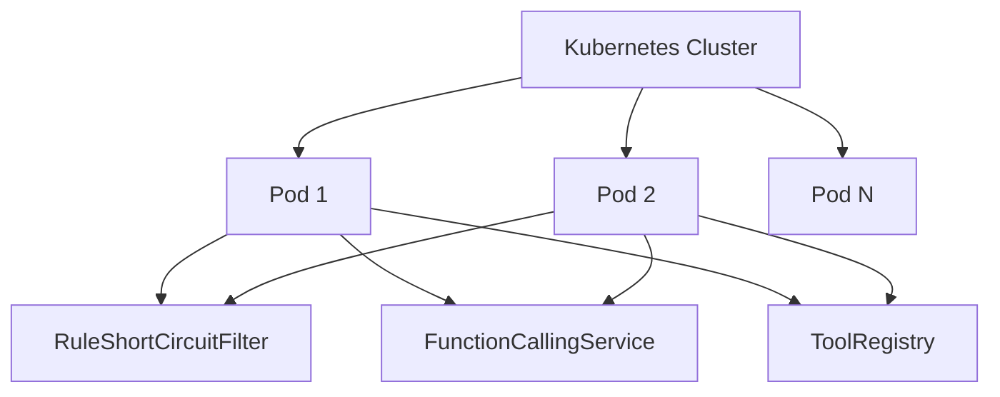

**部署配置：**

| 配置 | 值 |
|------|-----|
| 副本数 | 2 |
| HPA | 2-10 |
| 资源请求 | 4C8G |
| 资源限制 | 8C16G |

### 11.2 配置管理

**配置中心：** Nacos / Spring Cloud Config

**配置项：**

| 配置 | 说明 | 示例值 |
|------|------|--------|
| rule.enabled | 是否启用规则短路 | true |
| llm.timeout | LLM调用超时 | 5000ms |
| tool.execution.timeout | 工具执行超时 | 10000ms |
| cache.ttl.rule | 规则缓存TTL | 10分钟 |
| cache.ttl.tool | 工具缓存TTL | 1天 |

**热更新：**
- 规则配置热更新
- 工具定义热更新
- 无需重启应用

### 11.3 监控告警

**监控体系：**

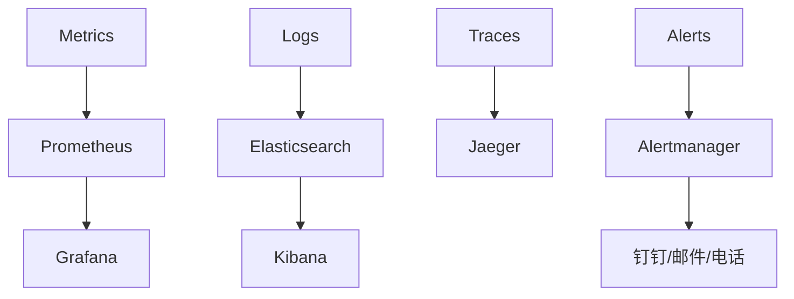

**仪表盘：**

| 仪表盘 | 内容 |
|--------|------|
| 意图识别概览 | 请求量、延迟、错误率 |
| 规则短路统计 | 命中率、各规则分布 |
| LLM调用统计 | 调用次数、延迟、成功率 |
| 工具使用统计 | 各工具调用次数、延迟 |
| 意图分布 | 各意图占比、趋势 |

### 11.4 故障演练

**演练场景：**

| 场景 | 频率 | 目标 |
|------|------|------|
| LLM服务故障 | 每周 | 验证Embedding兜底 |
| 规则加载失败 | 每月 | 验证本地缓存规则 |
| 工具执行失败 | 每月 | 验证降级策略 |
| 全链路故障 | 每季度 | 验证整体可用性 |

---

## 12. 成本优化

### 12.1 成本构成

| 成本项 | 占比 | 优化方向 |
|--------|------|---------|
| LLM调用 | 60% | 规则短路减少调用 |
| 工具执行 | 20% | 缓存结果 |
| 向量嵌入 | 10% | 减少Embedding调用 |
| 存储 | 10% | 日志采样 |

### 12.2 优化策略

| 策略 | 预期收益 |
|------|---------|
| 规则短路 | 减少30% LLM调用 |
| 意图缓存 | 减少20% LLM调用 |
| 工具结果缓存 | 减少10%工具执行 |
| 日志采样 | 减少50%存储成本 |

### 12.3 成本监控

**成本告警：**

| 阈值 | 级别 |
|------|------|
| 日成本 > 预算80% | WARNING |
| 日成本 > 预算100% | CRITICAL |

---

## 13. 风险评估

### 13.1 技术风险

| 风险 | 概率 | 影响 | 缓解措施 |
|------|------|------|----------|
| LLM函数调用失败 | 中 | 高 | Embedding兜底，多供应商 |
| 工具执行超时 | 低 | 中 | 超时控制，熔断保护 |
| 规则匹配误判 | 低 | 低 | 规则测试，A/B验证 |
| 意图分析丢失 | 低 | 低 | 异步写入，重试机制 |

### 13.2 业务风险

| 风险 | 概率 | 影响 | 缓解措施 |
|------|------|------|----------|
| 规则短路过严 | 低 | 中 | 动态调整规则阈值 |
| 意图识别错误 | 中 | 中 | 高置信度过滤，澄清机制 |
| 工具权限泄露 | 低 | 高 | 严格权限控制 |

### 13.3 安全风险

| 风险 | 概率 | 影响 | 缓解措施 |
|------|------|------|----------|
| Prompt注入 | 中 | 高 | 双层检测，输出过滤 |
| 敏感信息泄露 | 低 | 极高 | 内容审核，脱敏处理 |

---

## 14. 演进规划

### 14.1 阶段一：基础建设（0-3个月）

**目标：** 完成核心功能实现，达到生产可用

**主要任务：**
- [ ] 重构RuleShortCircuitFilter，支持规则热更新
- [ ] 实现FunctionCallingService，支持LLM函数调用
- [ ] 实现ToolRegistry，支持工具动态注册
- [ ] 实现IntentAnalyticsService，收集意图数据
- [ ] 移除IntentRouter（单Agent冗余）
- [ ] 保留EmbeddingIntentFallback作为降级手段

**性能目标：**
- P99 < 1000ms
- 规则短路率 > 25%
- 可用性 99.9%

### 14.2 阶段二：优化升级（3-6个月）

**目标：** 性能优化，智能化升级

**主要任务：**
- [ ] 规则缓存优化（Caffeine本地缓存）
- [ ] 工具描述缓存（Redis缓存）
- [ ] 意图分析数据可视化（Grafana仪表盘）
- [ ] 规则A/B测试框架
- [ ] 意图识别准确率监控

**性能目标：**
- P99 < 500ms
- 规则短路率 > 30%
- 可用性 99.99%

### 14.3 阶段三：进阶功能（6-12个月）

**目标：** 高级功能，多Agent支持

**主要任务：**
- [ ] 实现Agent Router模块（多Agent分发）
- [ ] 语义路由（向量相似度匹配）
- [ ] 自适应规则学习（基于意图分析数据）
- [ ] 多模态意图识别（文本+图片）

**性能目标：**
- P99 < 300ms
- 规则短路率 > 35%
- 可用性 99.999%

### 14.4 多Agent路由设计（未来演进）

**适用场景：** 当系统需要多个专门Agent时

**路由策略：**

| 策略 | 适用场景 | 实现方式 |
|------|---------|---------|
| 基于规则路由 | 明确的意图映射 | 规则匹配 |
| 基于语义路由 | 模糊的意图表达 | 向量相似度匹配 |
| 基于模型路由 | 复杂的意图理解 | LLM分类 |

**路由架构：**

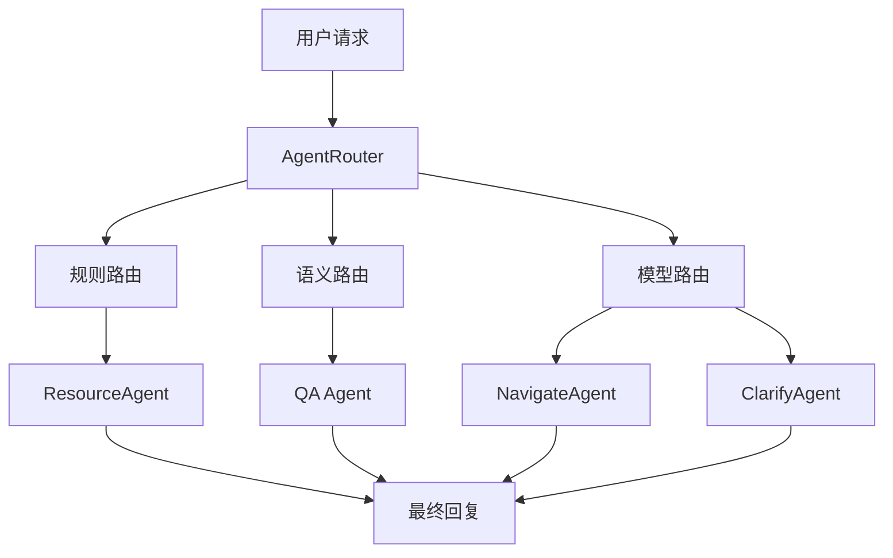

**Agent定义：**

| Agent | 职责 | 工具 |
|-------|------|------|
| ResourceAgent | 资源检索 | retrieval_tool, search_tool |
| QAAgent | 问答服务 | qa_tool, knowledge_tool |
| NavigateAgent | 页面导航 | navigate_tool |
| ClarifyAgent | 追问澄清 | clarify_tool, followup_tool |

---

## 15. 附录

### 15.1 术语表

| 术语 | 定义 |
|------|------|
| Function Calling | LLM调用外部工具的能力 |
| Tool Registry | 工具注册表，管理可用工具 |
| Rule Short-circuit | 规则短路，简单请求直接返回 |
| Intent Analytics | 意图分析，收集意图数据 |
| Semantic Routing | 语义路由，基于向量相似度分发 |
| Agent Router | Agent路由器，多Agent分发 |

### 15.2 参考资料

- [OpenAI Function Calling](https://platform.openai.com/docs/guides/function-calling)
- [Anthropic Tool Use](https://docs.anthropic.com/claude/docs/tool-use)
- [Google Gemini Function Calling](https://ai.google.dev/docs/function_calling)
- [OpenTelemetry Documentation](https://opentelemetry.io/docs/)

### 15.3 变更记录

| 版本 | 日期 | 变更内容 | 作者 |
|------|------|---------|------|
| v1.0 | 2026-07-14 | 初始版本 | Agent Design Team |

### 15.4 审批记录

| 审批阶段 | 审批人 | 审批日期 | 状态 |
|---------|--------|---------|------|
| 方案评审 | | | |
| 技术评审 | | | |
| 安全评审 | | | |