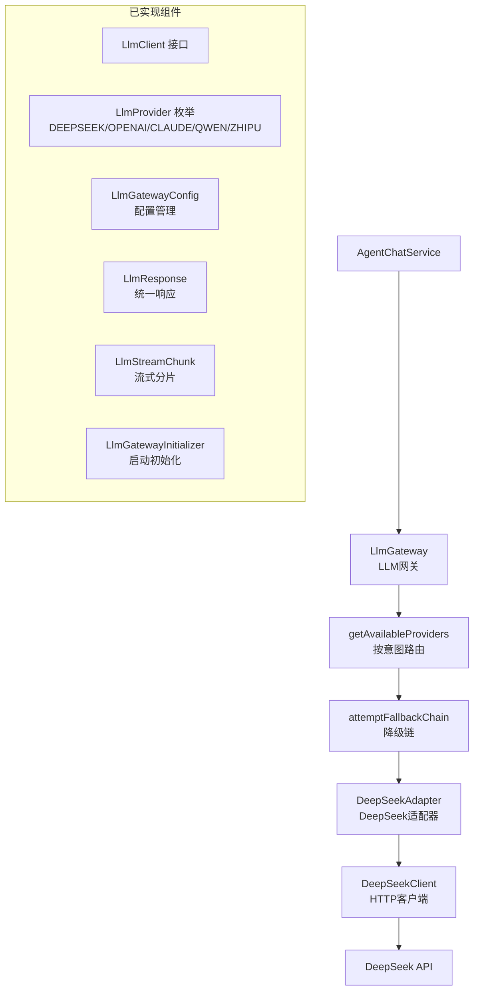
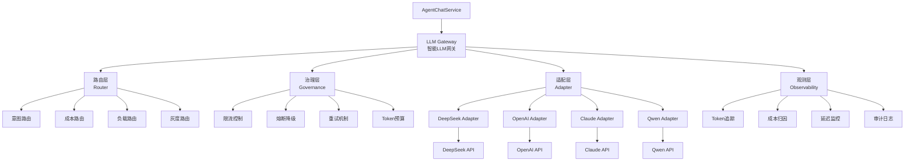
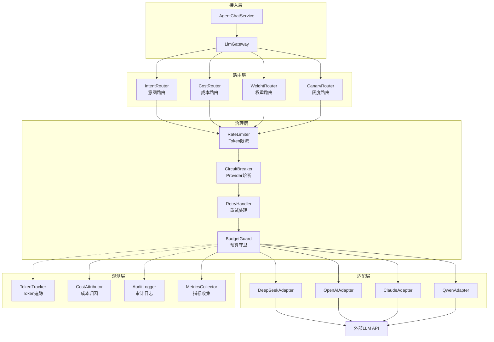
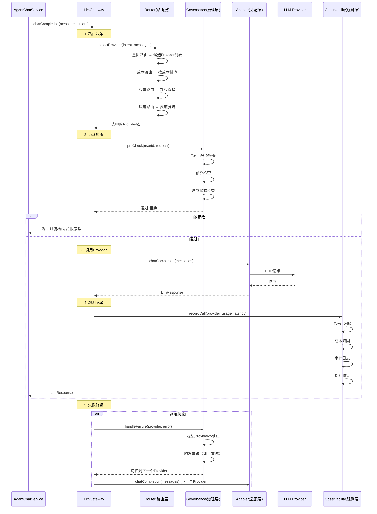
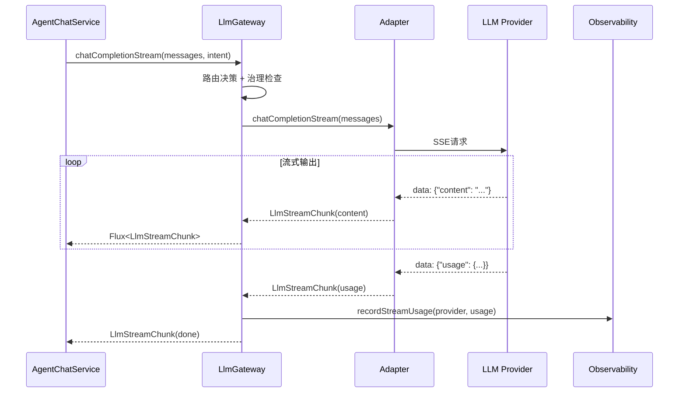
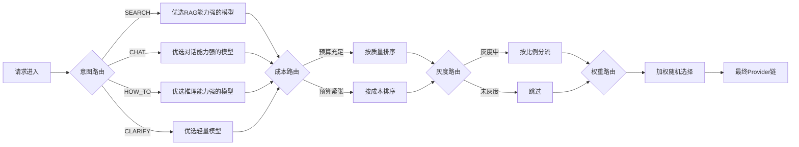

# LLM网关技术设计文档

## 文档信息

| 项目 | 内容 |
|------|------|
| **文档版本** | v1.0 |
| **创建日期** | 2026-07-14 |
| **适用项目** | CampusShare Agent |
| **模块名称** | LLM Gateway（大模型网关） |
| **设计目标** | 企业级LLM统一网关，实现多供应商管理、智能路由、成本归因、熔断降级、流式SSE输出 |

---

## 1. 范式反思：从单点调用到统一网关

### 1.1 当前架构分析

当前系统已实现基础LLM网关架构：



**核心组件：**

| 组件 | 文件 | 职责 |
|------|------|------|
| **LlmGateway** | [LlmGateway.java](file:///e:/workspace_work/CampusShare/backend/campushare-agent/src/main/java/com/campushare/agent/llm/gateway/LlmGateway.java) | 网关核心：路由、降级链、健康检查 |
| **LlmClient** | [LlmClient.java](file:///e:/workspace_work/CampusShare/backend/campushare-agent/src/main/java/com/campushare/agent/llm/gateway/LlmClient.java) | 统一客户端接口 |
| **LlmProvider** | [LlmProvider.java](file:///e:/workspace_work/CampusShare/backend/campushare-agent/src/main/java/com/campushare/agent/llm/gateway/LlmProvider.java) | 供应商枚举（5个） |
| **LlmGatewayConfig** | [LlmGatewayConfig.java](file:///e:/workspace_work/CampusShare/backend/campushare-agent/src/main/java/com/campushare/agent/llm/gateway/LlmGatewayConfig.java) | 配置管理（`@ConfigurationProperties`） |
| **LlmResponse** | [LlmResponse.java](file:///e:/workspace_work/CampusShare/backend/campushare-agent/src/main/java/com/campushare/agent/llm/gateway/LlmResponse.java) | 统一响应（content/toolCalls/usage） |
| **LlmStreamChunk** | [LlmStreamChunk.java](file:///e:/workspace_work/CampusShare/backend/campushare-agent/src/main/java/com/campushare/agent/llm/gateway/LlmStreamChunk.java) | 流式分片 |
| **DeepSeekAdapter** | [DeepSeekAdapter.java](file:///e:/workspace_work/CampusShare/backend/campushare-agent/src/main/java/com/campushare/agent/llm/gateway/adapter/DeepSeekAdapter.java) | DeepSeek适配器 |
| **LlmGatewayInitializer** | [LlmGatewayInitializer.java](file:///e:/workspace_work/CampusShare/backend/campushare-agent/src/main/java/com/campushare/agent/llm/gateway/LlmGatewayInitializer.java) | 启动时注册Provider |

**当前特点：**
- ✅ 统一接口：`LlmClient` 抽象，支持 `chatCompletion` + `chatCompletionStream` + `embedding`
- ✅ 降级链：`attemptFallbackChain` 按优先级依次尝试
- ✅ 意图路由：`applyIntentRouting` 按意图筛选Provider
- ✅ 健康检查：`markUnhealthy` + `coolDownUntil` 冷却机制
- ✅ 配置驱动：`LlmGatewayConfig` 支持多Provider配置
- ✅ 流式支持：`LlmStreamChunk` 支持SSE流式输出

### 1.2 架构短板分析

| 维度 | 当前状态 | 问题 | 影响 |
|------|----------|------|------|
| **供应商数量** | 仅DeepSeek | 单点故障风险 | DeepSeek宕机=全系统不可用 |
| **路由策略** | 硬编码意图路由 | 无法动态调整 | 无法做A/B测试和成本优化 |
| **成本控制** | 有`costPerMillionTokens`字段但未使用 | 无成本归因 | 无法做预算管理和告警 |
| **Token追踪** | 有Usage字段但未持久化 | 无历史统计 | 无法分析成本趋势 |
| **重试机制** | 无显式重试 | 网络抖动直接失败 | 可用性降低 |
| **速率限制** | 无实现 | 可能触发供应商限流 | 429错误 |
| **请求缓存** | 无实现 | 重复请求浪费Token | 成本浪费 |
| **模型选择** | 固定模型 | 无法按场景选最优模型 | 性价比低 |
| **灰度发布** | 无实现 | 无法灰度切换模型 | 升级风险 |
| **审计日志** | 无实现 | 无调用记录 | 问题定位难 |

### 1.3 范式转变：从"调用代理"到"智能网关"

**新定位：** 从"简单的Provider代理"升级为"智能LLM网关"，像API Gateway管理后端服务一样管理LLM。



**核心隐喻：LLM Gateway = API Gateway for LLM**

| API Gateway概念 | LLM Gateway对应 | 说明 |
|----------------|----------------|------|
| 后端服务 | LLM Provider | DeepSeek/OpenAI/Claude等 |
| 路由规则 | 意图路由 + 成本路由 | 按意图/成本/负载选择Provider |
| 负载均衡 | 加权轮询 + 降级链 | 多Provider负载均衡 |
| 熔断器 | Provider熔断 | 单Provider故障自动隔离 |
| 限流 | Token速率限制 | 控制每分钟Token消耗 |
| 灰度发布 | 模型灰度 | 按比例分流到新模型 |
| 监控 | Token追踪 + 成本归因 | 实时监控Token和成本 |

---

## 2. 需求分析

### 2.1 业务目标

- **核心目标**：构建统一的LLM网关层，屏蔽多供应商差异，实现智能路由和成本管控
- **商业价值**：降低LLM使用成本30%+，提升系统可用性至99.95%+
- **量化指标**：
  - LLM调用可用性 ≥ 99.95%（多Provider降级）
  - 成本降低 ≥ 30%（智能路由 + 缓存）
  - P99延迟 < 5s（含LLM推理）
  - Token成本可追踪、可归因、可告警

### 2.2 流量特征

- **平均LLM调用 QPS**：30（每请求1-3次LLM调用：意图识别+主对话+工具调用）
- **峰值LLM调用 QPS**：300
- **Token消耗分布**：
  - 意图识别：~500 tokens/次
  - 主对话（非流式）：~2000 tokens/次
  - 主对话（流式）：~3000 tokens/次
  - Embedding：~256 tokens/次
- **日均Token消耗**：~500万 tokens → 未来3000万 tokens

### 2.3 非功能要求

- **性能要求**：
  - 网关层开销 P99 < 10ms（不含LLM推理）
  - 流式首Token延迟 P99 < 2s
- **可用性要求**：
  - SLA：99.95%（多Provider降级保障）
  - 单Provider故障自动切换 < 5s
- **成本要求**：
  - 单次请求成本上限可配置
  - 日/月成本告警
  - 按用户/会话成本归因

---

## 3. 容量规划

### 3.1 流量预估

| 指标 | 当前 | 未来1年 | 未来3年 |
|------|------|---------|---------|
| LLM调用 QPS | 30 | 300 | 3,000 |
| 日均Token消耗 | 500万 | 3000万 | 2亿 |
| Provider数量 | 1 | 3 | 5+ |
| 月成本 | ~¥3,000 | ~¥18,000 | ~¥100,000 |

### 3.2 存储规模

| 存储类型 | 当前 | 未来1年 | 未来3年 |
|----------|------|---------|---------|
| Token审计日志 | 50MB/天 | 300MB/天 | 2GB/天 |
| 成本统计 | 1MB/天 | 5MB/天 | 30MB/天 |
| Provider状态缓存 | <1MB | <1MB | <1MB |

---

## 4. 业界方案调研

### 4.1 LLM网关方案对比

| 方案 | 多Provider | 智能路由 | 成本控制 | 熔断降级 | 灰度发布 | 成熟度 |
|------|-----------|---------|---------|---------|---------|--------|
| **直接调用** | 无 | 无 | 无 | 无 | 无 | 低 |
| **LiteLLM** | 完整 | 基础 | 基础 | 基础 | 无 | 高 |
| **OpenRouter** | 完整 | 有 | 完整 | 有 | 无 | 高 |
| **Portkey AI Gateway** | 完整 | 完整 | 完整 | 完整 | 有 | 高 |
| **自建网关** | 完整 | 完全定制 | 完全定制 | 完全定制 | 完全定制 | 中 |

### 4.2 大厂实践案例

| 公司 | 方案 | 特点 |
|------|------|------|
| **字节跳动** | 自建LLM网关（豆包平台） | 多模型路由 + 成本归因 + 灰度发布 |
| **阿里巴巴** | 通义千问 + 自建网关 | 多模型Fallback + Token预算管理 |
| **腾讯** | 混元 + API Gateway | 统一接入层 + 限流 + 审计 |
| **百度** | 文心一言 + 自建网关 | 多模型路由 + 成本监控 |

### 4.3 选型决策

**最终方案：自建LLM网关 + 参考Portkey架构**

**选型理由：**
1. **定制化需求**：需要与意图识别、对话编排深度集成
2. **成本控制**：需要按用户/会话/意图多维度成本归因
3. **学习价值**：自建方案可深入理解LLM网关设计
4. **渐进演进**：从单Provider逐步扩展到多Provider

---

## 5. 方案设计

### 5.1 架构设计

**分层架构图：**



**模块职责：**

| 模块 | 职责 | 核心组件 |
|------|------|----------|
| **路由层** | 智能选择Provider | IntentRouter, CostRouter, WeightRouter, CanaryRouter |
| **治理层** | 流量治理 | RateLimiter, CircuitBreaker, RetryHandler, BudgetGuard |
| **适配层** | 协议转换 | DeepSeekAdapter, OpenAIAdapter, ClaudeAdapter, QwenAdapter |
| **观测层** | 监控追踪 | TokenTracker, CostAttributor, AuditLogger, MetricsCollector |

### 5.2 核心流程

#### 5.2.1 完整调用流程



#### 5.2.2 流式调用流程



### 5.3 数据模型

#### 5.3.1 核心实体

**llm_call_audit（LLM调用审计表）**

| 字段 | 类型 | 约束 | 说明 |
|------|------|------|------|
| id | BIGINT | PK, AUTO_INCREMENT | 主键 |
| trace_id | VARCHAR(64) | NOT NULL, INDEX | 链路追踪ID |
| session_id | VARCHAR(64) | NOT NULL, INDEX | 会话ID |
| user_id | BIGINT | NOT NULL, INDEX | 用户ID |
| provider | VARCHAR(32) | NOT NULL | 供应商名称 |
| model | VARCHAR(64) | NOT NULL | 模型名称 |
| intent | VARCHAR(32) | NULL | 意图类型 |
| call_type | VARCHAR(16) | NOT NULL | 调用类型：CHAT/STREAM/EMBEDDING |
| prompt_tokens | INT | NOT NULL | 输入Token |
| completion_tokens | INT | NOT NULL | 输出Token |
| total_tokens | INT | NOT NULL | 总Token |
| cost_usd | DECIMAL(10,6) | NOT NULL | 成本（美元） |
| latency_ms | INT | NOT NULL | 延迟（ms） |
| first_token_ms | INT | NULL | 首Token延迟（流式） |
| status | VARCHAR(16) | NOT NULL | 状态：SUCCESS/ERROR/TIMEOUT |
| error_code | VARCHAR(64) | NULL | 错误码 |
| error_message | TEXT | NULL | 错误信息 |
| retry_count | INT | DEFAULT 0 | 重试次数 |
| fallback_from | VARCHAR(32) | NULL | 降级来源Provider |
| created_at | DATETIME | DEFAULT NOW() | 创建时间 |

**llm_cost_budget（LLM成本预算表）**

| 字段 | 类型 | 约束 | 说明 |
|------|------|------|------|
| id | BIGINT | PK, AUTO_INCREMENT | 主键 |
| budget_type | VARCHAR(32) | NOT NULL | 预算类型：USER/SESSION/GLOBAL |
| budget_key | VARCHAR(128) | NOT NULL | 预算键（userId/sessionId/global） |
| period | VARCHAR(16) | NOT NULL | 周期：DAILY/MONTHLY |
| token_limit | BIGINT | NOT NULL | Token上限 |
| cost_limit_usd | DECIMAL(10,2) | NOT NULL | 成本上限（美元） |
| token_used | BIGINT | DEFAULT 0 | 已用Token |
| cost_used_usd | DECIMAL(10,2) | DEFAULT 0 | 已用成本 |
| warning_threshold | DECIMAL(3,2) | DEFAULT 0.80 | 告警阈值（80%） |
| critical_threshold | DECIMAL(3,2) | DEFAULT 0.95 | 严重告警阈值（95%） |
| status | VARCHAR(16) | DEFAULT 'ACTIVE' | 状态 |
| created_at | DATETIME | DEFAULT NOW() | 创建时间 |
| updated_at | DATETIME | DEFAULT NOW() | 更新时间 |

**索引设计：**
```sql
CREATE INDEX idx_audit_trace ON llm_call_audit(trace_id);
CREATE INDEX idx_audit_session ON llm_call_audit(session_id);
CREATE INDEX idx_audit_user_date ON llm_call_audit(user_id, created_at);
CREATE INDEX idx_audit_provider ON llm_call_audit(provider, created_at);
CREATE INDEX idx_audit_intent ON llm_call_audit(intent, created_at);
CREATE INDEX idx_budget_type_key ON llm_cost_budget(budget_type, budget_key, period);
```

#### 5.3.2 缓存数据结构

**Redis Key 设计：**

| Key 模式 | 数据结构 | TTL | 说明 |
|----------|----------|-----|------|
| `llm:provider:health:{provider}` | String | 60s | Provider健康状态 |
| `llm:provider:circuit:{provider}` | String | 300s | Provider熔断状态 |
| `llm:cost:user:{userId}:{date}` | Hash | 1d | 用户日成本 |
| `llm:cost:session:{sessionId}` | Hash | 24h | 会话成本 |
| `llm:cost:global:{date}` | Hash | 1d | 全局日成本 |
| `llm:rate:user:{userId}` | String | 60s | 用户速率（滑动窗口） |
| `llm:canary:weight` | Hash | 1h | 灰度权重配置 |

### 5.4 路由策略设计

#### 5.4.1 路由链设计

路由采用责任链模式，按顺序执行：



#### 5.4.2 路由规则配置

```yaml
app:
  llm:
    routing:
      intent-mapping:
        SEARCH:
          preferred: [deepseek, openai]
          fallback: [qwen]
        HOW_TO:
          preferred: [deepseek, openai]
          fallback: [qwen]
        CHAT:
          preferred: [deepseek]
          fallback: [openai, qwen]
        CLARIFY:
          preferred: [deepseek-flash]  # 轻量模型
          fallback: [qwen-turbo]
      cost-strategy: BALANCED  # QUALITY_FIRST / BALANCED / COST_FIRST
      canary:
        enabled: false
        target-provider: openai
        weight: 10  # 10%流量
```

### 5.5 API 设计

#### 5.5.1 LLM网关管理 API

**获取Provider状态**
```
GET /api/agent/llm/providers
```

**响应：**
```json
{
    "code": 200,
    "data": {
        "providers": [
            {
                "name": "DEEPSEEK",
                "model": "deepseek-v4-flash",
                "healthy": true,
                "circuitState": "CLOSED",
                "priority": 1,
                "costPerMillionTokens": 0.14,
                "todayTokens": 1250000,
                "todayCostUsd": 0.175,
                "todayCallCount": 450,
                "avgLatencyMs": 2300,
                "p99LatencyMs": 4500
            }
        ],
        "totalProviders": 1,
        "healthyProviders": 1
    }
}
```

**获取成本概览**
```
GET /api/agent/llm/cost/overview
```

**响应：**
```json
{
    "code": 200,
    "data": {
        "today": {
            "totalTokens": 1250000,
            "totalCostUsd": 0.175,
            "callCount": 450,
            "avgTokensPerCall": 2778
        },
        "thisMonth": {
            "totalTokens": 35000000,
            "totalCostUsd": 4.9,
            "callCount": 12500
        },
        "byProvider": {
            "DEEPSEEK": { "tokens": 1250000, "costUsd": 0.175 }
        },
        "byIntent": {
            "SEARCH": { "tokens": 500000, "costUsd": 0.07 },
            "CHAT": { "tokens": 750000, "costUsd": 0.105 }
        }
    }
}
```

**获取用户Token使用**
```
GET /api/agent/llm/cost/user/{userId}
```

**切换Provider健康状态（运维API）**
```
POST /api/agent/llm/provider/{providerName}/health
```

**请求体：**
```json
{
    "healthy": false,
    "coolDownMs": 300000
}
```

### 5.6 关键实现

#### 5.6.1 路由策略接口

```java
public interface LlmRouter {
    /**
     * 路由决策，返回排序后的Provider链
     */
    List<LlmClient> route(LlmRoutingContext context);
    
    /**
     * 路由策略优先级（数值越小优先级越高）
     */
    int order();
}

@Data
@Builder
public class LlmRoutingContext {
    private Intent intent;
    private String userId;
    private String sessionId;
    private int messageTokens;
    private List<LlmClient> candidates;
    private Map<String, Object> metadata;
}
```

#### 5.6.2 成本路由器

```java
@Component
public class CostRouter implements LlmRouter {
    
    private final LlmGatewayConfig config;
    private final StringRedisTemplate redisTemplate;
    
    @Override
    public List<LlmClient> route(LlmRoutingContext context) {
        String costStrategy = config.getRouting().getCostStrategy();
        
        List<LlmClient> candidates = new ArrayList<>(context.getCandidates());
        
        switch (costStrategy) {
            case "QUALITY_FIRST":
                // 按质量排序（优先级高的在前）
                break;
            case "COST_FIRST":
                // 按成本排序（便宜的在前）
                candidates.sort(Comparator.comparingDouble(
                    p -> getCostPerMillionTokens(p.getProvider())));
                break;
            case "BALANCED":
            default:
                // 检查用户预算
                double remainingBudget = getRemainingBudget(context.getUserId());
                if (remainingBudget < getDailyBudgetLimit() * 0.2) {
                    // 预算紧张，切换为成本优先
                    candidates.sort(Comparator.comparingDouble(
                        p -> getCostPerMillionTokens(p.getProvider())));
                }
                break;
        }
        
        return candidates;
    }
    
    @Override
    public int order() { return 20; }
}
```

#### 5.6.3 Token限流器

```java
@Component
public class LlmRateLimiter {
    
    private final StringRedisTemplate redisTemplate;
    
    // Redis Lua脚本：滑动窗口限流
    private static final String RATE_LIMIT_SCRIPT =
        "local key = KEYS[1] " +
        "local limit = tonumber(ARGV[1]) " +
        "local window = tonumber(ARGV[2]) " +
        "local tokens = tonumber(ARGV[3]) " +
        "local now = tonumber(ARGV[4]) " +
        "local current = tonumber(redis.call('GET', key) or '0') " +
        "if current + tokens > limit then " +
        "  return 0 " +
        "end " +
        "redis.call('INCRBY', key, tokens) " +
        "if current == 0 then " +
        "  redis.call('EXPIRE', key, window) " +
        "end " +
        "return 1";
    
    /**
     * 检查是否允许本次调用
     * @param userId 用户ID
     * @param estimatedTokens 预估Token消耗
     * @return 是否允许
     */
    public boolean tryAcquire(String userId, int estimatedTokens) {
        String key = "llm:rate:user:" + userId;
        Long result = redisTemplate.execute(
            new DefaultRedisScript<>(RATE_LIMIT_SCRIPT, Long.class),
            List.of(key),
            String.valueOf(getUserTokenLimit(userId)),  // 每分钟Token上限
            "60",  // 窗口60秒
            String.valueOf(estimatedTokens),
            String.valueOf(System.currentTimeMillis() / 1000)
        );
        return result != null && result == 1L;
    }
}
```

#### 5.6.4 成本归因器

```java
@Component
public class CostAttributor {
    
    private final StringRedisTemplate redisTemplate;
    private final LlmGatewayConfig config;
    
    /**
     * 记录Token消耗并归因
     */
    public void record(String userId, String sessionId, String provider,
                       String intent, LlmResponse.Usage usage) {
        double cost = calculateCost(provider, usage);
        int totalTokens = usage.getTotalTokens();
        String today = LocalDate.now().toString();
        
        // 1. 用户日成本
        String userKey = "llm:cost:user:" + userId + ":" + today;
        redisTemplate.opsForHash().incrementAll(userKey, Map.of(
            "tokens", (long) totalTokens,
            "cost", cost
        ));
        redisTemplate.expire(userKey, Duration.ofDays(1));
        
        // 2. 会话成本
        String sessionKey = "llm:cost:session:" + sessionId;
        redisTemplate.opsForHash().incrementAll(sessionKey, Map.of(
            "tokens", (long) totalTokens,
            "cost", cost
        ));
        redisTemplate.expire(sessionKey, Duration.ofDays(1));
        
        // 3. 全局日成本
        String globalKey = "llm:cost:global:" + today;
        redisTemplate.opsForHash().incrementAll(globalKey, Map.of(
            "tokens", (long) totalTokens,
            "cost", cost,
            "calls", 1L
        ));
        redisTemplate.expire(globalKey, Duration.ofDays(1));
        
        // 4. 按Provider归因
        String providerKey = "llm:cost:provider:" + provider + ":" + today;
        redisTemplate.opsForHash().incrementAll(providerKey, Map.of(
            "tokens", (long) totalTokens,
            "cost", cost
        ));
        redisTemplate.expire(providerKey, Duration.ofDays(1));
        
        // 5. 检查预算告警
        checkBudgetAlert(userId, today);
    }
    
    private double calculateCost(String provider, LlmResponse.Usage usage) {
        LlmGatewayConfig.ProviderConfig providerConfig = 
            config.getProviders().get(provider.toLowerCase());
        if (providerConfig == null) return 0;
        
        double costPerMillion = providerConfig.getCostPerMillionTokens();
        return (usage.getTotalTokens() / 1_000_000.0) * costPerMillion;
    }
    
    private void checkBudgetAlert(String userId, String today) {
        String userKey = "llm:cost:user:" + userId + ":" + today;
        Map<Object, Object> costData = redisTemplate.opsForHash().entries(userKey);
        
        double usedCost = Double.parseDouble(
            String.valueOf(costData.getOrDefault("cost", "0")));
        double budgetLimit = getUserDailyBudgetLimit(userId);
        
        double ratio = usedCost / budgetLimit;
        if (ratio >= 0.95) {
            log.error("CRITICAL: User {} cost ${} exceeds 95% of daily budget ${}",
                userId, usedCost, budgetLimit);
            // 触发CRITICAL告警
        } else if (ratio >= 0.80) {
            log.warn("WARNING: User {} cost ${} exceeds 80% of daily budget ${}",
                userId, usedCost, budgetLimit);
            // 触发WARNING告警
        }
    }
}
```

#### 5.6.5 灰度路由器

```java
@Component
public class CanaryRouter implements LlmRouter {
    
    private final LlmGatewayConfig config;
    private final StringRedisTemplate redisTemplate;
    
    @Override
    public List<LlmClient> route(LlmRoutingContext context) {
        if (!config.getRouting().getCanary().isEnabled()) {
            return context.getCandidates();
        }
        
        int canaryWeight = config.getRouting().getCanary().getWeight();
        String targetProvider = config.getRouting().getCanary().getTargetProvider();
        
        // 基于userId hash的确定性分流
        int hash = Math.abs(context.getUserId().hashCode() % 100);
        
        if (hash < canaryWeight) {
            // 灰度流量 → 优先使用目标Provider
            List<LlmClient> candidates = new ArrayList<>(context.getCandidates());
            candidates.sort((a, b) -> {
                if (a.getProvider().equalsIgnoreCase(targetProvider)) return -1;
                if (b.getProvider().equalsIgnoreCase(targetProvider)) return 1;
                return 0;
            });
            return candidates;
        }
        
        return context.getCandidates();
    }
    
    @Override
    public int order() { return 30; }
}
```

#### 5.6.6 重试处理器

```java
@Component
public class LlmRetryHandler {
    
    /**
     * 判断是否可重试
     */
    public boolean isRetryable(Throwable error) {
        if (error instanceof java.net.ConnectException) return true;
        if (error instanceof java.net.SocketTimeoutException) return true;
        if (error instanceof io.netty.handler.timeout.ReadTimeoutException) return true;
        
        // HTTP 429 (Rate Limited) → 可重试
        if (error.getMessage() != null && error.getMessage().contains("429")) return true;
        
        // HTTP 500/502/503 → 可重试
        if (error.getMessage() != null && 
            (error.getMessage().contains("500") || 
             error.getMessage().contains("502") || 
             error.getMessage().contains("503"))) return true;
        
        return false;
    }
    
    /**
     * 计算重试延迟（指数退避 + 抖动）
     */
    public long calculateBackoff(int attempt, long baseBackoffMs) {
        long delay = baseBackoffMs * (long) Math.pow(2, attempt);
        long jitter = (long) (Math.random() * delay * 0.3);
        return Math.min(delay + jitter, 30000); // 最大30s
    }
}
```

---

## 6. 可靠性设计

### 6.1 熔断降级

**Provider级熔断（Resilience4j）：**

| 配置项 | 值 | 说明 |
|--------|-----|------|
| failureRateThreshold | 50% | 错误率超过50%触发熔断 |
| slowCallRateThreshold | 60% | 慢调用率超过60%触发 |
| slowCallDurationThreshold | 10s | 超过10s视为慢调用 |
| waitDurationInOpenState | 30s | 熔断后等待30s进入半开 |
| permittedNumberOfCallsInHalfOpenState | 3 | 半开状态允许3次探测 |
| slidingWindowSize | 10 | 滑动窗口10次调用 |

**降级链：**
```
DeepSeek (primary) → OpenAI (fallback) → Qwen (fallback) → 默认响应
```

**流式降级特殊处理：**
- 流式调用中Provider失败 → 切换到下一个Provider重新开始流
- 已发送的chunk无法撤回 → 通过SSE事件通知客户端切换
- 降级后的首个chunk标记 `isFallback: true`

### 6.2 重试机制

| 操作 | 重试次数 | 退避策略 | 抖动 | 幂等 |
|------|----------|----------|------|------|
| 非流式LLM调用 | 2 | 指数退避(1s, 2s) | 是(30%) | 是 |
| 流式LLM调用 | 0 | 不重试 | 无 | 否（已发送chunk） |
| Embedding调用 | 2 | 指数退避(500ms, 1s) | 是(30%) | 是 |
| 健康检查 | 0 | 无 | 无 | 是 |

### 6.3 超时控制

| 操作 | 超时时间 | 说明 |
|------|----------|------|
| 非流式LLM调用 | 60s | 默认超时 |
| 流式LLM首Token | 10s | 首Token超时 |
| 流式LLM chunk间隔 | 30s | chunk间超时 |
| Embedding调用 | 10s | 批量Embedding |
| Provider健康检查 | 5s | 心跳检测 |

### 6.4 故障隔离

- **连接池隔离**：每个Provider独立WebClient连接池
- **线程隔离**：每个Provider调用在独立线程组执行
- **熔断隔离**：单Provider熔断不影响其他Provider
- **预算隔离**：用户级/会话级/全局级独立预算

---

## 7. 性能优化

### 7.1 瓶颈分析

| 瓶颈点 | 当前状态 | 影响 |
|--------|----------|------|
| 路由决策 | 每次请求遍历Provider列表 | 延迟增加 |
| 成本统计 | Redis逐条写入 | 高QPS下Redis压力大 |
| 审计日志 | 无缓存直接写DB | 阻塞主流程 |

### 7.2 优化策略

**路由缓存：**
- 路由决策结果缓存到Caffeine，TTL 30s
- 缓存Key：`intent + userId hash + provider health snapshot`

**成本批量写入：**
- 成本统计先写Redis，定时（每5s）批量写入MySQL
- 使用Redis Pipeline批量操作

**审计异步化：**
- 审计日志异步写入（CompletableFuture）
- 批量写入（每100条或每5秒刷一次）

**Prefix Cache优化：**
- System Prompt固定不变，命中Provider端Prefix Cache
- 减少重复Token计费（DeepSeek支持Prefix Cache，命中部分计费降低90%）

### 7.3 性能指标

| 指标 | 目标值 |
|------|--------|
| 网关层开销 P99 | < 10ms |
| 路由决策 P99 | < 2ms |
| 成本记录（异步） | < 1ms |
| 流式首Token P99 | < 2s |

---

## 8. 可观测性设计

### 8.1 指标监控

**LLM调用指标：**
- `llm.call.count{provider,model,status,intent}`：调用次数
- `llm.call.duration{provider,model}`：调用延迟
- `llm.tokens.prompt{provider,model}`：输入Token
- `llm.tokens.completion{provider,model}`：输出Token
- `llm.cost.usd{provider,intent}`：成本（美元）
- `llm.provider.healthy{provider}`：健康状态（0/1）
- `llm.provider.circuit{provider,state}`：熔断状态

**成本指标：**
- `llm.cost.daily.usd`：日成本
- `llm.cost.monthly.usd`：月成本
- `llm.cost.user.daily.usd{userId}`：用户日成本
- `llm.budget.ratio{userId}`：用户预算使用率

### 8.2 告警策略

| 告警级别 | 条件 | 通知方式 |
|----------|------|----------|
| P0 | 所有Provider不可用 | 电话 + 钉钉 |
| P0 | 日成本超过预算200% | 电话 + 钉钉 |
| P1 | Provider错误率 > 10% | 钉钉 |
| P1 | 日成本超过预算80% | 钉钉 |
| P1 | P99延迟 > 10s | 钉钉 |
| P2 | Provider熔断触发 | 邮件 |
| P2 | 单用户成本超过预算50% | 邮件 |

---

## 9. 安全设计

### 9.1 API Key管理

- API Key存储在环境变量或配置中心，不硬编码
- 不同环境使用不同API Key
- API Key定期轮换（建议90天）
- 日志中脱敏API Key（仅显示前4位+后4位）

### 9.2 数据安全

- 传输加密：所有LLM API调用使用HTTPS/TLS 1.3
- 请求体不记录完整内容到审计日志（仅记录Token数和摘要）
- 敏感信息过滤：用户消息中的PII信息在发送到LLM前脱敏

### 9.3 输入防护

- Prompt注入检测：在发送到LLM前检测注入模式
- 输入长度限制：单次请求最大Token限制（防止Token炸弹）
- 请求频率限制：防止单用户滥用

### 9.4 审计追踪

- 所有LLM调用记录完整审计日志
- 包含：traceId、userId、provider、model、tokens、cost、latency
- 审计日志保留90天

---

## 10. 运维设计

### 10.1 配置管理

```yaml
app:
  llm:
    default-provider: deepseek
    default-model: deepseek-v4-flash
    max-retry-attempts: 3
    retry-backoff-ms: 1000
    health-check-interval-ms: 30000
    
    providers:
      deepseek:
        api-key: ${DEEPSEEK_API_KEY}
        base-url: ${DEEPSEEK_BASE_URL:https://api.deepseek.com}
        model: deepseek-v4-flash
        temperature: 0.7
        max-tokens: 2048
        timeout-ms: 60000
        stream-timeout-seconds: 120
        enabled: true
        priority: 1
        cost-per-million-tokens: 0.14
      
      openai:
        api-key: ${OPENAI_API_KEY}
        base-url: https://api.openai.com
        model: gpt-4o-mini
        temperature: 0.7
        max-tokens: 2048
        timeout-ms: 60000
        enabled: false
        priority: 2
        cost-per-million-tokens: 0.15
      
      qwen:
        api-key: ${QWEN_API_KEY}
        base-url: https://dashscope.aliyuncs.com
        model: qwen-turbo
        temperature: 0.7
        max-tokens: 2048
        timeout-ms: 60000
        enabled: false
        priority: 3
        cost-per-million-tokens: 0.08
    
    routing:
      cost-strategy: BALANCED
      canary:
        enabled: false
        target-provider: openai
        weight: 10
    
    budget:
      global-daily-limit-usd: 50.0
      user-daily-limit-usd: 5.0
      session-limit-usd: 1.0
```

---

## 11. 成本优化

### 11.1 智能路由降本

| 策略 | 预期节省 | 说明 |
|------|----------|------|
| 意图路由 | 15% | CLARIFY用轻量模型，成本降低80% |
| 缓存命中 | 10% | 语义缓存命中直接返回 |
| Prefix Cache | 5% | System Prompt固定，命中缓存降低90% |
| 成本路由 | 10% | 预算紧张时自动选择便宜模型 |
| **合计** | **~30-40%** | |

### 11.2 Token优化

- **上下文压缩**：减少不必要的历史消息
- **System Prompt精简**：固定部分命中Prefix Cache
- **Few-Shot示例精简**：按意图动态选择示例数量
- **max_tokens动态设置**：CLARIFY意图限制512 tokens

### 11.3 成本监控

- 实时成本Dashboard（Grafana）
- 日/月成本趋势分析
- 按用户/意图/Provider多维度归因
- 成本预测（基于历史趋势）

---

## 12. 风险评估

### 12.1 技术风险

| 风险 | 概率 | 影响 | 缓解措施 |
|------|------|------|----------|
| Provider API变更 | 中 | 高 | Adapter模式隔离，快速适配 |
| Provider限流 | 高 | 中 | 本地限流 + 多Provider分散 |
| Token成本超预算 | 中 | 高 | 多级预算控制 + 告警 |
| 流式调用中断 | 中 | 中 | 降级链 + 错误提示 |

### 12.2 业务风险

| 风险 | 概率 | 影响 | 缓解措施 |
|------|------|------|----------|
| 模型质量下降 | 低 | 高 | 灰度发布 + A/B测试 |
| 用户数据泄露 | 低 | 高 | HTTPS + 脱敏 + 审计 |
| 供应商停服 | 低 | 高 | 多Provider冗余 |

---

## 13. 验证方案

### 13.1 功能验证

| 场景 | 验证内容 | 验收标准 |
|------|----------|----------|
| 多Provider调用 | 切换Provider | 正确路由和调用 |
| 降级链 | 主Provider故障 | 自动切换到备选 |
| 意图路由 | 不同意图 | 路由到正确Provider |
| Token限流 | 超限请求 | 返回429错误 |
| 成本归因 | 调用后查询 | 成本正确归因 |
| 灰度发布 | 灰度流量 | 按比例分流 |
| 审计日志 | 调用后查询 | 完整记录所有字段 |

### 13.2 性能验证

| 指标 | 目标值 |
|------|--------|
| 网关层开销 P99 | < 10ms |
| 流式首Token P99 | < 2s |
| Provider切换延迟 | < 5s |

### 13.3 可靠性验证

| 场景 | 验证内容 | 验收标准 |
|------|----------|----------|
| Provider宕机 | 自动降级 | < 5s切换 |
| 网络抖动 | 重试机制 | 重试成功率 > 80% |
| 预算超限 | 自动拒绝 | 返回预算超限错误 |

---

## 14. 演进规划

### 14.1 阶段一：基础网关（0-3 个月）

- ✅ 完善路由策略（成本路由 + 灰度路由）
- ✅ 实现Token限流
- ✅ 实现成本归因
- ✅ 实现审计日志
- ✅ 添加重试机制
- **目标**：成本可追踪，可用性 > 99.9%

### 14.2 阶段二：多Provider（3-6 个月）

- ✅ OpenAI Adapter实现
- ✅ Qwen Adapter实现
- ✅ 智能路由（按意图+成本+质量）
- ✅ 灰度发布
- ✅ 完整可观测性
- **目标**：3个Provider可用，可用性 > 99.95%

### 14.3 阶段三：智能优化（6-12 个月）

- ✅ LLM请求缓存（语义缓存集成）
- ✅ Token预测（预估Token消耗，提前拒绝）
- ✅ 成本预测（基于历史趋势预测月成本）
- ✅ 自动模型选择（按任务复杂度自动选模型）
- **目标**：成本降低40%+

### 14.4 阶段四：规模化（12-24 个月）

- ✅ 全球多区域Provider（就近路由）
- ✅ 自部署模型支持（vLLM/TGI）
- ✅ AI驱动的成本优化
- ✅ 模型微调集成
- **目标**：支持10+ Provider，成本降低60%+

---

## 15. 附录

### 15.1 术语表

| 术语 | 说明 |
|------|------|
| **LLM Gateway** | 大模型网关，统一管理多LLM Provider |
| **Provider** | LLM供应商（DeepSeek/OpenAI/Claude等） |
| **Adapter** | 适配器，将Provider API转换为统一接口 |
| **Fallback Chain** | 降级链，Provider失败时依次尝试备选 |
| **Canary Release** | 灰度发布，按比例分流到新Provider |
| **Token Budget** | Token预算，控制用户/全局Token消耗 |
| **Cost Attribution** | 成本归因，将成本分配到用户/会话/意图 |
| **Prefix Cache** | 前缀缓存，LLM Provider对相同前缀的缓存优化 |

### 15.2 参考资料

- [Portkey AI Gateway](https://portkey.ai/docs/product/ai-gateway)
- [LiteLLM](https://docs.litellm.ai/)
- [OpenRouter](https://openrouter.ai/docs)
- [DeepSeek API](https://platform.deepseek.com/api-docs/)

### 15.3 变更记录

| 版本 | 日期 | 变更内容 |
|------|------|----------|
| v1.0 | 2026-07-14 | 初始版本 |
