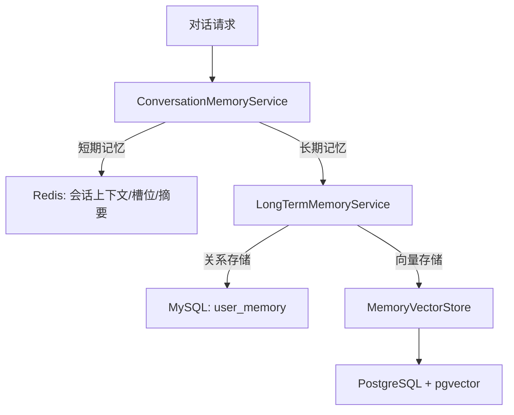
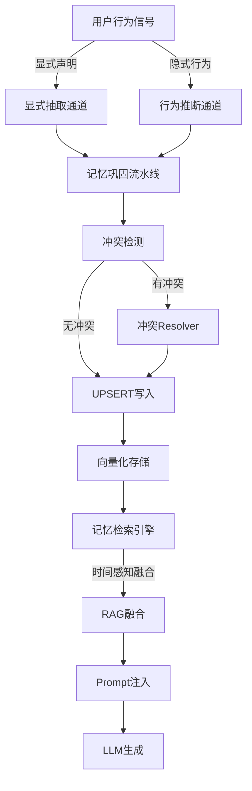
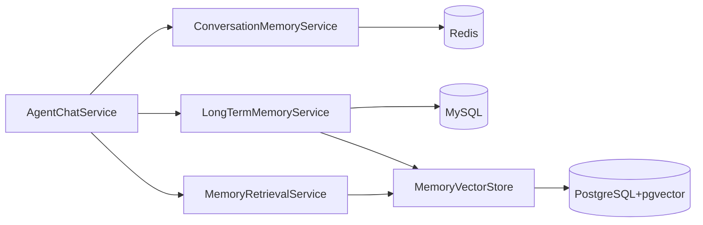
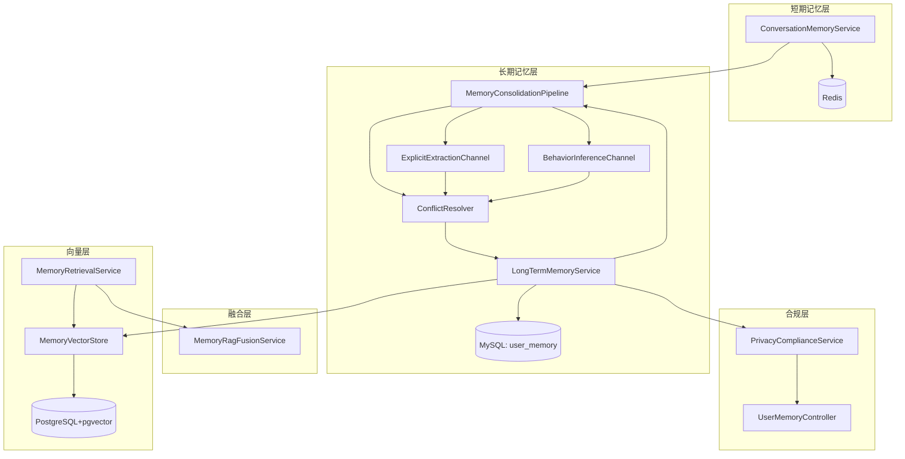
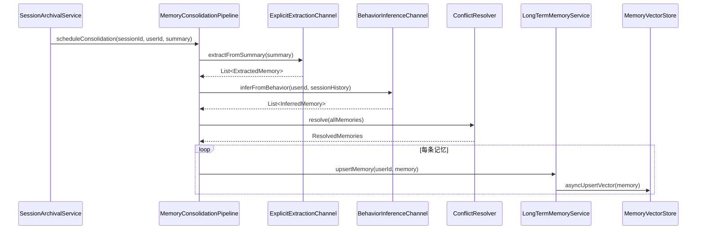
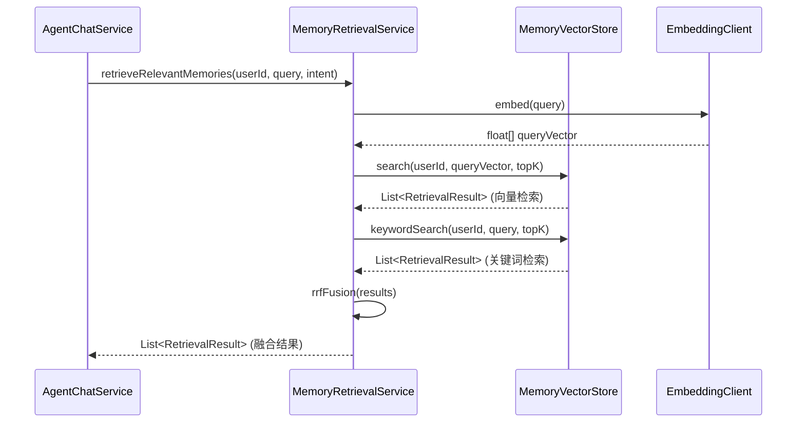
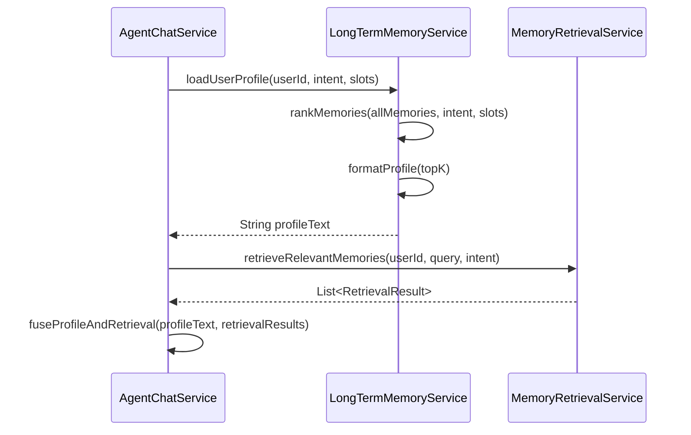

# Agent 长期记忆模块技术设计文档

## 文档信息

| 项目 | 内容 |
|------|------|
| **文档版本** | v1.0 |
| **创建日期** | 2026-07-14 |
| **适用项目** | CampusShare Agent |
| **模块名称** | Long-Term Memory |
| **设计目标** | 企业级长期记忆系统，支持多层记忆架构、完整生命周期管理、智能行为推断、隐私合规、与RAG/对话编排深度集成 |

---

## 1. 范式反思：从简单存储到认知记忆系统

### 1.1 当前架构分析

当前系统采用三层记忆架构：



**核心特点：**
- ✅ 短期记忆（Redis）：会话上下文、槽位、滚动摘要，TTL 2小时
- ✅ 长期记忆（MySQL）：用户偏好、事实、行为模式、任务
- ✅ 向量存储（pgvector）：记忆向量化，支持语义检索
- ✅ 记忆衰减：每周定时任务，按类型不同衰减率
- ✅ 显式记忆抽取：会话归档时LLM抽取用户显式偏好

### 1.2 架构短板分析

| 维度 | 当前状态 | 问题 | 影响 |
|------|----------|------|------|
| **记忆巩固** | 仅会话归档时抽取 | 缺少完整的短期→长期巩固流水线 | 记忆遗漏、时机不当 |
| **行为推断** | 仅显式抽取 | 缺少INFERRED行为推断通道 | 无法发现隐式偏好 |
| **检索融合** | 仅decayScore加权 | 缺少时间衰减、访问频次等多维加权 | 检索精度不足 |
| **RAG集成** | 简单拼接 | 记忆与知识检索结果未深度融合 | 上下文质量差 |
| **隐私合规** | 基础删除API | 缺少完整的GDPR/个保法合规机制 | 合规风险 |
| **记忆恢复** | 软删除但无恢复 | 软删除后无法恢复 | 用户体验差 |

### 1.3 范式转变：认知记忆系统

**新定位：** 从"存储层"升级为"认知记忆系统"，具备完整的记忆生命周期和智能推断能力。



**新能力：**
1. **双通道记忆获取**：显式抽取 + 行为推断
2. **完整巩固流水线**：会话结束→摘要→抽取→推断→冲突解决→写入
3. **多维检索加权**：similarity × decay × recency × frequency
4. **深度RAG融合**：记忆与知识检索结果的统一排序融合
5. **隐私合规保障**：完整的数据主权、删除、导出、恢复机制

### 1.4 业界方案对比

| 方案 | 分层架构 | 记忆巩固 | 行为推断 | 检索策略 | 隐私合规 | 成熟度 |
|------|----------|----------|----------|----------|----------|--------|
| **MemGPT** | 三层（Context/Recall/Storage） | 自动摘要+巩固 | 无 | 语义检索 | 基础 | 高 |
| **Zep** | 两层（Memory/Collections） | 自动摘要+嵌入 | 无 | 语义+元数据过滤 | 基础 | 高 |
| **OpenAI Memory** | 单层（Conversation Buffer） | 手动总结 | 无 | 简单检索 | 完善 | 高 |
| **自研认知记忆** | 三层（短期/长期/向量） | 完整巩固流水线 | LLM推断 | 多维加权融合 | 企业级 | 中 |

### 1.5 本项目选择

**当前阶段：**
- ✅ 完善三层记忆架构
- ✅ 实现完整记忆巩固流水线
- ✅ 实现INFERRED行为推断通道
- ✅ 实现时间感知检索融合
- ✅ 完善隐私合规机制

**未来阶段：**
- ✅ 支持多模态记忆（图片、语音）
- ✅ 支持记忆图谱（知识图谱结构）
- ✅ 支持跨用户记忆共享（匿名化聚合）

---

## 2. 需求分析

### 2.1 业务目标

- **核心目标**：让 Agent 在跨会话场景下具备个性化能力，首轮对话即可精准理解用户需求
- **商业价值**：提升用户满意度和留存率，减少用户重复说明成本
- **量化指标**：
  - 记忆准确率 ≥ 90%（用户验证）
  - 记忆召回率 ≥ 85%（检索相关记忆）
  - 首轮个性化响应率 ≥ 70%（新会话首轮使用记忆）

### 2.2 用户规模

| 指标 | 当前 | 未来1年 | 未来3年 |
|------|------|---------|---------|
| DAU | 1,000 | 10,000 | 100,000 |
| 活跃用户数 | 10,000 | 100,000 | 1,000,000 |
| 人均记忆数 | 5-10 | 20-50 | 100-500 |

### 2.3 流量特征

- **平均 QPS**：100（记忆相关操作）
- **峰值 QPS**：1,000（活动期间）
- **流量分布**：均匀，无明显突发特征
- **增长趋势**：随用户量线性增长

### 2.4 非功能要求

- **性能要求**：
  - 记忆加载延迟 P99 < 100ms
  - 记忆检索延迟 P99 < 200ms
  - 记忆巩固（异步）延迟 < 5分钟
- **可用性要求**：
  - SLA：99.9%
  - RTO：1分钟
  - RPO：5分钟
- **安全性要求**：
  - GDPR 合规
  - 个保法合规
  - 数据加密传输与存储
- **可扩展性要求**：
  - 支持水平扩展
  - 支持记忆类型扩展

---

## 3. 容量规划

### 3.1 流量预估

| 指标 | 当前 | 未来1年 | 未来3年 |
|------|------|---------|---------|
| 记忆加载 QPS | 100 | 1,000 | 10,000 |
| 记忆检索 QPS | 50 | 500 | 5,000 |
| 记忆写入 QPS | 10 | 100 | 1,000 |
| 记忆衰减任务 | 每周1次 | 每周1次 | 每周1次 |

### 3.2 服务器规模

| 组件 | 当前 | 未来1年 | 未来3年 |
|------|------|---------|---------|
| Agent Service | 1台 4核8G | 3台 8核16G | 10台 16核32G |
| MySQL（主从） | 1主1从 | 1主2从 | 2主4从（分片） |
| PostgreSQL（pgvector） | 1台 8核16G | 3台 16核32G | 8台 32核64G |
| Redis | 1台 8G | 3台 16G Cluster | 6台 32G Cluster |

### 3.3 存储规模

| 存储类型 | 当前 | 未来1年 | 未来3年 |
|----------|------|---------|---------|
| MySQL（记忆元数据） | 1GB | 10GB | 100GB |
| PostgreSQL（向量） | 10GB | 100GB | 1TB |
| Redis（短期记忆） | 2GB | 20GB | 200GB |

### 3.4 数据库连接

| 数据源 | 最大连接数 | 最小空闲 | 连接超时 |
|--------|------------|----------|----------|
| MySQL | 20 | 5 | 30s |
| PostgreSQL | 10 | 2 | 30s |
| Redis | 8 | 0 | 5s |

---

## 4. 现状分析

### 4.1 当前方案

**架构图：**



**核心代码：**

- [LongTermMemoryService.java](file:///e:/workspace_work/CampusShare/backend/campushare-agent/src/main/java/com/campushare/agent/service/LongTermMemoryService.java)：长期记忆核心服务
- [MemoryRetrievalService.java](file:///e:/workspace_work/CampusShare/backend/campushare-agent/src/main/java/com/campushare/agent/service/MemoryRetrievalService.java)：记忆检索服务
- [ConversationMemoryService.java](file:///e:/workspace_work/CampusShare/backend/campushare-agent/src/main/java/com/campushare/agent/service/ConversationMemoryService.java)：短期记忆服务
- [MemoryVectorStore.java](file:///e:/workspace_work/CampusShare/backend/campushare-agent/src/main/java/com/campushare/agent/store/MemoryVectorStore.java)：向量存储实现

**数据模型：**

| 表名 | 用途 | 关键字段 |
|------|------|----------|
| `user_memory` | 用户长期记忆元数据 | id, user_id, memory_type, memory_key, memory_value, confidence, source |
| `memory_vectors` | 用户记忆向量 | id, user_id, memory_type, memory_key, memory_value, embedding, decay_score |
| `user_memory_history` | 记忆变更审计历史 | user_id, memory_type, memory_key, action, reason |

### 4.2 问题清单

| 优先级 | 问题 | 影响 | 根因 |
|--------|------|------|------|
| P0 | 缺少完整记忆巩固流水线 | 记忆遗漏、时机不当 | 仅会话归档时抽取，缺少统一调度 |
| P0 | 缺少INFERRED行为推断通道 | 无法发现隐式偏好 | 仅支持显式抽取 |
| P1 | 检索缺少时间衰减和访问频次加权 | 检索精度不足 | 仅靠decayScore单一维度 |
| P1 | 记忆与RAG检索结果未深度融合 | 上下文质量差 | 简单拼接，无统一排序 |
| P1 | 缺少记忆恢复机制 | 用户体验差 | 软删除后无法恢复 |
| P2 | 缺少多模态记忆支持 | 扩展性不足 | 仅支持文本 |
| P2 | 缺少记忆图谱 | 关联能力弱 | 扁平化存储 |

---

## 5. 业界方案调研

### 5.1 方案对比

| 维度 | MemGPT | Zep | OpenAI Memory | 自研方案 |
|------|--------|-----|---------------|----------|
| **分层架构** | 三层 | 两层 | 单层 | 三层 |
| **记忆巩固** | 自动摘要+巩固 | 自动摘要+嵌入 | 手动总结 | 完整流水线 |
| **行为推断** | 无 | 无 | 无 | LLM推断 |
| **检索策略** | 语义检索 | 语义+元数据 | 简单检索 | 多维加权融合 |
| **隐私合规** | 基础 | 基础 | 完善 | 企业级 |
| **向量存储** | 自建 | pgvector/Pinecone | 自研 | pgvector |
| **成本** | 中 | 中 | 高 | 低 |
| **成熟度** | 高 | 高 | 高 | 中 |
| **可控性** | 中 | 高 | 低 | 高 |

### 5.2 大厂实践案例

**案例1：字节跳动 Doubao**
- 采用多层记忆架构：会话记忆 + 用户画像 + 世界知识
- 记忆巩固采用异步流水线：会话结束→摘要生成→记忆抽取→向量化→存储
- 检索采用混合策略：语义检索 + 关键词检索 + 元数据过滤

**案例2：阿里通义千问**
- 用户画像系统：基于用户行为的隐式偏好挖掘
- 记忆衰减机制：基于时间和使用频次的动态衰减
- 隐私保护：数据脱敏、用户可控删除

**案例3：腾讯混元助手**
- 多层缓存：本地缓存 + 分布式缓存 + 向量检索
- 记忆冲突解决：显式声明优先，隐式推断降级
- 合规审计：完整的操作日志和数据保留策略

### 5.3 选型决策

**最终方案：自研认知记忆系统**

**选型理由：**
1. **可控性**：完全自主可控，不依赖第三方服务
2. **扩展性**：支持自定义记忆类型和检索策略
3. **成本**：使用开源组件，降低运营成本
4. **合规性**：可深度定制隐私合规机制

**风险评估：**
- 开发成本较高
- 需要持续优化检索精度

**替代方案：**
- 短期可考虑集成 Zep 作为向量存储层
- 长期保持自研核心逻辑

---

## 6. 方案设计

### 6.1 架构设计

**整体架构图：**



**模块职责：**

| 模块 | 职责 | 核心方法 |
|------|------|----------|
| **ConversationMemoryService** | 短期会话记忆管理 | initSession, appendMessage, updateSummary |
| **LongTermMemoryService** | 长期记忆核心服务 | loadUserProfile, upsertMemory, decayMemories |
| **MemoryConsolidationPipeline** | 记忆巩固流水线 | consolidate, scheduleConsolidation |
| **ExplicitExtractionChannel** | 显式记忆抽取 | extractFromSummary |
| **BehaviorInferenceChannel** | 行为推断通道 | inferFromBehavior |
| **ConflictResolver** | 冲突解决器 | resolve, markConflict |
| **MemoryVectorStore** | 向量存储 | upsert, search, keywordSearch |
| **MemoryRetrievalService** | 记忆检索 | retrieveRelevantMemories, rrfFusion |
| **MemoryRagFusionService** | RAG融合 | fuseWithKnowledge |
| **PrivacyComplianceService** | 隐私合规 | exportData, deleteAllData, restoreData |

### 6.2 核心流程

#### 6.2.1 记忆巩固流程



#### 6.2.2 记忆检索流程



#### 6.2.3 记忆加载流程



### 6.3 数据模型

#### 6.3.1 核心实体

**UserMemory（用户长期记忆）**

| 字段 | 类型 | 约束 | 说明 |
|------|------|------|------|
| id | BIGINT | PK, AUTO_INCREMENT | 主键 |
| user_id | VARCHAR(64) | NOT NULL, INDEX | 用户ID |
| memory_type | VARCHAR(32) | NOT NULL | 记忆类型：PREFERENCE/FACT/BEHAVIOR/TASK/SKILL/EVENT |
| memory_key | VARCHAR(128) | NOT NULL | 记忆键 |
| memory_value | TEXT | NOT NULL | 记忆值 |
| confidence | DECIMAL(5,4) | DEFAULT 1.0 | 置信度 0-1 |
| source | VARCHAR(32) | NOT NULL | 来源：EXPLICIT/INFERRED |
| evidence_count | INT | DEFAULT 1 | 证据数量 |
| conflict_flag | TINYINT | DEFAULT 0 | 冲突标记 |
| volatile_flag | TINYINT | DEFAULT 0 | 易变标记 |
| last_used_at | DATETIME | NULL | 最近装载时间 |
| last_accessed_at | DATETIME | NULL | 最近访问时间 |
| access_count | INT | DEFAULT 0 | 访问次数 |
| deleted_at | DATETIME | NULL | 软删除时间 |
| created_at | DATETIME | DEFAULT NOW() | 创建时间 |
| updated_at | DATETIME | DEFAULT NOW() | 更新时间 |

**索引设计：**
```sql
CREATE INDEX idx_user_memory_type ON user_memory(user_id, memory_type);
CREATE INDEX idx_user_confidence ON user_memory(user_id, confidence DESC);
CREATE INDEX idx_user_deleted ON user_memory(user_id, deleted_at);
```

**MemoryVector（记忆向量）**

| 字段 | 类型 | 约束 | 说明 |
|------|------|------|------|
| id | VARCHAR(64) | PK | 关联user_memory.id |
| user_id | VARCHAR(64) | NOT NULL, INDEX | 用户ID |
| memory_type | VARCHAR(32) | NOT NULL | 记忆类型 |
| memory_key | VARCHAR(128) | NOT NULL | 记忆键 |
| memory_value | TEXT | NOT NULL | 记忆值 |
| embedding | vector(1024) | NOT NULL | 向量 |
| confidence | DECIMAL(5,4) | DEFAULT 1.0 | 置信度 |
| source | VARCHAR(32) | NOT NULL | 来源 |
| access_count | INT | DEFAULT 0 | 访问次数 |
| decay_score | DECIMAL(5,4) | DEFAULT 1.0 | 衰减分数 |
| last_accessed_at | TIMESTAMP | NULL | 最近访问时间 |
| is_active | BOOLEAN | DEFAULT TRUE | 是否活跃 |
| created_at | TIMESTAMP | DEFAULT NOW() | 创建时间 |
| updated_at | TIMESTAMP | DEFAULT NOW() | 更新时间 |

**索引设计：**
```sql
CREATE INDEX idx_vector_user ON memory_vectors(user_id);
CREATE INDEX idx_vector_type ON memory_vectors(memory_type);
CREATE INDEX idx_vector_active ON memory_vectors(is_active);
-- pgvector HNSW索引
CREATE INDEX idx_vector_embedding ON memory_vectors USING hnsw(embedding vector_cosine_ops);
```

#### 6.3.2 缓存数据结构

**Redis Key 设计：**

| Key 模式 | 数据结构 | TTL | 说明 |
|----------|----------|-----|------|
| `agent:session:{sid}:meta` | Hash | 2h | 会话元数据 |
| `agent:session:{sid}:messages` | List | 2h | 会话消息 |
| `agent:session:{sid}:rolling_summary` | String | 2h | 滚动摘要 |
| `agent:session:{sid}:slots` | Hash | 2h | 槽位 |
| `agent:session:{sid}:pinned` | List | 2h | Pin消息 |
| `agent:memory:profile:{uid}` | String | 1h | 用户画像缓存 |

### 6.4 API 设计

#### 6.4.1 用户记忆管理 API

**获取用户记忆列表**
```
GET /api/agent/memory/user/{userId}
```

**请求参数：**

| 参数 | 类型 | 必填 | 说明 |
|------|------|------|------|
| userId | String | 是 | 用户ID（从JWT获取） |
| type | String | 否 | 记忆类型过滤 |
| page | Int | 否 | 页码，默认1 |
| size | Int | 否 | 每页大小，默认20 |

**响应：**
```json
{
    "code": 200,
    "message": "success",
    "data": {
        "list": [
            {
                "id": 1,
                "memoryType": "PREFERENCE",
                "memoryKey": "preferred_format",
                "memoryValue": "PDF",
                "confidence": 1.0,
                "source": "EXPLICIT",
                "updatedAt": "2026-07-14T10:00:00"
            }
        ],
        "total": 10
    }
}
```

**创建记忆**
```
POST /api/agent/memory/user/{userId}
```

**请求体：**
```json
{
    "memoryType": "PREFERENCE",
    "memoryKey": "preferred_language",
    "memoryValue": "Java",
    "confidence": 1.0,
    "source": "EXPLICIT"
}
```

**更新记忆**
```
PUT /api/agent/memory/user/{userId}/{memoryKey}
```

**请求体：**
```json
{
    "memoryValue": "Python",
    "confidence": 0.8
}
```

**删除记忆**
```
DELETE /api/agent/memory/user/{userId}/{memoryKey}
```

**恢复已删除记忆**
```
POST /api/agent/memory/user/{userId}/{memoryKey}/restore
```

**导出用户记忆数据**
```
GET /api/agent/memory/user/{userId}/export
```

**响应：** 返回JSON文件下载

#### 6.4.2 管理 API

**获取记忆统计**
```
GET /api/agent/memory/stats
```

**响应：**
```json
{
    "code": 200,
    "message": "success",
    "data": {
        "totalUsers": 1000,
        "totalMemories": 5000,
        "activeMemories": 4500,
        "averageMemoriesPerUser": 5
    }
}
```

**手动触发记忆衰减**
```
POST /api/agent/memory/decay
```

**请求体：**
```json
{
    "userId": "optional",
    "force": false
}
```

### 6.5 关键实现

#### 6.5.1 记忆巩固流水线

```java
@Service
public class MemoryConsolidationPipeline {
    
    private final ExplicitExtractionChannel explicitChannel;
    private final BehaviorInferenceChannel behaviorChannel;
    private final ConflictResolver conflictResolver;
    private final LongTermMemoryService longTermMemoryService;
    
    public Mono<Void> consolidate(String sessionId, String userId, 
                                   String rollingSummary, List<AgentTurn> history) {
        return Mono.zip(
                explicitChannel.extractFromSummary(userId, rollingSummary),
                behaviorChannel.inferFromBehavior(userId, history)
            )
            .flatMap(tuple -> {
                List<UserMemory> allMemories = new ArrayList<>();
                allMemories.addAll(tuple.getT1());
                allMemories.addAll(tuple.getT2());
                return Mono.just(conflictResolver.resolve(allMemories));
            })
            .flatMap(resolved -> {
                List<Mono<UserMemory>> upsertMonos = resolved.getValidMemories().stream()
                    .map(memory -> Mono.fromCallable(
                        () -> longTermMemoryService.upsertMemory(
                            userId, memory.getMemoryType(), memory.getMemoryKey(),
                            memory.getMemoryValue(), memory.getSource(),
                            memory.getConfidence(), null
                        )
                    ))
                    .collect(Collectors.toList());
                return Flux.merge(upsertMonos).then();
            })
            .subscribeOn(Schedulers.boundedElastic());
    }
}
```

#### 6.5.2 行为推断通道

```java
@Service
public class BehaviorInferenceChannel {
    
    private final DeepSeekClient deepSeekClient;
    
    private static final String INFERENCE_SYSTEM_PROMPT = """
        你是用户行为推断器。请从用户的对话历史中推断用户的隐式偏好和行为模式。
        
        规则：
        1. 只推断合理的隐式偏好，不编造事实
        2. 每项含 type（BEHAVIOR/TASK/SKILL）、key（英文蛇形命名）、value（值）、confidence（0-1）
        3. confidence 根据证据强度设定：单一证据0.5，多次出现0.7，强烈模式0.9
        4. 若没有可推断的内容，输出空数组 []
        
        输出 JSON 数组：
        [{"type":"BEHAVIOR","key":"top_category","value":"编程开发","confidence":0.8}]
        """;
    
    public Mono<List<UserMemory>> inferFromBehavior(String userId, List<AgentTurn> history) {
        String historyText = history.stream()
            .map(t -> "用户: " + t.getUserMessage() + "\n助手: " + t.getAssistantMessage())
            .collect(Collectors.joining("\n---\n"));
        
        List<DeepSeekRequest.Message> messages = List.of(
            DeepSeekRequest.Message.builder()
                .role("system")
                .content(INFERENCE_SYSTEM_PROMPT)
                .build(),
            DeepSeekRequest.Message.builder()
                .role("user")
                .content("对话历史:\n" + historyText)
                .build()
        );
        
        return deepSeekClient.chatCompletion(messages)
            .map(response -> {
                String content = response.getChoices().get(0).getMessage().getContent();
                return parseInferenceResult(content);
            })
            .onErrorResume(e -> {
                log.warn("Behavior inference failed: userId={}", userId, e);
                return Mono.just(Collections.emptyList());
            });
    }
}
```

#### 6.5.3 时间感知检索融合

```java
public class MemoryRetrievalService {
    
    private static final double RECENCY_HALF_LIFE_DAYS = 30;
    private static final double FREQUENCY_BOOST_THRESHOLD = 3;
    
    private double calculateFinalScore(RetrievalResult result, LocalDateTime now) {
        double similarity = result.score();
        double decayScore = getDecayScore(result);
        double recencyBoost = calculateRecencyBoost(result, now);
        double frequencyWeight = calculateFrequencyWeight(result);
        
        return similarity * decayScore * recencyBoost * frequencyWeight;
    }
    
    private double calculateRecencyBoost(RetrievalResult result, LocalDateTime now) {
        LocalDateTime updatedAt = getUpdatedAt(result);
        if (updatedAt == null) return 1.0;
        
        long daysSinceUpdate = java.time.Duration.between(updatedAt, now).toDays();
        return Math.exp(-daysSinceUpdate / RECENCY_HALF_LIFE_DAYS);
    }
    
    private double calculateFrequencyWeight(RetrievalResult result) {
        int accessCount = getAccessCount(result);
        if (accessCount >= FREQUENCY_BOOST_THRESHOLD) {
            return 1.5;
        }
        return 1.0;
    }
}
```

#### 6.5.4 冲突解决器

```java
@Service
public class ConflictResolver {
    
    public ResolvedMemories resolve(List<UserMemory> memories) {
        Map<String, List<UserMemory>> grouped = memories.stream()
            .collect(Collectors.groupingBy(m -> m.getMemoryType() + ":" + m.getMemoryKey()));
        
        List<UserMemory> validMemories = new ArrayList<>();
        List<UserMemory> conflictedMemories = new ArrayList<>();
        
        for (Map.Entry<String, List<UserMemory>> entry : grouped.entrySet()) {
            List<UserMemory> group = entry.getValue();
            if (group.size() == 1) {
                validMemories.addAll(group);
            } else {
                UserMemory resolved = resolveConflict(group);
                if (resolved != null) {
                    validMemories.add(resolved);
                } else {
                    conflictedMemories.addAll(group);
                }
            }
        }
        
        return new ResolvedMemories(validMemories, conflictedMemories);
    }
    
    private UserMemory resolveConflict(List<UserMemory> group) {
        UserMemory explicit = group.stream()
            .filter(m -> "EXPLICIT".equals(m.getSource()))
            .findFirst()
            .orElse(null);
        
        if (explicit != null) {
            return explicit;
        }
        
        return group.stream()
            .max(Comparator.comparing(UserMemory::getConfidence))
            .orElse(null);
    }
}
```

### 6.6 分布式一致性

- **一致性模型**：最终一致性
- **写入策略**：MySQL 同步写入 + 向量存储异步写入
- **一致性保障**：
  - 事务保证 MySQL 内的数据一致性
  - 向量存储写入失败时重试（最多3次）
  - 定期校验 MySQL 与向量存储数据一致性
- **一致性测试**：定期执行数据对账任务

---

## 7. 可靠性设计

### 7.1 熔断降级

**向量存储熔断：**
- 策略：基于错误率
- 阈值：50%错误率，滑动窗口10次调用
- 降级策略：返回空结果，不阻塞主流程
- 恢复机制：半开状态允许3次探测

**LLM 调用熔断（用于记忆抽取和行为推断）：**
- 策略：基于错误率和延迟
- 阈值：50%错误率或P95延迟>5s
- 降级策略：跳过记忆抽取/推断，仅使用已有记忆
- 恢复机制：半开状态允许3次探测

### 7.2 重试机制

| 操作 | 重试次数 | 退避策略 | 抖动 | 幂等 |
|------|----------|----------|------|------|
| 向量写入 | 3 | 指数退避(1s, 2s, 4s) | 是 | 是(upsert) |
| LLM调用 | 3 | 指数退避(1s, 2s, 4s) | 是 | 是 |
| MySQL写入 | 1 | 无 | 无 | 是(upsert) |

### 7.3 超时控制

| 操作 | 超时时间 | 说明 |
|------|----------|------|
| 记忆加载 | 100ms | 从MySQL加载用户画像 |
| 记忆检索 | 200ms | 向量检索+关键词检索 |
| 记忆写入 | 500ms | MySQL写入 |
| 向量写入 | 1s | PostgreSQL写入 |
| LLM抽取 | 30s | 异步操作，不阻塞主流程 |

### 7.4 故障隔离

- **线程池隔离**：记忆巩固任务使用独立线程池
- **资源隔离**：向量存储使用独立连接池
- **降级隔离**：向量存储故障不影响MySQL操作

### 7.5 故障恢复

- **RTO**：1分钟（服务重启）
- **RPO**：5分钟（定期快照）
- **恢复流程**：
  1. 服务重启自动恢复
  2. MySQL主从切换（如果主库故障）
  3. PostgreSQL故障时降级为仅MySQL操作

---

## 8. 性能优化

### 8.1 瓶颈分析

| 瓶颈点 | 当前状态 | 影响 |
|--------|----------|------|
| 记忆加载 | 每次查询MySQL | 高延迟 |
| 记忆检索 | 每次调用向量存储 | 高延迟 |
| 记忆巩固 | 同步LLM调用 | 阻塞会话结束 |
| 向量化 | 每条记忆单独调用 | 低效 |

### 8.2 优化策略

**缓存优化：**
- 用户画像缓存（Redis）：TTL 1小时
- 检索结果缓存（Redis）：TTL 5分钟
- 本地缓存（Caffeine）：热点记忆

**异步优化：**
- 记忆巩固异步化：会话结束后异步执行
- 向量化异步化：记忆写入后异步向量化
- LLM调用异步化：不阻塞主流程

**批量优化：**
- 批量向量化：一次处理多条记忆
- 批量检索：一次查询多个用户

**索引优化：**
- MySQL：复合索引 user_id + memory_type
- PostgreSQL：HNSW索引加速向量检索

### 8.3 性能指标

| 指标 | 目标值 |
|------|--------|
| 记忆加载 P99 | < 100ms |
| 记忆检索 P99 | < 200ms |
| 记忆写入 P99 | < 500ms |
| 向量写入 P99 | < 1s |
| 缓存命中率 | > 90% |

---

## 9. 可观测性设计

### 9.1 指标监控

**业务指标：**
- `memory.count`：记忆总数（按用户、类型分组）
- `memory.load.duration`：记忆加载延迟
- `memory.retrieval.duration`：记忆检索延迟
- `memory.write.duration`：记忆写入延迟
- `memory.consolidation.count`：记忆巩固次数
- `memory.extraction.count`：显式抽取次数
- `memory.inference.count`：行为推断次数
- `memory.conflict.count`：冲突解决次数

**资源指标：**
- `memory.vector.db.connection.count`：向量数据库连接数
- `memory.redis.cache.hit.rate`：缓存命中率

### 9.2 日志规范

**结构化日志字段：**
- `traceId`：链路追踪ID
- `sessionId`：会话ID
- `userId`：用户ID
- `memoryKey`：记忆键
- `memoryType`：记忆类型
- `action`：操作类型（LOAD/RETRIEVE/WRTIE/CONSOLIDATE/EXTRACT/INFER）
- `duration`：耗时（ms）
- `result`：结果（SUCCESS/FAILED）
- `error`：错误信息

### 9.3 告警策略

| 告警级别 | 条件 | 通知方式 |
|----------|------|----------|
| P0 | 记忆加载失败率 > 10% | 电话 + 钉钉 |
| P1 | 记忆检索延迟 P99 > 500ms | 钉钉 |
| P1 | 向量存储连接失败 | 钉钉 |
| P2 | 记忆巩固失败率 > 5% | 邮件 |
| P2 | 缓存命中率 < 80% | 邮件 |

---

## 10. 安全设计

### 10.1 隐私合规

**用户知情同意：**
- 首次使用Agent时展示隐私政策
- 用户可选择是否启用长期记忆
- 记忆功能默认开启，但可在设置中关闭

**数据主权：**
- 用户可查看所有记忆数据
- 用户可编辑/删除记忆数据
- 用户可导出所有记忆数据

**数据保留策略：**
- 软删除后保留30天（可恢复）
- 30天后物理删除
- 审计日志保留90天

**GDPR/个保法合规：**
- ✅ 数据主体权利（访问、更正、删除、导出）
- ✅ 数据最小化原则
- ✅ 目的限制原则
- ✅ 数据安全保障
- ✅ 跨境传输合规

### 10.2 数据安全

**传输加密：**
- TLS 1.3
- HTTPS/WSS

**存储加密：**
- MySQL：字段级加密（敏感字段）
- PostgreSQL：透明加密

**密钥管理：**
- 密钥轮换：每90天
- 密钥存储：环境变量

### 10.3 访问控制

**认证：**
- JWT 认证
- 用户只能访问自己的记忆

**授权：**
- RBAC 角色权限
- 管理员可访问所有用户记忆（用于审计）

### 10.4 安全审计

**操作审计：**
- 所有记忆操作记录
- 操作人、时间、IP
- 操作前后数据对比

**访问审计：**
- 记忆访问记录
- 访问频率监控

---

## 11. 运维设计

### 11.1 部署方案

- **部署方式**：Docker + Docker Compose（当前），后续迁移至K8s
- **部署架构**：单集群，主从数据库
- **CI/CD**：GitHub Actions

### 11.2 配置管理

**配置项：**
```yaml
app:
  long-term-memory:
    decay:
      enabled: true
      schedule: "0 0 2 ? * SUN"
    consolidation:
      enabled: true
      delay-minutes: 5
    inference:
      enabled: true
      confidence-threshold: 0.5
    privacy:
      retention-days: 30
      export-enabled: true
```

### 11.3 故障演练

**演练内容：**
- 向量存储故障演练
- LLM服务故障演练
- 缓存故障演练
- 数据一致性校验

**演练频率：** 每月1次

### 11.4 容量管理

**容量监控：**
- MySQL 存储空间
- PostgreSQL 存储空间
- Redis 内存使用

**扩容策略：**
- MySQL：主从扩容 + 分片
- PostgreSQL：读写分离 + 分片
- Redis：Cluster 扩容

---

## 12. 成本优化

### 12.1 资源利用率

- **目标**：CPU 利用率 60-70%
- **目标**：内存利用率 60-70%
- **目标**：存储利用率 70-80%

### 12.2 缓存策略

- **L1 缓存**：Caffeine 本地缓存（热点记忆）
- **L2 缓存**：Redis 分布式缓存（用户画像、检索结果）
- **目标命中率**：> 90%

### 12.3 异步处理

- 记忆巩固异步化
- 向量化异步化
- LLM调用批量处理

### 12.4 成本监控

**成本指标：**
- 存储成本（MySQL + PostgreSQL + Redis）
- LLM API 成本（记忆抽取 + 行为推断）
- 计算成本（服务器资源）

**成本告警：**
- 月度成本超过预算时告警

---

## 13. 风险评估

### 13.1 技术风险

| 风险 | 概率 | 影响 | 缓解措施 |
|------|------|------|----------|
| 向量存储性能瓶颈 | 中 | 高 | HNSW索引、读写分离、分片 |
| LLM调用成本过高 | 中 | 中 | 异步处理、批量调用、缓存结果 |
| 记忆冲突处理不当 | 低 | 中 | 显式优先、冲突标记、人工审核 |

### 13.2 业务风险

| 风险 | 概率 | 影响 | 缓解措施 |
|------|------|------|----------|
| 记忆准确率不足 | 中 | 高 | 多通道验证、用户反馈优化、定期评估 |
| 用户隐私担忧 | 低 | 高 | 透明隐私政策、用户可控删除、合规审计 |

### 13.3 运维风险

| 风险 | 概率 | 影响 | 缓解措施 |
|------|------|------|----------|
| 数据一致性问题 | 低 | 高 | 定期对账、事务保证、重试机制 |
| 服务不可用 | 低 | 高 | 熔断降级、冗余部署、监控告警 |

### 13.4 安全风险

| 风险 | 概率 | 影响 | 缓解措施 |
|------|------|------|----------|
| 数据泄露 | 低 | 极高 | 传输加密、存储加密、访问控制 |
| 越权访问 | 低 | 高 | JWT认证、RBAC授权、审计日志 |

---

## 14. 验证方案

### 14.1 功能验证

**测试用例：**

| 场景 | 验证内容 | 验收标准 |
|------|----------|----------|
| 显式记忆抽取 | 会话归档时抽取用户偏好 | 正确抽取3/3条显式偏好 |
| 行为推断 | 从对话历史推断隐式偏好 | 正确推断2/3条隐式偏好 |
| 记忆检索 | 语义检索+关键词检索 | 召回率>85%，准确率>90% |
| 记忆加载 | 新会话首轮加载画像 | 加载时间<100ms |
| 冲突解决 | 显式与隐式冲突 | 显式优先，正确解决 |
| 记忆衰减 | 定期衰减 | 按类型正确衰减 |
| 记忆恢复 | 恢复已删除记忆 | 软删除30天内可恢复 |
| 数据导出 | 导出用户记忆 | 导出完整JSON文件 |

### 14.2 性能验证

**压测方案：**
- 工具：JMeter
- 场景：记忆加载、记忆检索、记忆写入
- 指标：延迟、吞吐量、错误率

**预期指标：**
- 记忆加载 P99 < 100ms
- 记忆检索 P99 < 200ms
- 记忆写入 P99 < 500ms
- 吞吐量 1000 QPS（记忆加载）

### 14.3 可靠性验证

**故障演练：**
- 向量存储故障：降级为仅MySQL，服务可用
- LLM服务故障：跳过记忆抽取，服务可用
- Redis故障：降级为直接查询，服务可用

### 14.4 安全验证

**安全测试：**
- 渗透测试：越权访问检测
- 漏洞扫描：SQL注入、XSS检测
- 合规审计：GDPR/个保法合规检查

---

## 15. 演进规划

### 15.1 阶段一：核心能力（0-3 个月）

- ✅ 完善记忆巩固流水线
- ✅ 实现行为推断通道
- ✅ 完善时间感知检索融合
- ✅ 实现记忆恢复机制
- ✅ 完善隐私合规API
- **性能目标**：P99 < 500ms，100 QPS

### 15.2 阶段二：优化升级（3-6 个月）

- ✅ 性能优化（缓存、异步、批量）
- ✅ 可观测性完善
- ✅ 故障演练体系
- ✅ 数据一致性校验
- **性能目标**：P99 < 200ms，1000 QPS

### 15.3 阶段三：进阶能力（6-12 个月）

- ✅ 多模态记忆支持
- ✅ 记忆图谱
- ✅ 跨用户记忆共享（匿名化）
- ✅ 智能记忆整理
- **性能目标**：P99 < 100ms，10000 QPS

### 15.4 阶段四：规模化（12-24 个月）

- ✅ 大规模分布式部署
- ✅ 全球多活
- ✅ AI驱动的记忆优化
- ✅ 自动化评估体系
- **性能目标**：P99 < 50ms，100000 QPS

---

## 16. 附录

### 16.1 术语表

| 术语 | 说明 |
|------|------|
| **短期记忆** | 当前会话的上下文，保留2小时 |
| **长期记忆** | 用户跨会话的偏好、事实、行为模式 |
| **显式记忆** | 用户明确声明的记忆 |
| **隐式记忆** | 通过行为推断的记忆 |
| **记忆巩固** | 将短期记忆转化为长期记忆的过程 |
| **记忆衰减** | 随时间降低记忆置信度的机制 |
| **向量检索** | 通过向量相似度匹配检索记忆 |
| **RAG融合** | 将记忆与知识检索结果融合 |

### 16.2 参考资料

- [MemGPT: Memory-GPT](https://memgpt.readthedocs.io/)
- [Zep: Long-term Memory Store](https://getzep.com/)
- [OpenAI Memory](https://platform.openai.com/docs/guides/gpt/memory)
- [pgvector Documentation](https://github.com/pgvector/pgvector)
- [GDPR Compliance Checklist](https://gdpr.eu/checklist/)

### 16.3 变更记录

| 版本 | 日期 | 变更内容 |
|------|------|----------|
| v1.0 | 2026-07-14 | 初始版本 |

### 16.4 审批记录

| 审批项 | 审批人 | 日期 | 状态 |
|--------|--------|------|------|
| 技术方案 | TBD | TBD | 待审批 |
| 安全评审 | TBD | TBD | 待审批 |
| 合规评审 | TBD | TBD | 待审批 |