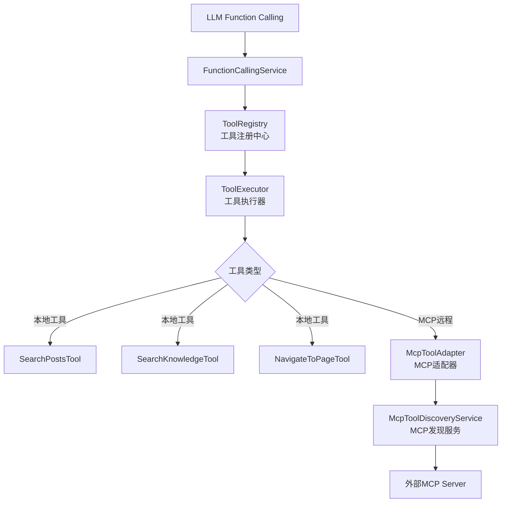
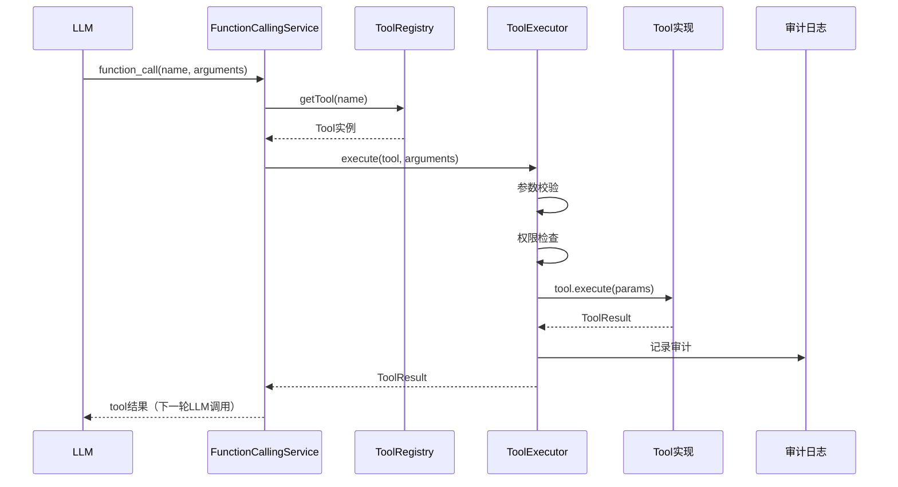
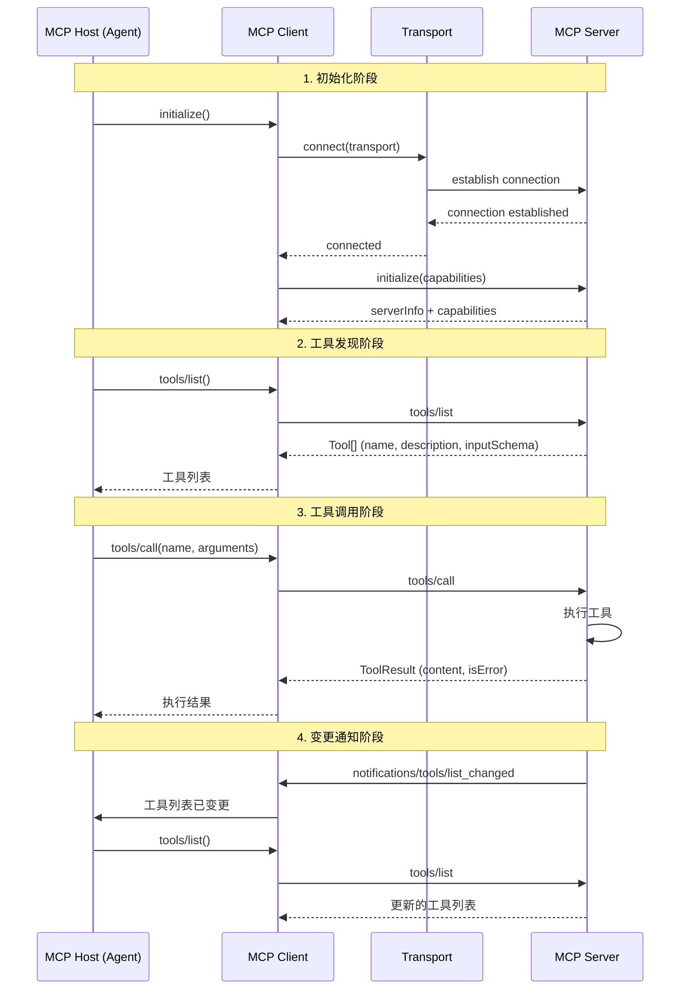
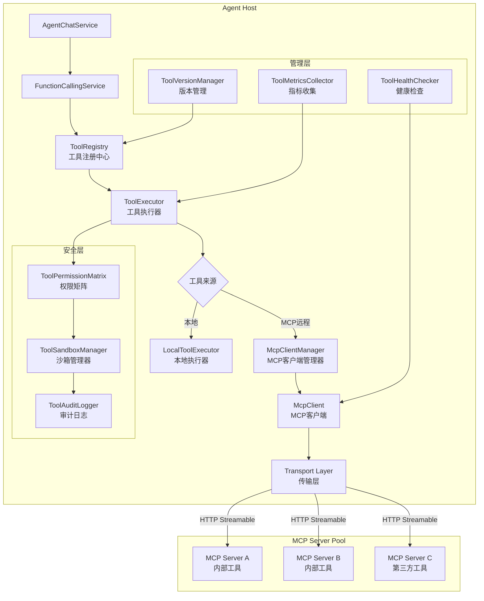
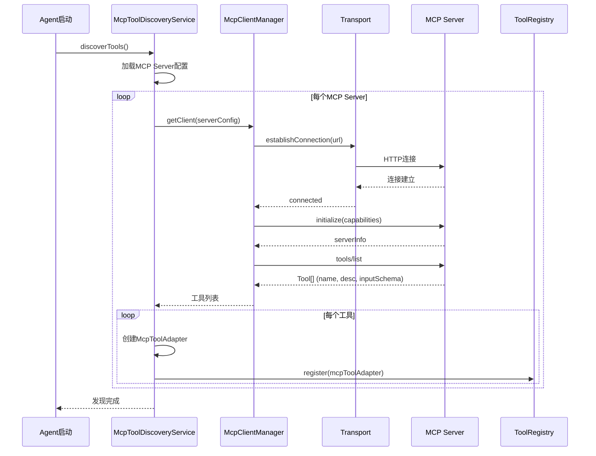
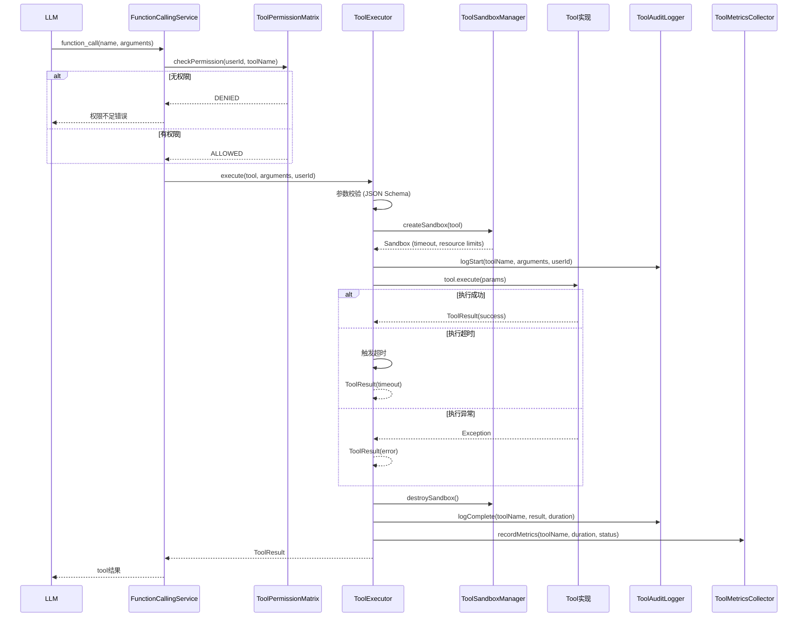

# MCP协议工程技术设计文档

## 文档信息

| 项目 | 内容 |
|------|------|
| **文档版本** | v1.0 |
| **创建日期** | 2026-07-14 |
| **适用项目** | CampusShare Agent |
| **模块名称** | MCP (Model Context Protocol) |
| **设计目标** | 企业级MCP协议实现，标准化工具接入、跨Agent复用、安全沙箱执行、动态发现与注册 |

---

## 1. 范式反思：从硬编码工具到标准化协议

### 1.1 当前架构分析

当前系统已实现基础工具调用架构：



**核心组件：**

| 组件 | 文件 | 职责 |
|------|------|------|
| **Tool接口** | [Tool.java](file:///e:/workspace_work/CampusShare/backend/campushare-agent/src/main/java/com/campushare/agent/tool/Tool.java) | 工具统一接口 |
| **ToolDef注解** | [ToolDef.java](file:///e:/workspace_work/CampusShare/backend/campushare-agent/src/main/java/com/campushare/agent/tool/ToolDef.java) | 工具元信息注解 |
| **ToolParam注解** | [ToolParam.java](file:///e:/workspace_work/CampusShare/backend/campushare-agent/src/main/java/com/campushare/agent/tool/ToolParam.java) | 工具参数注解 |
| **ToolRegistry** | [ToolRegistry.java](file:///e:/workspace_work/CampusShare/backend/campushare-agent/src/main/java/com/campushare/agent/tool/ToolRegistry.java) | 工具注册中心 |
| **ToolExecutor** | [ToolExecutor.java](file:///e:/workspace_work/CampusShare/backend/campushare-agent/src/main/java/com/campushare/agent/tool/ToolExecutor.java) | 工具执行器 |
| **ToolResult** | [ToolResult.java](file:///e:/workspace_work/CampusShare/backend/campushare-agent/src/main/java/com/campushare/agent/tool/ToolResult.java) | 执行结果DTO |
| **McpToolDiscoveryService** | [McpToolDiscoveryService.java](file:///e:/workspace_work/CampusShare/backend/campushare-agent/src/main/java/com/campushare/agent/service/McpToolDiscoveryService.java) | MCP工具发现 |
| **McpToolAdapter** | [McpToolAdapter.java](file:///e:/workspace_work/CampusShare/backend/campushare-agent/src/main/java/com/campushare/agent/service/McpToolAdapter.java) | MCP工具适配 |

**当前特点：**
- ✅ 注解驱动：`@ToolDef` + `@ToolParam` 定义工具元信息
- ✅ 统一接口：所有工具实现 `Tool` 接口
- ✅ MCP发现：`McpToolDiscoveryService` 从外部MCP Server发现工具
- ✅ MCP适配：`McpToolAdapter` 将远程MCP工具适配为本地 `Tool` 接口
- ✅ 结果标准化：`ToolResult` 统一返回格式（status/summary/data/refs/errorCode）

### 1.2 架构短板分析

| 维度 | 当前状态 | 问题 | 影响 |
|------|----------|------|------|
| **MCP传输层** | 无实现 | 未实现stdio/SSE/HTTP Streamable | 无法连接MCP Server |
| **安全沙箱** | 无隔离 | 工具在Agent进程内执行 | 工具故障影响Agent |
| **工具权限** | 无矩阵 | 无工具级/参数级权限控制 | 安全风险 |
| **工具版本** | 无管理 | 无版本兼容检查 | 升级风险 |
| **工具市场** | 无实现 | 无跨Agent工具复用 | 重复开发 |
| **执行审计** | 无记录 | 无完整调用链审计 | 问题定位难 |
| **资源限制** | 无控制 | 无CPU/内存/网络限制 | 资源滥用 |

### 1.3 范式转变：标准化工具操作系统

**新定位：** 从"硬编码工具集合"升级为"标准化工具操作系统"，像Docker管理容器一样管理工具。

```mermaid
flowchart TD
    A[Agent Host] --> B[MCP Protocol Layer<br/>MCP协议层]
    
    B --> C[Tool Discovery<br/>工具发现]
    B --> D[Tool Negotiation<br/>能力协商]
    B --> E[Tool Execution<br/>工具执行]
    B --> F[Tool Lifecycle<br/>工具生命周期]
    
    C --> G[本地注册<br/>@ToolDef扫描]
    C --> H[远程发现<br/>MCP Server列表]
    C --> I[动态注册<br/>运行时注册]
    
    D --> J[能力声明<br/>inputSchema/outputSchema]
    D --> K[版本协商<br/>SemVer兼容检查]
    D --> L[权限协商<br/>RBAC矩阵]
    
    E --> M[沙箱执行<br/>进程隔离]
    E --> N[资源限制<br/>CPU/内存/网络]
    E --> O[超时熔断<br/>Resilience4j]
    
    F --> P[健康检查<br/>定期探活]
    F --> Q[热更新<br/>不停机升级]
    F --> R[版本管理<br/>灰度发布]
    
    subgraph MCP Server A
        S1[search_posts]
        S2[search_knowledge]
    end
    
    subgraph MCP Server B
        S3[navigate_page]
        S4[send_notification]
    end
    
    subgraph MCP Server C (第三方)
        S5[weather_api]
        S6[map_api]
    end
    
    H --> S1 & S3 & S5
```

**核心隐喻：工具 = Docker容器，MCP = 容器运行时**

| Docker概念 | MCP对应 | 说明 |
|-----------|---------|------|
| **镜像** | Tool Definition | 工具定义（名称、描述、参数Schema） |
| **容器** | Tool Instance | 工具实例（运行中的工具） |
| **Registry** | MCP Server | 工具注册中心 |
| **Docker CLI** | MCP Client | 工具管理客户端 |
| **Dockerfile** | ToolDef Annotation | 工具构建规范 |
| **网络隔离** | 沙箱执行 | 工具执行环境隔离 |
| **资源限制** | Cgroups | CPU/内存/网络限制 |

### 1.4 业界方案对比

| 方案 | 协议标准化 | 安全沙箱 | 跨Agent复用 | 动态发现 | 版本管理 | 成熟度 |
|------|-----------|---------|------------|---------|---------|--------|
| **OpenAI Function Calling** | 私有格式 | 无 | 无 | 无 | 无 | 高 |
| **LangChain Tools** | 基础 | 无 | 有限 | 无 | 无 | 高 |
| **MCP (Anthropic)** | 标准化 | 进程隔离 | 完整 | 完整 | SemVer | 中 |
| **OpenTool (开源)** | 标准化 | 基础 | 有限 | 完整 | 无 | 低 |
| **自研方案** | MCP兼容 | 进程+网络 | 完整 | 完整 | SemVer+灰度 | 中 |

### 1.5 本项目选择

**当前阶段：**
- ✅ 完善MCP传输层（SSE + HTTP Streamable）
- ✅ 实现工具权限矩阵
- ✅ 实现执行审计日志

**未来阶段：**
- ✅ 实现安全沙箱（进程隔离）
- ✅ 实现工具市场（跨Agent复用）
- ✅ 实现工具热更新和灰度发布

---

## 2. 需求分析

### 2.1 业务目标

- **核心目标**：构建标准化的MCP协议层，实现工具的统一定义、发现、执行和管理
- **商业价值**：降低工具接入成本，实现跨Agent工具复用，提升工具生态丰富度
- **量化指标**：
  - 新工具接入时间 < 30分钟
  - MCP工具调用延迟 P99 < 200ms（含网络）
  - 工具执行成功率 ≥ 99.5%
  - 跨Agent工具复用率 ≥ 60%

### 2.2 流量特征

- **平均工具调用 QPS**：50（每请求平均1-2次工具调用）
- **峰值工具调用 QPS**：500
- **工具执行延迟分布**：
  - 本地工具：P50 < 50ms，P99 < 200ms
  - MCP远程工具：P50 < 100ms，P99 < 500ms
- **工具数量**：当前3个本地 + 0个MCP → 未来20个本地 + 30个MCP

### 2.3 非功能要求

- **性能要求**：
  - 本地工具执行 P99 < 200ms
  - MCP工具调用 P99 < 500ms
  - 工具发现延迟 P99 < 100ms
- **可用性要求**：
  - SLA：99.9%
  - 单个工具故障不影响整体服务
- **安全性要求**：
  - 工具执行沙箱隔离
  - 工具权限矩阵控制
  - 执行审计完整记录

---

## 3. 容量规划

### 3.1 流量预估

| 指标 | 当前 | 未来1年 | 未来3年 |
|------|------|---------|---------|
| 工具调用 QPS | 50 | 500 | 5,000 |
| MCP Server数量 | 0 | 10 | 50 |
| 工具总数 | 3 | 50 | 200 |
| 跨Agent复用工具 | 0 | 30 | 100 |

### 3.2 存储规模

| 存储类型 | 当前 | 未来1年 | 未来3年 |
|----------|------|---------|---------|
| 工具定义 | 100KB | 5MB | 50MB |
| 执行审计日志 | 10MB/天 | 100MB/天 | 1GB/天 |
| MCP连接池 | 0 | 50连接 | 200连接 |

---

## 4. 现状分析

### 4.1 当前方案

**工具定义方式（注解驱动）：**

```java
@ToolDef(
    name = "search_posts",
    description = "搜索校园帖子",
    intent = {Intent.SEARCH},
    readOnly = true
)
public class SearchPostsTool implements Tool {
    
    @ToolParam(name = "query", description = "搜索关键词", required = true)
    private String query;
    
    @ToolParam(name = "limit", description = "返回数量", required = false)
    private Integer limit;
    
    @Override
    public ToolResult execute(Map<String, Object> params) {
        // 执行搜索逻辑
    }
}
```

**工具注册流程：**

```mermaid
flowchart LR
    A[Spring启动] --> B[扫描@ToolDef]
    B --> C[ToolRegistry.register]
    C --> D[生成OpenAI Function Schema]
    D --> E[注入LLM调用]
    
    F[MCP Server列表] --> G[McpToolDiscoveryService]
    G --> H[发现远程工具]
    H --> I[McpToolAdapter适配]
    I --> C
```

**工具执行流程：**



### 4.2 问题清单

| 优先级 | 问题 | 影响 | 根因 |
|--------|------|------|------|
| P0 | MCP传输层未实现 | 无法连接MCP Server | 仅实现了发现和适配 |
| P0 | 工具无权限控制 | 安全风险 | 未实现权限矩阵 |
| P1 | 工具在Agent进程内执行 | 工具故障影响Agent | 无沙箱隔离 |
| P1 | 无执行审计 | 问题定位难 | 无审计日志表 |
| P1 | 无资源限制 | 工具可能滥用资源 | 无Cgroups/超时控制 |
| P2 | 无工具版本管理 | 升级风险 | 无SemVer检查 |
| P2 | 无跨Agent复用 | 重复开发 | 无工具市场 |

---

## 5. 业界方案调研

### 5.1 MCP协议规范

**MCP四要素：**

| 要素 | 说明 | 本项目实现 |
|------|------|-----------|
| **Host** | 发起连接的AI应用 | Agent-Service |
| **Client** | Host中的MCP客户端 | McpClient（待实现） |
| **Server** | 暴露工具的服务 | 外部MCP Server |
| **Transport** | 通信方式 | stdio / SSE / HTTP Streamable |

**MCP协议流程：**



### 5.2 传输层方案对比

| 传输方式 | 原理 | 优点 | 缺点 | 适用场景 |
|----------|------|------|------|----------|
| **stdio** | 标准输入输出 | 简单、低延迟 | 仅本地进程 | 本地MCP Server |
| **SSE** | Server-Sent Events | 单向流、低延迟 | 需HTTP连接 | 远程MCP Server |
| **HTTP Streamable** | HTTP双向流 | 标准HTTP、穿透防火墙 | 延迟略高 | 企业级远程 |

**选型建议：**
- **当前阶段**：HTTP Streamable（兼容性好，穿透防火墙）
- **未来阶段**：SSE + HTTP Streamable 双模式

### 5.3 安全沙箱方案对比

| 方案 | 隔离级别 | 优点 | 缺点 | 适用场景 |
|------|---------|------|------|----------|
| **线程隔离** | 低 | 简单、低开销 | 共享JVM、无资源限制 | 可信工具 |
| **进程隔离** | 中 | 独立JVM、资源限制 | 启动慢、内存开销大 | 一般工具 |
| **容器隔离** | 高 | 完全隔离、资源限制 | 启动慢、运维复杂 | 第三方工具 |
| **WASM沙箱** | 高 | 轻量、安全 | 生态不成熟 | 未来方案 |

**选型建议：**
- **当前阶段**：线程隔离 + 超时控制（本地工具）+ 进程隔离（MCP远程工具天然隔离）
- **未来阶段**：容器隔离（第三方工具）

### 5.4 选型决策

**最终方案：MCP标准协议 + HTTP Streamable传输 + 分层安全**

**选型理由：**
1. **标准化**：MCP是Anthropic推出的行业标准，OpenAI/Google等跟进
2. **兼容性**：HTTP Streamable穿透企业防火墙
3. **安全性**：MCP远程工具天然进程隔离
4. **生态**：可复用MCP生态中的第三方工具

---

## 6. 方案设计

### 6.1 架构设计

**整体架构图：**



**模块职责：**

| 模块 | 职责 | 核心组件 |
|------|------|----------|
| **工具注册中心** | 管理本地+远程工具注册 | ToolRegistry, McpToolDiscoveryService |
| **工具执行器** | 执行工具调用 | ToolExecutor, LocalToolExecutor, McpToolExecutor |
| **MCP客户端管理** | 管理MCP连接池 | McpClientManager, McpClient, Transport |
| **安全层** | 权限+沙箱+审计 | ToolPermissionMatrix, ToolSandboxManager, ToolAuditLogger |
| **管理层** | 健康检查+版本+指标 | ToolHealthChecker, ToolVersionManager, ToolMetricsCollector |

### 6.2 核心流程

#### 6.2.1 MCP工具发现与注册



#### 6.2.2 工具调用完整流程



### 6.3 数据模型

#### 6.3.1 核心实体

**tool_audit_log（工具审计日志表）**

| 字段 | 类型 | 约束 | 说明 |
|------|------|------|------|
| id | BIGINT | PK, AUTO_INCREMENT | 主键 |
| trace_id | VARCHAR(64) | NOT NULL, INDEX | 链路追踪ID |
| session_id | VARCHAR(64) | NOT NULL, INDEX | 会话ID |
| user_id | BIGINT | NOT NULL, INDEX | 用户ID |
| tool_name | VARCHAR(128) | NOT NULL, INDEX | 工具名称 |
| tool_source | VARCHAR(32) | NOT NULL | 工具来源：LOCAL/MCP |
| tool_version | VARCHAR(32) | NULL | 工具版本 |
| arguments | JSON | NOT NULL | 调用参数 |
| result_status | VARCHAR(32) | NOT NULL | 结果状态：SUCCESS/TIMEOUT/ERROR/DENIED |
| result_summary | TEXT | NULL | 结果摘要 |
| error_code | VARCHAR(64) | NULL | 错误码 |
| error_message | TEXT | NULL | 错误信息 |
| duration_ms | INT | NOT NULL | 执行耗时（ms） |
| input_tokens | INT | DEFAULT 0 | 输入Token（工具结果转LLM的Token） |
| created_at | DATETIME | DEFAULT NOW() | 创建时间 |

**mcp_server_config（MCP Server配置表）**

| 字段 | 类型 | 约束 | 说明 |
|------|------|------|------|
| id | BIGINT | PK, AUTO_INCREMENT | 主键 |
| server_name | VARCHAR(128) | NOT NULL, UNIQUE | 服务名称 |
| server_url | VARCHAR(512) | NOT NULL | 服务URL |
| transport_type | VARCHAR(32) | DEFAULT 'HTTP_STREAMABLE' | 传输类型 |
| auth_type | VARCHAR(32) | DEFAULT 'NONE' | 认证类型：NONE/API_KEY/JWT |
| auth_config | JSON | NULL | 认证配置（加密存储） |
| timeout_ms | INT | DEFAULT 30000 | 超时时间 |
| retry_count | INT | DEFAULT 2 | 重试次数 |
| health_check_interval | INT | DEFAULT 60 | 健康检查间隔（秒） |
| status | VARCHAR(32) | DEFAULT 'ACTIVE' | 状态：ACTIVE/INACTIVE/ERROR |
| created_at | DATETIME | DEFAULT NOW() | 创建时间 |
| updated_at | DATETIME | DEFAULT NOW() | 更新时间 |

**索引设计：**
```sql
CREATE INDEX idx_audit_trace ON tool_audit_log(trace_id);
CREATE INDEX idx_audit_session ON tool_audit_log(session_id);
CREATE INDEX idx_audit_user ON tool_audit_log(user_id, created_at);
CREATE INDEX idx_audit_tool ON tool_audit_log(tool_name, created_at);
CREATE INDEX idx_server_status ON mcp_server_config(status);
```

#### 6.3.2 缓存数据结构

**Redis Key 设计：**

| Key 模式 | 数据结构 | TTL | 说明 |
|----------|----------|-----|------|
| `tool:registry:local` | Hash | 1h | 本地工具注册表 |
| `tool:registry:mcp:{serverName}` | Hash | 30m | MCP工具注册表 |
| `tool:permission:{userId}` | Hash | 1h | 用户工具权限 |
| `tool:health:{serverName}` | String | 60s | Server健康状态 |
| `tool:metrics:{toolName}` | Hash | 5m | 工具实时指标 |

### 6.4 API 设计

#### 6.4.1 工具管理 API

**获取工具列表**
```
GET /api/agent/tools
```

**响应：**
```json
{
    "code": 200,
    "data": {
        "tools": [
            {
                "name": "search_posts",
                "description": "搜索校园帖子",
                "source": "LOCAL",
                "version": "1.0.0",
                "readOnly": true,
                "intents": ["SEARCH"],
                "inputSchema": {
                    "type": "object",
                    "properties": {
                        "query": { "type": "string", "description": "搜索关键词" },
                        "limit": { "type": "integer", "description": "返回数量" }
                    },
                    "required": ["query"]
                }
            },
            {
                "name": "weather_query",
                "description": "查询天气",
                "source": "MCP",
                "serverName": "weather-server",
                "version": "2.1.0",
                "readOnly": true,
                "inputSchema": { ... }
            }
        ],
        "total": 15,
        "localCount": 3,
        "mcpCount": 12
    }
}
```

**获取MCP Server列表**
```
GET /api/agent/mcp/servers
```

**添加MCP Server**
```
POST /api/agent/mcp/server
```

**请求体：**
```json
{
    "serverName": "weather-server",
    "serverUrl": "https://mcp.weather.com/v1",
    "transportType": "HTTP_STREAMABLE",
    "authType": "API_KEY",
    "authConfig": {
        "apiKey": "xxx"
    },
    "timeoutMs": 30000,
    "retryCount": 2
}
```

**刷新MCP工具列表**
```
POST /api/agent/mcp/server/{serverName}/refresh
```

#### 6.4.2 审计查询 API

**查询工具调用审计**
```
GET /api/agent/tools/audit
```

**查询参数：**
- `sessionId`：会话ID
- `toolName`：工具名称
- `status`：结果状态
- `startTime` / `endTime`：时间范围

### 6.5 关键实现

#### 6.5.1 MCP客户端管理器

```java
@Component
public class McpClientManager {
    
    private final ConcurrentHashMap<String, McpClient> clients = new ConcurrentHashMap<>();
    private final WebClient.Builder webClientBuilder;
    
    // 获取或创建MCP客户端
    public McpClient getClient(McpServerConfig config) {
        return clients.computeIfAbsent(config.getServerName(), name -> {
            WebClient webClient = webClientBuilder
                .baseUrl(config.getServerUrl())
                .defaultHeaders(headers -> {
                    if ("API_KEY".equals(config.getAuthType())) {
                        headers.set("X-API-Key", config.getAuthConfig().getApiKey());
                    }
                })
                .build();
            
            McpClient client = new McpClient(webClient, config);
            client.initialize(); // 握手
            return client;
        });
    }
    
    // 关闭客户端
    public void closeClient(String serverName) {
        McpClient client = clients.remove(serverName);
        if (client != null) {
            client.close();
        }
    }
    
    // 健康检查
    public Map<String, HealthStatus> healthCheckAll() {
        return clients.entrySet().stream()
            .collect(Collectors.toMap(
                Map.Entry::getKey,
                e -> e.getValue().ping() ? HealthStatus.HEALTHY : HealthStatus.UNHEALTHY
            ));
    }
}
```

#### 6.5.2 MCP客户端实现

```java
public class McpClient {
    
    private final WebClient webClient;
    private final McpServerConfig config;
    private ServerInfo serverInfo;
    
    // 初始化握手
    public void initialize() {
        InitializeRequest request = new InitializeRequest(
            "CampusShare-Agent", "1.0.0",
            new Capabilities(List.of("tools"))
        );
        
        InitializeResponse response = webClient.post()
            .uri("/mcp/initialize")
            .bodyValue(request)
            .retrieve()
            .bodyToMono(InitializeResponse.class)
            .timeout(Duration.ofMillis(config.getTimeoutMs()))
            .block();
        
        this.serverInfo = response.getServerInfo();
    }
    
    // 列出工具
    public List<McpToolDefinition> listTools() {
        return webClient.get()
            .uri("/mcp/tools/list")
            .retrieve()
            .bodyToFlux(McpToolDefinition.class)
            .collectList()
            .timeout(Duration.ofMillis(config.getTimeoutMs()))
            .block();
    }
    
    // 调用工具
    public McpToolResult callTool(String name, Map<String, Object> arguments) {
        CallToolRequest request = new CallToolRequest(name, arguments);
        
        return webClient.post()
            .uri("/mcp/tools/call")
            .bodyValue(request)
            .retrieve()
            .bodyToMono(McpToolResult.class)
            .timeout(Duration.ofMillis(config.getTimeoutMs()))
            .retryWhen(Retry.backoff(config.getRetryCount(), Duration.ofMillis(500))
                .filter(e -> e instanceof TimeoutException || e instanceof ConnectException))
            .block();
    }
    
    // 心跳检测
    public boolean ping() {
        try {
            webClient.get()
                .uri("/mcp/health")
                .retrieve()
                .toBodilessEntity()
                .timeout(Duration.ofSeconds(5))
                .block();
            return true;
        } catch (Exception e) {
            return false;
        }
    }
}
```

#### 6.5.3 工具权限矩阵

```java
@Component
public class ToolPermissionMatrix {
    
    // 工具权限级别
    public enum PermissionLevel {
        DENIED,     // 禁止
        READ_ONLY,  // 只读
        READ_WRITE, // 读写
        ADMIN       // 管理员
    }
    
    // 默认权限配置
    private static final Map<String, PermissionLevel> DEFAULT_PERMISSIONS = Map.of(
        "search_posts", PermissionLevel.READ_ONLY,
        "search_knowledge", PermissionLevel.READ_ONLY,
        "navigate_page", PermissionLevel.READ_ONLY,
        "send_notification", PermissionLevel.READ_WRITE,
        "delete_data", PermissionLevel.ADMIN
    );
    
    // 权限检查
    public boolean checkPermission(String userId, String toolName) {
        PermissionLevel userLevel = getUserLevel(userId);
        PermissionLevel toolRequired = DEFAULT_PERMISSIONS.getOrDefault(
            toolName, PermissionLevel.READ_ONLY);
        
        return userLevel.ordinal() >= toolRequired.ordinal();
    }
    
    // 用户级别获取（从Redis缓存或JWT解析）
    private PermissionLevel getUserLevel(String userId) {
        // 普通用户：READ_ONLY
        // 认证用户：READ_WRITE
        // 管理员：ADMIN
        return PermissionLevel.READ_WRITE; // 默认
    }
}
```

#### 6.5.4 工具审计日志

```java
@Component
public class ToolAuditLogger {
    
    private final ToolAuditLogMapper auditMapper;
    
    public void logStart(String traceId, String sessionId, String userId,
                         String toolName, String toolSource, Map<String, Object> arguments) {
        // 异步记录开始（不阻塞主流程）
        CompletableFuture.runAsync(() -> {
            ToolAuditLog log = new ToolAuditLog();
            log.setTraceId(traceId);
            log.setSessionId(sessionId);
            log.setUserId(Long.parseLong(userId));
            log.setToolName(toolName);
            log.setToolSource(toolSource);
            log.setArguments(JsonUtils.toJson(arguments));
            log.setResultStatus("RUNNING");
            log.setCreatedAt(LocalDateTime.now());
            auditMapper.insert(log);
        });
    }
    
    public void logComplete(Long logId, String status, String summary,
                           String errorCode, String errorMessage, long durationMs) {
        CompletableFuture.runAsync(() -> {
            auditMapper.updateResult(logId, status, summary, errorCode, errorMessage, durationMs);
        });
    }
}
```

#### 6.5.5 工具健康检查器

```java
@Component
public class ToolHealthChecker {
    
    private final McpClientManager clientManager;
    private final StringRedisTemplate redisTemplate;
    
    // 每60秒执行一次健康检查
    @Scheduled(fixedDelay = 60000)
    public void healthCheck() {
        Map<String, HealthStatus> results = clientManager.healthCheckAll();
        
        results.forEach((serverName, status) -> {
            String key = "tool:health:" + serverName;
            redisTemplate.opsForValue().set(key, 
                status.name(), Duration.ofSeconds(120));
            
            if (status == HealthStatus.UNHEALTHY) {
                // 连续3次不健康 → 标记为ERROR
                String errorCountKey = "tool:health:error:" + serverName;
                Long errorCount = redisTemplate.opsForValue().increment(errorCountKey);
                redisTemplate.expire(errorCountKey, Duration.ofMinutes(5));
                
                if (errorCount >= 3) {
                    log.error("MCP Server {} is unhealthy, marking as ERROR", serverName);
                    // 触发告警
                }
            } else {
                redisTemplate.delete("tool:health:error:" + serverName);
            }
        });
    }
}
```

### 6.6 MCP协议数据格式

#### 6.6.1 工具定义格式（OpenAI兼容）

```json
{
    "type": "function",
    "function": {
        "name": "search_posts",
        "description": "搜索校园帖子，支持按关键词、分类、学校筛选",
        "parameters": {
            "type": "object",
            "properties": {
                "query": {
                    "type": "string",
                    "description": "搜索关键词"
                },
                "category": {
                    "type": "string",
                    "enum": ["RESOURCE", "EXPERIENCE", "QUESTION", "ACTIVITY"],
                    "description": "帖子分类"
                },
                "limit": {
                    "type": "integer",
                    "description": "返回数量，默认5，最大20",
                    "default": 5
                }
            },
            "required": ["query"]
        }
    }
}
```

#### 6.6.2 MCP工具调用请求

```json
{
    "jsonrpc": "2.0",
    "method": "tools/call",
    "params": {
        "name": "search_posts",
        "arguments": {
            "query": "Python教程",
            "limit": 5
        }
    },
    "id": "call_abc123"
}
```

#### 6.6.3 MCP工具调用响应

```json
{
    "jsonrpc": "2.0",
    "result": {
        "content": [
            {
                "type": "text",
                "text": "找到3篇相关帖子：\n1. Python入门教程..."
            }
        ],
        "isError": false
    },
    "id": "call_abc123"
}
```

---

## 7. 可靠性设计

### 7.1 熔断降级

**MCP Server熔断：**
- 策略：基于错误率（Resilience4j）
- 阈值：50%错误率，滑动窗口10次调用
- 降级策略：返回"工具暂时不可用"提示
- 恢复机制：半开状态允许3次探测

**工具执行熔断：**
- 策略：基于延迟
- 阈值：P95 > 5s
- 降级策略：跳过工具调用，使用RAG结果
- 恢复机制：自动恢复

### 7.2 重试机制

| 操作 | 重试次数 | 退避策略 | 抖动 | 幂等 |
|------|----------|----------|------|------|
| MCP工具调用 | 2 | 指数退避(500ms, 1s) | 是 | 仅只读工具 |
| 健康检查 | 0 | 无 | 无 | 是 |
| 工具发现 | 1 | 固定延迟(1s) | 是 | 是 |

### 7.3 超时控制

| 操作 | 超时时间 | 说明 |
|------|----------|------|
| MCP连接建立 | 5s | 首次连接 |
| MCP工具调用 | 30s | 默认超时 |
| 本地工具执行 | 10s | 本地执行 |
| 健康检查 | 5s | 心跳检测 |

### 7.4 故障隔离

- **进程隔离**：MCP远程工具天然进程隔离（不同进程/服务）
- **线程隔离**：本地工具使用独立线程池（boundedElastic）
- **连接池隔离**：每个MCP Server独立WebClient连接池
- **熔断隔离**：单个MCP Server故障不影响其他Server

---

## 8. 性能优化

### 8.1 瓶颈分析

| 瓶颈点 | 当前状态 | 影响 |
|--------|----------|------|
| MCP连接建立 | 每次请求新建连接 | 延迟高 |
| 工具发现 | 每次启动重新发现 | 启动慢 |
| 审计日志 | 同步写入 | 阻塞主流程 |

### 8.2 优化策略

**连接池优化：**
- 每个MCP Server复用WebClient连接池
- 连接池大小：maxConnections=50, idleTimeout=60s

**工具发现缓存：**
- 发现结果缓存到Redis，TTL 30分钟
- 变更通知触发缓存失效

**审计异步化：**
- 审计日志异步写入（CompletableFuture）
- 批量写入（每100条或每5秒刷一次）

### 8.3 性能指标

| 指标 | 目标值 |
|------|--------|
| 本地工具执行 P99 | < 200ms |
| MCP工具调用 P99 | < 500ms |
| 工具发现延迟 P99 | < 100ms |
| 工具注册表加载 | < 50ms |

---

## 9. 可观测性设计

### 9.1 指标监控

**工具调用指标：**
- `tool.call.count{tool,source,status}`：调用次数
- `tool.call.duration{tool,source}`：调用延迟
- `tool.call.error_rate{tool,source}`：错误率
- `tool.registry.size{source}`：注册工具数量

**MCP Server指标：**
- `mcp.server.health{server}`：健康状态（0/1）
- `mcp.server.connection.count{server}`：连接数
- `mcp.server.tool.count{server}`：工具数量

### 9.2 告警策略

| 告警级别 | 条件 | 通知方式 |
|----------|------|----------|
| P0 | MCP Server连续3次健康检查失败 | 电话 + 钉钉 |
| P1 | 工具调用错误率 > 5% | 钉钉 |
| P1 | 工具调用延迟 P99 > 2s | 钉钉 |
| P2 | 工具注册表变更 | 邮件 |

---

## 10. 安全设计

### 10.1 工具权限矩阵

| 角色 | 只读工具 | 读写工具 | 管理工具 |
|------|---------|---------|---------|
| 匿名用户 | DENIED | DENIED | DENIED |
| 普通用户 | ALLOWED | DENIED | DENIED |
| 认证用户 | ALLOWED | ALLOWED | DENIED |
| 管理员 | ALLOWED | ALLOWED | ALLOWED |

### 10.2 执行沙箱

**本地工具沙箱：**
- 线程池隔离：boundedElastic，最大10线程
- 超时控制：每个工具独立超时（默认10s）
- 资源限制：禁止文件I/O（除指定目录）、禁止网络（除白名单）

**MCP远程工具沙箱：**
- 天然进程隔离（独立服务）
- 网络隔离：MCP Server只能访问白名单API
- 认证隔离：每个MCP Server独立认证

### 10.3 输入防护

- 参数校验：JSON Schema严格校验
- 参数长度限制：字符串最大10KB，数组最大100项
- 注入检测：检查参数中的Prompt注入模式

### 10.4 审计追踪

- 所有工具调用记录完整审计日志
- 包含：traceId、userId、toolName、arguments、result、duration
- 审计日志保留90天

---

## 11. 运维设计

### 11.1 MCP Server部署

```yaml
# docker-compose.yml 新增MCP Server配置
mcp-weather-server:
  image: campushare/mcp-weather:latest
  ports:
    - "9001:8080"
  environment:
    - WEATHER_API_KEY=${WEATHER_API_KEY}
  healthcheck:
    test: ["CMD", "curl", "-f", "http://localhost:8080/mcp/health"]
    interval: 30s
    timeout: 5s
    retries: 3
```

### 11.2 配置管理

```yaml
app:
  mcp:
    enabled: true
    discovery:
      interval-seconds: 300    # 工具发现间隔
      cache-ttl-minutes: 30    # 发现结果缓存
    transport:
      type: HTTP_STREAMABLE
      connect-timeout-ms: 5000
      read-timeout-ms: 30000
    health:
      interval-seconds: 60
      error-threshold: 3
    security:
      audit-enabled: true
      audit-retention-days: 90
```

---

## 12. 成本优化

### 12.1 连接复用

- MCP连接池复用，避免每次请求新建连接
- 预计节省连接建立时间：每次请求节省50-100ms

### 12.2 工具缓存

- 工具发现结果缓存到Redis
- 减少MCP Server负载：发现请求减少90%

### 12.3 选择性调用

- 权限检查前置，避免无效调用
- 只读工具结果缓存（相同参数直接返回）

---

## 13. 风险评估

### 13.1 技术风险

| 风险 | 概率 | 影响 | 缓解措施 |
|------|------|------|----------|
| MCP Server不可用 | 中 | 高 | 熔断降级+多Server冗余 |
| 工具参数注入 | 低 | 高 | JSON Schema严格校验 |
| 连接池耗尽 | 低 | 中 | 连接池监控+动态扩容 |

### 13.2 安全风险

| 风险 | 概率 | 影响 | 缓解措施 |
|------|------|------|----------|
| 工具权限绕过 | 低 | 高 | 权限矩阵+审计日志 |
| MCP Server被攻击 | 低 | 高 | HTTPS+mTLS+白名单 |

---

## 14. 验证方案

### 14.1 功能验证

| 场景 | 验证内容 | 验收标准 |
|------|----------|----------|
| MCP工具发现 | 自动发现远程工具 | 正确发现所有工具 |
| MCP工具调用 | 远程工具执行 | 结果正确返回 |
| 权限控制 | 无权限工具调用 | 返回DENIED |
| 健康检查 | Server故障检测 | 3次失败后标记ERROR |
| 熔断降级 | Server不可用 | 自动降级 |
| 审计日志 | 调用记录 | 完整记录所有字段 |

### 14.2 性能验证

| 指标 | 目标值 |
|------|--------|
| 本地工具 P99 | < 200ms |
| MCP工具 P99 | < 500ms |
| 工具发现 P99 | < 100ms |

---

## 15. 演进规划

### 15.1 阶段一：核心协议（0-3 个月）

- ✅ MCP传输层实现（HTTP Streamable）
- ✅ 工具权限矩阵
- ✅ 执行审计日志
- ✅ 健康检查
- **目标**：MCP工具调用成功率 > 99%

### 15.2 阶段二：安全增强（3-6 个月）

- ✅ 安全沙箱（本地工具进程隔离）
- ✅ 工具版本管理（SemVer兼容检查）
- ✅ 工具热更新（不停机升级）
- ✅ 完整可观测性
- **目标**：零安全事件

### 15.3 阶段三：工具生态（6-12 个月）

- ✅ 工具市场（跨Agent工具复用）
- ✅ 工具灰度发布
- ✅ 第三方工具接入规范
- **目标**：50+工具可用

### 15.4 阶段四：智能化（12-24 个月）

- ✅ AI驱动的工具推荐
- ✅ 工具自动组合（多工具编排）
- ✅ 全球多活工具服务
- **目标**：工具调用P99 < 100ms

---

## 16. 附录

### 16.1 术语表

| 术语 | 说明 |
|------|------|
| **MCP** | Model Context Protocol，模型上下文协议 |
| **MCP Host** | 发起MCP连接的AI应用 |
| **MCP Client** | Host中的MCP客户端实例 |
| **MCP Server** | 暴露工具的服务端 |
| **Transport** | MCP通信传输层（stdio/SSE/HTTP） |
| **Tool Definition** | 工具定义（名称、描述、参数Schema） |
| **Function Calling** | LLM函数调用能力 |
| **JSON-RPC** | MCP底层通信协议 |

### 16.2 参考资料

- [MCP Specification (Anthropic)](https://spec.modelcontextprotocol.io/)
- [MCP Java SDK](https://github.com/modelcontextprotocol/java-sdk)
- [OpenAI Function Calling](https://platform.openai.com/docs/guides/function-calling)

### 16.3 变更记录

| 版本 | 日期 | 变更内容 |
|------|------|----------|
| v1.0 | 2026-07-14 | 初始版本 |

### 16.4 审批记录

| 审批项 | 审批人 | 日期 | 状态 |
|--------|--------|------|------|
| 技术方案 | TBD | TBD | 待审批 |
| 安全评审 | TBD | TBD | 待审批 |
