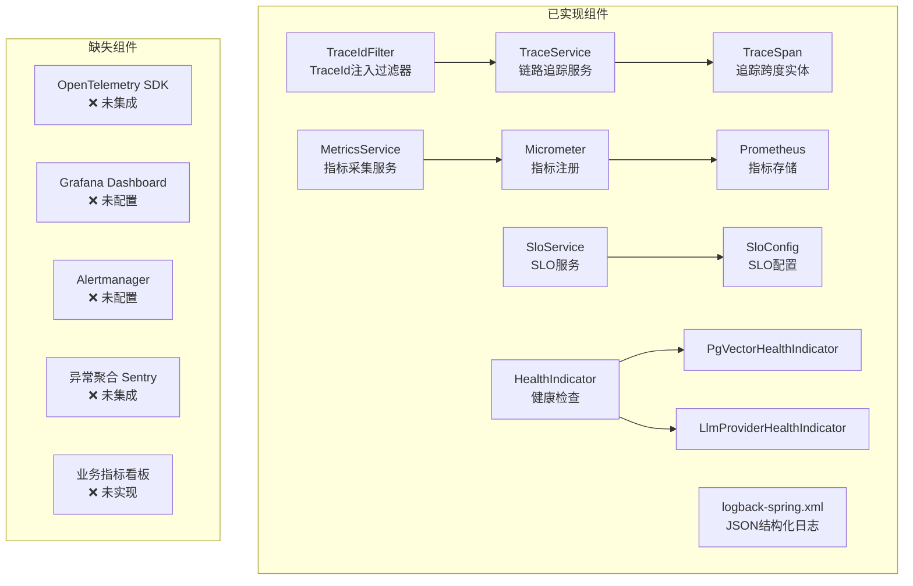
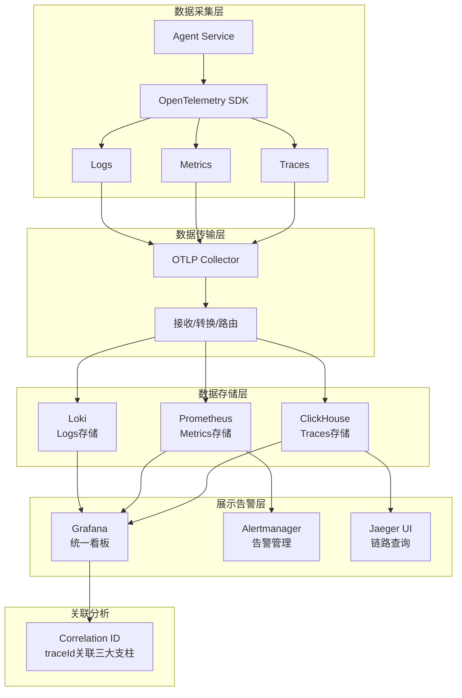
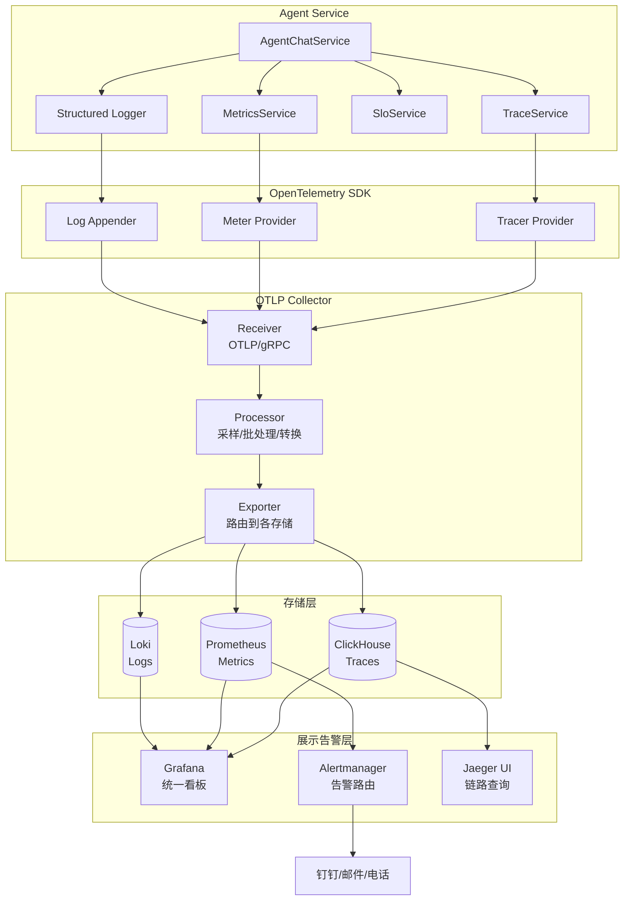
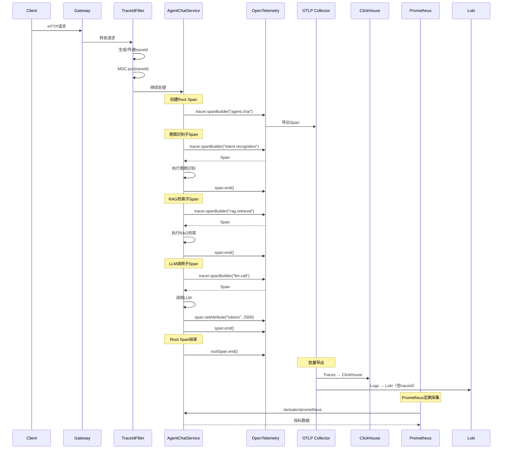
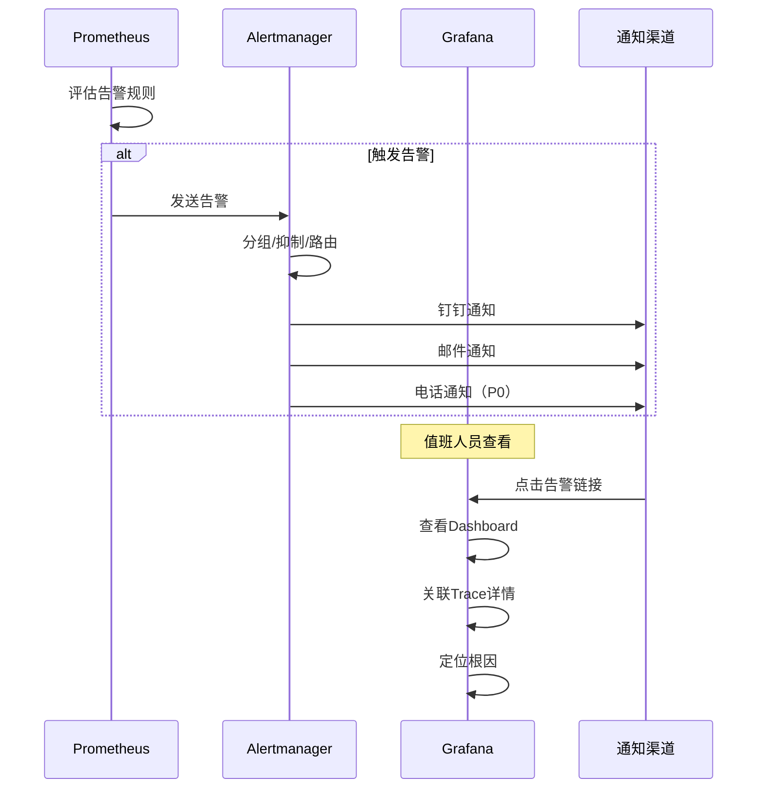

# 可观测性技术设计文档

## 文档信息

| 项目 | 内容 |
|------|------|
| **文档版本** | v1.0 |
| **创建日期** | 2026-07-14 |
| **适用项目** | CampusShare Agent |
| **模块名称** | Observability（可观测性） |
| **设计目标** | 企业级全链路可观测体系，实现Traces + Metrics + Logs三大支柱统一，支持故障秒级定位、SLO驱动告警、成本可视化 |

---

## 1. 范式反思：从"打日志"到"全链路可观测"

### 1.1 当前架构分析

当前系统已实现基础可观测性组件：



**核心组件：**

| 组件 | 文件 | 职责 |
|------|------|------|
| **TraceIdFilter** | [TraceIdFilter.java](file:///e:/workspace_work/CampusShare/backend/campushare-agent/src/main/java/com/campushare/agent/config/TraceIdFilter.java) | WebFilter注入X-Trace-Id，MDC关联日志 |
| **TraceService** | [TraceService.java](file:///e:/workspace_work/CampusShare/backend/campushare-agent/src/main/java/com/campushare/agent/service/TraceService.java) | 链路追踪：startSpan/endSpan/recordLlmUsage |
| **MetricsService** | [MetricsService.java](file:///e:/workspace_work/CampusShare/backend/campushare-agent/src/main/java/com/campushare/agent/service/MetricsService.java) | 指标采集：延迟/Token/成本/缓存/错误 |
| **SloService** | [SloService.java](file:///e:/workspace_work/CampusShare/backend/campushare-agent/src/main/java/com/campushare/agent/service/SloService.java) | SLO管理：燃烧率/错误率/延迟分位数/告警 |
| **logback-spring.xml** | logback-spring.xml | JSON结构化日志配置 |

**当前特点：**
- ✅ TraceId注入：`TraceIdFilter` 作为WebFilter，生成/传递traceId
- ✅ 链路追踪：`TraceService` 支持startSpan/endSpan/recordLlmUsage
- ✅ 指标采集：`MetricsService` 覆盖6大维度14项指标
- ✅ SLO管理：`SloService` 支持燃烧率计算和多窗口告警
- ✅ 结构化日志：JSON格式，包含traceId
- ✅ 健康检查：PgVector + LLM Provider健康指示器

### 1.2 架构短板分析

| 维度 | 当前状态 | 问题 | 影响 |
|------|----------|------|------|
| **链路追踪** | 自研TraceSpan存MySQL | 性能差，写入阻塞主流程 | 高QPS下数据丢失 |
| **指标展示** | 仅Prometheus存储 | 无Grafana Dashboard | 无法可视化 |
| **告警** | SloService有告警逻辑 | 无Alertmanager集成 | 告警无法触达 |
| **日志聚合** | JSON日志输出到文件 | 无ELK/Loki收集 | 无法集中查询 |
| **异常管理** | 全局异常处理器 | 无Sentry聚合 | 异常淹没在日志中 |
| **业务指标** | 无 | 无漏斗/转化分析 | 无法评估业务健康 |
| **采样策略** | 全量采集 | 存储成本高 | 数据量大时OOM |
| **关联分析** | Traces/Metrics/Logs独立 | 无法关联定位 | 故障排查慢 |

### 1.3 范式转变：三大支柱 + 统一关联

**新定位：** 从"分散的监控组件"升级为"统一的可观测性平台"，实现Traces + Metrics + Logs三大支柱关联分析。



**核心隐喻：可观测性 = 飞机的仪表盘**

| 飞机仪表盘 | 可观测性对应 | 说明 |
|-----------|------------|------|
| 飞行记录仪（黑匣子） | Traces | 记录完整请求路径 |
| 速度表/高度表 | Metrics | 实时数值指标 |
| 警告灯 | Alerts | 异常告警通知 |
| 雷达 | Logs | 详细事件记录 |
| 自动驾驶 | AIOps | 智能故障定位 |

---

## 2. 需求分析

### 2.1 业务目标

- **核心目标**：构建统一的可观测性平台，实现故障秒级定位、SLO驱动告警、成本可视化
- **商业价值**：MTTR（平均恢复时间）从30分钟降低到5分钟
- **量化指标**：
  - 故障发现时间 < 30s
  - 故障定位时间 < 5min
  - 告警准确率 > 95%（误报率 < 5%）
  - 链路追踪覆盖率 > 99%

### 2.2 流量特征

- **Trace数据量**：~30 spans/请求 × 30 QPS = 900 spans/s → 峰值 9000 spans/s
- **Metrics数据点**：~50个指标 × 15s采集间隔 = ~200 data points/s
- **日志数据量**：~10条/请求 × 30 QPS = 300条/s → 峰值 3000条/s
- **存储增长**：~5GB/天 → 未来 50GB/天

### 2.3 非功能要求

- **性能要求**：
  - 可观测性开销 < 5%（CPU/内存）
  - Trace写入不阻塞主流程
  - Metrics采集延迟 < 1ms
- **可用性要求**：
  - 可观测性系统自身可用性 > 99.9%
  - 数据丢失率 < 0.1%
- **可扩展性**：
  - 支持10倍流量增长
  - 支持新服务接入

---

## 3. 容量规划

### 3.1 流量预估

| 指标 | 当前 | 未来1年 | 未来3年 |
|------|------|---------|---------|
| Trace spans/s | 900 | 9,000 | 90,000 |
| Metrics points/s | 200 | 2,000 | 20,000 |
| Logs entries/s | 300 | 3,000 | 30,000 |
| 日存储量 | 5GB | 50GB | 500GB |

### 3.2 存储规模

| 存储类型 | 当前 | 未来1年 | 未来3年 |
|----------|------|---------|---------|
| Traces（ClickHouse） | 2GB/天 | 20GB/天 | 200GB/天 |
| Metrics（Prometheus） | 500MB/天 | 5GB/天 | 50GB/天 |
| Logs（Loki） | 2GB/天 | 20GB/天 | 200GB/天 |
| 总存储 | 5GB/天 | 50GB/天 | 500GB/天 |

---

## 4. 业界方案调研

### 4.1 可观测性方案对比

| 方案 | Traces | Metrics | Logs | 关联分析 | 成本 | 成熟度 |
|------|--------|---------|------|---------|------|--------|
| **自研MySQL存储** | ✅ | ✅ | ✅ | ❌ | 低 | 低 |
| **ELK Stack** | ❌ | ❌ | ✅ | 部分 | 中 | 高 |
| **Prometheus+Grafana** | ❌ | ✅ | ❌ | 部分 | 低 | 高 |
| **Jaeger+Prometheus+Loki** | ✅ | ✅ | ✅ | ✅ | 中 | 高 |
| **Datadog（商业）** | ✅ | ✅ | ✅ | ✅ | 高 | 极高 |
| **OpenTelemetry + ClickHouse** | ✅ | ✅ | ✅ | ✅ | 中 | 高 |

### 4.2 大厂实践案例

| 公司 | 方案 | 特点 |
|------|------|------|
| **字节跳动** | OpenTelemetry + 自研平台 | 全链路追踪 + 智能告警 + AIOps |
| **阿里巴巴** | ARMS（商业）+ 自研 | 全链路追踪 + 业务监控 |
| **腾讯** | 自研 + Prometheus + ES | 微服务监控 + 日志分析 |
| **美团** | OpenTelemetry + ClickHouse | 高性能存储 + 实时分析 |

### 4.3 选型决策

**最终方案：OpenTelemetry + Prometheus + Loki + Grafana**

**选型理由：**
1. **标准化**：OpenTelemetry是CNCF标准，支持多语言多后端
2. **开源免费**：全套开源方案，无商业授权费用
3. **关联分析**：通过traceId关联Traces/Metrics/Logs
4. **可扩展**：支持未来迁移到商业方案（Datadog等）

---

## 5. 方案设计

### 5.1 架构设计

**完整架构图：**



**模块职责：**

| 模块 | 职责 | 核心组件 |
|------|------|----------|
| **数据采集** | 从应用采集三大支柱数据 | OTel SDK, Micrometer, Logback |
| **数据传输** | 接收/转换/路由数据 | OTLP Collector |
| **数据存储** | 持久化各类型数据 | ClickHouse, Prometheus, Loki |
| **展示告警** | 可视化 + 告警通知 | Grafana, Alertmanager, Jaeger |
| **关联分析** | 跨支柱关联定位 | traceId关联, Grafana混合查询 |

### 5.2 核心流程

#### 5.2.1 请求完整追踪流程



#### 5.2.2 告警触发流程



### 5.3 数据模型

#### 5.3.1 Trace数据模型（ClickHouse）

**traces表：**

| 字段 | 类型 | 说明 |
|------|------|------|
| Timestamp | DateTime64(9) | 时间戳 |
| TraceId | String | 追踪ID |
| SpanId | String | 跨度ID |
| ParentSpanId | String | 父跨度ID |
| TraceState | String | 追踪状态 |
| SpanName | LowCardinality(String) | 跨度名称 |
| SpanKind | LowCardinality(String) | 跨度类型 |
| ServiceName | LowCardinality(String) | 服务名称 |
| ResourceAttributes | Map(LowCardinality(String), String) | 资源属性 |
| ScopeName | String | 范围名称 |
| ScopeVersion | String | 范围版本 |
| SpanAttributes | Map(LowCardinality(String), String) | 跨度属性 |
| Duration | Int64 | 持续时间（纳秒） |
| StatusCode | LowCardinality(String) | 状态码 |
| StatusMessage | String | 状态消息 |
| Events.Timestamp | Array(DateTime64(9)) | 事件时间戳 |
| Events.Name | Array(LowCardinality(String)) | 事件名称 |
| Events.Attributes | Array(Map(String, String)) | 事件属性 |
| Links.TraceId | Array(String) | 关联追踪ID |
| Links.SpanId | Array(String) | 关联跨度ID |

**索引设计：**
```sql
-- 按traceId查询完整链路
CREATE INDEX idx_trace_id ON traces(TraceId) TYPE bloom_filter GRANULARITY 1;
-- 按服务名+时间范围查询
CREATE INDEX idx_service_time ON traces(ServiceName, Timestamp) TYPE minmax GRANULARITY 1;
-- 按跨度名称查询
CREATE INDEX idx_span_name ON traces(SpanName) TYPE bloom_filter GRANULARITY 1;
```

#### 5.3.2 Metrics数据模型（Prometheus）

**指标命名规范：**

| 指标名 | 类型 | 标签 | 说明 |
|--------|------|------|------|
| `agent_chat_duration_seconds` | Histogram | intent, provider | 对话延迟 |
| `agent_intent_duration_seconds` | Histogram | intent, method | 意图识别延迟 |
| `agent_rag_duration_seconds` | Histogram | source, intent | RAG检索延迟 |
| `agent_llm_duration_seconds` | Histogram | provider, model, stream | LLM调用延迟 |
| `agent_tool_duration_seconds` | Histogram | tool, source | 工具执行延迟 |
| `agent_llm_tokens_total` | Counter | provider, model, type | Token消耗 |
| `agent_llm_cost_usd_total` | Counter | provider, intent | 成本 |
| `agent_chat_errors_total` | Counter | intent, error_type | 错误计数 |
| `agent_cache_hit_total` | Counter | cache_name | 缓存命中 |
| `agent_cache_miss_total` | Counter | cache_name | 缓存未命中 |
| `agent_active_sessions` | Gauge | - | 活跃会话数 |
| `agent_provider_healthy` | Gauge | provider | Provider健康状态 |
| `agent_slo_burn_rate` | Gauge | objective, window | SLO燃烧率 |

#### 5.3.3 日志数据模型（Loki）

**日志标签设计：**

| 标签 | 说明 | 示例值 |
|------|------|--------|
| `service` | 服务名 | agent-service |
| `level` | 日志级别 | INFO/WARN/ERROR |
| `traceId` | 追踪ID | abc123... |
| `userId` | 用户ID | 10001 |
| `sessionId` | 会话ID | sess_xxx |
| `intent` | 意图类型 | SEARCH/CHAT |
| `provider` | LLM供应商 | DEEPSEEK |

**日志内容格式（JSON）：**
```json
{
    "timestamp": "2026-07-14T10:30:00.123Z",
    "level": "INFO",
    "service": "agent-service",
    "traceId": "abc123def456",
    "spanId": "span789",
    "userId": "10001",
    "sessionId": "sess_xxx",
    "intent": "SEARCH",
    "provider": "DEEPSEEK",
    "message": "LLM call completed",
    "duration_ms": 2300,
    "tokens": { "prompt": 1500, "completion": 800, "total": 2300 },
    "cost_usd": 0.000322
}
```

### 5.4 API 设计

#### 5.4.1 链路查询 API

**查询Trace详情**
```
GET /api/agent/traces/{traceId}
```

**响应：**
```json
{
    "code": 200,
    "data": {
        "traceId": "abc123def456",
        "duration": 5200,
        "spanCount": 8,
        "serviceName": "agent-service",
        "startTime": "2026-07-14T10:30:00.000Z",
        "rootSpan": {
            "spanId": "root001",
            "spanName": "agent.chat",
            "duration": 5200,
            "status": "OK",
            "attributes": {
                "userId": "10001",
                "intent": "SEARCH",
                "provider": "DEEPSEEK"
            }
        },
        "spans": [
            {
                "spanId": "span001",
                "parentSpanId": "root001",
                "spanName": "intent.recognition",
                "duration": 45,
                "status": "OK",
                "attributes": { "method": "rule_short_circuit" }
            },
            {
                "spanId": "span002",
                "parentSpanId": "root001",
                "spanName": "rag.retrieval",
                "duration": 120,
                "status": "OK",
                "attributes": { "source": "knowledge+post", "resultCount": 5 }
            },
            {
                "spanId": "span003",
                "parentSpanId": "root001",
                "spanName": "llm.call",
                "duration": 2300,
                "status": "OK",
                "attributes": {
                    "provider": "DEEPSEEK",
                    "model": "deepseek-v4-flash",
                    "promptTokens": 1500,
                    "completionTokens": 800
                }
            }
        ]
    }
}
```

**查询会话追踪列表**
```
GET /api/agent/traces/session/{sessionId}
```

#### 5.4.2 SLO状态 API

**获取SLO状态**
```
GET /api/agent/slo/status
```

**响应：**
```json
{
    "code": 200,
    "data": {
        "objectives": [
            {
                "name": "chat-latency",
                "target": 5000,
                "current": 2300,
                "status": "HEALTHY",
                "errorBudget": {
                    "total": 0.1,
                    "remaining": 0.08,
                    "consumed": 0.02
                },
                "burnRate": {
                    "1m": 1.2,
                    "5m": 1.0,
                    "15m": 0.8
                },
                "latencyPercentiles": {
                    "p50": 1800,
                    "p95": 3500,
                    "p99": 4500
                }
            },
            {
                "name": "chat-availability",
                "target": 99.9,
                "current": 99.95,
                "status": "HEALTHY",
                "errorBudget": {
                    "total": 0.1,
                    "remaining": 0.05,
                    "consumed": 0.05
                }
            }
        ]
    }
}
```

### 5.5 关键实现

#### 5.5.1 OpenTelemetry配置

```java
@Configuration
public class OpenTelemetryConfig {
    
    @Bean
    public OpenTelemetry openTelemetry(
            @Value("${app.otel.exporter-endpoint:http://otel-collector:4317}") String endpoint,
            @Value("${app.otel.service.name:agent-service}") String serviceName,
            @Value("${app.otel.sampling-ratio:1.0}") double samplingRatio) {
        
        // Resource：标识服务
        Resource resource = Resource.getDefault()
            .merge(Resource.create(Attributes.of(
                ResourceAttributes.SERVICE_NAME, serviceName,
                ResourceAttributes.SERVICE_VERSION, "1.0.0",
                ResourceAttributes.DEPLOYMENT_ENVIRONMENT, "production"
            )));
        
        // Span Processor：批处理 + 采样
        SdkTracerProvider tracerProvider = SdkTracerProvider.builder()
            .addSpanProcessor(BatchSpanProcessor.builder(
                OtlpGrpcSpanExporter.builder()
                    .setEndpoint(endpoint)
                    .setTimeout(Duration.ofSeconds(5))
                    .build()
            )
                .setScheduleDelay(Duration.ofSeconds(5))
                .setMaxExportBatchSize(512)
                .build())
            .setSampler(TraceIdRatioBasedSampler.create(samplingRatio))
            .setResource(resource)
            .build();
        
        // Meter Provider：定期导出指标
        SdkMeterProvider meterProvider = SdkMeterProvider.builder()
            .registerMetricReader(PeriodicMetricReader.builder(
                OtlpGrpcMetricExporter.builder()
                    .setEndpoint(endpoint)
                    .build()
            )
                .setInterval(Duration.ofSeconds(15))
                .build())
            .setResource(resource)
            .build();
        
        return OpenTelemetrySdk.builder()
            .setTracerProvider(tracerProvider)
            .setMeterProvider(meterProvider)
            .setPropagators(ContextPropagators.create(
                W3CTraceContextPropagator.getInstance()))
            .build();
    }
}
```

#### 5.5.2 动态采样策略

```java
@Component
public class DynamicSampler implements Sampler {
    
    private final AtomicDouble samplingRatio = new AtomicDouble(1.0);
    
    @Override
    public SamplingResult shouldSample(
            Context parentContext, String traceId, String name,
            SpanKind spanKind, Attributes attributes,
            List<LinkData> parentLinks) {
        
        // 1. 错误Span全量采样
        StatusCode statusCode = attributes.get(SemanticAttributes.HTTP_STATUS_CODE) != null
            ? StatusCode.ERROR : StatusCode.OK;
        if (statusCode == StatusCode.ERROR) {
            return SamplingResult.recordAndSample();
        }
        
        // 2. 慢Span全量采样（延迟 > 5s）
        Long duration = attributes.get(SemanticAttributes.HTTP_RESPONSE_TIME);
        if (duration != null && duration > 5000) {
            return SamplingResult.recordAndSample();
        }
        
        // 3. 关键Span全量采样
        String spanName = name;
        if (spanName.contains("llm.call") || spanName.contains("tool.execute")) {
            return SamplingResult.recordAndSample();
        }
        
        // 4. 普通Span按比例采样
        if (Math.random() < samplingRatio.get()) {
            return SamplingResult.recordAndSample();
        }
        
        return SamplingResult.drop();
    }
    
    // 根据系统负载动态调整采样率
    @Scheduled(fixedDelay = 60000)
    public void adjustSamplingRate() {
        double cpuUsage = getSystemCpuUsage();
        if (cpuUsage > 0.8) {
            samplingRatio.set(0.1);  // CPU高 → 降低采样
        } else if (cpuUsage > 0.6) {
            samplingRatio.set(0.5);
        } else {
            samplingRatio.set(1.0);  // CPU低 → 全量采样
        }
    }
}
```

#### 5.5.3 三大支柱关联

```java
@Component
public class ObservabilityCorrelator {
    
    /**
     * 通过traceId关联查询Traces + Metrics + Logs
     */
    public Mono<CorrelatedView> correlate(String traceId) {
        // 1. 查询Trace
        Mono<List<TraceSpan>> traces = traceRepository.findByTraceId(traceId);
        
        // 2. 查询关联Metrics（通过traceId标签）
        Mono<List<MetricPoint>> metrics = metricsRepository.findByTraceId(traceId);
        
        // 3. 查询关联Logs（通过traceId标签）
        Mono<List<LogEntry>> logs = logRepository.findByTraceId(traceId);
        
        // 4. 构建关联视图
        return Mono.zip(traces, metrics, logs)
            .map(tuple -> CorrelatedView.builder()
                .traceId(traceId)
                .waterfall(tuple.getT1())      // 瀑布图
                .metrics(tuple.getT2())         // 关联指标
                .logs(tuple.getT3())            // 关联日志
                .anomalies(detectAnomalies(tuple)) // 异常检测
                .build());
    }
    
    /**
     * 异常检测：自动识别延迟突增、错误聚集等异常
     */
    private List<Anomaly> detectAnomalies(Tuple3<List<TraceSpan>, List<MetricPoint>, List<LogEntry>> data) {
        List<Anomaly> anomalies = new ArrayList<>();
        
        // 检测延迟异常（> P99 × 2）
        data.getT1().forEach(span -> {
            if (span.getDuration() > getP99(span.getSpanName()) * 2) {
                anomalies.add(Anomaly.builder()
                    .type("LATENCY_SPIKE")
                    .spanName(span.getSpanName())
                    .expectedValue(getP99(span.getSpanName()))
                    .actualValue(span.getDuration())
                    .severity("WARNING")
                    .build());
            }
        });
        
        // 检测错误聚集（同一错误 > 3次/分钟）
        Map<String, Long> errorCounts = data.getT3().stream()
            .filter(log -> "ERROR".equals(log.getLevel()))
            .collect(Collectors.groupingBy(LogEntry::getMessage, Collectors.counting()));
        
        errorCounts.forEach((msg, count) -> {
            if (count >= 3) {
                anomalies.add(Anomaly.builder()
                    .type("ERROR_CLUSTER")
                    .message(msg)
                    .count(count)
                    .severity("CRITICAL")
                    .build());
            }
        });
        
        return anomalies;
    }
}
```

#### 5.5.4 Grafana Dashboard JSON模板

```json
{
    "dashboard": {
        "title": "CampusShare Agent - 全链路监控",
        "panels": [
            {
                "title": "请求延迟 P99",
                "type": "timeseries",
                "targets": [{
                    "expr": "histogram_quantile(0.99, rate(agent_chat_duration_seconds_bucket[5m]))"
                }]
            },
            {
                "title": "LLM Token消耗",
                "type": "timeseries",
                "targets": [{
                    "expr": "rate(agent_llm_tokens_total[5m])"
                }],
                "fieldConfig": {
                    "overrides": [{
                        "matcher": {"id": "byName", "options": "prompt"},
                        "properties": [{"id": "color", "value": {"fixedColor": "blue"}}]
                    }]
                }
            },
            {
                "title": "SLO燃烧率",
                "type": "gauge",
                "targets": [{
                    "expr": "agent_slo_burn_rate{objective='chat-latency',window='5m'}"
                }],
                "fieldConfig": {
                    "defaults": {
                        "thresholds": {
                            "steps": [
                                {"value": 1, "color": "green"},
                                {"value": 6, "color": "yellow"},
                                {"value": 14.4, "color": "red"}
                            ]
                        }
                    }
                }
            },
            {
                "title": "Provider健康状态",
                "type": "stat",
                "targets": [{
                    "expr": "agent_provider_healthy"
                }]
            },
            {
                "title": "缓存命中率",
                "type": "piechart",
                "targets": [
                    {"expr": "rate(agent_cache_hit_total[5m])", "legendFormat": "hit"},
                    {"expr": "rate(agent_cache_miss_total[5m])", "legendFormat": "miss"}
                ]
            },
            {
                "title": "日成本趋势",
                "type": "timeseries",
                "targets": [{
                    "expr": "increase(agent_llm_cost_usd_total[1d])"
                }]
            }
        ]
    }
}
```

#### 5.5.5 Alertmanager告警规则

```yaml
groups:
  - name: agent-slo-alerts
    rules:
      # P0: 可用性SLO燃烧率 > 14.4（15分钟窗口）
      - alert: AvailabilitySloCritical
        expr: agent_slo_burn_rate{objective="chat-availability",window="15m"} > 14.4
        for: 2m
        labels:
          severity: critical
        annotations:
          summary: "可用性SLO严重超标"
          description: "燃烧率 {{ $value }}，目标 99.9%"
      
      # P1: 延迟SLO燃烧率 > 6（5分钟窗口）
      - alert: LatencySloWarning
        expr: agent_slo_burn_rate{objective="chat-latency",window="5m"} > 6
        for: 5m
        labels:
          severity: warning
        annotations:
          summary: "延迟SLO超标"
          description: "P99延迟燃烧率 {{ $value }}"
      
      # P1: LLM Provider不可用
      - alert: LlmProviderDown
        expr: agent_provider_healthy == 0
        for: 1m
        labels:
          severity: warning
        annotations:
          summary: "LLM Provider {{ $labels.provider }} 不可用"
      
      # P0: 所有Provider不可用
      - alert: AllLlmProvidersDown
        expr: count(agent_provider_healthy == 0) == count(agent_provider_healthy)
        for: 30s
        labels:
          severity: critical
        annotations:
          summary: "所有LLM Provider不可用！"
      
      # P1: 日成本超预算
      - alert: DailyCostOverBudget
        expr: increase(agent_llm_cost_usd_total[1d]) > 50
        for: 5m
        labels:
          severity: warning
        annotations:
          summary: "日成本超过$50预算"
          description: "当前成本 ${{ $value }}"
      
      # P2: 缓存命中率过低
      - alert: CacheHitRateLow
        expr: rate(agent_cache_hit_total[5m]) / (rate(agent_cache_hit_total[5m]) + rate(agent_cache_miss_total[5m])) < 0.3
        for: 10m
        labels:
          severity: info
        annotations:
          summary: "缓存命中率低于30%"
```

---

## 6. 可靠性设计

### 6.1 可观测性系统自身可靠性

| 组件 | 故障影响 | 容错策略 |
|------|----------|----------|
| OTLP Collector宕机 | 数据丢失 | 本地缓冲 + 重试 |
| ClickHouse宕机 | Trace查询不可用 | 降级到MySQL存储 |
| Prometheus宕机 | 指标查询不可用 | Grafana缓存最近数据 |
| Loki宕机 | 日志查询不可用 | 降级到文件日志 |
| Grafana宕机 | 看板不可用 | 直接查Prometheus/Loki |

### 6.2 数据完整性保证

- **本地缓冲**：OTel SDK本地队列缓冲，Collector恢复后自动重发
- **批处理**：512条/批或5秒刷新，平衡延迟和吞吐
- **背压保护**：队列满时丢弃最旧数据，防止OOM
- **数据校验**：Collector端校验数据完整性

---

## 7. 性能优化

### 7.1 瓶颈分析

| 瓶颈点 | 当前状态 | 影响 |
|--------|----------|------|
| TraceSpan写入MySQL | 同步写入 | 每次请求增加50ms延迟 |
| Metrics采集 | Micrometer直接注册 | 开销小，但无批处理 |
| 日志输出 | JSON输出到文件 | 无集中收集 |

### 7.2 优化策略

**Trace异步化：**
- 当前：TraceSpan同步写MySQL
- 优化：OTel SDK异步批量导出到ClickHouse
- 预期收益：消除Trace写入延迟（50ms → 0ms）

**采样降低数据量：**
- 动态采样：CPU高时降低采样率
- 关键Span全量：LLM调用、工具执行100%采样
- 普通Span按比例：正常100%，高负载10%
- 预期收益：数据量降低60%

**日志标签优化：**
- 高基数标签（userId）不用于Loki索引
- 仅低基数标签（service, level, traceId）用于索引
- 预期收益：Loki内存降低50%

### 7.3 性能指标

| 指标 | 目标值 |
|------|--------|
| 可观测性CPU开销 | < 3% |
| 可观测性内存开销 | < 100MB |
| Trace写入延迟（异步） | < 1ms |
| Metrics采集延迟 | < 0.5ms |
| 日志输出延迟 | < 0.1ms |

---

## 8. 可观测性设计（自身）

### 8.1 监控可观测性系统

| 指标 | 说明 | 告警阈值 |
|------|------|----------|
| `otel_exporter_success_rate` | OTel导出成功率 | < 95% |
| `otel_exporter_queue_size` | 导出队列大小 | > 80%容量 |
| `otel_collector_uptime` | Collector运行时间 | 重启告警 |
| `clickhouse_query_latency` | ClickHouse查询延迟 | P99 > 5s |
| `prometheus_scrape_success` | Prometheus采集成功率 | < 99% |

### 8.2 告警策略

| 告警级别 | 条件 | 通知方式 |
|----------|------|----------|
| P0 | 所有LLM Provider不可用 | 电话 + 钉钉 |
| P0 | 可用性SLO燃烧率 > 14.4 | 电话 + 钉钉 |
| P1 | 延迟SLO燃烧率 > 6 | 钉钉 |
| P1 | 日成本超预算 | 钉钉 |
| P1 | Provider错误率 > 10% | 钉钉 |
| P2 | 缓存命中率 < 30% | 邮件 |
| P2 | OTel Collector异常 | 邮件 |

---

## 9. 安全设计

### 9.1 数据安全

- Trace数据中不包含用户敏感信息（消息内容脱敏）
- API Key等凭证不出现在Span属性中
- 日志中PII信息自动脱敏（手机号、身份证等）

### 9.2 访问控制

- Grafana看板按角色分权限（开发/运维/管理）
- 告警规则修改需要管理员权限
- 审计日志记录所有看板/告警变更

### 9.3 数据保留

| 数据类型 | 保留时间 | 说明 |
|----------|----------|------|
| Traces | 7天 | 热数据，ClickHouse |
| Traces（归档） | 90天 | 冷存储，压缩 |
| Metrics | 30天 | 1分钟精度 |
| Metrics（归档） | 365天 | 5分钟精度降采样 |
| Logs | 15天 | 热数据 |
| Logs（归档） | 90天 | 冷存储 |

---

## 10. 运维设计

### 10.1 部署架构

```yaml
# docker-compose.yml 可观测性组件
otel-collector:
  image: otel/opentelemetry-collector-contrib:latest
  ports:
    - "4317:4317"   # OTLP gRPC
    - "4318:4318"   # OTLP HTTP
    - "8888:8888"   # Collector Metrics
  volumes:
    - ./otel-collector-config.yaml:/etc/otelcol/config.yaml

prometheus:
  image: prom/prometheus:latest
  ports:
    - "9090:9090"
  volumes:
    - ./prometheus.yml:/etc/prometheus/prometheus.yml
    - prometheus-data:/prometheus

grafana:
  image: grafana/grafana:latest
  ports:
    - "3000:3000"
  environment:
    - GF_SECURITY_ADMIN_PASSWORD=${GRAFANA_ADMIN_PASSWORD}
  volumes:
    - grafana-data:/var/lib/grafana
    - ./grafana/dashboards:/etc/grafana/provisioning/dashboards

loki:
  image: grafana/loki:latest
  ports:
    - "3100:3100"
  volumes:
    - loki-data:/loki

alertmanager:
  image: prom/alertmanager:latest
  ports:
    - "9093:9093"
  volumes:
    - ./alertmanager.yml:/etc/alertmanager/config.yml
```

### 10.2 配置管理

```yaml
# application.yml 可观测性配置
app:
  observability:
    otel:
      enabled: true
      exporter-endpoint: http://otel-collector:4317
      service-name: agent-service
      sampling-ratio: 1.0
      batch-size: 512
      schedule-delay-seconds: 5
    slo:
      objectives:
        - name: chat-latency
          target-ms: 5000
          percentile: 99
        - name: chat-availability
          target-percent: 99.9
    alerting:
      enabled: true
      alertmanager-url: http://alertmanager:9093
      channels:
        - type: dingtalk
          webhook: ${DINGTALK_WEBHOOK}
        - type: email
          recipients: ${ALERT_EMAIL_RECIPIENTS}
```

---

## 11. 成本优化

### 11.1 可观测性系统成本

| 组件 | 资源消耗 | 月成本 |
|------|----------|--------|
| OTLP Collector | 0.5 CPU, 512MB | ~¥50 |
| Prometheus | 1 CPU, 2GB | ~¥100 |
| ClickHouse | 2 CPU, 4GB | ~¥200 |
| Loki | 1 CPU, 2GB | ~¥100 |
| Grafana | 0.5 CPU, 512MB | ~¥50 |
| **合计** | | **~¥500/月** |

### 11.2 优化策略

- **采样降低存储**：动态采样降低60%数据量 → 存储成本降低60%
- **数据保留策略**：热数据7天，冷数据90天 → 存储成本降低70%
- **降采样**：Metrics 30天后降采样到5分钟 → 存储降低80%

---

## 12. 风险评估

### 12.1 技术风险

| 风险 | 概率 | 影响 | 缓解措施 |
|------|------|------|----------|
| OTLP Collector单点故障 | 中 | 高 | 双实例部署 + 本地缓冲 |
| ClickHouse查询慢 | 低 | 中 | 合理索引 + 分区 |
| 采样率过低丢失关键数据 | 低 | 高 | 错误/慢Span全量采样 |
| 告警风暴 | 中 | 中 | 告警抑制 + 分组 |

### 12.2 运维风险

| 风险 | 概率 | 影响 | 缓解措施 |
|------|------|------|----------|
| 存储磁盘满 | 中 | 高 | 自动清理 + 磁盘告警 |
| 配置错误导致数据丢失 | 低 | 高 | 配置版本控制 + 灰度发布 |

---

## 13. 验证方案

### 13.1 功能验证

| 场景 | 验证内容 | 验收标准 |
|------|----------|----------|
| 链路追踪 | 完整请求链路 | 所有Span正确关联 |
| 指标采集 | 14项指标 | Prometheus可查询 |
| 结构化日志 | JSON格式 | Loki可查询 |
| 三大支柱关联 | traceId关联 | Grafana混合查询 |
| SLO告警 | 燃烧率计算 | 告警正确触发 |
| 动态采样 | CPU自适应 | 高负载时降低采样 |

### 13.2 性能验证

| 指标 | 目标值 |
|------|--------|
| 可观测性CPU开销 | < 3% |
| Trace写入延迟 | < 1ms（异步） |
| Grafana看板加载 | < 5s |

---

## 14. 演进规划

### 14.1 阶段一：基础建设（0-3 个月）

- ✅ OpenTelemetry SDK集成
- ✅ OTLP Collector部署
- ✅ Prometheus + Grafana基础看板
- ✅ Loki日志收集
- ✅ Alertmanager告警配置
- **目标**：三大支柱数据采集完成

### 14.2 阶段二：关联分析（3-6 个月）

- ✅ 三大支柱traceId关联
- ✅ 异常自动检测
- ✅ 完整Grafana Dashboard
- ✅ SLO燃烧率告警优化
- **目标**：故障定位时间 < 5min

### 14.3 阶段三：智能化（6-12 个月）

- ✅ AIOps异常检测（ML模型）
- ✅ 自动根因分析
- ✅ 智能告警降噪
- ✅ 成本预测和优化建议
- **目标**：告警准确率 > 95%

### 14.4 阶段四：规模化（12-24 个月）

- ✅ 多服务统一监控
- ✅ 全球多区域部署
- ✅ 自定义看板生成器
- ✅ 可观测性数据湖
- **目标**：支持10+微服务统一监控

---

## 15. 附录

### 15.1 术语表

| 术语 | 说明 |
|------|------|
| **Traces** | 链路追踪，记录请求完整路径 |
| **Metrics** | 指标监控，实时数值指标 |
| **Logs** | 结构化日志，详细事件记录 |
| **OpenTelemetry** | CNCF可观测性标准框架 |
| **OTLP** | OpenTelemetry Protocol，数据传输协议 |
| **SLO** | Service Level Objective，服务等级目标 |
| **燃烧率** | Error Budget消耗速度，> 1表示超标 |
| **Span** | 追踪跨度，链路中的一个操作单元 |
| **Correlation** | 关联分析，跨支柱数据关联 |

### 15.2 参考资料

- [OpenTelemetry Documentation](https://opentelemetry.io/docs/)
- [Prometheus Best Practices](https://prometheus.io/docs/practices/)
- [Grafana Dashboard Design](https://grafana.com/docs/grafana/latest/dashboards/)
- [SLO Burn Rate Alerting](https://developers.google.com/sre/book/monitoring-distributed-systems)

### 15.3 变更记录

| 版本 | 日期 | 变更内容 |
|------|------|----------|
| v1.0 | 2026-07-14 | 初始版本 |
