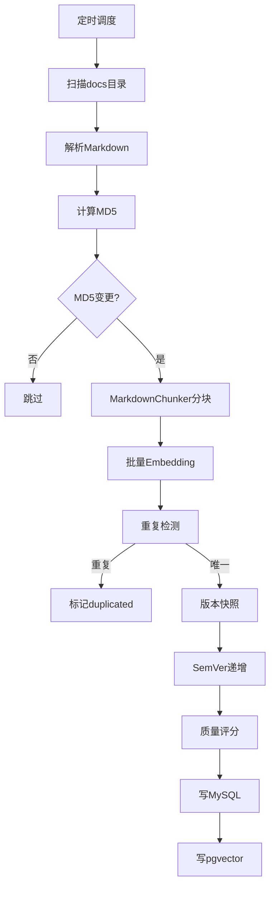
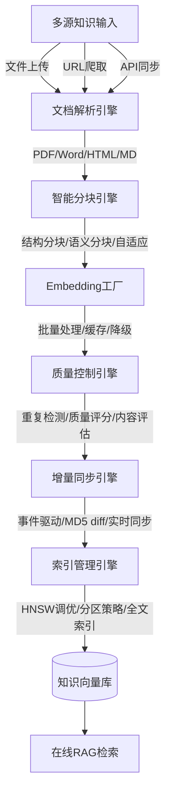
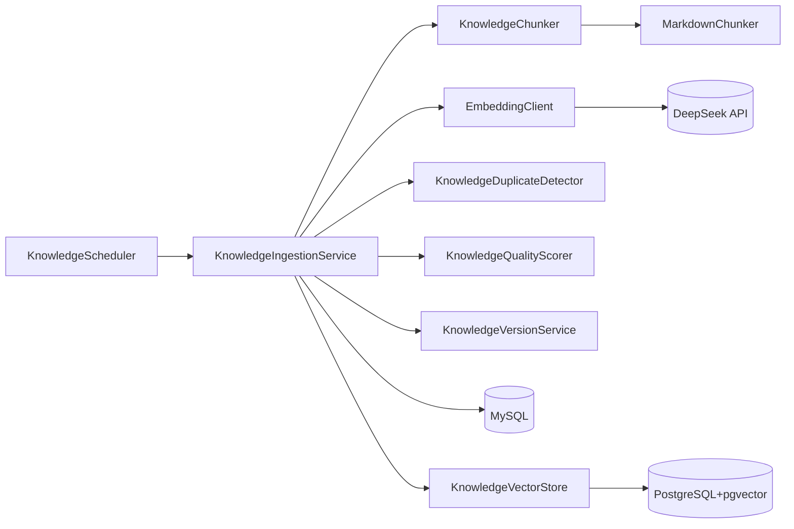
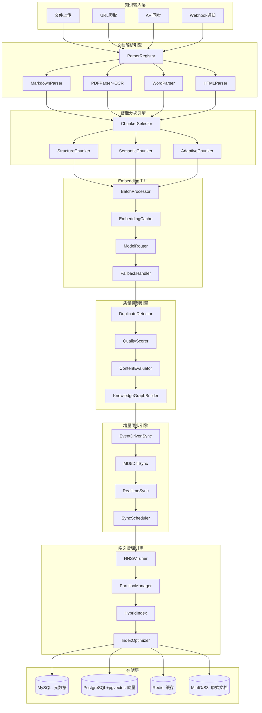
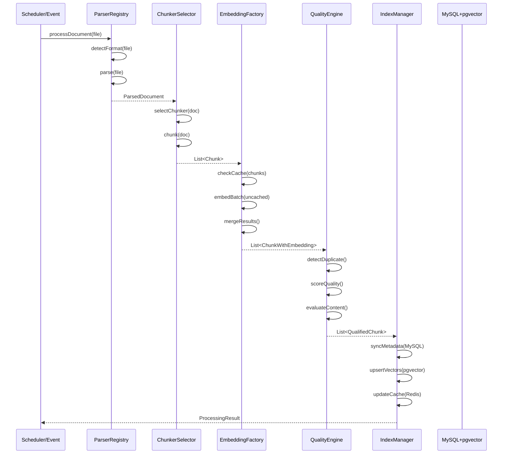
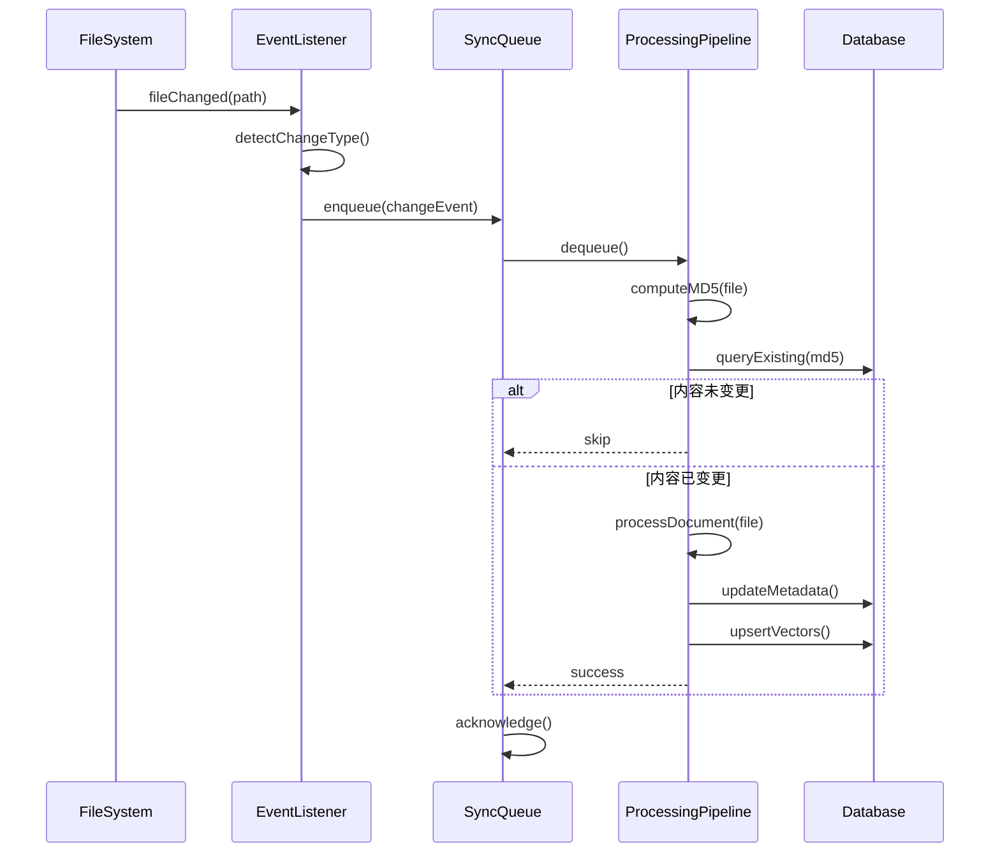

# Agent 离线RAG流水线技术设计文档

## 文档信息

| 项目 | 内容 |
|------|------|
| **文档版本** | v1.0 |
| **创建日期** | 2026-07-14 |
| **适用项目** | CampusShare Agent |
| **模块名称** | Offline RAG Pipeline |
| **设计目标** | 企业级离线RAG流水线，支持多格式文档解析、智能分块、批量向量化、增量同步、质量控制、版本管理 |

---

## 1. 范式反思：从简单注入到智能知识工厂

### 1.1 当前架构分析

当前系统已实现基础的知识库注入流水线：



**核心特点：**
- ✅ 定时调度：启动后30s + 每小时增量
- ✅ MD5增量同步：内容未变更则跳过
- ✅ Markdown分块：按H2→H3→段落→句子结构分块
- ✅ 批量Embedding：一次处理所有分块
- ✅ 重复检测：基于chunk_index=0的embedding相似度
- ✅ 版本管理：SemVer语义化版本 + 全量历史表
- ✅ 质量评分：四维评分（召回频次0.4 + 用户反馈0.3 + 新鲜度0.2 + 完整度0.1）

### 1.2 架构短板分析

| 维度 | 当前状态 | 问题 | 影响 |
|------|----------|------|------|
| **文档格式** | 仅Markdown | 不支持PDF/Word/HTML | 知识来源受限 |
| **分块策略** | 固定结构分块 | 无自适应分块、无语义分块 | 分块质量不稳定 |
| **Embedding** | 同步批量调用 | 无批处理优化、无缓存 | 效率低、成本高 |
| **增量同步** | MD5全量对比 | 无事件驱动、无实时性 | 延迟高 |
| **质量控制** | 四维评分 | 无内容质量评估、无去重优化 | 低质量内容入库 |
| **索引管理** | 无索引优化 | 无HNSW参数调优、无分区策略 | 检索性能差 |
| **可观测性** | 基础日志 | 无完整链路追踪、无业务指标 | 问题定位难 |

### 1.3 范式转变：智能知识工厂

**新定位：** 从"文档注入工具"升级为"智能知识工厂"，具备多格式解析、智能分块、增量同步、质量管控的完整能力。



**新能力：**
1. **多格式解析**：PDF（OCR）、Word、HTML、Markdown、纯文本
2. **智能分块**：结构分块 + 语义分块 + 自适应分块策略
3. **Embedding工厂**：批量处理、缓存复用、多模型支持、降级策略
4. **质量控制**：内容质量评估、语义去重、知识图谱构建
5. **增量同步**：事件驱动（文件变更通知）+ MD5 diff + 实时同步
6. **索引优化**：HNSW参数调优、分区策略、混合索引（向量+全文）

### 1.4 业界方案对比

| 方案 | 文档解析 | 分块策略 | Embedding | 增量同步 | 质量控制 | 成熟度 |
|------|----------|----------|-----------|----------|----------|--------|
| **LlamaIndex** | 多格式 | 多种分块器 | 多模型 | 无 | 基础 | 高 |
| **LangChain** | 多格式 | 多种分块器 | 多模型 | 无 | 基础 | 高 |
| **Unstructured** | 专业解析 | 无 | 无 | 无 | 无 | 高 |
| **自研知识工厂** | 多格式+OCR | 智能分块 | 批量+缓存 | 事件驱动 | 完整管控 | 中 |

### 1.5 本项目选择

**当前阶段：**
- ✅ 扩展文档格式支持（PDF/Word/HTML）
- ✅ 实现智能分块策略（语义分块 + 自适应）
- ✅ 优化Embedding工厂（批量+缓存+降级）
- ✅ 实现事件驱动增量同步
- ✅ 完善质量控制体系

**未来阶段：**
- ✅ 支持知识图谱构建
- ✅ 支持多模态知识（图片、表格）
- ✅ 支持实时流式知识注入

---

## 2. 需求分析

### 2.1 业务目标

- **核心目标**：构建高效、智能的离线知识处理流水线，为在线RAG提供高质量知识底座
- **商业价值**：提升知识检索准确率，降低LLM调用成本，改善用户体验
- **量化指标**：
  - 文档解析成功率 ≥ 99%
  - 分块质量评分 ≥ 85%（人工评估）
  - Embedding缓存命中率 ≥ 60%
  - 增量同步延迟 < 5分钟

### 2.2 数据规模

| 指标 | 当前 | 未来1年 | 未来3年 |
|------|------|---------|---------|
| 知识文档数 | 100 | 1,000 | 10,000 |
| 文档平均大小 | 10KB | 20KB | 50KB |
| 总分块数 | 1,000 | 10,000 | 100,000 |
| 向量维度 | 1024 | 1024 | 1024 |
| 存储规模 | 100MB | 1GB | 10GB |

### 2.3 处理特征

- **批量处理**：非实时，可接受分钟级延迟
- **资源密集**：CPU密集（解析、分块）+ IO密集（Embedding API调用）
- **幂等性**：相同文档多次处理结果一致
- **可重试**：失败任务可安全重试

### 2.4 非功能要求

- **性能要求**：
  - 单文档处理延迟 P99 < 30s（含Embedding）
  - 批量处理吞吐量 > 100文档/小时
  - Embedding API调用延迟 P99 < 5s/批次
- **可用性要求**：
  - SLA：99.9%（服务可用性）
  - 任务成功率 ≥ 99%
- **可靠性要求**：
  - 任务失败自动重试（最多3次）
  - 断点续传（中断后可恢复）
  - 数据一致性（MySQL与pgvector一致）
- **可扩展性要求**：
  - 支持水平扩展（多实例并行处理）
  - 支持新格式插件化扩展

---

## 3. 容量规划

### 3.1 处理量预估

| 指标 | 当前 | 未来1年 | 未来3年 |
|------|------|---------|---------|
| 日新增文档 | 10 | 100 | 1,000 |
| 日处理分块 | 100 | 1,000 | 10,000 |
| 日Embedding调用 | 100次 | 1,000次 | 10,000次 |
| 峰值处理量 | 50文档/小时 | 500文档/小时 | 5,000文档/小时 |

### 3.2 服务器规模

| 组件 | 当前 | 未来1年 | 未来3年 |
|------|------|---------|---------|
| Agent Service | 1台 4核8G | 3台 8核16G | 10台 16核32G |
| PostgreSQL（pgvector） | 1台 8核16G | 3台 16核32G | 8台 32核64G |
| Redis（缓存） | 1台 8G | 3台 16G Cluster | 6台 32G Cluster |
| 对象存储（MinIO/S3） | 100GB | 1TB | 10TB |

### 3.3 存储规模

| 存储类型 | 当前 | 未来1年 | 未来3年 |
|----------|------|---------|---------|
| 原始文档 | 1GB | 20GB | 500GB |
| MySQL（元数据） | 100MB | 1GB | 10GB |
| PostgreSQL（向量） | 100MB | 1GB | 10GB |
| Redis（缓存） | 500MB | 5GB | 50GB |

### 3.4 网络带宽

- **Embedding API调用**：平均10KB/请求，峰值100KB/s
- **文档下载**：平均100KB/文档，峰值10MB/s
- **向量同步**：平均4KB/向量，峰值40MB/s

---

## 4. 现状分析

### 4.1 当前方案

**架构图：**



**核心代码：**

- [KnowledgeIngestionService.java](file:///e:/workspace_work/CampusShare/backend/campushare-agent/src/main/java/com/campushare/agent/service/KnowledgeIngestionService.java)：知识注入核心服务
- [KnowledgeChunker.java](file:///e:/workspace_work/CampusShare/backend/campushare-agent/src/main/java/com/campushare/agent/service/KnowledgeChunker.java)：分块器接口
- [MarkdownChunker.java](file:///e:/workspace_work/CampusShare/backend/campushare-agent/src/main/java/com/campushare/agent/service/MarkdownChunker.java)：Markdown分块实现
- [KnowledgeVectorStore.java](file:///e:/workspace_work/CampusShare/backend/campushare-agent/src/main/java/com/campushare/agent/store/KnowledgeVectorStore.java)：向量存储
- [KnowledgeScheduler.java](file:///e:/workspace_work/CampusShare/backend/campushare-agent/src/main/java/com/campushare/agent/config/KnowledgeScheduler.java)：定时调度

**数据模型：**

| 表名 | 用途 | 关键字段 |
|------|------|----------|
| `knowledge_articles` | 知识文章元数据 | id, title, topic, content, content_md5, version, chunk_count, quality_score |
| `knowledge_article_versions` | 文章版本历史 | article_id, version, content, created_at |
| `knowledge_vectors` | 分块向量存储 | article_id, chunk_index, embedding, heading_path, quality_score |

### 4.2 问题清单

| 优先级 | 问题 | 影响 | 根因 |
|--------|------|------|------|
| P0 | 仅支持Markdown格式 | 知识来源受限 | 未实现多格式解析器 |
| P0 | 分块策略单一 | 分块质量不稳定 | 无语义分块、无自适应策略 |
| P1 | Embedding无缓存 | 重复调用成本高 | 未实现Embedding缓存层 |
| P1 | 增量同步延迟高 | 知识更新不及时 | 仅定时扫描，无事件驱动 |
| P1 | 无HNSW参数调优 | 检索性能差 | 未配置索引参数 |
| P2 | 无内容质量评估 | 低质量内容入库 | 仅依赖四维评分 |
| P2 | 无可观测性 | 问题定位难 | 缺少链路追踪和业务指标 |

---

## 5. 业界方案调研

### 5.1 方案对比

| 维度 | LlamaIndex | LangChain | Unstructured | 自研方案 |
|------|------------|-----------|--------------|----------|
| **文档解析** | 多格式Loader | 多格式Loader | 专业解析 | 多格式+OCR |
| **分块策略** | 多种分块器 | 多种分块器 | 无 | 智能分块 |
| **Embedding** | 多模型支持 | 多模型支持 | 无 | 批量+缓存 |
| **增量同步** | 无 | 无 | 无 | 事件驱动 |
| **质量控制** | 基础 | 基础 | 无 | 完整管控 |
| **可扩展性** | 高 | 高 | 中 | 高 |
| **成本** | 中 | 中 | 高 | 低 |
| **可控性** | 中 | 中 | 低 | 高 |

### 5.2 大厂实践案例

**案例1：字节跳动豆包知识库**
- 多格式解析：PDF（OCR）、Word、HTML、Markdown
- 智能分块：基于语义的分块，保持段落完整性
- 增量同步：文件变更事件驱动，实时同步
- 质量控制：内容去重、质量评分、人工审核

**案例2：阿里通义千问知识引擎**
- 文档解析：支持OCR、表格识别、公式识别
- 分块策略：结构化分块 + 语义分块混合
- Embedding：批量处理 + 本地模型缓存
- 索引优化：HNSW参数调优、分区策略

**案例3：腾讯混元知识平台**
- 多模态知识：文本、图片、表格统一处理
- 知识图谱：自动构建实体关系
- 增量同步：Webhook + 消息队列
- 质量管控：多维度评分、自动清洗

### 5.3 关键技术选型

#### 5.3.1 文档解析方案对比

| 方案 | 支持格式 | OCR能力 | 表格识别 | 成本 | 成熟度 |
|------|----------|---------|----------|------|--------|
| **Apache PDFBox** | PDF | 无 | 无 | 免费 | 高 |
| **Apache Tika** | 多格式 | 无 | 基础 | 免费 | 高 |
| **Unstructured** | 多格式 | 有 | 有 | 开源+商业 | 高 |
| **Docling (IBM)** | 多格式 | 有 | 有 | 免费 | 中 |
| **自研解析器** | 自定义 | 集成OCR | 自定义 | 开发成本 | 中 |

**选型建议：**
- **当前阶段**：Apache Tika（通用） + Apache PDFBox（PDF增强）
- **未来阶段**：集成Unstructured或Docling（OCR+表格）

#### 5.3.2 分块策略对比

| 策略 | 原理 | 优点 | 缺点 | 适用场景 |
|------|------|------|------|----------|
| **固定大小** | 按Token数切分 | 简单 | 破坏语义 | 通用 |
| **结构分块** | 按标题/段落切分 | 保持结构 | 依赖格式 | Markdown/HTML |
| **语义分块** | 按语义边界切分 | 语义完整 | 计算成本高 | 高质量要求 |
| **递归分块** | 多层级递归切分 | 灵活 | 复杂 | 混合文档 |
| **自适应分块** | 根据内容动态调整 | 最优 | 实现复杂 | 企业级 |

**选型建议：**
- **当前阶段**：结构分块（Markdown） + 固定大小（其他格式）
- **未来阶段**：语义分块 + 自适应分块

#### 5.3.3 Embedding缓存策略

| 策略 | 原理 | 优点 | 缺点 | 适用场景 |
|------|------|------|------|----------|
| **无缓存** | 每次调用API | 简单 | 成本高 | 开发测试 |
| **本地缓存** | Caffeine/Redis | 快速 | 容量有限 | 小规模 |
| **分布式缓存** | Redis Cluster | 大容量 | 网络延迟 | 中大规模 |
| **多级缓存** | L1本地+L2分布式 | 最优 | 复杂 | 企业级 |

**选型建议：**
- **当前阶段**：Redis分布式缓存（按内容MD5）
- **未来阶段**：Caffeine L1 + Redis L2 多级缓存

### 5.4 选型决策

**最终方案：自研智能知识工厂**

**选型理由：**
1. **可控性**：完全自主可控，不依赖第三方服务
2. **扩展性**：支持自定义解析器、分块策略、Embedding模型
3. **成本**：使用开源组件，降低运营成本
4. **集成性**：与现有系统深度集成，数据一致性保证

**风险评估：**
- 开发成本较高
- 需要持续优化分块质量

**替代方案：**
- 短期可考虑集成LlamaIndex作为解析和分块层
- 长期保持自研核心逻辑

---

## 6. 方案设计

### 6.1 架构设计

**整体架构图：**



**模块职责：**

| 模块 | 职责 | 核心组件 |
|------|------|----------|
| **文档解析引擎** | 多格式文档解析 | MarkdownParser, PDFParser, WordParser, HTMLParser |
| **智能分块引擎** | 智能文本分块 | StructureChunker, SemanticChunker, AdaptiveChunker |
| **Embedding工厂** | 批量向量化处理 | BatchProcessor, EmbeddingCache, ModelRouter |
| **质量控制引擎** | 内容质量管控 | DuplicateDetector, QualityScorer, ContentEvaluator |
| **增量同步引擎** | 增量数据同步 | EventDrivenSync, MD5DiffSync, RealtimeSync |
| **索引管理引擎** | 向量索引优化 | HNSWTuner, PartitionManager, HybridIndex |

### 6.2 核心流程

#### 6.2.1 文档处理主流程



#### 6.2.2 增量同步流程



### 6.3 数据模型

#### 6.3.1 核心实体

**KnowledgeArticle（知识文章）**

| 字段 | 类型 | 约束 | 说明 |
|------|------|------|------|
| id | BIGINT | PK, AUTO_INCREMENT | 主键 |
| title | VARCHAR(256) | NOT NULL | 标题 |
| topic | VARCHAR(128) | NOT NULL | 主题 |
| content | LONGTEXT | NOT NULL | 正文内容 |
| content_md5 | VARCHAR(32) | NOT NULL, INDEX | 内容MD5 |
| status | VARCHAR(32) | DEFAULT 'PUBLISHED' | 状态 |
| version | VARCHAR(32) | NOT NULL | 版本号（SemVer） |
| chunk_count | INT | DEFAULT 0 | 分块数量 |
| quality_score | DECIMAL(5,4) | DEFAULT 0.5 | 质量评分 |
| recall_count | INT | DEFAULT 0 | 召回次数 |
| feedback_score | DECIMAL(5,4) | DEFAULT 0.5 | 用户反馈评分 |
| tags | VARCHAR(256) | NULL | 标签 |
| format | VARCHAR(32) | DEFAULT 'markdown' | 文档格式 |
| source_url | VARCHAR(512) | NULL | 来源URL |
| file_path | VARCHAR(512) | NULL | 文件路径 |
| created_at | DATETIME | DEFAULT NOW() | 创建时间 |
| updated_at | DATETIME | DEFAULT NOW() | 更新时间 |

**KnowledgeVector（分块向量）**

| 字段 | 类型 | 约束 | 说明 |
|------|------|------|------|
| id | BIGINT | PK, AUTO_INCREMENT | 主键 |
| article_id | BIGINT | NOT NULL, INDEX | 文章ID |
| chunk_index | INT | NOT NULL | 分块索引 |
| title | VARCHAR(256) | NOT NULL | 文章标题 |
| topic | VARCHAR(128) | NOT NULL | 主题 |
| chunk_content | TEXT | NOT NULL | 分块内容 |
| heading_path | VARCHAR(256) | NULL | 标题路径 |
| content_md5 | VARCHAR(32) | NOT NULL | 内容MD5 |
| status | VARCHAR(32) | DEFAULT 'PUBLISHED' | 状态 |
| version | VARCHAR(32) | NOT NULL | 版本号 |
| quality_score | DECIMAL(5,4) | DEFAULT 0.5 | 质量评分 |
| token_count | INT | DEFAULT 0 | Token数量 |
| embedding | vector(1024) | NOT NULL | 向量 |
| embedding_model | VARCHAR(64) | DEFAULT 'bge-m3' | Embedding模型 |
| recall_count | INT | DEFAULT 0 | 召回次数 |
| created_at | TIMESTAMP | DEFAULT NOW() | 创建时间 |
| updated_at | TIMESTAMP | DEFAULT NOW() | 更新时间 |

**索引设计：**
```sql
-- 向量索引（HNSW）
CREATE INDEX idx_vector_embedding ON knowledge_vectors USING hnsw(embedding vector_cosine_ops) WITH (m = 16, ef_construction = 64);

-- 全文索引（pg_trgm）
CREATE INDEX idx_vector_content_trgm ON knowledge_vectors USING gin(chunk_content gin_trgm_ops);

-- 复合索引
CREATE INDEX idx_vector_article_chunk ON knowledge_vectors(article_id, chunk_index);
CREATE INDEX idx_vector_status ON knowledge_vectors(status);
```

#### 6.3.2 缓存数据结构

**Redis Key 设计：**

| Key 模式 | 数据结构 | TTL | 说明 |
|----------|----------|-----|------|
| `knowledge:embedding:{md5}` | Binary | 7d | Embedding缓存 |
| `knowledge:article:{id}` | Hash | 1h | 文章元数据缓存 |
| `knowledge:chunk:{id}` | Hash | 1h | 分块内容缓存 |
| `knowledge:stats:total` | String | 5m | 统计信息缓存 |

### 6.4 API 设计

#### 6.4.1 知识管理 API

**手动触发知识注入**
```
POST /api/agent/knowledge/ingest
```

**响应：**
```json
{
    "code": 200,
    "message": "success",
    "data": {
        "total": 100,
        "inserted": 10,
        "updated": 5,
        "skipped": 80,
        "duplicated": 3,
        "failed": 2
    }
}
```

**重新注入单个文章**
```
POST /api/agent/knowledge/article/{articleId}/reingest
```

**获取知识统计**
```
GET /api/agent/knowledge/stats
```

**响应：**
```json
{
    "code": 200,
    "message": "success",
    "data": {
        "articleCount": 100,
        "chunkCount": 1000,
        "totalTokens": 500000,
        "averageQualityScore": 0.85
    }
}
```

#### 6.4.2 管理 API

**获取文章列表**
```
GET /api/agent/knowledge/articles
```

**获取文章详情**
```
GET /api/agent/knowledge/article/{articleId}
```

**删除文章**
```
DELETE /api/agent/knowledge/article/{articleId}
```

**回滚到指定版本**
```
POST /api/agent/knowledge/article/{articleId}/rollback/{version}
```

### 6.5 关键实现

#### 6.5.1 多格式解析器

```java
public interface DocumentParser {
    ParsedDocument parse(Path file) throws ParseException;
    boolean supports(String format);
}

@Component
public class PDFParser implements DocumentParser {
    private final Tika tika = new Tika();
    
    @Override
    public ParsedDocument parse(Path file) throws ParseException {
        try {
            // 使用Tika解析PDF
            String content = tika.parseToString(file.toFile());
            String title = extractTitle(content);
            return new ParsedDocument(title, "unknown", null, content, "pdf");
        } catch (Exception e) {
            throw new ParseException("PDF parsing failed", e);
        }
    }
    
    @Override
    public boolean supports(String format) {
        return "pdf".equalsIgnoreCase(format);
    }
}

@Component
public class ParserRegistry {
    private final List<DocumentParser> parsers;
    
    public ParsedDocument parse(Path file) {
        String format = detectFormat(file);
        DocumentParser parser = parsers.stream()
            .filter(p -> p.supports(format))
            .findFirst()
            .orElseThrow(() -> new UnsupportedOperationException("Unsupported format: " + format));
        return parser.parse(file);
    }
}
```

#### 6.5.2 语义分块器

```java
@Component
public class SemanticChunker implements KnowledgeChunker {
    
    private static final int TARGET_TOKENS = 256;
    private static final int OVERLAP_TOKENS = 50;
    
    @Override
    public List<Chunk> chunk(String content) {
        // 1. 按段落分割
        List<String> paragraphs = splitByParagraph(content);
        
        // 2. 语义聚合
        List<String> semanticChunks = aggregateBySemantic(paragraphs);
        
        // 3. 生成Chunk对象
        return semanticChunks.stream()
            .map((Function<String, Chunk>) text -> new Chunk(
                text,
                extractHeadingPath(text),
                countTokens(text)
            ))
            .collect(Collectors.toList());
    }
    
    private List<String> aggregateBySemantic(List<String> paragraphs) {
        List<String> chunks = new ArrayList<>();
        List<String> currentChunk = new ArrayList<>();
        int currentTokens = 0;
        
        for (String para : paragraphs) {
            int paraTokens = countTokens(para);
            
            if (currentTokens + paraTokens > TARGET_TOKENS && !currentChunk.isEmpty()) {
                // 达到目标，输出当前chunk
                chunks.add(String.join("\n\n", currentChunk));
                // 保留overlap
                currentChunk = getOverlap(currentChunk, OVERLAP_TOKENS);
                currentTokens = countTokens(String.join("\n\n", currentChunk));
            }
            
            currentChunk.add(para);
            currentTokens += paraTokens;
        }
        
        if (!currentChunk.isEmpty()) {
            chunks.add(String.join("\n\n", currentChunk));
        }
        
        return chunks;
    }
}
```

#### 6.5.3 Embedding缓存层

```java
@Component
public class EmbeddingCache {
    
    private final RedisTemplate<String, byte[]> redisTemplate;
    private final EmbeddingClient embeddingClient;
    
    public List<float[]> embedBatchWithCache(List<String> texts) {
        List<float[]> results = new ArrayList<>(texts.size());
        List<String> uncachedTexts = new ArrayList<>();
        List<Integer> uncachedIndices = new ArrayList<>();
        
        // 1. 检查缓存
        for (int i = 0; i < texts.size(); i++) {
            String md5 = md5(texts.get(i));
            String key = "knowledge:embedding:" + md5;
            byte[] cached = redisTemplate.opsForValue().get(key);
            
            if (cached != null) {
                results.add(deserializeVector(cached));
            } else {
                results.add(null); // placeholder
                uncachedTexts.add(texts.get(i));
                uncachedIndices.add(i);
            }
        }
        
        // 2. 批量调用API
        if (!uncachedTexts.isEmpty()) {
            List<float[]> newEmbeddings = embeddingClient.embedBatch(uncachedTexts).block();
            
            // 3. 写入缓存
            for (int i = 0; i < uncachedTexts.size(); i++) {
                String md5 = md5(uncachedTexts.get(i));
                String key = "knowledge:embedding:" + md5;
                redisTemplate.opsForValue().set(key, serializeVector(newEmbeddings.get(i)), Duration.ofDays(7));
                
                results.set(uncachedIndices.get(i), newEmbeddings.get(i));
            }
        }
        
        return results;
    }
}
```

#### 6.5.4 事件驱动同步

```java
@Component
public class EventDrivenSync {
    
    private final KnowledgeIngestionService ingestionService;
    private final BlockingQueue<ChangeEvent> changeQueue = new LinkedBlockingQueue<>();
    
    @PostConstruct
    public void startConsumer() {
        // 启动消费线程
        Thread consumer = new Thread(() -> {
            while (true) {
                try {
                    ChangeEvent event = changeQueue.take();
                    processEvent(event);
                } catch (InterruptedException e) {
                    Thread.currentThread().interrupt();
                    break;
                }
            }
        });
        consumer.setDaemon(true);
        consumer.start();
    }
    
    public void onFileChanged(Path file) {
        changeQueue.offer(new ChangeEvent(file, ChangeType.MODIFIED));
    }
    
    private void processEvent(ChangeEvent event) {
        // 处理文件变更事件
        ingestionService.ingestSingleFile(event.getFile());
    }
}
```

### 6.6 分布式一致性

- **一致性模型**：最终一致性
- **写入策略**：MySQL 同步写入 + pgvector 同步写入（事务保证）
- **一致性保障**：
  - MySQL与pgvector在同一事务中写入
  - 失败时回滚，保证数据一致
  - 定期校验MySQL与pgvector数据一致性
- **一致性测试**：定期执行数据对账任务

---

## 7. 可靠性设计

### 7.1 熔断降级

**Embedding API熔断：**
- 策略：基于错误率
- 阈值：50%错误率，滑动窗口10次调用
- 降级策略：跳过该文档，标记为failed
- 恢复机制：半开状态允许3次探测

**数据库写入熔断：**
- 策略：基于错误率
- 阈值：30%错误率
- 降级策略：写入本地队列，稍后重试
- 恢复机制：自动恢复

### 7.2 重试机制

| 操作 | 重试次数 | 退避策略 | 抖动 | 幂等 |
|------|----------|----------|------|------|
| Embedding调用 | 3 | 指数退避(1s, 2s, 4s) | 是 | 是 |
| 数据库写入 | 3 | 指数退避(1s, 2s, 4s) | 是 | 是 |
| 文件解析 | 1 | 无 | 无 | 是 |

### 7.3 超时控制

| 操作 | 超时时间 | 说明 |
|------|----------|------|
| 文件解析 | 30s | 单文档解析 |
| Embedding调用 | 60s | 批量调用 |
| 数据库写入 | 10s | 单条写入 |
| 整体处理 | 300s | 单文档完整处理 |

### 7.4 故障隔离

- **线程池隔离**：文档解析、Embedding调用、数据库写入使用独立线程池
- **资源隔离**：每个操作使用独立连接池
- **降级隔离**：单个文档失败不影响其他文档处理

### 7.5 故障恢复

- **RTO**：5分钟（服务重启）
- **RPO**：0（事务保证）
- **恢复流程**：
  1. 服务重启自动恢复
  2. 未完成的任务从队列中重新消费
  3. MySQL与pgvector数据对账

---

## 8. 性能优化

### 8.1 瓶颈分析

| 瓶颈点 | 当前状态 | 影响 |
|--------|----------|------|
| 文档解析 | 同步单线程 | 低吞吐 |
| Embedding调用 | 同步批量 | 高延迟 |
| 数据库写入 | 逐条写入 | 低效率 |
| 向量检索 | 无索引优化 | 高延迟 |

### 8.2 优化策略

**并行处理：**
- 文档解析并行化（线程池）
- Embedding批量调用（批次大小优化）
- 数据库批量写入（batch insert）

**缓存优化：**
- Embedding缓存（Redis，TTL 7天）
- 文章元数据缓存（Redis，TTL 1小时）
- 分块内容缓存（Redis，TTL 1小时）

**索引优化：**
- HNSW参数调优（m=16, ef_construction=64）
- 全文索引（pg_trgm）
- 分区策略（按topic分区）

**批量优化：**
- Embedding批次大小：32-64
- 数据库批量写入：100条/批
- 批量删除：先删后插

### 8.3 性能指标

| 指标 | 目标值 |
|------|--------|
| 单文档处理 P99 | < 30s |
| 批量处理吞吐量 | > 100文档/小时 |
| Embedding调用 P99 | < 5s/批次 |
| 缓存命中率 | > 60% |

---

## 9. 可观测性设计

### 9.1 指标监控

**业务指标：**
- `knowledge.ingest.total`：处理文档总数
- `knowledge.ingest.success`：成功数
- `knowledge.ingest.failed`：失败数
- `knowledge.ingest.duration`：处理延迟
- `knowledge.embedding.cache.hit`：缓存命中数
- `knowledge.embedding.cache.miss`：缓存未命中数
- `knowledge.chunk.count`：分块数量

**资源指标：**
- `knowledge.db.connection.count`：数据库连接数
- `knowledge.redis.cache.size`：缓存大小

### 9.2 日志规范

**结构化日志字段：**
- `traceId`：链路追踪ID
- `articleId`：文章ID
- `format`：文档格式
- `chunkCount`：分块数量
- `duration`：耗时（ms）
- `result`：结果（SUCCESS/FAILED）
- `error`：错误信息

### 9.3 告警策略

| 告警级别 | 条件 | 通知方式 |
|----------|------|----------|
| P0 | 处理失败率 > 10% | 电话 + 钉钉 |
| P1 | 处理延迟 P99 > 60s | 钉钉 |
| P1 | Embedding API不可用 | 钉钉 |
| P2 | 缓存命中率 < 50% | 邮件 |

---

## 10. 安全设计

### 10.1 数据安全

**传输加密：**
- TLS 1.3
- HTTPS/WSS

**存储加密：**
- MySQL：字段级加密（敏感字段）
- PostgreSQL：透明加密

**密钥管理：**
- 密钥轮换：每90天
- 密钥存储：环境变量

### 10.2 访问控制

**认证：**
- JWT 认证
- 管理员权限

**授权：**
- RBAC 角色权限
- 只有管理员可触发知识注入

### 10.3 安全审计

**操作审计：**
- 所有知识注入操作记录
- 操作人、时间、IP
- 操作前后数据对比

---

## 11. 运维设计

### 11.1 部署方案

- **部署方式**：Docker + Docker Compose（当前），后续迁移至K8s
- **部署架构**：单集群，主从数据库
- **CI/CD**：GitHub Actions

### 11.2 配置管理

**配置项：**
```yaml
app:
  knowledge:
    docs-path: docs/agent-assistant/knowledge-docs
    scheduler:
      enabled: true
      startup-delay-ms: 30000
      fixed-delay-ms: 3600000
    embedding:
      batch-size: 32
      cache-ttl-days: 7
    chunking:
      target-tokens: 256
      overlap-tokens: 50
```

### 11.3 故障演练

**演练内容：**
- Embedding API故障演练
- 数据库故障演练
- 缓存故障演练

**演练频率：** 每月1次

---

## 12. 成本优化

### 12.1 资源利用率

- **目标**：CPU 利用率 60-70%
- **目标**：内存利用率 60-70%
- **目标**：存储利用率 70-80%

### 12.2 缓存策略

- **Embedding缓存**：Redis，TTL 7天
- **目标命中率**：> 60%

### 12.3 异步处理

- 文档解析异步化
- Embedding调用异步化
- 数据库写入批量处理

### 12.4 成本监控

**成本指标：**
- Embedding API 成本
- 存储成本（MySQL + PostgreSQL + Redis）
- 计算成本（服务器资源）

---

## 13. 风险评估

### 13.1 技术风险

| 风险 | 概率 | 影响 | 缓解措施 |
|------|------|------|----------|
| Embedding API不可用 | 中 | 高 | 熔断降级、本地模型备选 |
| 文档解析失败 | 中 | 中 | 多格式支持、错误重试 |
| 数据一致性问题 | 低 | 高 | 事务保证、定期对账 |

### 13.2 业务风险

| 风险 | 概率 | 影响 | 缓解措施 |
|------|------|------|----------|
| 分块质量不佳 | 中 | 中 | 多种分块策略、人工评估 |
| 知识更新延迟 | 低 | 中 | 事件驱动同步 |

### 13.3 运维风险

| 风险 | 概率 | 影响 | 缓解措施 |
|------|------|------|----------|
| 存储空间不足 | 低 | 高 | 容量监控、自动扩容 |
| 服务不可用 | 低 | 高 | 熔断降级、冗余部署 |

---

## 14. 验证方案

### 14.1 功能验证

**测试用例：**

| 场景 | 验证内容 | 验收标准 |
|------|----------|----------|
| Markdown解析 | 解析Markdown文档 | 正确提取frontmatter和正文 |
| PDF解析 | 解析PDF文档 | 正确提取文本内容 |
| 结构分块 | 按标题分块 | 保持文档结构 |
| 语义分块 | 按语义分块 | 保持语义完整性 |
| Embedding缓存 | 缓存命中 | 相同内容不重复调用 |
| 增量同步 | MD5未变更跳过 | 不重复处理 |
| 重复检测 | 重复文档标记 | 正确识别重复 |
| 版本管理 | 版本递增 | SemVer正确递增 |

### 14.2 性能验证

**压测方案：**
- 工具：JMeter
- 场景：批量文档处理
- 指标：延迟、吞吐量、错误率

**预期指标：**
- 单文档处理 P99 < 30s
- 批量处理吞吐量 > 100文档/小时

### 14.3 可靠性验证

**故障演练：**
- Embedding API故障：降级处理，服务可用
- 数据库故障：事务回滚，数据一致

---

## 15. 演进规划

### 15.1 阶段一：核心能力（0-3 个月）

- ✅ 扩展文档格式支持（PDF/Word/HTML）
- ✅ 实现语义分块策略
- ✅ 实现Embedding缓存层
- ✅ 优化HNSW索引参数
- **性能目标**：单文档 P99 < 30s，100文档/小时

### 15.2 阶段二：优化升级（3-6 个月）

- ✅ 实现事件驱动增量同步
- ✅ 实现自适应分块策略
- ✅ 完善质量控制体系
- ✅ 可观测性完善
- **性能目标**：单文档 P99 < 20s，500文档/小时

### 15.3 阶段三：进阶能力（6-12 个月）

- ✅ 支持多模态知识（图片、表格）
- ✅ 支持知识图谱构建
- ✅ 支持实时流式知识注入
- **性能目标**：单文档 P99 < 10s，5000文档/小时

### 15.4 阶段四：规模化（12-24 个月）

- ✅ 大规模分布式处理
- ✅ 全球多活部署
- ✅ AI驱动的知识优化
- **性能目标**：单文档 P99 < 5s，50000文档/小时

---

## 16. 附录

### 16.1 术语表

| 术语 | 说明 |
|------|------|
| **RAG** | Retrieval-Augmented Generation，检索增强生成 |
| **Embedding** | 将文本转换为向量表示 |
| **Chunking** | 将文档分割成小块 |
| **HNSW** | Hierarchical Navigable Small World，向量索引算法 |
| **SemVer** | Semantic Versioning，语义化版本控制 |

### 16.2 参考资料

- [LlamaIndex Documentation](https://docs.llamaindex.ai/)
- [LangChain Documentation](https://python.langchain.com/)
- [pgvector Documentation](https://github.com/pgvector/pgvector)
- [Unstructured Documentation](https://unstructured-io.github.io/unstructured/)

### 16.3 变更记录

| 版本 | 日期 | 变更内容 |
|------|------|----------|
| v1.0 | 2026-07-14 | 初始版本 |

### 16.4 审批记录

| 审批项 | 审批人 | 日期 | 状态 |
|--------|--------|------|------|
| 技术方案 | TBD | TBD | 待审批 |
| 安全评审 | TBD | TBD | 待审批 |
