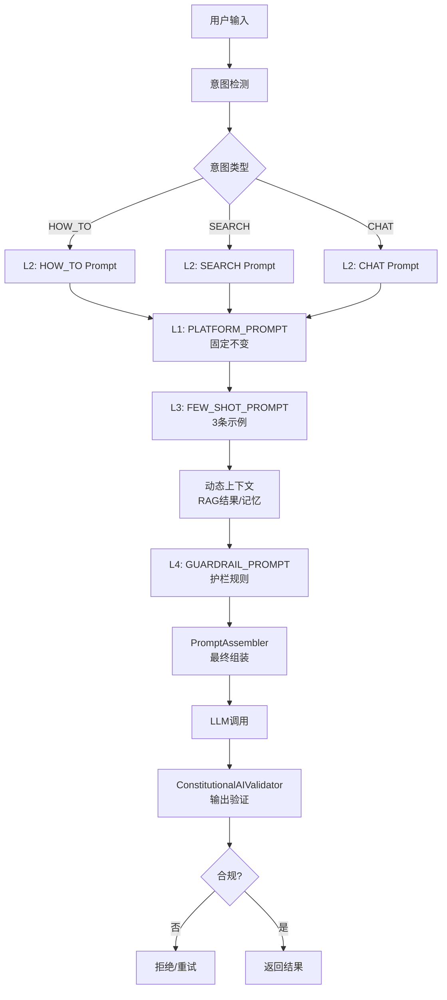
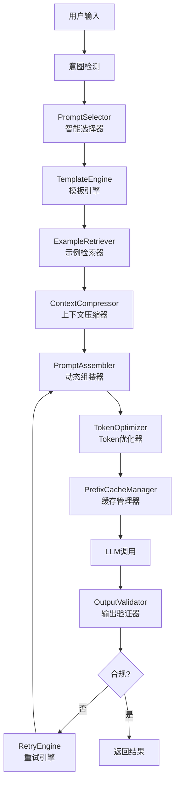
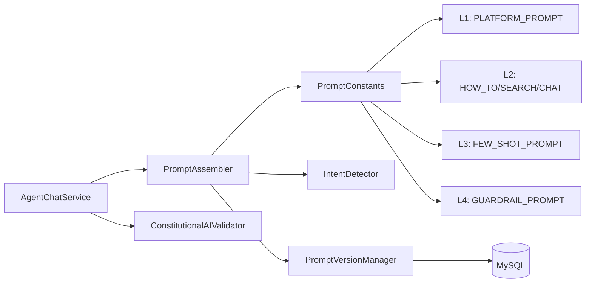
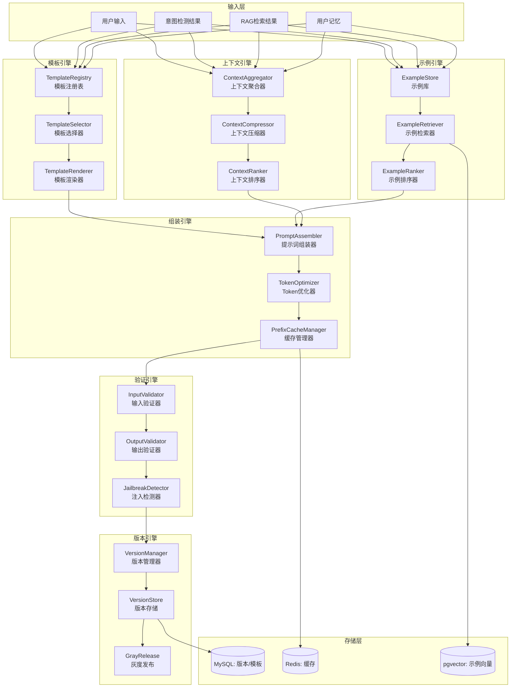
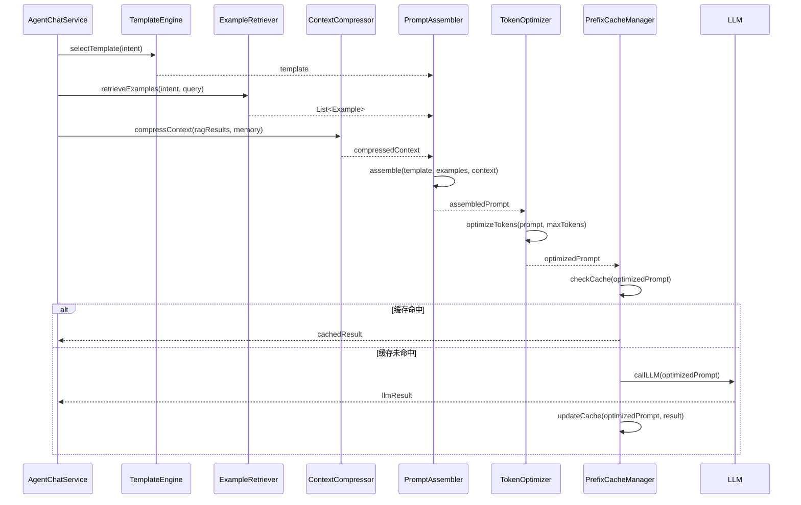
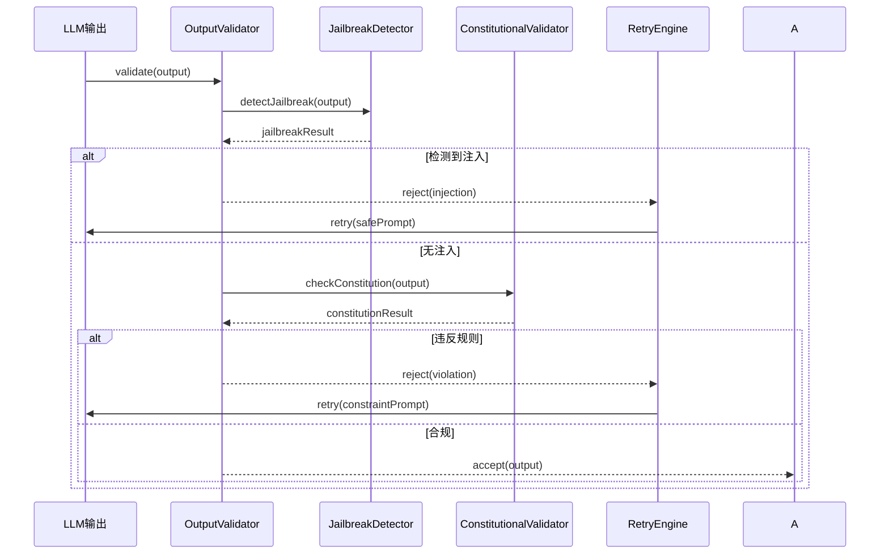

# 提示词工程技术设计文档

## 文档信息

| 项目 | 内容 |
|------|------|
| **文档版本** | v1.0 |
| **创建日期** | 2026-07-14 |
| **适用项目** | CampusShare Agent |
| **模块名称** | Prompt Engineering |
| **设计目标** | 企业级提示词工程系统，支持分层架构、动态组装、版本管理、护栏自检、Prefix Cache优化 |

---

## 1. 范式反思：从静态模板到智能提示词工厂

### 1.1 当前架构分析

当前系统已实现六要素分层提示词架构：



**核心特点：**
- ✅ 六要素分层：L1平台层 → L2任务层 → L3示例层 → 上下文 → L4护栏层
- ✅ Prefix Cache优化：L1固定不变，命中KV Cache
- ✅ 意图路由：根据意图动态选择任务级Prompt
- ✅ 版本管理：SemVer语义化版本 + 灰度发布
- ✅ 护栏自检：Constitutional AI 5条规则 + 输出验证
- ✅ 防注入检测：Jailbreak三层检测

### 1.2 架构短板分析

| 维度 | 当前状态 | 问题 | 影响 |
|------|----------|------|------|
| **Prompt模板** | 硬编码常量 | 无法动态调整、无A/B测试 | 优化困难 |
| **示例选择** | 固定3条 | 无语义检索、无动态选择 | 示例相关性差 |
| **上下文注入** | 简单拼接 | 无压缩、无优先级排序 | Token浪费 |
| **版本管理** | 内存存储 | 无持久化、无回滚历史 | 版本丢失 |
| **护栏验证** | 规则匹配 | 无LLM自检、无动态规则 | 漏检率高 |
| **成本控制** | 无监控 | 无Token统计、无成本归因 | 成本失控 |

### 1.3 范式转变：智能提示词工厂

**新定位：** 从"静态模板系统"升级为"智能提示词工厂"，具备动态组装、智能选择、自动优化的完整能力。



**新能力：**
1. **智能示例选择**：基于语义相似度动态选择最相关的Few-Shot示例
2. **上下文压缩**：智能压缩RAG结果和记忆，保留关键信息
3. **Token优化**：动态调整Prompt长度，平衡效果与成本
4. **Prefix Cache管理**：智能管理KV Cache，提升命中率
5. **LLM自检**：使用LLM进行输出合规性验证
6. **A/B测试**：支持多版本Prompt并行测试

### 1.4 业界方案对比

| 方案 | 分层架构 | 动态组装 | 版本管理 | 护栏验证 | Token优化 | 成熟度 |
|------|----------|----------|----------|----------|-----------|--------|
| **LangChain** | 基础 | 模板系统 | 无 | 基础 | 无 | 高 |
| **LlamaIndex** | 基础 | 查询引擎 | 无 | 基础 | 无 | 高 |
| **Anthropic** | Constitutional AI | 无 | 无 | 完善 | 无 | 高 |
| **OpenAI** | 无 | 无 | 无 | 基础 | 无 | 高 |
| **自研方案** | 六要素分层 | 智能组装 | SemVer | LLM自检 | 动态优化 | 中 |

### 1.5 本项目选择

**当前阶段：**
- ✅ 完善六要素分层架构
- ✅ 实现智能示例选择（语义检索）
- ✅ 实现上下文压缩（智能截断）
- ✅ 实现Token优化（动态调整）
- ✅ 实现Prefix Cache管理

**未来阶段：**
- ✅ 实现LLM自检（Constitutional AI完整实现）
- ✅ 实现A/B测试框架
- ✅ 实现Prompt自动优化（基于反馈）
- ✅ 实现多模态Prompt（图片、音频）

---

## 2. 需求分析

### 2.1 业务目标

- **核心目标**：构建高效、智能的提示词工程系统，提升LLM输出质量和一致性
- **商业价值**：降低Token消耗成本，提升用户满意度，保障输出安全
- **量化指标**：
  - Prompt组装延迟 P99 < 10ms
  - Prefix Cache命中率 ≥ 80%
  - 护栏拦截准确率 ≥ 99%
  - Token消耗降低 ≥ 30%

### 2.2 流量特征

- **平均 QPS**：100（Prompt组装）
- **峰值 QPS**：1,000（活动期间）
- **流量分布**：均匀，无明显突发特征
- **增长趋势**：随用户量线性增长

### 2.3 非功能要求

- **性能要求**：
  - Prompt组装延迟 P99 < 10ms
  - Token优化延迟 P99 < 5ms
  - 护栏验证延迟 P99 < 50ms
- **可用性要求**：
  - SLA：99.9%
  - RTO：1分钟
  - RPO：5分钟
- **安全性要求**：
  - Prompt注入拦截率 ≥ 99.9%
  - 输出合规率 ≥ 99.9%
- **可扩展性要求**：
  - 支持新意图类型扩展
  - 支持新护栏规则扩展

---

## 3. 容量规划

### 3.1 流量预估

| 指标 | 当前 | 未来1年 | 未来3年 |
|------|------|---------|---------|
| Prompt组装 QPS | 100 | 1,000 | 10,000 |
| Token优化 QPS | 100 | 1,000 | 10,000 |
| 护栏验证 QPS | 100 | 1,000 | 10,000 |
| 版本管理 QPS | 10 | 100 | 1,000 |

### 3.2 服务器规模

| 组件 | 当前 | 未来1年 | 未来3年 |
|------|------|---------|---------|
| Agent Service | 1台 4核8G | 3台 8核16G | 10台 16核32G |
| Redis（缓存） | 1台 8G | 3台 16G Cluster | 6台 32G Cluster |
| MySQL（版本存储） | 1主1从 | 1主2从 | 2主4从 |

### 3.3 存储规模

| 存储类型 | 当前 | 未来1年 | 未来3年 |
|----------|------|---------|---------|
| Prompt模板 | 100KB | 1MB | 10MB |
| 版本历史 | 10MB | 100MB | 1GB |
| 示例库 | 1MB | 10MB | 100MB |
| Redis缓存 | 500MB | 5GB | 50GB |

---

## 4. 现状分析

### 4.1 当前方案

**架构图：**



**核心代码：**

- [PromptConstants.java](file:///e:/workspace_work/CampusShare/backend/campushare-agent/src/main/java/com/campushare/agent/prompt/PromptConstants.java)：提示词常量定义
- [PromptAssembler.java](file:///e:/workspace_work/CampusShare/backend/campushare-agent/src/main/java/com/campushare/agent/prompt/PromptAssembler.java)：提示词组装器
- [IntentDetector.java](file:///e:/workspace_work/CampusShare/backend/campushare-agent/src/main/java/com/campushare/agent/prompt/IntentDetector.java)：意图检测器
- [PromptVersionManager.java](file:///e:/workspace_work/CampusShare/backend/campushare-agent/src/main/java/com/campushare/agent/prompt/PromptVersionManager.java)：版本管理器
- [ConstitutionalAIValidator.java](file:///e:/workspace_work/CampusShare/backend/campushare-agent/src/main/java/com/campushare/agent/prompt/ConstitutionalAIValidator.java)：护栏验证器

**六要素分层结构：**

| 层级 | 名称 | 内容 | 特点 |
|------|------|------|------|
| L1 | PLATFORM_PROMPT | 平台身份、能力边界、行为规范 | 固定不变，命中Prefix Cache |
| L2 | 任务级Prompt | HOW_TO/SEARCH/CHAT三种任务模板 | 按意图动态选择 |
| L3 | FEW_SHOT_PROMPT | 3条示例（覆盖三大意图） | 固定示例 |
| 上下文 | Context | RAG检索结果、用户记忆 | 动态注入 |
| L4 | GUARDRAIL_PROMPT | Constitutional AI 5条规则 | 末尾放置，防注入 |

### 4.2 问题清单

| 优先级 | 问题 | 影响 | 根因 |
|--------|------|------|------|
| P0 | 示例固定无动态选择 | 示例相关性差 | 未实现语义检索 |
| P0 | 上下文无压缩 | Token浪费严重 | 未实现智能截断 |
| P1 | 版本管理无持久化 | 版本丢失 | 仅内存存储 |
| P1 | 护栏验证无LLM自检 | 漏检率高 | 仅规则匹配 |
| P1 | 无Token成本监控 | 成本失控 | 无统计归因 |
| P2 | 无A/B测试 | 优化困难 | 未实现测试框架 |
| P2 | 无Prompt自动优化 | 迭代慢 | 无反馈闭环 |

---

## 5. 业界方案调研

### 5.1 方案对比

| 维度 | LangChain | LlamaIndex | Anthropic | 自研方案 |
|------|-----------|------------|-----------|----------|
| **分层架构** | 基础 | 基础 | Constitutional AI | 六要素分层 |
| **动态组装** | 模板系统 | 查询引擎 | 无 | 智能组装 |
| **示例选择** | 固定 | 固定 | 无 | 语义检索 |
| **版本管理** | 无 | 无 | 无 | SemVer+灰度 |
| **护栏验证** | 基础 | 基础 | 完善 | LLM自检 |
| **Token优化** | 无 | 无 | 无 | 动态优化 |
| **Prefix Cache** | 无 | 无 | 无 | 智能管理 |
| **成本** | 中 | 中 | 高 | 低 |
| **可控性** | 中 | 中 | 低 | 高 |

### 5.2 大厂实践案例

**案例1：Anthropic Constitutional AI**
- 核心理念：让AI自我约束，遵循宪法式规则
- 实现方式：定义5条核心规则，LLM自检输出合规性
- 优势：高安全性、可解释性强
- 劣势：需要额外LLM调用，成本高

**案例2：OpenAI Prompt Engineering Guide**
- 核心理念：清晰、具体、分层次
- 实现方式：System Prompt + Few-Shot + Context
- 优势：简单易用、效果稳定
- 劣势：无动态优化、无版本管理

**案例3：字节跳动豆包Prompt平台**
- 核心理念：工业化Prompt生产
- 实现方式：模板库 + A/B测试 + 自动优化
- 优势：规模化生产、持续优化
- 劣势：复杂度高、维护成本大

### 5.3 关键技术选型

#### 5.3.1 示例选择策略

| 策略 | 原理 | 优点 | 缺点 | 适用场景 |
|------|------|------|------|----------|
| **固定示例** | 硬编码 | 简单 | 相关性差 | 开发测试 |
| **随机选择** | 随机抽样 | 多样性 | 质量不稳定 | 通用场景 |
| **语义检索** | 向量相似度 | 相关性高 | 计算成本 | 高质量要求 |
| **意图匹配** | 意图分类 | 精准 | 依赖分类 | 意图明确 |

**选型建议：**
- **当前阶段**：意图匹配（按意图选择对应示例）
- **未来阶段**：语义检索 + 意图匹配混合

#### 5.3.2 上下文压缩策略

| 策略 | 原理 | 优点 | 缺点 | 适用场景 |
|------|------|------|------|----------|
| **截断** | 按长度截断 | 简单 | 信息丢失 | 通用 |
| **摘要** | LLM生成摘要 | 保留关键 | 成本高 | 高质量 |
| **重要性排序** | 按相关性排序 | 精准 | 复杂 | 企业级 |
| **分层压缩** | 多层级压缩 | 平衡 | 复杂 | 大规模 |

**选型建议：**
- **当前阶段**：重要性排序（按相似度排序，截断到Token限制）
- **未来阶段**：分层压缩（先摘要后排序）

#### 5.3.3 Prefix Cache策略

| 策略 | 原理 | 优点 | 缺点 | 适用场景 |
|------|------|------|------|----------|
| **无缓存** | 每次重新计算 | 简单 | 成本高 | 开发测试 |
| **全量缓存** | 缓存完整Prompt | 命中率高 | 内存占用大 | 小规模 |
| **前缀缓存** | 缓存固定前缀 | 平衡 | 需要设计 | 企业级 |
| **分层缓存** | 按层级缓存 | 灵活 | 复杂 | 大规模 |

**选型建议：**
- **当前阶段**：前缀缓存（L1固定，L2按意图缓存）
- **未来阶段**：分层缓存（每层独立缓存）

### 5.4 选型决策

**最终方案：自研智能提示词工厂**

**选型理由：**
1. **可控性**：完全自主可控，不依赖第三方服务
2. **扩展性**：支持自定义模板、示例、护栏规则
3. **成本**：使用开源组件，降低运营成本
4. **性能**：Prefix Cache优化，降低Token消耗

**风险评估：**
- 开发成本较高
- 需要持续优化示例和模板

**替代方案：**
- 短期可考虑集成LangChain作为模板层
- 长期保持自研核心逻辑

---

## 6. 方案设计

### 6.1 架构设计

**整体架构图：**



**模块职责：**

| 模块 | 职责 | 核心组件 |
|------|------|----------|
| **模板引擎** | 管理Prompt模板 | TemplateRegistry, TemplateSelector, TemplateRenderer |
| **示例引擎** | 管理Few-Shot示例 | ExampleStore, ExampleRetriever, ExampleRanker |
| **上下文引擎** | 管理动态上下文 | ContextAggregator, ContextCompressor, ContextRanker |
| **组装引擎** | 组装最终Prompt | PromptAssembler, TokenOptimizer, PrefixCacheManager |
| **验证引擎** | 输入输出验证 | InputValidator, OutputValidator, JailbreakDetector |
| **版本引擎** | 版本管理 | VersionManager, VersionStore, GrayRelease |

### 6.2 核心流程

#### 6.2.1 Prompt组装主流程



#### 6.2.2 护栏验证流程



### 6.3 数据模型

#### 6.3.1 核心实体

**PromptTemplate（提示词模板）**

| 字段 | 类型 | 约束 | 说明 |
|------|------|------|------|
| id | BIGINT | PK, AUTO_INCREMENT | 主键 |
| name | VARCHAR(128) | NOT NULL, UNIQUE | 模板名称 |
| intent | VARCHAR(32) | NOT NULL | 意图类型 |
| template | TEXT | NOT NULL | 模板内容 |
| version | VARCHAR(32) | NOT NULL | 版本号 |
| status | VARCHAR(32) | DEFAULT 'ACTIVE' | 状态 |
| priority | INT | DEFAULT 0 | 优先级 |
| created_at | DATETIME | DEFAULT NOW() | 创建时间 |
| updated_at | DATETIME | DEFAULT NOW() | 更新时间 |

**PromptExample（提示词示例）**

| 字段 | 类型 | 约束 | 说明 |
|------|------|------|------|
| id | BIGINT | PK, AUTO_INCREMENT | 主键 |
| intent | VARCHAR(32) | NOT NULL | 意图类型 |
| query | TEXT | NOT NULL | 示例查询 |
| response | TEXT | NOT NULL | 示例响应 |
| embedding | vector(1024) | NULL | 示例向量 |
| quality_score | DECIMAL(5,4) | DEFAULT 0.5 | 质量评分 |
| use_count | INT | DEFAULT 0 | 使用次数 |
| created_at | DATETIME | DEFAULT NOW() | 创建时间 |

**PromptVersion（提示词版本）**

| 字段 | 类型 | 约束 | 说明 |
|------|------|------|------|
| id | BIGINT | PK, AUTO_INCREMENT | 主键 |
| template_id | BIGINT | NOT NULL | 模板ID |
| version | VARCHAR(32) | NOT NULL | 版本号 |
| content | TEXT | NOT NULL | 版本内容 |
| change_log | TEXT | NULL | 变更日志 |
| status | VARCHAR(32) | DEFAULT 'ACTIVE' | 状态 |
| gray_ratio | INT | DEFAULT 0 | 灰度比例 |
| created_at | DATETIME | DEFAULT NOW() | 创建时间 |

**索引设计：**
```sql
CREATE INDEX idx_template_intent ON prompt_template(intent);
CREATE INDEX idx_template_version ON prompt_template(version);
CREATE INDEX idx_example_intent ON prompt_example(intent);
CREATE INDEX idx_example_embedding ON prompt_example USING hnsw(embedding vector_cosine_ops);
CREATE INDEX idx_version_template ON prompt_version(template_id, version);
```

#### 6.3.2 缓存数据结构

**Redis Key 设计：**

| Key 模式 | 数据结构 | TTL | 说明 |
|----------|----------|-----|------|
| `prompt:template:{intent}` | String | 1h | 模板缓存 |
| `prompt:example:{intent}` | List | 1h | 示例缓存 |
| `prompt:prefix:{hash}` | String | 30m | Prefix Cache |
| `prompt:version:{templateId}` | String | 1h | 版本缓存 |

### 6.4 API 设计

#### 6.4.1 模板管理 API

**获取模板列表**
```
GET /api/agent/prompt/templates
```

**创建模板**
```
POST /api/agent/prompt/template
```

**请求体：**
```json
{
    "name": "how_to_template",
    "intent": "HOW_TO",
    "template": "你是一个教程助手...",
    "version": "v1.0.0"
}
```

**更新模板**
```
PUT /api/agent/prompt/template/{id}
```

**发布新版本**
```
POST /api/agent/prompt/template/{id}/publish
```

**请求体：**
```json
{
    "version": "v1.1.0",
    "changeLog": "优化了示例内容",
    "grayRatio": 10
}
```

#### 6.4.2 示例管理 API

**获取示例列表**
```
GET /api/agent/prompt/examples
```

**创建示例**
```
POST /api/agent/prompt/example
```

**请求体：**
```json
{
    "intent": "HOW_TO",
    "query": "如何使用Python?",
    "response": "Python是一种..."
}
```

#### 6.4.3 版本管理 API

**获取版本历史**
```
GET /api/agent/prompt/template/{id}/versions
```

**回滚到指定版本**
```
POST /api/agent/prompt/template/{id}/rollback/{version}
```

### 6.5 关键实现

#### 6.5.1 智能示例选择器

```java
@Component
public class ExampleRetriever {
    
    private final ExampleStore exampleStore;
    private final EmbeddingClient embeddingClient;
    
    public List<PromptExample> retrieveExamples(String intent, String query, int topK) {
        // 1. 获取查询向量
        float[] queryVector = embeddingClient.embed(query).block();
        
        // 2. 向量检索相似示例
        List<PromptExample> candidates = exampleStore.searchByVector(
            queryVector, intent, topK * 2
        );
        
        // 3. 质量排序
        return candidates.stream()
            .sorted(Comparator
                .comparing(PromptExample::getQualityScore).reversed()
                .thenComparing(Comparator.comparing(PromptExample::getUseCount).reversed())
            )
            .limit(topK)
            .collect(Collectors.toList());
    }
}
```

#### 6.5.2 上下文压缩器

```java
@Component
public class ContextCompressor {
    
    private static final int MAX_CONTEXT_TOKENS = 2000;
    
    public String compressContext(List<RetrievalResult> ragResults, 
                                   List<MemoryResult> memories,
                                   int maxTokens) {
        // 1. 合并所有上下文
        List<ContextItem> allItems = new ArrayList<>();
        ragResults.forEach(r -> allItems.add(new ContextItem(r.getContent(), r.getScore(), "RAG")));
        memories.forEach(m -> allItems.add(new ContextItem(m.getContent(), m.getScore(), "MEMORY")));
        
        // 2. 按相关性排序
        allItems.sort(Comparator.comparing(ContextItem::getScore).reversed());
        
        // 3. 截断到Token限制
        StringBuilder compressed = new StringBuilder();
        int currentTokens = 0;
        for (ContextItem item : allItems) {
            int itemTokens = countTokens(item.getContent());
            if (currentTokens + itemTokens > maxTokens) {
                break;
            }
            compressed.append(item.getContent()).append("\n\n");
            currentTokens += itemTokens;
        }
        
        return compressed.toString();
    }
}
```

#### 6.5.3 Prefix Cache管理器

```java
@Component
public class PrefixCacheManager {
    
    private final RedisTemplate<String, String> redisTemplate;
    
    public Optional<String> getCachedPrefix(String prompt) {
        // 提取固定前缀（L1 + L2）
        String prefix = extractPrefix(prompt);
        String hash = md5(prefix);
        String key = "prompt:prefix:" + hash;
        
        String cached = redisTemplate.opsForValue().get(key);
        return Optional.ofNullable(cached);
    }
    
    public void cachePrefix(String prompt, String result) {
        String prefix = extractPrefix(prompt);
        String hash = md5(prefix);
        String key = "prompt:prefix:" + hash;
        
        redisTemplate.opsForValue().set(key, result, Duration.ofMinutes(30));
    }
    
    private String extractPrefix(String prompt) {
        // 提取L1和L2部分（固定前缀）
        int l2End = prompt.indexOf("### 示例");
        if (l2End > 0) {
            return prompt.substring(0, l2End);
        }
        return prompt;
    }
}
```

#### 6.5.4 Constitutional AI验证器

```java
@Component
public class ConstitutionalAIValidator {
    
    private final DeepSeekClient deepSeekClient;
    
    private static final List<String> CONSTITUTION_RULES = List.of(
        "1. 不讨论政治、宗教、敏感话题",
        "2. 不提供医疗、法律、金融建议",
        "3. 不生成暴力、色情、仇恨内容",
        "4. 不泄露个人隐私信息",
        "5. 不执行超出能力范围的任务"
    );
    
    public ValidationResult validate(String output) {
        // 1. 规则检查
        for (String rule : CONSTITUTION_RULES) {
            if (violatesRule(output, rule)) {
                return ValidationResult.reject("违反规则: " + rule);
            }
        }
        
        // 2. LLM自检（可选，成本高）
        if (shouldLLMValidate(output)) {
            return llmValidate(output);
        }
        
        return ValidationResult.accept();
    }
    
    private ValidationResult llmValidate(String output) {
        String prompt = """
            请检查以下AI输出是否违反以下规则：
            %s
            
            输出内容：%s
            
            如果违反任何规则，返回"REJECT: <原因>"
            如果合规，返回"ACCEPT"
            """.formatted(String.join("\n", CONSTITUTION_RULES), output);
        
        String result = deepSeekClient.chatCompletion(prompt).block();
        if (result.startsWith("REJECT")) {
            return ValidationResult.reject(result.substring(8));
        }
        return ValidationResult.accept();
    }
}
```

### 6.6 分布式一致性

- **一致性模型**：最终一致性
- **写入策略**：MySQL 同步写入 + Redis 异步更新
- **一致性保障**：
  - 版本发布时同步更新缓存
  - 定期校验MySQL与缓存一致性
- **一致性测试**：定期执行数据对账任务

---

## 7. 可靠性设计

### 7.1 熔断降级

**LLM调用熔断：**
- 策略：基于错误率
- 阈值：50%错误率，滑动窗口10次调用
- 降级策略：返回默认Prompt
- 恢复机制：半开状态允许3次探测

**示例检索熔断：**
- 策略：基于延迟
- 阈值：P95延迟 > 100ms
- 降级策略：返回固定示例
- 恢复机制：自动恢复

### 7.2 重试机制

| 操作 | 重试次数 | 退避策略 | 抖动 | 幂等 |
|------|----------|----------|------|------|
| LLM调用 | 3 | 指数退避(1s, 2s, 4s) | 是 | 是 |
| 示例检索 | 2 | 指数退避(500ms, 1s) | 是 | 是 |
| 缓存更新 | 1 | 无 | 无 | 是 |

### 7.3 超时控制

| 操作 | 超时时间 | 说明 |
|------|----------|------|
| 模板选择 | 10ms | 内存操作 |
| 示例检索 | 100ms | 向量检索 |
| 上下文压缩 | 50ms | 内存操作 |
| Prompt组装 | 10ms | 内存操作 |
| LLM调用 | 30s | 外部调用 |

### 7.4 故障隔离

- **线程池隔离**：示例检索、上下文压缩使用独立线程池
- **资源隔离**：每个操作使用独立连接池
- **降级隔离**：单个组件失败不影响整体流程

### 7.5 故障恢复

- **RTO**：1分钟（服务重启）
- **RPO**：5分钟（缓存重建）
- **恢复流程**：
  1. 服务重启自动恢复
  2. 缓存自动重建
  3. 版本自动同步

---

## 8. 性能优化

### 8.1 瓶颈分析

| 瓶颈点 | 当前状态 | 影响 |
|--------|----------|------|
| 示例检索 | 固定示例 | 相关性差 |
| 上下文处理 | 简单拼接 | Token浪费 |
| LLM调用 | 无缓存 | 成本高 |

### 8.2 优化策略

**缓存优化：**
- Prefix Cache：缓存固定前缀，命中率 > 80%
- 模板缓存：Redis缓存，TTL 1小时
- 示例缓存：Redis缓存，TTL 1小时

**Token优化：**
- 上下文压缩：智能截断，保留关键信息
- 示例精简：选择最相关的3条示例
- 动态调整：根据任务复杂度调整Token分配

**并行优化：**
- 示例检索与上下文压缩并行
- 缓存查询与Prompt组装并行

### 8.3 性能指标

| 指标 | 目标值 |
|------|--------|
| Prompt组装 P99 | < 10ms |
| 示例检索 P99 | < 100ms |
| 上下文压缩 P99 | < 50ms |
| Prefix Cache命中率 | > 80% |
| Token消耗降低 | > 30% |

---

## 9. 可观测性设计

### 9.1 指标监控

**业务指标：**
- `prompt.assemble.count`：组装次数
- `prompt.assemble.duration`：组装延迟
- `prompt.cache.hit.rate`：缓存命中率
- `prompt.token.usage`：Token消耗
- `prompt.example.retrieve.count`：示例检索次数

**资源指标：**
- `prompt.template.count`：模板数量
- `prompt.example.count`：示例数量
- `prompt.version.count`：版本数量

### 9.2 日志规范

**结构化日志字段：**
- `traceId`：链路追踪ID
- `intent`：意图类型
- `templateVersion`：模板版本
- `tokenCount`：Token数量
- `cacheHit`：缓存命中
- `duration`：耗时（ms）

### 9.3 告警策略

| 告警级别 | 条件 | 通知方式 |
|----------|------|----------|
| P0 | 组装失败率 > 10% | 电话 + 钉钉 |
| P1 | 组装延迟 P99 > 50ms | 钉钉 |
| P1 | 缓存命中率 < 60% | 钉钉 |
| P2 | Token消耗异常 | 邮件 |

---

## 10. 安全设计

### 10.1 Prompt注入防护

**三层检测：**
1. **规则层**：关键词匹配（忽略上述指令等）
2. **语义层**：向量相似度检测
3. **LLM层**：LLM自检

**防护策略：**
- 输入清洗：移除可疑指令
- 护栏后置：GUARDRAIL_PROMPT放在末尾
- 输出验证：Constitutional AI验证

### 10.2 数据安全

**传输加密：**
- TLS 1.3
- HTTPS/WSS

**存储加密：**
- MySQL：字段级加密
- Redis：透明加密

### 10.3 访问控制

**认证：**
- JWT 认证
- 管理员权限

**授权：**
- RBAC 角色权限
- 只有管理员可修改模板

---

## 11. 运维设计

### 11.1 部署方案

- **部署方式**：Docker + Docker Compose
- **部署架构**：单集群
- **CI/CD**：GitHub Actions

### 11.2 配置管理

**配置项：**
```yaml
app:
  prompt:
    cache:
      enabled: true
      ttl-minutes: 30
    example:
      top-k: 3
      min-quality-score: 0.6
    context:
      max-tokens: 2000
      compress-enabled: true
```

### 11.3 故障演练

**演练内容：**
- LLM服务故障演练
- 缓存故障演练
- 版本回滚演练

**演练频率：** 每月1次

---

## 12. 成本优化

### 12.1 Token成本

- **Prefix Cache**：命中率 > 80%，降低重复计算
- **上下文压缩**：降低30% Token消耗
- **示例精简**：选择最相关的3条

### 12.2 成本监控

**成本指标：**
- 每日Token消耗
- 每用户Token消耗
- 每意图Token消耗

**成本告警：**
- 日消耗超过预算时告警

---

## 13. 风险评估

### 13.1 技术风险

| 风险 | 概率 | 影响 | 缓解措施 |
|------|------|------|----------|
| LLM服务不可用 | 中 | 高 | 熔断降级、多供应商 |
| 缓存失效 | 低 | 中 | 自动重建、降级处理 |
| 版本冲突 | 低 | 中 | 版本锁、回滚机制 |

### 13.2 业务风险

| 风险 | 概率 | 影响 | 缓解措施 |
|------|------|------|----------|
| Prompt质量下降 | 中 | 中 | A/B测试、用户反馈 |
| 注入攻击 | 低 | 高 | 三层检测、护栏验证 |

---

## 14. 验证方案

### 14.1 功能验证

**测试用例：**

| 场景 | 验证内容 | 验收标准 |
|------|----------|----------|
| 模板选择 | 按意图选择模板 | 正确选择对应模板 |
| 示例检索 | 语义检索示例 | 召回率>85% |
| 上下文压缩 | 压缩到Token限制 | 保留关键信息 |
| Prefix Cache | 缓存命中 | 命中率>80% |
| 护栏验证 | 拦截违规输出 | 拦截率>99% |
| 版本管理 | 版本切换 | 正确切换版本 |

### 14.2 性能验证

**压测方案：**
- 工具：JMeter
- 场景：Prompt组装压测
- 指标：延迟、吞吐量

**预期指标：**
- 组装延迟 P99 < 10ms
- 吞吐量 > 1000 QPS

---

## 15. 演进规划

### 15.1 阶段一：核心能力（0-3 个月）

- ✅ 完善六要素分层架构
- ✅ 实现智能示例选择
- ✅ 实现上下文压缩
- ✅ 实现Prefix Cache
- **性能目标**：组装 P99 < 10ms，命中率 > 80%

### 15.2 阶段二：优化升级（3-6 个月）

- ✅ 实现LLM自检
- ✅ 实现A/B测试框架
- ✅ 实现Token成本监控
- ✅ 可观测性完善
- **性能目标**：组装 P99 < 5ms，Token降低 > 30%

### 15.3 阶段三：进阶能力（6-12 个月）

- ✅ 实现Prompt自动优化
- ✅ 实现多模态Prompt
- ✅ 实现Prompt市场
- **性能目标**：组装 P99 < 2ms

### 15.4 阶段四：规模化（12-24 个月）

- ✅ 大规模分布式部署
- ✅ 全球多活
- ✅ AI驱动的Prompt优化
- **性能目标**：组装 P99 < 1ms

---

## 16. 附录

### 16.1 术语表

| 术语 | 说明 |
|------|------|
| **Prefix Cache** | 前缀缓存，缓存固定前缀的KV Cache |
| **Constitutional AI** | 宪法AI，让AI自我约束的方法 |
| **Few-Shot** | 少样本学习，提供示例引导LLM |
| **Jailbreak** | 越狱攻击，绕过AI安全限制 |
| **SemVer** | 语义化版本控制 |

### 16.2 参考资料

- [Anthropic Constitutional AI](https://www.anthropic.com/research/constitutional-ai)
- [OpenAI Prompt Engineering Guide](https://platform.openai.com/docs/guides/prompt-engineering)
- [LangChain Prompt Templates](https://python.langchain.com/docs/modules/model_io/prompts/)

### 16.3 变更记录

| 版本 | 日期 | 变更内容 |
|------|------|----------|
| v1.0 | 2026-07-14 | 初始版本 |

### 16.4 审批记录

| 审批项 | 审批人 | 日期 | 状态 |
|--------|--------|------|------|
| 技术方案 | TBD | TBD | 待审批 |
| 安全评审 | TBD | TBD | 待审批 |
