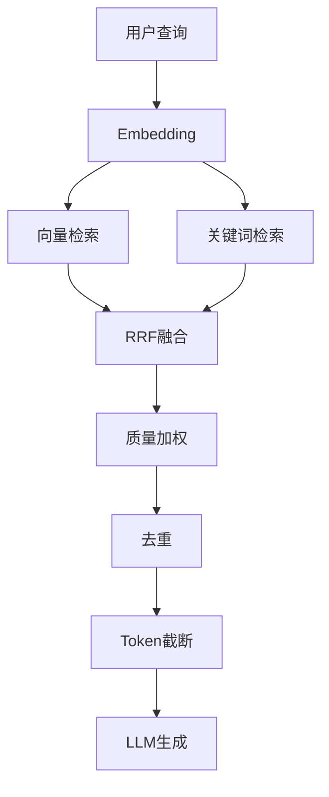
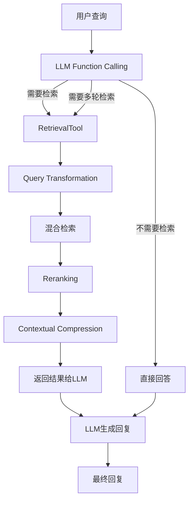
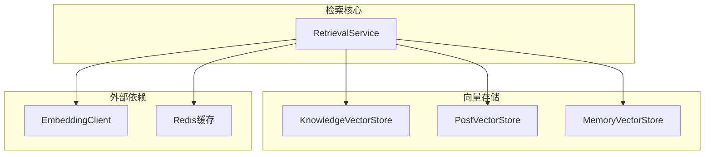
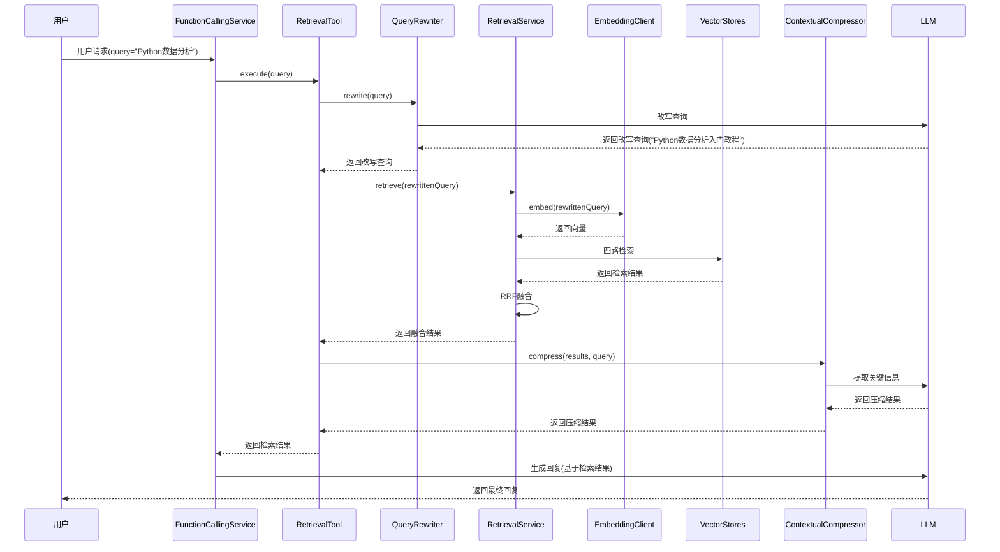
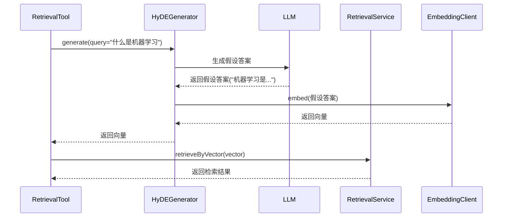
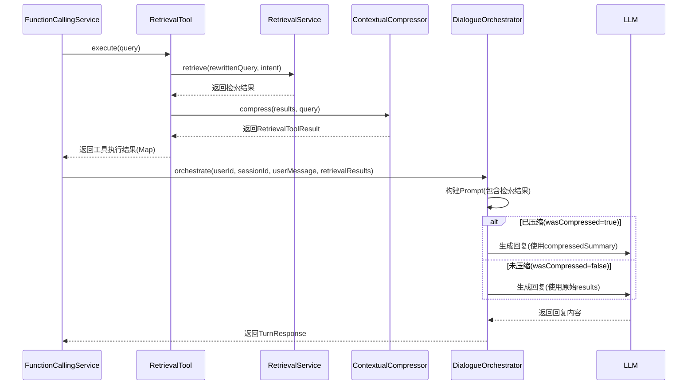
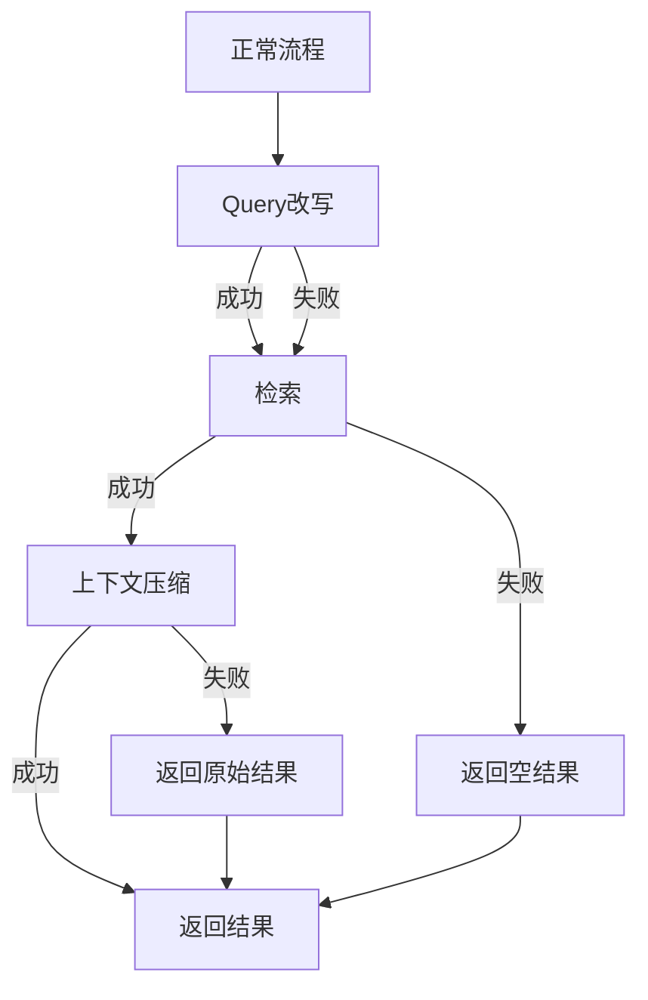
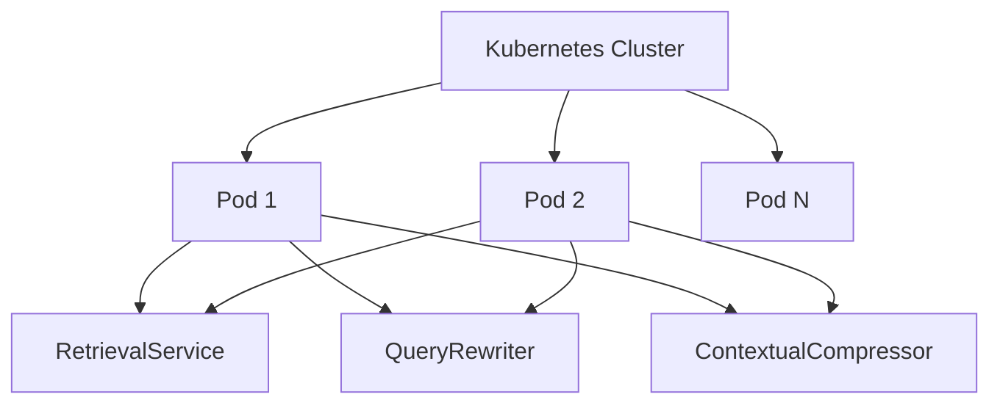
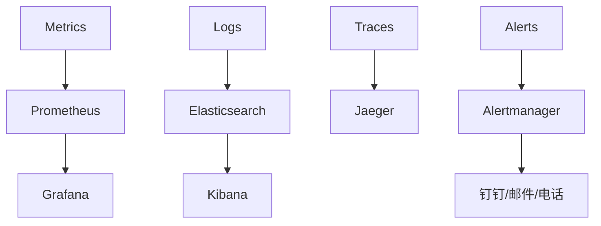

# Agent RAG 检索模块技术设计文档

## 文档信息

| 项目 | 内容 |
|------|------|
| **文档版本** | v1.0 |
| **创建日期** | 2026-07-14 |
| **适用项目** | CampusShare Agent |
| **模块名称** | RAG Retrieval |
| **设计目标** | 企业级自适应RAG系统，支持混合检索、重排序、查询改写、上下文压缩 |

---

## 1. 范式反思：从固定管线RAG到自适应RAG

### 1.1 当前架构分析

当前系统采用"固定管线"RAG架构：



**核心特点：**
- 固定流程：Embedding → 多路检索 → RRF融合 → 后处理 → LLM生成
- 意图驱动：根据Intent选择不同的检索配置（topK、来源配比）
- 四路检索：知识库向量 + 知识库关键词 + 帖子向量 + 帖子关键词
- CLARIFY支持：上一轮结果降权后加入RRF融合

### 1.2 企业级差距分析

| 缺失能力 | 影响 | 大厂实践 |
|----------|------|---------|
| **Query Transformation** | 原始查询质量差时检索效果不佳 | OpenAI、Anthropic均支持查询改写 |
| **Cross-Encoder Reranking** | 初始召回结果排序不够精准 | Cohere Rerank、Sentence-Transformers |
| **Contextual Compression** | 检索结果包含冗余信息，浪费Token | LangChain、Haystack支持 |
| **Sparse-Dense混合检索** | 仅用pg_trgm关键词，效果有限 | Elasticsearch BM25 + Dense向量 |
| **Self-RAG** | LLM无法自主决定是否检索、检索什么 | Meta Self-RAG论文方案 |
| **多轮检索** | 单次检索无法满足复杂问题 | LLM决定多次调用检索工具 |

### 1.3 现代范式：自适应RAG

**核心思想：** 在Function Calling架构下，RAG不再是固定管线步骤，而是LLM按需调用的工具。



**自适应能力：**
1. **检索决策**：LLM自主决定是否需要检索
2. **查询改写**：LLM生成更优的检索查询
3. **多轮检索**：LLM可以多次调用检索工具
4. **检索参数**：LLM指定检索范围、过滤条件

### 1.4 本项目的选择

**当前阶段：**
- ✅ 保留现有混合检索能力（四路检索 + RRF融合）
- ✅ 添加Query Transformation（基于LLM的查询改写）
- ✅ 添加Contextual Compression（检索后上下文压缩）
- ⚠️ 标注Cross-Encoder Reranking为Phase 2（需要新增模型依赖）

**未来阶段：**
- ✅ Self-RAG模式（LLM自主决策检索）
- ✅ 多轮检索支持（LLM多次调用）
- ✅ 语义缓存（减少重复检索）

---

## 2. 需求分析

### 2.1 业务目标

| 目标 | 描述 |
|------|------|
| **检索准确性** | 检索结果与用户查询高度相关 |
| **检索召回率** | 覆盖所有相关文档，不遗漏重要信息 |
| **上下文质量** | 检索结果格式规范，无冗余信息 |
| **Token效率** | 优化检索结果长度，节省LLM Token消耗 |
| **用户体验** | 回答有依据，可追溯来源 |
| **可扩展性** | 支持新增数据源、检索策略 |

### 2.2 流量特征

| 指标 | 当前值 | 目标值 |
|------|--------|--------|
| 检索请求量 | 75 QPS | 7500 QPS |
| Embedding调用量 | 75 QPS | 7500 QPS |
| 知识库文档数 | 100 | 10000 |
| 帖子数 | 10000 | 1000万 |
| 平均检索延迟 | 500ms | 300ms |

### 2.3 非功能要求

| 要求 | 值 |
|------|-----|
| P99延迟 | < 800ms |
| 检索准确率 | > 85%（基于Eval测试集） |
| 召回率 | > 90% |
| Token节省 | > 30%（通过上下文压缩） |
| 可用性 | 99.99% |

### 2.4 合规要求

| 要求 | 说明 |
|------|------|
| 数据隐私 | 检索结果不包含敏感信息 |
| 来源追溯 | 每个检索结果记录来源 |
| 内容审核 | 检索结果经过敏感内容过滤 |

---

## 3. 容量规划

### 3.1 数据规模

| 数据源 | 当前规模 | 1年目标 | 3年目标 |
|--------|---------|--------|--------|
| 知识库文档 | 100篇 | 1000篇 | 10000篇 |
| 知识库分块 | 500个 | 10000个 | 100万个 |
| 帖子 | 10000条 | 100万条 | 1000万条 |
| 用户记忆 | 0条 | 10万条 | 1000万条 |

### 3.2 存储规模

| 存储类型 | 估算大小 | 存储方案 |
|----------|---------|---------|
| 向量数据 | 50GB → 5TB | PostgreSQL + pgvector |
| Embedding缓存 | 1GB → 10GB | Redis |
| 检索结果缓存 | 500MB → 5GB | Redis + Caffeine |

### 3.3 缓存容量

| 缓存类型 | 条目数 | 内存需求 | TTL |
|----------|--------|---------|-----|
| Embedding缓存 | 100万 | 5GB | 1天 |
| 检索结果缓存 | 10万 | 2GB | 5分钟 |
| Query改写缓存 | 10万 | 1GB | 1小时 |

### 3.4 服务器规模

| 阶段 | PostgreSQL | Redis | Embedding服务 |
|------|-----------|-------|--------------|
| 当前 | 1台 | 1台 | 第三方 |
| 1年 | 3台（主从） | 3台（Cluster） | 第三方/自建 |
| 3年 | 6台（HA） | 12台（Cluster） | 自建 |

---

## 4. 现状分析

### 4.1 当前方案

**核心组件：**

| 组件 | 职责 | 评估 |
|------|------|------|
| RetrievalService | 混合检索核心，四路检索+RRF融合 | 保留，扩展Query Transformation |
| KnowledgeVectorStore | 知识库向量存储 | 保留，优化索引 |
| PostVectorStore | 帖子向量存储 | 保留，优化索引 |
| MemoryVectorStore | 用户记忆向量存储 | 保留，集成到检索流程 |
| EmbeddingClient | Embedding API客户端 | 保留，优化批处理 |

**当前架构图：**



### 4.2 问题清单

| 优先级 | 问题 | 影响 | 建议 |
|--------|------|------|------|
| P0 | 缺少Query Transformation | 查询质量差时检索效果差 | 添加LLM查询改写 |
| P0 | 缺少Contextual Compression | 检索结果冗余，浪费Token | 添加上下文压缩 |
| P1 | 缺少Cross-Encoder Reranking | 初始召回排序不够精准 | Phase 2添加 |
| P1 | 查询向量未缓存 | 相同查询重复Embedding | 添加Embedding缓存 |
| P2 | 未集成MemoryVectorStore | 用户记忆未参与检索 | 集成到检索流程 |
| P2 | 缺少语义缓存 | 相同语义查询重复检索 | 添加语义缓存 |

---

## 5. 业界方案调研

### 5.1 RAG架构模式对比

| 模式 | 原理 | 优势 | 劣势 | 适用场景 |
|------|------|------|------|----------|
| **Pipeline RAG** | 固定流程：检索→生成 | 简单可靠 | 不灵活，无法适应复杂查询 | MVP |
| **Self-RAG** | LLM自主决定是否检索 | 自适应，减少不必要检索 | 增加LLM调用成本 | 企业级 |
| **Adaptive RAG** | 根据查询类型动态调整检索策略 | 精准匹配，效果最优 | 实现复杂 | 企业级 |
| **Multi-stage RAG** | 检索→重排序→压缩→生成 | 效果最佳 | 延迟较高 | 对质量要求极高 |

### 5.2 查询改写方案对比

| 方案 | 原理 | 优势 | 劣势 |
|------|------|------|------|
| **LLM改写** | LLM生成优化查询 | 效果最好，支持复杂改写 | 增加LLM调用成本 |
| **HyDE** | 生成假设文档再检索 | 提升抽象概念检索 | 需要两次Embedding |
| **查询扩展** | 同义词/相关词扩展 | 简单有效 | 可能引入噪声 |

### 5.3 重排序方案对比

| 方案 | 原理 | 优势 | 劣势 |
|------|------|------|------|
| **Cross-Encoder** | 预训练模型精排 | 效果最好 | 计算成本高，延迟高 |
| **Bi-Encoder** | 双向编码后相似度 | 速度快 | 效果不如Cross-Encoder |
| **RRF** | 基于排名的融合 | 简单有效，无训练成本 | 依赖初始排名质量 |

### 5.4 上下文压缩方案对比

| 方案 | 原理 | 优势 | 劣势 |
|------|------|------|------|
| **LLM摘要** | LLM提取关键信息 | 效果最好 | 增加LLM调用成本 |
| **TextRank** | 基于图的关键词提取 | 无额外成本 | 效果有限 |
| **滑动窗口** | 截取相关片段 | 简单高效 | 可能丢失上下文 |

### 5.5 大厂实践案例

| 公司 | 方案 | 特点 |
|------|------|------|
| **OpenAI** | LLM改写 + Reranking | GPT-4支持查询改写，Cohere Rerank精排 |
| **Anthropic** | Tool Use + 自适应检索 | Claude决定是否调用检索工具 |
| **Google** | Multi-stage RAG | Gemini支持多阶段检索优化 |
| **Meta** | Self-RAG | LLM自主决定检索策略 |
| **字节跳动** | 查询改写 + 多路检索 | 大规模向量检索优化 |

---

## 6. 方案设计

### 6.1 架构设计

**新架构：**

```mermaid
flowchart TB
    subgraph 输入层
        A[用户查询]
    end
    
    subgraph Query Transformation层<br/>Phase 1
        B[QueryRewriter]
        C[HyDEGenerator]:::phase2
        D[QueryExpander]
    end
    
    subgraph 检索核心层<br/>Phase 1
        E[RetrievalService]
        F[KnowledgeVectorStore]
        G[PostVectorStore]
        H[MemoryVectorStore]
    end
    
    subgraph 后处理层
        I[RerankingService]:::phase2
        J[ContextualCompressor]:::phase1
        K[DedupService]:::phase1
        L[TokenBudgetManager]:::phase1
    end
    
    subgraph 缓存层
        M[EmbeddingCache]:::phase1
        N[RetrievalCache]:::phase1
        O[SemanticCache]:::phase2
    end
    
    A --> B
    B -->|改写后查询| E
    B -->|需要HyDE| C
    C --> E
    B -->|需要扩展| D
    D --> E
    E --> F
    E --> G
    E --> H
    E --> M
    E --> N
    E --> O
    E -->|检索结果| I
    I --> J
    J --> K
    K --> L
    L -->|最终结果| P[LLM生成]
    
    classDef phase1 fill:#90EE90,stroke:#333,stroke-width:2px
    classDef phase2 fill:#FFDAB9,stroke:#333,stroke-width:2px
```

**图例：**
| 颜色 | Phase | 说明 |
|------|-------|------|
| 绿色 | Phase 1 | 当前阶段实现 |
| 橙色 | Phase 2 | 下一阶段实现 |

**模块职责：**

| 模块 | 职责 | Phase | 说明 |
|------|------|-------|------|
| QueryRewriter | 查询改写 | 1 | LLM生成更优的检索查询 |
| HyDEGenerator | 假设文档生成 | 2 | 生成假设答案再检索 |
| QueryExpander | 查询扩展 | 1 | 同义词/相关词扩展 |
| RetrievalService | 检索核心 | 1 | 混合检索、RRF融合 |
| RerankingService | 重排序 | 2 | Cross-Encoder精排 |
| ContextualCompressor | 上下文压缩 | 1 | LLM提取关键信息 |
| DedupService | 去重 | 1 | 跨源去重、内容去重 |
| TokenBudgetManager | Token管理 | 1 | 按预算截断检索结果 |
| EmbeddingCache | Embedding缓存 | 1 | Redis缓存查询向量 |
| RetrievalCache | 检索结果缓存 | 1 | Redis + Caffeine缓存 |
| SemanticCache | 语义缓存 | 2 | 相似查询复用结果 |

### 6.2 核心流程

**流程一：完整检索流程**



**流程二：HyDE检索流程**



### 6.3 数据模型

**Query改写结果：**

```java
@Data
@Builder
public class QueryRewriteResult {
    private String originalQuery;
    private String rewrittenQuery;
    private String hydeDocument;
    private List<String> expandedTerms;
    private boolean needsHyde;
    private boolean needsExpansion;
    private double confidence;
}
```

**检索结果（扩展）：**

```java
@Data
@Builder
public class RetrievalResult {
    private String id;
    private String title;
    private String content;
    private double score;
    private Source source;
    private Map<String, Object> metadata;
    private String compressedContent;
    private double relevanceScore;
    private String rerankedBy;
}
```

**检索配置（扩展）：**

```java
@Data
@Builder
public class RetrievalConfig {
    private int knowledgeTopK;
    private int knowledgeKeywordTopK;
    private int postTopK;
    private int postKeywordTopK;
    private int memoryTopK;
    private int rerankTopK;
    private double similarityThreshold;
    private int tokenBudget;
    private boolean usePostKeyword;
    private IntentResult.SlotResult slots;
}
```

**检索工具返回结果：**

```java
@Data
@Builder
public class RetrievalToolResult {
    private List<RetrievalResult> results;
    private String compressedSummary;
    private int totalResults;
    private int totalTokens;
    private boolean wasCompressed;
    private String rewriteQuery;
}
```

### 6.4 API设计

**检索工具接口（供Function Calling调用）：**

| 方法 | 参数 | 描述 |
|------|------|------|
| retrieve | query, topK, filter, useHyde | 执行检索 |
| retrieveByVector | vector, topK, filter | 按向量检索 |
| searchKnowledge | query, topK | 仅检索知识库 |
| searchPosts | query, topK, school, category | 仅检索帖子 |
| searchMemory | userId, query, topK | 检索用户记忆 |

**Query改写接口：**

| 方法 | 参数 | 描述 |
|------|------|------|
| rewrite | query, options | 改写查询 |
| generateHyde | query | 生成假设文档 |
| expandQuery | query | 扩展查询 |

**检索配置接口：**

| 方法 | 参数 | 描述 |
|------|------|------|
| getConfig | intent | 获取意图对应的检索配置 |
| updateConfig | config | 更新检索配置 |

### 6.5 关键实现

#### 6.5.1 QueryRewriter（查询改写）

**选择性改写策略：**
- 短查询（< 10字符）：跳过改写，直接使用原始查询
- 高置信度查询（意图分类置信度 > 0.9）：跳过改写
- 复杂查询（包含多义词、歧义词、抽象概念）：触发LLM改写
- 缓存命中：直接返回缓存结果

```java
@Service
public class QueryRewriter {

    private final DeepSeekClient deepSeekClient;
    private final StringRedisTemplate redisTemplate;
    private final Duration cacheTtl = Duration.ofHours(1);
    private static final int SHORT_QUERY_THRESHOLD = 10;
    private static final double HIGH_CONFIDENCE_THRESHOLD = 0.9;

    public Mono<QueryRewriteResult> rewrite(String query) {
        return rewrite(query, HIGH_CONFIDENCE_THRESHOLD);
    }

    public Mono<QueryRewriteResult> rewrite(String query, double intentConfidence) {
        if (query == null || query.isBlank()) {
            return Mono.just(QueryRewriteResult.builder()
                    .originalQuery(query)
                    .rewrittenQuery(query)
                    .confidence(1.0)
                    .build());
        }

        if (query.length() < SHORT_QUERY_THRESHOLD || intentConfidence >= HIGH_CONFIDENCE_THRESHOLD) {
            return Mono.just(QueryRewriteResult.builder()
                    .originalQuery(query)
                    .rewrittenQuery(query)
                    .confidence(1.0)
                    .build());
        }

        String cacheKey = "query:rewrite:" + DigestUtils.md5DigestAsHex(query.getBytes());
        return Mono.defer(() -> {
            String cached = redisTemplate.opsForValue().get(cacheKey);
            if (cached != null) {
                return Mono.just(fromJson(cached));
            }
            return doRewrite(query)
                    .doOnNext(result -> redisTemplate.opsForValue().set(cacheKey, toJson(result), cacheTtl));
        });
    }

    private Mono<QueryRewriteResult> doRewrite(String query) {
        DeepSeekRequest.Message systemMessage = DeepSeekRequest.Message.builder()
                .role("system")
                .content("你是一个查询改写专家。请分析用户查询并进行以下处理：\n" +
                        "1. 改写查询：生成更适合检索的查询词，消除歧义\n" +
                        "2. 判断是否需要HyDE：如果是抽象概念或定义类问题，生成假设答案\n" +
                        "3. 查询扩展：提取同义词或相关术语")
                .build();
        
        String userContent = String.format("用户查询：%s\n\n请输出JSON格式：{\n" +
                "\"rewrittenQuery\": \"改写后的查询\",\n" +
                "\"needsHyde\": true/false,\n" +
                "\"hydeDocument\": \"假设答案（如果needsHyde为true）\",\n" +
                "\"expandedTerms\": [\"同义词1\", \"同义词2\"],\n" +
                "\"confidence\": 0.0-1.0\n" +
                "}", query);

        DeepSeekRequest.Message userMessage = DeepSeekRequest.Message.builder()
                .role("user")
                .content(userContent)
                .build();

        return deepSeekClient.chatCompletion(List.of(systemMessage, userMessage), 0.0, 500, null)
                .map(response -> parseRewriteResponse(response, query));
    }
}
```

#### 6.5.2 ContextualCompressor（上下文压缩）

**选择性压缩策略：**
- 检索结果总Token数 < 1000：跳过压缩，直接返回原始结果
- 检索结果总Token数 >= 1000：触发LLM压缩，提取关键信息
- 压缩目标：将检索结果压缩到800字以内

**压缩数据结构设计：**
- `compressedSummary`：全局压缩摘要（所有结果的关键信息整合）
- 每个`RetrievalResult`保留原始`content`，`compressedContent`为空（压缩仅生成全局摘要）

```java
@Service
public class ContextualCompressor {

    private final DeepSeekClient deepSeekClient;
    private static final int COMPRESSION_THRESHOLD_TOKENS = 1000;
    private static final int COMPRESSION_TARGET_CHARS = 800;

    public Mono<RetrievalToolResult> compress(List<RetrievalResult> results, String query) {
        if (results.isEmpty()) {
            return Mono.just(RetrievalToolResult.builder()
                    .results(results)
                    .compressedSummary("")
                    .totalResults(0)
                    .totalTokens(0)
                    .wasCompressed(false)
                    .build());
        }

        int totalTokens = calculateTotalTokens(results);
        
        if (totalTokens < COMPRESSION_THRESHOLD_TOKENS) {
            return Mono.just(RetrievalToolResult.builder()
                    .results(results)
                    .compressedSummary("")
                    .totalResults(results.size())
                    .totalTokens(totalTokens)
                    .wasCompressed(false)
                    .build());
        }

        return doCompress(results, query, totalTokens);
    }

    private int calculateTotalTokens(List<RetrievalResult> results) {
        int total = 0;
        for (RetrievalResult r : results) {
            String text = (r.title() != null ? r.title() : "") + " " + (r.content() != null ? r.content() : "");
            total += TokenCounter.countTokens(text);
        }
        return total;
    }

    private Mono<RetrievalToolResult> doCompress(List<RetrievalResult> results, String query, int totalTokens) {
        StringBuilder contentBuilder = new StringBuilder();
        for (int i = 0; i < results.size(); i++) {
            contentBuilder.append(String.format("[文档%d] %s\n\n", i + 1, results.get(i).content()));
        }

        DeepSeekRequest.Message systemMessage = DeepSeekRequest.Message.builder()
                .role("system")
                .content("你是一个上下文压缩专家。请根据用户查询，从提供的文档中提取最相关的关键信息。")
                .build();

        String userContent = String.format("用户查询：%s\n\n文档内容：\n%s\n\n" +
                "请提取与用户查询最相关的关键信息，保持简洁，总字数不超过%d字。", 
                query, contentBuilder, COMPRESSION_TARGET_CHARS);

        DeepSeekRequest.Message userMessage = DeepSeekRequest.Message.builder()
                .role("user")
                .content(userContent)
                .build();

        return deepSeekClient.chatCompletion(List.of(systemMessage, userMessage), 0.0, 1000, null)
                .map(response -> {
                    String compressedSummary = extractContent(response);
                    return RetrievalToolResult.builder()
                            .results(results)
                            .compressedSummary(compressedSummary)
                            .totalResults(results.size())
                            .totalTokens(totalTokens)
                            .wasCompressed(true)
                            .build();
                });
    }
}
```

#### 6.5.3 RetrievalTool（检索工具，供Function Calling调用）

```java
@Component
public class RetrievalTool implements Tool {

    private final QueryRewriter queryRewriter;
    private final RetrievalService retrievalService;
    private final ContextualCompressor contextualCompressor;
    private final MemoryVectorStore memoryVectorStore;
    private final EmbeddingCacheService embeddingCacheService;

    @Override
    public String getName() {
        return "retrieval_tool";
    }

    @Override
    public String getDescription() {
        return "检索相关文档和帖子，用于回答用户问题。参数：query(查询词), topK(返回数量), school(学校过滤), category(分类过滤)";
    }

    @Override
    public Mono<Object> execute(String userId, String sessionId, Map<String, Object> arguments) {
        String query = (String) arguments.get("query");
        int topK = arguments.containsKey("topK") ? ((Number) arguments.get("topK")).intValue() : 10;
        String school = (String) arguments.get("school");
        String category = (String) arguments.get("category");

        return queryRewriter.rewrite(query)
                .flatMap(rewriteResult -> {
                    IntentResult.SlotResult slots = IntentResult.SlotResult.builder()
                            .school(school)
                            .category(category)
                            .build();
                    IntentResult intent = IntentResult.builder()
                            .intent(Intent.SEARCH)
                            .slots(slots)
                            .build();
                    return retrievalService.retrieve(rewriteResult.getRewrittenQuery(), intent)
                            .map(results -> Tuple2.of(results, rewriteResult));
                })
                .flatMap(tuple -> {
                    List<RetrievalResult> results = tuple.getT1();
                    QueryRewriteResult rewriteResult = tuple.getT2();
                    
                    return embeddingCacheService.getOrEmbed(rewriteResult.getRewrittenQuery())
                            .flatMap(queryVec -> {
                                if (userId != null && queryVec != null && queryVec.length > 0) {
                                    List<RetrievalResult> memoryResults = memoryVectorStore.search(userId, queryVec, 3);
                                    results.addAll(memoryResults);
                                }
                                return contextualCompressor.compress(results, query);
                            })
                            .map(toolResult -> toolResult.toBuilder()
                                    .rewriteQuery(rewriteResult.getRewrittenQuery())
                                    .build());
                })
                .map(toolResult -> Map.of(
                        "results", toolResult.getResults(),
                        "compressedSummary", toolResult.getCompressedSummary(),
                        "totalResults", toolResult.getTotalResults(),
                        "wasCompressed", toolResult.isWasCompressed(),
                        "rewriteQuery", toolResult.getRewriteQuery()
                ));
    }
}
```

#### 6.5.4 EmbeddingCacheService（Embedding缓存）

```java
@Service
public class EmbeddingCacheService {

    private final StringRedisTemplate redisTemplate;
    private final EmbeddingClient embeddingClient;
    private final Duration cacheTtl = Duration.ofDays(1);

    public Mono<float[]> getOrEmbed(String text) {
        String cacheKey = "embedding:" + DigestUtils.md5DigestAsHex(text.getBytes());
        return Mono.defer(() -> {
            String cached = redisTemplate.opsForValue().get(cacheKey);
            if (cached != null) {
                return Mono.just(parseEmbedding(cached));
            }
            return embeddingClient.embed(text)
                    .doOnNext(vector -> {
                        String json = toJson(vector);
                        redisTemplate.opsForValue().set(cacheKey, json, cacheTtl);
                    });
        });
    }

    private float[] parseEmbedding(String json) {
        try {
            double[] doubles = new ObjectMapper().readValue(json, double[].class);
            return Arrays.stream(doubles).mapToFloat(d -> (float) d).toArray();
        } catch (Exception e) {
            return new float[0];
        }
    }
}
```

#### 6.5.5 RAG与DialogueOrchestrator集成方案

**集成流程：**



**DialogueOrchestrator集成代码：**

```java
@Service
public class DialogueOrchestratorImpl implements DialogueOrchestrator {

    private final DeepSeekClient deepSeekClient;

    @Override
    public Mono<TurnResponse> orchestrate(String userId, String sessionId, String userMessage,
                                          IntentResult intentResult, List<RetrievalResult> retrievalResults) {
        return Mono.defer(() -> {
            String prompt = buildPrompt(userMessage, retrievalResults);
            
            DeepSeekRequest.Message systemMessage = DeepSeekRequest.Message.builder()
                    .role("system")
                    .content(buildSystemPrompt())
                    .build();
            
            DeepSeekRequest.Message userMessageObj = DeepSeekRequest.Message.builder()
                    .role("user")
                    .content(prompt)
                    .build();

            return deepSeekClient.chatCompletionStream(List.of(systemMessage, userMessageObj), 0.7, 2000, null)
                    .map(chunk -> TurnResponse.builder()
                            .content(chunk.getContent())
                            .build());
        });
    }

    private String buildPrompt(String userMessage, List<RetrievalResult> retrievalResults) {
        StringBuilder promptBuilder = new StringBuilder();
        promptBuilder.append("用户问题：").append(userMessage).append("\n\n");
        
        if (!retrievalResults.isEmpty()) {
            promptBuilder.append("参考资料：\n");
            for (int i = 0; i < retrievalResults.size(); i++) {
                RetrievalResult result = retrievalResults.get(i);
                promptBuilder.append(String.format("[文档%d] %s\n%s\n\n", 
                        i + 1, result.title(), result.content()));
            }
            promptBuilder.append("请根据参考资料回答用户问题。\n");
        }
        
        return promptBuilder.toString();
    }

    private String buildSystemPrompt() {
        return "你是CampusShare AI助手。请根据用户问题和提供的参考资料，给出准确、简洁的回答。";
    }
}
```

#### 6.5.6 RetrievalService扩展（集成Query Transformation和Memory）

```java
@Service
public class RetrievalService {

    private final EmbeddingCacheService embeddingCacheService;
    private final KnowledgeVectorStore knowledgeVectorStore;
    private final PostVectorStore postVectorStore;
    private final MemoryVectorStore memoryVectorStore;

    public Mono<List<RetrievalResult>> retrieve(String query, IntentResult intent) {
        return retrieve(query, intent, null);
    }

    public Mono<List<RetrievalResult>> retrieve(String query, IntentResult intent,
            List<RetrievalResult> previousResults) {
        if (query == null || query.isBlank()) {
            return Mono.just(Collections.emptyList());
        }

        RetrievalConfig config = selectConfig(intent);
        
        return embeddingCacheService.getOrEmbed(query)
                .map(queryVec -> {
                    List<List<RetrievalResult>> retrievalLists = new ArrayList<>();
                    boolean vectorAvailable = queryVec != null && queryVec.length > 0;

                    // ① 知识库向量检索
                    if (vectorAvailable) {
                        try {
                            List<ChunkResult> kvChunks = knowledgeVectorStore.searchChunks(queryVec, config.knowledgeTopK());
                            List<RetrievalResult> kv = aggregateByArticle(kvChunks);
                            kv = filterByThreshold(kv, config.similarityThreshold());
                            if (!kv.isEmpty()) retrievalLists.add(kv);
                        } catch (Exception e) {
                            log.warn("Knowledge vector search failed", e);
                        }
                    }

                    // ② 知识库关键词检索
                    try {
                        List<ChunkResult> kkChunks = knowledgeVectorStore.keywordSearchChunks(query, config.knowledgeKeywordTopK());
                        List<RetrievalResult> kk = aggregateByArticle(kkChunks);
                        kk = filterByThreshold(kk, config.similarityThreshold());
                        if (!kk.isEmpty()) retrievalLists.add(kk);
                    } catch (Exception e) {
                        log.warn("Knowledge keyword search failed", e);
                    }

                    // ③ 帖子向量检索（带 slots 过滤）
                    if (vectorAvailable && config.postTopK() > 0) {
                        try {
                            List<RetrievalResult> pv = postVectorStore.search(queryVec, config.postTopK(), config.slots());
                            pv = filterByThreshold(pv, config.similarityThreshold());
                            if (!pv.isEmpty()) retrievalLists.add(pv);
                        } catch (Exception e) {
                            log.warn("Post vector search failed", e);
                        }
                    }

                    // ④ 帖子关键词检索（按配置启用）
                    if (config.usePostKeyword() && config.postKeywordTopK() > 0) {
                        try {
                            List<RetrievalResult> pk = postVectorStore.keywordSearch(query, config.postKeywordTopK(), config.slots());
                            pk = filterByThreshold(pk, config.similarityThreshold());
                            if (!pk.isEmpty()) retrievalLists.add(pk);
                        } catch (Exception e) {
                            log.warn("Post keyword search failed", e);
                        }
                    }

                    // ⑤ 用户记忆检索（新增）
                    if (intent != null && intent.getUserId() != null && config.memoryTopK() > 0) {
                        try {
                            List<RetrievalResult> mv = memoryVectorStore.search(intent.getUserId(), queryVec, config.memoryTopK());
                            if (!mv.isEmpty()) retrievalLists.add(mv);
                        } catch (Exception e) {
                            log.warn("Memory search failed", e);
                        }
                    }

                    // ⑥ CLARIFY: 合并上一轮检索结果
                    if (intent != null && intent.getIntent() == Intent.CLARIFY
                            && previousResults != null && !previousResults.isEmpty()) {
                        mergePreviousRetrieval(retrievalLists, previousResults);
                    }

                    List<RetrievalResult> fused = rrfFusion(retrievalLists, config.rerankTopK());
                    applyQualityWeight(fused);
                    crossSourceDedup(fused);
                    truncateByTokenBudget(fused, config.tokenBudget());

                    return fused;
                })
                .defaultIfEmpty(Collections.emptyList())
                .onErrorResume(e -> {
                    log.warn("Retrieval failed, degrading to empty context", e);
                    return Mono.just(Collections.emptyList());
                });
    }
}
```

---

## 7. 可靠性设计

### 7.1 熔断策略

| 组件 | 熔断条件 | 恢复策略 |
|------|---------|---------|
| Embedding API | 50%失败率 | 30秒后半开状态 |
| 查询改写LLM | 30%失败率 | 30秒后半开状态 |
| 向量存储 | 连续3次超时 | 1分钟后重试 |
| 上下文压缩LLM | 30%失败率 | 30秒后半开状态 |

### 7.2 降级机制



### 7.3 超时控制

| 操作 | 超时时间 |
|------|---------|
| Embedding | 5秒 |
| 查询改写 | 3秒 |
| 向量检索 | 2秒 |
| 关键词检索 | 1秒 |
| 上下文压缩 | 5秒 |
| 总检索 | 10秒 |

### 7.4 故障隔离

| 组件 | 隔离方式 |
|------|---------|
| Embedding调用 | 线程池隔离，熔断保护 |
| 查询改写 | 线程池隔离，熔断保护 |
| 向量存储 | 连接池隔离，独立超时 |
| 上下文压缩 | 线程池隔离，熔断保护 |

### 7.5 冗余设计

| 组件 | 冗余方式 |
|------|---------|
| Embedding服务 | 多供应商降级链 |
| 向量存储 | PostgreSQL主从复制 |
| 缓存 | Redis Cluster |

---

## 8. 性能优化

### 8.1 瓶颈分析

| 瓶颈 | 原因 | 影响 |
|------|------|------|
| Embedding调用 | 网络+模型推理 | 占总延迟40% |
| 查询改写 | LLM调用 | 占总延迟20% |
| 向量检索 | pgvector索引 | 占总延迟20% |
| 上下文压缩 | LLM调用 | 占总延迟20% |

### 8.2 优化策略

| 策略 | 实现方式 | 预期收益 |
|------|---------|---------|
| Embedding缓存 | Redis缓存查询向量 | 减少80%Embedding调用 |
| 查询改写缓存 | Redis缓存改写结果 | 减少70%改写调用 |
| 检索结果缓存 | Redis + Caffeine | 减少30%检索请求 |
| pgvector索引优化 | HNSW参数调优 | 向量检索延迟降低50% |
| 批处理 | 批量Embedding、批量检索 | 减少网络往返 |
| 异步压缩 | 上下文压缩异步执行 | 主流程延迟降低20% |

### 8.3 性能指标

| 指标 | 目标值 |
|------|--------|
| P99延迟 | < 800ms |
| P95延迟 | < 500ms |
| P50延迟 | < 200ms |
| Embedding缓存命中率 | > 80% |
| 检索结果缓存命中率 | > 30% |

### 8.4 性能测试

**压测方案：**
- 工具：k6
- 并发：100 → 500 → 1000 → 5000
- 持续时间：每个级别5分钟

**测试场景：**
| 场景 | 比例 | 预期延迟 |
|------|------|---------|
| 简单查询（缓存命中） | 30% | < 100ms |
| 复杂查询（需要改写） | 40% | < 500ms |
| 长文档检索 | 20% | < 800ms |
| 记忆检索 | 10% | < 300ms |

---

## 9. 可观测性设计

### 9.1 链路追踪

**Trace结构：**

| Span | 名称 | 作用 |
|------|------|------|
| root | rag-retrieval | RAG检索总耗时 |
| child | query-rewrite | 查询改写耗时 |
| child | embedding | Embedding耗时 |
| child | knowledge-vector-search | 知识库向量检索 |
| child | knowledge-keyword-search | 知识库关键词检索 |
| child | post-vector-search | 帖子向量检索 |
| child | post-keyword-search | 帖子关键词检索 |
| child | memory-search | 用户记忆检索 |
| child | rrf-fusion | RRF融合耗时 |
| child | contextual-compression | 上下文压缩耗时 |

### 9.2 指标监控

**核心指标：**

| 指标 | 类型 | 描述 |
|------|------|------|
| rag_retrieval_requests_total | Counter | 总检索请求数 |
| rag_retrieval_latency_seconds | Histogram | 检索延迟 |
| rag_retrieval_results_count | Histogram | 返回结果数 |
| rag_embedding_calls_total | Counter | Embedding调用数 |
| rag_embedding_cache_hits_total | Counter | Embedding缓存命中数 |
| rag_query_rewrite_calls_total | Counter | 查询改写调用数 |
| rag_context_compression_calls_total | Counter | 上下文压缩调用数 |
| rag_retrieval_recall_rate | Gauge | 召回率 |

**检索质量指标：**

| 指标 | 类型 | 标签 |
|------|------|------|
| rag_retrieval_precision | Gauge | source |
| rag_retrieval_relevance_score | Histogram | source |
| rag_retrieval_token_savings | Counter | - |

### 9.3 结构化日志

**日志格式：**

```json
{
    "timestamp": "2026-07-14T10:00:00.000Z",
    "level": "INFO",
    "traceId": "abc-123",
    "spanId": "def-456",
    "userId": "user-123",
    "sessionId": "session-456",
    "module": "rag-retrieval",
    "event": "retrieval_completed",
    "query": "Python数据分析",
    "rewrittenQuery": "Python数据分析入门教程",
    "resultCount": 5,
    "knowledgeCount": 3,
    "postCount": 2,
    "memoryCount": 0,
    "latencyMs": 450,
    "embeddingCached": true,
    "rewriteCached": false
}
```

### 9.4 异常监控

| 异常类型 | 监控方式 | 告警级别 |
|----------|---------|---------|
| Embedding调用失败 | 错误率 > 5% | P1 |
| 查询改写失败 | 错误率 > 5% | P2 |
| 向量检索失败 | 错误率 > 3% | P1 |
| 上下文压缩失败 | 错误率 > 5% | P3 |

### 9.5 业务监控

**业务指标：**

| 指标 | 目标 | 告警条件 |
|------|------|---------|
| 检索准确率 | > 85% | < 80% |
| 召回率 | > 90% | < 85% |
| Token节省率 | > 30% | < 20% |
| 缓存命中率 | > 50% | < 30% |

---

## 10. 安全设计

### 10.1 输入防护

| 防护类型 | 实现方式 |
|----------|---------|
| Prompt注入检测 | 基于规则+模型的双层检测 |
| 敏感内容过滤 | 检索前关键词过滤 |
| 参数校验 | JSR-303参数校验 |
| 长度限制 | 查询最大500字符 |

### 10.2 输出防护

| 防护类型 | 实现方式 |
|----------|---------|
| 敏感信息脱敏 | 检索结果敏感信息过滤 |
| 内容审核 | 上下文压缩时审核 |
| 来源验证 | 验证检索结果来源合法性 |

### 10.3 数据安全

| 安全措施 | 说明 |
|----------|------|
| 传输加密 | TLS 1.3 |
| 存储加密 | PostgreSQL透明加密 |
| 访问控制 | 向量存储访问权限控制 |

### 10.4 安全审计

**审计日志：**

| 记录内容 | 存储方式 | 保留时间 |
|----------|---------|---------|
| 检索请求 | Elasticsearch | 90天 |
| 查询改写 | Elasticsearch | 90天 |
| 异常事件 | Elasticsearch | 90天 |

---

## 11. 运维设计

### 11.1 部署方案

**部署架构：**



**部署配置：**

| 配置 | 值 |
|------|-----|
| 副本数 | 2 |
| HPA | 2-10 |
| 资源请求 | 4C8G |
| 资源限制 | 8C16G |

### 11.2 配置管理

**配置中心：** Nacos / Spring Cloud Config

**配置项：**

| 配置 | 说明 | 示例值 |
|------|------|--------|
| retrieval.topK | 默认返回数量 | 10 |
| retrieval.similarityThreshold | 相似度阈值 | 0.4 |
| retrieval.tokenBudget | Token预算 | 2500 |
| embedding.cache.enabled | 是否启用缓存 | true |
| query.rewrite.enabled | 是否启用改写 | true |
| contextual.compression.enabled | 是否启用压缩 | true |

### 11.3 监控告警

**监控体系：**



**仪表盘：**

| 仪表盘 | 内容 |
|--------|------|
| RAG检索概览 | 请求量、延迟、错误率 |
| 检索质量 | 准确率、召回率、相关度 |
| 缓存统计 | Embedding缓存、检索结果缓存 |
| 各数据源统计 | 知识库、帖子、记忆检索 |

### 11.4 故障演练

**演练场景：**

| 场景 | 频率 | 目标 |
|------|------|------|
| Embedding服务故障 | 每周 | 验证降级策略 |
| 向量存储故障 | 每月 | 验证故障隔离 |
| 查询改写故障 | 每月 | 验证降级策略 |
| 全链路故障 | 每季度 | 验证整体可用性 |

---

## 12. 成本优化

### 12.1 成本构成

| 成本项 | 占比 | 优化方向 |
|--------|------|---------|
| Embedding调用 | 30% | 缓存优化 |
| 查询改写LLM | 20% | 缓存优化 |
| 上下文压缩LLM | 20% | 选择性压缩 |
| 向量存储 | 15% | 索引优化 |
| 其他 | 15% | 缓存优化 |

### 12.2 优化策略

| 策略 | 预期收益 |
|------|---------|
| Embedding缓存 | 减少80%调用 |
| 查询改写缓存 | 减少70%调用 |
| 选择性压缩 | 仅对长结果压缩 |
| 语义缓存 | 减少重复检索 |

### 12.3 成本监控

**成本告警：**

| 阈值 | 级别 |
|------|------|
| 日成本 > 预算80% | WARNING |
| 日成本 > 预算100% | CRITICAL |

---

## 13. 风险评估

### 13.1 技术风险

| 风险 | 概率 | 影响 | 缓解措施 |
|------|------|------|----------|
| 查询改写引入噪声 | 中 | 中 | 低置信度改写丢弃 |
| 上下文压缩丢失信息 | 中 | 中 | 保留原文引用 |
| Embedding缓存一致性 | 低 | 低 | 文档更新时清除缓存 |
| 向量存储性能下降 | 中 | 高 | 索引优化，读写分离 |

### 13.2 业务风险

| 风险 | 概率 | 影响 | 缓解措施 |
|------|------|------|----------|
| 检索结果不准确 | 中 | 高 | Eval测试集持续监控 |
| Token消耗增加 | 低 | 中 | 上下文压缩控制 |
| 用户隐私泄露 | 低 | 极高 | 记忆检索严格权限控制 |

### 13.3 安全风险

| 风险 | 概率 | 影响 | 缓解措施 |
|------|------|------|----------|
| 检索敏感内容 | 中 | 高 | 内容审核，敏感词过滤 |
| 向量注入攻击 | 低 | 高 | 输入验证，异常检测 |

---

## 14. 演进规划

### 14.1 阶段一：基础建设（0-3个月）

**目标：** 完成核心功能实现，达到生产可用

**主要任务：**
- [ ] 添加QueryRewriter（查询改写）
- [ ] 添加ContextualCompressor（上下文压缩）
- [ ] 添加EmbeddingCacheService（Embedding缓存）
- [ ] 集成MemoryVectorStore到检索流程
- [ ] 创建RetrievalTool供Function Calling调用

**性能目标：**
- P99 < 800ms
- 检索准确率 > 80%
- Token节省 > 20%

### 14.2 阶段二：优化升级（3-6个月）

**目标：** 性能优化，智能化升级

**主要任务：**
- [ ] 添加Cross-Encoder Reranking（重排序）
- [ ] 添加HyDE支持（假设文档生成）
- [ ] 添加语义缓存（SemanticCache）
- [ ] pgvector索引优化（HNSW参数调优）
- [ ] 检索质量监控体系

**性能目标：**
- P99 < 500ms
- 检索准确率 > 85%
- Token节省 > 30%

### 14.3 阶段三：进阶功能（6-12个月）

**目标：** 高级功能，Self-RAG支持

**主要任务：**
- [ ] Self-RAG模式（LLM自主决策检索）
- [ ] 多轮检索支持（LLM多次调用）
- [ ] 查询分解（复杂问题拆分为多个检索）
- [ ] 检索结果摘要生成
- [ ] 个性化检索（基于用户画像）

**性能目标：**
- P99 < 300ms
- 检索准确率 > 90%
- Token节省 > 40%

### 14.4 阶段四：规模化（12-24个月）

**目标：** 大规模部署，全球多活

**主要任务：**
- [ ] 向量存储水平扩展
- [ ] 多Region部署
- [ ] AI驱动的检索优化
- [ ] 自动化评估与优化

**性能目标：**
- P99 < 200ms
- 检索准确率 > 95%
- Token节省 > 50%

---

## 15. 附录

### 15.1 术语表

| 术语 | 定义 |
|------|------|
| RAG | Retrieval-Augmented Generation，检索增强生成 |
| Self-RAG | LLM自主决定是否检索的RAG模式 |
| Adaptive RAG | 根据查询类型动态调整检索策略 |
| HyDE | Hypothetical Document Embeddings，假设文档嵌入 |
| Query Transformation | 查询改写/扩展/转换 |
| RRF | Reciprocal Rank Fusion，倒数排名融合 |
| Cross-Encoder | 交叉编码器，用于精排 |
| Contextual Compression | 上下文压缩，提取关键信息 |
| Semantic Cache | 语义缓存，相似查询复用结果 |

### 15.2 参考资料

- [Self-RAG: Learning to Retrieve, Generate, and Critique through Self-Reflection](https://arxiv.org/abs/2310.11511)
- [HyDE: Precise Zero-Shot Dense Retrieval without Relevance Labels](https://arxiv.org/abs/2212.10496)
- [Cohere Rerank API](https://docs.cohere.com/docs/rerank-api)
- [pgvector Documentation](https://github.com/pgvector/pgvector)
- [LangChain RAG Documentation](https://python.langchain.com/docs/use_cases/question_answering/)

### 15.3 变更记录

| 版本 | 日期 | 变更内容 | 作者 |
|------|------|---------|------|
| v1.0 | 2026-07-14 | 初始版本 | Agent Design Team |

### 15.4 审批记录

| 审批阶段 | 审批人 | 审批日期 | 状态 |
|---------|--------|---------|------|
| 方案评审 | | | |
| 技术评审 | | | |
| 安全评审 | | | |