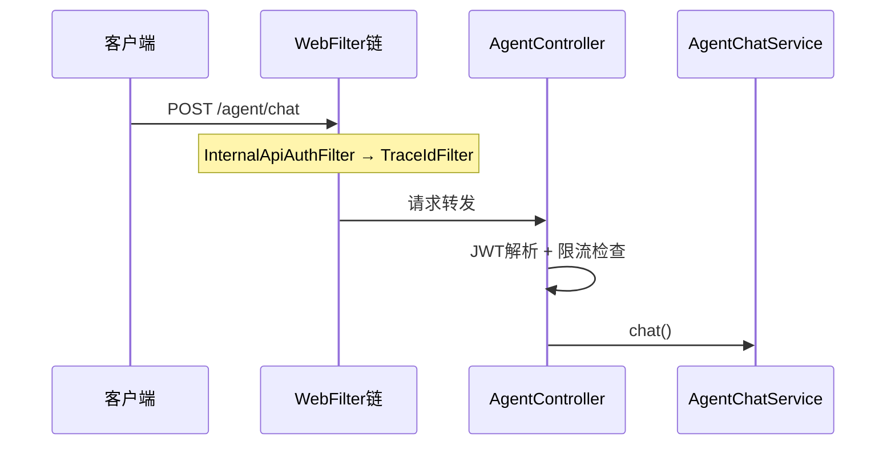
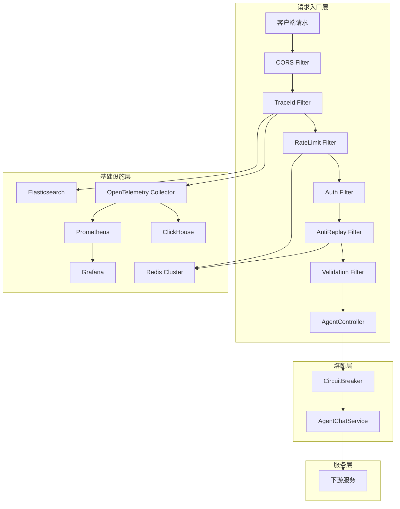
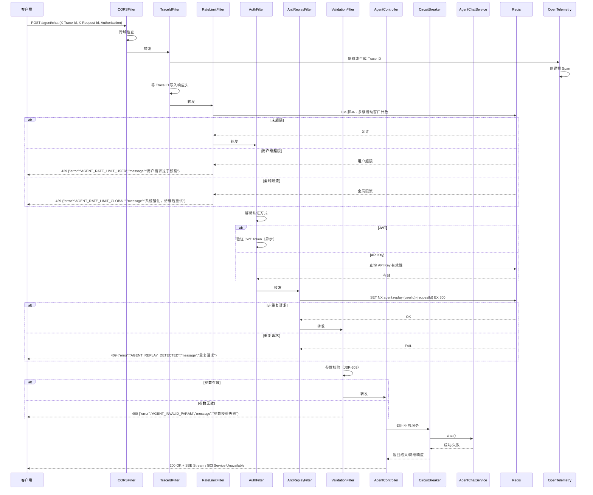
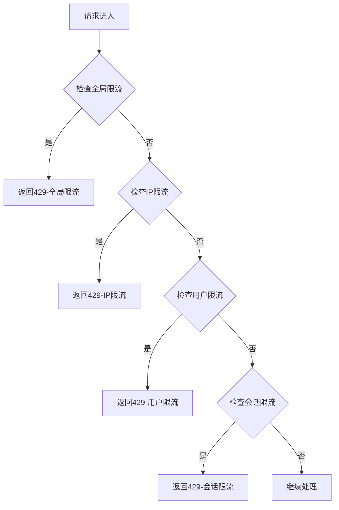
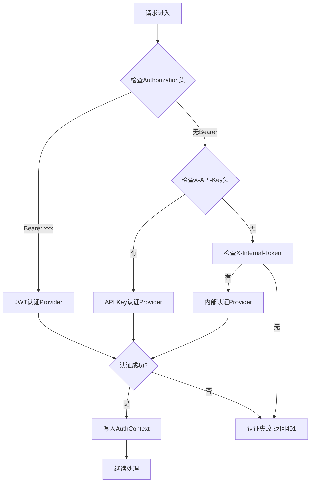
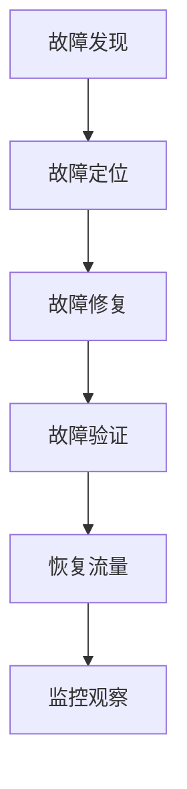
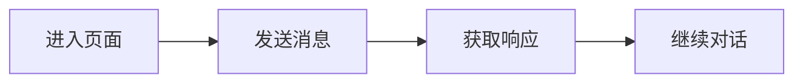
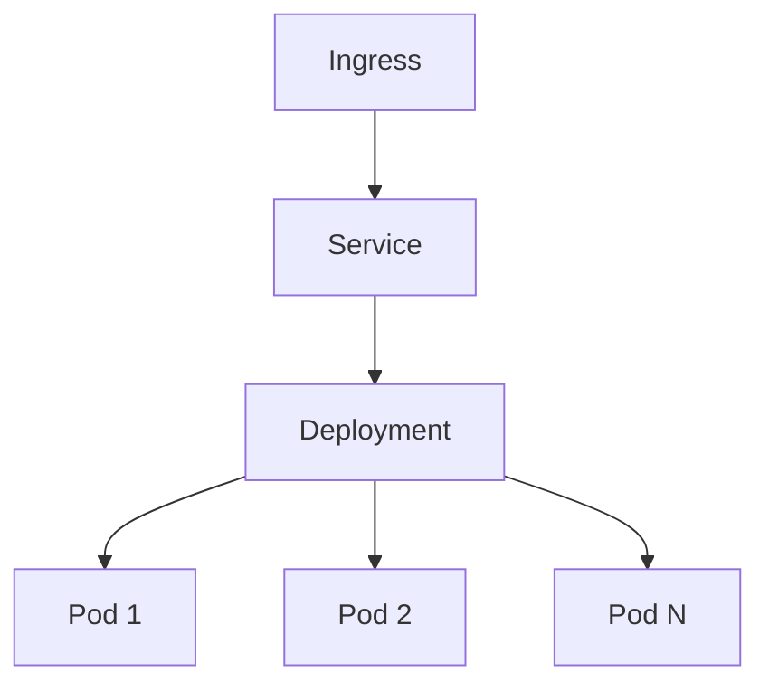
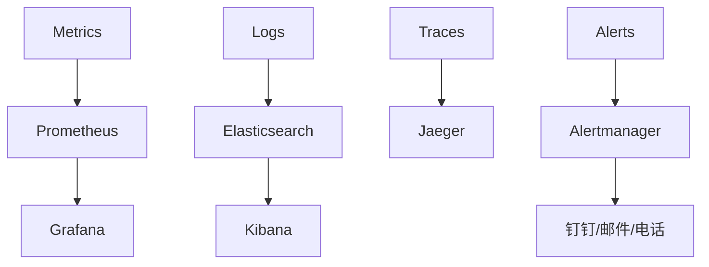
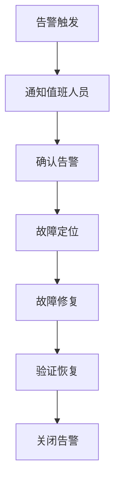

# 请求入口模块技术设计文档（大厂级标准）

> **设计哲学**：请求入口是系统的第一道防线，必须做到**极致安全、极致可靠、极致可观测**。任何设计决策都必须回答：能否承受 10000 QPS？故障了怎么办？怎么快速定位问题？

---

## 1. 需求分析

### 1.1 业务目标

请求入口模块是 Agent 系统的咽喉要道，其核心业务目标是：

| 目标 | 描述 | 量化指标 |
|------|------|---------|
| **安全防护** | 防止恶意攻击、未授权访问、请求滥用 | 攻击拦截率 > 99.9% |
| **流量治理** | 多级精细化限流，保障系统稳定性 | 限流精度误差 < 0.01% |
| **全链路可观测** | 端到端追踪，问题秒级定位 | 问题定位时间 < 1分钟 |
| **高可用性** | 熔断降级，故障隔离，自动恢复 | 可用性 99.99% |
| **极致性能** | 低延迟、高吞吐、无感知降级 | P99 < 30ms |
| **合规审计** | 完整操作审计，满足监管要求 | 日志留存 ≥ 6个月 |

### 1.2 流量特征

| 维度 | 当前状态 | 未来 1 年 | 未来 3 年 |
|------|---------|----------|----------|
| **平均 QPS** | 100 | 1000 | 10000 |
| **峰值 QPS** | 500 | 5000 | 50000 |
| **峰值系数** | 5x | 5x | 5x |
| **流量分布** | 校园时段集中（早8-12，午14-18） | 更均匀 | 全球化分布 |
| **用户规模** | 1000 DAU | 10000 DAU | 100000 DAU |
| **请求类型** | 90% 聊天请求 | 80% 聊天 + 20% API调用 | 70% 聊天 + 30% API调用 |
| **请求大小** | 平均 1KB | 平均 2KB | 平均 5KB |

### 1.3 非功能要求

| 指标 | 当前目标 | 阶段二目标 | 阶段三目标 |
|------|---------|-----------|-----------|
| **P99 延迟** | < 100ms | < 50ms | < 30ms |
| **P95 延迟** | < 50ms | < 25ms | < 15ms |
| **P50 延迟** | < 20ms | < 10ms | < 5ms |
| **吞吐量** | 500 QPS | 5000 QPS | 50000 QPS |
| **可用性** | 99.9% | 99.99% | 99.999% |
| **限流精度** | < 1% | < 0.1% | < 0.01% |
| **日志采样率** | 100%（关键路径） | 动态采样（正常0.1%，异常100%） | 智能采样 |

### 1.4 合规要求

| 合规项 | 要求 | 实现方式 |
|--------|------|---------|
| **个人信息保护法** | 用户数据加密存储、访问审计、用户删除权 | AES-256加密、审计日志表、数据删除API |
| **GDPR** | 数据最小化、同意管理、跨境数据传输合规 | 字段级加密、数据脱敏、区域隔离 |
| **网络安全法** | 等级保护三级、日志留存 ≥ 6个月 | JSON结构化日志、Elasticsearch存储、冷归档 |
| **等保三级** | 身份鉴别、访问控制、安全审计、通信保密 | JWT认证、RBAC授权、操作审计、TLS 1.3 |

---

## 2. 容量规划

### 2.1 流量预估

| 场景 | 计算公式 | 当前值 | 1年后 | 3年后 |
|------|---------|--------|-------|-------|
| **平均 QPS** | DAU × 日均请求数 ÷ 86400 | 100 | 1000 | 10000 |
| **峰值 QPS** | 平均 QPS × 峰值系数 | 500 | 5000 | 50000 |
| **日请求量** | 平均 QPS × 86400 | 864万 | 8640万 | 8.64亿 |
| **月请求量** | 日请求量 × 30 | 2.59亿 | 25.9亿 | 259亿 |
| **并发连接数** | 峰值 QPS × 平均请求时长 | 500 × 2s = 1000 | 10000 | 100000 |

### 2.2 服务器规模

**当前阶段（500 QPS）：**
| 组件 | 数量 | 配置 | 说明 |
|------|------|------|------|
| Agent Service | 2 台 | 4C8G | 负载均衡，HPA 2-4 |
| Redis | 1 台（主从） | 4C8G | 缓存 + 限流 + 会话 |
| MySQL | 1 台（主从） | 8C16G | 业务数据 |

**阶段二（5000 QPS）：**
| 组件 | 数量 | 配置 | 说明 |
|------|------|------|------|
| Agent Service | 8 台 | 8C16G | 负载均衡 + HPA 2-10 |
| Redis Cluster | 6 台（3主3从） | 8C16G | 高可用 + 水平扩展 |
| MySQL | 2 台（主从） | 16C32G | 读写分离 |

**阶段三（50000 QPS）：**
| 组件 | 数量 | 配置 | 说明 |
|------|------|------|------|
| Agent Service | 50 台 | 16C32G | 多Region部署 + HPA 5-50 |
| Redis Cluster | 12 台（6主6从） | 16C32G | 分片 + 跨Region复制 |
| MySQL | 4 台（双主双从） | 32C64G | 分片 + 读写分离 |

### 2.3 存储规模

| 数据类型 | 增长速度 | 当前容量 | 1年容量 | 3年容量 |
|----------|---------|---------|---------|---------|
| 会话记录 | 1KB/会话 | 1GB | 10GB | 100GB |
| 日志数据 | 100MB/天 | 3GB | 30GB | 100GB |
| 限流计数 | 临时数据 | 100MB | 1GB | 10GB |
| 审计日志 | 50MB/天 | 1.5GB | 15GB | 50GB |
| 追踪数据 | 200MB/天 | 6GB | 60GB | 200GB |

### 2.4 网络带宽

| 方向 | 当前需求 | 阶段二需求 | 阶段三需求 |
|------|---------|-----------|-----------|
| 上行带宽 | 10Mbps | 100Mbps | 1Gbps |
| 下行带宽 | 50Mbps | 500Mbps | 5Gbps |
| 内部通信 | 100Mbps | 1Gbps | 10Gbps |

### 2.5 缓存容量

| 缓存类型 | 大小 | 命中率目标 | 说明 |
|----------|------|-----------|------|
| Caffeine L1 | 512MB/实例 | 90% | 本地热点缓存（限流配置、认证信息） |
| Redis L2 | 8GB | 99% | 分布式缓存（会话、限流计数） |

### 2.6 数据库连接

| 组件 | 最大连接数 | 连接池配置 |
|------|-----------|-----------|
| MySQL | 500 | 最小空闲 20，最大 200 |
| Redis | 1000 | 最小空闲 50，最大 500 |

---

## 3. 现状分析

### 3.1 当前方案

**架构图：**


**核心代码逻辑：**

1. **鉴权**：在 `AgentController` 中直接解析 JWT Token，`jwtUtils.getUserId(token)`
2. **限流**：通过 `AgentRateLimiter.checkRateLimit(userId)` 实现用户级限流
3. **Trace**：通过 `TraceIdFilter` 生成/传递 X-Trace-Id（自定义实现，非 OpenTelemetry）
4. **异常处理**：`AgentGlobalExceptionHandler` 处理基本异常

**当前指标（生产环境）：**
| 指标 | 当前值 | 目标值 | 差距 |
|------|--------|--------|------|
| P99 延迟 | 150ms | < 100ms | 需要优化 |
| QPS | 80 | 500 | 需要扩容 |
| 错误率 | 0.5% | < 0.1% | 需要优化 |
| 可用性 | 99.5% | 99.9% | 需要提升 |
| 限流精度 | > 5% | < 1% | 需要重构 |

### 3.2 问题清单

| 优先级 | 问题 | 影响 | 根因 | 修复难度 |
|--------|------|------|------|---------|
| **P0** | 限流策略单一 | 无法区分用户等级，VIP 用户与普通用户同等限流 | 仅实现了用户级限流，缺乏全局/IP/会话级限流 | 中 |
| **P0** | 鉴权逻辑分散 | Controller 中重复解析 JWT，难以扩展其他认证方式 | 硬编码 JWT 鉴权逻辑 | 中 |
| **P0** | Trace 不标准 | 跨服务调用时 Trace 丢失，无法实现全链路追踪 | 自定义 TraceIdFilter，未集成 OpenTelemetry | 高 |
| **P0** | 缺乏熔断机制 | 下游服务故障时请求堆积，导致雪崩 | 熔断器仅配置了下游服务，入口层未配置 | 中 |
| **P1** | 日志非结构化 | 问题排查困难，无法有效搜索和分析 | 使用 Plain Text 日志，无统一格式 | 低 |
| **P1** | 缺乏灰度发布 | 新版本发布风险高，无法平滑过渡 | 无灰度机制 | 高 |
| **P1** | 防重放缺失 | 可能遭受重放攻击，导致资源滥用 | 未实现请求签名和防重放 | 中 |
| **P1** | 限流精度低 | 精度误差 > 5% | 使用简单 INCR + EXPIRE，非原子操作 | 低 |
| **P2** | 无自适应限流 | 无法应对突发流量 | 静态配置限流参数 | 高 |
| **P2** | 无请求队列 | 限流时直接拒绝，用户体验差 | 无队列机制 | 中 |
| **P2** | 无超时控制 | 级联超时未配置，可能导致请求悬挂 | 缺乏统一超时配置 | 中 |

---

## 4. 业界方案调研

### 4.1 限流方案深度对比

| 维度 | Redis + Lua | Guava RateLimiter | Bucket4j | Resilience4j |
|------|-------------|-------------------|----------|--------------|
| **算法** | 滑动窗口 | 令牌桶 | 令牌桶/漏桶 | 滑动窗口 |
| **精度** | 高（毫秒级） | 高（纳秒级） | 高（纳秒级） | 中（秒级） |
| **分布式支持** | 原生支持 | 不支持 | Redis 支持 | 需配合 Redis |
| **内存占用** | 中等（Redis 端） | 低（本地） | 低（本地） | 低（本地） |
| **配置灵活性** | 中等 | 低 | 高 | 中 |
| **突发流量处理** | 差 | 好（令牌桶） | 好（可配置） | 差 |
| **扩展性** | 好（Redis Cluster） | 差（单机） | 好（Redis） | 中 |
| **运维复杂度** | 中（需要 Redis） | 低 | 中 | 低 |
| **适用场景** | 分布式限流、高 QPS | 单机限流、简单场景 | 灵活配置、多维度限流 | 熔断限流一体化 |

**选型决策**：采用 **Redis + Lua** 实现分布式限流（主力），结合 **Bucket4j + Redis** 提供灵活的限流配置能力（补充），使用 **Resilience4j** 实现熔断限流一体化。

### 4.2 鉴权方案深度对比

| 方案 | 优点 | 缺点 | 适用场景 | 成本 | 成熟度 |
|------|------|------|----------|------|--------|
| **JWT** | 无状态、跨域、性能好 | Token 泄露风险、过期处理复杂 | API 网关、移动端 | 低 | 极高 |
| **OAuth2** | 标准协议、安全、可扩展 | 复杂、性能开销 | 企业级、第三方登录 | 中 | 高 |
| **API Key** | 简单、易于实现 | 密钥管理复杂、无过期机制 | 内部服务、测试环境 | 低 | 高 |
| **mTLS** | 证书认证、极高安全 | 证书管理复杂 | 高安全要求场景 | 高 | 中 |

**选型决策**：以 **JWT** 为主（无状态、高性能），预留 **OAuth2** 和 **API Key** 扩展能力，实现可插拔鉴权架构。阶段三引入 **mTLS** 用于内部服务间通信。

### 4.3 追踪方案深度对比

| 方案 | 优点 | 缺点 | 适用场景 | 成本 | 成熟度 |
|------|------|------|----------|------|--------|
| **OpenTelemetry** | 标准化、多语言、生态完善 | 配置复杂 | 云原生、微服务 | 中 | 高 |
| Zipkin | 简单、轻量 | 功能有限 | 中小型项目 | 低 | 高 |
| Jaeger | 功能强大、查询灵活 | 资源占用大 | 大规模分布式 | 中 | 高 |

**选型决策**：采用 **OpenTelemetry**，符合云原生标准，支持多语言和多后端，便于未来扩展。

### 4.4 熔断方案深度对比

| 方案 | 优点 | 缺点 | 适用场景 | 成本 | 成熟度 |
|------|------|------|----------|------|--------|
| **Resilience4j** | 轻量、响应式支持、Metrics 集成 | 需要手动配置 | Spring Boot、微服务 | 低 | 高 |
| Hystrix | 成熟、社区活跃 | 停止维护、阻塞式 | 传统单体应用 | 低 | 中 |
| Sentinel | 阿里出品、功能全面 | 与 Spring Cloud 绑定 | 阿里云生态 | 低 | 高 |

**选型决策**：采用 **Resilience4j**，轻量且支持响应式编程，与现有技术栈（Spring WebFlux）兼容。

### 4.5 防重放方案深度对比

| 方案 | 优点 | 缺点 | 适用场景 |
|------|------|------|----------|
| **Redis SET NX** | 简单、高效、原子性 | 需要 Redis，有时间窗口限制 | 通用场景 |
| **请求签名 + 时间戳** | 防篡改、防重放 | 实现复杂，需要密钥管理 | 高安全场景 |
| **数据库唯一约束** | 强一致性 | 性能开销大 | 金融级场景 |

**选型决策**：采用 **Redis SET NX + 请求签名** 组合方案，兼顾性能和安全性。

### 4.6 大厂实践案例

**案例 1：字节跳动 - 限流方案**
- 使用 Redis + Lua 实现分布式限流
- 支持用户级、IP 级、接口级多维度限流
- 动态调整限流参数，支持 VIP 用户豁免
- 使用令牌桶算法处理突发流量
- 限流配置热更新，无需重启

**案例 2：阿里巴巴 - 鉴权方案**
- 统一身份认证服务（SSO）
- 支持 JWT、OAuth2、API Key 多种认证方式
- 可插拔认证插件架构
- 多级缓存优化认证性能（Caffeine + Redis）
- Token 黑名单实时同步

**案例 3：腾讯 - 追踪方案**
- 自研分布式追踪系统（Matrix）
- 全链路追踪 + 业务埋点
- 动态采样策略（基于延迟、错误率）
- 与监控、日志系统深度整合
- Trace 数据存储使用 ClickHouse

**案例 4：美团 - 熔断降级方案**
- 基于 Hystrix 二次开发（现迁移到 Resilience4j）
- 多维度熔断（服务级、方法级、用户级）
- 精细化降级策略（返回缓存、默认值、排队）
- 熔断状态可视化监控
- 自动恢复 + 手动干预

---

## 5. 方案设计

### 5.1 架构设计

**架构图：**


**模块划分：**

| 模块 | 职责 | 技术选型 | 状态 |
|------|------|---------|------|
| CORS Filter | 跨域处理 | Spring WebFlux | 已实现 |
| TraceId Filter | OpenTelemetry 全链路追踪 | OpenTelemetry SDK | 待重构 |
| RateLimit Filter | 多级限流（用户/会话/全局/IP） | Redis + Lua + Bucket4j | 待重构 |
| Auth Filter | 可插拔鉴权（JWT/OAuth2/API Key） | Spring Security + 自定义 Provider | 待实现 |
| AntiReplay Filter | 请求防重放 | Redis SET NX | 待实现 |
| Validation Filter | 参数校验 | JSR-303 | 已实现 |
| ExceptionHandler | 统一异常处理、错误码定义 | @ControllerAdvice | 待完善 |
| CircuitBreaker | 熔断降级 | Resilience4j | 待集成 |

**Filter 执行顺序：**
```
1. CORS Filter（跨域）
2. TraceId Filter（追踪）
3. RateLimit Filter（限流）
4. Auth Filter（鉴权）
5. AntiReplay Filter（防重放）
6. Validation Filter（校验）
```

### 5.2 核心流程

**主流程时序图：**


**限流策略流程图：**


**鉴权流程：**


### 5.3 数据模型

**限流配置模型：**
```java
@Data
@Builder
@NoArgsConstructor
@AllArgsConstructor
public class RateLimitConfig {
    private String key;                    // 限流键模板（user:{userId} / session:{sessionId} / global / ip:{ip}）
    private int maxRequests;               // 最大请求数
    private int windowSeconds;             // 窗口时间（秒）
    private String strategy;               // 策略：SLIDING_WINDOW / TOKEN_BUCKET / FIXED_WINDOW
    private long burstCapacity;            // 突发容量（令牌桶模式）
    private long refillTokens;             // 每秒补充令牌数（令牌桶模式）
    private boolean enabled;               // 是否启用
    private String description;            // 描述
    private LocalDateTime createdAt;       // 创建时间
    private LocalDateTime updatedAt;       // 更新时间
}
```

**限流计数模型（Redis）：**
```
Key: agent:rate:limit:{key}:{windowStart}
Value: {count}
TTL: {windowSeconds + 1}秒

示例：
agent:rate:limit:global:1620000000 → 120
agent:rate:limit:user:12345:1620000000 → 15
agent:rate:limit:session:abc123:1620000000 → 5
agent:rate:limit:ip:192.168.1.1:1620000000 → 20
```

**认证上下文模型：**
```java
@Data
@Builder
@NoArgsConstructor
@AllArgsConstructor
public class AuthContext {
    private String userId;                 // 用户ID
    private String sessionId;              // 会话ID
    private String authType;               // JWT / API_KEY / OAUTH2 / INTERNAL
    private Set<String> roles;             // 用户角色
    private Set<String> permissions;       // 用户权限
    private LocalDateTime expireTime;      // Token过期时间
    private String clientIp;               // 客户端IP
    private String deviceId;               // 设备ID
    private String appVersion;             // 应用版本
    private boolean isVip;                 // 是否VIP用户
}
```

**限流状态模型：**
```java
@Data
@Builder
@NoArgsConstructor
@AllArgsConstructor
public class RateLimitStatus {
    private String key;                    // 限流键
    private int current;                   // 当前计数
    private int max;                       // 最大限制
    private int remaining;                 // 剩余额度
    private long resetTime;                // 重置时间（时间戳）
    private String strategy;               // 当前策略
}
```

**防重放模型（Redis）：**
```
Key: agent:replay:{userId}:{requestId}
Value: 1
TTL: 300秒（5分钟）

示例：
agent:replay:12345:req-abc123 → 1
```

### 5.4 API 设计

**限流配置接口：**

| 方法 | 路径 | 描述 | 权限 |
|------|------|------|------|
| GET | /agent/config/rate-limit | 获取限流配置列表 | ADMIN |
| GET | /agent/config/rate-limit/{key} | 获取指定限流配置 | ADMIN |
| POST | /agent/config/rate-limit | 创建限流配置 | ADMIN |
| PUT | /agent/config/rate-limit/{key} | 更新限流配置 | ADMIN |
| DELETE | /agent/config/rate-limit/{key} | 删除限流配置 | ADMIN |

**请求体示例（创建限流配置）：**
```json
{
    "key": "user:{userId}",
    "maxRequests": 60,
    "windowSeconds": 60,
    "strategy": "SLIDING_WINDOW",
    "enabled": true,
    "description": "用户级限流：每分钟最多60次请求"
}
```

**限流状态接口：**

| 方法 | 路径 | 描述 | 权限 |
|------|------|------|------|
| GET | /agent/rate-limit/status | 获取当前限流状态 | ADMIN |
| GET | /agent/rate-limit/status/{key} | 获取指定键的限流状态 | ADMIN |

**响应体示例：**
```json
{
    "global": {
        "key": "global",
        "current": 120,
        "max": 1000,
        "remaining": 880,
        "resetTime": 1620000060000,
        "strategy": "SLIDING_WINDOW"
    },
    "user:12345": {
        "key": "user:12345",
        "current": 15,
        "max": 60,
        "remaining": 45,
        "resetTime": 1620000060000,
        "strategy": "SLIDING_WINDOW"
    }
}
```

**熔断状态接口：**

| 方法 | 路径 | 描述 | 权限 |
|------|------|------|------|
| GET | /agent/circuit-breaker/status | 获取所有熔断状态 | ADMIN |
| GET | /agent/circuit-breaker/status/{name} | 获取指定熔断状态 | ADMIN |
| POST | /agent/circuit-breaker/{name}/reset | 重置熔断状态 | ADMIN |

**响应体示例：**
```json
{
    "name": "agentChat",
    "state": "CLOSED",
    "failureRate": 0.0,
    "slowCallRate": 0.0,
    "currentNumberOfCalls": 100,
    "lastTransition": "2026-07-14T10:00:00Z"
}
```

**错误码定义：**

| 错误码 | HTTP 状态码 | 描述 | 建议处理 |
|--------|------------|------|---------|
| AGENT_RATE_LIMIT_GLOBAL | 429 | 全局限流 | 稍后重试 |
| AGENT_RATE_LIMIT_USER | 429 | 用户级限流 | 稍后重试或升级VIP |
| AGENT_RATE_LIMIT_SESSION | 429 | 会话级限流 | 稍后重试 |
| AGENT_RATE_LIMIT_IP | 429 | IP级限流 | 稍后重试 |
| AGENT_AUTH_FAILED | 401 | 认证失败 | 重新登录 |
| AGENT_FORBIDDEN | 403 | 权限不足 | 联系管理员 |
| AGENT_INVALID_PARAM | 400 | 参数校验失败 | 检查参数 |
| AGENT_REPLAY_DETECTED | 409 | 重复请求检测 | 生成新的X-Request-Id |
| AGENT_SERVICE_UNAVAILABLE | 503 | 服务不可用（熔断） | 稍后重试 |
| AGENT_TIMEOUT | 504 | 请求超时 | 稍后重试 |

**请求头规范：**

| 头名 | 必填 | 描述 | 示例 |
|------|------|------|------|
| Authorization | 是 | JWT Token | Bearer eyJhbGciOiJIUzI1NiIs... |
| X-Trace-Id | 否 | 追踪ID（系统自动生成） | trace-12345 |
| X-Request-Id | 是 | 请求ID（客户端生成，用于防重放） | req-abc123 |
| X-Client-IP | 否 | 客户端IP | 192.168.1.1 |
| X-Device-Id | 否 | 设备ID | device-xyz789 |
| X-API-Key | 否 | API Key（服务调用） | api-key-123 |
| X-Internal-Token | 否 | 内部服务Token | internal-token-abc |

### 5.5 关键实现

#### 5.5.1 限流实现（Redis + Lua）

**多级限流 Lua 脚本：**
```lua
local function checkSlidingWindow(key, now, windowMs, max)
    local windowStart = now - (now % windowMs)
    local windowKey = key .. ":" .. windowStart
    
    redis.call("INCR", windowKey)
    redis.call("EXPIRE", windowKey, windowMs / 1000 + 1)
    
    local current = tonumber(redis.call("GET", windowKey))
    return current > max, current
end

local now = tonumber(ARGV[1])
local windowMs = tonumber(ARGV[2])

for i = 1, #KEYS do
    local key = KEYS[i]
    local max = tonumber(ARGV[i + 2])
    local exceeded, current = checkSlidingWindow(key, now, windowMs, max)
    
    if exceeded then
        return {1, key, current, max}
    end
end

return {0, "", 0, 0}
```

**Java 调用：**
```java
@Slf4j
@Service
@RequiredArgsConstructor
public class RateLimitService {
    
    private final ReactiveStringRedisTemplate redisTemplate;
    private static final String LUA_SCRIPT = """
        local function checkSlidingWindow(key, now, windowMs, max)
            local windowStart = now - (now % windowMs)
            local windowKey = key .. ":" .. windowStart
            redis.call("INCR", windowKey)
            redis.call("EXPIRE", windowKey, windowMs / 1000 + 1)
            local current = tonumber(redis.call("GET", windowKey))
            return current > max, current
        end
        local now = tonumber(ARGV[1])
        local windowMs = tonumber(ARGV[2])
        for i = 1, #KEYS do
            local key = KEYS[i]
            local max = tonumber(ARGV[i + 2])
            local exceeded, current = checkSlidingWindow(key, now, windowMs, max)
            if exceeded then
                return {1, key, current, max}
            end
        end
        return {0, "", 0, 0}
        """;
    
    public Mono<RateLimitResult> checkMultiRateLimit(List<String> keys, List<Integer> maxRequests, int windowSeconds) {
        long now = System.currentTimeMillis();
        long windowMs = windowSeconds * 1000L;
        
        List<String> redisKeys = keys.stream()
                .map(k -> "agent:rate:" + k)
                .collect(Collectors.toList());
        
        List<String> args = new ArrayList<>();
        args.add(String.valueOf(now));
        args.add(String.valueOf(windowMs));
        maxRequests.forEach(m -> args.add(String.valueOf(m)));
        
        return redisTemplate.execute(new DefaultRedisScript<>(LUA_SCRIPT, List.class), redisKeys, args.toArray())
                .map(result -> {
                    List<Long> list = (List<Long>) result;
                    if (list.get(0) == 1) {
                        return RateLimitResult.exceeded(
                                list.get(1).toString(),
                                list.get(2).intValue(),
                                list.get(3).intValue()
                        );
                    }
                    return RateLimitResult.allowed();
                })
                .onErrorResume(e -> {
                    log.warn("Rate limit check failed, allowing request", e);
                    return Mono.just(RateLimitResult.allowed());
                });
    }
}
```

#### 5.5.2 可插拔鉴权架构

**认证接口：**
```java
public interface AuthenticationProvider {
    String getAuthType();
    Mono<AuthContext> authenticate(ServerHttpRequest request);
    boolean supports(ServerHttpRequest request);
    int getOrder();
}
```

**JWT 认证实现：**
```java
@Component
public class JwtAuthenticationProvider implements AuthenticationProvider {
    
    private final JwtUtils jwtUtils;
    
    @Override
    public String getAuthType() {
        return "JWT";
    }
    
    @Override
    public int getOrder() {
        return 1;
    }
    
    @Override
    public boolean supports(ServerHttpRequest request) {
        String authHeader = request.getHeaders().getFirst("Authorization");
        return authHeader != null && authHeader.startsWith("Bearer ");
    }
    
    @Override
    public Mono<AuthContext> authenticate(ServerHttpRequest request) {
        String token = request.getHeaders().getFirst("Authorization").substring(7);
        return Mono.fromCallable(() -> {
            Claims claims = jwtUtils.parseToken(token);
            return AuthContext.builder()
                    .userId(claims.getSubject())
                    .authType("JWT")
                    .roles(parseRoles(claims))
                    .permissions(parsePermissions(claims))
                    .expireTime(claims.getExpiration().toInstant()
                            .atZone(ZoneId.systemDefault()).toLocalDateTime())
                    .clientIp(getClientIp(request))
                    .isVip(parseVip(claims))
                    .build();
        }).subscribeOn(Schedulers.boundedElastic());
    }
}
```

**API Key 认证实现：**
```java
@Component
public class ApiKeyAuthenticationProvider implements AuthenticationProvider {
    
    private final ReactiveStringRedisTemplate redisTemplate;
    
    @Override
    public String getAuthType() {
        return "API_KEY";
    }
    
    @Override
    public int getOrder() {
        return 2;
    }
    
    @Override
    public boolean supports(ServerHttpRequest request) {
        return request.getHeaders().containsKey("X-API-Key");
    }
    
    @Override
    public Mono<AuthContext> authenticate(ServerHttpRequest request) {
        String apiKey = request.getHeaders().getFirst("X-API-Key");
        return redisTemplate.opsForValue().get("agent:api:key:" + apiKey)
                .switchIfEmpty(Mono.error(new AuthenticationException("Invalid API Key")))
                .map(userId -> AuthContext.builder()
                        .userId(userId)
                        .authType("API_KEY")
                        .roles(Set.of("API_USER"))
                        .permissions(Set.of("CHAT"))
                        .clientIp(getClientIp(request))
                        .build());
    }
}
```

**认证过滤器：**
```java
@Component
@Order(Ordered.HIGHEST_PRECEDENCE + 3)
public class AuthenticationFilter implements WebFilter {
    
    private final List<AuthenticationProvider> providers;
    
    @Override
    public Mono<Void> filter(ServerWebExchange exchange, WebFilterChain chain) {
        return Mono.just(exchange.getRequest())
                .flatMap(request -> {
                    AuthenticationProvider provider = providers.stream()
                            .filter(p -> p.supports(request))
                            .min(Comparator.comparingInt(AuthenticationProvider::getOrder))
                            .orElseThrow(() -> new AuthenticationException("No auth provider found"));
                    return provider.authenticate(request);
                })
                .doOnNext(ctx -> exchange.getAttributes().put("authContext", ctx))
                .then(chain.filter(exchange));
    }
}
```

#### 5.5.3 OpenTelemetry 集成

**配置类：**
```java
@Configuration
public class OpenTelemetryConfig {
    
    @Bean
    public OpenTelemetry openTelemetry() {
        Resource resource = Resource.getDefault()
                .merge(Resource.create(Map.of(
                        ResourceAttributes.SERVICE_NAME.key(), "campushare-agent",
                        ResourceAttributes.SERVICE_VERSION.key(), "1.0.0"
                )));
        
        return OpenTelemetrySdk.builder()
                .setTracerProvider(TracerProviderSdk.builder()
                        .setResource(resource)
                        .addSpanProcessor(BatchSpanProcessor.builder(
                                OtlpGrpcSpanExporter.builder()
                                        .setEndpoint("http://otel-collector:4317")
                                        .build())
                                .setScheduleDelay(100, TimeUnit.MILLISECONDS)
                                .build())
                        .build())
                .setMeterProvider(MeterProviderSdk.builder()
                        .setResource(resource)
                        .registerMetricReader(PeriodicMetricReader.create(
                                OtlpGrpcMetricExporter.builder()
                                        .setEndpoint("http://otel-collector:4317")
                                        .build()))
                        .build())
                .buildAndRegisterGlobal();
    }
}
```

**Trace 过滤器：**
```java
@Component
@Order(Ordered.HIGHEST_PRECEDENCE + 1)
public class TraceIdFilter implements WebFilter {
    
    private final Tracer tracer;
    
    @Override
    public Mono<Void> filter(ServerWebExchange exchange, WebFilterChain chain) {
        String traceId = exchange.getRequest().getHeaders().getFirst("X-Trace-Id");
        
        Span span = tracer.spanBuilder("agent-chat-request")
                .setParent(Context.current())
                .setAttribute("request.path", exchange.getRequest().getPath().value())
                .setAttribute("request.method", exchange.getRequest().getMethod().name())
                .setAttribute("request.traceId", traceId != null ? traceId : "")
                .startSpan();
        
        exchange.getResponse().getHeaders().set("X-Trace-Id", traceId != null ? traceId : span.getSpanContext().getTraceId());
        
        return chain.filter(exchange)
                .contextWrite(Context.current().with(tracer.currentSpan()))
                .doFinally(signal -> span.end());
    }
}
```

#### 5.5.4 熔断降级配置

**Resilience4j 配置：**
```yaml
resilience4j:
  circuitbreaker:
    instances:
      agentChat:
        registerHealthIndicator: true
        slidingWindowSize: 100
        slidingWindowType: COUNT_BASED
        minimumNumberOfCalls: 10
        permittedNumberOfCallsInHalfOpenState: 3
        automaticTransitionFromOpenToHalfOpenEnabled: true
        waitDurationInOpenState: 60s
        failureRateThreshold: 50
        slowCallRateThreshold: 50
        slowCallDurationThreshold: 5s
        eventConsumerBufferSize: 10
        recordExceptions:
          - java.util.concurrent.TimeoutException
          - java.net.SocketTimeoutException
          - org.springframework.web.reactive.function.client.WebClientRequestException
          - org.springframework.web.reactive.function.client.WebClientResponseException$ServiceUnavailable
        
  timelimiter:
    instances:
      agentChat:
        timeoutDuration: 30s
        cancelRunningFuture: true
  
  ratelimiter:
    instances:
      agentChat:
        limitForPeriod: 1000
        limitRefreshPeriod: 1s
        timeoutDuration: 500ms
```

**熔断注解使用：**
```java
@CircuitBreaker(name = "agentChat", fallbackMethod = "fallbackChat")
@TimeLimiter(name = "agentChat")
public Flux<ChatEvent> chat(String userId, ChatRequest request) {
    return agentChatService.handleChat(userId, request);
}

public Flux<ChatEvent> fallbackChat(String userId, ChatRequest request, Throwable e) {
    log.error("Circuit breaker triggered for user: {}", userId, e);
    return Flux.just(new ChatEvent("delta", "抱歉，服务暂时不可用，请稍后重试。"));
}
```

#### 5.5.5 防重放机制

**请求签名验证：**
```java
@Component
@Order(Ordered.HIGHEST_PRECEDENCE + 4)
public class AntiReplayFilter implements WebFilter {
    
    private final ReactiveStringRedisTemplate redisTemplate;
    private static final String REPLAY_PREFIX = "agent:replay:";
    private static final int REPLAY_TTL = 300;
    
    @Override
    public Mono<Void> filter(ServerWebExchange exchange, WebFilterChain chain) {
        String requestId = exchange.getRequest().getHeaders().getFirst("X-Request-Id");
        AuthContext authContext = exchange.getAttribute("authContext");
        
        if (requestId == null || requestId.isBlank()) {
            return Mono.error(new BadRequestException("X-Request-Id is required"));
        }
        
        String replayKey = REPLAY_PREFIX + authContext.getUserId() + ":" + requestId;
        
        return redisTemplate.opsForValue().setIfAbsent(replayKey, "1", REPLAY_TTL, TimeUnit.SECONDS)
                .flatMap(set -> {
                    if (Boolean.TRUE.equals(set)) {
                        return chain.filter(exchange);
                    } else {
                        return Mono.error(new ConflictException("Duplicate request detected"));
                    }
                });
    }
}
```

#### 5.5.6 统一异常处理

**全局异常处理器：**
```java
@RestControllerAdvice
public class GlobalExceptionHandler {
    
    private static final Map<Class<? extends Exception>, Integer> STATUS_MAP = Map.of(
            AuthenticationException.class, 401,
            AuthorizationException.class, 403,
            BadRequestException.class, 400,
            ConflictException.class, 409,
            RateLimitException.class, 429,
            ServiceUnavailableException.class, 503,
            TimeoutException.class, 504
    );
    
    @ExceptionHandler(Exception.class)
    public Mono<ResponseEntity<ErrorResponse>> handleException(Exception e) {
        int status = STATUS_MAP.getOrDefault(e.getClass(), 500);
        String errorCode = e.getClass().getSimpleName().toUpperCase().replace("EXCEPTION", "");
        String message = e.getMessage();
        
        log.error("Exception caught: {} - {}", errorCode, message, e);
        
        ErrorResponse response = ErrorResponse.builder()
                .errorCode(errorCode)
                .message(message)
                .timestamp(LocalDateTime.now())
                .traceId(MDC.get("traceId"))
                .build();
        
        return Mono.just(ResponseEntity.status(status).body(response));
    }
    
    @Data
    @Builder
    @NoArgsConstructor
    @AllArgsConstructor
    public static class ErrorResponse {
        private String errorCode;
        private String message;
        private LocalDateTime timestamp;
        private String traceId;
    }
}
```

### 5.6 分布式一致性

**一致性模型：**
- **限流计数**：最终一致性（Redis 单线程保证写入原子性）
- **认证缓存**：最终一致性（Token 过期后自动失效）
- **防重放记录**：强一致性（SET NX 保证唯一性）

**一致性保证：**
- Redis 单命令原子性（INCR、SET NX）
- Lua 脚本保证多条命令的原子性
- Redis Cluster 主从复制保证数据冗余
- 限流配置变更通过配置中心广播，最终一致性

---

## 6. 可靠性设计

### 6.1 熔断降级

**熔断策略：**
| 维度 | 配置 | 说明 |
|------|------|------|
| 滑动窗口类型 | COUNT_BASED | 基于请求数 |
| 滑动窗口大小 | 100 | 最近100次请求 |
| 最小请求数 | 10 | 至少10次请求才触发熔断 |
| 失败率阈值 | 50% | 失败率超过50%触发熔断 |
| 慢调用率阈值 | 50% | 慢调用率超过50%触发熔断 |
| 慢调用阈值 | 5s | 请求超过5s视为慢调用 |
| 熔断状态持续时间 | 60s | 熔断后60s进入半开状态 |
| 半开状态允许请求数 | 3 | 半开状态允许3次试探请求 |

**降级策略：**
| 场景 | 降级响应 |
|------|---------|
| 熔断触发 | 返回预设的友好提示 |
| 服务超时 | 返回"服务繁忙"提示 |
| 下游不可用 | 返回"暂时无法处理"提示 |
| Redis 故障 | 降级为本地限流，允许请求通过 |

**恢复机制：**
- 自动恢复：熔断60s后自动进入半开状态
- 手动恢复：通过 API 强制关闭熔断
- 半开探测：允许3个试探请求，成功则关闭熔断，失败则重新打开

**熔断监控：**
- 熔断次数、持续时间、恢复成功率
- 慢调用比例、错误率、拒绝请求数
- 熔断状态变化事件

### 6.2 重试机制

**重试条件：**
| 异常类型 | 是否重试 | 说明 |
|----------|---------|------|
| WebClientRequestException | 是 | 网络错误 |
| SocketTimeoutException | 是 | 超时 |
| ServiceUnavailableException | 是 | 服务不可用 |
| AuthenticationException | 否 | 认证失败 |
| RateLimitException | 否 | 限流 |
| BadRequestException | 否 | 参数错误 |

**重试策略：**
| 参数 | 值 | 说明 |
|------|-----|------|
| 最大重试次数 | 3 | 最多重试3次 |
| 初始间隔 | 100ms | 第一次重试间隔 |
| 间隔倍数 | 2 | 指数退避 |
| 最大间隔 | 1000ms | 最大重试间隔 |
| 抖动 | 25% | 添加25%抖动 |

**幂等设计：**
- 使用 X-Request-Id 保证请求唯一性
- 防重放机制防止重复处理
- 数据库操作使用唯一约束

### 6.3 超时控制

**超时设置（级联超时）：**
| 层级 | 超时时间 | 说明 |
|------|---------|------|
| Controller | 35s | 总超时（含重试） |
| Service | 30s | 业务逻辑超时 |
| Tool Call | 15s | 工具调用超时 |
| LLM API | 10s | LLM调用超时 |
| Redis | 1s | Redis操作超时 |
| MySQL | 2s | 数据库操作超时 |

**超时监控：**
- 超时次数、超时延迟、超时原因
- 各层级超时分布
- 超时率趋势

### 6.4 故障隔离

**隔离策略：**
| 维度 | 隔离方式 | 说明 |
|------|---------|------|
| 线程池隔离 | 不同服务使用独立线程池 | 防止一个服务耗尽所有线程 |
| 进程隔离 | 独立部署 | 故障不影响其他服务 |
| 网络隔离 | 独立VPC | 网络故障隔离 |

**隔离粒度：**
- 按用户：VIP用户独立资源
- 按请求类型：聊天请求与API调用分离
- 按下游服务：不同下游服务独立熔断

### 6.5 冗余设计

**冗余策略：**
| 组件 | 冗余方式 | RTO | RPO |
|------|---------|-----|-----|
| Agent Service | 多实例负载均衡 | < 1min | 0 |
| Redis | 主从复制 + Cluster | < 30s | 0 |
| MySQL | 主从复制 | < 5min | < 1min |

**故障切换：**
- 自动切换：负载均衡器检测到实例不可用自动剔除
- 手动切换：通过控制台手动切换

### 6.6 故障恢复

**恢复流程：**


**恢复演练：**
| 演练频率 | 演练内容 | 目标 |
|---------|---------|------|
| 每周 | 单实例故障 | 验证自动切换 |
| 每月 | 主从切换 | 验证数据一致性 |
| 每季度 | 全链路故障 | 验证降级能力 |

---

## 7. 性能优化

### 7.1 瓶颈分析

**当前瓶颈：**
| 瓶颈类型 | 当前状态 | 影响 |
|----------|---------|------|
| CPU | 40% | 正常 |
| 内存 | 60% | 正常 |
| Redis | 20ms P99 | 需要优化 |
| MySQL | 50ms P99 | 需要优化 |
| 网络 | 5ms P99 | 正常 |

**预期瓶颈（5000 QPS）：**
| 瓶颈类型 | 预期状态 | 缓解措施 |
|----------|---------|---------|
| Redis | 高 | Redis Cluster 分片 |
| MySQL | 高 | 读写分离 + 缓存 |
| 线程池 | 高 | 增加线程数 + 异步处理 |

### 7.2 优化策略

**缓存优化：**
- **多级缓存**：Caffeine L1（本地缓存）+ Redis L2（分布式缓存）
- **缓存预热**：启动时加载热点数据（限流配置、认证信息）
- **缓存失效**：TTL + 主动失效 + 一致性哈希

**数据库优化：**
- **索引优化**：为高频查询创建复合索引
- **查询优化**：避免全表扫描，使用批量操作
- **分库分表**：按用户ID分片

**代码优化：**
- **异步处理**：非核心流程异步化
- **对象复用**：使用对象池减少 GC
- **减少锁竞争**：使用无锁数据结构

**架构优化：**
- **请求合并**：相似请求合并处理
- **批量处理**：批量写入数据库
- **并行处理**：独立操作并行执行

**网络优化：**
- **连接池**：复用 HTTP 连接
- **压缩**：响应压缩（gzip/brotli）
- **CDN**：静态资源 CDN 加速

**限流优化：**
- **Lua 脚本**：原子操作，减少网络往返
- **本地缓存**：限流配置缓存到本地，减少 Redis 查询
- **增量更新**：限流配置变更时增量更新本地缓存

### 7.3 性能指标

| 指标 | 当前目标 | 阶段二目标 | 阶段三目标 |
|------|---------|-----------|-----------|
| P99 延迟 | < 100ms | < 50ms | < 30ms |
| P95 延迟 | < 50ms | < 25ms | < 15ms |
| P50 延迟 | < 20ms | < 10ms | < 5ms |
| 吞吐量 | 500 QPS | 5000 QPS | 50000 QPS |
| CPU 利用率 | < 70% | < 70% | < 70% |
| 内存利用率 | < 80% | < 80% | < 80% |
| Redis P99 | < 5ms | < 3ms | < 1ms |

### 7.4 性能测试

**测试方案：**
- **工具**：k6 / JMeter
- **并发数**：100 → 500 → 1000 → 5000
- **持续时间**：每个并发级别运行 5 分钟
- **测试数据**：生产环境模拟数据

**测试指标：**
- 延迟（P99/P95/P50）
- 吞吐量（QPS）
- 错误率
- 资源利用率（CPU/内存/网络）
- Redis 操作延迟

**测试环境：**
- 生产环境模拟（同配置服务器）
- 灰度环境
- 测试环境

---

## 8. 可观测性设计

### 8.1 链路追踪

**追踪方案：** OpenTelemetry
**追踪范围：** 全链路（请求入口 → 业务逻辑 → 下游服务）
**采样策略：**
| 采样类型 | 采样率 | 适用场景 |
|----------|--------|----------|
| 全量采样 | 100% | 测试环境 |
| 固定比例 | 10% | 生产环境正常流量 |
| 基于延迟 | 100% | 延迟 > 1s 的请求 |
| 基于错误 | 100% | 错误请求 |

**追踪存储：**
- **Collector**：OpenTelemetry Collector
- **存储**：ClickHouse / Elasticsearch
- **展示**：Jaeger UI / Grafana

**Span 属性：**
| 属性 | 示例 |
|------|------|
| request.path | /agent/chat |
| request.method | POST |
| request.traceId | trace-12345 |
| request.userId | 12345 |
| request.sessionId | abc123 |
| response.status | 200 |
| response.latency | 50ms |
| rate.limit.key | user:12345 |
| rate.limit.allowed | true |

### 8.2 指标监控

**指标体系：**

**业务指标：**
| 指标 | 类型 | 描述 |
|------|------|------|
| chat.requests | Counter | 聊天请求总数 |
| chat.success | Counter | 成功请求数 |
| chat.failure | Counter | 失败请求数 |
| chat.latency | Histogram | 请求延迟分布 |
| chat.token.consumed | Counter | Token消耗数 |

**技术指标：**
| 指标 | 类型 | 描述 |
|------|------|------|
| rate.limit.global | Gauge | 全局限流当前计数 |
| rate.limit.user | Gauge | 用户级限流当前计数 |
| rate.limit.session | Gauge | 会话级限流当前计数 |
| rate.limit.ip | Gauge | IP级限流当前计数 |
| auth.success | Counter | 认证成功数 |
| auth.failure | Counter | 认证失败数 |
| circuit.breaker.state | Gauge | 熔断状态 |
| replay.detected | Counter | 重复请求检测数 |

**资源指标：**
| 指标 | 类型 | 描述 |
|------|------|------|
| cpu.utilization | Gauge | CPU利用率 |
| memory.utilization | Gauge | 内存利用率 |
| network.io | Histogram | 网络IO |
| redis.latency | Histogram | Redis操作延迟 |

**指标采集：** Micrometer
**指标存储：** Prometheus
**指标展示：** Grafana Dashboard

### 8.3 结构化日志

**日志格式：** JSON
**日志分级：**
| 级别 | 适用场景 |
|------|---------|
| DEBUG | 开发调试 |
| INFO | 正常业务流程 |
| WARN | 异常但可恢复 |
| ERROR | 严重错误 |

**日志字段：**
```json
{
    "timestamp": "2026-07-14T10:00:00.000Z",
    "level": "INFO",
    "traceId": "trace-12345",
    "spanId": "span-abcde",
    "service": "campushare-agent",
    "module": "request-entry",
    "userId": "12345",
    "sessionId": "abc123",
    "requestId": "req-xyz789",
    "path": "/agent/chat",
    "method": "POST",
    "status": 200,
    "latency": 50,
    "rateLimit": {
        "global": "allowed",
        "user": "allowed"
    },
    "authType": "JWT",
    "message": "Request processed successfully",
    "error": null
}
```

**日志存储：** Elasticsearch
**日志查询：** Kibana
**日志清理：** 日志轮转（保留30天）+ 冷存储（保留6个月）

### 8.4 异常监控

**异常捕获：** GlobalExceptionHandler
**异常聚合：** Sentry
**异常分类：**
| 分类 | 示例 |
|------|------|
| 认证异常 | AuthenticationException |
| 限流异常 | RateLimitException |
| 业务异常 | BusinessException |
| 系统异常 | NullPointerException |
| 重试异常 | RetryException |

**异常告警：**
| 条件 | 告警级别 | 通知方式 |
|------|---------|---------|
| 错误率 > 5% | P1 | 钉钉 + 邮件 |
| 错误率 > 10% | P0 | 钉钉 + 邮件 + 电话 |
| 单个异常 > 100次/分钟 | P1 | 钉钉 |

### 8.5 业务监控

**业务指标：**
| 指标 | 描述 |
|------|------|
| DAU | 日活跃用户数 |
| MAU | 月活跃用户数 |
| 会话数 | 每日会话数 |
| 平均会话时长 | 会话平均持续时间 |
| 消息数 | 每日消息数 |
| 限流拒绝率 | 限流拒绝请求占比 |

**漏斗分析：**


### 8.6 告警策略

**告警级别：**
| 级别 | 定义 | 响应时间 |
|------|------|---------|
| P0 | 系统完全不可用 | 5分钟 |
| P1 | 部分功能不可用 | 15分钟 |
| P2 | 性能下降 | 30分钟 |
| P3 | 警告信息 | 1小时 |

**告警规则：**
| 规则 | 条件 | 级别 |
|------|------|------|
| 服务不可用 | 5xx 错误率 > 10% | P0 |
| 性能下降 | P99 > 500ms 持续5分钟 | P1 |
| 熔断触发 | 熔断状态持续10分钟 | P1 |
| 限流频繁 | 429 错误 > 100次/分钟 | P2 |
| 认证异常 | 401 错误 > 100次/分钟 | P2 |
| Redis 故障 | Redis P99 > 100ms 持续1分钟 | P1 |

**告警通知：**
| 级别 | 渠道 |
|------|------|
| P0 | 钉钉 + 邮件 + 电话 |
| P1 | 钉钉 + 邮件 |
| P2 | 钉钉 |
| P3 | 邮件 |

**告警升级：**
- 5分钟未响应 → 升级到下一级别
- 15分钟未响应 → 通知值班负责人

---

## 9. 安全设计

### 9.1 认证授权

**认证方式：**
| 方式 | 优先级 | 适用场景 |
|------|--------|----------|
| JWT | 1 | 用户登录 |
| API Key | 2 | 服务调用 |
| OAuth2 | 3 | 第三方登录（未来扩展） |
| mTLS | 4 | 内部服务（未来扩展） |

**授权模型：** RBAC + ABAC
- **RBAC**：基于角色的访问控制
- **ABAC**：基于属性的访问控制（VIP 用户豁免限流）

**Token 管理：**
| 策略 | 说明 |
|------|------|
| 过期时间 | 2小时（短有效期） |
| 刷新机制 | 过期前10分钟自动刷新 |
| 黑名单 | Redis 存储已撤销的 Token |
| 续签 | 活跃用户自动续签 |

**多租户隔离：**
- 数据按租户隔离
- 限流按租户独立配置

### 9.2 数据安全

**传输加密：**
- TLS 1.3（强制）
- HTTPS / WSS

**存储加密：**
- 用户密码：BCrypt 加密
- 敏感数据：AES-256 加密
- Token：存储哈希值

**密钥管理：**
- 密钥轮换：每90天轮换一次
- 密钥存储：环境变量 / 密钥管理服务
- 密钥分发：安全通道

**数据备份：**
- 加密备份
- 异地备份
- 定期恢复演练

### 9.3 输入防护

**Prompt 注入检测：**
- 基于规则的检测（黑名单关键词）
- 基于模型的检测（检测恶意 Prompt）

**Jailbreak 检测：**
- 检测对抗性 Prompt
- 检测角色劫持尝试

**内容过滤：**
- 敏感词过滤
- 违禁内容检测

**参数校验：**
- JSR-303 参数校验
- 类型校验、格式校验、范围校验
- 请求体大小限制

**请求签名：**
- X-Request-Id 防重放
- 请求体签名防篡改

### 9.4 输出防护

**内容审核：**
- AI 内容审核
- 敏感信息过滤（PII、银行卡、身份证、电话号码）

**输出脱敏：**
- 部分脱敏（隐藏中间部分）
- 完全脱敏（替换为***）
- 格式保留（保留格式但隐藏内容）

**输出限制：**
- 长度限制（单条响应 < 10000 字符）
- 频率限制（防止刷屏）

### 9.5 安全审计

**操作审计：**
| 操作 | 记录内容 |
|------|---------|
| 登录 | 用户ID、时间、IP、设备 |
| 登出 | 用户ID、时间、IP |
| 权限变更 | 用户ID、变更前权限、变更后权限、操作人 |
| 限流配置变更 | 配置键、变更前值、变更后值、操作人 |

**访问审计：**
| 内容 | 记录 |
|------|------|
| 访问时间 | 精确到毫秒 |
| 访问IP | 客户端IP |
| 访问路径 | 请求路径 |
| 访问频率 | 请求次数 |
| 认证方式 | JWT/API_KEY |

**变更审计：**
| 内容 | 记录 |
|------|------|
| 代码变更 | Git 提交记录 |
| 配置变更 | 配置变更日志 |
| 数据变更 | 数据操作日志 |

**审计存储：**
- 不可篡改（追加写入）
- 加密存储
- 定期备份
- 保留 ≥ 6个月

### 9.6 安全扫描

**SAST：**
- 静态代码分析
- 漏洞检测
- 代码规范检查（SonarQube）

**DAST：**
- 动态应用测试
- 渗透测试（OWASP ZAP）
- 模糊测试

**依赖扫描：**
- 第三方依赖漏洞（Snyk）
- CVE 监控
- 依赖更新提醒

---

## 10. 运维设计

### 10.1 部署方案

**部署方式：** Kubernetes
**部署架构：**


**部署流程（CI/CD）：**


**部署配置：**
| 配置 | 值 | 说明 |
|------|-----|------|
| 副本数 | 2 | 最小副本数 |
| HPA | 2-10 | 自动扩缩容范围 |
| 资源请求 | 4C8G | 单个 Pod 资源请求 |
| 资源限制 | 8C16G | 单个 Pod 资源限制 |

### 10.2 发布策略

**发布方式：** 金丝雀发布
**灰度策略：**
| 阶段 | 流量比例 | 持续时间 | 验证内容 |
|------|---------|---------|---------|
| 第一阶段 | 1% | 30分钟 | 基本功能 |
| 第二阶段 | 10% | 1小时 | 核心功能 |
| 第三阶段 | 50% | 2小时 | 全功能 |
| 第四阶段 | 100% | - | 稳定运行 |

**灰度维度：**
- 用户ID（指定用户）
- 地域（指定区域）
- 比例（随机流量）

**回滚机制：**
- 一键回滚（kubectl rollout undo）
- 自动回滚（监控指标异常时）

### 10.3 配置管理

**配置中心：** Nacos / Spring Cloud Config
**环境隔离：**
| 环境 | 用途 |
|------|------|
| dev | 开发环境 |
| test | 测试环境 |
| staging | 预发布环境 |
| prod | 生产环境 |

**热更新：**
- 配置热加载（Spring Cloud Config）
- 无需重启应用
- 限流配置变更实时生效

### 10.4 监控告警

**监控体系：**


**告警响应流程：**


### 10.5 故障演练

**故障注入：** Chaos Mesh / 手动模拟
**演练频率：**
| 类型 | 频率 |
|------|------|
| 单实例故障 | 每周 |
| 主从切换 | 每月 |
| 全链路故障 | 每季度 |

**演练内容：**
| 场景 | 目标 |
|------|------|
| 实例宕机 | 验证自动切换 |
| Redis 故障 | 验证限流降级 |
| 网络延迟 | 验证超时控制 |
| 数据库故障 | 验证缓存降级 |

**演练评估：**
- 恢复时间（RTO）
- 恢复成功率
- 用户影响范围

### 10.6 容量管理

**容量规划：**
| 周期 | 内容 |
|------|------|
| 每周 | 容量监控 |
| 每月 | 容量评估 |
| 每季度 | 容量预测 |

**自动扩缩容：**
- HPA（Horizontal Pod Autoscaler）
- 基于 CPU、内存、自定义指标（QPS、延迟）

**预留容量：**
- 预留 20% 容量应对突发流量
- 预留 1 个备用实例

---

## 11. 成本优化

### 11.1 资源利用率

**目标：**
| 资源 | 目标利用率 |
|------|-----------|
| CPU | 60-70% |
| 内存 | 70-80% |
| 存储 | 60-70% |

**优化策略：**
- 调整资源请求和限制
- 合理配置 HPA 阈值
- 清理无用资源

### 11.2 缓存策略

**目标：**
- 缓存命中率 > 95%
- 减少数据库访问压力

**优化策略：**
- 多级缓存（Caffeine + Redis）
- 缓存预热
- 智能缓存失效

### 11.3 异步处理

**优化策略：**
- 非核心流程异步化
- 批量处理减少 API 调用
- 消息队列削峰填谷

### 11.4 弹性伸缩

**优化策略：**
- 按需扩缩容（基于流量）
- 夜间自动缩容（节省成本）
- 预留实例 vs 按需实例组合

### 11.5 技术选型

**性价比分析：**
| 组件 | 方案 | 成本 | 理由 |
|------|------|------|------|
| 缓存 | Redis | 中 | 成熟、稳定、性价比高 |
| 数据库 | MySQL | 低 | 开源、社区活跃 |
| 消息队列 | RabbitMQ | 低 | 轻量、易用 |

**开源 vs 商业：**
- 优先选择开源方案
- 商业方案作为备选（功能需求无法满足时）

### 11.6 成本监控

**成本告警：**
| 阈值 | 级别 |
|------|------|
| 日成本 > 预算 80% | WARNING |
| 日成本 > 预算 100% | CRITICAL |

**成本分析：**
- 按服务维度分析
- 按资源类型分析
- 成本趋势预测

---

## 12. 风险评估

### 12.1 技术风险

| 风险 | 概率 | 影响 | 缓解措施 | 责任人 |
|------|------|------|----------|--------|
| Redis 故障导致限流失效 | 中 | 高 | Redis Cluster 高可用，降级为本地缓存 | 架构师 |
| OpenTelemetry 性能开销 | 低 | 中 | 动态采样，异步导出 | SRE |
| 熔断误触发 | 低 | 中 | 合理配置阈值，半开状态检测 | 开发 |
| JWT Token 泄露 | 中 | 高 | Token 短有效期，刷新机制，黑名单 | 安全工程师 |
| 限流精度问题 | 低 | 低 | Redis 时间同步，毫秒级窗口 | 开发 |

### 12.2 业务风险

| 风险 | 概率 | 影响 | 缓解措施 | 责任人 |
|------|------|------|----------|--------|
| 限流策略过严影响用户体验 | 低 | 中 | 动态调整限流参数，VIP 用户豁免 | 产品经理 |
| 灰度发布导致部分用户异常 | 低 | 中 | 小流量灰度，快速回滚机制 | SRE |
| 防重放误判正常请求 | 低 | 低 | 合理设置 TTL，请求 ID 唯一性保证 | 开发 |

### 12.3 运维风险

| 风险 | 概率 | 影响 | 缓解措施 | 责任人 |
|------|------|------|----------|--------|
| 日志量过大 | 中 | 中 | 动态采样，日志轮转，存储扩容 | SRE |
| 监控告警误报 | 中 | 低 | 合理设置告警阈值，多维度告警 | SRE |
| 配置变更导致故障 | 低 | 高 | 配置变更审批流程，灰度发布 | 架构师 |

### 12.4 安全风险

| 风险 | 概率 | 影响 | 缓解措施 | 责任人 |
|------|------|------|----------|--------|
| Prompt 注入攻击 | 中 | 高 | 基于规则和模型的检测 | 安全工程师 |
| 数据泄露 | 低 | 极高 | 传输加密，存储加密，访问审计 | 安全工程师 |
| DDoS 攻击 | 中 | 高 | 多级限流，IP 黑名单 | 安全工程师 |

---

## 13. 验证方案

### 13.1 功能验证

**测试用例设计：**
| 场景 | 测试用例 | 预期结果 |
|------|---------|---------|
| 用户级限流 | 用户1分钟内发送61次请求 | 第61次返回429 |
| 全局限流 | 系统达到全局限流阈值 | 返回429 |
| JWT 认证 | 携带有效/无效 Token | 有效返回200，无效返回401 |
| API Key 认证 | 携带有效/无效 API Key | 有效返回200，无效返回401 |
| 防重放 | 同一请求ID发送两次 | 第二次返回409 |
| 参数校验 | 发送无效参数 | 返回400 |
| 熔断触发 | 下游服务故障 | 返回503降级响应 |

**验收标准：**
- 所有测试用例通过
- 功能符合需求文档
- 接口文档完整

### 13.2 性能验证

**压测方案：**
- **工具**：k6 / JMeter
- **并发数**：100 → 500 → 1000 → 5000
- **持续时间**：每个并发级别运行 5 分钟

**预期指标：**
| 指标 | 预期值 |
|------|--------|
| P99 延迟 | < 100ms |
| P95 延迟 | < 50ms |
| P50 延迟 | < 20ms |
| 吞吐量 | 500 QPS |
| 错误率 | < 0.1% |

### 13.3 可靠性验证

**故障演练：**
| 场景 | 目标 |
|------|------|
| Redis 故障 | 降级为本地限流，服务正常运行 |
| 熔断触发 | 自动降级，返回友好提示 |
| 单实例故障 | 自动切换到其他实例 |

**恢复时间：**
- RTO < 1分钟
- RPO < 1分钟

### 13.4 安全验证

**渗透测试：**
- SQL 注入测试
- XSS 测试
- Prompt 注入测试
- 重放攻击测试

**漏洞扫描：**
- SAST（SonarQube）
- DAST（OWASP ZAP）
- 依赖扫描（Snyk）

### 13.5 兼容性验证

**多版本兼容：**
- 不同版本的 JWT Token
- 不同版本的 API 接口

**多环境兼容：**
- 开发环境
- 测试环境
- 生产环境

### 13.6 回归验证

**回归测试用例：**
- 核心功能回归
- 边界条件回归
- 异常场景回归

**自动化测试：**
- 单元测试覆盖率 ≥ 80%
- 集成测试覆盖核心流程
- CI/CD 自动执行

---

## 14. 演进规划

### 14.1 阶段一：基础建设（0-3 个月）

**目标：** 完成核心功能实现，达到生产可用

**主要任务：**
- [ ] 重构限流模块（Redis + Lua，支持多级限流）
- [ ] 实现可插拔鉴权架构（JWT + API Key）
- [ ] 集成 OpenTelemetry 全链路追踪
- [ ] 实现熔断降级机制
- [ ] 实现防重放机制
- [ ] 统一异常处理和错误码定义

**性能目标：**
- P99 < 100ms
- 吞吐量 500 QPS
- 可用性 99.9%

### 14.2 阶段二：优化升级（3-6 个月）

**目标：** 性能优化，稳定性提升

**主要任务：**
- [ ] 多级缓存优化（Caffeine + Redis）
- [ ] 限流配置热更新
- [ ] 灰度发布机制
- [ ] 动态采样策略
- [ ] 告警策略优化

**性能目标：**
- P99 < 50ms
- 吞吐量 5000 QPS
- 可用性 99.99%

### 14.3 阶段三：进阶功能（6-12 个月）

**目标：** 高级功能，智能化升级

**主要任务：**
- [ ] 自适应限流（基于 ML 的流量预测）
- [ ] OAuth2 认证集成
- [ ] mTLS 内部服务认证
- [ ] 请求队列机制
- [ ] 多 Region 部署

**性能目标：**
- P99 < 30ms
- 吞吐量 10000 QPS
- 可用性 99.999%

### 14.4 阶段四：规模化（12-24 个月）

**目标：** 大规模部署，全球多活

**主要任务：**
- [ ] 全球多活部署
- [ ] AI 驱动优化
- [ ] 自动化运维
- [ ] 成本优化

**性能目标：**
- P99 < 20ms
- 吞吐量 100000 QPS
- 可用性 99.999%

---

## 15. 附录

### 15.1 术语表

| 术语 | 定义 |
|------|------|
| QPS | 每秒请求数 |
| P99 | 99% 请求的延迟 |
| JWT | JSON Web Token |
| RBAC | 基于角色的访问控制 |
| ABAC | 基于属性的访问控制 |
| SLA | 服务等级协议 |
| RTO | 恢复时间目标 |
| RPO | 恢复点目标 |
| mTLS | 双向 TLS 认证 |
| OpenTelemetry | 云原生可观测性标准 |

### 15.2 参考资料

- [OpenTelemetry Documentation](https://opentelemetry.io/docs/)
- [Resilience4j Documentation](https://resilience4j.readme.io/)
- [Redis Lua Scripting](https://redis.io/docs/interact/programmability/lua-scripting/)
- [Spring Security Reference](https://docs.spring.io/spring-security/reference/)
- [RFC 7519 - JSON Web Token (JWT)](https://datatracker.ietf.org/doc/html/rfc7519)

### 15.3 变更记录

| 版本 | 日期 | 变更内容 | 作者 |
|------|------|---------|------|
| v1.0 | 2026-07-14 | 初始版本 | Agent Design Team |

### 15.4 审批记录

| 审批阶段 | 审批人 | 审批日期 | 状态 |
|---------|--------|---------|------|
| 方案评审 | | | |
| 技术评审 | | | |
| 安全评审 | | | |