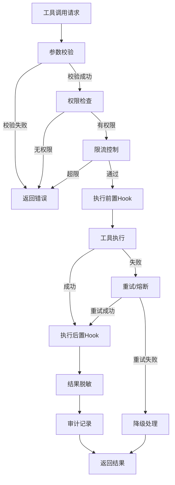
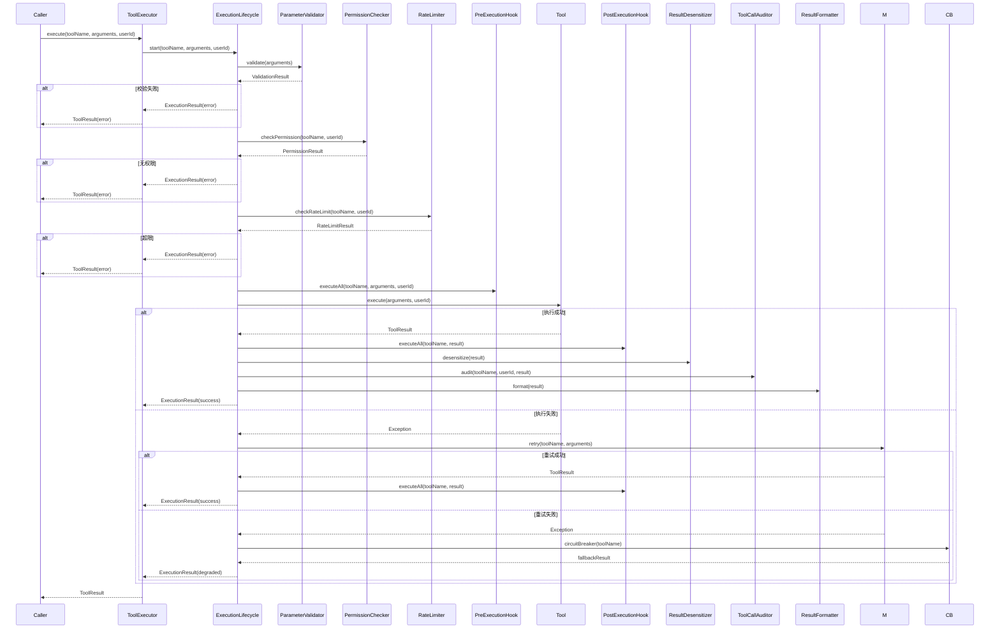
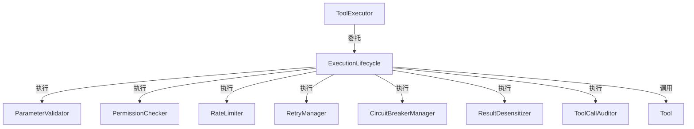
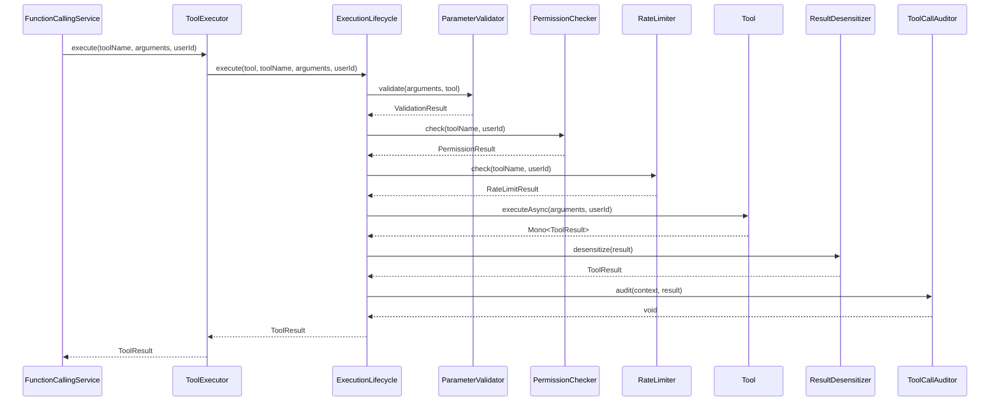
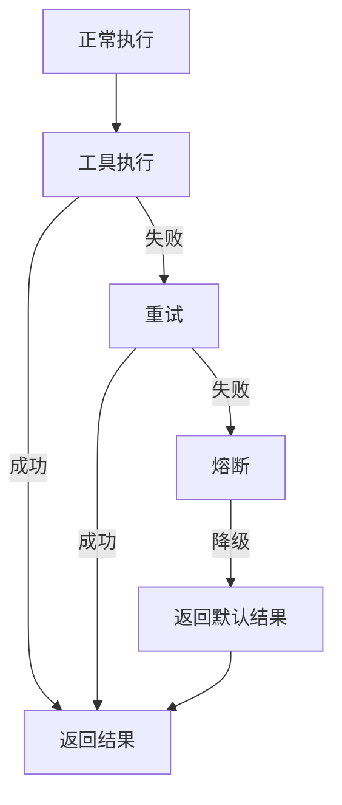
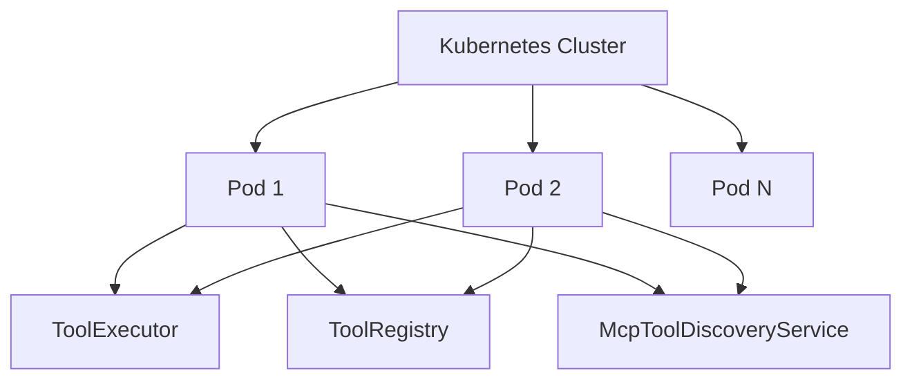
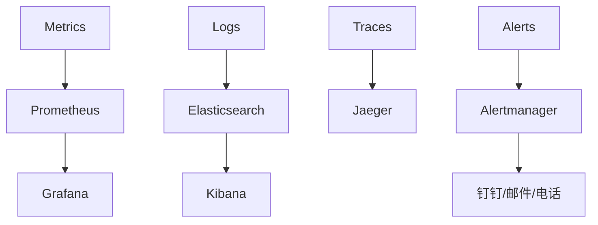

# Agent 工具调用执行引擎技术设计文档

## 文档信息

| 项目 | 内容 |
|------|------|
| **文档版本** | v1.0 |
| **创建日期** | 2026-07-14 |
| **适用项目** | CampusShare Agent |
| **模块名称** | Tool Execution Engine |
| **设计目标** | 企业级工具调用执行引擎，支持执行生命周期管理、参数校验、权限控制、MCP集成、审计追踪 |

---

## 1. 范式反思：从简单执行到企业级执行引擎

### 1.1 当前架构分析

当前系统采用"注解驱动注册 + 简单执行"架构：

```mermaid
flowchart TD
    A[工具类] -->|@ToolDef注解| B[ToolRegistry]
    B -->|注册| C[工具Map]
    D[ToolExecutor] -->|getTool| C
    D -->|execute| A
    D -->|Metrics| E[MeterRegistry]
    D -->|CircuitBreaker| F[CircuitBreakerRegistry]
```

**核心特点：**
- 注解驱动的工具注册（`@ToolDef` + `@ToolParam`）
- 支持熔断和超时控制
- 基础Metrics采集
- MCP协议集成（`McpToolDiscoveryService` + `McpToolAdapter`）
- 权限矩阵（`ToolPermissionMatrix`）

### 1.2 企业级差距分析

| 缺失能力 | 影响 | 大厂实践 |
|----------|------|---------|
| **执行生命周期管理** | 缺少统一的执行流程，难以扩展 | LangChain Runnable、Haystack Pipeline |
| **参数校验** | 参数校验不完善，仅支持基本类型 | JSR-303 Bean Validation |
| **结果脱敏** | 工具返回敏感信息可能泄露 | 输出脱敏、敏感信息过滤 |
| **工具调用审计** | 缺少完整的审计日志 | 操作审计、访问审计 |
| **重试机制** | 仅熔断无重试，临时故障无法恢复 | Resilience4j Retry |
| **异步执行** | McpToolAdapter使用block()阻塞 | 纯Reactive实现 |
| **工具版本管理** | 工具定义无法版本化 | SemVer版本管理 |
| **执行上下文传递** | 缺少跨工具的上下文传递机制 | Context对象 |

### 1.3 现代范式：执行引擎

**核心思想：** 将工具调用从简单的方法执行提升为完整的执行生命周期管理。



**执行引擎能力：**
1. **生命周期管理**：统一的执行流程，支持Hook扩展
2. **参数校验**：基于JSR-303的完整参数校验
3. **权限控制**：基于权限矩阵的细粒度权限检查
4. **限流控制**：每工具、每用户的限流
5. **重试熔断**：多级容错机制
6. **结果脱敏**：敏感信息自动过滤
7. **审计追踪**：完整的操作日志

### 1.4 本项目的选择

**当前阶段：**
- ✅ 保留现有注解驱动注册机制
- ✅ 添加执行生命周期管理（Hook机制）
- ✅ 添加参数校验（JSR-303）
- ✅ 添加结果脱敏
- ✅ 添加工具调用审计
- ✅ 修复McpToolAdapter的block()问题

**未来阶段：**
- ✅ 工具版本管理
- ✅ 执行上下文传递
- ✅ 工具链编排

---

## 2. 需求分析

### 2.1 业务目标

| 目标 | 描述 |
|------|------|
| **安全执行** | 工具调用经过完整的安全检查 |
| **可靠执行** | 支持重试、熔断、降级 |
| **可审计** | 记录所有工具调用操作 |
| **可扩展** | 支持Hook扩展、工具动态注册 |
| **性能优化** | 异步执行、并行调用 |
| **成本控制** | 限流、配额管理 |

### 2.2 流量特征

| 指标 | 当前值 | 目标值 |
|------|--------|--------|
| 工具调用量 | 50 QPS | 5000 QPS |
| 工具数量 | 3个 | 50个 |
| MCP工具数量 | 0个 | 100个 |
| 平均执行延迟 | 500ms | 300ms |

### 2.3 非功能要求

| 要求 | 值 |
|------|-----|
| P99延迟 | < 1000ms |
| 可用性 | 99.99% |
| 参数校验覆盖率 | 100% |
| 审计覆盖率 | 100% |
| 工具调用成功率 | > 99% |

### 2.4 合规要求

| 要求 | 说明 |
|------|------|
| 数据隐私 | 工具返回敏感信息需脱敏 |
| 访问控制 | 基于角色的权限控制 |
| 操作审计 | 记录所有工具调用 |
| 合规日志 | 保留90天 |

---

## 3. 容量规划

### 3.1 工具规模

| 类型 | 当前数量 | 1年目标 | 3年目标 |
|------|---------|--------|--------|
| 本地工具 | 3 | 20 | 50 |
| MCP工具 | 0 | 50 | 200 |
| 工具版本 | 1 | 100 | 500 |

### 3.2 存储规模

| 数据类型 | 估算大小 | 存储方案 |
|----------|---------|---------|
| 工具定义 | 10MB | Redis + MySQL |
| 工具调用日志 | 5GB/天 | Elasticsearch |
| 权限配置 | 1MB | MySQL |

### 3.3 缓存容量

| 缓存类型 | 条目数 | 内存需求 | TTL |
|----------|--------|---------|-----|
| 工具定义缓存 | 1000 | 500MB | 1小时 |
| 参数校验器缓存 | 100 | 100MB | 1天 |
| 权限配置缓存 | 100 | 50MB | 10分钟 |

### 3.4 服务器规模

| 阶段 | Agent服务 | Redis | MCP Server |
|------|-----------|-------|------------|
| 当前 | 2台 | 1台 | 0台 |
| 1年 | 10台 | 3台（Cluster） | 5台 |
| 3年 | 50台 | 12台（Cluster） | 20台 |

---

## 4. 现状分析

### 4.1 当前方案

**核心组件：**

| 组件 | 职责 | 评估 |
|------|------|------|
| Tool | 工具接口 | 保留，扩展异步方法 |
| ToolDef | 工具定义注解 | 保留，扩展字段 |
| ToolParam | 参数注解 | 保留，扩展校验支持 |
| ToolRegistry | 工具注册表 | 保留，扩展动态注册 |
| ToolExecutor | 工具执行器 | 重构，添加生命周期管理 |
| McpToolDiscoveryService | MCP工具发现 | 保留，优化发现流程 |
| McpToolAdapter | MCP工具适配 | 重构，移除block() |
| ToolPermissionMatrix | 权限矩阵 | 保留，扩展细粒度控制 |

**当前架构图：**

```mermaid
flowchart TB
    subgraph 工具定义层
        A[Tool接口]
        B[@ToolDef注解]
        C[@ToolParam注解]
    end
    subgraph 注册层
        D[ToolRegistry]
        E[McpToolDiscoveryService]
    end
    subgraph 执行层
        F[ToolExecutor]
        G[CircuitBreaker]
        H[Metrics]
    end
    subgraph 安全层
        I[ToolPermissionMatrix]
    end
    A --> B
    A --> C
    A --> D
    E --> D
    F --> D
    F --> G
    F --> H
    F --> I
```

### 4.2 问题清单

| 优先级 | 问题 | 影响 | 建议 |
|--------|------|------|------|
| P0 | McpToolAdapter使用block() | 阻塞EventLoop线程 | 重构为纯Reactive |
| P0 | 缺少参数校验 | 参数错误可能导致工具执行失败 | 添加JSR-303校验 |
| P1 | 缺少执行生命周期管理 | 难以扩展前置/后置处理 | 添加Hook机制 |
| P1 | 缺少结果脱敏 | 敏感信息可能泄露 | 添加脱敏服务 |
| P1 | 缺少工具调用审计 | 无法追溯操作 | 添加审计服务 |
| P2 | 缺少重试机制 | 临时故障无法恢复 | 添加Resilience4j Retry |
| P2 | 工具定义无法版本化 | 工具变更无追溯 | 添加版本管理 |

---

## 5. 业界方案调研

### 5.1 工具执行框架对比

| 框架 | 原理 | 优势 | 劣势 | 适用场景 |
|------|------|------|------|----------|
| **LangChain Runnable** | 链式调用，支持中间件 | 灵活，支持多种模式 | Python生态 | 研究/原型 |
| **Haystack Pipeline** | 组件化管道 | 模块化，可插拔 | Python生态 | 研究/原型 |
| **Spring Cloud Function** | 函数即服务 | 云原生，可扩展 | 复杂 | 企业级 |
| **自研执行引擎** | 自定义生命周期管理 | 完全可控，轻量 | 开发成本 | 企业级 |

### 5.2 参数校验方案对比

| 方案 | 原理 | 优势 | 劣势 |
|------|------|------|------|
| **JSR-303** | 注解驱动校验 | 标准，生态成熟 | 需要定义DTO |
| **JSON Schema** | JSON格式校验 | 灵活，无需DTO | 性能较差 |
| **自定义校验器** | 编程式校验 | 灵活 | 开发成本高 |

### 5.3 权限控制方案对比

| 方案 | 原理 | 优势 | 劣势 |
|------|------|------|------|
| **RBAC** | 角色基于访问控制 | 简单，易管理 | 不够细粒度 |
| **ABAC** | 属性基于访问控制 | 细粒度，灵活 | 复杂，性能差 |
| **混合模式** | RBAC + ABAC | 平衡简单和灵活 | 实现复杂 |

### 5.4 大厂实践案例

| 公司 | 方案 | 特点 |
|------|------|------|
| **OpenAI** | Function Calling | 原生支持工具调用，参数校验 |
| **Anthropic** | Tool Use API | 支持多轮工具调用，结果解析 |
| **Google** | Function Calling | 支持结构化输出，参数校验 |
| **字节跳动** | 自研执行引擎 | 完整生命周期管理，权限控制 |
| **阿里巴巴** | 工具平台 | 工具注册、版本管理、执行监控 |

---

## 6. 方案设计

### 6.1 架构设计

**新架构：**

```mermaid
flowchart TB
    subgraph 工具定义层
        A[Tool接口]
        B[@ToolDef注解]
        C[@ToolParam注解]
        D[ToolDTO]
    end
    
    subgraph 注册层
        E[ToolRegistry]
        F[McpToolDiscoveryService]
        G[ToolDefinitionCache]
    end
    
    subgraph 执行引擎层
        H[ToolExecutor]
        I[ExecutionLifecycle]
        J[ParameterValidator]
        K[PermissionChecker]
        L[RateLimiter]
        M[RetryManager]
        N[CircuitBreakerManager]
    end
    
    subgraph 后处理层
        O[ResultDesensitizer]
        P[ToolCallAuditor]
        Q[ResultFormatter]
    end
    
    subgraph 扩展层
        R[PreExecutionHook]
        S[PostExecutionHook]
        T[ErrorHook]
    end
    
    A --> B
    A --> C
    A --> D
    A --> E
    F --> E
    E --> G
    H --> I
    I --> J
    I --> K
    I --> L
    I --> R
    I -->|执行| A
    I --> M
    I --> N
    I --> S
    I --> O
    O --> P
    P --> Q
    I --> T
```

**模块职责：**

| 模块 | 职责 | 说明 |
|------|------|------|
| Tool | 工具接口 | 定义工具执行方法 |
| @ToolDef | 工具定义注解 | 工具元信息 |
| @ToolParam | 参数注解 | 参数元信息 |
| ToolDTO | 参数校验DTO | JSR-303校验 |
| ToolRegistry | 工具注册表 | 工具注册与发现 |
| McpToolDiscoveryService | MCP工具发现 | 远程工具发现 |
| ToolDefinitionCache | 工具定义缓存 | Redis缓存 |
| ToolExecutor | 工具执行器 | 统一执行入口 |
| ExecutionLifecycle | 执行生命周期 | 管理执行流程 |
| ParameterValidator | 参数校验器 | JSR-303校验 |
| PermissionChecker | 权限检查器 | 基于权限矩阵 |
| RateLimiter | 限流控制器 | 每工具/每用户 |
| RetryManager | 重试管理器 | Resilience4j Retry |
| CircuitBreakerManager | 熔断管理器 | Resilience4j CircuitBreaker |
| ResultDesensitizer | 结果脱敏器 | 敏感信息过滤 |
| ToolCallAuditor | 工具调用审计器 | 操作日志记录 |
| ResultFormatter | 结果格式化器 | 统一结果格式 |
| PreExecutionHook | 前置Hook | 执行前处理 |
| PostExecutionHook | 后置Hook | 执行后处理 |
| ErrorHook | 错误Hook | 错误处理 |

### 6.2 执行生命周期

**执行流程图：**



**生命周期阶段：**

| 阶段 | 组件 | 职责 | 失败处理 |
|------|------|------|---------|
| 参数校验 | ParameterValidator | JSR-303校验 | 返回VALIDATION_ERROR |
| 权限检查 | PermissionChecker | 角色权限验证 | 返回PERMISSION_DENIED |
| 限流检查 | RateLimiter | 配额验证 | 返回RATE_LIMIT_EXCEEDED |
| 前置Hook | PreExecutionHook | 执行前处理 | 返回HOOK_ERROR |
| 工具执行 | Tool | 实际执行 | 触发重试/熔断 |
| 重试 | RetryManager | 自动重试 | 触发熔断 |
| 熔断 | CircuitBreakerManager | 降级处理 | 返回CIRCUIT_OPEN |
| 后置Hook | PostExecutionHook | 执行后处理 | 记录日志 |
| 结果脱敏 | ResultDesensitizer | 敏感信息过滤 | 记录警告 |
| 审计记录 | ToolCallAuditor | 操作日志 | 异步记录 |
| 结果格式化 | ResultFormatter | 统一格式 | 返回原始结果 |

### 6.3 数据模型

**工具定义扩展：**

```java
@Data
@Builder
public class ToolDefinition {
    private String name;
    private String description;
    private List<String> intents;
    private boolean readOnly;
    private int timeoutMs;
    private Map<String, Object> parametersSchema;
    private String version;
    private String category;
    private String owner;
    private boolean enabled;
    private List<String> allowedRoles;
    private int rateLimitPerMinute;
    private int maxDailyUsage;
}
```

**执行上下文：**

```java
@Data
@Builder
public class ExecutionContext {
    private String toolName;
    private String userId;
    private String sessionId;
    private String traceId;
    private Map<String, Object> arguments;
    private long startTime;
    private long endTime;
    private String status;
    private String errorCode;
    private String errorMessage;
    private int retryCount;
    private boolean circuitBreakerTriggered;
    private boolean rateLimited;
    private Map<String, Object> metadata;
}
```

**工具调用审计记录：**

```java
@Data
@Builder
public class ToolCallAudit {
    private String id;
    private String toolName;
    private String toolVersion;
    private String userId;
    private String userRole;
    private String sessionId;
    private String traceId;
    private Map<String, Object> arguments;
    private ToolResult result;
    private long latencyMs;
    private int retryCount;
    private boolean success;
    private String errorCode;
    private LocalDateTime timestamp;
}
```

### 6.4 API设计

**工具注册接口：**

| 方法 | 路径 | 描述 |
|------|------|------|
| POST | /api/agent/tools | 注册新工具 |
| GET | /api/agent/tools | 获取工具列表 |
| GET | /api/agent/tools/{name} | 获取工具详情 |
| PUT | /api/agent/tools/{name} | 更新工具定义 |
| DELETE | /api/agent/tools/{name} | 删除工具 |
| POST | /api/agent/tools/{name}/enable | 启用工具 |
| POST | /api/agent/tools/{name}/disable | 禁用工具 |

**工具执行接口：**

| 方法 | 路径 | 描述 |
|------|------|------|
| POST | /api/agent/tools/execute | 执行工具 |
| POST | /api/agent/tools/batch-execute | 批量执行工具 |

**工具调用审计接口：**

| 方法 | 路径 | 描述 |
|------|------|------|
| GET | /api/agent/audit/tool-calls | 查询工具调用记录 |
| GET | /api/agent/audit/tool-calls/{id} | 获取工具调用详情 |
| GET | /api/agent/audit/tool-calls/stats | 获取工具调用统计 |

### 6.5 关键实现

#### 6.5.1 Tool接口改造方案

**问题分析：** 现有`Tool`接口的`execute()`是同步方法，`McpToolAdapter`在`execute()`中调用`.block()`阻塞EventLoop线程，这是WebFlux反模式。

**改造方案：** 在`Tool`接口中添加异步方法`executeAsync()`，现有同步工具通过默认实现包装为`Mono`，MCP工具直接实现异步版本。

```java
public interface Tool {
    ToolResult execute(Map<String, Object> arguments, String userId);

    default Mono<ToolResult> executeAsync(Map<String, Object> arguments, String userId) {
        return Mono.fromCallable(() -> execute(arguments, userId))
                .subscribeOn(Schedulers.boundedElastic());
    }

    default String getName() {
        ToolDef def = this.getClass().getAnnotation(ToolDef.class);
        return def != null ? def.name() : this.getClass().getSimpleName();
    }

    default boolean isReadOnly() {
        ToolDef def = this.getClass().getAnnotation(ToolDef.class);
        return def == null || def.readOnly();
    }

    default List<Intent> getApplicableIntents() {
        ToolDef def = this.getClass().getAnnotation(ToolDef.class);
        if (def == null) return List.of();
        return Arrays.stream(def.intent())
                .map(Intent::valueOf)
                .toList();
    }

    default Class<?> getParameterClass() {
        return null;
    }
}
```

**向后兼容策略：**
- 现有同步工具（如`SearchPostsTool`）无需修改，默认实现会自动包装为异步
- MCP工具（`McpToolAdapter`）重写`executeAsync()`方法，直接返回`Mono`
- 新工具可以选择实现同步或异步版本

#### 6.5.2 ToolRegistry公开注册API（替代反射hack）

**问题分析：** `McpToolDiscoveryService`使用反射访问`ToolRegistry`的私有字段（`toolMap`/`definitionMap`），这是严重的设计缺陷。

**改造方案：** 在`ToolRegistry`中添加公开的注册API。

```java
@Component
public class ToolRegistry {

    private final Map<String, Tool> toolMap = new ConcurrentHashMap<>();
    private final Map<String, ToolDefinition> definitionMap = new ConcurrentHashMap<>();

    public synchronized boolean registerTool(String name, Tool tool, ToolDefinition definition) {
        if (toolMap.containsKey(name)) {
            log.warn("Tool already registered: {}", name);
            return false;
        }
        if (!definition.readOnly()) {
            throw new IllegalStateException(
                    "Write operation tools are not allowed: " + name);
        }
        toolMap.put(name, tool);
        definitionMap.put(name, definition);
        log.info("Registered tool: {}", name);
        return true;
    }

    public synchronized boolean unregisterTool(String name) {
        Tool removed = toolMap.remove(name);
        if (removed != null) {
            definitionMap.remove(name);
            log.info("Unregistered tool: {}", name);
            return true;
        }
        return false;
    }

    public Tool getTool(String name) {
        return toolMap.get(name);
    }

    public ToolDefinition getDefinition(String name) {
        return definitionMap.get(name);
    }

    public Set<String> getToolNames() {
        return Collections.unmodifiableSet(toolMap.keySet());
    }
}
```

**McpToolDiscoveryService改造：**

```java
@Slf4j
@Component
@RequiredArgsConstructor
public class McpToolDiscoveryService {

    private final McpClientManager mcpClientManager;
    private final ToolRegistry toolRegistry;

    private Mono<Integer> discoverServerTools(String serverName) {
        return mcpClientManager.listTools(serverName)
                .map(tools -> {
                    int registered = 0;
                    for (McpProtocol.Tool mcpTool : tools) {
                        try {
                            McpToolAdapter adapter = new McpToolAdapter(
                                    serverName, mcpTool, mcpClientManager);
                            
                            ToolRegistry.ToolDefinition definition = new ToolRegistry.ToolDefinition(
                                    mcpTool.getName(),
                                    mcpTool.getDescription(),
                                    List.of(),
                                    true,
                                    10000,
                                    mcpTool.getInputSchema() != null 
                                            ? mcpTool.getInputSchema() 
                                            : Map.of()
                            );
                            
                            if (toolRegistry.registerTool(mcpTool.getName(), adapter, definition)) {
                                registered++;
                            }
                        } catch (Exception e) {
                            log.warn("Failed to register MCP tool: {}/{}", serverName, mcpTool.getName(), e);
                        }
                    }
                    return registered;
                });
    }
}
```

#### 6.5.3 ToolExecutor与ExecutionLifecycle关系设计

**关系定义：**



**设计原则：**
- `ToolExecutor`：统一执行入口，负责工具查找、初始化执行上下文
- `ExecutionLifecycle`：管理完整执行生命周期，协调各个组件

**ToolExecutor改造：**

```java
@Component
@RequiredArgsConstructor
public class ToolExecutor {

    private final ToolRegistry toolRegistry;
    private final ExecutionLifecycle executionLifecycle;
    private final MeterRegistry meterRegistry;

    private final Map<String, Timer> timers = new ConcurrentHashMap<>();

    public Mono<ToolResult> execute(String toolName, Map<String, Object> arguments, String userId) {
        Tool tool = toolRegistry.getTool(toolName);
        if (tool == null) {
            return Mono.just(ToolResult.error("TOOL_NOT_FOUND", "Unknown tool: " + toolName));
        }

        Timer.Sample sample = Timer.start(meterRegistry);
        
        return executionLifecycle.execute(tool, toolName, arguments, userId)
                .doOnNext(result -> {
                    Timer timer = timers.computeIfAbsent(toolName, 
                            name -> Timer.builder("agent.tool.latency")
                                    .tag("tool", name)
                                    .register(meterRegistry));
                    sample.stop(timer);
                });
    }
}
```

#### 6.5.4 FunctionCallingService与ExecutionLifecycle集成方案

**完整调用链路：**



**FunctionCallingService改造：**

```java
@Service
public class FunctionCallingService {

    private final DeepSeekClient deepSeekClient;
    private final ToolRegistry toolRegistry;
    private final ToolExecutor toolExecutor;

    public Mono<ToolCallResult> execute(String userId, String sessionId, String query) {
        return toolRegistry.getAllToolSchemas()
                .flatMap(toolSchemas -> {
                    return deepSeekClient.chatWithFunctions(query, toolSchemas)
                            .flatMap(response -> {
                                if (response.hasFunctionCall()) {
                                    String toolName = response.getFunctionName();
                                    Map<String, Object> arguments = response.getFunctionArguments();
                                    return toolExecutor.execute(toolName, arguments, userId)
                                            .map(result -> ToolCallResult.builder()
                                                    .toolName(toolName)
                                                    .result(result)
                                                    .build());
                                } else {
                                    return Mono.just(ToolCallResult.directAnswer(
                                            response.getContent()));
                                }
                            });
                });
    }
}
```

#### 6.5.5 PermissionChecker实现

```java
@Service
public class PermissionChecker {

    private final ToolPermissionMatrix permissionMatrix;

    public Mono<PermissionResult> check(String toolName, String userId) {
        return Mono.fromCallable(() -> {
            ToolPermissionMatrix.ToolPermission permission = permissionMatrix.getPermission(toolName);
            
            if (permission == null) {
                return PermissionResult.denied("No permission defined for tool: " + toolName);
            }
            
            if (!permission.isRequiresAuth()) {
                return PermissionResult.allowed();
            }
            
            if (userId == null || userId.isBlank()) {
                return PermissionResult.denied("Authentication required");
            }
            
            String userRole = getUserRole(userId);
            
            if (permission.getAllowedRoles() == null || permission.getAllowedRoles().length == 0) {
                return PermissionResult.allowed();
            }
            
            for (String allowedRole : permission.getAllowedRoles()) {
                if (allowedRole.equalsIgnoreCase(userRole)) {
                    return PermissionResult.allowed();
                }
            }
            
            return PermissionResult.denied("User role not allowed");
        });
    }

    private String getUserRole(String userId) {
        return "USER";
    }
}

@Data
@Builder
public class PermissionResult {
    private boolean allowed;
    private String message;

    public static PermissionResult allowed() {
        return PermissionResult.builder().allowed(true).build();
    }

    public static PermissionResult denied(String message) {
        return PermissionResult.builder().allowed(false).message(message).build();
    }
}
```

#### 6.5.6 RateLimiter实现

```java
@Service
public class RateLimiter {

    private final ToolPermissionMatrix permissionMatrix;
    private final StringRedisTemplate redisTemplate;

    public Mono<RateLimitResult> check(String toolName, String userId) {
        return Mono.fromCallable(() -> {
            ToolPermissionMatrix.ToolPermission permission = permissionMatrix.getPermission(toolName);
            
            if (permission == null || permission.getRateLimitPerMinute() <= 0) {
                return RateLimitResult.allowed();
            }
            
            int limit = permission.getRateLimitPerMinute();
            String key = "rate:limit:" + toolName + ":" + userId;
            
            Long count = redisTemplate.opsForValue().increment(key);
            if (count == 1) {
                redisTemplate.expire(key, Duration.ofMinutes(1));
            }
            
            if (count > limit) {
                return RateLimitResult.denied("Rate limit exceeded: " + limit + "/minute");
            }
            
            return RateLimitResult.allowed();
        });
    }
}

@Data
@Builder
public class RateLimitResult {
    private boolean allowed;
    private String message;

    public static RateLimitResult allowed() {
        return RateLimitResult.builder().allowed(true).build();
    }

    public static RateLimitResult denied(String message) {
        return RateLimitResult.builder().allowed(false).message(message).build();
    }
}
```

#### 6.5.7 ExecutionLifecycle（执行生命周期管理）

```java
@Service
public class ExecutionLifecycle {

    private final ParameterValidator parameterValidator;
    private final PermissionChecker permissionChecker;
    private final RateLimiter rateLimiter;
    private final List<PreExecutionHook> preHooks;
    private final List<PostExecutionHook> postHooks;
    private final List<ErrorHook> errorHooks;
    private final ResultDesensitizer resultDesensitizer;
    private final ToolCallAuditor toolCallAuditor;
    private final ResultFormatter resultFormatter;
    private final RetryManager retryManager;
    private final CircuitBreakerManager circuitBreakerManager;

    public Mono<ToolResult> execute(Tool tool, String toolName, 
                                    Map<String, Object> arguments, String userId) {
        ExecutionContext context = buildContext(toolName, userId, arguments);
        
        return parameterValidator.validate(arguments, tool)
                .flatMap(validationResult -> {
                    if (!validationResult.isValid()) {
                        return Mono.just(ToolResult.error("VALIDATION_ERROR", 
                                validationResult.getMessage()));
                    }
                    return permissionChecker.check(toolName, userId);
                })
                .flatMap(permissionResult -> {
                    if (!permissionResult.isAllowed()) {
                        return Mono.just(ToolResult.error("PERMISSION_DENIED", 
                                "Permission denied"));
                    }
                    return rateLimiter.check(toolName, userId);
                })
                .flatMap(rateLimitResult -> {
                    if (!rateLimitResult.isAllowed()) {
                        return Mono.just(ToolResult.error("RATE_LIMIT_EXCEEDED", 
                                "Rate limit exceeded"));
                    }
                    return executePreHooks(toolName, arguments, userId);
                })
                .flatMap(ignored -> executeToolWithRetry(tool, arguments, userId, context))
                .flatMap(result -> {
                    context.setStatus("SUCCESS");
                    return executePostHooks(toolName, result)
                            .then(Mono.just(result));
                })
                .flatMap(resultDesensitizer::desensitize)
                .flatMap(result -> {
                    toolCallAuditor.audit(context, result).subscribe();
                    return Mono.just(result);
                })
                .flatMap(resultFormatter::format)
                .onErrorResume(e -> {
                    context.setStatus("ERROR");
                    context.setErrorMessage(e.getMessage());
                    return executeErrorHooks(toolName, e)
                            .then(Mono.just(ToolResult.error("EXECUTION_ERROR", e.getMessage())));
                });
    }

    private Mono<ToolResult> executeToolWithRetry(Tool tool, Map<String, Object> arguments, 
                                                  String userId, ExecutionContext context) {
        return retryManager.execute(tool.getName(), () -> {
            return circuitBreakerManager.execute(tool.getName(), () -> {
                return Mono.fromCallable(() -> tool.execute(arguments, userId))
                        .subscribeOn(Schedulers.boundedElastic());
            });
        })
        .doOnNext(result -> context.setRetryCount(retryManager.getRetryCount()));
    }
}
```

#### 6.5.2 ParameterValidator（参数校验）

```java
@Service
public class ParameterValidator {

    private final Validator validator;

    public Mono<ValidationResult> validate(Map<String, Object> arguments, Tool tool) {
        Class<?> paramClass = tool.getParameterClass();
        if (paramClass == null) {
            return Mono.just(ValidationResult.valid());
        }

        return Mono.fromCallable(() -> {
            Object paramInstance = convertArguments(arguments, paramClass);
            Set<ConstraintViolation<Object>> violations = validator.validate(paramInstance);
            
            if (violations.isEmpty()) {
                return ValidationResult.valid();
            }
            
            StringBuilder message = new StringBuilder();
            for (ConstraintViolation<Object> violation : violations) {
                message.append(violation.getPropertyPath())
                        .append(": ")
                        .append(violation.getMessage())
                        .append("; ");
            }
            return ValidationResult.invalid(message.toString());
        });
    }

    private Object convertArguments(Map<String, Object> arguments, Class<?> paramClass) {
        try {
            ObjectMapper mapper = new ObjectMapper();
            String json = mapper.writeValueAsString(arguments);
            return mapper.readValue(json, paramClass);
        } catch (Exception e) {
            throw new IllegalArgumentException("Failed to convert arguments", e);
        }
    }
}
```

#### 6.5.3 McpToolAdapter重构（移除block()）

```java
@Slf4j
@RequiredArgsConstructor
public class McpToolAdapter implements Tool {

    private final String serverName;
    private final McpProtocol.Tool toolDefinition;
    private final McpClientManager mcpClientManager;
    private final ObjectMapper objectMapper;

    @Override
    public Mono<ToolResult> executeAsync(Map<String, Object> arguments, String userId) {
        return mcpClientManager.callTool(serverName, toolDefinition.getName(), arguments)
                .map(result -> {
                    if (result.isError()) {
                        return ToolResult.error("MCP_TOOL_ERROR",
                                result.getContent() != null ? result.getContent().toString() : "Unknown MCP error");
                    }
                    return ToolResult.builder()
                            .status(ToolResult.Status.SUCCESS)
                            .summary("MCP tool " + toolDefinition.getName() + " executed successfully")
                            .data(result.getContent())
                            .build();
                })
                .onErrorResume(e -> {
                    log.error("MCP tool execution failed: {}/{}", serverName, toolDefinition.getName(), e);
                    return Mono.just(ToolResult.error("MCP_EXECUTION_ERROR", e.getMessage()));
                });
    }

    @Override
    public ToolResult execute(Map<String, Object> arguments, String userId) {
        return executeAsync(arguments, userId).block();
    }

    @Override
    public String getName() {
        return toolDefinition.getName();
    }

    @Override
    public boolean isReadOnly() {
        return true;
    }

    @Override
    public Class<?> getParameterClass() {
        return null;
    }
}
```

#### 6.5.4 ResultDesensitizer（结果脱敏）

```java
@Service
public class ResultDesensitizer {

    private final List<Desensitizer> desensitizers;

    public Mono<ToolResult> desensitize(ToolResult result) {
        if (result.getStatus() != ToolResult.Status.SUCCESS || result.getData() == null) {
            return Mono.just(result);
        }

        return Mono.fromCallable(() -> {
            Object data = result.getData();
            for (Desensitizer desensitizer : desensitizers) {
                data = desensitizer.desensitize(data);
            }
            return result.toBuilder().data(data).build();
        });
    }
}

public interface Desensitizer {
    Object desensitize(Object data);
}

@Component
public class PhoneDesensitizer implements Desensitizer {
    @Override
    public Object desensitize(Object data) {
        if (data instanceof String) {
            return ((String) data).replaceAll("(\\d{3})\\d{4}(\\d{4})", "$1****$2");
        }
        return data;
    }
}

@Component
public class EmailDesensitizer implements Desensitizer {
    @Override
    public Object desensitize(Object data) {
        if (data instanceof String) {
            return ((String) data).replaceAll("(\\w+)@(\\w+)\\.(\\w+)", "$1***@$2.$3");
        }
        return data;
    }
}
```

#### 6.5.5 ToolCallAuditor（工具调用审计）

```java
@Service
public class ToolCallAuditor {

    private final ToolCallAuditMapper auditMapper;
    private final StringRedisTemplate redisTemplate;

    public Mono<Void> audit(ExecutionContext context, ToolResult result) {
        ToolCallAudit audit = ToolCallAudit.builder()
                .id(UUID.randomUUID().toString())
                .toolName(context.getToolName())
                .userId(context.getUserId())
                .sessionId(context.getSessionId())
                .traceId(context.getTraceId())
                .arguments(context.getArguments())
                .result(result)
                .latencyMs(System.currentTimeMillis() - context.getStartTime())
                .retryCount(context.getRetryCount())
                .success(result.getStatus() == ToolResult.Status.SUCCESS)
                .errorCode(result.getErrorCode())
                .timestamp(LocalDateTime.now())
                .build();

        Mono<Void> dbRecord = Mono.fromRunnable(() -> auditMapper.insert(audit));

        Mono<Void> redisRecord = Mono.fromRunnable(() -> {
            String key = "tool:audit:stats:" + LocalDate.now();
            redisTemplate.opsForHash().increment(key, "total", 1);
            redisTemplate.opsForHash().increment(key, "tool:" + context.getToolName(), 1);
            if (result.getStatus() == ToolResult.Status.SUCCESS) {
                redisTemplate.opsForHash().increment(key, "success", 1);
            } else {
                redisTemplate.opsForHash().increment(key, "error", 1);
            }
        });

        return Mono.zip(dbRecord, redisRecord).then();
    }
}
```

#### 6.5.6 Hook机制

```java
public interface PreExecutionHook {
    int getOrder();
    Mono<Void> execute(String toolName, Map<String, Object> arguments, String userId);
}

public interface PostExecutionHook {
    int getOrder();
    Mono<Void> execute(String toolName, ToolResult result);
}

public interface ErrorHook {
    int getOrder();
    Mono<Void> execute(String toolName, Throwable error);
}

@Component
@Order(1)
public class LoggingPreHook implements PreExecutionHook {
    @Override
    public Mono<Void> execute(String toolName, Map<String, Object> arguments, String userId) {
        log.info("Executing tool: {} for user: {}", toolName, userId);
        return Mono.empty();
    }
}

@Component
@Order(1)
public class MetricsPostHook implements PostExecutionHook {
    @Override
    public Mono<Void> execute(String toolName, ToolResult result) {
        if (result.getStatus() == ToolResult.Status.SUCCESS) {
            successCounters.get(toolName).increment();
        } else {
            errorCounters.get(toolName).increment();
        }
        return Mono.empty();
    }
}
```

---

## 7. 可靠性设计

### 7.1 熔断策略

| 组件 | 熔断条件 | 恢复策略 |
|------|---------|---------|
| 工具执行 | 50%失败率 | 30秒后半开状态 |
| MCP工具执行 | 30%失败率 | 30秒后半开状态 |
| 参数校验 | 连续5次失败 | 1分钟后重试 |

### 7.2 重试机制

| 组件 | 重试次数 | 退避策略 | 抖动 |
|------|---------|---------|------|
| 工具执行 | 3次 | 指数退避 | 25% |
| MCP工具执行 | 2次 | 固定间隔1秒 | 0% |

### 7.3 降级机制



### 7.4 超时控制

| 操作 | 超时时间 |
|------|---------|
| 参数校验 | 100ms |
| 权限检查 | 50ms |
| 限流检查 | 50ms |
| 工具执行 | 10秒（可配置） |
| MCP工具执行 | 15秒 |
| 结果脱敏 | 100ms |

### 7.5 故障隔离

| 组件 | 隔离方式 |
|------|---------|
| 参数校验 | 内存隔离 |
| 权限检查 | 内存隔离 |
| 工具执行 | 线程池隔离 |
| MCP工具执行 | 独立线程池 |
| 结果脱敏 | 内存隔离 |

---

## 8. 性能优化

### 8.1 瓶颈分析

| 瓶颈 | 原因 | 影响 |
|------|------|------|
| 工具执行 | 外部服务调用 | 占总延迟70% |
| 参数校验 | 反射解析 | 占总延迟5% |
| 权限检查 | 数据库查询 | 占总延迟5% |
| 结果脱敏 | 正则匹配 | 占总延迟5% |

### 8.2 优化策略

| 策略 | 实现方式 | 预期收益 |
|------|---------|---------|
| 参数校验缓存 | Caffeine缓存校验器 | 校验延迟降低50% |
| 权限缓存 | Redis缓存权限配置 | 权限检查延迟降低90% |
| 异步审计 | 审计记录异步写入 | 不阻塞主流程 |
| 批量工具调用 | 并行执行多个工具 | 吞吐量提升3倍 |

### 8.3 性能指标

| 指标 | 目标值 |
|------|--------|
| P99延迟 | < 1000ms |
| P95延迟 | < 500ms |
| P50延迟 | < 200ms |
| 工具调用成功率 | > 99% |
| 吞吐量 | 10000 QPS |

### 8.4 性能测试

**压测方案：**
- 工具：k6
- 并发：100 → 500 → 1000 → 5000
- 持续时间：每个级别5分钟

**测试场景：**
| 场景 | 比例 | 预期延迟 |
|------|------|---------|
| 本地工具执行 | 60% | < 500ms |
| MCP工具执行 | 30% | < 1000ms |
| 参数校验失败 | 5% | < 100ms |
| 权限检查失败 | 5% | < 100ms |

---

## 9. 可观测性设计

### 9.1 链路追踪

**Trace结构：**

| Span | 名称 | 作用 |
|------|------|------|
| root | tool-execution | 工具执行总耗时 |
| child | parameter-validation | 参数校验耗时 |
| child | permission-check | 权限检查耗时 |
| child | rate-limit-check | 限流检查耗时 |
| child | pre-hooks | 前置Hook耗时 |
| child | tool-execute | 工具实际执行耗时 |
| child | retry | 重试次数 |
| child | circuit-breaker | 熔断状态 |
| child | post-hooks | 后置Hook耗时 |
| child | result-desensitization | 结果脱敏耗时 |
| child | audit | 审计记录耗时 |

### 9.2 指标监控

**核心指标：**

| 指标 | 类型 | 描述 |
|------|------|------|
| tool_execution_requests_total | Counter | 总工具调用数 |
| tool_execution_success_total | Counter | 成功调用数 |
| tool_execution_error_total | Counter | 失败调用数 |
| tool_execution_latency_seconds | Histogram | 工具执行延迟 |
| tool_execution_retry_total | Counter | 重试次数 |
| tool_execution_circuit_open_total | Counter | 熔断触发次数 |
| tool_execution_validation_failure_total | Counter | 参数校验失败次数 |
| tool_execution_permission_denied_total | Counter | 权限拒绝次数 |

**工具维度指标：**

| 指标 | 类型 | 标签 |
|------|------|------|
| tool_execution_by_tool | Counter | tool_name, status |
| tool_execution_latency_by_tool | Histogram | tool_name |
| tool_execution_rate_limit_by_tool | Counter | tool_name |

### 9.3 结构化日志

**日志格式：**

```json
{
    "timestamp": "2026-07-14T10:00:00.000Z",
    "level": "INFO",
    "traceId": "abc-123",
    "spanId": "def-456",
    "userId": "user-123",
    "sessionId": "session-456",
    "module": "tool-execution",
    "event": "tool_executed",
    "toolName": "search_posts",
    "toolVersion": "1.0",
    "status": "SUCCESS",
    "latencyMs": 350,
    "retryCount": 0,
    "circuitBreakerOpen": false,
    "arguments": {"query": "Python"},
    "errorCode": null,
    "errorMessage": null
}
```

### 9.4 异常监控

| 异常类型 | 监控方式 | 告警级别 |
|----------|---------|---------|
| 工具执行失败 | 错误率 > 5% | P1 |
| MCP工具执行失败 | 错误率 > 10% | P1 |
| 参数校验失败 | 错误率 > 20% | P2 |
| 权限拒绝 | 错误率 > 10% | P2 |
| 熔断触发 | 熔断次数 > 10次/分钟 | P1 |

### 9.5 业务监控

**业务指标：**

| 指标 | 目标 | 告警条件 |
|------|------|---------|
| 工具调用成功率 | > 99% | < 95% |
| 参数校验通过率 | > 95% | < 85% |
| 权限拒绝率 | < 5% | > 10% |
| 熔断触发率 | < 1% | > 5% |

---

## 10. 安全设计

### 10.1 参数防护

| 防护类型 | 实现方式 |
|----------|---------|
| 参数校验 | JSR-303 Bean Validation |
| 输入过滤 | SQL注入、XSS攻击过滤 |
| 参数白名单 | 限制允许的参数值 |
| 长度限制 | 最大参数长度 |

### 10.2 权限控制

**权限矩阵：**

| 工具 | 匿名用户 | 普通用户 | VIP用户 | 管理员 |
|------|---------|---------|--------|--------|
| search_posts | ✅ | ✅ | ✅ | ✅ |
| search_knowledge | ✅ | ✅ | ✅ | ✅ |
| navigate_to_page | ✅ | ✅ | ✅ | ✅ |
| admin_tool | ❌ | ❌ | ❌ | ✅ |

### 10.3 结果脱敏

| 脱敏类型 | 实现方式 |
|----------|---------|
| 手机号 | 138****1234 |
| 邮箱 | user***@example.com |
| 身份证 | 110****1234 |
| 银行卡 | 6222****1234 |
| 地址 | 北京市***区 |

### 10.4 安全审计

**审计日志：**

| 记录内容 | 存储方式 | 保留时间 |
|----------|---------|---------|
| 工具调用 | MySQL | 1年 |
| 工具调用统计 | Redis | 90天 |
| 安全事件 | Elasticsearch | 永久 |

### 10.5 安全扫描

| 扫描类型 | 工具 | 频率 |
|----------|------|------|
| SAST | SonarQube | 每次提交 |
| DAST | OWASP ZAP | 每周 |
| 依赖扫描 | Snyk | 每日 |

---

## 11. 运维设计

### 11.1 部署方案

**部署架构：**



**部署配置：**

| 配置 | 值 |
|------|-----|
| 副本数 | 2 |
| HPA | 2-10 |
| 资源请求 | 4C8G |
| 资源限制 | 8C16G |

### 11.2 配置管理

**配置中心：** Nacos / Spring Cloud Config

**配置项：**

| 配置 | 说明 | 示例值 |
|------|------|--------|
| tool.execution.timeout | 默认执行超时 | 10000ms |
| tool.retry.maxAttempts | 最大重试次数 | 3 |
| tool.circuitBreaker.failureRate | 熔断失败率阈值 | 50% |
| tool.rateLimit.enabled | 是否启用限流 | true |
| tool.desensitization.enabled | 是否启用脱敏 | true |

### 11.3 监控告警

**监控体系：**



**仪表盘：**

| 仪表盘 | 内容 |
|--------|------|
| 工具执行概览 | 请求量、延迟、错误率 |
| 工具调用统计 | 各工具调用次数、成功率 |
| 熔断状态 | 熔断触发次数、恢复状态 |
| 参数校验 | 校验通过率、失败原因 |
| 权限控制 | 权限拒绝率、角色分布 |

### 11.4 故障演练

**演练场景：**

| 场景 | 频率 | 目标 |
|------|------|------|
| 工具执行故障 | 每周 | 验证重试和熔断 |
| MCP服务故障 | 每月 | 验证降级策略 |
| 权限配置错误 | 每月 | 验证权限检查 |
| 全链路故障 | 每季度 | 验证整体可用性 |

---

## 12. 成本优化

### 12.1 成本构成

| 成本项 | 占比 | 优化方向 |
|--------|------|---------|
| 工具执行 | 50% | 缓存结果 |
| MCP服务调用 | 30% | 限流、缓存 |
| 存储 | 10% | 日志采样 |
| 其他 | 10% | 优化 |

### 12.2 优化策略

| 策略 | 预期收益 |
|------|---------|
| 工具结果缓存 | 减少30%工具调用 |
| MCP限流 | 控制成本 |
| 日志采样 | 减少50%存储成本 |

### 12.3 成本监控

**成本告警：**

| 阈值 | 级别 |
|------|------|
| 日成本 > 预算80% | WARNING |
| 日成本 > 预算100% | CRITICAL |

---

## 13. 风险评估

### 13.1 技术风险

| 风险 | 概率 | 影响 | 缓解措施 |
|------|------|------|----------|
| 工具执行超时 | 中 | 中 | 超时控制、熔断 |
| MCP服务不可用 | 低 | 高 | 降级策略 |
| 参数校验失败 | 低 | 低 | 详细错误信息 |
| 结果脱敏不完整 | 低 | 中 | 多重脱敏策略 |

### 13.2 业务风险

| 风险 | 概率 | 影响 | 缓解措施 |
|------|------|------|----------|
| 工具调用失败 | 中 | 中 | 重试、降级 |
| 权限配置错误 | 低 | 高 | 配置校验、审核 |
| 成本超支 | 低 | 中 | 限流、配额管理 |

### 13.3 安全风险

| 风险 | 概率 | 影响 | 缓解措施 |
|------|------|------|----------|
| 参数注入攻击 | 中 | 高 | 参数校验、输入过滤 |
| 敏感信息泄露 | 低 | 极高 | 结果脱敏 |
| 权限绕过 | 低 | 高 | 多重权限检查 |

---

## 14. 演进规划

### 14.1 阶段一：基础建设（0-3个月）

**目标：** 完成核心功能实现，达到生产可用

**主要任务：**
- [ ] 重构ExecutionLifecycle，添加执行生命周期管理
- [ ] 添加ParameterValidator，支持JSR-303校验
- [ ] 添加ResultDesensitizer，支持结果脱敏
- [ ] 添加ToolCallAuditor，支持工具调用审计
- [ ] 修复McpToolAdapter的block()问题
- [ ] 添加Hook机制，支持前置/后置处理

**性能目标：**
- P99 < 1000ms
- 工具调用成功率 > 99%
- 参数校验覆盖率 100%

### 14.2 阶段二：优化升级（3-6个月）

**目标：** 性能优化，智能化升级

**主要任务：**
- [ ] 添加RetryManager，支持自动重试
- [ ] 添加工具结果缓存
- [ ] 添加批量工具调用支持
- [ ] 添加工具版本管理
- [ ] 添加执行上下文传递

**性能目标：**
- P99 < 500ms
- 工具调用成功率 > 99.5%
- 缓存命中率 > 30%

### 14.3 阶段三：进阶功能（6-12个月）

**目标：** 高级功能，工具链编排

**主要任务：**
- [ ] 实现工具链编排（Tool Chain）
- [ ] 添加工具执行计划（Tool Plan）
- [ ] 支持并行工具调用
- [ ] 添加工具评估体系
- [ ] 实现工具市场

**性能目标：**
- P99 < 300ms
- 工具调用成功率 > 99.9%

### 14.4 阶段四：规模化（12-24个月）

**目标：** 大规模部署，全球多活

**主要任务：**
- [ ] MCP服务水平扩展
- [ ] 多Region部署
- [ ] AI驱动的工具选择
- [ ] 自动化工具测试
- [ ] 工具性能优化

**性能目标：**
- P99 < 200ms
- 工具调用成功率 > 99.99%

---

## 15. 附录

### 15.1 术语表

| 术语 | 定义 |
|------|------|
| Tool | 工具，Agent可以调用的外部能力 |
| ToolDef | 工具定义注解 |
| ToolParam | 参数定义注解 |
| ToolRegistry | 工具注册表 |
| ToolExecutor | 工具执行器 |
| ExecutionLifecycle | 执行生命周期管理 |
| MCP | Model Context Protocol，模型上下文协议 |
| Hook | 钩子，执行流程中的扩展点 |
| Desensitization | 脱敏，敏感信息过滤 |
| Audit | 审计，操作日志记录 |

### 15.2 参考资料

- [OpenAI Function Calling](https://platform.openai.com/docs/guides/function-calling)
- [Anthropic Tool Use](https://docs.anthropic.com/claude/docs/tool-use)
- [Resilience4j Documentation](https://resilience4j.readme.io/)
- [JSR-303 Bean Validation](https://beanvalidation.org/)

### 15.3 变更记录

| 版本 | 日期 | 变更内容 | 作者 |
|------|------|---------|------|
| v1.0 | 2026-07-14 | 初始版本 | Agent Design Team |

### 15.4 审批记录

| 审批阶段 | 审批人 | 审批日期 | 状态 |
|---------|--------|---------|------|
| 方案评审 | | | |
| 技术评审 | | | |
| 安全评审 | | | |