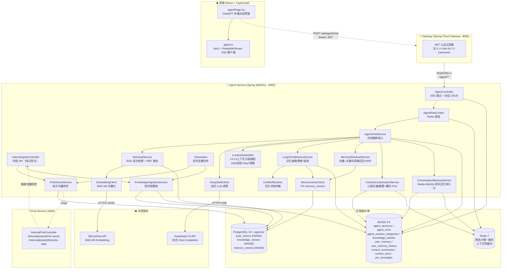
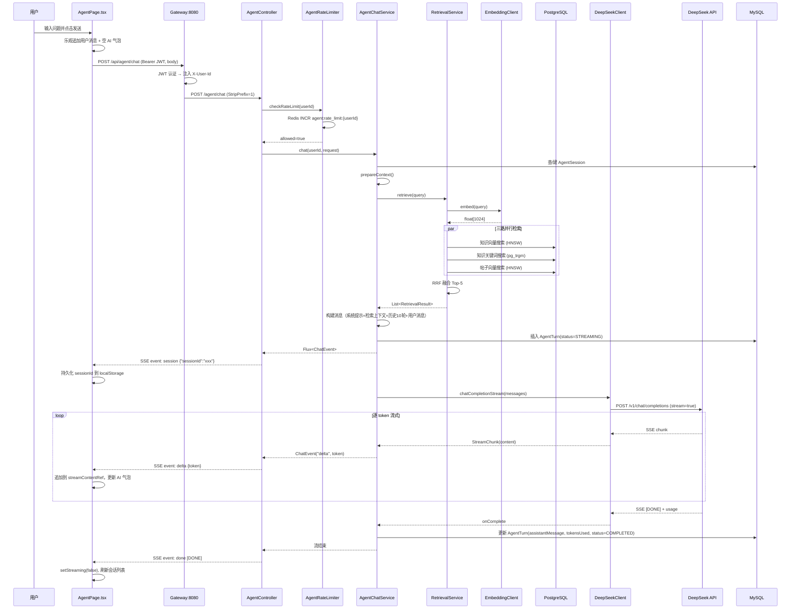
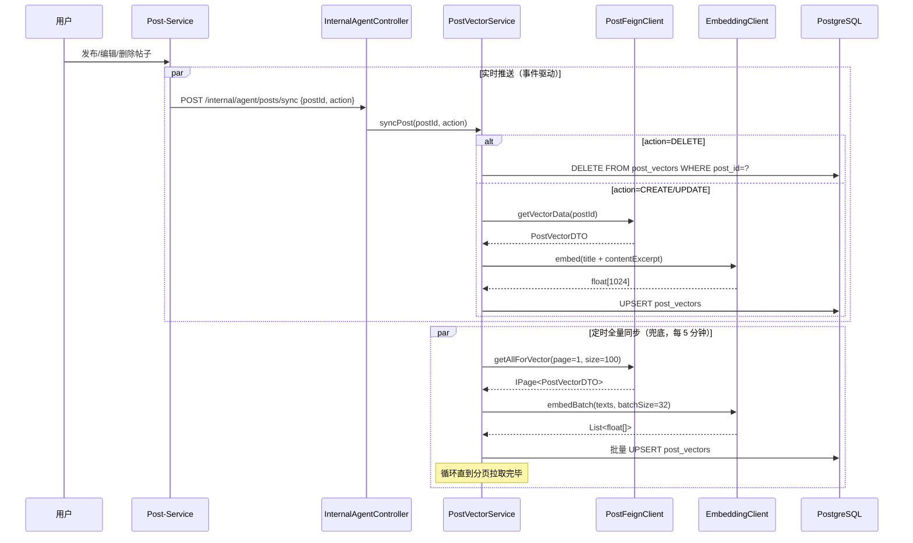

# CampusShare AI 智能助手模块架构文档

> 📄 本文档详细阐述 CampusShare 平台中 **AI 智能助手（Agent）模块** 的整体架构、已实现内容、嵌入方式与运作机制。
>
> 适用于：希望快速厘清 Agent 模块如何搭建与运作的开发者、面试官、技术评审。

---

## 📑 目录

- [一、模块定位与概览](#一模块定位与概览)
- [二、技术栈选型](#二技术栈选型)
- [三、整体架构图](#三整体架构图)
- [四、项目结构](#四项目结构)
- [五、后端架构详解](#五后端架构详解)
  - [5.1 模块入口与启动配置](#51-模块入口与启动配置)
  - [5.2 双数据源配置（MySQL + PostgreSQL）](#52-双数据源配置mysql--postgresql)
  - [5.3 SSE 流式对话链路](#53-sse-流式对话链路)
  - [5.4 RAG 混合检索](#54-rag-混合检索)
  - [5.5 向量存储层](#55-向量存储层)
  - [5.6 帖子向量同步](#56-帖子向量同步)
  - [5.7 知识库摄取](#57-知识库摄取)
  - [5.8 容错与限流](#58-容错与限流)
  - [5.9 会话与分类管理](#59-会话与分类管理)
  - [5.10 跨服务通信（Feign）](#510-跨服务通信feign)
  - [5.11 上下文工程（Context Engineering）](#511-上下文工程context-engineering)
  - [5.12 长期记忆（Long-term Memory）](#512-长期记忆long-term-memory)
  - [5.13 记忆向量存储（MemoryVectorStore）](#513-记忆向量存储memoryvectorstore)
- [六、前端架构详解](#六前端架构详解)
  - [6.1 页面组件 AgentPage](#61-页面组件-agentpage)
  - [6.2 SSE 流式客户端](#62-sse-流式客户端)
  - [6.3 状态管理策略](#63-状态管理策略)
  - [6.4 Markdown 渲染与流式动画](#64-markdown-渲染与流式动画)
  - [6.5 滚动行为控制](#65-滚动行为控制)
  - [6.6 路由与导航入口](#66-路由与导航入口)
- [七、数据库设计](#七数据库设计)
- [八、部署架构](#八部署架构)
- [九、端到端请求流程](#九端到端请求流程)
- [十、已实现 vs 规划中](#十已实现-vs-规划中)
- [十一、参考文档](#十一参考文档)

---

## 一、模块定位与概览

CampusShare AI 智能助手（下称 **Agent 模块**）是平台的第 5 个顶层导航模块，定位为"统一智能入口"——让用户通过自然语言提问，即可获取平台使用指南、检索相关帖子、解答校园生活问题。

### 核心能力（已实现）

| 能力 | 说明 |
|------|------|
| 🤖 SSE 流式对话 | 基于 DeepSeek-V3 的打字机式问答，token 级实时下发 |
| 📚 RAG 知识库检索 | 18 篇平台使用文档向量化（pgvector），检索增强生成 |
| 📝 帖子向量检索 | 用户提问可检索相关帖子内容作为上下文 |
| 💬 多轮会话管理 | 会话列表、历史轮次、会话分类、归档、删除 |
| 🛡️ 容错与限流 | Resilience4j 熔断 + 重试，Redis 用户级限流（10 次/分钟） |
| 🔐 JWT 鉴权 | 复用网关 JWT，会话归属校验 |
| 🎨 Markdown 渲染 | 前端 react-markdown 渲染 AI 回复，支持代码块/列表/链接 |
| 🧠 上下文工程 | L0-L5六层上下文分层装载，Token预算动态分配（8K总预算/500输出预留），XML标签分层规范 |
| 📦 三级渐进压缩 | Rolling Summary + Slot Freezing + Pin Message，Redis+MySQL双写持久化 |
| 💾 长期记忆系统 | 用户画像跨会话沉淀，向量+关键词双路召回，冲突仲裁，差异化衰减+访问频率增强 |
| 🔍 记忆向量检索 | PostgreSQL/pgvector记忆向量存储，HNSW+pg_trgm双路召回+RRF融合 |
| 📝 审计历史 | user_memory_history记录所有记忆变更，支持回溯排查 |

### 在平台中的位置

```
前端底部导航 5 Tab：首页 | 🤖 AI助手 | 仓库 | 通知 | 我的
                          ↑
                    /agent 路由（需登录）
```

---

## 二、技术栈选型

Agent 模块的技术选型综合了 `docs/agent技术栈/` 下 11 份面试技术深度文档的学习成果与项目实际需求，最终落地为以下栈：

### 已实现技术栈

| 层级 | 技术 | 选型理由 | 对应学习文档 |
|------|------|----------|--------------|
| **LLM** | DeepSeek-V3 (`deepseek-chat`) | 中文强、成本极低（缓存命中 ¥0.1/M tokens）、OpenAI 兼容 API | [09-LLM基础原理与推理范式](./agent技术栈/09-LLM基础原理与推理范式/09-LLM基础原理与推理范式.html) |
| **Embedding** | BGE-M3 (BAAI/bge-m3, 1024 维) | 中英双语、稠密+稀疏+ColBERT 三模式，SiliconFlow 云 API | [10-Embedding与语义表示](./agent技术栈/10-Embedding与语义表示/10-Embedding与语义表示.html) |
| **向量数据库** | PostgreSQL 16 + pgvector | 轻量、SQL 友好、与业务库隔离；HNSW 索引支撑 ANN 检索 | [08-向量检索核心原理](./agent技术栈/08-向量检索核心原理/08-向量检索核心原理.html) |
| **RAG 模式** | Naive RAG + RRF 混合检索 | 三路并行（向量+关键词+帖子向量）+ RRF 融合，无需调权重 | [04-RAG检索增强生成](./agent技术栈/rag-retrieval-augmented-generation/rag-retrieval-augmented-generation.html) |
| **Prompt 工程** | 4 层结构（平台/任务/Few-shot/用户） | 固定前缀命中 DeepSeek 缓存，降本 90% | [11-Prompt Engineering](./agent技术栈/11-Prompt%20Engineering/11-Prompt%20Engineering.html) |
| **Web 框架** | Spring WebFlux (Reactor + Netty) | `Flux<ServerSentEvent>` 原生支撑 SSE 流式 | — |
| **ORM** | MyBatis-Plus（MySQL） + JdbcTemplate（PG） | 业务表用 MP 自动化，向量表用原生 JdbcTemplate | — |
| **容错** | Resilience4j + Spring Retry | 熔断器（50% 失败→30s 开路）+ 指数退避重试（3 次） | — |
| **限流** | Redis INCR + EXPIRE | 用户级 10 次/分钟，Redis 故障时 fail-open | — |
| **Token 计数** | TokenCounter工具类（jtokkit封装，全服务统一使用） | 本地估算，避免额外 LLM API 往返 | — |
| **上下文工程** | L0-L5分层 + XML标签 + Token预算动态分配 | 六层上下文装载，8K总预算，XML标签分层规范 | [06-记忆系统](./agent技术栈/06-记忆系统/06-记忆系统.html) |
| **长期记忆** | MySQL结构化存储 + pgvector向量检索 + RRF双路召回 + 差异化衰减 | 用户画像跨会话沉淀，冲突仲裁，访问频率增强 | [06-记忆系统](./agent技术栈/06-记忆系统/06-记忆系统.html) |
| **跨服务通信** | OpenFeign (feign-hc5) | 调用 post-service 获取帖子数据 | — |
| **可观测性** | Micrometer + Prometheus + OpenTelemetry | 指标采集 + 链路追踪 | — |

### 学习但未采用的技术（明确取舍）

| 技术 | 学习文档 | 不采用原因 |
|------|----------|------------|
| Milvus 向量数据库 | [01-Milvus向量数据库](./agent技术栈/milvus-vector-database/milvus-vector-database.html) | MVP 阶段数据量小（<50K 帖子），pgvector 足矣；待帖子 >500K 或 P95 >200ms 再迁移 |
| Agent 编排框架（LangGraph/AutoGen/CrewAI） | [02-Agent编排](./agent技术栈/agent-orchestration/agent-orchestration.html) | MVP 采用单 Agent + 直接 LLM 调用，无需多 Agent 协作 |
| Function Calling / Tool Use | [03-Agent调用](./agent技术栈/03-agent-invocation/03-agent-invocation.html) | L2工具Schema层已预留，待接入 |
| MCP 协议 | [05-MCP协议](./agent技术栈/05-mcp-protocol/05-mcp-protocol.html) | 评估阶段，未到落地时机 |
| Skill 技能系统 | [07-Skill技能系统](./agent技术栈/07-Skill技能系统/07-Skill技能系统.html) | 产品级扩展机制，MVP 不需要 |
| 长期记忆框架（Mem0/LangMem） | [06-记忆系统](./agent技术栈/06-记忆系统/06-记忆系统.html) | 已自研实现（MemoryVectorStore + MemoryRetrievalService + ConflictResolver） |

---

## 三、整体架构图



---

## 四、项目结构

### 4.1 后端 campushare-agent 模块

```
backend/campushare-agent/
├── pom.xml                                    # Maven 构建（父: campushare-backend）
├── src/main/
│   ├── java/com/campushare/agent/
│   │   ├── AgentApplication.java             # 🚀 启动类（@SpringBootApplication + @EnableRetry + @EnableScheduling）
│   │   ├── controller/
│   │   │   ├── AgentController.java          # SSE 对话端点 + 会话 CRUD
│   │   │   ├── AgentCategoryController.java  # 会话分类 CRUD
│   │   │   └── InternalAgentController.java  # 内部 API（绕过网关，接收 post-service 通知）
│   │   ├── service/
│   │   │   ├── AgentChatService.java         # ⭐ 对话编排核心（RAG + SSE 流式 + 持久化）
│   │   │   ├── RetrievalService.java         # ⭐ RAG 混合检索（3 路并行 + RRF 融合）
│   │   │   ├── PostVectorService.java        # 帖子向量同步（单条 + 全量）
│   │   │   ├── KnowledgeIngestionService.java# 知识库 .md 文件摄取
│   │   │   ├── AgentRateLimiter.java         # Redis 用户级限流（10 次/分钟）
│   │   │   ├── AgentSessionService(Impl).java# 会话 CRUD + 归属校验
│   │   │   ├── AgentSessionCategoryService(Impl).java
│   │   │   ├── ContextAssembler.java         # L0-L5分层装配
│   │   │   ├── ContextCompressionService.java# 三级渐进压缩
│   │   │   ├── ContextSnapshotService.java   # 上下文快照
│   │   │   ├── ConversationMemoryService.java# 对话记忆Redis+MySQL
│   │   │   ├── LongTermMemoryService.java    # 长期记忆抽取/衰减
│   │   │   ├── MemoryRetrievalService.java   # 记忆双路召回+RRF
│   │   │   ├── ConflictResolver.java         # 冲突仲裁
│   │   │   ├── IntentClassifier.java         # 意图分类
│   │   │   ├── IntentRouter.java             # 意图路由
│   │   │   ├── RuleShortCircuitFilter.java   # 规则短路过滤
│   │   │   ├── ConstitutionalAIValidator.java# 宪法AI校验
│   │   │   ├── PromptVersionManager.java     # Prompt版本管理
│   │   │   └── SessionStateMachine.java      # 会话状态机
│   │   ├── enums/
│   │   │   ├── MemoryType.java               # 记忆类型枚举
│   │   │   ├── MemorySource.java             # 记忆来源枚举
│   │   │   └── MemoryAction.java             # 记忆操作枚举
│   │   ├── util/
│   │   │   ├── TokenCounter.java             # jtokkit封装，统一Token计数
│   │   │   └── SchoolNameUtils.java          # 学校名称工具类
│   │   ├── config/
│   │   │   ├── PgVectorConfig.java           # ⭐ 双数据源配置（MySQL Primary + PG 辅）
│   │   │   ├── WebClientConfig.java          # DeepSeek WebClient（连接池 + 超时）
│   │   │   ├── EmbeddingWebClientConfig.java # SiliconFlow WebClient（独立连接池）
│   │   │   ├── ResilienceConfig.java         # ⭐ 3 个熔断器 + 1 个限流器
│   │   │   ├── MyMetaObjectHandler.java      # MyBatis-Plus 自动填充时间戳
│   │   │   ├── PostVectorScheduler.java      # 帖子向量定时全量同步（5 分钟）
│   │   │   └── KnowledgeScheduler.java       # 知识库定时重摄取（1 小时）
│   │   ├── llm/
│   │   │   ├── DeepSeekClient.java           # ⭐ DeepSeek 流式调用 + 熔断 + 重试
│   │   │   ├── DeepSeekRequest.java          # Chat 请求 DTO（含 stream_options.include_usage）
│   │   │   ├── DeepSeekResponse.java         # Chat 响应 DTO
│   │   │   ├── EmbeddingClient.java          # BGE-M3 embed + embedBatch
│   │   │   ├── EmbeddingRequest.java
│   │   │   └── EmbeddingResponse.java
│   │   ├── prompt/
│   │   │   ├── PromptConstants.java          # 系统提示词模板（含 {{RETRIEVAL_CONTEXT}} 占位符）
│   │   │   └── PromptAssembler.java          # Prompt组装器
│   │   ├── store/
│   │   │   ├── PostVectorStore.java          # PG post_vectors 表 CRUD + 相似度搜索
│   │   │   ├── KnowledgeVectorStore.java     # PG knowledge_vectors 表 CRUD + 相似度+关键词搜索
│   │   │   └── MemoryVectorStore.java        # PG memory_vectors 表 CRUD + 双路检索
│   │   ├── feign/
│   │   │   └── PostFeignClient.java          # Feign 调用 post-service 内部 API
│   │   ├── entity/
│   │   │   ├── AgentSession.java             # @TableName("agent_sessions")
│   │   │   ├── AgentTurn.java                # @TableName("agent_turns")
│   │   │   ├── AgentSessionCategory.java     # @TableName("agent_session_categories")
│   │   │   ├── KnowledgeArticle.java         # @TableName("knowledge_articles")
│   │   │   ├── UserMemory.java               # @TableName("user_memory")
│   │   │   ├── UserMemoryHistory.java        # @TableName("user_memory_history")
│   │   │   ├── ContextSummary.java           # @TableName("context_summaries")
│   │   │   ├── ContextSlot.java              # @TableName("context_slots")
│   │   │   └── PinMessage.java               # @TableName("pin_messages")
│   │   ├── dto/
│   │   │   ├── ChatRequest.java              # @NotBlank @Size(max=2000) message
│   │   │   ├── SessionCreateRequest.java
│   │   │   ├── SessionResponse.java
│   │   │   ├── TurnResponse.java
│   │   │   ├── CategoryCreateRequest.java
│   │   │   ├── CategoryRenameRequest.java
│   │   │   ├── CategoryResponse.java
│   │   │   ├── MoveSessionCategoryRequest.java
│   │   │   ├── RetrievalResult.java          # record(id, title, content, score, source, metadata)
│   │   │   ├── PostVectorDTO.java            # 帖子向量数据（与 post-service 对齐）
│   │   │   ├── PostVectorNotifyRequest.java  # postId + action(CREATE/UPDATE/DELETE)
│   │   │   ├── ContextLayer.java             # 上下文层定义
│   │   │   └── TokenBudget.java              # Token预算分配
│   │   └── mapper/
│   │       ├── AgentSessionMapper.java       # BaseMapper<AgentSession>
│   │       ├── AgentTurnMapper.java
│   │       ├── AgentSessionCategoryMapper.java
│   │       ├── KnowledgeArticleMapper.java
│   │       ├── UserMemoryMapper.java
│   │       ├── UserMemoryHistoryMapper.java
│   │       ├── ContextSummaryMapper.java
│   │       ├── ContextSlotMapper.java
│   │       └── PinMessageMapper.java
│   └── resources/
│       ├── application.yml                   # 本地开发配置
│       └── application-docker.yml            # Docker 部署配置
```

### 4.2 前端 Agent 相关文件

```
frontend/src/
├── pages/
│   └── AgentPage.tsx                         # ⭐ AI 助手页面（749 行，单一组件）
├── services/
│   └── agent.ts                              # ⭐ Agent API + SSE 流式客户端（160 行）
├── router/
│   └── index.tsx                             # /agent 路由注册（PrivateRoute + ErrorBoundary）
└── components/common/
    └── NavBar.tsx                            # 底部导航（AI助手 Tab，第 2 位）
```

### 4.3 数据库脚本

```
backend/docker/
├── mysql/
│   └── agent-init.sql                        # ⭐ Agent 模块 MySQL 表（12 张，手动执行）
└── postgres/
    └── init.sql                              # ⭐ PG pgvector 表 + HNSW 索引（自动执行）
```

### 4.4 知识库源文档

```
docs/agent-assistant/knowledge-docs/          # 18 篇 .md 平台使用文档
├── 01-auth/          # 注册/登录指南
├── 02-posts/         # 发帖/浏览指南
├── 03-interactions/  # 点赞/收藏/评论指南
├── 04-files/         # 文件上传/下载
├── 05-profile/       # 个人中心
├── 06-notifications/ # 通知中心
├── 07-agent/         # AI 助手使用指南
├── 08-categories/    # 分类广场
├── 09-platform/      # 平台介绍/功能总览/FAQ
└── 10-guidelines/    # 社区准则/用户角色
```

---

## 五、后端架构详解

### 5.1 模块入口与启动配置

**文件**：[AgentApplication.java](file:///e:/workspace_work/CampusShare/backend/campushare-agent/src/main/java/com/campushare/agent/AgentApplication.java)

```java
@SpringBootApplication(scanBasePackages = {
        "com.campushare.agent",
        "com.campushare.common.utils",
        "com.campushare.common.result",
        "com.campushare.common.constant"
})
@MapperScan("com.campushare.agent.mapper")
@EnableFeignClients(basePackages = "com.campushare.agent.feign")
@EnableRetry
@EnableScheduling
public class AgentApplication { ... }
```

**关键设计点**：

- ⚠️ `scanBasePackages` **刻意不扫描** `com.campushare.common.exception`，因为共享的 `GlobalExceptionHandler` 依赖 `jakarta.servlet` API，与 WebFlux 的 Reactor 栈冲突。
- `@EnableRetry` 启用 Spring Retry，配合 `@Retryable` 在 LLM 调用失败时自动重试。
- `@EnableScheduling` 启用定时任务（帖子向量全量同步、知识库重摄取）。

### 5.2 双数据源配置（MySQL + PostgreSQL）

**文件**：[PgVectorConfig.java](file:///e:/workspace_work/CampusShare/backend/campushare-agent/src/main/java/com/campushare/agent/config/PgVectorConfig.java)

Agent-Service 是项目中唯一使用**双数据源**的服务：MySQL 存业务状态，PostgreSQL+pgvector 存向量数据。

```java
@Configuration
public class PgVectorConfig {

    @Bean
    @Primary
    @ConfigurationProperties("spring.datasource")
    public DataSourceProperties mysqlDataSourceProperties() { 
        return new DataSourceProperties(); 
    }

    @Bean
    @Primary
    @Bean("dataSource")
    public DataSource mysqlDataSource() {
        return mysqlDataSourceProperties().initializeDataSourceBuilder().build();
    }

    @Bean
    @Bean("pgvectorDataSource")
    @ConfigurationProperties("app.datasource.pgvector")
    public DataSource pgvectorDataSource() {
        return DataSourceBuilder.create().build();
    }

    @Bean
    @Bean("pgvectorJdbcTemplate")
    public JdbcTemplate pgvectorJdbcTemplate(
            @Qualifier("pgvectorDataSource") DataSource dataSource) {
        return new JdbcTemplate(dataSource);
    }
}
```

**配置文件**（[application.yml](file:///e:/workspace_work/CampusShare/backend/campushare-agent/src/main/resources/application.yml)）：

```yaml
spring:
  datasource:                    # 主数据源（MySQL，MyBatis-Plus 自动配置使用）
    url: jdbc:mysql://localhost:3306/campushare
    username: campushare
    hikari:
      maximum-pool-size: 20
      minimum-idle: 5

app:                             # 自定义前缀，避免触发 Spring 数据源自动配置
  datasource:
    pgvector:                    # 辅数据源（PostgreSQL + pgvector）
      url: jdbc:postgresql://localhost:5432/agent_vectors
      username: agent
      password: ${AGENT_PG_PASSWORD:agent123456}
      hikari:
        maximum-pool-size: 10
        minimum-idle: 2
```

**设计要点**：
- MySQL 数据源标记 `@Primary`，让 MyBatis-Plus 自动配置正确识别。
- PostgreSQL 数据源使用自定义前缀 `app.datasource.pgvector`，**绕过 Spring 自动配置**，手动注入 `JdbcTemplate`。
- 两个 `*VectorStore` 类通过 `@Qualifier("pgvectorJdbcTemplate")` 注入 PG 连接。

### 5.3 SSE 流式对话链路

#### 5.3.1 Controller 端点

**文件**：[AgentController.java](file:///e:/workspace_work/CampusShare/backend/campushare-agent/src/main/java/com/campushare/agent/controller/AgentController.java)

```java
@PostMapping(value = "/chat", produces = MediaType.TEXT_EVENT_STREAM_VALUE)
public Flux<ServerSentEvent<String>> chat(
        @RequestHeader("Authorization") String token,
        @RequestBody ChatRequest request) {

    String userId = jwtUtils.getUserId(token.replace("Bearer ", ""));

    return rateLimiter.checkRateLimit(userId)
            .flatMapMany(allowed -> {
                if (!allowed) {
                    return Flux.just(ServerSentEvent.<String>builder()
                            .event("error")
                            .data("请求过于频繁，每分钟最多 10 次，请稍后再试")
                            .build());
                }
                return chatService.chat(userId, request)
                        .map(event -> ServerSentEvent.<String>builder()
                                .event(event.type())
                                .data(event.data())
                                .build())
                        .concatWith(Mono.fromSupplier(() -> ServerSentEvent.<String>builder()
                                .event("done")
                                .data("[DONE]")
                                .build()))
                        .onErrorResume(e -> {
                            log.error("Chat error", e);
                            return Flux.just(ServerSentEvent.<String>builder()
                                    .event("error")
                                    .data(e.getMessage() != null ? e.getMessage() : "服务异常")
                                    .build());
                        });
            });
}
```

**SSE 事件协议**：

| 事件类型 | 数据载荷 | 时机 |
|----------|----------|------|
| `session` | `{"sessionId":"uuid"}` | 流开始，下发会话 ID |
| `delta` | token 文本片段 | LLM 流式生成中（多次） |
| `done` | `[DONE]` | 流正常结束 |
| `error` | 错误消息 | 限流/异常 |

#### 5.3.2 ChatService 对话编排

**文件**：[AgentChatService.java](file:///e:/workspace_work/CampusShare/backend/campushare-agent/src/main/java/com/campushare/agent/service/AgentChatService.java)

`AgentChatService.chat()` 是整个模块的**编排核心**，串联 RAG 检索、LLM 调用、上下文构建、持久化：

```java
public Flux<ChatEvent> chat(String userId, ChatRequest request) {
    return Mono.fromCallable(() -> prepareContext(userId, request))
            .subscribeOn(Schedulers.boundedElastic())
            .flatMapMany(ctx -> {
                StringBuilder assistantContent = new StringBuilder();
                AtomicReference<DeepSeekResponse.Usage> usageRef = new AtomicReference<>();

                // 1. 下发 session 事件
                String sessionJson = "{\"sessionId\":\"" + ctx.session().getId() + "\"}";
                Flux<ChatEvent> sessionEvent = Flux.just(new ChatEvent("session", sessionJson));

                // 2. 流式调用 DeepSeek，逐 token 下发
                Flux<ChatEvent> deltaStream = deepSeekClient.chatCompletionStream(ctx.messages())
                        .doOnNext(chunk -> {
                            if (chunk.content() != null) assistantContent.append(chunk.content());
                            if (chunk.usage() != null) usageRef.set(chunk.usage());
                        })
                        .filter(chunk -> chunk.content() != null)
                        .map(chunk -> new ChatEvent("delta", chunk.content()))
                        .doFinally(signalType -> {
                            // 3. 流结束：持久化轮次（成功/失败分别处理）
                            long elapsed = System.currentTimeMillis() - ctx.startTime();
                            String content = assistantContent.toString();
                            Mono.fromRunnable(() -> {
                                if (signalType == SignalType.ON_COMPLETE) {
                                    completeTurn(ctx.turn(), ctx.session(), content, elapsed,
                                            usageRef.get(), ctx.promptTokens(), ctx.retrievalContext());
                                } else if (signalType == SignalType.ON_ERROR) {
                                    errorTurn(ctx.turn(), "Stream terminated with error");
                                }
                            }).subscribeOn(Schedulers.boundedElastic()).subscribe();
                        });

                return Flux.concat(sessionEvent, deltaStream);
            });
}
```

**`prepareContext()` 上下文准备流程**：

1. **获取/创建会话**：若 `request.sessionId()` 为空，则新建 `AgentSession`；否则校验归属。
2. **RAG 检索**：调用 `RetrievalService.retrieve(query)` 获取相关知识/帖子片段。
3. **构建消息列表**：系统提示词（注入检索上下文） + 最近 10 轮历史对话 + 当前用户消息。
4. **Token 计数**：使用 jtokkit 本地估算 prompt tokens。
5. **创建轮次记录**：插入 `agent_turns` 表，状态为 `STREAMING`。

**历史对话加载**（[AgentChatService.java](file:///e:/workspace_work/CampusShare/backend/campushare-agent/src/main/java/com/campushare/agent/service/AgentChatService.java) `buildMessages` 方法）：

```java
// 查询最近 10 轮已完成的对话（按 turn_number 倒序）
List<AgentTurn> recentTurns = agentTurnMapper.selectList(
    new LambdaQueryWrapper<AgentTurn>()
        .eq(AgentTurn::getSessionId, session.getId())
        .eq(AgentTurn::getStatus, "COMPLETED")
        .orderByDesc(AgentTurn::getTurnNumber)
        .last("LIMIT " + historyLimit));

// 反转为时间正序，交错拼装 user/assistant 消息
Collections.reverse(recentTurns);
for (AgentTurn t : recentTurns) {
    messages.add(Message.builder().role("user").content(t.getUserMessage()).build());
    messages.add(Message.builder().role("assistant").content(t.getAssistantMessage()).build());
}
```

#### 5.3.3 DeepSeek 流式客户端

**文件**：[DeepSeekClient.java](file:///e:/workspace_work/CampusShare/backend/campushare-agent/src/main/java/com/campushare/agent/llm/DeepSeekClient.java)

```java
public Flux<StreamChunk> chatCompletionStream(List<DeepSeekRequest.Message> messages) {
    DeepSeekRequest request = DeepSeekRequest.builder()
            .model(defaultModel)                    // deepseek-chat
            .messages(messages)
            .stream(true)
            .temperature(defaultTemperature)        // 0.7
            .maxTokens(defaultMaxTokens)            // 2048
            .streamOptions(DeepSeekRequest.StreamOptions.builder()
                    .includeUsage(true)             // ⭐ 流式返回 token 用量
                    .build())
            .build();

    return deepSeekWebClient.post()
            .uri("/v1/chat/completions")
            .bodyValue(request)
            .retrieve()
            .bodyToFlux(new ParameterizedTypeReference<ServerSentEvent<String>>() {})
            .filter(sse -> sse.data() != null)
            .mapNotNull(this::parseStreamChunk)
            .takeUntil(chunk -> "[DONE]".equals(chunk.content()))
            .filter(chunk -> !"[DONE]".equals(chunk.content()))
            .transform(CircuitBreakerOperator.of(deepSeekCircuitBreaker))  // ⭐ 熔断
            .retryWhen(Retry.backoff(maxRetryAttempts, Duration.ofMillis(retryBackoffMs))
                    .filter(this::isRetryable)                              // ⭐ 仅 5xx/超时/IO 重试
                    .doBeforeRetry(retrySignal ->
                            log.warn("Retrying DeepSeek stream, attempt {}", retrySignal.totalRetries() + 1))
            );
}
```

**关键设计**：
- `streamOptions.includeUsage=true`：让 DeepSeek 在流末尾返回 token 用量，用于成本统计。
- `CircuitBreakerOperator.of(...)`：Reactive 风格的熔断器，50% 失败率触发开路 30 秒。
- `Retry.backoff(3, 1s)`：指数退避重试，仅对 5xx/超时/IO 异常重试，4xx（鉴权/参数错误）不重试。

### 5.4 RAG 混合检索

**文件**：[RetrievalService.java](file:///e:/workspace_work/CampusShare/backend/campushare-agent/src/main/java/com/campushare/agent/service/RetrievalService.java)

检索服务实现了**三路并行混合检索 + RRF 融合**：

```java
public Mono<List<RetrievalResult>> retrieve(String query) {
    if (query == null || query.isBlank()) {
        return Mono.just(Collections.emptyList());
    }

    return embeddingClient.embed(query)        // 1. 用户问题向量化
            .map(queryVec -> {
                List<List<RetrievalResult>> retrievalLists = new ArrayList<>();

                // 2. 三路并行检索，每路独立容错
                try {
                    List<RetrievalResult> kv = knowledgeVectorStore.search(queryVec, topK);
                    if (!kv.isEmpty()) retrievalLists.add(kv);
                } catch (Exception e) {
                    log.warn("Knowledge vector search failed", e);
                }

                try {
                    List<RetrievalResult> kk = knowledgeVectorStore.keywordSearch(query, topK);
                    if (!kk.isEmpty()) retrievalLists.add(kk);
                } catch (Exception e) {
                    log.warn("Knowledge keyword search failed", e);
                }

                try {
                    List<RetrievalResult> pv = postVectorStore.search(queryVec, topK);
                    if (!pv.isEmpty()) retrievalLists.add(pv);
                } catch (Exception e) {
                    log.warn("Post vector search failed", e);
                }

                // 3. RRF 融合，返回 Top-5
                return rrfFusion(retrievalLists, rerankTopK);
            })
            .onErrorResume(e -> {
                log.warn("Retrieval failed, degrading to empty context", e);
                return Mono.just(Collections.emptyList());   // ⭐ 检索失败不中断对话
            });
}
```

**RRF（Reciprocal Rank Fusion）融合算法**：

```java
// score(d) = Σ 1/(k + rank_i(d))，k=60
// 无需调权重，对分数尺度不敏感
private List<RetrievalResult> rrfFusion(List<List<RetrievalResult>> lists, int topK) {
    Map<String, RetrievalResult> idToResult = new HashMap<>();
    Map<String, Double> idToScore = new HashMap<>();
    
    for (List<RetrievalResult> list : lists) {
        for (int rank = 0; rank < list.size(); rank++) {
            RetrievalResult r = list.get(rank);
            String key = r.source() + ":" + r.id();
            idToResult.putIfAbsent(key, r);
            idToScore.merge(key, 1.0 / (rrfK + rank + 1), Double::sum);
        }
    }
    
    return idToScore.entrySet().stream()
            .sorted(Map.Entry.<String, Double>comparingByValue().reversed())
            .limit(topK)
            .map(e -> idToResult.get(e.getKey()).withScore(e.getValue()))
            .toList();
}
```

**设计要点**：
- 三路检索**独立 try-catch**，任一路失败不影响其他路。
- 整体检索失败时返回空列表，**对话不中断**（降级为纯 LLM 对话）。
- RRF 融合无需调权重，对分数尺度不敏感，适合异构检索器融合。

### 5.5 向量存储层

#### 5.5.1 KnowledgeVectorStore

**文件**：[KnowledgeVectorStore.java](file:///e:/workspace_work/CampusShare/backend/campushare-agent/src/main/java/com/campushare/agent/store/KnowledgeVectorStore.java)

提供两种检索方式：**向量相似度检索**（pgvector `<=>` 余弦距离）+ **关键词检索**（pg_trgm 相似度）。

```java
// 向量相似度检索（HNSW 索引加速）
public List<RetrievalResult> search(float[] queryVec, int topK) {
    String vectorStr = toVectorString(queryVec);   // [0.1,0.2,...]
    String sql = """
            SELECT article_id, title, content_excerpt, topic,
                   1 - (embedding <=> ?::vector) AS similarity
            FROM knowledge_vectors
            WHERE status = 'PUBLISHED'
            ORDER BY embedding <=> ?::vector
            LIMIT ?
            """;
    return jdbcTemplate.query(sql, (rs, rowNum) -> {
                Map<String, Object> meta = new HashMap<>();
                meta.put("topic", rs.getString("topic"));
                return RetrievalResult.knowledge(
                        String.valueOf(rs.getLong("article_id")),
                        rs.getString("title"),
                        rs.getString("content_excerpt"),
                        rs.getDouble("similarity"),
                        meta);
            }, vectorStr, vectorStr, topK);
}

// 关键词检索（pg_trgm 三元组相似度，作为 BM25 替代）
public List<RetrievalResult> keywordSearch(String query, int topK) {
    String sql = """
            SELECT article_id, title, content_excerpt, topic,
                   similarity(title, ?) + similarity(content_excerpt, ?) AS score
            FROM knowledge_vectors
            WHERE status = 'PUBLISHED' AND (title % ? OR content_excerpt % ?)
            ORDER BY score DESC
            LIMIT ?
            """;
    // ... 使用 pg_trgm 的 % 操作符和 similarity() 函数
}
```

#### 5.5.2 PostVectorStore

**文件**：[PostVectorStore.java](file:///e:/workspace_work/CampusShare/backend/campushare-agent/src/main/java/com/campushare/agent/store/PostVectorStore.java)

结构与 `KnowledgeVectorStore` 类似，操作 `post_vectors` 表。提供 `upsert/delete/search` 方法，支持帖子元数据（categoryId、schoolId、postType、likeCount、viewCount）的冗余存储，便于结构化过滤。

### 5.6 帖子向量同步

**文件**：[PostVectorService.java](file:///e:/workspace_work/CampusShare/backend/campushare-agent/src/main/java/com/campushare/agent/service/PostVectorService.java)

帖子向量同步采用**推拉结合**模式：

#### 推模式（实时，事件驱动）

Post-Service 在帖子增删改时，通过 Feign 调用 Agent-Service 的内部 API 推送通知：

```java
// InternalAgentController 接收 post-service 通知
@PostMapping("/internal/agent/posts/sync")
public Mono<Map<String, Object>> syncPost(@RequestBody PostVectorNotifyRequest req) {
    return postVectorService.syncPost(req.getPostId(), req.getAction())
            .thenReturn(Map.of("success", true, "postId", req.getPostId(), "action", req.getAction()));
}
```

```java
// PostVectorService.syncPost 单条同步
public Mono<Void> syncPost(String postId, String action) {
    if ("DELETE".equals(action)) {
        return Mono.fromRunnable(() -> postVectorStore.delete(postId))
                .subscribeOn(Schedulers.boundedElastic()).then();
    }
    return Mono.fromCallable(() -> postFeignClient.getVectorData(postId).getData())
            .subscribeOn(Schedulers.boundedElastic())
            .flatMap(dto -> {
                String text = dto.getTitle() + "\n" + dto.getContentExcerpt();
                return embeddingClient.embed(text)
                        .doOnNext(vec -> upsertPostVector(dto, vec))
                        .then();
            });
}
```

#### 拉模式（兜底，定时全量同步）

**文件**：[PostVectorScheduler.java](file:///e:/workspace_work/CampusShare/backend/campushare-agent/src/main/java/com/campushare/agent/config/PostVectorScheduler.java)

```java
@Component
@RequiredArgsConstructor
@Slf4j
public class PostVectorScheduler {
    private final PostVectorService postVectorService;

    @EventListener(ApplicationReadyEvent.class)
    public void onStartup() {
        // 启动后 60 秒执行一次全量同步
        new Thread(() -> {
            try { Thread.sleep(60000); } catch (InterruptedException ignored) {}
            postVectorService.syncAll().block();
        }).start();
    }

    @Scheduled(initialDelay = 60000, fixedDelay = 300000)  // 每 5 分钟全量同步
    public void scheduledSync() {
        log.info("Starting scheduled post vector sync...");
        postVectorService.syncAll().block();
    }
}
```

`syncAll()` 通过 Feign 分页拉取所有帖子（每页 100 条），批量调用 BGE-M3 向量化（batchSize=32），逐条 upsert 到 PG。

### 5.7 知识库摄取

**文件**：[KnowledgeIngestionService.java](file:///e:/workspace_work/CampusShare/backend/campushare-agent/src/main/java/com/campushare/agent/service/KnowledgeIngestionService.java)

知识库源是 `docs/agent-assistant/knowledge-docs/` 下的 18 篇 Markdown 文档，每篇含 YAML frontmatter（`title/topic/tags`）。

```java
public Mono<Map<String, Object>> ingestAll() {
    return Mono.fromCallable(() -> {
        List<Path> mdFiles = walkMdFiles(Paths.get(docsPath));   // 递归扫描 .md
        
        for (Path file : mdFiles) {
            String content = Files.readString(file);
            Map<String, String> frontmatter = parseYamlFrontmatter(content);  // 正则解析
            String title = frontmatter.getOrDefault("title", file.getFileName().toString());
            String topic = frontmatter.getOrDefault("topic", "general");
            String excerpt = extractExcerpt(content, 500);    // 取前 500 字
            
            String md5 = DigestUtils.md5Hex(content);          // ⭐ MD5 变更检测
            KnowledgeArticle existing = findByTitle(title);
            
            if (existing != null && md5.equals(existing.getContentMd5())) {
                skipped++;   // 内容未变，跳过
                continue;
            }
            
            // 内容变更或新增：向量化并 upsert
            String embedText = title + "\n" + excerpt;
            float[] vec = embeddingClient.embed(embedText).block();
            
            upsertKnowledgeArticle(title, topic, content, md5, excerpt);
            knowledgeVectorStore.upsert(articleId, title, excerpt, topic, vec);
            inserted++;
        }
        return Map.of("total", total, "inserted", inserted, "skipped", skipped);
    }).subscribeOn(Schedulers.boundedElastic());
}
```

**设计要点**：
- **MD5 变更检测**：用 `content_md5` 字段记录内容哈希，未变更则跳过，避免重复向量化。
- **摘要向量**：向量化的文本是 `title + 前 500 字`，而非全文，平衡检索效果与成本。
- **双写**：同时写 MySQL `knowledge_articles`（业务表）和 PG `knowledge_vectors`（向量表）。
- **定时重摄取**：[KnowledgeScheduler.java](file:///e:/workspace_work/CampusShare/backend/campushare-agent/src/main/java/com/campushare/agent/config/KnowledgeScheduler.java) 每小时执行一次，捕获 .md 文件变更。

### 5.8 容错与限流

#### 5.8.1 Resilience4j 熔断器

**文件**：[ResilienceConfig.java](file:///e:/workspace_work/CampusShare/backend/campushare-agent/src/main/java/com/campushare/agent/config/ResilienceConfig.java)

定义 3 个独立熔断器 + 1 个全局限流器：

```java
@Configuration
public class ResilienceConfig {
    // DeepSeek 调用熔断器
    @Bean
    public CircuitBreaker deepSeekCircuitBreaker() {
        return CircuitBreaker.of("deepseek", CircuitBreakerConfig.custom()
                .slidingWindowType(COUNT_BASED)
                .slidingWindowSize(10)           // 滑动窗口 10 次
                .minimumNumberOfCalls(5)         // 至少 5 次才计算
                .failureRateThreshold(50.0f)     // 失败率 50% 触发开路
                .waitDurationInOpenState(Duration.ofSeconds(30))  // 开路 30 秒
                .permittedNumberOfCallsInHalfOpenState(3)         // 半开探测 3 次
                .build());
    }

    // Embedding 调用熔断器（同配置）
    @Bean
    public CircuitBreaker embeddingCircuitBreaker() { ... }

    // 帖子向量同步熔断器（同配置）
    @Bean
    public CircuitBreaker postSyncCircuitBreaker() { ... }

    // 全局限流器（100 次/分钟）
    @Bean
    public RateLimiter agentGlobalRateLimiter() {
        return RateLimiter.of("agent-global", RateLimiterConfig.custom()
                .limitForPeriod(100)
                .limitRefreshPeriod(Duration.ofMinutes(1))
                .timeoutDuration(Duration.ofSeconds(10))
                .build());
    }
}
```

熔断器通过 `CircuitBreakerOperator.of(...)` 以 Reactive 方式应用到 WebClient 调用链：

```java
.transform(CircuitBreakerOperator.of(deepSeekCircuitBreaker))
```

#### 5.8.2 用户级限流

**文件**：[AgentRateLimiter.java](file:///e:/workspace_work/CampusShare/backend/campushare-agent/src/main/java/com/campushare/agent/service/AgentRateLimiter.java)

```java
@Service
@RequiredArgsConstructor
public class AgentRateLimiter {
    private final StringRedisTemplate redis;
    
    private static final int MAX_PER_MINUTE = 10;
    
    public Mono<Boolean> checkRateLimit(String userId) {
        String key = "agent:rate_limit:" + userId;
        return Mono.fromCallable(() -> {
            Long count = redis.opsForValue().increment(key);
            if (count != null && count == 1) {
                redis.expire(key, Duration.ofMinutes(1));   // 首次访问设置 TTL
            }
            return count != null && count <= MAX_PER_MINUTE;
        }).onErrorResume(e -> {
            // ⭐ Redis 故障时 fail-open，不影响用户
            log.warn("Rate limit check failed, allowing request", e);
            return Mono.just(true);
        });
    }
}
```

### 5.9 会话与分类管理

#### 会话管理

**文件**：[AgentSessionServiceImpl.java](file:///e:/workspace_work/CampusShare/backend/campushare-agent/src/main/java/com/campushare/agent/service/AgentSessionServiceImpl.java)

- **会话状态机**：`ACTIVE` → `ARCHIVED` / `CLOSED` / `ERROR` / `DELETED`
- **归属校验**：所有会话操作前校验 `session.getUserId().equals(currentUserId)`，不匹配抛 `USER_ACCOUNT_FORBIDDEN`。
- **软删除**：会话删除使用 `@TableLogic`，标记 `status=DELETED` 而非物理删除。

#### 会话分类

**文件**：[AgentSessionCategoryServiceImpl.java](file:///e:/workspace_work/CampusShare/backend/campushare-agent/src/main/java/com/campushare/agent/service/AgentSessionCategoryServiceImpl.java)

用户可自定义会话分类（如"学习问题"、"平台使用"），将会话归类：

```java
// 删除分类时，旗下会话的 categoryId 置空（不删除会话）
public boolean deleteCategory(String categoryId, String userId) {
    AgentSessionCategory category = categoryMapper.selectById(categoryId);
    if (category == null || !category.getUserId().equals(userId)) {
        throw new BusinessException(USER_ACCOUNT_FORBIDDEN, "无权操作");
    }
    // 1. 解除会话关联
    agentSessionMapper.update(null, new LambdaUpdateWrapper<AgentSession>()
            .eq(AgentSession::getCategoryId, categoryId)
            .set(AgentSession::getCategoryId, null));
    // 2. 删除分类
    return categoryMapper.deleteById(categoryId) > 0;
}
```

### 5.10 跨服务通信（Feign）

**文件**：[PostFeignClient.java](file:///e:/workspace_work/CampusShare/backend/campushare-agent/src/main/java/com/campushare/agent/feign/PostFeignClient.java)

```java
@FeignClient(name = "post-service", url = "${service.post.url:http://localhost:8082}")
public interface PostFeignClient {

    @GetMapping("/internal/posts/all-for-vector")
    Result<IPage<PostVectorDTO>> getAllForVector(@RequestParam("page") int page,
                                                 @RequestParam("size") int size);

    @GetMapping("/internal/posts/{postId}/vector-data")
    Result<PostVectorDTO> getVectorData(@PathVariable("postId") String postId);
}
```

**要点**：
- 调用 post-service 的 `/internal/posts/...` 内部 API（**绕过网关**，Docker 网络直连，无需 JWT）。
- 使用 `feign-hc5`（Apache HttpClient 5）作为底层 HTTP 客户端。
- Docker 环境下通过服务名访问：`http://post-service:8082`。

#### 反向通信（Post-Service → Agent-Service）

Post-Service 在帖子增删改时，调用 Agent-Service 的 `InternalAgentController` 推送变更通知，触发向量同步。这是**事件驱动**的实时同步路径。

### 5.11 上下文工程（Context Engineering）

- L0-L5六层分层：System Rules / User Profile / Tool Definitions / Retrieval Context / Conversation History / User Input
- Token预算：总预算8000，输出预留500（maxInput=7500），按意图动态分配各层
- XML标签分层：`<system_rules>`/`<user_profile>`/`<available_tools>`/`<user_query>`标签包裹各层
- TokenCounter工具类：util/TokenCounter.java，jtokkit封装，统一countTokens/truncateToTokens
- ContextAssembler.java负责装配：buildMessages()方法按层组装消息
- 三级渐进压缩：
  - Level 1: Rolling Summary - LLM生成滚动摘要替代早期轮次
  - Level 2: Slot Freezing - 提取关键信息冻结为槽位，不可覆盖只能追加
  - Level 3: Pin Message - 重要消息永久保留在上下文顶部
- 压缩持久化：Redis（热缓存TTL 7天）+ MySQL（context_summaries/context_slots/pin_messages持久化），Redis miss时从MySQL加载

### 5.12 长期记忆（Long-term Memory）

- 记忆分类：PREFERENCE(偏好)/FACT(事实)/BEHAVIOR(行为)/TASK(任务)/SKILL(技能)/EVENT(事件)
- 记忆来源：EXPLICIT(用户显式声明)/IMPLICIT(隐式)/INFERRED(行为推断)
- 记忆生命周期：采集(LLM抽取) → 冲突仲裁(ConflictResolver) → 存储(MySQL+PG向量双写) → 审计(history表) → 检索(双路召回) → 遗忘(差异化衰减)
- 双路召回：向量检索(HNSW余弦) + 关键词检索(pg_trgm) → RRF融合(k=60) → decay_score过滤
- 差异化衰减率：EXPLICIT 0.02/周(接近永久)、PREFERENCE/FACT 0.03/周、BEHAVIOR 0.1/周、TASK 0.3/周
- 访问频率增强：近7天访问≥3次衰减率减半；阈值0.2软删除
- 冲突仲裁：显式>隐式，新>旧，冲突记忆降权标记conflictFlag
- 审计：所有变更(INSERT/UPDATE/DELETE/DECAY/CONFLICT_RESOLVED/ACCESSED)写入user_memory_history

### 5.13 记忆向量存储（MemoryVectorStore）

- PostgreSQL/pgvector memory_vectors表
- 主键VARCHAR(36) UUID（非BIGSERIAL），字段名memory_value（非content）
- 支持decay_score/access_count/last_accessed_at/is_active字段
- 方法：upsert/search/keywordSearch/delete/updateDecayScore/recordAccess
- 软删除：is_active=false而非物理删除
- 每次检索使用后异步更新access_count+1和last_accessed_at

---

## 六、前端架构详解

### 6.1 页面组件 AgentPage

**文件**：[AgentPage.tsx](file:///e:/workspace_work/CampusShare/frontend/src/pages/AgentPage.tsx)（749 行，单一组件）

ChatGPT 风格的对话界面，包含：
- 顶部 Header（汉堡菜单 + Logo + 新建对话按钮）
- 侧边栏抽屉（会话分类树 + 会话列表，支持展开/折叠/滑动删除）
- 消息区（用户/AI 气泡，AI 气泡支持 Markdown 渲染 + 流式光标）
- 底部输入栏（自适应高度 textarea + 圆形发送按钮）
- 底部 NavBar（5 Tab 导航）

**布局结构**：

```tsx
<div className="flex flex-col h-[100dvh] bg-gray-50">
  {/* Header */}
  <header className="sticky top-0 z-20 bg-white/95 backdrop-blur">
    <button onClick={() => setSidebarOpen(true)}><Menu /></button>
    <div className="bg-gradient-to-r from-blue-500 to-cyan-400 bg-clip-text">
      CampusShare AI
    </div>
    <button onClick={startNewChat}><Plus /></button>
  </header>

  {/* 侧边栏抽屉（移动端样式） */}
  {sidebarOpen && (
    <div className="fixed inset-0 z-40">
      <div className="absolute inset-0 bg-black/30" onClick={closeSidebar} />
      <aside className="absolute left-0 top-0 h-full w-72 bg-white">
        {/* 会话分类树 + 会话列表 */}
      </aside>
    </div>
  )}

  {/* 消息区 */}
  <main className="flex-1 overflow-y-auto" key={chatKey}>
    <div className="max-w-3xl mx-auto px-4 py-4">
      {messages.map(msg => <MessageBubble msg={msg} />)}
      <div ref={messagesEndRef} />
    </div>
  </main>

  {/* 输入栏 */}
  <footer className="sticky bottom-16 bg-white border-t">
    <textarea value={inputValue} onChange={...} onKeyDown={handleEnter} />
    <button onClick={handleSend} disabled={sending}><Send /></button>
  </footer>

  <NavBar />
</div>
```

### 6.2 SSE 流式客户端

**文件**：[agent.ts](file:///e:/workspace_work/CampusShare/frontend/src/services/agent.ts)（160 行）

前端**没有使用原生 `EventSource`**，而是用 `fetch + ReadableStream` 手动解析 SSE 协议。原因是 `EventSource` 仅支持 GET 请求且无法设置自定义请求头（无法带 JWT）。

```typescript
export async function chatStream(
  message: string,
  sessionId: string | null,
  callbacks: ChatStreamCallbacks,
): Promise<{ sessionId: string | null }> {
  const response = await fetch(`${API_BASE_URL}/agent/chat`, {
    method: 'POST',
    headers: getAuthHeaders(),   // 手动从 sessionStorage 读取 JWT
    body: JSON.stringify({ message, sessionId: sessionId || undefined }),
  })

  if (!response.ok) {
    const errText = await response.text().catch(() => '请求失败')
    callbacks.onError(errText)
    return { sessionId: null }
  }

  const reader = response.body?.getReader()
  const decoder = new TextDecoder()
  let buffer = ''
  let currentEvent = 'delta'
  let extractedSessionId: string | null = sessionId

  try {
    while (true) {
      const { done, value } = await reader.read()
      if (done) break
      buffer += decoder.decode(value, { stream: true })
      const lines = buffer.split('\n')
      buffer = lines.pop() || ''    // ⭐ 保留最后不完整的行
      
      for (const rawLine of lines) {
        const line = rawLine.trimEnd()
        if (line === '') continue
        if (line.startsWith('event:')) {
          currentEvent = line.slice(6).trim()
          continue
        }
        if (line.startsWith('data:')) {
          const data = line.slice(5).trim()
          if (currentEvent === 'delta') callbacks.onDelta(data)
          else if (currentEvent === 'done') callbacks.onDone()
          else if (currentEvent === 'error') callbacks.onError(data)
          else if (currentEvent === 'session') {
            const parsed = JSON.parse(data)
            if (parsed.sessionId) extractedSessionId = parsed.sessionId
          }
        }
      }
    }
  } finally {
    reader.releaseLock()
  }
  return { sessionId: extractedSessionId }
}
```

**JWT 读取**（绕过 axios 拦截器）：

```typescript
function getAuthHeaders(): Record<string, string> {
  const token = sessionStorage.getItem('campusshare_token')
  const headers: Record<string, string> = { 'Content-Type': 'application/json' }
  if (token) headers['Authorization'] = `Bearer ${token}`
  return headers
}
```

### 6.3 状态管理策略

**Agent 模块没有使用 Zustand store**，所有状态在 `AgentPage` 组件内用 `useState` / `useRef` 管理。

| State / Ref | 类型 | 用途 |
|-------------|------|------|
| `messages` | `ChatMessage[]` | 当前会话消息列表 |
| `inputValue` | `string` | 输入框内容 |
| `sending` / `streaming` | `boolean` | 发送中 / 流式输出中 |
| `currentSessionId` | `string \| null` | 当前会话 ID（持久化到 `localStorage`） |
| `sessions` | `AgentSession[]` | 用户所有会话（侧边栏） |
| `categories` | `AgentCategory[]` | 用户自定义分类 |
| `streamContentRef` | `useRef<string>` | 流式累积内容（避免闭包陷阱） |
| `shouldInstantScrollRef` | `useRef<boolean>` | 滚动行为控制标志 |

**持久化**：
- 当前会话 ID 存 `localStorage['agent_current_session_id']`，刷新页面后自动恢复。
- JWT 存 `sessionStorage['campusshare_token']`（关闭标签页即失效）。

### 6.4 Markdown 渲染与流式动画

**文件**：[AgentPage.tsx](file:///e:/workspace_work/CampusShare/frontend/src/pages/AgentPage.tsx)

```tsx
<div className={`px-4 py-2.5 rounded-2xl text-sm leading-relaxed select-text ${
  isUser
    ? 'bg-blue-600 text-white rounded-tr-sm whitespace-pre-wrap'   // 用户消息：纯文本
    : 'prose prose-sm max-w-none bg-white border border-gray-100 text-gray-700 rounded-tl-sm shadow-sm ' +
      // ⭐ AI 消息：Markdown 渲染 + Tailwind 任意变体样式覆盖
      '[&_p]:my-1.5 [&_ul]:my-1.5 [&_ol]:my-1.5 [&_li]:my-0.5 ' +
      '[&_strong]:text-gray-900 ' +
      '[&_code]:bg-gray-100 [&_code]:px-1 [&_code]:py-0.5 [&_code]:rounded [&_code]:text-xs [&_code]:font-mono ' +
      '[&_pre]:bg-gray-900 [&_pre]:text-gray-100 [&_pre]:p-3 [&_pre]:rounded-lg [&_pre]:overflow-x-auto ' +
      '[&_a]:text-blue-600 [&_a]:underline'
}`}>
  {isUser ? msg.content : <ReactMarkdown>{msg.content}</ReactMarkdown>}
  
  {/* 流式光标：有内容时显示闪烁竖线 */}
  {!isUser && msg.id === messages[messages.length - 1]?.id && streaming && msg.content && (
    <span className="inline-block w-1.5 h-4 bg-blue-500 ml-0.5 align-middle animate-pulse" />
  )}
  
  {/* 等待动画：无内容时显示三个跳动圆点 */}
  {!isUser && msg.id === messages[messages.length - 1]?.id && streaming && !msg.content && (
    <span className="inline-flex gap-1">
      <span className="w-1.5 h-1.5 bg-gray-400 rounded-full animate-bounce" style={{ animationDelay: '0ms' }} />
      <span className="w-1.5 h-1.5 bg-gray-400 rounded-full animate-bounce" style={{ animationDelay: '150ms' }} />
      <span className="w-1.5 h-1.5 bg-gray-400 rounded-full animate-bounce" style={{ animationDelay: '300ms' }} />
    </span>
  )}
</div>
```

**设计要点**：
- 用户消息用 `whitespace-pre-wrap` 保留换行，**不渲染 Markdown**（防注入）。
- AI 消息用 `react-markdown` 渲染，**不使用 `dangerouslySetInnerHTML`**（安全）。
- 流式输出时，乐观插入空 AI 气泡，先显示跳动圆点，首个 token 到达后变为闪烁光标。

### 6.5 滚动行为控制

**文件**：[AgentPage.tsx](file:///e:/workspace_work/CampusShare/frontend/src/pages/AgentPage.tsx)

`shouldInstantScrollRef` 标志精准控制瞬时滚动 vs 平滑滚动：

```typescript
const shouldInstantScrollRef = useRef(true)

useEffect(() => {
  if (messages.length > 0) {
    messagesEndRef.current?.scrollIntoView({
      behavior: shouldInstantScrollRef.current ? 'auto' : 'smooth',
    })
    shouldInstantScrollRef.current = false   // 用后即弃
  }
}, [messages, streaming])
```

| 场景 | 滚动行为 | 触发位置 |
|------|----------|----------|
| 首次挂载 | 瞬时（`auto`） | ref 默认值 `true` |
| 切换会话 | 瞬时（`auto`） | `loadSession` 设为 `true` |
| 新建对话 | 瞬时（`auto`） | `startNewChat` 设为 `true` |
| 发送新消息 | 平滑（`smooth`） | 默认 `false` |
| 流式 token 追加 | 平滑（`smooth`） | 默认 `false` |

### 6.6 路由与导航入口

#### 路由注册

**文件**：[router/index.tsx](file:///e:/workspace_work/CampusShare/frontend/src/router/index.tsx)

```tsx
<Route
  path="/agent"
  element={<PrivateRoute>{withPageBoundary(<AgentPage />)}</PrivateRoute>}
/>
```

- `PrivateRoute`：未登录重定向到登录页。
- `withPageBoundary`：包裹 `ErrorBoundary`，页面级崩溃隔离。

#### 底部导航

**文件**：[NavBar.tsx](file:///e:/workspace_work/CampusShare/frontend/src/components/common/NavBar.tsx)

```typescript
const navItems = [
  { path: '/home', icon: Home, label: '首页' },
  { path: '/agent', icon: Sparkles, label: 'AI助手' },   // ⭐ 第 2 位
  { path: '/warehouse', icon: Package, label: '仓库' },
  { path: '/notifications', icon: Bell, label: '通知', badge: unreadCount },
  { path: '/profile', icon: User, label: '我的' },
]
```

AI 助手位于底部导航**第 2 位**（首页之后），使用 `Sparkles` 图标，是平台的**一级入口**。

---

## 七、数据库设计

### 7.1 MySQL 业务表

**文件**：[agent-init.sql](file:///e:/workspace_work/CampusShare/backend/docker/mysql/agent-init.sql)

| 表名 | 说明 | 主键 |
|------|------|------|
| `agent_sessions` | 会话表（userId/title/status/messageCount/totalTokens/categoryId/lastMessageAt） | UUID |
| `agent_turns` | 轮次表（sessionId/turnNumber/userMessage/assistantMessage/tokensUsed/retrievalContext/status） | UUID |
| `agent_session_categories` | 会话分类表（userId/name/sortOrder，UNIQUE(userId, name)） | UUID |
| `knowledge_articles` | 知识文章表（title/topic/content/contentMd5/status/version） | AUTO |
| `user_memory` | 长期记忆表（userId/memoryType/memorySource/content/importance/decayScore/conflictFlag） | UUID |
| `user_memory_history` | 记忆变更审计表（memoryId/action/oldValue/newValue/triggerReason） | UUID |
| `context_summaries` | 上下文滚动摘要表（sessionId/summaryText/coveredTurnRange） | UUID |
| `context_slots` | 上下文冻结槽位表（sessionId/slotKey/slotValue/sourceTurn） | UUID |
| `pin_messages` | Pin消息表（sessionId/messageRole/messageContent/pinnedAt） | UUID |
| `agent_context_snapshots` | 上下文快照表（调试/回放，schema 已建，代码未用） | — |
| `agent_tool_registry` | 工具注册表（Advanced 阶段，schema 已建） | — |
| `agent_tool_errors` | 工具错误归档（Advanced 阶段） | — |
| `agent_session_events` | 会话状态机审计（schema 已建） | — |
| `user_memory_evidence` | 行为证据表（Advanced 阶段） | — |
| `agent_pending_writes` | 异步写重试队列（schema 已建） | — |

**关键索引**：
- `agent_sessions`：`(user_id, status)`、`(user_id, category_id)`、`last_message_at`
- `agent_turns`：`(session_id, turn_number)`、`(session_id, status)`

### 7.2 PostgreSQL 向量表

**文件**：[init.sql](file:///e:/workspace_work/CampusShare/backend/docker/postgres/init.sql)

```sql
CREATE EXTENSION IF NOT EXISTS vector;     -- pgvector
CREATE EXTENSION IF NOT EXISTS pg_trgm;    -- 三元组相似度（BM25 替代）

-- 帖子向量表
CREATE TABLE post_vectors (
    post_id       VARCHAR(36) PRIMARY KEY,
    title         VARCHAR(255) NOT NULL,
    content_excerpt TEXT,
    embedding     vector(1024),            -- ⭐ BGE-M3 1024 维
    post_type     VARCHAR(20),
    category_id   VARCHAR(36),
    school_id     VARCHAR(36),
    author_id     VARCHAR(36),
    like_count    INT DEFAULT 0,
    view_count    INT DEFAULT 0,
    created_at    TIMESTAMP DEFAULT CURRENT_TIMESTAMP
);

-- HNSW 索引（ANN 加速，余弦距离）
CREATE INDEX idx_post_vectors_embedding 
    ON post_vectors USING hnsw (embedding vector_cosine_ops) 
    WITH (m = 16, ef_construction = 64);

-- GIN 三元组索引（关键词检索）
CREATE INDEX idx_post_vectors_title_trgm ON post_vectors USING gin (title gin_trgm_ops);
CREATE INDEX idx_post_vectors_content_trgm ON post_vectors USING gin (content_excerpt gin_trgm_ops);

-- 结构化过滤索引
CREATE INDEX idx_post_vectors_category ON post_vectors(category_id);
CREATE INDEX idx_post_vectors_school ON post_vectors(school_id);

-- 知识向量表（结构类似）
CREATE TABLE knowledge_vectors ( ... );

-- 记忆向量表
CREATE TABLE memory_vectors (
    memory_id        VARCHAR(36) PRIMARY KEY,
    user_id          VARCHAR(36) NOT NULL,
    memory_value     TEXT NOT NULL,
    embedding        vector(1024),
    memory_type      VARCHAR(20),
    memory_source    VARCHAR(20),
    decay_score      DOUBLE PRECISION DEFAULT 1.0,
    access_count     INT DEFAULT 0,
    last_accessed_at TIMESTAMP,
    is_active        BOOLEAN DEFAULT TRUE,
    created_at       TIMESTAMP DEFAULT CURRENT_TIMESTAMP,
    updated_at       TIMESTAMP DEFAULT CURRENT_TIMESTAMP
);

-- HNSW索引（记忆向量检索）
CREATE INDEX idx_memory_vectors_embedding
    ON memory_vectors USING hnsw (embedding vector_cosine_ops)
    WITH (m = 16, ef_construction = 64);

-- GIN三元组索引（记忆关键词检索）
CREATE INDEX idx_memory_vectors_value_trgm ON memory_vectors USING gin (memory_value gin_trgm_ops);
CREATE INDEX idx_memory_vectors_user ON memory_vectors(user_id, is_active);
```

**索引选型理由**：
- **HNSW**（Hierarchical Navigable Small World）：查询延迟低（<10ms），适合 MVP 数据量。`m=16, ef_construction=64` 是平衡构建速度与召回率的常用参数。
- **pg_trgm GIN 索引**：作为 BM25 的轻量替代，支持模糊匹配和相似度排序，无需引入 Elasticsearch。

---

## 八、部署架构

### 8.1 Docker Compose 服务编排

**文件**：[docker-compose.yml](file:///e:/workspace_work/CampusShare/docker-compose.yml)

```yaml
agent-service:
  image: campushare/agent-service:latest
  container_name: campushare-agent-service
  ports:
    - "8083:8083"
  environment:
    - DEEPSEEK_API_KEY=${DEEPSEEK_API_KEY}
    - DEEPSEEK_BASE_URL=${DEEPSEEK_BASE_URL:-https://api.deepseek.com}
    - EMBEDDING_API_KEY=${EMBEDDING_API_KEY}
    - EMBEDDING_BASE_URL=${EMBEDDING_BASE_URL:-https://api.siliconflow.cn}
    - AGENT_PG_PASSWORD=${AGENT_PG_PASSWORD}
    - INTERNAL_API_TOKEN=${INTERNAL_API_TOKEN}
    - JAVA_OPTS=-Xms512m -Xmx1024m -javaagent:/app/opentelemetry-javaagent.jar
    - TZ=Asia/Shanghai
  dns:
    - 8.8.8.8           # ⭐ 容器内解析外部 API 域名
    - 114.114.114.114
  volumes:
    - ./docs/agent-assistant/knowledge-docs:/app/docs/agent-assistant/knowledge-docs:ro  # 知识库只读挂载
  depends_on:
    mysql: { condition: service_healthy }
    redis: { condition: service_healthy }
    agent-postgres: { condition: service_healthy }
    post-service: { condition: service_healthy }
    user-service: { condition: service_healthy }
  mem_limit: 1536m
  healthcheck:
    test: ["CMD", "curl", "-f", "http://localhost:8083/actuator/health"]
    interval: 30s
    timeout: 10s
    start_period: 90s    # ⭐ 双数据源初始化慢，90 秒宽限期
    retries: 3

agent-postgres:
  image: pgvector/pgvector:pg16       # ⭐ 内置 pgvector 扩展
  container_name: campushare-agent-postgres
  environment:
    - POSTGRES_DB=agent_vectors
    - POSTGRES_USER=agent
    - POSTGRES_PASSWORD=${AGENT_PG_PASSWORD}
  ports:
    - "5432:5432"
  volumes:
    - agent_pg_data:/var/lib/postgresql/data
    - ./backend/docker/postgres/init.sql:/docker-entrypoint-initdb.d/init.sql:ro  # ⭐ 首次启动自动执行
```

### 8.2 Dockerfile 多阶段构建

**文件**：[Dockerfile](file:///e:/workspace_work/CampusShare/backend/Dockerfile)（Stage 5）

```dockerfile
FROM eclipse-temurin:17-jre-alpine AS agent-service

WORKDIR /app

RUN apk add --no-cache curl tzdata && \
    cp /usr/share/zoneinfo/Asia/Shanghai /etc/localtime && \
    echo "Asia/Shanghai" > /etc/timezone

ENV TZ=Asia/Shanghai

# OpenTelemetry Java Agent（无侵入链路追踪）
ADD https://github.com/open-telemetry/opentelemetry-java-instrumentation/releases/download/v2.3.0/opentelemetry-javaagent.jar /app/opentelemetry-javaagent.jar

COPY --from=builder /build/campushare-agent/target/campushare-agent-*.jar app.jar

EXPOSE 8083

HEALTHCHECK --interval=30s --timeout=10s --start-period=90s --retries=3 \
  CMD curl -f http://localhost:8083/actuator/health || exit 1

ENTRYPOINT ["sh", "-c", "java $JAVA_OPTS -Dspring.profiles.active=docker -jar app.jar"]
```

### 8.3 网关路由配置

**文件**：[application-docker.yml](file:///e:/workspace_work/CampusShare/backend/campushare-gateway/src/main/resources/application-docker.yml)

```yaml
spring:
  cloud:
    gateway:
      routes:
        - id: agent-service           # ⭐ 优先级最高，放在 /api/** 兜底之前
          uri: http://agent-service:8083
          predicates:
            - Path=/api/agent/**
          filters:
            - StripPrefix=1           # 去掉 /api 前缀
        - id: post-service
          uri: http://post-service:8082
          predicates:
            - Path=/api/posts/**,/api/comments/**,/api/categories/**,/api/admin/**
          filters:
            - StripPrefix=1
        - id: user-service            # 兜底路由
          uri: http://user-service:8081
          predicates:
            - Path=/api/**
          filters:
            - StripPrefix=1
```

⚠️ **路由顺序关键**：`/api/agent/**` 必须放在 `/api/**` 兜底之前，否则会被 user-service 路由"吞噬"。

---

## 九、端到端请求流程

### 9.1 用户提问完整流程



### 9.2 帖子向量同步流程



---

## 十、已实现 vs 规划中

Agent 模块的设计文档（[docs/agent-assistant/](./agent-assistant/)）规划了完整的 Agentic 架构，包含 93 份设计文档和 196 个 ADR。当前实现处于 **MVP+阶段**，已实现核心 RAG 问答能力、上下文工程、长期记忆系统，剩余 Agentic 高阶能力仍在规划中。

### ✅ 已实现（MVP）

| 模块 | 实现内容 |
|------|----------|
| SSE 流式对话 | `AgentController` + `AgentChatService` + `DeepSeekClient` |
| 会话管理 | CRUD + 分类 + 归档 + 软删除 |
| RAG 检索 | 三路并行（向量+关键词+帖子向量）+ RRF 融合 |
| 知识库 | 18 篇 .md 文档摄取 + MD5 变更检测 + 定时重摄取 |
| 帖子向量同步 | 推拉结合（事件驱动 + 5 分钟全量兜底） |
| 容错 | Resilience4j 熔断（3 个）+ Spring Retry + 全局限流 |
| 用户限流 | Redis 10 次/分钟，fail-open |
| Token 计数 | TokenCounter工具类（jtokkit封装，全服务统一使用） |
| JWT 鉴权 | 复用网关 JWT + 会话归属校验 |
| 前端 UI | ChatGPT 风格界面 + 分类侧边栏 + Markdown 渲染 |
| 可观测性 | Micrometer + Prometheus + OpenTelemetry |
| 🧠 上下文工程 | L0-L5六层分层装载 + XML标签 + Token预算动态分配 |
| 📦 三级渐进压缩 | Rolling Summary + Slot Freezing + Pin Message，Redis+MySQL双写 |
| 💾 长期记忆系统 | 用户画像跨会话沉淀 + 冲突仲裁 + 差异化衰减 + 访问频率增强 |
| 🔍 记忆向量检索 | PostgreSQL/pgvector HNSW+pg_trgm双路召回+RRF融合 |
| 📝 审计历史 | user_memory_history记录所有记忆变更 |

### 🟡 Schema 已建，代码未实现

| 表 | 规划用途 | 阶段 |
|----|----------|------|
| `agent_context_snapshots` | 上下文快照（调试/回放） | Advanced |
| `agent_tool_registry` | 工具注册表 | Advanced |
| `agent_tool_errors` | 工具错误归档 | Advanced |
| `agent_session_events` | 会话状态机审计 | Advanced |
| `user_memory_evidence` | 行为证据 | Advanced |
| `agent_pending_writes` | 异步写重试队列 | Advanced |

### ⬜ 规划中（未开始）

| 能力 | 规划阶段 | 参考 ADR |
|------|----------|----------|
| 意图分类 + 查询重写 | Advanced | ADR-011, ADR-041 |
| ReAct 循环 + Function Calling | Advanced | ADR-031, ADR-034 |
| 工具注册与执行框架 | Advanced | ADR-070~074 |
| Reranker（bge-reranker-v2-m3） | Advanced | ADR-025 |
| 在线反思（V3）+ 离线反思（R1） | Advanced | ADR-032, ADR-033 |
| 安全护栏（输入/输出） | Advanced | ADR-176~181 |
| 评估体系（Golden Set + LLM-Judge） | Advanced | ADR-169~175 |
| 多 Agent 编排 | Future | ADR-187~192 |
| MCP 协议 | Future | — |
| 引用徽章 [1][2] | Advanced | ADR-108 |
| A/B 测试框架 | Future | ADR-172 |

> 📋 完整设计规划详见 [docs/agent-assistant/architecture-overview.md](./agent-assistant/architecture-overview.md)（93 份设计文档 + 196 个 ADR 的总导航）。

---

## 十一、参考文档

### 项目内文档

| 文档 | 说明 |
|------|------|
| [AGENT-WORKFLOW.md](../AGENT-WORKFLOW.md) | 项目开发规范（Agent 模块相关章节） |
| [docs/agent-assistant/](./agent-assistant/) | AI 智能助手详细设计文档（93 份 + 196 ADR） |
| [docs/agent-assistant/architecture-overview.md](./agent-assistant/architecture-overview.md) | 设计文档总导航（含 13 张 Mermaid 图） |
| [docs/agent技术栈/](./agent技术栈/) | Agent 技术栈学习资料（11 份 HTML，面试技术深度解析） |

### 技术栈学习文档（已调研，部分采用）

| 文档 | 采用情况 |
|------|----------|
| [04-RAG 检索增强生成](./agent技术栈/rag-retrieval-augmented-generation/rag-retrieval-augmented-generation.html) | ✅ 核心实现依据 |
| [08-向量检索核心原理](./agent技术栈/08-向量检索核心原理/08-向量检索核心原理.html) | ✅ pgvector HNSW 索引选型依据 |
| [09-LLM 基础原理与推理范式](./agent技术栈/09-LLM基础原理与推理范式/09-LLM基础原理与推理范式.html) | ✅ DeepSeek 调用方式依据 |
| [10-Embedding 与语义表示](./agent技术栈/10-Embedding与语义表示/10-Embedding与语义表示.html) | ✅ BGE-M3 选型依据 |
| [11-Prompt Engineering](./agent技术栈/11-Prompt%20Engineering/11-Prompt%20Engineering.html) | ✅ 系统提示词设计依据 |
| [01-Milvus 向量数据库](./agent技术栈/milvus-vector-database/milvus-vector-database.html) | ❌ 调研未采用（用 pgvector 替代） |
| [02-Agent 编排](./agent技术栈/agent-orchestration/agent-orchestration.html) | ❌ 调研未采用（MVP 单 Agent） |
| [03-Agent 调用](./agent技术栈/03-agent-invocation/03-agent-invocation.html) | ❌ 调研未采用（无 Function Calling） |
| [05-MCP 协议](./agent技术栈/05-mcp-protocol/05-mcp-protocol.html) | ❌ 调研未采用（Future 阶段） |
| [06-记忆系统](./agent技术栈/06-记忆系统/06-记忆系统.html) | ✅ 核心采用（自研长期记忆系统） |
| [07-Skill 技能系统](./agent技术栈/07-Skill技能系统/07-Skill技能系统.html) | ❌ 调研未采用（Future 阶段） |

### 外部技术文档

| 资源 | 链接 |
|------|------|
| DeepSeek API 文档 | https://platform.deepseek.com/api-docs |
| pgvector 项目 | https://github.com/pgvector/pgvector |
| BGE-M3 模型 | https://huggingface.co/BAAI/bge-m3 |
| SiliconFlow 平台 | https://siliconflow.cn |
| Spring WebFlux 文档 | https://docs.spring.io/spring-framework/reference/web/webflux.html |
| Resilience4j 文档 | https://resilience4j.readme.io |

---

<div align="center">

**📚 本文档由 CampusShare Team 维护，最后更新于 2026-07-10**

</div>
