# Agent 模块架构总览导航

> **本文档的目的**：用图说话，一张图看懂 Agent 模块的全貌——现在有什么、将来加什么、各种技术概念之间是什么关系。
> 如果你对 RAG / MCP / Tool / Function Calling / 上下文工程 / 提示词工程 / 记忆系统等概念感到模糊，从这里开始。

- **创建日期：** 2026-07-01
- **当前阶段：** MVP Week 2（RAG 已接入，会话分类已完成，Markdown 渲染已上线）

---

## 0. 一句话定位

CampusShare Agent 是平台的**第 5 个一级导航模块**，定位为统一智能入口，覆盖三大场景：

| 场景 | 意图标签 | 示例 |
|------|----------|------|
| 软件使用教程 / 帮助中心 | `HOW_TO` | "怎么发帖？""怎么认证创作者？" |
| 资源 / 讨论帖语义检索 | `SEARCH` | "有没有关于考研复试的帖子？" |
| 平台功能导航 | `NAVIGATE` | "去我的收藏夹" |
| 多轮澄清对话 | `CLARIFY` | "你说的'资源'是指帖子还是知识库？" |
| 超范围拒答 | `OUT_OF_SCOPE` | "帮我写作业" |

---

## 1. 全景架构图（最重要的一张图）

> 这张图展示了 Agent 模块的**所有组件及其关系**。绿色 = 已实现，黄色 = Schema 就绪但无代码，灰色 = 规划中。

```mermaid
flowchart TB
    User([用户])

    subgraph Frontend["前端层"]
        AgentPage["AgentPage.tsx<br/>聊天 UI + 流式渲染"]
        AgentService["agent.ts<br/>SSE 客户端 + 会话 API"]
    end

    subgraph Gateway["网关层"]
        GW["gateway-service<br/>JWT 认证 + 路由 /api/agent/**"]
    end

    subgraph AgentService["agent-service (端口 8083, WebFlux)"]

        subgraph ControllerLayer["控制器层"]
            AC["AgentController<br/>/chat + /sessions + /categories CRUD"]
            IAC["InternalAgentController<br/>/internal/agent/* 内部 API"]
        end

        subgraph ServiceLayer["服务层"]
            ChatService["AgentChatService<br/>上下文构建 + 流式编排 + RAG 注入"]
            SessionService["AgentSessionService<br/>会话生命周期"]
            CategoryService["AgentSessionCategoryService<br/>会话分类 CRUD"]
            RateLimiter["AgentRateLimiter<br/>Redis 限流 10次/分"]
            RetrievalService["RetrievalService<br/>向量+关键词 RRF 融合"]
            KnowledgeService["KnowledgeIngestionService<br/>知识库分块 + 向量化"]
            PostVectorService["PostVectorService<br/>帖子向量同步"]
        end

        subgraph CoreEngine["核心引擎（规划中）"]
            IntentClassifier["意图分类器<br/>5 意图 + JSON 输出"]
            QueryRewriter["查询改写器<br/>同义词 + 指代消解"]
            Orchestrator["Agent 编排器<br/>ReAct 循环"]
            Reflector["反思校验器<br/>在线 V3 + 离线 R1"]
        end

        subgraph RetrievalLayer["检索层（RAG）"]
            HybridRetrieval["混合检索服务<br/>三路并行 + RRF 融合"]
            Reranker["重排序器<br/>bge-reranker-v2-m3"]
            EmbeddingClient["Embedding 客户端<br/>BGE-M3 → 1024维向量"]
        end

        subgraph ToolLayer["工具层"]
            ToolRegistry["工具注册表<br/>10 个工具"]
            ToolExecutor["工具执行器<br/>Function Calling"]
            FeignClients["Feign 客户端<br/>PostFeign / UserFeign"]
        end

        subgraph ContextLayer["上下文层"]
            ContextBuilder["上下文组装器<br/>L0-L5 分层装载"]
            ContextCompressor["上下文压缩器<br/>Rolling Summary"]
            TokenCounter["Token 计数器<br/>jtokkit"]
        end

        subgraph MemoryLayer["记忆层"]
            ShortTermMemory["短期记忆<br/>Redis: 会话轮次/槽位"]
            LongTermMemory["长期记忆<br/>MySQL: 用户画像/偏好"]
        end

        subgraph LLMLayer["LLM 层"]
            DeepSeekClient["DeepSeek 客户端<br/>流式 + 非流式"]
            PromptManager["提示词管理器<br/>L1-L4 四层分层"]
        end

        subgraph ResilienceLayer["弹性层"]
            CircuitBreaker["熔断器<br/>失败率 50% → 30s"]
            RetryHandler["重试器<br/>3 次指数退避"]
        end

        subgraph SafetyLayer["安全层（规划中）"]
            InputGuard["输入护栏<br/>注入检测 + PII 脱敏"]
            OutputGuard["输出护栏<br/>敏感词 + 引用校验"]
        end
    end

    subgraph DataLayer["数据层"]
        MySQL[("MySQL<br/>agent_sessions / agent_turns<br/>user_memory / knowledge_articles")]
        PostgreSQL[("PostgreSQL + pgvector<br/>post_vectors / knowledge_vectors<br/>HNSW 索引")]
        Redis[("Redis<br/>限流 + 短期记忆<br/>SSE 重连缓存")]
    end

    subgraph ExternalServices["外部服务"]
        DeepSeekAPI["DeepSeek API<br/>V3 (生成) + R1 (反思)"]
        BGEService["BGE 服务<br/>TEI 镜像, 端口 8084"]
        UserService["user-service:8081"]
        PostService["post-service:8082"]
    end

    User -->|提问| AgentPage
    AgentPage -->|SSE fetch| AgentService
    AgentService -->|HTTP| GW
    GW -->|转发 + JWT| AC

    AC --> ChatService
    AC --> SessionService
    AC --> CategoryService
    AC --> RateLimiter
    IAC --> KnowledgeService
    IAC --> PostVectorService

    ChatService --> RetrievalService
    ChatService --> CoreEngine
    CoreEngine --> ToolLayer
    ChatService --> ContextLayer
    ChatService --> MemoryLayer
    ChatService --> LLMLayer
    ChatService --> ResilienceLayer
    CoreEngine --> SafetyLayer

    RetrievalService --> EmbeddingClient
    ToolLayer --> FeignClients
    FeignClients --> UserService
    FeignClients --> PostService

    LLMLayer --> DeepSeekClient
    DeepSeekClient --> DeepSeekAPI
    EmbeddingClient --> BGEService

    KnowledgeService --> PostgreSQL
    PostVectorService --> PostgreSQL
    AgentService --> MySQL
    AgentService --> PostgreSQL
    AgentService --> Redis

    %% 已实现标记
    style AgentPage fill:#d4edda,stroke:#28a745
    style AgentService fill:#d4edda,stroke:#28a745
    style GW fill:#d4edda,stroke:#28a745
    style AC fill:#d4edda,stroke:#28a745
    style IAC fill:#d4edda,stroke:#28a745
    style ChatService fill:#d4edda,stroke:#28a745
    style SessionService fill:#d4edda,stroke:#28a745
    style CategoryService fill:#d4edda,stroke:#28a745
    style RateLimiter fill:#d4edda,stroke:#28a745
    style RetrievalService fill:#d4edda,stroke:#28a745
    style KnowledgeService fill:#d4edda,stroke:#28a745
    style PostVectorService fill:#d4edda,stroke:#28a745
    style DeepSeekClient fill:#d4edda,stroke:#28a745
    style CircuitBreaker fill:#d4edda,stroke:#28a745
    style RetryHandler fill:#d4edda,stroke:#28a745
    style TokenCounter fill:#d4edda,stroke:#28a745
    style MySQL fill:#d4edda,stroke:#28a745
    style PostgreSQL fill:#d4edda,stroke:#28a745
    style Redis fill:#d4edda,stroke:#28a745
    style DeepSeekAPI fill:#d4edda,stroke:#28a745
    style BGEService fill:#d4edda,stroke:#28a745
    style HybridRetrieval fill:#d4edda,stroke:#28a745
    style EmbeddingClient fill:#d4edda,stroke:#28a745
    style PromptManager fill:#d4edda,stroke:#28a745

    %% 规划中
    style IntentClassifier fill:#f8f9fa,stroke:#6c757d
    style QueryRewriter fill:#f8f9fa,stroke:#6c757d
    style Orchestrator fill:#f8f9fa,stroke:#6c757d
    style Reflector fill:#f8f9fa,stroke:#6c757d
    style Reranker fill:#f8f9fa,stroke:#6c757d
    style ToolRegistry fill:#f8f9fa,stroke:#6c757d
    style ToolExecutor fill:#f8f9fa,stroke:#6c757d
    style FeignClients fill:#f8f9fa,stroke:#6c757d
    style ContextBuilder fill:#f8f9fa,stroke:#6c757d
    style ContextCompressor fill:#f8f9fa,stroke:#6c757d
    style ShortTermMemory fill:#f8f9fa,stroke:#6c757d
    style LongTermMemory fill:#f8f9fa,stroke:#6c757d
    style InputGuard fill:#f8f9fa,stroke:#6c757d
    style OutputGuard fill:#f8f9fa,stroke:#6c757d
    style UserService fill:#d4edda,stroke:#28a745
    style PostService fill:#d4edda,stroke:#28a745
```

**图例：**
- 🟢 绿色 = 已实现可用
- 🟡 黄色 = Schema/配置就绪，无 Java 代码
- ⬜ 灰色 = 规划中，尚未开始

---

## 2. 核心概念关系图（厘清你提到的所有术语）

> 这张图回答最核心的问题：RAG、MCP、Tool、Function Calling、Skill、上下文工程、提示词工程、记忆系统——这些东西到底是什么关系？

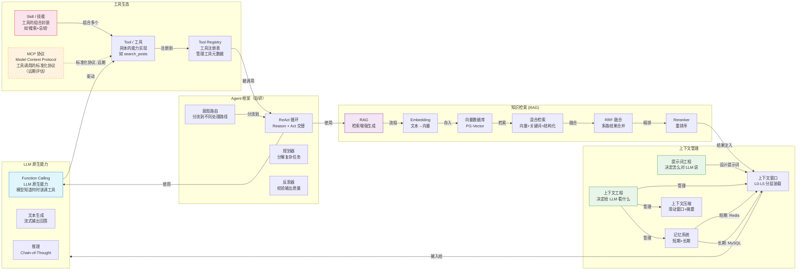

### 概念逐个解释

| 概念 | 一句话解释 | 在本项目中的落地方式 | 当前状态 |
|------|-----------|---------------------|----------|
| **Function Calling** | LLM 原生能力：模型判断"该调工具了"并生成结构化调用参数 | DeepSeek-V3 原生 `tool_calls` 字段，不手写文本解析 | 未实现 |
| **Tool / 工具** | Agent 可调用的具体能力，如搜索帖子、查询知识库 | 10 个工具：search_posts / get_post_detail / search_knowledge 等 | 未实现 |
| **Skill / 技能** | 多个 Tool 的组合封装，实现更复杂的高层能力 | MVP 不引入，远期可考虑（如"搜索+总结+引用"封装为 Skill） | 未规划 |
| **MCP** | Anthropic 提出的工具调用标准化协议，让工具可跨 Agent 复用 | 远期评估，MVP 不引入。当前用自研 ToolRegistry + Function Calling | 未规划 |
| **RAG** | 检索增强生成：先检索相关知识，再让 LLM 基于检索结果回答 | 两路并行检索（知识库向量+关键词 + 帖子向量）→ RRF 融合 → 注入上下文 | ✅ 已实现 |
| **Embedding** | 把文本转成向量，让计算机能算"语义相似度" | BGE-M3 模型，1024 维，SiliconFlow 云端 API | ✅ 已实现 |
| **向量数据库** | 专门存储和检索向量的数据库 | PG-Vector (PostgreSQL + pgvector 插件)，HNSW 索引 | ✅ 已实现 |
| **混合检索** | 多种检索方式并行，取长补短 | 向量(语义) + pg_trgm(关键词) 两路并行 + 帖子向量检索 | ✅ 已实现 |
| **RRF** | Reciprocal Rank Fusion，多路检索结果的融合算法 | `score(d) = Σ 1/(k + rank_i(d))`，k=60 | ✅ 已实现 |
| **Reranker** | 对检索结果做二次精排，提升 Top-K 质量 | bge-reranker-v2-m3，进阶阶段引入 | 未实现 |
| **上下文工程** | 决定给 LLM "看什么"——在有限的 token 预算内放最有价值的信息 | L0-L5 六层分层装载，token 预算分配 | 未实现 |
| **提示词工程** | 决定对 LLM "怎么说"——设计 System Prompt、Few-shot、输出格式 | L1-L4 四层分层，版本管理，意图分类+改写合并调用 | 部分（PromptConstants 已有基础版） |
| **记忆系统** | 让 Agent 跨轮次/跨会话记住用户信息 | 短期(Redis: 会话轮次/槽位) + 长期(MySQL: 用户画像/偏好) | 未实现 |
| **上下文压缩** | 当历史太长时，压缩旧内容避免超出 token 限制 | Rolling Summary + Slot Freezing + Pin Message 三合一 | 未实现 |
| **ReAct** | Reason + Act 循环：LLM 推理→调工具→看结果→再推理 | 单 Agent ReAct，最大 5 步，步数耗尽强制生成答案 | 未实现 |
| **意图路由** | 先理解用户想干什么，再分流到不同处理路径 | 5 意图分类：HOW_TO / SEARCH / NAVIGATE / CLARIFY / OUT_OF_SCOPE | 未实现 |

---

## 3. 问答完整流程序列图

> 用户问"有没有关于考研复试的帖子？"，Agent 内部发生了什么？

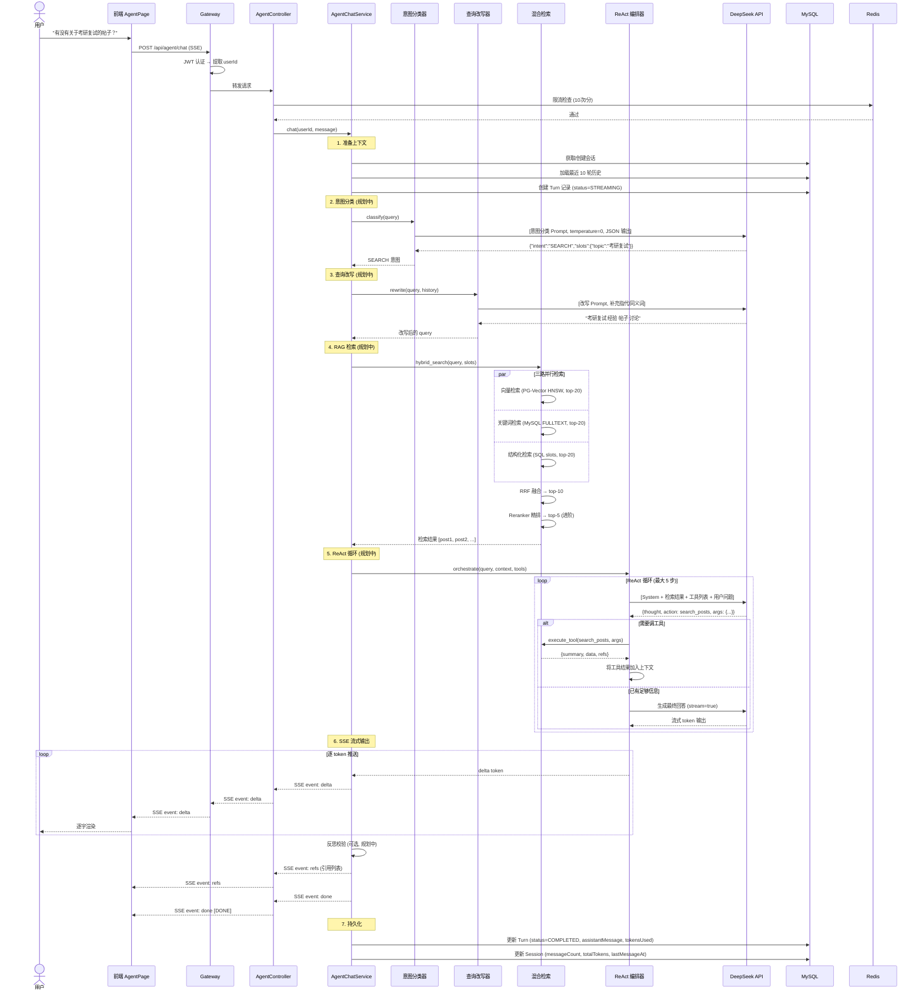

> **注意：** 上图展示的是**完整目标流程**。当前已实现步骤 1、4（RAG 检索）、6、7——意图分类、查询改写、ReAct 循环尚未实现。当前流程是：用户消息 → RAG 检索（知识库向量+关键词 + 帖子向量）→ 检索结果注入上下文 → DeepSeek 流式生成 → 持久化。

---

## 4. RAG 检索流程详解

> RAG 是 Agent 最核心的"知识"来源。下图展示了一条用户查询如何被检索处理。

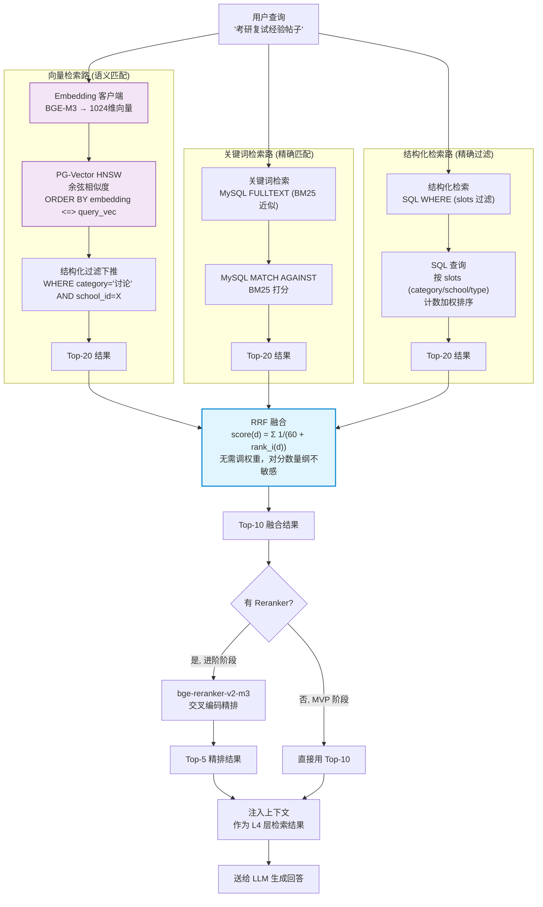

### RAG 各组件说明

| 组件 | 作用 | 技术选型 | 部署方式 | 状态 |
|------|------|----------|----------|------|
| Embedding 模型 | 文本 → 1024维向量 | BGE-M3 (智源/BAAI), SiliconFlow API | SiliconFlow 云端 API | ✅ 已接入 |
| 向量数据库 | 存储和检索向量 | PG-Vector (PostgreSQL 16 + pgvector) | agent-postgres 容器 (端口 5432) | ✅ 已接入 |
| 向量索引 | 加速近似最近邻搜索 | HNSW (m=16, ef_construction=64, ef_search=40) | PG-Vector 内建 | ✅ 已使用 |
| 关键词检索 | 精确匹配关键词 | pg_trgm + GIN 索引 (MVP) → Elasticsearch (远期) | PostgreSQL 容器 | ✅ 已使用 (pg_trgm) |
| 结构化检索 | 按分类/学校/类型精确过滤 | SQL WHERE + 计数加权 | PostgreSQL 容器 | 未实现 |
| RRF 融合 | 多路结果合并 | `score = Σ 1/(60 + rank)` | agent-service 内 | ✅ 已使用 |
| Reranker | 二次精排 | bge-reranker-v2-m3 | bge-service 容器 | 未实现 (进阶) |

---

## 5. Agent ReAct 循环详解

> ReAct = Reason + Act。LLM 先"想"（推理），再"做"（调工具），看结果后再"想"，循环直到能回答。

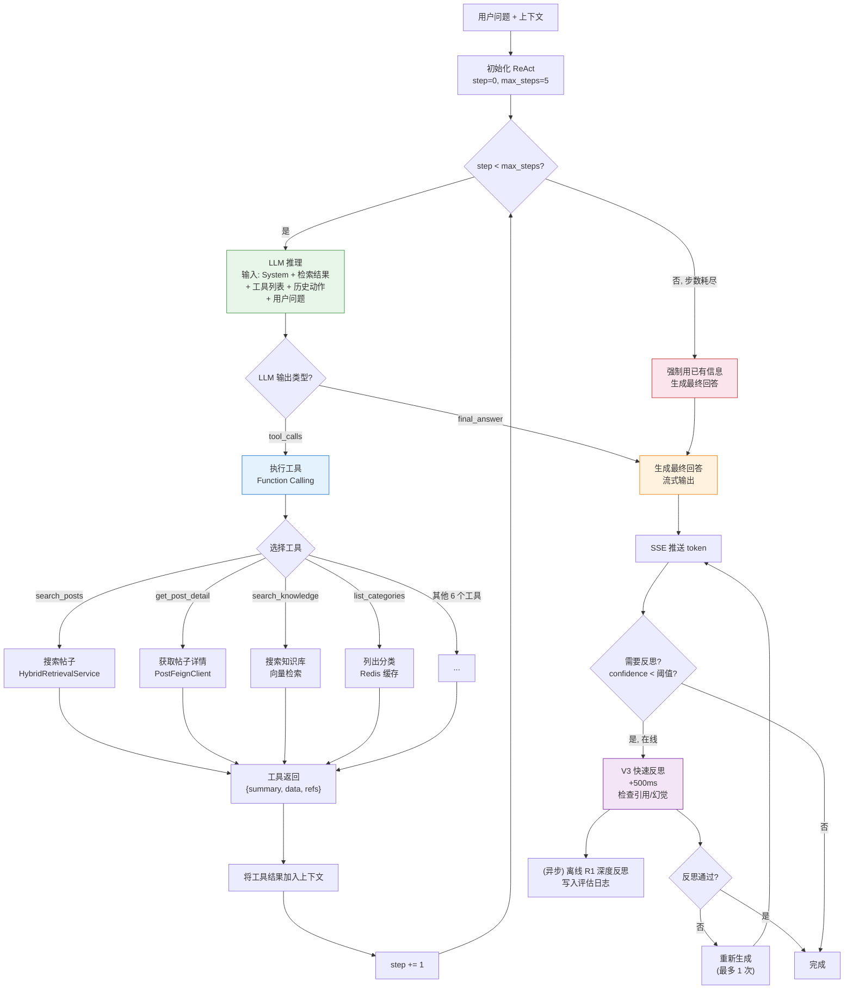

### ReAct 关键参数

| 参数 | 值 | 说明 |
|------|-----|------|
| max_steps | 5 | 最大推理步数，防止无限循环 |
| tools per turn | 3 | 单轮最多调用 3 次工具 |
| 反思触发条件 | confidence < 阈值 | 仅低置信度触发在线反思 |
| 在线反思延迟 | +500ms | 用 V3 快速反思 |
| 离线反思 | 异步 | 用 R1 深度反思，写入评估日志 |

---

## 6. 上下文工程分层架构

> 上下文工程回答一个问题：**在有限的 token 预算内，给 LLM 看什么最有价值？**

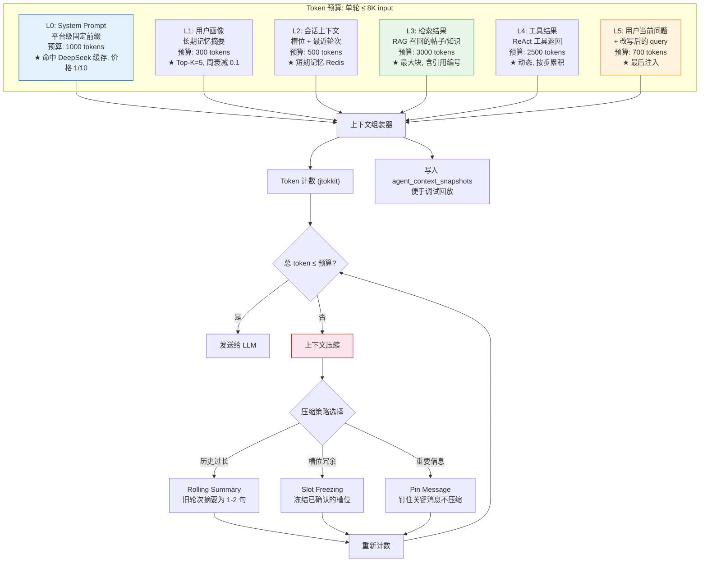

### 上下文工程 vs 提示词工程 vs 记忆系统

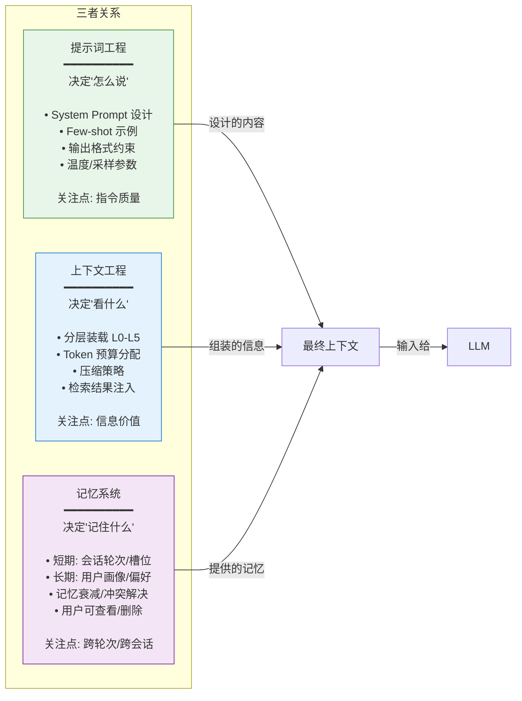

---

## 7. 记忆系统架构

> 记忆系统让 Agent "记住"用户，分短期和长期两层。

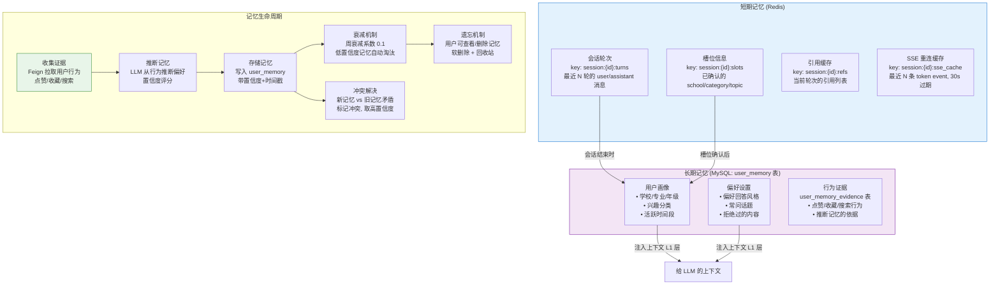

---

## 8. SSE 事件流详解

> 前端如何消费 Agent 的流式输出？7 种事件类型分别是什么？

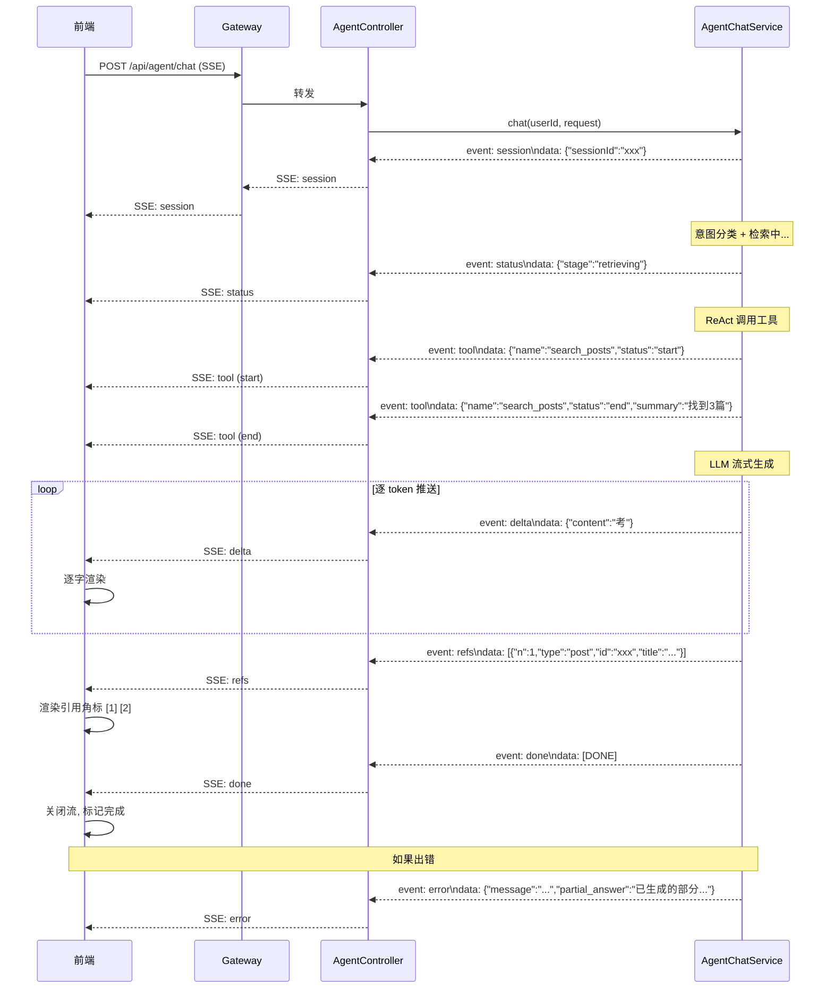

### SSE 事件类型速查

| 事件类型 | data 内容 | 时机 | 当前状态 |
|----------|-----------|------|----------|
| `session` | `{sessionId}` | 会话创建/确认 | ✅ 已实现 |
| `status` | `{stage: "retrieving"}` | 阶段状态更新 | 未实现 |
| `tool` | `{name, status, summary}` | 工具调用开始/结束 | 未实现 |
| `delta` | 纯文本 token | LLM 逐 token 输出 | ✅ 已实现 |
| `refs` | `[{n, type, id, title}]` | 引用列表 | 未实现 |
| `clarify` | `{message, options}` | 需要用户澄清 | 未实现 |
| `error` | `{message}` | 错误 | ✅ 已实现 |
| `done` | `[DONE]` | 流结束 | ✅ 已实现 |

---

## 9. 数据流图：数据从哪来，到哪去

> 展示 Agent 模块涉及的**所有数据源、数据流向和数据格式**。

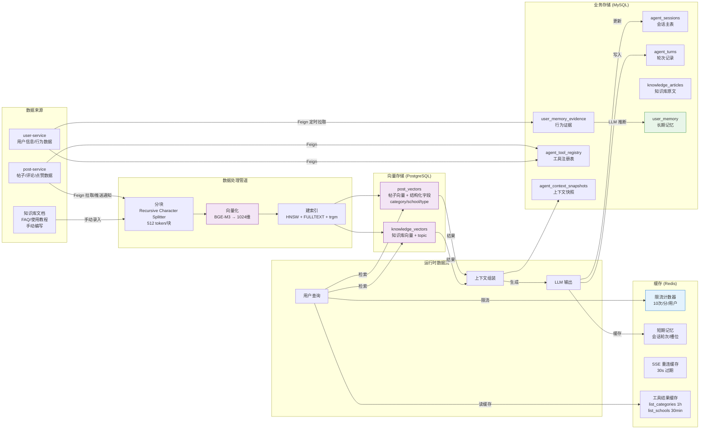

---

## 10. 技术栈全景表

> 所有技术选型一览，含状态和演进方向。

### 10.1 LLM 与模型

| 角色 | 技术选型 | 版本/型号 | 用途 | 状态 | 演进方向 |
|------|----------|-----------|------|------|----------|
| 主生成模型 | DeepSeek-V3 | deepseek-v4-flash | 意图/改写/ReAct/答案生成 | ✅ 已接入 | — |
| 推理反思模型 | DeepSeek-R1 | deepseek-reasoner | 离线深度反思 | 未实现 | 进阶阶段 |
| 兜底模型 | 豆包 doubao-pro | — | 主模型连续失败时切换 | 未实现 | 进阶阶段 |
| Embedding 模型 | BGE-M3 | BAAI/bge-m3 | 文本→1024维向量 | ✅ 已接入 (SiliconFlow) | 远期可本地 TEI |
| Reranker 模型 | bge-reranker-v2-m3 | — | 检索结果精排 | 未实现 | 进阶阶段 |

### 10.2 数据存储

| 存储 | 技术 | 用途 | 端口 | 状态 |
|------|------|------|------|------|
| MySQL | 8.0 | 业务表（会话/轮次/记忆/知识库/工具注册/会话分类） | 3306 | ✅ 已接入 |
| PostgreSQL | 16 + pgvector | 向量存储（帖子向量/知识向量） | 5432 | ✅ 已接入 |
| Redis | 7 | 限流/短期记忆/SSE缓存/工具缓存 | 6379 | ✅ 已接入 |

### 10.3 框架与中间件

| 类别 | 技术 | 用途 | 状态 | 演进方向 |
|------|------|------|------|----------|
| Web 框架 | Spring WebFlux | 响应式 + SSE 流式 | ✅ 已使用 | — |
| ORM | MyBatis Plus | MySQL 数据访问 | ✅ 已使用 | — |
| 跨服务调用 | OpenFeign | 调用 user/post-service | 配置就绪 | → Nacos 服务发现 |
| 熔断器 | Resilience4j | LLM 调用熔断 | ✅ 已使用 | → Sentinel (架构升级) |
| 重试 | Spring Retry | LLM 调用重试 | ✅ 已使用 | — |
| Token 计数 | jtokkit | 本地 token 估算 | ✅ 已使用 | — |
| 监控 | Micrometer + Prometheus | 指标采集 | ✅ 已使用 | — |
| 链路追踪 | OpenTelemetry | 分布式追踪 | ✅ 已使用 | → Tempo |
| 限流 | Redis INCR | 用户级限流 | ✅ 已使用 | — |
| 向量检索 | pgvector 0.1.6 | PostgreSQL 向量操作 + HNSW 索引 | ✅ 已使用 | → Milvus (远期) |

### 10.4 前端

| 技术 | 用途 | 状态 |
|------|------|------|
| React + TypeScript | 聊天 UI | ✅ 已使用 |
| fetch + ReadableStream | SSE 客户端 | ✅ 已使用 |
| Zustand | 状态管理（规划） | 未实现 |
| Markdown 渲染 (react-markdown) | AI 回复格式化 | ✅ 已使用 |
| SwipeToDelete 组件 | 左滑删除/移动会话 | ✅ 已使用 |
| 会话分类管理 | 文件夹分组管理会话 | ✅ 已使用 |
| 引用角标 | [1] [2] 可点击引用 | 未实现 |

---

## 11. 演进路线图

> MVP → 进阶 → 远期，每个阶段做什么。

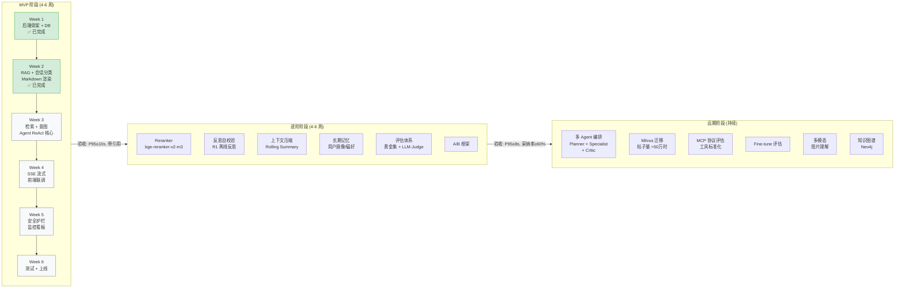

### 各阶段技术栈增量

| 阶段 | 新增技术 | 移除/替换 | 验收标准 |
|------|----------|-----------|----------|
| **MVP** | BGE-M3, PG-Vector, RAG, ReAct, Function Calling, SSE 7 事件, 输入/输出护栏, Prometheus | — | P95 ≤ 10s, 带引用, 覆盖 3 意图 |
| **进阶** | Reranker, R1 反思, 上下文压缩, 长期记忆, 评估体系, A/B, LLM 语义安全, 5 个 Grafana 看板 | — | TTFB P95 ≤ 2.5s, E2E P95 ≤ 8s, 采纳率 ≥ 60% |
| **远期** | 多 Agent 编排, Milvus, MCP 协议, Fine-tune, 多模态, Neo4j 知识图谱 | PG-Vector → Milvus, Resilience4j → Sentinel, MySQL FULLTEXT → ES | 日活 >1000 时 2+ 实例 |

---

## 12. 部署拓扑图

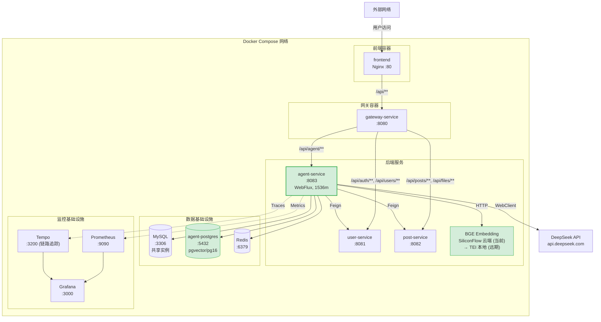

### 容器资源分配

| 容器 | 内存限制 | CPU | start_period | 特殊配置 |
|------|----------|-----|-------------|----------|
| agent-service | 1536m | — | 90s | DNS: 8.8.8.8, 114.114.114.114 |
| agent-postgres | — | — | 10s | pgvector/pg16 镜像 |
| BGE Embedding | 云端 (SiliconFlow) | — | — | 当前用云端 API，远期可本地部署 TEI |
| mysql | — | — | 30s | 共享实例 |
| redis | — | — | 10s | — |

---

## 13. 已有文档导航表

> `docs/agent-assistant/` 下有 93 份详细设计文档，这里是快速导航。

| 你想了解... | 去看这个文档 |
|------------|-------------|
| Agent 的整体愿景和目标 | [00-overview/vision-and-goals.md](./00-overview/vision-and-goals.md) |
| 做什么、不做什么 | [00-overview/scope-and-non-goals.md](./00-overview/scope-and-non-goals.md) |
| 系统架构图 | [02-architecture/system-architecture.md](./02-architecture/system-architecture.md) |
| 数据流设计 | [02-architecture/data-flow.md](./02-architecture/data-flow.md) |
| LLM 选型决策 | [03-llm-strategy/model-selection.md](./03-llm-strategy/model-selection.md) |
| 意图分类体系 | [04-intent-understanding/intent-taxonomy.md](./04-intent-understanding/intent-taxonomy.md) |
| 查询改写策略 | [04-intent-understanding/query-rewriting.md](./04-intent-understanding/query-rewriting.md) |
| 知识库来源 | [05-knowledge-base/knowledge-sources.md](./05-knowledge-base/knowledge-sources.md) |
| 分块策略 | [05-knowledge-base/chunking-strategy.md](./05-knowledge-base/chunking-strategy.md) |
| Embedding 选型 | [05-knowledge-base/embedding-strategy.md](./05-knowledge-base/embedding-strategy.md) |
| 向量库选型 | [05-knowledge-base/vector-database.md](./05-knowledge-base/vector-database.md) |
| 混合检索 + RRF | [06-retrieval/hybrid-retrieval.md](./06-retrieval/hybrid-retrieval.md) |
| 重排序 | [06-retrieval/re-ranking.md](./06-retrieval/re-ranking.md) |
| Agent 架构 (ReAct) | [07-agent-design/agent-architecture.md](./07-agent-design/agent-architecture.md) |
| 工具使用设计 | [07-agent-design/tool-use-design.md](./07-agent-design/tool-use-design.md) |
| 规划策略 | [07-agent-design/planning-strategy.md](./07-agent-design/planning-strategy.md) |
| 反思与校验 | [07-agent-design/reflection-and-verification.md](./07-agent-design/reflection-and-verification.md) |
| 多 Agent 编排 | [07-agent-design/multi-agent-orchestration.md](./07-agent-design/multi-agent-orchestration.md) |
| System Prompt 设计 | [08-prompt-engineering/system-prompts.md](./08-prompt-engineering/system-prompts.md) |
| Few-shot 示例 | [08-prompt-engineering/few-shot-examples.md](./08-prompt-engineering/few-shot-examples.md) |
| 上下文工程总览 | [09-context-engineering/README.md](./09-context-engineering/README.md) |
| 上下文窗口管理 | [09-context-engineering/context-window-management.md](./09-context-engineering/context-window-management.md) |
| 上下文压缩 | [09-context-engineering/context-compression.md](./09-context-engineering/context-compression.md) |
| 短期记忆 (Redis) | [09-context-engineering/conversation-memory.md](./09-context-engineering/conversation-memory.md) |
| 长期记忆 (MySQL) | [09-context-engineering/long-term-memory.md](./09-context-engineering/long-term-memory.md) |
| 工具规格 (10 个工具) | [10-tools-and-apis/tool-specifications.md](./10-tools-and-apis/tool-specifications.md) |
| SSE 流式 API 协议 | [10-tools-and-apis/sse-streaming-api.md](./10-tools-and-apis/sse-streaming-api.md) |
| Feign 客户端设计 | [10-tools-and-apis/feign-clients.md](./10-tools-and-apis/feign-clients.md) |
| 后端微服务结构 | [12-backend-microservice/service-structure.md](./12-backend-microservice/service-structure.md) |
| 数据库 Schema | [12-backend-microservice/database-schema.md](./12-backend-microservice/database-schema.md) |
| 配置设计 | [12-backend-microservice/configuration.md](./12-backend-microservice/configuration.md) |
| MVP 路线图 | [17-roadmap/mvp-phase.md](./17-roadmap/mvp-phase.md) |
| 进阶路线图 | [17-roadmap/advanced-phase.md](./17-roadmap/advanced-phase.md) |
| 远期路线图 | [17-roadmap/future-phase.md](./17-roadmap/future-phase.md) |
| 术语表 | [18-glossary.md](./18-glossary.md) |

---

## 14. 当前实现状态总览（截至 2026-07-02）

### ✅ 已实现（MVP Week 1 + Week 2）

#### 对话与会话

| 能力 | 实现文件 | 说明 |
|------|----------|------|
| SSE 流式对话 | `AgentController` + `AgentChatService` + `DeepSeekClient` | 用户发消息 → RAG 检索 → DeepSeek 流式返回 → 前端逐字渲染 |
| 会话管理 | `AgentSessionService` + `AgentController` | 创建/查询/列表/归档/删除/历史轮次 |
| 多轮上下文 | `AgentChatService.buildMessages` | 自动携带最近 10 轮历史 |
| LLM 弹性 | `ResilienceConfig` + `DeepSeekClient` | 熔断(50%→30s) + 重试(3次指数退避) + 连接池 |
| 用户限流 | `AgentRateLimiter` | Redis 固定窗口 10 次/分/用户 |
| Token 计量 | `AgentChatService` (jtokkit) | prompt/completion/total tokens |
| 鉴权 | `AgentController` (jwtUtils) | JWT 解析 + 会话归属校验 |

#### 会话分类管理

| 能力 | 实现文件 | 说明 |
|------|----------|------|
| 分类 CRUD | `AgentSessionCategoryService` + `AgentController` | 创建/重命名/删除分类，删除时自动移出会话 |
| 会话移动 | `AgentSessionService` + 左滑操作 | 左滑"分类"按钮移动会话到分类，可移出分类 (categoryId = null) |
| 前端分组展示 | `AgentPage.tsx` `useMemo` 分组 | 按 categoryId 客户端分组，文件夹折叠展开 |
| 左滑交互 | `SwipeToDelete.tsx` | Pointer Events 手势系统，支持"分类"+"删除"双按钮，受控 openSwipeId |

#### RAG 检索

| 能力 | 实现文件 | 说明 |
|------|----------|------|
| 向量检索 | `RetrievalService` + `post_vectors` / `knowledge_vectors` | PG-Vector HNSW 索引，余弦距离，top-10 |
| 关键词检索 | `RetrievalService` + pg_trgm GIN 索引 | 知识库标题+内容的 trgm 相似度检索，top-10 |
| RRF 融合 | `RetrievalService.reciprocalRankFusion` | 三路结果（帖子向量 + 知识向量 + 知识关键词）RRF 融合，k=60，top-5 |
| Embedding | `EmbeddingService` + SiliconFlow BGE-M3 API | 1024 维向量，批量向量化 |
| 知识库向量化 | `KnowledgeIngestionService` + `KnowledgeScheduler` | 定时同步 FAQ/教程，分块+向量化写入 knowledge_vectors |
| 帖子向量化 | `PostVectorService` + `PostVectorScheduler` | 定时同步新帖，向量化写入 post_vectors |
| 内部 API | `InternalAgentController` | `/internal/agent/knowledge/*` + `/internal/agent/posts/*` 内部同步接口 |

#### 前端 UI

| 能力 | 实现文件 | 说明 |
|------|----------|------|
| 聊天界面 | `AgentPage.tsx` + `agent.ts` | 侧边栏会话列表 + 主区对话 + 输入框 |
| Markdown 渲染 | `AgentPage.tsx` + `react-markdown` | AI 消息支持 Markdown（标题/粗体/列表/代码块/链接） |
| 流式渲染 | `agent.ts` `fetch` + `ReadableStream` | SSE delta 事件逐字追加 |
| 新建对话反馈 | `AgentPage.tsx` | 按钮按压动画 + Toast 提示 + 消息渐入 |
| 响应式布局 | `AgentPage.tsx` | 移动端底部弹窗 / 桌面端居中 Modal |

### 🟡 Schema 就绪，无 Java 代码

| 能力 | 数据库表 | 说明 |
|------|----------|------|
| 长期记忆 | `user_memory`, `user_memory_evidence`, `user_memory_history` | 三表已建，无 MemoryService |
| 上下文快照 | `agent_context_snapshots` | 表已建，AgentChatService 未写入 |
| 工具注册表 | `agent_tool_registry` | 表已建，无工具执行框架 |
| 知识库原文 | `knowledge_articles` | 表已建，向量同步走内部 API 直写，无 CRUD 服务 |
| 会话审计 | `agent_session_events` | 表已建，归档/删除时未记录 |
| 异步写入队列 | `agent_pending_writes` | 表已建，无队列处理器 |
| 工具错误归档 | `agent_tool_errors` | 表已建，无错误记录 |

### ⬜ 规划中，尚未开始

| 能力 | 规划阶段 | 依赖 |
|------|----------|------|
| 意图分类器 | Week 3 | DeepSeek-V3 JSON 输出 |
| 查询改写器 | Week 3 | DeepSeek-V3 |
| Agent ReAct 循环 | Week 3 | Function Calling + 工具执行器 |
| Feign 跨服务调用 | Week 3 | PostFeignClient + UserFeignClient |
| 工具执行框架 | Week 3 | ToolRegistry + Function Calling |
| 上下文工程 L0-L5 | Week 3-4 | ContextBuilder + TokenCounter |
| 上下文压缩 | 进阶 | Rolling Summary + Slot Freezing |
| Reranker | 进阶 | bge-reranker-v2-m3 |
| 反思校验 | 进阶 | V3 在线 + R1 离线 |
| 安全护栏 | Week 5 | 输入/输出护栏 |
| 评估体系 | 进阶 | 黄金集 + LLM-Judge |
| 多 Agent 编排 | 远期 | Planner + Specialist + Critic |
| MCP 协议 | 远期 | 评估是否引入 |
| 前端引用角标 | Week 4 | [1] [2] 可点击 |
| SSE status/tool/clarify 事件 | Week 3-4 | 后端阶段状态推送 |

---

*本文档是 Agent 模块的架构总览导航，配合 `docs/agent-assistant/` 下的 93 份详细设计文档使用。*
*如有疑问，先看本文档的图，再按导航表去查详细文档。*
