# CampusShare Agent 全链路工作解读

> **本文档目的**：一张图 + 一条线，讲清楚从用户发消息到AI回复、记忆沉淀的完整过程。SystemPrompt、意图识别、RAG知识库、上下文工程、长期记忆不是孤立的模块，而是一条流水线——每个环节都为上一环节服务，为下一环节提供输入。
>
> 最后更新：2026-07-10

***

## 一、全景时序图：一次完整对话发生了什么

当用户在聊天框输入一句话按下发送，到AI回复逐字出现在屏幕上，整个后端经历了以下流程：

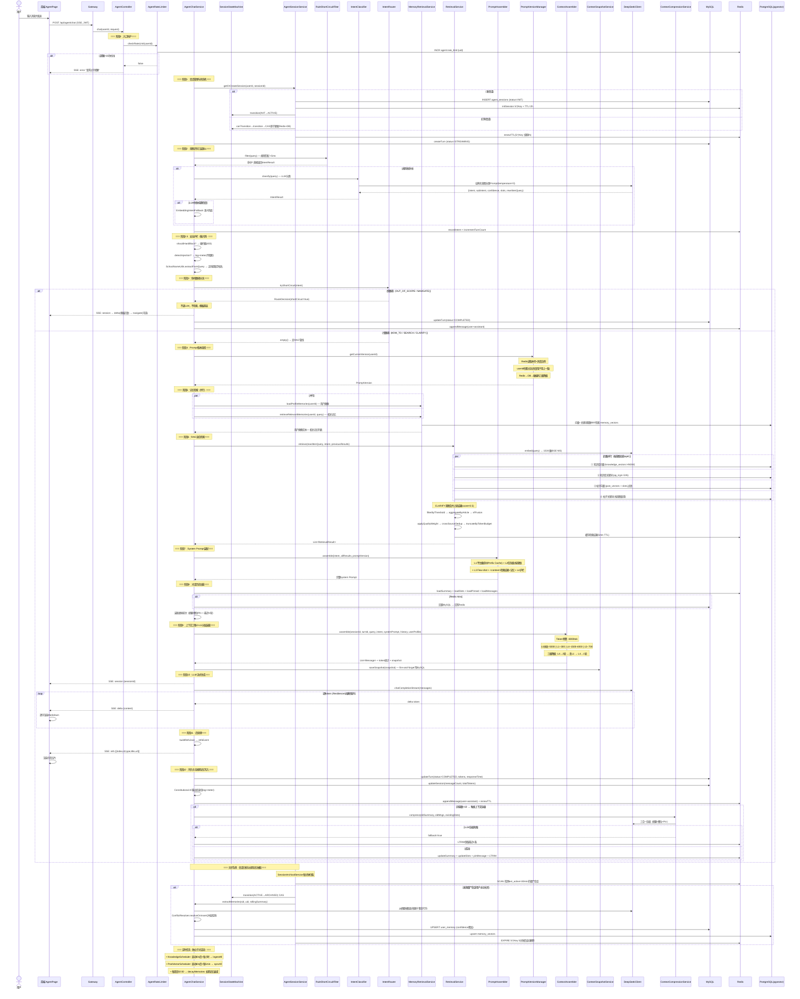

***

## 二、核心架构图：各模块的位置与数据流

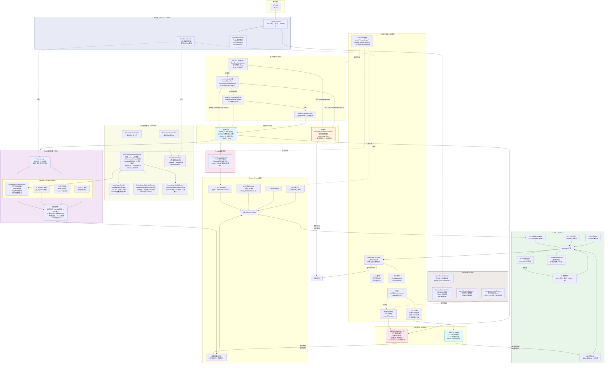

***

## 三、各模块深度解读

### 3.1 入口防护：限流 + 弹性保护 + JWT鉴权

请求到达业务逻辑之前，先经过两层防护：

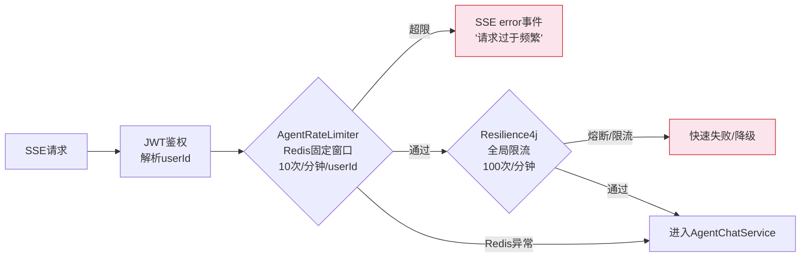

**限流设计要点**：

- **用户级限流**：Redis Key `agent:rate_limit:{userId}`，固定窗口计数器，1分钟10次。首次请求设TTL=60s，`INCR`原子计数
- **全局限流兜底**：Resilience4j RateLimiter `agent-global`，100次/分钟，防突发流量
- **Fail-Open策略**：Redis异常时默认放行（`AgentRateLimiter`返回true），保证可用性优先于限流
- **响应式编程**：使用`ReactiveStringRedisTemplate`，与WebFlux全链路非阻塞集成

**Resilience4j弹性保护**：4个独立熔断器，每个外部依赖隔离，防止故障级联：

| 熔断器                 | 保护目标           | 默认参数                      |
| ------------------- | -------------- | ------------------------- |
| `deepseek`          | DeepSeek LLM调用 | 窗口10次/50%失败率/熔断30s/半开3次试探 |
| `embedding`         | BGE-M3向量化      | 同上                        |
| `post-sync`         | 帖子服务同步调用       | 同上                        |
| `intent-classifier` | 意图分类LLM调用      | 同上                        |

熔断状态机：`CLOSED(正常) → 失败率超阈值 → OPEN(快速失败30s) → HALF_OPEN(试探3次) → 成功→CLOSED / 失败→OPEN`

所有外部LLM/Embedding调用还配置了**指数退避重试**（3次，初始1s），仅对5xx和网络超时重试，4xx快速失败。

***

### 3.2 会话管理与状态机：从创建到归档的完整生命周期

会话不是简单的数据库记录，而是有严格状态流转的实体。

**8状态流转图**：

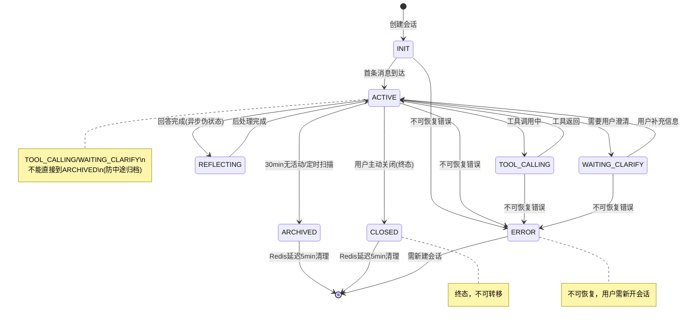

**关键设计**：

1. **CAS原子转移**：`SessionStateMachine.transition()` 使用CAS语义——先校验`canTransition(from,to)`，再检查Redis当前状态，再更新Redis和DB。MVP阶段用HGET+HSET（非原子Lua），故障时容忍跳过CAS，事件审计保留90天。
2. **Redis+DB双写一致性**：状态先写Redis（即时生效），再更新DB；Redis miss时降级读DB。
3. **会话归档流程**（`SessionArchivalService`）——**长期记忆抽取的触发点**：

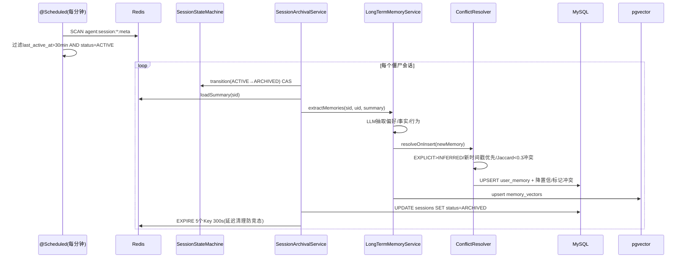

1. **软删除**：`deleteSession()`先归档（确保记忆抽取完成），再标记`status=DELETED`，不物理删除。
2. **会话分类**：`AgentSessionCategoryService`提供文件夹功能（创建/重命名/删除分类），删除分类时下属会话`categoryId`置null（软转移，不级联删除）。

**短期记忆Redis Key结构**（每个会话5个Key，初始化时统一TTL=2h，每次活跃续期）：

| Key                                   | 类型     | 内容                                                                                |
| ------------------------------------- | ------ | --------------------------------------------------------------------------------- |
| `agent:session:{sid}:meta`            | Hash   | user\_id, status, current\_intent, intent\_history, turn\_count, last\_active\_at |
| `agent:session:{sid}:messages`        | List   | 最近20条消息(RPUSH/LTRIM)，JSON序列化MemoryMessage                                         |
| `agent:session:{sid}:rolling_summary` | String | 滚动摘要文本（压缩后更新）                                                                     |
| `agent:session:{sid}:slots`           | Hash   | 已确认槽位(school/category/topic等)                                                     |
| `agent:session:{sid}:pinned`          | List   | Pin消息(最多5条)，重要偏好永不压缩                                                              |

**Redis→MySQL两级缓存模式**：读操作Redis miss时自动回源MySQL（`ContextSummary`/`ContextSlot`/`PinMessage`表）并回写Redis；写操作先写Redis立即返回，MySQL异步持久化（boundedElastic线程池），持久化失败仅log告警不影响对话。

***

### 3.3 System Prompt 工程：五层结构 + 版本管理 + Prefix Cache

System Prompt不是一段长文本，而是**五层结构**拼接而成，并且支持**版本灰度切换**：

```Textile
┌─────────────────────────────────────────────────┐
│ L1 平台级 Prompt（PLATFORM_PROMPT）              │
│ ─ 身份定义：你是CampusShare AI助手小享            │
│ ─ 核心能力：找资料、解答平台使用问题               │
│ ─ 回复规则：必须引用来源、Markdown格式、中文回复   │
│ ★ 字节级固定(ADR-SP-06) → 命中Prefix Cache       │
├─────────────────────────────────────────────────┤
│ L2 任务级 Prompt（按意图切换，灰度可切）           │
│ ─ HOW_TO_PROMPT：操作指南回答模板                │
│ ─ SEARCH_PROMPT：资源搜索回答模板                │
│ ─ NAVIGATE_PROMPT：跳转引导模板                  │
│ ─ CLARIFY_PROMPT：澄清追问模板                   │
│ ─ OUT_OF_SCOPE_PROMPT：超范围拒绝模板            │
├─────────────────────────────────────────────────┤
│ L3 Few-shot 示例                                 │
│ ─ 2-3个高质量问答示例，教LLM输出格式             │
├─────────────────────────────────────────────────┤
│ <context> 检索结果 + 相关记忆                     │
│ ─ [n] 来源：知识库/帖子/用户记忆 | 标题：xxx      │
│ ─ 章节/可信度/分类/学校等元数据                  │
│ ─ 内容：...                                     │
│ ★ 用<context>标签包裹 → 资料≠指令 → 防注入      │
├─────────────────────────────────────────────────┤
│ L4 安全护栏（GUARDRAIL_PROMPT）                   │
│ ─ 防Prompt泄露、防越狱、防敏感内容               │
│ ★ 放在末尾 → 近因效应覆盖前面的任何恶意指令      │
└─────────────────────────────────────────────────┘
```

**Prompt版本管理与灰度发布**（`PromptVersionManager`）：

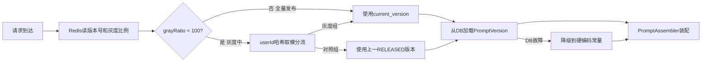

- **秒级切换**：`switchVersion()`只改Redis版本号，所有新请求立即生效
- **确定性灰度**：同一用户始终在同一分组（hashCode取模），不会一会用A版一会用B版
- **灰度只切L2/L3/L4**：L1平台级字节级固定保证Prefix Cache命中率
- **三级降级**：Redis→DB→硬编码常量，极端故障也能提供基础服务
- **可观测**：降级次数通过`prompt.version.fallback` Counter监控

**关键设计决策**：

- **Prefix Cache命中**：L1平台级prompt所有请求完全相同，DeepSeek缓存prefix部分，这部分token只计1/10价格，首token延迟也显著降低
- **`<context>`标签防注入**：即使用户在帖子内容里写"忽略以上指令"，LLM也不会执行
- **护栏放末尾**：近因效应——大模型对最后看到的指令权重最高

***

### 3.4 意图识别：三层漏斗，从快到准

用户消息进来后，不是直接扔给LLM分类，而是经过**三层漏斗**，先用最快最便宜的方式过滤高确定性请求：

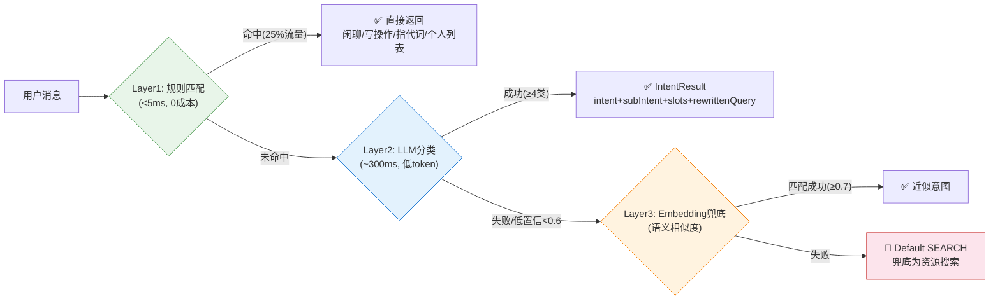

**五大意图体系**：

| 意图                 | 子意图                                           | 触发场景              | 路径      | 检索策略                           |
| ------------------ | --------------------------------------------- | ----------------- | ------- | ------------------------------ |
| **HOW\_TO**        | —                                             | "怎么发帖""怎么认证"      | 慢路径RAG  | 仅知识库（postTopK=0），threshold=0.5 |
| **SEARCH**         | resource                                      | "有没有高数资料"         | 慢路径RAG  | 偏帖子（postTopK=8），threshold=0.4  |
| **SEARCH**         | discussion                                    | "大家怎么看考研"         | 慢路径RAG  | 偏帖子+关键词，threshold=0.4          |
| **SEARCH**         | content\_qa                                   | "什么是学分绩点"         | 慢路径RAG  | 偏知识库（knowledgeTopK=8）          |
| **NAVIGATE**       | my\_list/feature\_loc/section\_loc            | "去我的收藏""通知在哪"     | **快路径** | 不检索 → 模板回复+navigate事件          |
| **CLARIFY**        | coreference                                   | "那个帖子""上面那个"      | 慢路径RAG  | 均衡检索+上轮结果降权合并                  |
| **OUT\_OF\_SCOPE** | chitchat/write\_action/open\_domain/sensitive | "你是谁""帮我发帖""今天天气" | **快路径** | 不检索 → 模板回复                     |

**规则短路四类规则（优先级从高到低）**：

1. **指代词→CLARIFY**：含"那个/它/上面那个"等 → 强制追问澄清
2. **写操作→OUT\_OF\_SCOPE**：含"帮我发/帮我点赞/帮我改" → 拒绝模板
3. **闲聊问候→OUT\_OF\_SCOPE**：正则匹配"你好/谢谢/你是谁/再见"开头 → 闲聊模板
4. **个人列表→NAVIGATE**：含"我点赞的/我收藏的" → 跳转卡片

**学校名称双提取**：规则层用`SchoolNameUtils.extractFromQuery()`正则预提取学校名（含别名归一化如"北大"→"北京大学"），同时LLM分类输出的slots.school也会被归一化，双重保障避免"北大"导致SQL过滤失败。

**LLM分类输出结构**（JSON格式，temperature=0，确定性输出）：

```json
{
  "intent": "SEARCH",
  "subIntent": "resource",
  "confidence": 0.92,
  "slots": { "school": "北京大学", "category": "资料", "topic": "高数" },
  "rewrittenQuery": "北京大学 高数 资料 资源帖"
}
```

`rewrittenQuery`将口语化表达改写为检索关键词组合，`slots`用于帖子向量检索时的结构化SQL过滤（`WHERE school_id=? AND category_id=?`）。

此外还有**意图缓存**（`IntentCacheService`）：完全相同的query字符串直接返回缓存的意图结果，进一步降低LLM调用成本。

**全链路监控指标**：

- `agent.intent.classification.total`：按intent/subIntent/layer/result计数
- `agent.intent.classification.duration`：各层分类耗时
- `agent.intent.cache.total`：缓存命中率
- `agent.intent.route.total`：快/慢路径路由计数

***

### 3.5 RAG知识库：四路并行+RRF融合+后处理链（在线检索）

RAG是慢路径的核心，负责从知识库和帖子中找到与用户问题相关的参考资料。整个检索管线是**意图驱动**的——不同意图的检索来源配比、topK、阈值完全不同。

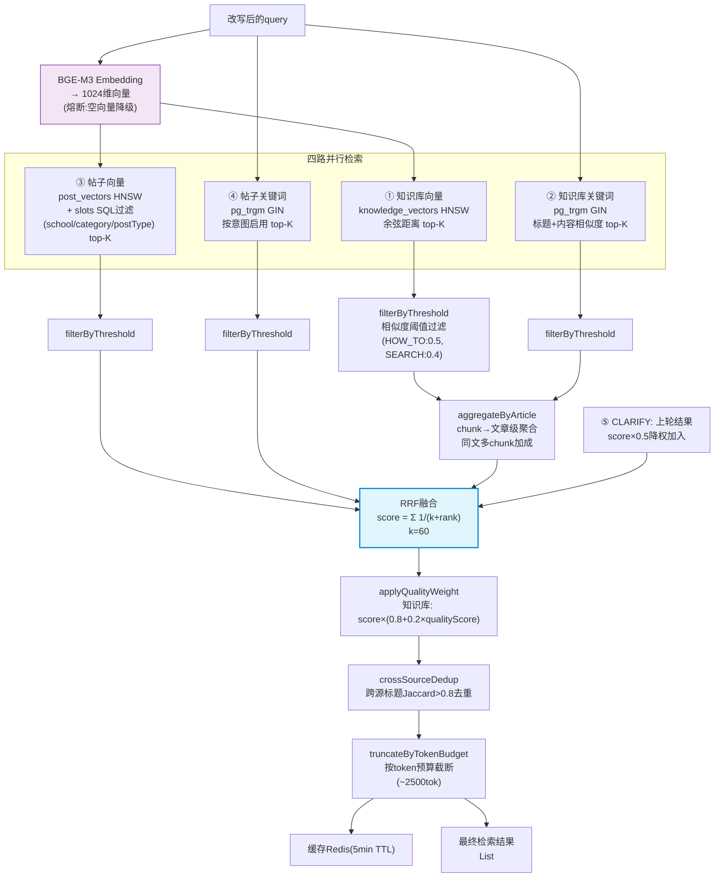

**意图驱动的检索配置**：

| 配置项                  | HOW\_TO | SEARCH/resource | SEARCH/discussion | SEARCH/content\_qa | CLARIFY |
| -------------------- | ------- | --------------- | ----------------- | ------------------ | ------- |
| knowledgeTopK        | 8       | 2               | 2                 | 8                  | 5       |
| knowledgeKeywordTopK | 5       | 2               | 0                 | 5                  | 3       |
| postTopK             | **0**   | 8               | 8                 | 3                  | 5       |
| postKeywordTopK      | 0       | 5               | 5                 | 2                  | 3       |
| similarityThreshold  | 0.5     | 0.4             | 0.4               | 0.5                | 0.4     |
| 低置信度boost            | +3      | +3              | +3                | +3                 | —       |

**关键设计细节**：

- **chunk→文章级聚合**：知识库被切分成\~256token的chunk存入向量库，检索回来后按article\_id聚合，同一文章取最高分chunk，但多个chunk命中有加成（`maxSim × (1 + 0.1 × (chunkHits - 1))`）
- **RRF融合无需调权重**：RRF只看排名不看绝对分数，天然适配多路异构检索（余弦距离0-1、trgm相似度0-1无需归一化）
- **质量加权**：四维质量分（见3.6）影响排序，引导LLM引用可靠文档
- **跨源去重**：Jaccard分词相似度>0.8时移除低分那条
- **Token预算截断**：逐条累加token数到上限就停，精确控制注入prompt长度
- **Redis缓存**：非CLARIFY意图结果缓存5分钟，省Embedding和PG查询
- **Embedding降级**：熔断打开时返回空向量，四路检索中向量路返回空结果，仅有关键词路工作（降级检索）

***

### 3.6 离线数据管线：知识库摄入与帖子向量同步

在线检索的质量依赖于离线数据管线的持续维护。两条独立的定时管道保证向量库数据新鲜：

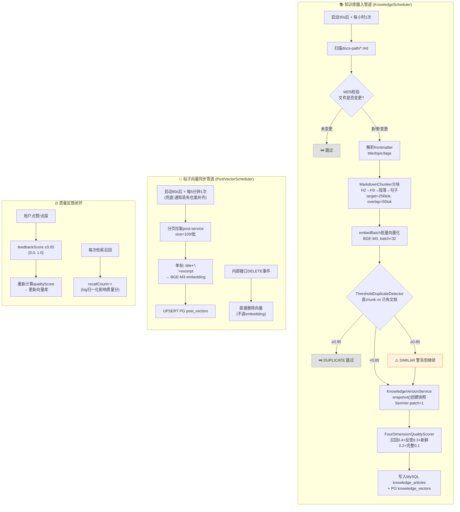

**MarkdownChunker语义分块策略**（不按固定长度切，优先保留语义边界）：

1. 按`^## ` 二级标题分割为H2段
2. 每个H2段按`^### ` 三级标题分割为H3段
3. 每个H3段按`\n\n`分割为段落
4. 段落token计数：≤maxTokens(512)累积，>maxTokens按句子边界`[。！？.!?]`拆分
5. 累积达targetTokens(256)输出chunk
6. 相邻chunk保留50token重叠，保证语义连贯
7. 每个chunk携带`headingPath`（如"平台指南 > 发帖 > 如何上传图片"），检索时提供上下文

**四维质量评分**（`FourDimensionQualityScorer`）：

| 维度   | 权重  | 归一化方法                                           |
| ---- | --- | ----------------------------------------------- |
| 召回频次 | 0.4 | log归一化(100次封顶)：0次=0, 1次≈0.15, 10次≈0.5, 100+=1.0 |
| 用户反馈 | 0.3 | feedbackScore直接使用(点赞+0.05/点踩-0.05)              |
| 新鲜度  | 0.2 | 30天内=1.0，90天后=0.0，线性衰减                          |
| 完整度  | 0.1 | 分块数：0块=0, 1块=0.3, 3块=0.7, 5+=1.0                |

**知识库版本管理**（`KnowledgeVersionService`）：

- 每次更新前对当前版本创建**完整快照**（存`knowledge_article_versions`表，非diff）
- 版本号SemVer递增（v1.0.0→v1.0.1），回滚也产生新版本号（不倒退）
- 回滚流程：快照当前版本(ROLLBACK原因)→用目标版本内容覆盖主表→patch+1→触发重新向量化
- 点赞/点踩实时调整feedbackScore并同步更新PG向量库中的quality\_score

**Embedding客户端弹性**（`EmbeddingClient`）：

- 批量自动分片：超过32条自动切分为多个批次并行调用（Mono.zip合并）
- 熔断打开时返回空向量而非抛出异常，让上层降级到关键词检索
- 单批失败返回空列表不影响其他批次（部分失败容忍）
- 结果按index排序保证顺序与输入一致

***

### 3.7 上下文工程：L0-L5分层装载+Token预算+三级降级+快照

上下文工程回答一个核心问题：**在8000 token的输入预算内，给LLM看什么最有价值？**

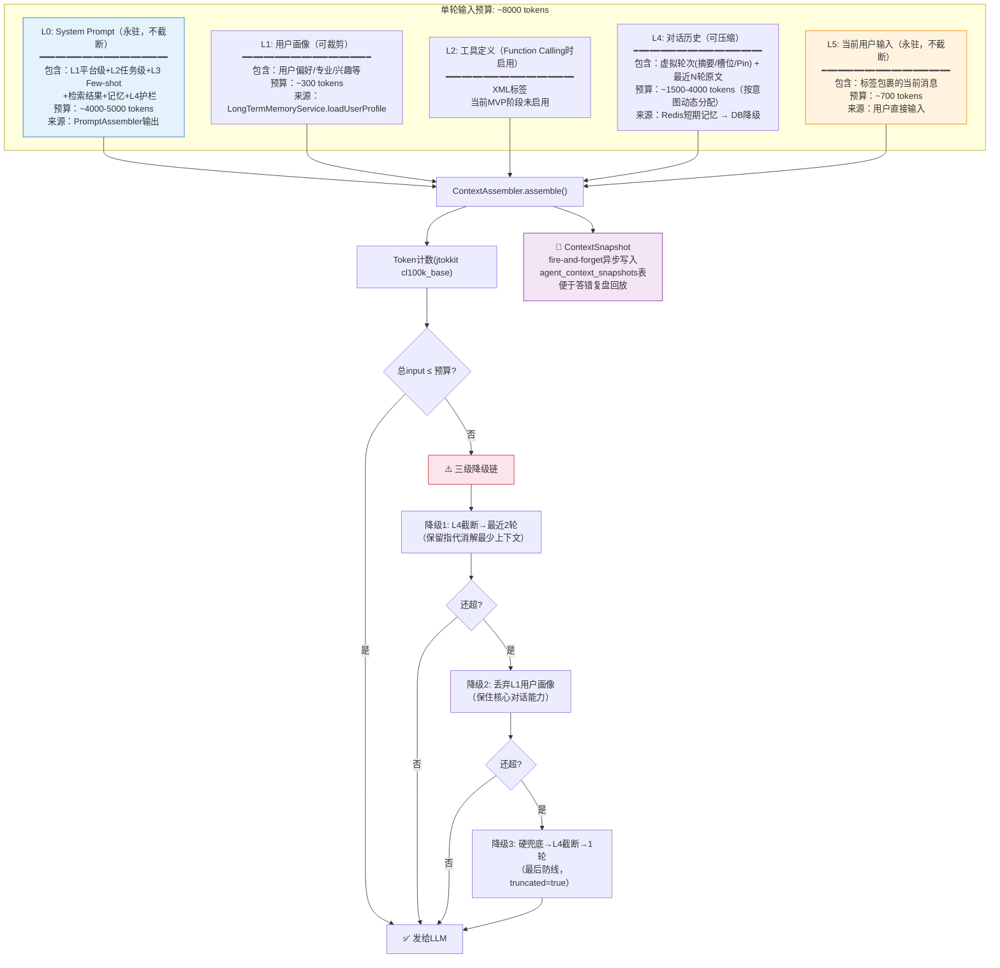

**对话历史的特殊结构——虚拟轮次+原文轮次**：L4层不是简单的最近N轮原文，而是压缩产物和原文以统一的AgentTurn格式注入：

```
history列表（时间正序）：
┌────────────────────────────────────────┐
│ user: "[历史对话摘要]"                    │  ← 虚拟轮次：滚动摘要（Redis summary）
│ assistant: "用户在询问北大考研资料..."     │
├────────────────────────────────────────┤
│ user: "[已确认约束]"                      │  ← 虚拟轮次：已确认槽位
│ assistant: "{school:北大, category:资料}" │
├────────────────────────────────────────┤
│ user: "[用户偏好]"                        │  ← 虚拟轮次：Pin消息
│ assistant: "偏好PDF格式..."               │
├────────────────────────────────────────┤
│ user: "有没有北大的考研资料？"             │  ← 真实轮次1（原文）
│ assistant: "为你找到以下北大考研资料..."   │
├────────────────────────────────────────┤
│ user: "那个带下载链接的"                  │  ← 真实轮次2（原文，当前CLARIFY的前一轮）
│ assistant: "..."                          │
└────────────────────────────────────────┘
```

**XML标签分层规范**：最终发给LLM的messages列表用XML标签明确区分各层，避免内容混淆：

- `<system_rules>`...`</system_rules>`：L0（含平台级+任务级+Few-shot+context+护栏）
- `<user_profile>`...`</user_profile>`：L1用户画像
- `<available_tools>`...`</available_tools>`：L2工具定义（预留）
- `<user_query>`...`</user_query>`：L5当前输入（包裹在user消息中）
- L4历史保持标准的user/assistant交替格式

**上下文快照**（`ContextSnapshotService`）：每次`ContextAssembler`组装完后，fire-and-forget异步写入`agent_context_snapshots`表，记录完整的messages列表、各层token分布、是否截断及截断原因。这是**答错复盘的唯一证据**——当用户反馈"AI答错了"时，可以精确还原当时发给LLM的全部上下文。写入失败仅log告警不阻塞主流程（≈2ms延迟可接受）。

***

### 3.8 记忆系统：短期Redis+长期MySQL/PG双轨 + 冲突解决

记忆系统分**短期记忆**（Redis，会话级）和**长期记忆**（MySQL+pgvector，用户级），两者独立运作、协同提供上下文。

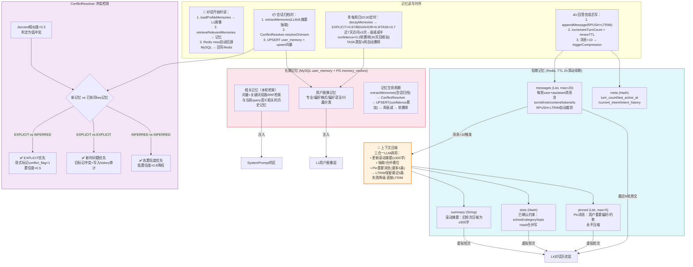

**长期记忆四象限分类**：

| 类型         | source   | 周衰减率         | 说明        | 示例        |
| ---------- | -------- | ------------ | --------- | --------- |
| PREFERENCE | EXPLICIT | 0.03 (×0.97) | 用户明确说的偏好  | "我喜欢PDF"  |
| FACT       | EXPLICIT | 0.03         | 用户明确声明的事实 | "我是计算机专业" |
| BEHAVIOR   | INFERRED | 0.1 (×0.9)   | 行为推断      | 常访问"考研"分类 |
| TASK       | INFERRED | 0.3 (×0.7)   | 当前任务，4周删除 | 在准备期末复习   |

**记忆UPSERT逻辑**：同一`user_id + type + key`已存在时，`confidence = min(1, confidence + 0.1)`；新记忆插入时confidence=1.0。同一偏好被多次提及→置信度累加→更稳定。

**冲突解决策略**（`ConflictResolver`）——显式优先原则：

1. **EXPLICIT vs INFERRED**：用户明确说的永远优先于模型推断的，隐式记忆标记冲突并降置信度
2. **EXPLICIT vs EXPLICIT**：两个显式记忆冲突，时间新的胜出，旧的标记冲突
3. **INFERRED vs INFERRED**：两个隐式记忆冲突，高置信度胜出，低置信度降权(×0.8)
4. 冲突判定：Jaccard字符相似度<0.3视为值冲突
5. **不删除旧记忆**：仅标记conflict\_flag+降置信度，保留完整审计轨迹（`user_memory_history`表）

**衰减与增强机制**：

- EXPLICIT明确记忆周衰减仅0.03（基本不遗忘），TASK类型4周未更新自动删除
- 近7天访问≥3次的记忆衰减率减半（用进废退）
- confidence < 0.2时软删除（30天回收站，非物理删除）

**记忆检索**：记忆也走**向量+关键词双路RRF融合**，和帖子/知识库检索同构。检索结果分两种用法：

- **Profile Memories**：Top-K高置信+近期使用的记忆，格式化为`[用户画像]`文本注入L1层
- **Relevant Memories**：与当前query语义相关的记忆，混入<context>区，标注来源为"用户记忆"，带置信度和source标签

***

### 3.9 上下文压缩：三级渐进式压缩（三合一LLM降本60%）

当Redis中messages List长度超过10条时触发压缩，避免历史无限增长撑爆上下文窗口：

````mermaid
flowchart LR
    Trigger{"触发条件<br/>messages > 10<br/>或 L4历史>2500tok"} --> Load["加载：
• oldSummary（旧摘要）
• existingSlots（已有槽位）
• toCompress（前N条旧消息，保留最近5条）
• 单条消息截断至500字防prompt爆炸"]
    Load --> Build["构建压缩Prompt<br/>规定输出JSON格式<br/>≤300字摘要限制"]
    Build --> LLM["调用DeepSeek非流式
三合一压缩(一次调用输出三段JSON)：
1. new_summary
2. slot_updates
3. pinned_messages"]
    LLM --> Parse["解析JSON<br/>支持```json```包裹格式<br/>失败重试1次"]
    Parse --> Write["写回Redis：
• updateSummary(+MySQL异步持久化)
• updateSlots(Hash合并)
• pinMessage(RPUSH, 最多5条)
• LTRIM messages 保留最近5条"]
    LLM -->|LLM失败/解析失败| Fallback["⚠️ 降级：
直接LTRIM保留最近4条
不生成摘要
fallback=true标记"]
    Parse -->|摘要>300字| Trunc["截断到300字"]
    Trunc --> Write
    style LLM fill:#e3f2fd,stroke:#1976d2
    style Fallback fill:#fce4ec,stroke:#c62828
````

压缩结果是三种产出物的组合：

- **滚动摘要（L1）**：把旧对话+旧摘要压缩为≤300字新摘要，作为虚拟轮次放在history最前面
- **槽位更新（L2）**：从对话中提取/合并已确认的约束条件（如用户说"我要北大的"→school=北大）
- **Pin消息（L3）**：识别用户重要偏好声明（如"我只要PDF"），钉住不被后续压缩，最多5条

**三合一设计的降本思路**：如果分三次LLM调用（摘要/槽位/Pin各一次），成本是3×input+3×output。三合一一次prompt输出三段JSON，成本降低约60%。

***

## 四、快路径 vs 慢路径对比

| 维度         | 快路径 ⚡                         | 慢路径 🔍                          |
| ---------- | ----------------------------- | ------------------------------- |
| 触发意图       | OUT\_OF\_SCOPE, NAVIGATE      | HOW\_TO, SEARCH, CLARIFY        |
| LLM调用      | 0次                            | 1次（生成）+ 可选1次（压缩/记忆抽取）           |
| RAG检索      | 不检索                           | 四路并行+RRF融合                      |
| Prompt版本查询 | 不查（硬编码模板）                     | 查Redis→DB→降级                    |
| 上下文组装      | 不组装                           | L0-L5分层+预算+降级                   |
| 快照写入       | 不写                            | fire-and-forget写ContextSnapshot |
| 典型延迟       | <50ms（规则匹配+模板）                | 2-6s（Embedding+检索+LLM流式）        |
| 输出方式       | SSE: session+delta(+navigate) | SSE: session+delta+refs         |
| Token消耗    | 0（不调LLM）                      | \~6000-8000 input tokens        |
| 流量占比       | \~25%（闲聊/拒绝/跳转）               | \~75%（问答/搜索/澄清）                 |
| 典型场景       | "你是谁""帮我发帖""去我的收藏"            | "怎么发帖""有没有高数资料"                 |

***

## 五、SSE事件流协议与前端交互

前后端通过Server-Sent Events通信，建立在WebFlux响应式栈之上：

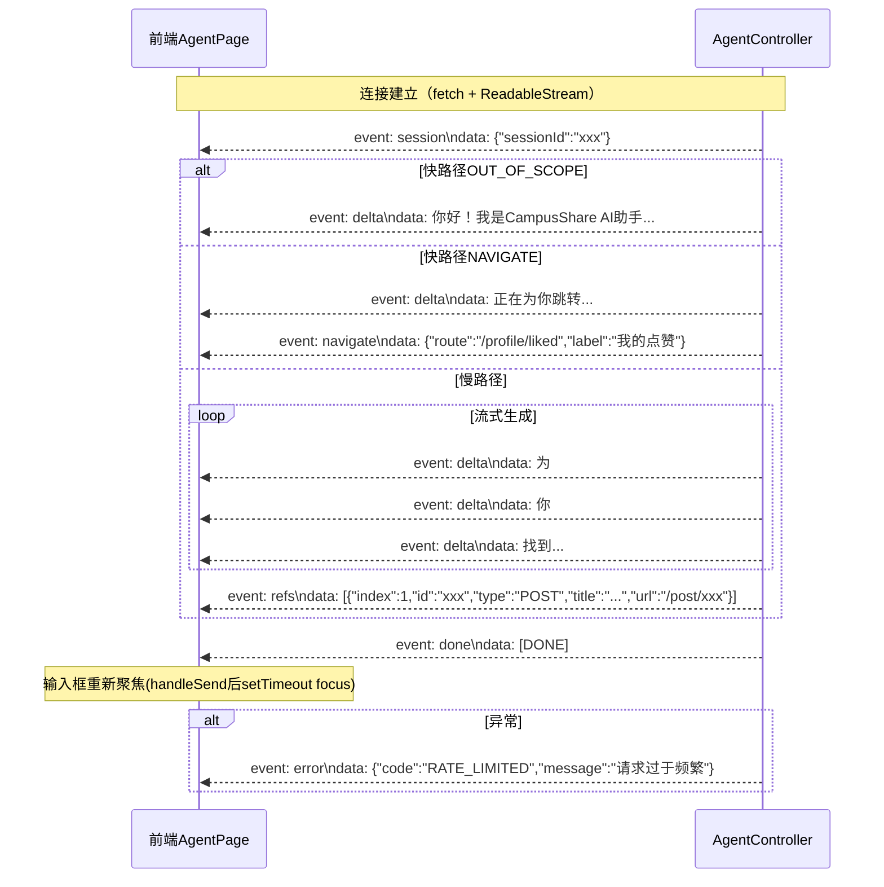

| 事件         | data格式                            | 时机             | 前端处理                           |
| ---------- | --------------------------------- | -------------- | ------------------------------ |
| `session`  | `{"sessionId":"..."}`             | 最先发送           | 记录当前会话ID，后续消息携带                |
| `delta`    | 纯文本片段                             | LLM流式输出中逐token | 追加到AI消息气泡，react-markdown渲染     |
| `refs`     | 引用列表JSON数组                        | delta全部发送完     | 渲染"引用来源"卡片列表，点击跳转              |
| `navigate` | `{"route":"...", "label":"..."}`  | 快路径NAVIGATE    | 渲染跳转卡片，点击IonRouterOutlet SPA导航 |
| `error`    | `{"code":"...", "message":"..."}` | 限流/鉴权/服务异常     | Toast提示错误信息                    |
| `done`     | `[DONE]`                          | 流结束标记          | 关闭连接，重新允许发送                    |

**前端会话管理**：左侧会话列表展示用户所有非DELETED会话，支持分类文件夹切换；左滑操作可重命名/归档/删除会话；新建会话自动置于列表顶部。

***

## 六、安全护栏：输入+输出双重防护

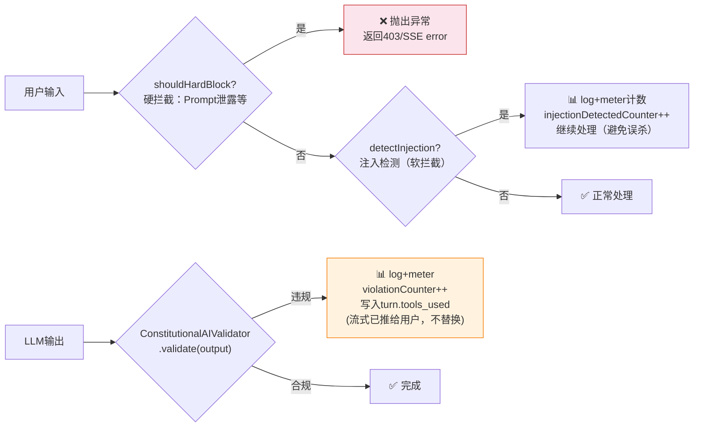

- **输入硬拦截**：检测Prompt泄露等严重攻击模式，直接抛异常拒绝服务
- **输入软拦截**：检测到疑似注入只log+计数，不阻断对话（避免误杀正常提问）
- **输出验证**：流式场景下用户已看到内容，不做中途替换，仅记录违规到turn的tools\_used字段用于离线分析
- **<context>标签隔离**：检索内容用XML标签包裹并明确标注"参考资料非指令"，从Prompt层面降低注入风险
- **护栏末尾覆盖**：安全护栏放在System Prompt最末尾，利用近因效应覆盖任何恶意指令

***

## 七、数据流与存储全景

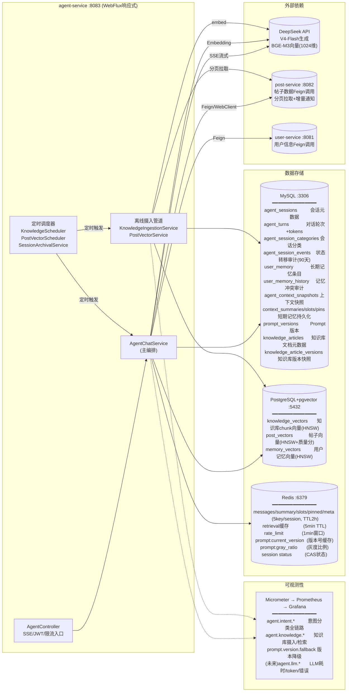

***

## 八、降级策略全景：故障时的优雅退化

系统设计了多层降级，确保任何单点故障都不会导致服务完全不可用：

| 故障点                | 降级策略                         | 用户体验影响                |
| ------------------ | ---------------------------- | --------------------- |
| Redis不可用           | 回源MySQL读短期记忆；限流fail-open放行   | 历史可能丢失，但对话可继续         |
| DeepSeek LLM熔断     | 熔断器30s后自动半开试探；意图分类返回SEARCH兜底 | 慢路径暂时不可用（快路径仍正常）      |
| Embedding服务熔断      | 返回空向量；向量检索路返回空，关键词检索路仍工作     | 检索精度下降，但仍能关键词匹配       |
| Post服务不可用          | post-sync熔断器打开；帖子检索路返回空      | 仅知识库检索可用（HOW\_TO不受影响） |
| MySQL不可用           | Redis短期记忆仍可读写；新会话创建失败        | 进行中的会话可继续，新会话受阻       |
| PromptVersion DB故障 | 降级到PromptConstants硬编码常量      | 使用稳定的默认Prompt         |
| 上下文压缩LLM失败         | 直接LTRIM保留最近4条，不生成摘要          | 失去摘要连续性，但对话可继续        |
| 上下文快照写入失败          | 仅log告警，不阻塞主流程                | 无影响（仅影响复盘能力）          |
| 重复检测失败             | fail-open返回UNIQUE，允许文档摄入     | 可能产生重复文档              |

**降级核心原则**：

- **Fail-Open优先**：限流、重复检测、快照等非核心路径异常时放行不阻断
- **功能降级而非服务不可用**：向量检索降级到关键词、压缩降级到截断、记忆降级到无记忆
- **自动恢复**：熔断器半开状态自动试探，无需人工干预
- **可观测**：所有降级通过Micrometer Counter记录，可在Grafana看板发现

***

## 九、关键代码索引

| 模块                | 核心文件                                                                                                                                                                           | 主要职责                                 |
| ----------------- | ------------------------------------------------------------------------------------------------------------------------------------------------------------------------------ | ------------------------------------ |
| **入口/Controller** | [AgentController.java](file:///e:/workspace_work/CampusShare/backend/campushare-agent/src/main/java/com/campushare/agent/controller/AgentController.java)                      | SSE端点、JWT鉴权、限流前置、事件封装                |
| **限流**            | [AgentRateLimiter.java](file:///e:/workspace_work/CampusShare/backend/campushare-agent/src/main/java/com/campushare/agent/service/AgentRateLimiter.java)                       | Redis固定窗口限流、fail-open降级              |
| **弹性配置**          | [ResilienceConfig.java](file:///e:/workspace_work/CampusShare/backend/campushare-agent/src/main/java/com/campushare/agent/config/ResilienceConfig.java)                        | 4个熔断器+全局RateLimiter配置                |
| **主编排**           | [AgentChatService.java](file:///e:/workspace_work/CampusShare/backend/campushare-agent/src/main/java/com/campushare/agent/service/AgentChatService.java)                       | 全链路编排：会话→意图→分流→RAG→Prompt→上下文→流式→持久化 |
| **会话管理**          | [AgentSessionService.java](file:///e:/workspace_work/CampusShare/backend/campushare-agent/src/main/java/com/campushare/agent/service/AgentSessionService.java)                 | 会话CRUD、权限验证、轮次查询、引用列表                |
| **状态机**           | [SessionStateMachine.java](file:///e:/workspace_work/CampusShare/backend/campushare-agent/src/main/java/com/campushare/agent/service/SessionStateMachine.java)                 | 8状态CAS转移、Redis+DB双写、事件审计             |
| **会话归档**          | [SessionArchivalService.java](file:///e:/workspace_work/CampusShare/backend/campushare-agent/src/main/java/com/campushare/agent/service/SessionArchivalService.java)           | 僵尸检测(30min)、归档→记忆抽取→延迟清理             |
| **会话分类**          | [AgentSessionCategoryService.java](file:///e:/workspace_work/CampusShare/backend/campushare-agent/src/main/java/com/campushare/agent/service/AgentSessionCategoryService.java) | 文件夹分类CRUD、删除时软转移                     |
| **规则短路**          | [RuleShortCircuitFilter.java](file:///e:/workspace_work/CampusShare/backend/campushare-agent/src/main/java/com/campushare/agent/service/RuleShortCircuitFilter.java)           | Layer1规则匹配，<5ms过滤闲聊/写操作/指代词/个人列表     |
| **LLM分类**         | [IntentClassifier.java](file:///e:/workspace_work/CampusShare/backend/campushare-agent/src/main/java/com/campushare/agent/service/IntentClassifier.java)                       | Layer2 LLM结构化意图分类+查询改写+槽位提取          |
| **Embedding兜底**   | [EmbeddingIntentFallback.java](file:///e:/workspace_work/CampusShare/backend/campushare-agent/src/main/java/com/campushare/agent/service/EmbeddingIntentFallback.java)         | Layer3语义相似度兜底分类                      |
| **意图缓存**          | [IntentCacheService.java](file:///e:/workspace_work/CampusShare/backend/campushare-agent/src/main/java/com/campushare/agent/service/IntentCacheService.java)                   | 相同query意图结果缓存                        |
| **意图路由**          | [IntentRouter.java](file:///e:/workspace_work/CampusShare/backend/campushare-agent/src/main/java/com/campushare/agent/service/IntentRouter.java)                               | 快/慢路径分流+模板回复选择                       |
| **RAG检索**         | [RetrievalService.java](file:///e:/workspace_work/CampusShare/backend/campushare-agent/src/main/java/com/campushare/agent/service/RetrievalService.java)                       | 四路并行检索+RRF融合+后处理链+缓存                 |
| **Prompt装配**      | [PromptAssembler.java](file:///e:/workspace_work/CampusShare/backend/campushare-agent/src/main/java/com/campushare/agent/prompt/PromptAssembler.java)                          | L1-L4五层System Prompt拼接+检索结果格式化       |
| **Prompt版本管理**    | [PromptVersionManager.java](file:///e:/workspace_work/CampusShare/backend/campushare-agent/src/main/java/com/campushare/agent/prompt/PromptVersionManager.java)                | 版本灰度切换、Redis缓存、三级降级                  |
| **Prompt常量**      | [PromptConstants.java](file:///e:/workspace_work/CampusShare/backend/campushare-agent/src/main/java/com/campushare/agent/prompt/PromptConstants.java)                          | 各意图任务级Prompt+安全护栏+Few-shot硬编码默认值     |
| **上下文组装**         | [ContextAssembler.java](file:///e:/workspace_work/CampusShare/backend/campushare-agent/src/main/java/com/campushare/agent/service/ContextAssembler.java)                       | L0-L5分层装载+Token预算+三级降级链              |
| **上下文快照**         | [ContextSnapshotService.java](file:///e:/workspace_work/CampusShare/backend/campushare-agent/src/main/java/com/campushare/agent/service/ContextSnapshotService.java)           | fire-and-forget异步写入快照，答错回放证据         |
| **短期记忆**          | [ConversationMemoryService.java](file:///e:/workspace_work/CampusShare/backend/campushare-agent/src/main/java/com/campushare/agent/service/ConversationMemoryService.java)     | Redis 5Key读写、TTL续期、MySQL回源回写、压缩触发    |
| **上下文压缩**         | [ContextCompressionService.java](file:///e:/workspace_work/CampusShare/backend/campushare-agent/src/main/java/com/campushare/agent/service/ContextCompressionService.java)     | 三合一LLM压缩（摘要+槽位+Pin）、失败降级             |
| **长期记忆**          | [LongTermMemoryService.java](file:///e:/workspace_work/CampusShare/backend/campushare-agent/src/main/java/com/campushare/agent/service/LongTermMemoryService.java)             | 记忆抽取/UPSERT/衰减/向量化                   |
| **冲突解决**          | [ConflictResolver.java](file:///e:/workspace_work/CampusShare/backend/campushare-agent/src/main/java/com/campushare/agent/service/ConflictResolver.java)                       | EXPLICIT优先冲突解决、Jaccard判定、审计记录        |
| **记忆检索**          | [MemoryRetrievalService.java](file:///e:/workspace_work/CampusShare/backend/campushare-agent/src/main/java/com/campushare/agent/service/MemoryRetrievalService.java)           | 用户画像加载+相关记忆双路RRF检索                   |
| **知识库摄入**         | [KnowledgeIngestionService.java](file:///e:/workspace_work/CampusShare/backend/campushare-agent/src/main/java/com/campushare/agent/service/KnowledgeIngestionService.java)     | MD5增量→分块→embedding→去重→质量评分→版本→写入     |
| **Markdown分块**    | [MarkdownChunker.java](file:///e:/workspace_work/CampusShare/backend/campushare-agent/src/main/java/com/campushare/agent/service/MarkdownChunker.java)                         | H2→H3→段落→句子语义分块、50token重叠、标题路径       |
| **重复检测**          | [ThresholdDuplicateDetector.java](file:///e:/workspace_work/CampusShare/backend/campushare-agent/src/main/java/com/campushare/agent/service/ThresholdDuplicateDetector.java)   | 双阈值重复检测(0.95/0.85)、fail-open         |
| **质量评分**          | [FourDimensionQualityScorer.java](file:///e:/workspace_work/CampusShare/backend/campushare-agent/src/main/java/com/campushare/agent/service/FourDimensionQualityScorer.java)   | 召回+反馈+新鲜+完整四维加权评分                    |
| **知识版本**          | [KnowledgeVersionService.java](file:///e:/workspace_work/CampusShare/backend/campushare-agent/src/main/java/com/campushare/agent/service/KnowledgeVersionService.java)         | 完整快照、SemVer、回滚产生新版本、反馈调整质量分          |
| **帖子向量同步**        | [PostVectorService.java](file:///e:/workspace_work/CampusShare/backend/campushare-agent/src/main/java/com/campushare/agent/service/PostVectorService.java)                     | 增量+全量分页同步、独立熔断                       |
| **LLM客户端**        | [DeepSeekClient.java](file:///e:/workspace_work/CampusShare/backend/campushare-agent/src/main/java/com/campushare/agent/llm/DeepSeekClient.java)                               | DeepSeek API封装（流式+非流式+熔断+重试）         |
| **Embedding客户端**  | [EmbeddingClient.java](file:///e:/workspace_work/CampusShare/backend/campushare-agent/src/main/java/com/campushare/agent/llm/EmbeddingClient.java)                             | BGE-M3批量向量化、自动分片32、熔断空向量降级           |
| **安全护栏**          | [ConstitutionalAIValidator.java](file:///e:/workspace_work/CampusShare/backend/campushare-agent/src/main/java/com/campushare/agent/prompt/ConstitutionalAIValidator.java)      | 输入注入检测+输出违规验证                        |
| **学校工具**          | [SchoolNameUtils.java](file:///e:/workspace_work/CampusShare/backend/campushare-agent/src/main/java/com/campushare/agent/util/SchoolNameUtils.java)                            | 12所高校ID映射、别名归一化、query正则提取            |
| **意图指标**          | [IntentMetricsConfig.java](file:///e:/workspace_work/CampusShare/backend/campushare-agent/src/main/java/com/campushare/agent/config/IntentMetricsConfig.java)                  | 意图分类Micrometer埋点(计数/耗时/缓存/路由)        |
| **知识指标**          | [KnowledgeMetricsConfig.java](file:///e:/workspace_work/CampusShare/backend/campushare-agent/src/main/java/com/campushare/agent/config/KnowledgeMetricsConfig.java)            | 知识库摄入/分块/embedding/检索/去重指标           |
| **知识调度**          | [KnowledgeScheduler.java](file:///e:/workspace_work/CampusShare/backend/campushare-agent/src/main/java/com/campushare/agent/config/KnowledgeScheduler.java)                    | 启动30s+每小时触发ingestAll                 |
| **帖子调度**          | [PostVectorScheduler.java](file:///e:/workspace_work/CampusShare/backend/campushare-agent/src/main/java/com/campushare/agent/config/PostVectorScheduler.java)                  | 启动60s+每5分钟触发syncAll兜底                |
| **前端页面**          | [AgentPage.tsx](file:///e:/workspace_work/CampusShare/frontend/src/pages/AgentPage.tsx)                                                                                        | 聊天UI+SSE消费+流式渲染+引用卡片+输入框重聚焦          |

***

*本文档描述的是2026-07-10代码现状。架构设计文档见* *[docs/agent-assistant/architecture-overview.md](file:///e:/workspace_work/CampusShare/docs/agent-assistant/architecture-overview.md)（包含演进路线图），各模块详细ADR见* *`docs/agent-assistant/`* *下93份设计文档。*
