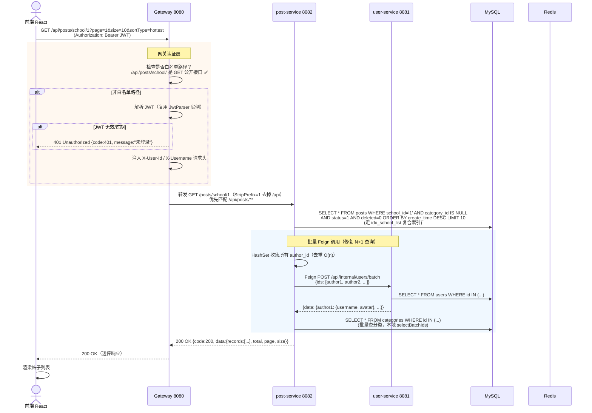

# 接口设计记录：网关路由与内部 API

- **日期：** 2026-06-27（初版） / 2026-06-29（微服务拆分后内部 API 规范）
- **STAR — S：** 调用方为前端 React（经 Nginx 反代）+ 微服务间 Feign 内部调用。前端预期并发 1000+ QPS，内部 Feign 调用每帖列表请求触发批量用户信息查询
- **STAR — T：** 统一入口网关做 JWT 认证+路由；内部 API 与外部 API 路径分离，避免内部接口被外部直接访问；分页/排序/错误码全链路统一

---

## 接口交互序列图（强制 Mermaid）

> 场景：前端请求学校帖子列表 → 网关认证 → post-service 查询 → Feign 批量查作者信息 → 返回
> 这条链路展示了网关认证、路由优先匹配、Feign 内部调用的完整流程。



---

## 核心接口列表

### 外部 API（经网关，前端调用）

| 接口名 | 方法 | 路径 | 描述 | 幂等？ | 超时 |
|--------|------|------|------|--------|------|
| 用户登录 | POST | /api/auth/login | 账号/邮箱+密码登录，返回 JWT | 否 | 10s |
| 发布帖子 | POST | /api/posts | 创建帖子（需登录） | 否 | 30s |
| 学校帖子列表 | GET | /api/posts/school/{schoolId} | 分页查询，支持 sortType=latest/hottest | 是 | 10s |
| 分类帖子列表 | GET | /api/posts/category/{categoryId} | 分页查询分类/子分类帖子 | 是 | 10s |
| 帖子详情 | GET | /api/posts/{postId} | 含正文 content 大字段 | 是 | 10s |
| 点赞帖子 | POST | /api/posts/{postId}/like | 幂等（uk_post_user 唯一索引防重） | 是 | 5s |
| 收藏帖子 | POST | /api/posts/{postId}/star | 幂等 | 是 | 5s |
| 发表评论 | POST | /api/comments | 创建评论/回复 | 否 | 10s |
| 通知收纳篮 | GET | /api/notifications/feed | 按类型分组返回收纳篮 | 是 | 5s |
| 更新隐私设置 | PUT | /api/users/me/privacy | 5 个隐私开关 | 是 | 5s |

### 内部 API（Feign 调用，路径前缀 /api/internal/）

| 接口名 | 方法 | 路径 | 调用方→被调方 | 描述 |
|--------|------|------|--------------|------|
| 批量查用户信息 | POST | /api/internal/users/batch | post→user | 帖子列表批量查作者信息（修复 N+1） |
| 获取用户简略信息 | GET | /api/internal/users/{id}/simple | post→user | 单个用户信息（头像/用户名） |
| 发送通知 | POST | /api/internal/notifications | post→user | 点赞/收藏/评论时触发通知 |
| 批量创建测试用户 | POST | /api/internal/users/batch-create | post→user | 数据初始化用 |
| 获取用户帖子列表 | GET | /api/internal/posts/user/{userId} | user→post | 个人主页展示用户帖子 |
| 获取用户帖子统计 | GET | /api/internal/posts/stats/{userId} | user→post | 个人主页统计发帖/获赞数 |

---

## 关键设计决策

### 决策1：网关路由——优先匹配 post-service，兜底 user-service
- **选择：** Spring Cloud Gateway 静态路由，`/api/posts/**,/api/comments/**,/api/categories/**,/api/admin/**` 优先匹配 post-service，其余 `/api/**` 兜底到 user-service。`StripPrefix=1` 去掉 `/api` 前缀。
- **理由（STAR — A）：** 静态路由比服务发现简单，Docker Compose 环境服务名固定；优先匹配避免 post-service 路径被 user-service 兜底吞掉
- **被拒绝方案：** 动态服务发现（Eureka/Nacos）——当前服务数少、固定部署，引入注册中心复杂度 > 收益

### 决策2：白名单机制——GET 公开接口 + 认证初始化接口免 JWT
- **选择：** 网关白名单路径：`/api/posts/school/`、`/api/posts/`、`/api/files/`、`/api/auth/init-default-users`。白名单内请求跳过 JWT 验证直接转发。
- **理由：** 帖子列表/详情是公开内容（未登录可浏览）；文件下载需公开；初始化接口在首次部署时无用户无法认证
- **tradeoff：** 白名单路径需谨慎维护，避免误开放需认证的接口

### 决策3：内部 API 路径隔离——/api/internal/** 前缀
- **选择：** 内部 Feign 调用统一用 `/api/internal/` 前缀，与外部 API 路径分离
- **理由：** 内部接口（如批量查用户、发送通知）仅供服务间调用，不应被前端直接访问。路径隔离便于未来加内部 API 鉴权（如内部 token/IP 白名单）
- **当前局限：** 暂未对 `/api/internal/**` 做访问控制，依赖 Docker 网络隔离（内部端口不对外暴露）

### 决策4：分页方案——offset-based 分页 + MyBatis-Plus PaginationInnerInterceptor
- **选择：** offset-based 分页（page/size 参数），MyBatis-Plus `selectPage` + `PaginationInnerInterceptor` 自动加 LIMIT
- **理由：** 校园帖子列表深度分页场景少（用户很少翻到第 100 页），offset 分页实现简单
- **被拒绝方案：** cursor-based 游标分页——实现复杂，当前场景无深度分页性能问题
- **踩坑记录：** 初版漏配 PaginationInnerInterceptor，导致 `size=10` 返回全部 10000 条数据。详见 [数据库索引优化记录](../performance/2026-06-29_optimization_数据库复合索引设计.md)

### 决策5：统一响应封装 Result<T> + 错误码枚举
- **选择：** 所有接口返回 `Result<T>`（code/message/data），错误码用 `ResultCode` 枚举
- **错误响应示例：**

```json
{
  "code": 401,
  "message": "未登录或登录已过期",
  "data": null
}
```

- **tradeoff：** 统一封装牺牲了 HTTP 状态码语义（业务错误也返回 200 + code 字段），但前端处理逻辑统一

### 决策6：幂等性设计——唯一索引 + 数据库原子操作
- **选择：** 点赞/收藏用 `UNIQUE KEY uk_post_user(post_id, user_id)` 数据库唯一索引保证幂等；计数更新用 `UPDATE ... SET count = count + 1` 原子操作
- **理由：** 数据库唯一索引是最可靠的幂等保证，无需应用层分布式锁
- **被拒绝方案：** 应用层先查再插（SELECT + INSERT）——并发下有竞态条件

---

## 被拒绝的接口设计

| 方案 | 为什么被拒绝 |
|------|-------------|
| 动态服务发现路由（Eureka） | 服务数少、固定部署，注册中心复杂度 > 收益 |
| cursor-based 游标分页 | 当前无深度分页性能问题，实现复杂 |
| 内部 API Token 鉴权 | Docker 网络已隔离内部端口，暂不需要 |
| 跨服务 JOIN 查询 | 违反微服务边界铁律，禁止跨服务直接访问表 |
| GraphQL 单端点 | 前端场景简单（REST 足够），GraphQL 学习/运维成本高 |

---

## 向后兼容约定

- **破坏性变更处理：** API 路径只加不改不删；字段演进只加不删不改含义；废弃字段保留 1 个版本带 `@Deprecated`
- **boolean 字段命名规范：** Java 实体用 `Boolean publicPosts`（Lombok 生成 `getPublicPosts()`），DTO 字段名用 `publicPosts` 而非 `isPublicPosts`（避免 Jackson 序列化歧义），用 `@JsonProperty("isXxx")` 注解控制 JSON 输出
- **数据库迁移：** 每次表结构变更生成 `V{日期}_{序号}__{描述}.sql` 迁移脚本，用 `IF NOT EXISTS`/`INSERT IGNORE` 保证可重复执行
