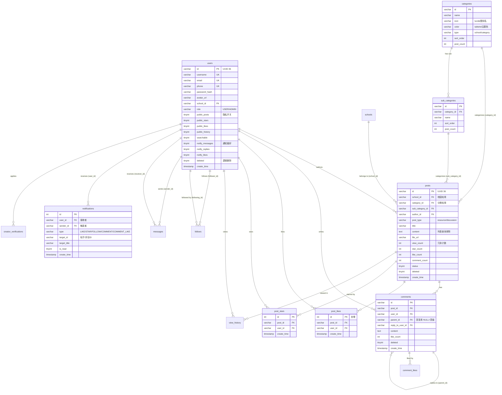

# 数据模型设计：核心实体

- **日期：** 2026-06-27（初版） / 2026-06-29（拆分后表所有权归位） / 2026-06-30（隐私/通知字段）
- **版本：** v1.2
- **STAR — S：** 校园社区平台核心查询场景为"按学校/分类分页查帖子列表、按时间排序"、"查用户帖子/收藏/点赞/浏览历史"、"通知收纳篮按类型分组"。预期单校 1 万帖子级别。
- **STAR — T：** 支持上述高频查询模式，写入吞吐中等（发帖/点赞/评论），核心列表查询 P95 < 100ms
- **STAR — R：** 复合索引优化后 P95=70ms，QPS 1151 req/s，详见 [数据库复合索引优化记录](../performance/2026-06-29_optimization_数据库复合索引设计.md)

---

## 核心查询模式

> 这些查询模式直接决定了复合索引的设计（见性能优化记录）。

| # | 查询描述 | 频率 | 是否关键路径 | 延迟要求 |
|---|---------|------|-------------|----------|
| 1 | 按学校分页查帖子列表，按 create_time DESC 排序 | 极高（首页） | 是 | P95 < 100ms |
| 2 | 按分类/子分类分页查帖子列表，按 create_time DESC | 极高（分类广场） | 是 | P95 < 100ms |
| 3 | 按作者分页查用户帖子列表（个人主页） | 高 | 是 | P95 < 100ms |
| 4 | 按帖子查评论列表，按 create_time 排序 | 高 | 是 | P95 < 100ms |
| 5 | 按用户查浏览历史，按 view_time DESC | 中 | 否 | P95 < 200ms |
| 6 | 按用户查收藏/点赞列表，按 create_time DESC | 中 | 否 | P95 < 200ms |
| 7 | 按用户+类型查通知（收纳篮分组），按 create_time DESC | 高（通知中心） | 是 | P95 < 100ms |
| 8 | 检查用户是否已点赞/收藏某帖（uk_post_user 唯一索引） | 极高（每次点赞） | 是 | < 10ms |

---

## ER 图（强制 Mermaid）

> 核心实体关系图。按微服务表所有权分组着色：user-service 表（绿色边）、post-service 表（蓝色边）。

---

## 关键设计决策

### 决策1：核心业务表用 UUID 主键，关联表用自增 INT
- **背景（STAR — S）：** users/posts/comments/messages 需要分布式生成 ID；post_likes/post_stars/view_history/follows/notifications 是高频写入的关联表
- **选择（STAR — A）：** 核心表用 `VARCHAR(36)` UUID（MyBatis-Plus `IdType.ASSIGN_UUID`），关联表用 `INT AUTO_INCREMENT`
- **tradeoff（STAR — R）：**
  - ✅ UUID 便于未来分库分表，无自增 ID 冲突
  - ✅ 关联表自增 INT 插入性能好（顺序写 B+ 树叶子页）
  - ❌ UUID 占用空间大（36 字节 vs 4 字节），二级索引体积更大
  - ❌ UUID 无序，InnoDB 聚簇索引写入会有页分裂（核心表写入频率不高，可接受）

### 决策2：帖子表冗余 view_count/star_count/like_count/comment_count 计数
- **背景：** 帖子列表需要显示互动数，如果每次都 COUNT(*) 聚合会拖慢列表查询
- **选择：** 在 posts 表冗余存储四个计数字段，点赞/收藏/评论时同步 UPDATE
- **tradeoff：**
  - ✅ 列表查询 O(1) 读取计数，无需 JOIN/聚合
  - ❌ 计数更新有并发竞争（高并发点赞时 like_count 可能不准），当前用 `UPDATE ... SET like_count = like_count + 1` 数据库原子操作保证最终一致
  - ❌ 冗余字段需业务层维护一致性，未用触发器

### 决策3：posts 表用 school_id 和 category_id 互斥区分校园帖/分类帖
- **背景：** 校园帖属于某学校（school_id），分类广场帖属于某分类（category_id + sub_category_id），两类帖查询模式不同
- **选择：** 同一张 posts 表，校园帖 school_id 非空+category_id 为 NULL，分类帖反之。复合索引 `idx_school_list(school_id, category_id, status, deleted, create_time)` 中 category_id IS NULL 作为等值条件
- **tradeoff：**
  - ✅ 单表统一管理，无需 UNION 查询
  - ✅ 复合索引能覆盖两类查询
  - ❌ 字段互斥靠应用层约束，DB 层无 CHECK 约束

### 决策4：通知表按 type 字段区分通知类型，收纳篮按 type GROUP BY
- **背景：** 通知类型多（LIKE/STAR/FOLLOW/COMMENT/COMMENT_LIKE/MESSAGE），前端需按类型分组成"收纳篮"
- **选择：** 单表 notifications，type 字段区分类型，`idx_user_list(user_id, type, is_read, create_time)` 复合索引支持按用户+类型+已读状态分组查询
- **tradeoff：**
  - ✅ 单表查询+GROUP BY 即可，无需多表 UNION
  - ✅ 通知偏好过滤（关闭某类通知）在应用层按 type 过滤即可
  - ❌ 消息类通知（私信）和互动类通知结构略不同，用 target_title 等可空字段兼容

### 决策5：索引策略——等值列在前，排序列在后
- **背景：** 高频列表查询都是"多条件等值过滤 + create_time DESC 排序 + LIMIT 分页"
- **选择：** 复合索引设计遵循"等值条件列在前，排序列在最后"原则，如 `idx_school_list(school_id, category_id, status, deleted, create_time)`
- **哪些字段故意没建索引：**
  - posts.content（TEXT 大字段，永远不作查询条件）
  - posts.file_url/file_name（不作查询条件）
  - 详见 [数据库复合索引优化记录](../performance/2026-06-29_optimization_数据库复合索引设计.md)

---

## 反模式检查清单

- [x] 是否有循环依赖的 FK？→ 否。comments 表 parent_id 自引用是树形结构，非循环
- [x] 是否有超大宽表（单表 >30 列）？→ posts 表约 18 列，users 表约 20 列（含隐私/通知字段），可接受
- [x] 是否有 EAV（Entity-Attribute-Value）反模式？→ 否
- [x] 是否有隐式约定的字段含义？→ posts.school_id 和 category_id 互斥是隐式约定（应用层约束），已记录
- [x] 是否设计了软删除？→ users/posts/comments 用 `deleted TINYINT` + MyBatis-Plus `@TableLogic`；关联表（likes/stars/history）物理删除；notifications 无软删除（直接标记 is_read）

---

## Schema 变更历史

| 版本 | 日期 | 变更内容 | 原因 | 迁移方式 |
|------|------|----------|------|----------|
| v1.0 | 2026-06-27 | 初始 17 张表（users/schools/posts/comments/likes/stars/history/follows/messages/notifications 等） | 项目启动 | init.sql |
| v1.1 | 2026-06-29 | 新增 categories/sub_categories 表；posts 新增 category_id/sub_category_id 字段 | 分类收纳袋功能 | V20260629__add_categories.sql |
| v1.1 | 2026-06-29 | posts/comments 等表复合索引重构（删单列索引，建复合索引） | 性能优化 | V20260629_2__add_composite_indexes.sql |
| v1.1 | 2026-06-30 | users 新增 role 字段；creator_verifications 新增 reviewer_id | 创作者审核+管理员角色 | V20260630_3__add_user_role_for_admin.sql |
| v1.2 | 2026-06-30 | users 新增 5 个隐私字段 + 3 个通知偏好字段 | 隐私设置+通知开关 | V20260630_5/6__add_*.sql |
