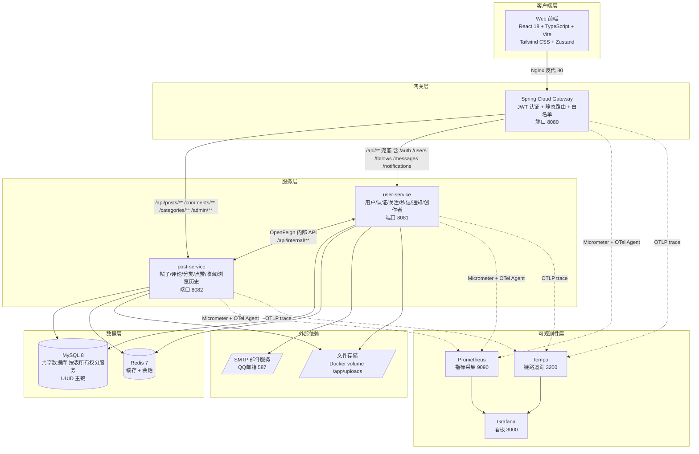
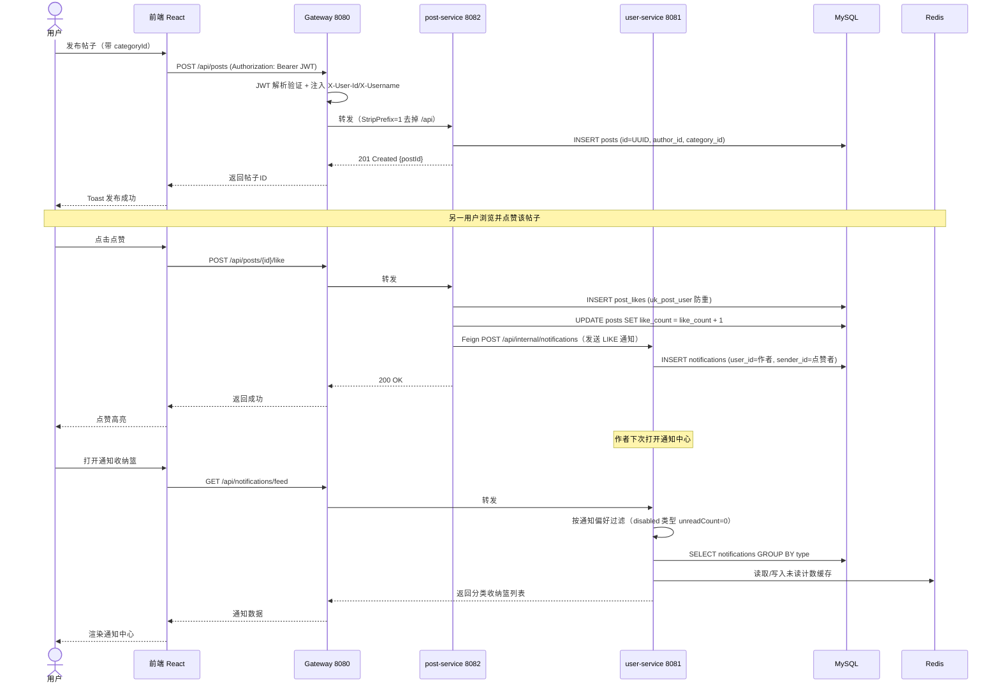

# 系统整体架构概览

- **日期：** 2026-06-27（初版） / 2026-06-29（微服务拆分后更新）
- **STAR — S (Situation)：**
  - 项目目标：校园资源共享平台 CampusShare，支持校园帖子、分类广场、私信、通知、创作者认证等社区功能
  - 预期规模：单校 1 万帖子级别压测验证，目标支撑 1000+ QPS
  - 团队规模：1 人全栈开发（AI Agent 辅助）
  - 时间约束：5 天内完成核心功能 + 微服务化 + 可观测性 + 性能优化
  - 已有技术栈约束：Java 17 + Spring Boot 3.2 + React 18 + MySQL 8 + Redis 7
- **STAR — T (Task)：** 交付一个前后端分离 + 微服务架构的校园社区平台，核心挑战是在小团队/短周期下完成微服务拆分、可观测性体系、性能调优三件事

---

## 整体组件图 (C4 Container 级别)

> 这是最重要的图。每次架构演进都要更新这张图。
> 当前状态：v1.5 — post-service 已从 user-service 拆分独立。

---

## 核心业务数据流图

> 业务场景：用户在分类广场发布一个帖子 → 其他用户浏览、点赞、评论 → 评论作者收到通知
> 这条链路覆盖了网关认证、跨服务 Feign 调用、通知投递三个核心环节。

---

## 关键约束与假设

| 约束维度 | 当前设定 | 来源 / 理由 |
|----------|----------|-------------|
| 最大 QPS | 1151 req/s（A/B 压测验证） | 4 核 8G + 复合索引优化后实测 |
| 数据留存 | 全量保留，逻辑删除（deleted=1） | 校园内容需可审计，不做物理删除 |
| 延迟 SLA | P95 < 100ms（核心列表接口） | 压测验证 P95=70ms |
| 预算上限 | 单台 4 核 8G 虚拟机 | 学生项目，控制成本 |
| 技术栈锁定 | Java 17 + Spring Boot 3.2 + MySQL 8 | 团队已有经验，生态成熟 |
| 主键策略 | 核心业务表 UUID（VARCHAR(36)），关联表自增 INT | UUID 便于分布式生成，关联表追求插入性能 |
| 服务间通信 | OpenFeign 同步调用（无消息队列） | 当前规模下 MQ 复杂度 > 收益 |

---

## 被排除的架构方案

| 方案 | 为什么不适用 |
|------|-------------|
| 完整微服务化（v2.0，每域一服务） | 团队仅 1 人，过早拆分引入分布式事务/服务发现复杂度，当前 v1.5 拆 post-service 已够用 |
| Serverless 部署 | 冷启动延迟不可接受 + Spring Boot 启动重，不适合 FaaS |
| Event Sourcing | 校园社区场景写多读多，事件溯源复杂度 > 收益 |
| 消息队列解耦通知 | 当前通知量级（单校几千条）下，同步 Feign + DB 写入足够；MQ 增加运维负担 |
| 跨服务 JOIN | 违反微服务边界铁律，禁止跨服务直接访问其他服务的表 |

---

## 已知风险 & 演进方向

1. **Feign 同步调用耦合**：user-service 依赖 post-service 的 Feign 调用，若 post-service 宕机，通知发送会失败。演进方向：引入本地消息表 + 异步重试，或引入 MQ。
2. **共享 MySQL 单点**：所有微服务共享一个 MySQL 实例（按表所有权逻辑隔离），未做读写分离/主从。数据量增长到百万级后需拆分独立数据库或读写分离。
3. **无分布式事务**：跨服务操作（如发帖 + 通知）无事务保证，依赖业务层补偿。当前可接受，后续需引入 Saga 或本地消息表。
4. **Tempo 健康检查绕过**：Tempo 2.5 配置最小化后健康检查端点空指针 panic，临时禁用 healthcheck。需完善 Tempo 配置恢复正式健康检查。
5. **缓存一致性**：Redis 缓存采用 TTL 过期策略（5 分钟），未做主动失效。学校帖子数等非实时数据可接受短窗口不一致。
