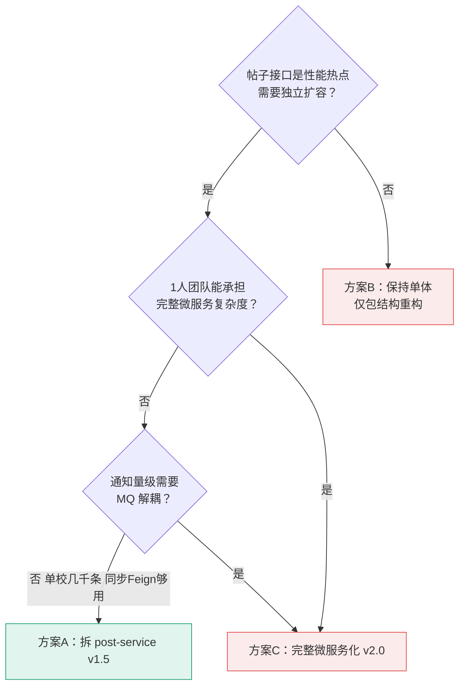

# ADR-001：将 post-service 从 user-service 中拆分为独立微服务

- **日期：** 2026-06-29
- **状态：** 已采纳
- **STAR 模式：**
  - **S — 情景：** v1.0 阶段 user-service 承载了用户+帖子+评论+分类+互动全部业务，单服务代码膨胀、职责混杂，性能压测时无法独立扩容帖子相关接口
  - **T — 任务：** 在不引入过度复杂度的前提下拆分服务边界，让帖子域可独立部署/扩容，为后续完整微服务化（v2.0）铺路
  - **A — 行动：** 见下方「候选方案」和「最终决策」
  - **R — 结果：** 见下方「影响与后果」和「实际验证结果」

---

## 背景与问题（STAR — S）

v1.0 阶段 user-service（端口 8081）是事实上的单体，包含：用户认证、个人资料、关注关系、私信、通知、文件上传、创作者认证、帖子、评论、分类、点赞、收藏、浏览历史。

带来的问题：
1. **代码膨胀**：单服务 Controller/Service/Mapper 数量过多，维护心智负担大
2. **无法独立扩容**：压测发现帖子列表接口（`/posts/school/{id}`）是热点，但无法只扩容帖子相关能力，必须整个 user-service 一起扩
3. **职责边界模糊**：UserController 里直接操作 FollowMapper，PostServiceImpl 和 UserServiceImpl 都堆在 service/ 根包下，分层不清晰
4. **数据库表混访问**：所有表都在一个服务里访问，没有"表所有权"概念，未来拆库时要改大量代码

数据规模：单校 1 万帖子压测验证，目标支撑 1000+ QPS。

---

## 候选方案（STAR — A 的分析部分）

### 方案 A：拆分 post-service 为独立微服务（v1.5，最终采纳）
- **核心思路：** 将帖子、评论、分类、子分类、点赞、收藏、浏览历史、数据初始化从 user-service 拆出为独立 post-service（端口 8082）。两服务通过 OpenFeign 双向调用内部 API（`/api/internal/**`），共享 MySQL 但按表所有权逻辑隔离。
- **优点：**
  - 帖子域可独立部署、独立扩容，压测热点接口时可单独扩 post-service
  - 强制建立"表所有权"边界，每个服务只能直接访问自己拥有的表，跨服务数据走 Feign
  - 为 v2.0 完整微服务化（拆分独立数据库、引入 MQ）铺路
  - 符合用户"尽早微服务化拆分，避免后期重构"的偏好
- **缺点：**
  - 引入跨服务调用延迟（Feign 同步调用，Docker 网络直连约 1-2ms）
  - 需要维护两套 Feign 客户端和内部 API，代码量增加
  - 跨服务操作无分布式事务（如发帖+通知），需业务层补偿
- **关键风险：** Feign 调用失败会导致功能不可用（如点赞后通知发送失败）。当前通过 try-catch 降级处理，未引入重试/熔断。

### 方案 B：保持单体（v1.0），仅做代码包结构重构
- **核心思路：** 不拆服务，只在 user-service 内部按业务域分包（post 包、user 包），用包边界代替服务边界。
- **优点：** 零运维成本，无跨服务调用延迟，无分布式事务问题
- **缺点：** 无法独立扩容，压测热点无法针对性处理；表所有权边界靠纪律约束而非架构强制，容易破坏
- **为什么最终没有选它：** 压测已证明帖子列表是性能热点，需要独立扩容能力；用户明确偏好"尽早拆分避免后期重构"；包边界约束力弱，1 人开发时也容易自己破坏边界

### 方案 C：完整微服务化（v2.0，每域一服务 + 独立数据库 + MQ）
- **核心思路：** 一步到位拆成 user/post/notification/message/file 等多个服务，每个服务独立数据库，引入 MQ 解耦通知/消息。
- **优点：** 架构最干净，每域可独立演进
- **缺点：** 1 人团队短期内无法承担分布式事务、服务发现、链路追踪、MQ 运维的复杂度；通知量级（单校几千条）下 MQ 收益 < 复杂度
- **为什么最终没有选它：** 当前规模下过度工程化；v1.5 拆 post-service 已能解决"独立扩容"核心诉求；MQ 在通知量级下是 over-engineering

---

## 决策流程图（强制）

---

## 最终决策（STAR — A 的核心）

**选择方案 A：拆分 post-service 为独立微服务（v1.5）**

**理由（按重要性排序）：**
1. 帖子列表接口是压测热点，独立扩容是性能优化的硬需求
2. 强制"表所有权"边界，每个服务只能访问自己的表，跨服务走 Feign —— 这是微服务化的核心纪律，越早建立越好
3. v1.5 是 v1.0 到 v2.0 的中间态，复杂度可控（仅 2 个业务服务 + Feign），为未来完整微服务化铺路
4. 符合用户"尽早拆分避免后期重构"的偏好

**被拒绝方案的具体缺陷：**
- 方案 B 被拒绝因为：包边界约束力弱，无法独立扩容，热点接口无法针对性处理
- 方案 C 被拒绝因为：1 人团队短期无法承担 MQ + 分布式事务 + 服务发现复杂度，通知量级下 MQ 是 over-engineering

---

## 服务边界划分

| 服务 | 端口 | 职责范围 | 拥有的数据库表 |
|------|------|----------|----------------|
| user-service | 8081 | 用户认证、个人资料、关注关系、私信、通知、文件上传、创作者认证 | users, follows, messages, notifications, creator_verifications |
| post-service | 8082 | 帖子、评论、分类/子分类、点赞、收藏、浏览历史、数据初始化 | posts, comments, post_likes, post_stars, comment_likes, view_history, categories, sub_categories |
| gateway | 8080 | JWT 认证、路由转发、白名单 | 无（无状态） |

**Feign 双向通信：**
- post-service → user-service：获取用户信息、发送通知、批量创建测试用户（InternalUserController，`/api/internal/users/**`）
- user-service → post-service：获取用户帖子列表、帖子统计（InternalPostController，`/api/internal/posts/**`）

---

## 影响与后果（STAR — R，事后回填）

- **正面影响：**
  - post-service 可独立扩容，压测时针对性优化帖子接口
  - 表所有权边界清晰，跨服务 JOIN 被架构禁止
  - 分层规范强制落地：Controller 只调 Service，Service 接口在 service/、实现在 service/impl/
- **负面影响（需接受的 tradeoff）：**
  - 跨服务 Feign 调用增加 1-2ms 延迟（Docker 网络直连，可接受）
  - 代码量增加：需维护两套 Feign 客户端 + 内部 Controller
  - 跨服务操作无分布式事务，依赖业务层 try-catch 降级
- **搁置问题（刻意不解决的事情）：**
  - 通知发送失败仅打日志不重试（当前通知量级下可接受）
  - 未引入服务发现（Docker Compose 服务名解析足够）
  - 未引入熔断/限流（Spring Cloud Gateway 预留了扩展点）
- **遗留风险：**
  - 风险1：post-service 宕机时，user-service 的 Feign 调用会失败，需引入熔断/降级
  - 风险2：共享 MySQL 单点，未做读写分离，数据量增长后需拆库

---

## 验证计划

| 验证指标 | 目标值 | 测量方式 | 回顾日期 |
|----------|--------|----------|----------|
| post-service 独立扩容后 QPS | > 1000 req/s | JMeter 压测 | 2026-06-29 |
| Feign 调用延迟 | < 5ms | Grafana P95 | 2026-06-29 |
| 跨服务表访问违规数 | 0 | 代码审查 | 持续 |

---

## （事后回填）实际验证结果

| 指标 | 目标值 | 实际值 | 结论 |
|------|--------|--------|------|
| post-service QPS（A/B 压测） | > 1000 req/s | 1151 req/s | ✅ 超预期 |
| Feign 调用对延迟影响 | < 5ms | < 2ms（Docker 直连） | ✅ 可忽略 |
| 跨服务表访问违规 | 0 | 0（InternalXxxController 规范执行） | ✅ 边界清晰 |
| 帖子接口 P95 | < 100ms | 70ms | ✅ 达标 |
