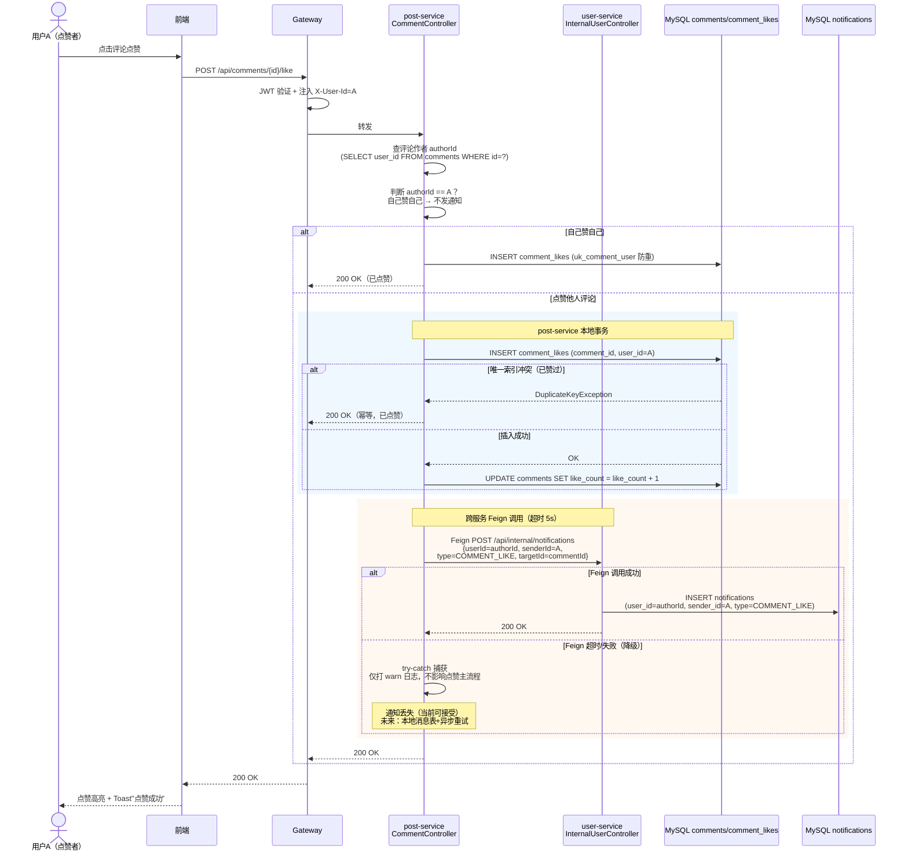
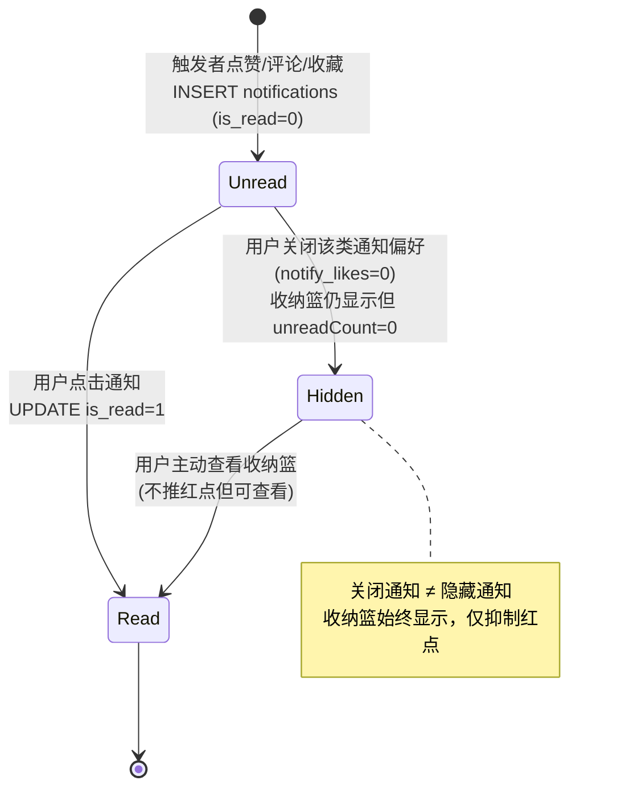

# 组件交互：评论点赞通知（跨服务事件链路）

- **日期：** 2026-06-29
- **涉及组件：** 前端 React、Gateway、post-service（CommentController/CommentServiceImpl）、user-service（InternalUserController/NotificationServiceImpl）、MySQL
- **STAR — S：** 评论被点赞时需向评论作者发送 `COMMENT_LIKE` 通知；评论数据在 post-service，通知数据在 user-service，跨服务事件需保证"点赞成功 + 通知投递"最终一致

---

## 交互序列图（强制 Mermaid）

> 场景：用户 A 点赞用户 B 的评论 → post-service 写 comment_likes → Feign 调 user-service 写 notifications
> 标注了超时、降级、不通知自己的判断。

---

## 状态机图（通知类型流转）

> 通知从产生到被阅读的状态流转。COMMENT_LIKE 是新增的通知类型。

---

## 关键设计考量

### 同步 vs 异步决策
- **此交互中同步环节：** 点赞写 comment_likes + 更新 like_count（post-service 本地事务，必须同步）
- **此交互中"伪异步"环节：** Feign 调用 user-service 写通知——技术上同步，但业务上 try-catch 降级，通知失败不影响点赞主流程
- **理由：** 当前通知量级（单校几千条）下，同步 Feign + try-catch 降级足够简单可靠；引入 MQ 会增加运维复杂度（Broker 部署、消费组管理、消息积压监控）

### 错误传播
- **comment_likes 插入失败（唯一索引冲突）：** 幂等处理，返回 200 OK"已点赞"，不报错
- **Feign 调用 user-service 失败：** 不透传给用户，仅打 warn 日志，点赞仍返回成功
- **为什么这样设计：** 点赞是核心功能，通知是辅助功能。辅助功能失败不应阻塞核心功能。但代价是通知可能丢失——未来用本地消息表补偿

### 超时与重试

| 调用环节 | 超时 | 重试次数 | 退避策略 | 理由 |
|----------|------|----------|----------|------|
| FE → GW | 10s | 0 | 无 | 浏览器超时控制 |
| GW → POST | 10s | 0 | 无 | 网关透传 |
| POST → DB（本地） | 5s（HikariCP） | 0 | 无 | 数据库连接池超时 |
| POST → USER（Feign） | 5s | 0 | 无 | 当前无重试，失败即降级；未来引入 Spring Retry + 指数退避 |
| USER → DB（本地） | 5s | 0 | 无 | 数据库连接池超时 |

### 通知偏好过滤的交互
- **过滤点在 user-service 的 `getNotificationFeed`**：所有类型收纳篮都显示，但被关闭类型（如 `notify_likes=0`）的 `unreadCount=0`（不推红点）
- **`getUnreadCount`**：按偏好排除被关闭类型的未读数，底部导航栏红点总数不含被关闭类型
- **设计理由：** 用户关闭通知 ≠ 隐藏通知，收纳篮始终可查看历史通知，仅抑制红点推送
