# Agent 模块完整链路梳理（SystemPrompt / RAG / 意图识别 / 上下文工程）

- **日期：** 2026-07-08
- **类型：** 架构梳理 / 链路全景
- **业务背景：** 主动需求型（技术驱动） — 为了加深对 agent 模块的理解，方便后续迭代和排障，需要一份图文并茂的链路梳理文档
  - **Why now：** agent 模块已完成 SystemPrompt 工程、意图识别、RAG 检索、上下文工程四大核心模块的开发，代码量较大，新人/上下文压缩后难以快速掌握全貌
  - **What if not done：** 后续排障效率低，新功能开发容易破坏现有设计，模块间边界模糊
  - **成功标志：** 一张图看懂 agent 全链路，各模块职责清晰，数据流方向明确

---

## 一、整体链路全景图

> 这是最重要的一张图。从用户发送消息到收到回复的完整数据流。

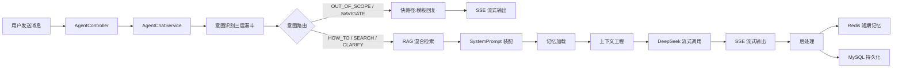

**核心编排器：** [AgentChatService.prepareContext()](file:///e:/workspace_work/CampusShare/backend/campushare-agent/src/main/java/com/campushare/agent/service/AgentChatService.java#L164-L240) — 8 步串行编排

---

## 二、意图识别：三层漏斗架构

### 2.1 漏斗结构图

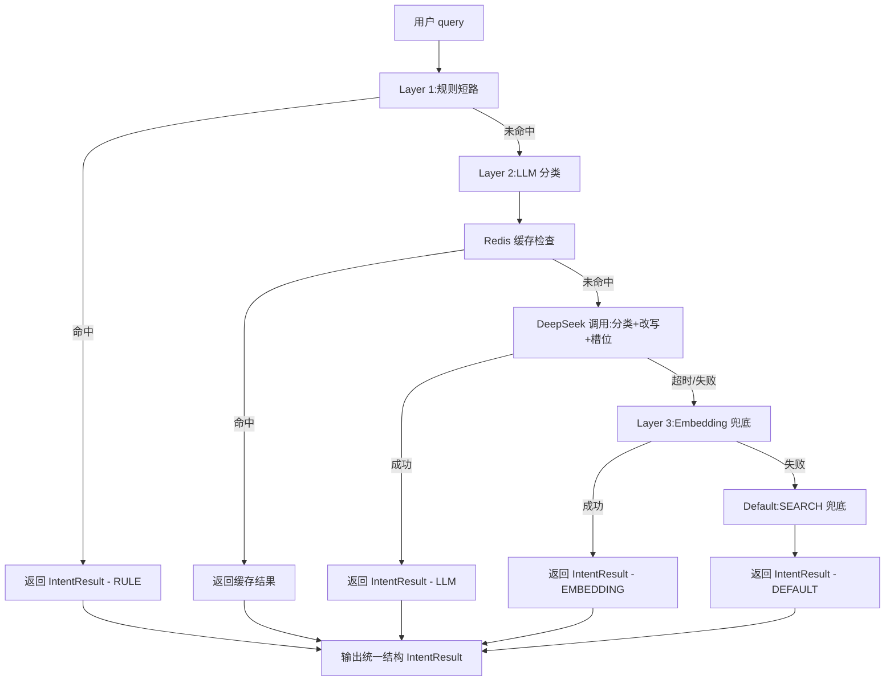

### 2.2 规则优先级（Layer 1）

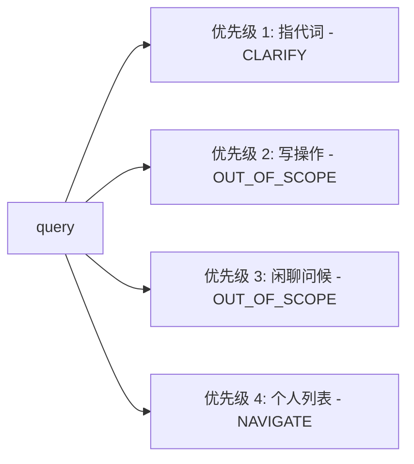

### 2.3 意图体系（5 大 + 14 子）

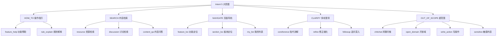

**核心文件：**
- [RuleShortCircuitFilter.java](file:///e:/workspace_work/CampusShare/backend/campushare-agent/src/main/java/com/campushare/agent/service/RuleShortCircuitFilter.java)
- [IntentClassifier.java](file:///e:/workspace_work/CampusShare/backend/campushare-agent/src/main/java/com/campushare/agent/service/IntentClassifier.java)
- [Intent.java](file:///e:/workspace_work/CampusShare/backend/campushare-agent/src/main/java/com/campushare/agent/enums/Intent.java)
- [IntentResult.java](file:///e:/workspace_work/CampusShare/backend/campushare-agent/src/main/java/com/campushare/agent/dto/IntentResult.java)

---

## 三、RAG 检索：四路混合检索 + RRF 融合

### 3.1 检索流程图

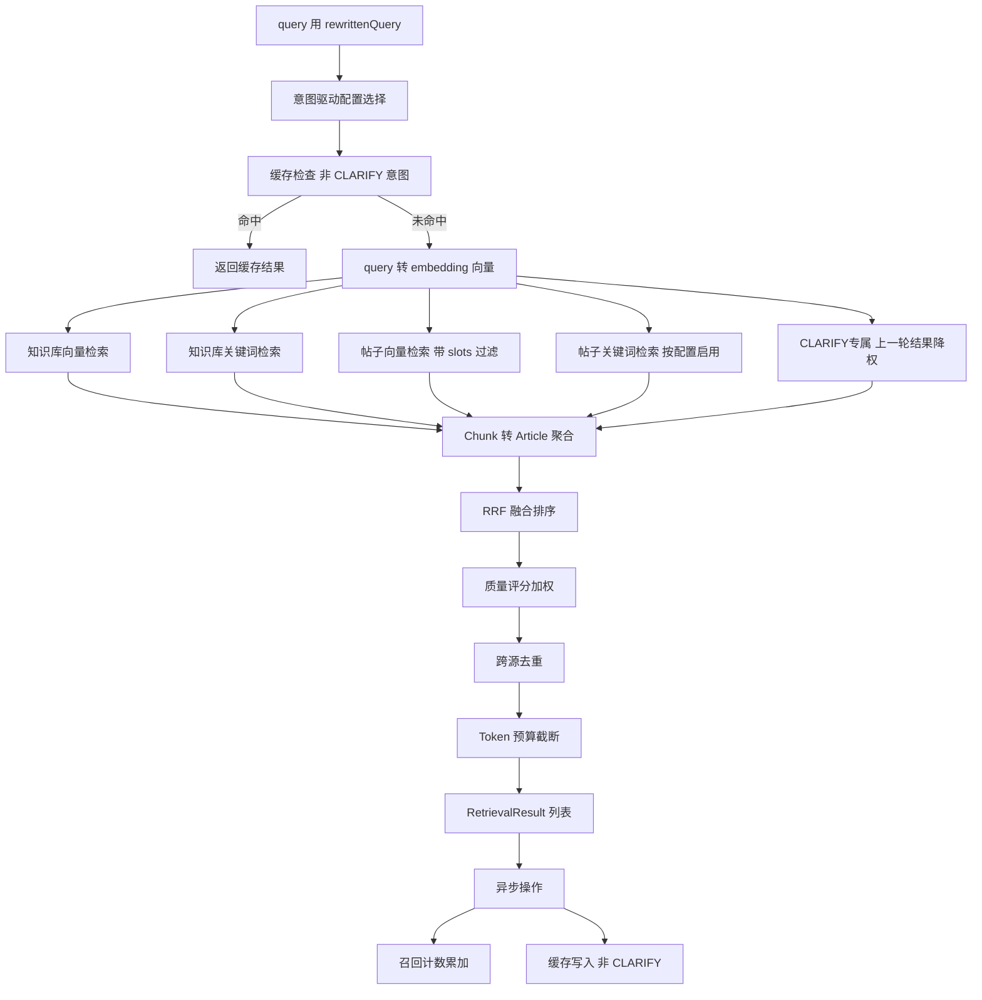

### 3.2 意图驱动的检索策略对比

| 意图 | 知识库向量 | 知识库关键词 | 帖子向量 | 帖子关键词 | 策略特点 |
|------|-----------|-------------|---------|-----------|---------|
| HOW_TO | 8 | 5 | 2 | 0 | 知识库为主，功能说明靠知识库 |
| SEARCH/resource | 2 | 2 | 8 | 5 | 帖子为主，找资源帖 |
| SEARCH/content_qa | 8 | 5 | 3 | 2 | 知识库为主，内容问答 |
| CLARIFY | 5 | 3 | 5 | 3 | 均衡，澄清追问靠上下文 |

### 3.3 RRF 融合示意

> 假设有 3 路检索结果，A 在第 1 路排第 1，第 2 路排第 3，第 3 路排第 2

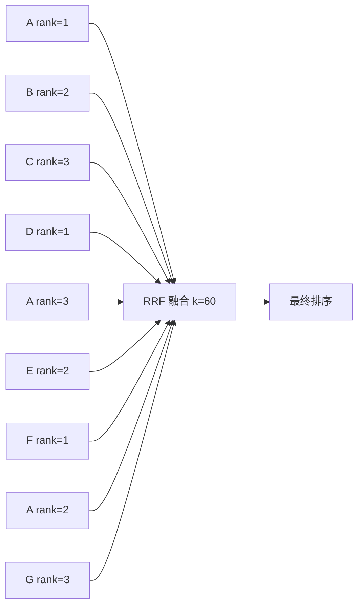

**核心文件：**
- [RetrievalService.java](file:///e:/workspace_work/CampusShare/backend/campushare-agent/src/main/java/com/campushare/agent/service/RetrievalService.java)
- [KnowledgeVectorStore.java](file:///e:/workspace_work/CampusShare/backend/campushare-agent/src/main/java/com/campushare/agent/store/KnowledgeVectorStore.java)
- [RetrievalConfig.java](file:///e:/workspace_work/CampusShare/backend/campushare-agent/src/main/java/com/campushare/agent/dto/RetrievalConfig.java)
- [RetrievalResult.java](file:///e:/workspace_work/CampusShare/backend/campushare-agent/src/main/java/com/campushare/agent/dto/RetrievalResult.java)

---

## 四、SystemPrompt 工程：六要素分层装配

### 4.1 六要素分层结构图

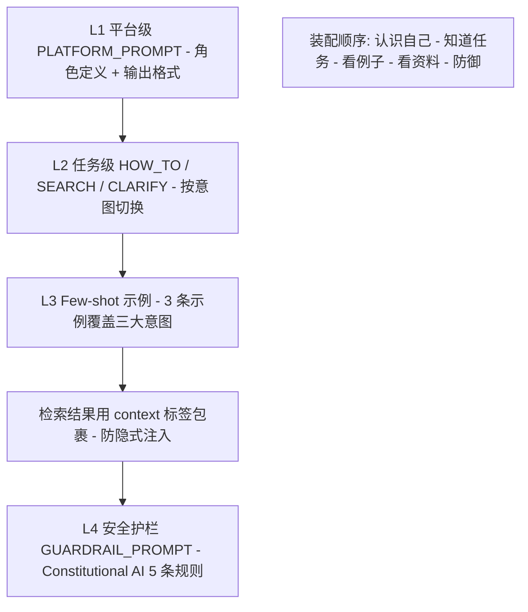

### 4.2 版本管理与灰度发布

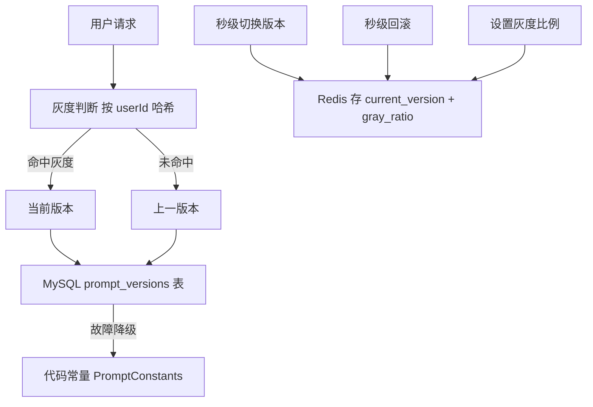

### 4.3 安全护栏双保险

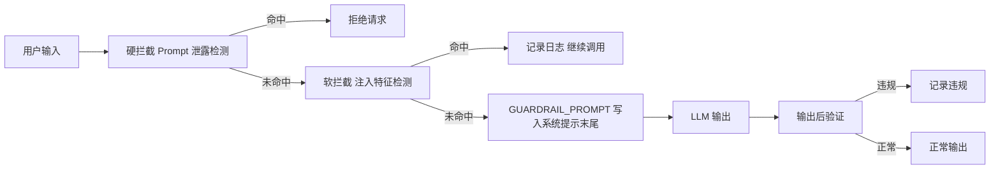

**核心文件：**
- [PromptAssembler.java](file:///e:/workspace_work/CampusShare/backend/campushare-agent/src/main/java/com/campushare/agent/prompt/PromptAssembler.java)
- [PromptConstants.java](file:///e:/workspace_work/CampusShare/backend/campushare-agent/src/main/java/com/campushare/agent/prompt/PromptConstants.java)
- [PromptVersionManager.java](file:///e:/workspace_work/CampusShare/backend/campushare-agent/src/main/java/com/campushare/agent/prompt/PromptVersionManager.java)
- [ConstitutionalAIValidator.java](file:///e:/workspace_work/CampusShare/backend/campushare-agent/src/main/java/com/campushare/agent/prompt/ConstitutionalAIValidator.java)

---

## 五、上下文工程：L0-L5 分层 + Token 预算 + 三级降级

### 5.1 L0-L5 分层结构图

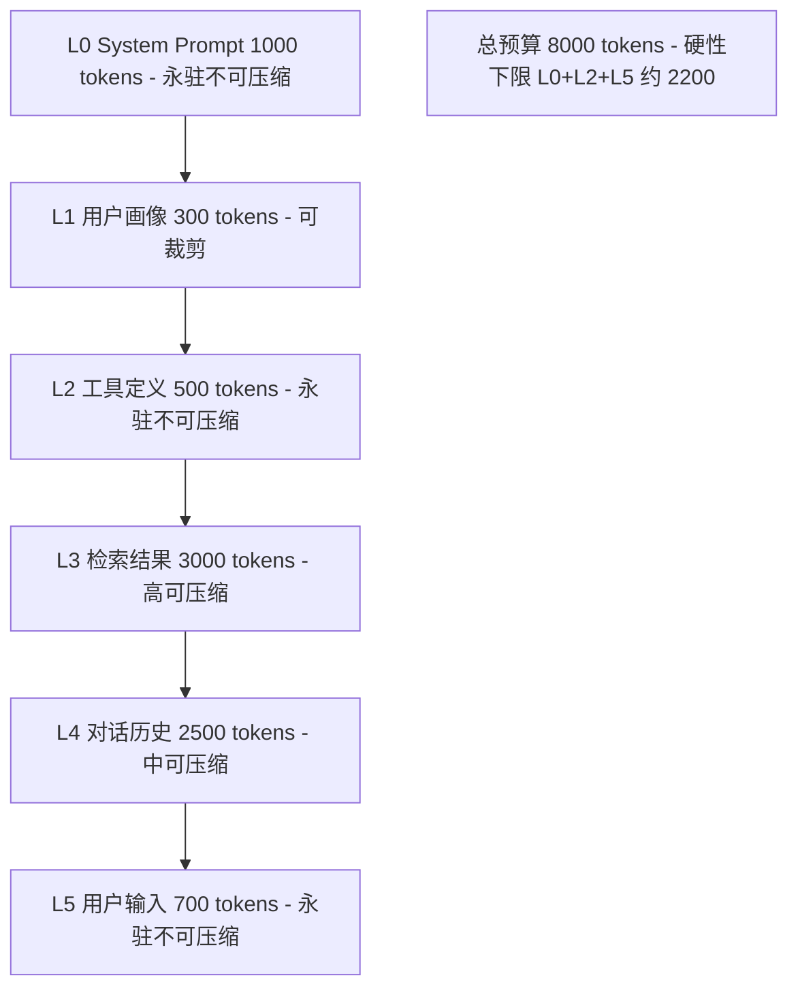

### 5.2 按意图的动态 Token 分配

| 意图 | L3 检索 | L4 历史 | 设计理念 |
|------|---------|---------|---------|
| HOW_TO | 4000 | 1500 | 知识片段优先，历史可压缩 |
| SEARCH | 3500 | 2000 | 帖子摘要 + 历史指代消解 |
| CLARIFY | 500 | 4000 | 历史是核心，靠上下文澄清 |
| 默认 | 3000 | 2500 | 均衡配置 |

### 5.3 三级降级链

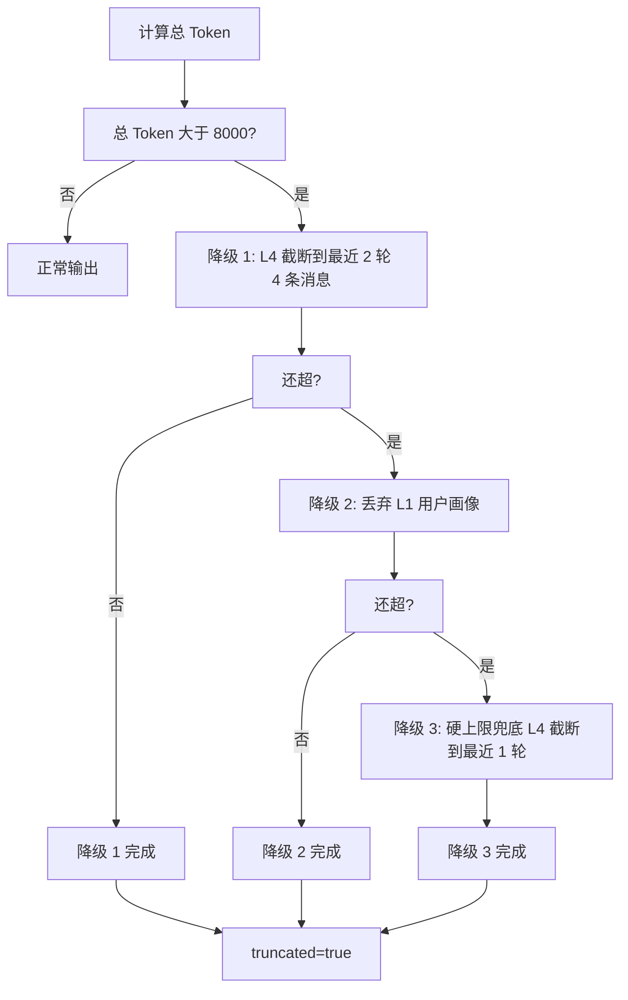

### 5.4 短期记忆 Redis 5 Key 结构

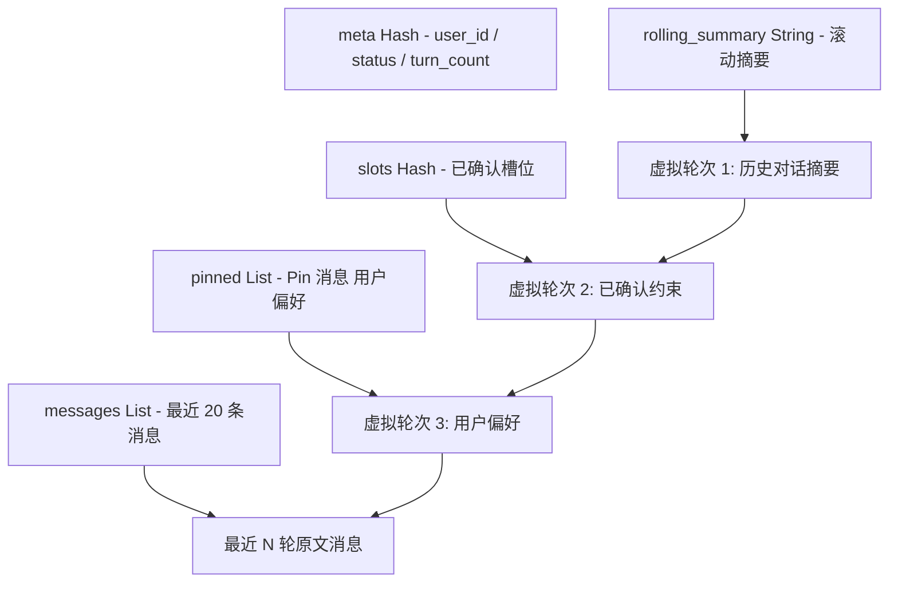

### 5.5 三级压缩机制

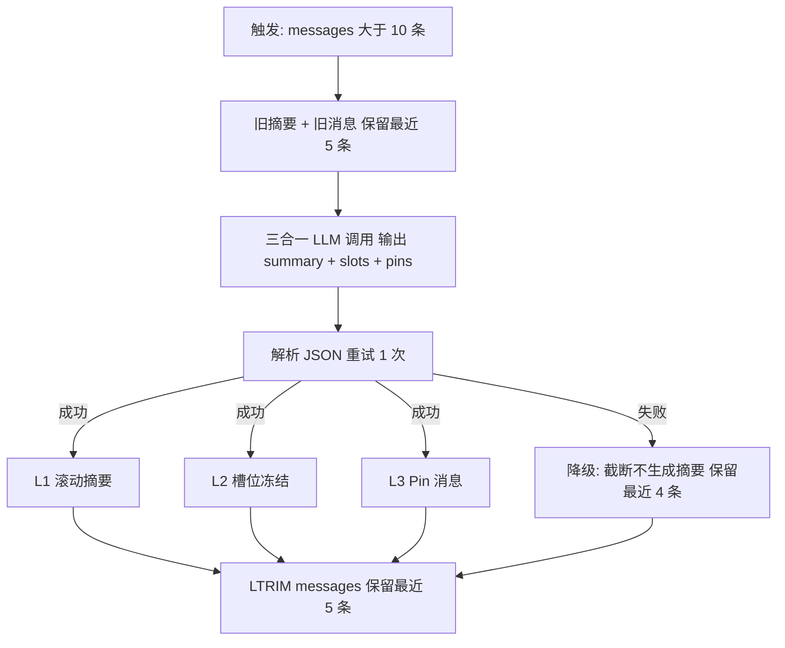

**核心文件：**
- [ContextAssembler.java](file:///e:/workspace_work/CampusShare/backend/campushare-agent/src/main/java/com/campushare/agent/service/ContextAssembler.java)
- [ConversationMemoryService.java](file:///e:/workspace_work/CampusShare/backend/campushare-agent/src/main/java/com/campushare/agent/service/ConversationMemoryService.java)
- [ContextCompressionService.java](file:///e:/workspace_work/CampusShare/backend/campushare-agent/src/main/java/com/campushare/agent/service/ContextCompressionService.java)
- [LongTermMemoryService.java](file:///e:/workspace_work/CampusShare/backend/campushare-agent/src/main/java/com/campushare/agent/service/LongTermMemoryService.java)
- [ContextLayer.java](file:///e:/workspace_work/CampusShare/backend/campushare-agent/src/main/java/com/campushare/agent/dto/ContextLayer.java)
- [TokenBudget.java](file:///e:/workspace_work/CampusShare/backend/campushare-agent/src/main/java/com/campushare/agent/dto/TokenBudget.java)

---

## 六、完整时序图：一次对话的完整流程

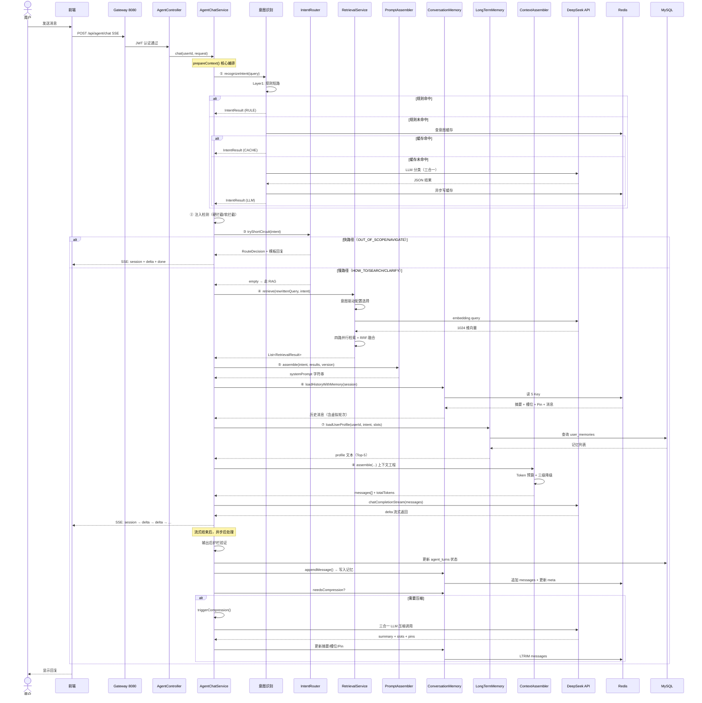

---

## 七、关键设计决策速查表

| ADR | 决策 | 位置 | 效果 |
|-----|------|------|------|
| ADR-010 | 低置信度(<0.6)兜底为 SEARCH | IntentClassifier | 分类不准也不崩，最通用兜底 |
| ADR-011 | 分类+改写+槽位三合一 LLM 调用 | IntentClassifier | 省 ~500ms 延迟 + 1 次 API 成本 |
| ADR-013 | IntentRouter 快路径 | IntentRouter | OUT_OF_SCOPE/NAVIGATE 0 次 LLM |
| ADR-024 | 意图驱动检索策略 | RetrievalService.selectConfig | 不同意图用不同来源配比，更精准 |
| ADR-026 | CLARIFY 合并上一轮检索结果 | RetrievalService.mergePreviousRetrieval | 指代消解有上下文，降权 0.5 不喧宾夺主 |
| ADR-029 | 检索结果缓存（非 CLARIFY） | RetrievalService | 重复 query 省 embedding + 检索成本 |
| ADR-050~053 | 三级压缩机制 | ContextCompressionService | 长对话不爆 token，降级有保底 |
| ADR-051 | 压缩三合一 LLM 调用 | ContextCompressionService | 省 60% 压缩成本 |
| ADR-054 | 短期记忆读写时序：LLM 回答后写 | ConversationMemoryService | 避免写入不完整的 assistant 消息 |
| ADR-059 | 长期记忆按意图/槽位相关性装载 | LongTermMemoryService | 新会话首轮就能个性化 |
| ADR-070~072 | L0-L5 分层 + Token 预算 + 三级降级 | ContextAssembler | 上下文可控，超预算有兜底 |
| ADR-SP-04 | Guardrail 放末尾防注入 | PromptAssembler | 利用 LLM recency bias，注入难绕过 |
| ADR-SP-06 | L1 平台级 Prompt 固定不变 | PromptConstants | 命中 Prefix Cache，省成本 + 加速 |

---

## 八、核心代码文件索引

| 模块 | 主文件 | 关键方法 |
|------|--------|---------|
| 总入口 | [AgentChatService.java](file:///e:/workspace_work/CampusShare/backend/campushare-agent/src/main/java/com/campushare/agent/service/AgentChatService.java) | `chat()` / `prepareContext()` |
| 意图识别-L1 | [RuleShortCircuitFilter.java](file:///e:/workspace_work/CampusShare/backend/campushare-agent/src/main/java/com/campushare/agent/service/RuleShortCircuitFilter.java) | `filter()` |
| 意图识别-L2 | [IntentClassifier.java](file:///e:/workspace_work/CampusShare/backend/campushare-agent/src/main/java/com/campushare/agent/service/IntentClassifier.java) | `classify()` / `classifyByLLM()` |
| 意图路由 | [IntentRouter.java](file:///e:/workspace_work/CampusShare/backend/campushare-agent/src/main/java/com/campushare/agent/service/IntentRouter.java) | `tryShortCircuit()` |
| RAG 检索 | [RetrievalService.java](file:///e:/workspace_work/CampusShare/backend/campushare-agent/src/main/java/com/campushare/agent/service/RetrievalService.java) | `retrieve()` / `selectConfig()` / `rrfFusion()` |
| 知识库向量 | [KnowledgeVectorStore.java](file:///e:/workspace_work/CampusShare/backend/campushare-agent/src/main/java/com/campushare/agent/store/KnowledgeVectorStore.java) | `searchChunks()` / `keywordSearchChunks()` |
| Prompt 装配 | [PromptAssembler.java](file:///e:/workspace_work/CampusShare/backend/campushare-agent/src/main/java/com/campushare/agent/prompt/PromptAssembler.java) | `assemble()` |
| Prompt 版本 | [PromptVersionManager.java](file:///e:/workspace_work/CampusShare/backend/campushare-agent/src/main/java/com/campushare/agent/prompt/PromptVersionManager.java) | `getCurrentVersion()` |
| 安全护栏 | [ConstitutionalAIValidator.java](file:///e:/workspace_work/CampusShare/backend/campushare-agent/src/main/java/com/campushare/agent/prompt/ConstitutionalAIValidator.java) | `shouldHardBlock()` / `validate()` |
| 上下文组装 | [ContextAssembler.java](file:///e:/workspace_work/CampusShare/backend/campushare-agent/src/main/java/com/campushare/agent/service/ContextAssembler.java) | `assemble()` |
| 短期记忆 | [ConversationMemoryService.java](file:///e:/workspace_work/CampusShare/backend/campushare-agent/src/main/java/com/campushare/agent/service/ConversationMemoryService.java) | `loadHistoryAsTurns()` / `appendMessage()` |
| 上下文压缩 | [ContextCompressionService.java](file:///e:/workspace_work/CampusShare/backend/campushare-agent/src/main/java/com/campushare/agent/service/ContextCompressionService.java) | `compress()` |
| 长期记忆 | [LongTermMemoryService.java](file:///e:/workspace_work/CampusShare/backend/campushare-agent/src/main/java/com/campushare/agent/service/LongTermMemoryService.java) | `loadUserProfile()` |
