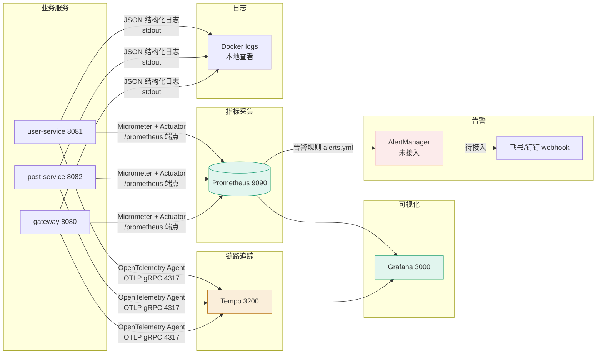

# 可观测性设计

- **更新日期：** 2026-06-28（搭建） / 2026-06-29（完善 JVM 面板）

---

## 监控架构图



---

## 监控体系组成

| 组件 | 端口 | 作用 | 状态 |
|------|------|------|------|
| Prometheus | 9090 | 指标采集与存储（15s 抓取间隔） | ✅ 正常 |
| Grafana | 3000 | 可视化看板（admin/admin123） | ✅ 正常 |
| Tempo | 3200/4317/4318 | 链路追踪（OTLP 接收） | ⚠️ healthcheck 绕过 |
| OpenTelemetry Agent | - | JVM 挂载，自动埋点 trace | ✅ 正常 |
| AlertManager | - | 告警通知 | ❌ 未接入 |

---

## 关键指标

| 指标名 | 类型 | 含义 | 告警阈值 | 告警等级 |
|--------|------|------|----------|----------|
| `up` | 服务状态 | Target 是否在线 | `up == 0` 持续 1m | P1 |
| `http_server_requests_seconds` | HTTP 延迟 | 接口响应时间分布 | P95 > 1s | P2 |
| `system_cpu_usage * 100` | CPU 使用率 | 系统 CPU 占用（0-100%） | > 80% 持续 5m | P2 |
| `jvm_memory_used_bytes` | JVM 内存 | 堆/非堆内存使用 | 堆 > 85% max | P2 |
| `jvm_gc_pause_seconds` | GC 暂停 | GC 停顿时间 | Full GC > 1s | P2 |
| `hikaricp_connections_active` | 连接池 | 活跃 DB 连接数 | > max * 0.9 | P2 |
| `http_server_requests_seconds_count` | 请求量 | QPS 计算 | 突增 > 2x 均值 | P3（待修复 PromQL） |

> ⚠️ 告警规则 `RequestSpike` 因 PromQL 语法错误被注释，待用 recording rule 正确实现。详见 [监控体系搭建故障复盘](../reliability/2026-06-28_postmortem_监控体系搭建故障链.md)

---

## Grafana Dashboard 设计

### campushare-overview.json 看板面板

| 面板 | PromQL | 说明 |
|------|--------|------|
| 服务状态 | `up` | 4 个 Target 在线状态 |
| 全局 QPS | `rate(http_server_requests_seconds_count[5m])` | 按服务分组 |
| 全局错误率 | `rate(http_server_requests_errors_total[5m]) / rate(http_server_requests_seconds_count[5m])` | 按 service |
| CPU 使用率 | `system_cpu_usage{application!=""} * 100` | ⚠️ 必须乘 100（原面板 bug） |
| JVM 堆内存（分代） | `jvm_memory_used_bytes{area="heap"}` 按 generation 分组 | Eden/Survivor/Old Gen |
| JVM 非堆内存 | `jvm_memory_used_bytes{area="nonheap"}` | Metaspace/Code Cache |
| GC 暂停时间 | `rate(jvm_gc_pause_seconds_sum[5m])` | 按 service |
| 各服务 P95 延迟趋势 | `histogram_quantile(0.95, rate(http_server_requests_seconds_bucket[5m]))` | 趋势图 |
| Top 10 慢接口 (P95) | 同上按 uri 排序 | 表格 |

### CPU 面板单位 bug 教训
- **问题**：Actuator 暴露的 `system_cpu_usage` 是 0.0-1.0 小数（1 代表 100%），原面板直接显示导致数值看起来很小（0.01 看似 1% 实际 100%）
- **修复**：PromQL 中 `* 100` 改为百分比显示
- **教训**：监控面板配置错误会严重误导性能排查方向。详见 [接口性能优化记录](../performance/2026-06-29_optimization_接口性能SQL聚合缓存N+1.md)

---

## 链路追踪

- **框架**：OpenTelemetry Java Agent（JVM 挂载，自动埋点）
- **后端**：Tempo 2.5（本地存储）
- **协议**：OTLP gRPC（4317）/ HTTP（4318）
- **采样策略**：全量采样（当前流量小，生产环境需调整为按比例）
- **关键 Span**：HTTP 请求、DB 查询、Feign 跨服务调用
- **已知问题**：Tempo healthcheck 端点空指针 panic，已临时禁用。OTLP 接收功能正常

---

## 日志规范

- **格式**：JSON 结构化（Logback 默认）
- **输出**：stdout（Docker logs 查看）
- **必须字段**：timestamp, level, logger, message, trace_id（OTel 注入）
- **日志级别**：
  - ERROR：系统异常（GlobalExceptionHandler 捕获的未处理异常）
  - WARN：业务异常 + 降级（如缓存失败、Feign 调用失败）
  - INFO：关键业务操作（登录、发帖、审核）
  - DEBUG：调试信息（默认关闭）
- **敏感数据脱敏**：密码哈希不记日志；身份证号在申请列表中脱敏显示

---

## Spring Boot Actuator 端点暴露

```yaml
management:
  endpoints:
    web:
      exposure:
        include: health,info,prometheus,metrics,loggers
      base-path: /actuator
  endpoint:
    prometheus:
      enabled: true
  metrics:
    export:
      prometheus:
        enabled: true
```

> ⚠️ Gateway 额外启用 `management.metrics.gateway.request-metrics.enabled: true`

---

## Prometheus 抓取配置

```yaml
scrape_configs:
  - job_name: 'campushare-gateway'
    metrics_path: '/actuator/prometheus'
    static_configs:
      - targets: ['gateway-service:8080']
  - job_name: 'campushare-user'
    metrics_path: '/actuator/prometheus'
    static_configs:
      - targets: ['user-service:8081']
  - job_name: 'campushare-post'
    metrics_path: '/actuator/prometheus'
    static_configs:
      - targets: ['post-service:8082']
```

---

## 待完善项

1. **AlertManager 接入**：当前告警规则只在 Prometheus 显示 pending/firing 状态，未发通知。需部署 AlertManager + webhook
2. **RequestSpike 告警修复**：用 recording rule 分两步正确实现（先算 rate，再对 rate 做 avg_over_time）
3. **Tempo 健康检查恢复**：完善 Tempo 配置，恢复正式 healthcheck
4. **采样策略调整**：生产环境从全量采样改为按比例采样
5. **日志聚合**：当前用 docker logs 本地查看，未来需引入 ELK/Loki 做日志聚合搜索
