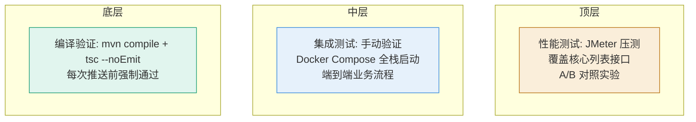

# 测试策略

- **更新日期：** 2026-06-29

---

## 测试金字塔



> ⚠️ **诚实声明**：当前项目以编译验证 + 手动集成测试 + JMeter 性能测试为主，**尚未建立自动化单元测试和 E2E 测试体系**。这是已知的工程化短板，计划后续补齐。

---

## 分层详情

| 层级 | 工具 | 数量 | 运行时长 | CI 触发 |
|------|------|------|----------|---------|
| 编译验证 | `mvn clean compile -DskipTests` + `npx tsc --noEmit` | 4 模块全编译 | ~30s | 每次 push 前（手动） |
| 单元测试 | JUnit 5（未建立） | 0 | - | - |
| 集成测试 | 手动 Docker Compose 验证 | 全栈 | ~5min | 功能开发完成后 |
| 性能测试 | JMeter 20 并发压测 | 2 核心接口 | 3min | 性能优化后 |
| E2E 测试 | 未建立 | 0 | - | - |

---

## 编译验证（强制流程）

### 后端编译
```powershell
$env:JAVA_HOME = "E:\javaJdk17"
$env:Path = "$env:JAVA_HOME\bin;" + $env:Path
cd E:\workspace_work\CampusShare\backend
mvn clean compile -DskipTests
```
- 判定：输出含 `BUILD SUCCESS` 通过；`BUILD FAILURE` 必须先修复，最多修复 3 次仍失败则停下询问
- 覆盖：4 个 Maven 模块（common/user/post/gateway）全编译

### 前端类型检查
```powershell
cd E:\workspace_work\CampusShare\frontend
npx tsc --noEmit
```
- 判定：exit code 0 通过

---

## 性能测试（JMeter 压测）

### 压测配置

| 参数 | 值 |
|------|-----|
| 工具 | JMeter |
| 并发线程数 | 20 |
| 循环模式 | 无限循环 |
| 持续时长 | 3 分钟 |
| 压测接口 | `/posts/school-counts` + `/posts/school/{schoolId}`（经网关） |
| 预热 | 压测前先发少量请求触发 JIT 编译 |

### A/B 对照实验设计
- **A 组（基线）**：删除 posts 表所有二级索引 → 全表扫描
- **B 组（优化）**：使用复合索引
- 控制变量：相同硬件（4核8G）、相同数据（1000 用户 10000 帖子）、相同脚本
- 详见 [数据库复合索引优化记录](../performance/2026-06-29_optimization_数据库复合索引设计.md)

### 性能基线指标

| 指标 | 优化后基线值 | 来源 |
|------|-------------|------|
| 平均延迟 | 42ms | A/B 压测 B 组 |
| P95 延迟 | 70ms | A/B 压测 B 组 |
| P99 延迟 | 98ms | A/B 压测 B 组 |
| 单接口 QPS | 575/s | A/B 压测 B 组 |
| 总 QPS | 1151/s | A/B 压测 B 组 |
| 错误率 | 0% | A/B 压测 B 组 |

---

## 核心路径覆盖清单

| 业务路径 | 编译验证 | 手动集成测试 | 性能测试 | 备注 |
|----------|----------|-------------|----------|------|
| 用户注册/登录 | ✅ | ✅ | ❌ | 邮箱 SMTP 登录已验证 |
| 发布帖子 | ✅ | ✅ | ❌ | |
| 学校帖子列表 | ✅ | ✅ | ✅ | JMeter 压测 |
| 分类帖子列表 | ✅ | ✅ | ❌ | |
| 帖子详情 | ✅ | ✅ | ❌ | |
| 点赞/收藏 | ✅ | ✅ | ❌ | 幂等性已验证 |
| 评论/回复 | ✅ | ✅ | ❌ | |
| 通知收纳篮 | ✅ | ✅ | ❌ | 通知偏好过滤已验证 |
| 隐私设置 | ✅ | ✅ | ❌ | 5 个开关已验证 |
| 私信 | ✅ | ✅ | ❌ | |
| 创作者认证 | ✅ | ✅ | ❌ | 管理员审核流程 |

---

## 数据库测试数据

### 测试数据生成
- **接口**：`/admin/init-test-data`（post-service DataInitController）
- **规模**：1000 测试用户 + 10000 帖子（每用户 10 帖，均属北京大学）
- **用途**：性能压测 + 分页验证 + 索引优化验证
- **清理**：`/admin/clear-posts` 清空帖子数据

### 数据分布说明
> ⚠️ 压测数据全部属于单个学校（school_id=1），WHERE 过滤掉 0 行。真实数据分布（8 校各 1250 帖）下，无索引性能差距会更大。详见 [数据库索引优化记录](../performance/2026-06-29_optimization_数据库复合索引设计.md)「关键教学点」。

---

## Mock 策略

当前项目未使用 Mock 框架，所有测试在真实 Docker Compose 环境中手动验证：
- **数据库**：真实 MySQL 8 容器（init.sql 初始化）
- **Redis**：真实 Redis 7 容器
- **SMTP**：真实 QQ 邮箱 SMTP（587 端口）
- **Feign 调用**：真实跨服务调用（Docker 网络直连）

---

## 待补齐项

1. **JUnit 5 单元测试**：核心 Service 方法（点赞幂等、通知偏好过滤、隐私拦截逻辑）
2. **Testcontainers 集成测试**：用 testcontainers 启动 MySQL/Redis 做自动化集成测试
3. **Playwright E2E 测试**：核心用户路径（登录→发帖→点赞→通知）
4. **CI/CD 流水线**：当前为手动编译验证 + 手动 push，未来引入 GitHub Actions 自动化
5. **测试覆盖率监控**：JaCoCo 后端覆盖率 + Jest 前端覆盖率
