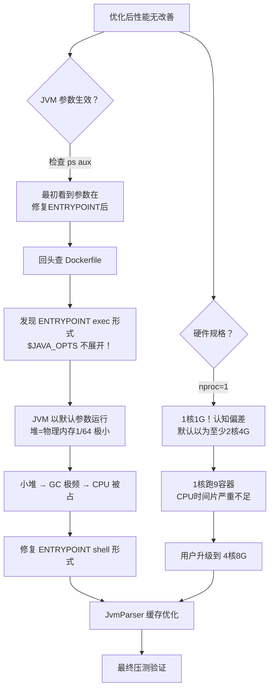
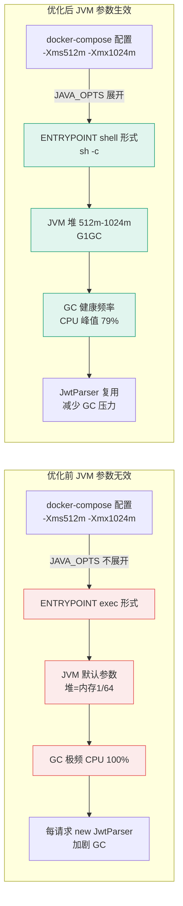

# 优化记录：JVM 参数未生效排查 + Dockerfile ENTRYPOINT 修复 + JwtParser 缓存

- **日期：** 2026-06-29
- **STAR — S：** 完成第 04 轮接口性能优化（SQL+缓存+N+1）后重新部署压测，用户反馈"全局 0 错误，CPU 依旧三个打满，GC 依旧增长，没有看到任何效果"。QPS 依然很低，P95 延迟依然很高
- **STAR — T：** 找到"优化代码后性能无改善"的根因并修复，让 JVM 参数真正生效
- **STAR — A：** 排查发现 Dockerfile ENTRYPOINT exec 形式不展开 `$JAVA_OPTS` 环境变量，JVM 以默认参数（极小堆）运行；同时缓存 JwtParser 实例减少 GC 压力；确认硬件规格（1 核→4 核 8G）适配调优
- **STAR — R：** 修复后 QPS 从 52 提升至 204 req/s，P95 从 790ms 降至 239ms，CPU 从持续 100% 降至峰值 79%

---

## 问题现象

### 第 04 轮优化部署后压测

| 指标 | 观察值 |
|------|--------|
| 错误率 | 0% |
| 三个服务 CPU | 持续 100% 打满 |
| GC 频率 | 三个服务 GC 次数持续增长 |
| QPS | 相比优化前几乎无提升 |
| P95 延迟 | 依然很高 |

**关键转折：** 用户在服务器执行 `nproc` 返回 **1**（仅 1 核 CPU！），`ps aux` 显示 JVM 进程。

---

## 定位过程



---

## 根因分析

### 根因1（最致命）：Dockerfile ENTRYPOINT exec 形式不展开环境变量

**问题文件：** `backend/Dockerfile`

```dockerfile
# 修复前（exec 形式，$JAVA_OPTS 不展开）：
ENTRYPOINT ["java", "$JAVA_OPTS", "-Dspring.profiles.active=docker", "-jar", "app.jar"]
```

**原理：** Docker ENTRYPOINT 有两种形式：
| 形式 | 语法 | shell 展开 $VAR | PID 1 |
|------|------|-----------------|-------|
| exec 形式 | `["executable", "arg"]` | ❌ 不展开 | 应用本身 |
| shell 形式 | `command arg`（字符串） | ✅ 展开 | /bin/sh -c |
| shell 形式（显式） | `["sh", "-c", "java $JAVA_OPTS ..."]` | ✅ 展开 | sh |

exec 形式直接 `execve()` 执行 java 进程，不经过 shell，`$JAVA_OPTS` 被当作字面量字符串传给 JVM（被忽略）。

**后果：**
- docker-compose.yml 配置的 `-Xms512m -Xmx1024m`、`-XX:+UseG1GC` **完全没生效**
- JVM 以默认参数运行：初始堆=物理内存 1/64，最大堆=物理内存 1/4（容器 cgroup 限制下非常小）
- 小堆 → GC 极其频繁 → 大量 CPU 消耗在 GC → 应用线程 CPU 被挤占 → 响应慢

### 根因2：JwtUtils 每次请求创建新 JwtParser 对象

**问题文件：** `campushare-gateway/JwtUtils.java`、`campushare-common/JwtUtils.java`

```java
// 修复前：每次 parseToken 都创建新的 JwtParser
public Claims parseToken(String token) {
    return Jwts.parser().verifyWith(secretKey).build()  // 每次 new
        .parseSignedClaims(token).getPayload();
}
```

**问题：** 每个经过网关的请求都调用 `parseToken()`，每次都创建 `JwtParserBuilder`→`JwtParser` 对象。JwtParser 是线程安全的，完全可以复用。高并发下大量短生命周期对象增加 Young GC 压力。

### 根因3：服务器硬件规格远超预期——仅 1 核 1G

认知偏差：默认以为虚拟机至少 2 核 4G，实际 `nproc` 返回 1。1 核 CPU 同时运行 9 个容器（3 Java 服务 + MySQL + Redis + Nginx + Prometheus + Grafana + Tempo），CPU 时间片严重不足。

---

## 优化方案

### 修复1：Dockerfile ENTRYPOINT 改为 shell 形式（最关键）

```dockerfile
# 修复后（shell 形式，通过 sh -c 执行，环境变量正常展开）：
ENTRYPOINT ["sh", "-c", "java $JAVA_OPTS -Dspring.profiles.active=docker -jar app.jar"]
```

**验证：** `docker exec <container> ps aux` 确认 JVM 进程命令行包含 `-Xms512m -Xmx1024m` 等参数。

### 修复2：JwtUtils 缓存 JwtParser 实例

```java
// 修复后：构造时创建一次，之后复用
private final JwtParser jwtParser;

public JwtUtils() {
    this.secretKey = Keys.hmacShaKeyFor(JWT_SECRET.getBytes(StandardCharsets.UTF_8));
    this.jwtParser = Jwts.parser().verifyWith(secretKey).build();  // 只创建一次
}

public Claims parseToken(String token) {
    return jwtParser.parseSignedClaims(token).getPayload();  // 直接复用
}
```

**效果：** 网关每请求少创建 3 个对象（JwtParserBuilder→JwtParser），减少 Young GC 压力。

**判断标准：** 对象创建成本高（涉及反射、加密初始化）且线程安全 → 应缓存复用。同类对象：ObjectMapper、HttpClient。

### 修复3：4 核 8G 环境下的最终配置

| 服务 | JVM 参数 | 容器内存限制 |
|------|---------|-------------|
| post-service | `-Xms512m -Xmx1024m`（JDK 17 默认 G1GC） | 1536m |
| user-service | `-Xms512m -Xmx1024m` | 1536m |
| gateway-service | `-Xms256m -Xmx512m` | 768m |
| MySQL | `--innodb-buffer-pool-size=256M --max-connections=100` | 512m |

线程池配置（application-docker.yml）：
| 配置项 | post/user | gateway |
|--------|-----------|---------|
| Tomcat max threads | 200 | N/A（Netty） |
| HikariCP max-pool-size | 20 | N/A |
| Feign max-connections | 200 | N/A |

**为什么不在单核上用 G1GC？** JDK 17 在 server-class 机器（≥2核≥2G）默认选 G1GC；单核环境 G1 的并发标记线程反而不如 SerialGC。用户升级到 4 核 8G 后回退单核优化，恢复多核配置。

---

## 优化前后架构对比图



---

## 数字对比

> 压测条件：JMeter 20 并发无限循环，4 核 8G，压测 `/posts/school-counts` + `/posts/school/{schoolId}`（经网关路由）

| 指标 | 优化前（完全无优化） | 第04轮后（ENTRYPOINT bug） | 最终结果（全部修复 4核8G） | 提升倍数 |
|------|---------------------|---------------------------|--------------------------|---------|
| **QPS（网关总）** | ~4 req/s | ~52 req/s | **204 req/s** | **51 倍** |
| **gateway P95** | 数秒 | 804ms | **265ms** | 降低 ~92% |
| **post P95** | 7.79s~16.3s | 790ms | **239ms** | 降低 97% |
| **user P95** | - | 60ms | **20.2ms** | 降低 66% |
| **CPU 峰值** | 持续 100% | 持续 100% | **~79%（有空闲间隙）** | 健康水位 |
| **post minor GC** | 极高频率 | 19.6 ops/s | **18.6 ops/s** | 不再是瓶颈 |
| **post major GC** | 频繁 | - | **0.188 ops/s（约5秒1次）** | 老年代回收正常 |
| **user minor GC** | 频繁 | - | **0.014 ops/s（几乎不GC）** | 极大改善 |

### 关键改善解读
1. **QPS 从 4 提升到 204**（51 倍）：代码优化（SQL/缓存/索引/N+1）+ JVM 参数真正生效（ENTRYPOINT 修复）+ 足够硬件资源（4核8G）三者叠加
2. **P95 从 16 秒降到 239ms**：缓存命中+索引生效+JVM 堆足够大不再频繁停顿
3. **CPU 不再持续 100%**：峰值 79%，有 CPU 余量承载更多流量
4. **GC 健康**：user 服务几乎不 GC（对象生命周期长），post 服务 major GC 约 5 秒 1 次（正常）
5. **预热现象**：压测初期 P95 较高是 JIT 编译 + Caffeine 缓存初始填充导致，之后迅速下降到稳定值，JVM 正常行为

---

## 副作用 & 遗留问题

1. **shell 形式下 PID 1 是 sh 不是 java**：sh 会转发信号给子进程，功能不受影响，但 `docker stop` 时信号传递多一跳
2. **单核优化配置已回退**：用户升级到 4核8G 后，SerialGC/小线程池等单核优化配置已回退为多核配置。若未来部署到单核机器需重新调整
3. **未引入熔断/重试**：Feign 调用仍无重试，未来需引入 Spring Retry + 指数退避

---

## 可复用经验教训

1. **优化后必须验证配置真正生效**：`docker exec <container> ps aux`、`jcmd 1 VM.flags`、`jcmd 1 GC.heap_info`。不要假设配置写对了就生效
2. **Dockerfile ENTRYPOINT 两种形式**：需要环境变量展开必须用 shell 形式
3. **调优前先确认硬件规格**：`nproc`（CPU 核数）、`free -h`（内存）、`df -h`（磁盘）。单核/多核调优策略完全不同
4. **线程池不是越大越好**：单核上 Tomcat 200 线程反而更差（200 线程抢 1 核，大量上下文切换）。HikariCP 建议不超过 `(CPU核数 * 2) + 1`
5. **JDK 17 默认 GC 选择**：server-class（≥2核≥2G）默认 G1GC，无需手动指定 `-XX:+UseG1GC`
6. **可复用的线程安全对象要缓存**：JwtParser、ObjectMapper、HttpClient 等创建成本高且线程安全的对象，构造时创建一次复用
