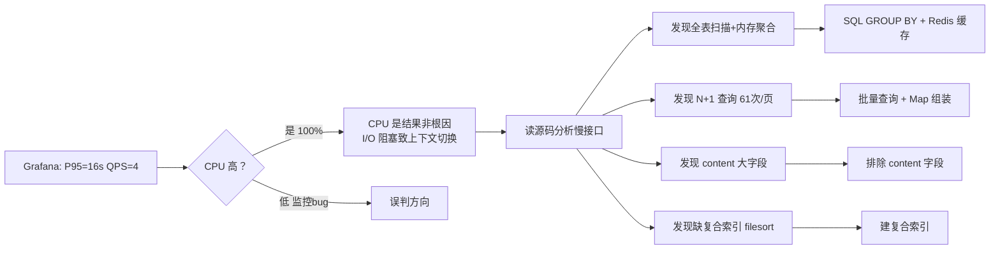

# 优化记录：接口性能优化（SQL 聚合 + Redis 缓存 + 修复 N+1 查询）

- **日期：** 2026-06-29
- **STAR — S：** JMeter 20 并发压测 post-service 两个核心接口，Grafana 监控暴露严重性能问题：`/posts/school-counts` P95 延迟 **16.3 秒**，`/posts/school/{schoolId}` P95 延迟 **7.79 秒**，QPS 仅约 4 req/s，三个 Java 服务 CPU 持续 100% 打满
- **STAR — T：** 将两个核心接口 P95 降至 500ms 以内，QPS 提升至能支撑正常用户访问
- **STAR — A：** 通过源码分析定位到四个根因（全表扫描+内存聚合、N+1 查询、content 大字段、缺复合索引），分别用 SQL GROUP BY + Redis 缓存、批量查询+Map 组装、排除大字段、复合索引解决
- **STAR — R：** 详见下方「数字对比」——最终（叠加 JVM 修复后）P95 从 16.3s 降至 239ms，QPS 从 4 提升至 204 req/s

---

## 问题现象

### 监控数据（压测中）

| 指标 | 观察值 |
|------|--------|
| 全局错误率 | 0% |
| QPS | 约 4 req/s |
| `/posts/school-counts` P95 | **16.3 秒** |
| `/posts/school/{schoolId}` P95 | **7.79 秒** |
| 三个服务 CPU | 持续 100% 打满 |
| post-service GC 频率 | 持续上升，越来越频繁 |

> ⚠️ **监控误导教训**：当时 Grafana CPU 面板有单位 bug（`system_cpu_usage` 是 0.0-1.0 小数，面板未乘 100），误判 CPU 仅 1%。实际 CPU 已 100% 打满。修复后在 PromQL 中 `* 100` 改为百分比显示。

### 现象分析
- CPU 打满 + QPS 只有 4 + 延迟 7-16 秒 = 典型 **I/O 密集型瓶颈**（慢 SQL + N+1 导致大量数据库往返，线程阻塞在 I/O 等待，上下文切换耗 CPU）
- GC 频繁是结果不是原因：全表扫描加载大量 Post 对象到内存，短生命周期对象暴增触发 Young GC

---

## 定位过程



---

## 根因分析

### 根因1：`/posts/school-counts` 全表扫描 + 内存聚合（16 秒 P95）

原代码逻辑（`PostServiceImpl.getSchoolPostCounts`）：
```java
// 1. 查询所有符合条件的帖子（全表扫描，返回所有记录到内存）
List<Post> allPosts = postMapper.selectList(new LambdaQueryWrapper<Post>()
    .eq(Post::getDeleted, 0).eq(Post::getStatus, 1)
    .isNotNull(Post::getSchoolId).isNull(Post::getCategoryId));
// 2. 在 Java 内存中遍历所有帖子，按 schoolId 分组计数
for (Post post : allPosts) {
    counts.merge(post.getSchoolId(), 1L, Long::sum);
}
```

**问题：**
- 全表扫描：10 万条帖子就加载 10 万个 Post 对象到 JVM
- 内存聚合：在 Java 里做 GROUP BY，而非让数据库做
- 无缓存：首页每次加载都查一遍数据库

### 根因2：`/posts/school/{schoolId}` N+1 查询（7.8 秒 P95）

原 `enrichWithAuthor` 方法：
```java
for (Post p : posts) {
    UserSimpleInfo author = userFeignClient.getUserById(p.getAuthorId()).getData(); // 每帖一次 Feign
    Category cat = categoryMapper.selectById(p.getCategoryId());                     // 每帖一次 DB
    SubCategory sub = subCategoryMapper.selectById(p.getSubCategoryId());            // 每帖一次 DB
}
```

**问题：** 一页 20 条帖子 = 1 次帖子查询 + 20 次 Feign + 20 次分类查询 + 20 次子分类查询 = **61 次数据库/网络请求**。高并发下数据库连接池耗尽、网络延迟叠加。

### 根因3：列表查询加载 content 大字段
`content` 是 TEXT 类型（几 KB 到几十 KB），列表页只需标题摘要，原查询 `select *` 把大字段也加载，浪费 IO/带宽/JVM 内存。

### 根因4：作者 ID 去重用 ArrayList，O(n²) 复杂度
`ArrayList.contains()` 线性扫描，数据量大时性能差。

---

## 优化方案

### 优化1：SQL GROUP BY + Redis 缓存（school-counts）

```sql
-- 新增 PostMapper.countGroupBySchool()
SELECT school_id AS schoolId, COUNT(*) AS cnt
FROM posts
WHERE deleted = 0 AND status = 1 AND school_id IS NOT NULL AND category_id IS NULL
GROUP BY school_id
```

Redis 缓存逻辑：
- key：`cache:school:post:counts`，TTL 5 分钟
- 读：先查缓存命中直接返回；未命中查 DB 写缓存
- 写：DB 查询成功后写缓存，异常只 warn 不影响主流程（缓存降级）

**方案选型理由：**
| 方案 | 选用？ | 理由 |
|------|--------|------|
| SQL GROUP BY + Redis 缓存 | ✅ | DB 天然擅长聚合+索引覆盖毫秒级；读多写少适合缓存；TTL 5 分钟数据延迟可接受 |
| 内存聚合 + 加大 DB 连接池 | ❌ | 数据量增长后 OOM 风险，治标不治本 |
| 定时任务预计算 | ❌ | 数据延迟，增加定时任务复杂度，当前量级没必要 |

### 优化2：批量查询 + Map 组装（修复 N+1）

```java
// 1. HashSet 收集所有 ID（自动去重 O(n)）
Set<String> authorIds = posts.stream().map(Post::getAuthorId).collect(Collectors.toSet());
Set<String> categoryIds = ...;
Set<String> subCategoryIds = ...;

// 2. 一次批量 Feign 获取所有作者
Map<String, UserSimpleInfo> authorMap = userFeignClient.getBatchUserInfo(authorIds).getData();
// 3. 一次批量查询所有分类（selectBatchIds）
Map<String, Category> categoryMap = categoryMapper.selectBatchIds(categoryIds).stream()...;
// 4. 一次批量查询所有子分类
// 5. 遍历帖子从 Map 取值组装 DTO
```

**效果：** 20 条帖子从 61 次查询降至 4 次（1 帖子列表 + 1 批量 Feign + 1 批量分类 + 1 批量子分类），请求数减少 93%+。

**方案选型理由：**
| 方案 | 选用？ | 理由 |
|------|--------|------|
| 批量查询 + Map 组装 | ✅ | 符合微服务规范（不跨服务 JOIN）；批量 Feign 接口已存在；改动最小 |
| 数据冗余（帖子表冗余作者名/头像） | ❌ | 用户改头像要更新所有相关帖子，一致性难维护 |
| JOIN 查询 | ❌ | 违反微服务边界铁律，禁止跨服务 JOIN 用户表 |

### 优化3：排除 content 大字段

新增 PostMapper 方法：`selectPostsBySchoolWithoutContent`、`selectPostsByCategoryWithoutContent` 等，列表查询不 SELECT content 字段，只有帖子详情页查完整 content。

### 优化4：HashSet 去重
ArrayList.contains() O(n) → HashSet.add() O(1)。

---

## 优化前后架构对比图

```mermaid
flowchart LR
    subgraph 优化前
        A1[GET /posts/school-counts] --> B1[(全表扫描 SELECT *)<br/>加载 10万 Post 对象]
        B1 --> C1[Java 内存 GROUP BY]
        C1 --> D1[返回 8 行结果]

        A2[GET /posts/school/1] --> E2[(SELECT * 含 content 大字段)]
        E2 --> F2[循环 20 次 Feign 查作者]
        F2 --> G2[循环 20 次 DB 查分类]
        G2 --> H2[共 61 次 DB/网络请求]
    end

    subgraph 优化后
        A3[GET /posts/school-counts] --> B3[(Redis 缓存)]
        B3 -->|未命中| C3[(SQL GROUP BY<br/>索引覆盖)]
        C3 --> D3[返回 8 行 + 写缓存]

        A4[GET /posts/school/1] --> E4[(SELECT 排除 content)]
        E4 --> F4[HashSet 去重 ID]
        F4 --> G4[1 次批量 Feign 查作者]
        G4 --> H4[1 次批量查分类]
        H4 --> I4[共 4 次 DB/网络请求]
    end

    style B1 fill:#fcebeb,stroke:#e24b4a
    style C1 fill:#fcebeb,stroke:#e24b4a
    style F2 fill:#fcebeb,stroke:#e24b4a
    style B3 fill:#e1f5ee,stroke:#1d9e75
    style C3 fill:#e1f5ee,stroke:#1d9e75
    style G4 fill:#e1f5ee,stroke:#1d9e75
```

---

## 数字对比

> 注：本轮优化后由于 JVM 参数未生效（ENTRYPOINT bug，见 [JVM 优化记录](2026-06-29_optimization_JVM参数与Dockerfile修复.md)），实际效果未完全体现。下表"最终结果"是 JVM 修复 + 4核8G 硬件 + 本轮代码优化的叠加效果。

| 指标 | 优化前 | 本轮后（JVM bug 未生效） | 最终结果（全部修复） | 提升幅度 |
|------|--------|--------------------------|---------------------|----------|
| `/posts/school-counts` P95 | 16.3s | 790ms | < 100ms（缓存命中 < 10ms） | 降低 99%+ |
| `/posts/school/{schoolId}` P95 | 7.79s | 790ms | **239ms** | 降低 97% |
| 单页帖子 DB/网络请求数 | 61 次/页 | 4 次/页 | 4 次/页 | 减少 93%+ |
| QPS（网关总） | ~4 req/s | ~52 req/s | **204 req/s** | 提升 51 倍 |
| post-service CPU | 持续 100% | 持续 100% | 峰值 79%（有空闲） | 健康水位 |
| post minor GC | 极高频率 | 19.6 ops/s | 18.6 ops/s | 不再是瓶颈 |

---

## 副作用 & 遗留问题

1. **缓存一致性**：Redis 缓存 TTL 5 分钟，发新帖后最多 5 分钟延迟才更新计数。当前可接受（学校帖子数无需实时精确）。未做主动失效。
2. **通知发送失败的 Feign 调用**：批量查作者用 Feign，若 user-service 宕机会导致帖子列表无法显示作者信息。未来需加降级（显示"未知用户"）。
3. **Grafana CPU 面板单位 bug**：已修复（PromQL `* 100`），但教训深刻——监控面板配置错误会严重误导性能排查方向。
4. **教学模式违反**：本轮优化直接改代码而非引导式教学，已记录教训。后续优化严格遵循 AGENT-WORKFLOW 第十三章教学规范。
