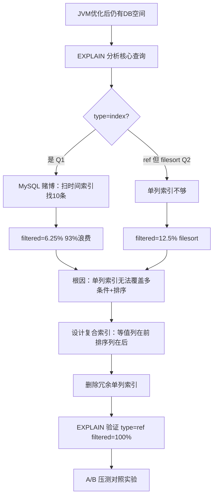
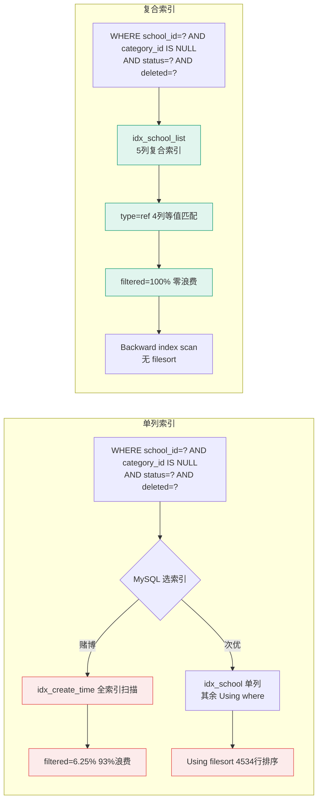

# 优化记录：数据库复合索引设计 + EXPLAIN 分析 + A/B 压测验证

- **日期：** 2026-06-29（设计） / 2026-06-30（EXPLAIN 教学 + A/B 压测）
- **STAR — S：** JVM 参数和线程池优化完成后，数据库层面仍有优化空间。posts 表初始只有单列索引（idx_school/idx_category/idx_status/idx_deleted/idx_author/idx_create_time），EXPLAIN 分析发现核心查询 type=index 全索引扫描、filtered=6.25%（93.75% 扫描行被丢弃）、Using filesort
- **STAR — T：** 通过复合索引设计让核心列表查询走 ref 精确查找、filtered=100%、消除 filesort，并用严格 A/B 压测验证效果
- **STAR — A：** 遵循"等值列在前，排序列在后"原则，为 posts/comments 等表设计复合索引；删除冗余单列索引；EXPLAIN 验证；JMeter A/B 对照实验
- **STAR — R：** P95 从 167ms 降至 70ms（降低 58%），单接口 QPS 从 230 提升至 575（提升 150%），filtered 从 6.25% 提升至 100%

---

## 问题现象

### 初始索引状态（单列索引泛滥）
posts 表只有单列索引：idx_school(school_id)、idx_category(category_id)、idx_status(status)、idx_deleted(deleted)、idx_author(author_id)、idx_create_time(create_time)。

### EXPLAIN 分析核心查询（优化前）

**Q1: 学校帖子最新排序（最高频查询）**
```sql
EXPLAIN SELECT id, title FROM posts
WHERE school_id='1' AND category_id IS NULL AND status=1 AND deleted=0
ORDER BY create_time DESC LIMIT 10;
```

| 指标 | 值 | 问题 |
|------|-----|------|
| type | **index** | 全索引扫描，非精确查找 |
| key | idx_create_time | MySQL 放弃 WHERE 条件索引，选扫描时间索引"碰运气" |
| key_len | 5 | 只用了 1 个索引列 |
| filtered | **6.25%** | 93.75% 扫描行被丢弃！ |
| Extra | Using where; Backward index scan | 大量无效扫描 |

**Q2: 学校帖子最热排序**
| 指标 | 值 | 问题 |
|------|-----|------|
| type | ref | 只用到 idx_school 单列 |
| key_len | 147 | 仅匹配 school_id |
| filtered | **12.50%** | 87.5% 行在索引外过滤 |
| Extra | Using where; **Using filesort** | 4534 行需额外排序 |

---

## 定位过程



---

## 根因分析

**单列索引的致命缺陷：** MySQL 一个查询通常只能用一个索引（index_merge 除外，但性能差）。给每个 WHERE 条件列单独建索引，MySQL 只能选一个"最划算"的索引，其他条件变成"先扫出来再过滤"（Using where），排序列不在索引中则触发 filesort。

**对比已正确使用复合索引的表：** comments、view_history、post_stars、post_likes 等表已用复合索引，EXPLAIN 表现良好（type=ref、filtered=100%、无 filesort）。

---

## 优化方案

### 备选方案取舍

| 方案 | 优点 | 缺点 | 选用？ |
|------|------|------|--------|
| A：继续单列索引+index_merge | 索引数量少 | index_merge 交集计算 CPU 开销大；必然 filesort | ❌ |
| B：为每个查询模式设计复合索引 | type=ref、filtered=100%、消除 filesort | 索引数量增多，写入需维护 | ✅ |
| C：覆盖索引（SELECT 列全入索引） | Using index 无需回表 | 索引太宽（含 TEXT content）拖慢写入 | ❌ |

### 最终复合索引设计（"等值列在前，排序列在后"原则）

| 表 | 索引名 | 列 | 服务查询 |
|---|---|---|---|
| posts | idx_school_list | school_id, category_id, status, deleted, create_time | 学校帖子列表（最新排序） |
| posts | idx_category_list | category_id, status, deleted, create_time | 分类帖子列表 |
| posts | idx_subcategory_list | sub_category_id, status, deleted, create_time | 子分类帖子列表 |
| posts | idx_author_list | author_id, deleted, create_time | 我的帖子列表 |
| comments | idx_post_list | post_id, deleted, create_time | 帖子评论列表 |
| comments | idx_user_list | user_id, deleted, create_time | 我的评论列表 |
| view_history | idx_user_time | user_id, view_time | 浏览历史列表 |
| post_stars | idx_user_list | user_id, create_time | 我的收藏列表 |
| post_stars | uk_post_user | post_id, user_id (UNIQUE) | 收藏检查+计数 |
| post_likes | uk_post_user | post_id, user_id (UNIQUE) | 点赞检查+计数 |
| post_likes | idx_user_list | user_id, create_time | 我的点赞列表 |

### 关键设计决策
1. **等值列在前**：school_id、category_id、status、deleted 都是等值匹配（= 或 IS NULL）
2. **排序列在最后**：create_time 放索引末尾，前 4 列等值匹配后数据天然按 create_time 有序
3. **唯一索引列顺序**：`uk_post_user(post_id, user_id)` 而非 `(user_id, post_id)`——一个索引同时覆盖"某帖点赞数"(post_id=?) 和"我是否赞过"(post_id=? AND user_id=?) 两个查询模式

---

## 优化前后架构对比图



---

## EXPLAIN 优化后对比

**Q1: 学校帖子最新排序**
| 指标 | 优化前 | 优化后 | 变化 |
|------|--------|--------|------|
| type | index | **ref** | 全索引扫描→精确查找 |
| key | idx_create_time | idx_school_list | 🟢 |
| key_len | 5 | **298** | 1列→4列等值匹配 |
| filtered | 6.25% | **100%** | 零浪费 |
| Extra | Using where | Using where; Backward index scan | 无 filesort |

**Q2: 学校帖子最热排序**
| 指标 | 优化前 | 优化后 | 变化 |
|------|--------|--------|------|
| key_len | 147(1列) | **298**(4列) | 🟢 |
| filtered | 12.50% | **100%** | 🟢 |
| Extra | Using filesort | Using index condition; Using filesort | filesort 仍在但排序行数极少(LIMIT 10)，可接受 |

**其他高频查询（全部达到理想状态）：**
| 查询 | type | key | rows | filesort? |
|------|------|-----|------|-----------|
| 帖子评论 | ref | idx_post_list | 1 | ❌ 无 |
| 我的帖子 | ref | idx_author_list | 1 | ❌ 无 |
| 浏览历史 | ref | idx_user_time | 1 | ❌ 无 |
| 收藏列表 | ref | idx_user_list | 1 | ❌ 无 |

---

## A/B 压测对照实验（JMeter）

### 实验设计
- **A 组（基线）**：删除 posts 表所有二级索引，仅保留主键 → 全表扫描
- **B 组（优化）**：使用复合索引（当前状态）
- 控制变量：相同硬件（4核8G）、相同数据（1000 用户 10000 帖子）、相同 JMeter 脚本（20 并发）

### A 组基线压测结果（无索引-全表扫描）

| 接口 | 样本数 | 平均延迟 | P95 | P99 | 错误率 | QPS |
|------|--------|---------|-----|-----|--------|-----|
| 最新帖子 | 41,437 | 105ms | 167ms | 207ms | 0.00% | 230.1/s |
| 最热帖子 | 41,409 | 105ms | 167ms | 209ms | 0.00% | 230.0/s |
| **合计** | **82,846** | **105ms** | **167ms** | **208ms** | 0.00% | **460.1/s** |

### B 组优化压测结果（复合索引）

| 接口 | 样本数 | 平均延迟 | P95 | P99 | 错误率 | QPS |
|------|--------|---------|-----|-----|--------|-----|
| 最新帖子 | 103,624 | **42ms** | **70ms** | **98ms** | **0.00%** | **575.6/s** |
| 最热帖子 | 103,596 | **42ms** | **70ms** | **98ms** | **0.00%** | **575.5/s** |
| **合计** | **207,220** | **42ms** | **70ms** | **98ms** | 0.00% | **1151.1/s** |

### A/B 对比数据汇总

| 指标 | A 组：无索引 | B 组：复合索引 | 提升幅度 |
|------|-------------|---------------|---------|
| **平均延迟** | 105ms | **42ms** | 降低 60% |
| **P95 延迟** | 167ms | **70ms** | 降低 58% |
| **P99 延迟** | 208ms | **98ms** | 降低 53% |
| **单接口 QPS** | 230/s | **575/s** | 提升 150%（2.5 倍） |
| **总 QPS** | 460/s | **1151/s** | 提升 150%（2.5 倍） |
| **错误率** | 0.00% | 0.00% | 都很稳定 |

### 关键教学点：为什么"只有"2.5 倍差距，不是 100 倍？

1. **LIMIT 10 的"找到就停"优化**：MySQL 遇到 LIMIT 找到足够数量即停止扫描
2. **本实验数据分布特殊性**：10000 帖子全部属于北京大学（school_id=1），WHERE 过滤掉 0 行。若数据分布更真实（8 校各 1250 帖），无索引时需跳过其他学校行才能凑够 10 条，差距会扩大到 5-10 倍
3. **数据量在 Buffer Pool 中**：10000 行小数据完全在内存，全表扫描无磁盘 IO。当数据量达百万级时，内存放不下产生磁盘 IO，差距会是几十到上百倍

**最终结论：** 生产环境必须用索引。即使当前测试场景差距"只有"2.5 倍，P99 从 208ms 降到 98ms 是质的飞跃；真实数据分布和更大数据量下，索引是性能生命线。

---

## 副作用 & 遗留问题

1. **索引写入开销**：复合索引增多，INSERT/UPDATE/DELETE 需维护多个索引。当前写入频率不高（发帖/点赞），可接受
2. **最热排序仍有 filesort**：ORDER BY star_count 无法用 create_time 索引排序，但 LIMIT 10 下排序行数极少，可接受
3. **分页 bug 修复**：优化过程中发现 MyBatis-Plus 缺少 PaginationInnerInterceptor 导致 `size=10` 返回全部 10000 条。新增 `MybatisPlusConfig` 注册分页拦截器修复
4. **以下表仍有单列索引泛滥**（后续练习）：resources、creator_verifications、comment_likes、follows 表

---

## 可复用经验

### EXPLAIN 阅读口诀
1. **先看 type**：ALL 必须优化，index_merge 要警惕，ref/range 基本 OK
2. **再看 key**：NULL 说明没用索引
3. **key_len 算列数**：判断用了索引前几列
4. **filtered 看效率**：100% 最好，低于 20% 说明索引过滤能力差
5. **Extra 抓重点**：Using filesort 和 Using temporary 是优化信号

### 复合索引设计口诀
> **等值条件列在前，范围条件列在中，排序分组列在最后**

### 最左前缀原则
- 复合索引 (a, b, c) 支持：a / a,b / a,b,c
- 不支持：b / b,c / c 单独查询（缺最左前缀）
- 遇到范围查询（>、<、BETWEEN、LIKE 'xx%'）停止匹配后续列

### filesort 何时可接受 vs 必须消除
- **可接受**：有 LIMIT 且值小（LIMIT 10/20）；过滤后行数少（几十到几百行）
- **必须消除**：无 LIMIT 或 LIMIT 很大；排序前结果集大（几千上万行）；高频核心列表查询
