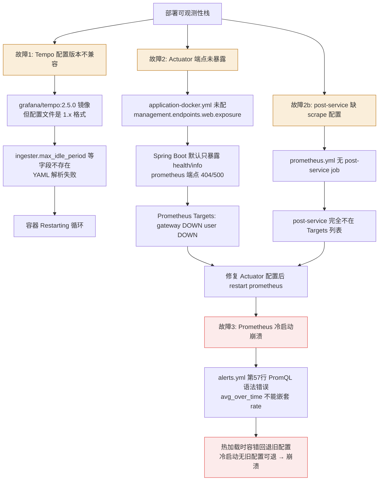

# 故障复盘：可观测性体系搭建三连故障（Tempo + Actuator + Prometheus）

- **日期：** 2026-06-28
- **严重等级：** P1（Prometheus 崩溃导致监控全盲）/ P2（Tempo/Actuator 部分功能不可用）
- **STAR 全映射：**
  - S = 搭建可观测性体系（Prometheus+Grafana+Tempo）过程中，三个组件接连出现配置/兼容性故障
  - T = 恢复监控体系可用，让所有 Targets UP、Tempo 正常接收 trace
  - A = 分别定位三个故障根因（版本不兼容/端点未暴露/PromQL 语法错误），逐一修复
  - R = 4 个 Targets 全部 UP，Tempo OTLP 端口正常，Prometheus 冷启动通过

---

## 时间线

| 北京时间 | 事件 | 动作人 |
|----------|------|--------|
| 06-28 上午 | 部署 Prometheus+Grafana+Tempo 可观测性栈 | 开发者 |
| 06-28 上午 | `docker-compose ps` 发现 Tempo 容器 `Restarting (1)` | 开发者 |
| 06-28 上午 | 查 Tempo 日志发现 YAML 解析错误，定位版本不兼容 | 开发者 |
| 06-28 上午 | 重写 Tempo 配置为最小可用，容器 Up 但 unhealthy | 开发者 |
| 06-28 上午 | 深查日志发现健康检查端点空指针 panic，临时禁用 healthcheck | 开发者 |
| 06-28 中午 | Prometheus Targets 页面发现 gateway DOWN(404)、user DOWN(500)、post 缺失 | 开发者 |
| 06-28 中午 | 查各服务日志，定位 Actuator 端点未暴露 + post 缺 scrape 配置 | 开发者 |
| 06-28 中午 | 三个服务添加 Actuator 暴露配置 + prometheus.yml 加 post job | 开发者 |
| 06-28 中午 | `docker-compose restart prometheus` 让配置生效 | 开发者 |
| 06-28 中午 | Prometheus 重启后崩溃 `Restarting (1)`！ | 开发者 |
| 06-28 下午 | 查日志发现 alerts.yml 第 57 行 PromQL 语法错误 | 开发者 |
| 06-28 下午 | 注释有问题的 RequestSpike 规则，Prometheus 恢复 Up(healthy) | 开发者 |
| 06-28 下午 | 4 个 Targets 全部 UP，监控体系可用 | — |

---

## 影响范围

| 维度 | 数据 |
|------|------|
| 持续时长 | 约半天（搭建过程中陆续出现并修复） |
| 受影响组件 | Tempo（链路追踪）、Prometheus（指标采集）、3 个业务服务的监控端点 |
| 业务影响 | 无（监控组件故障不影响业务服务运行） |
| 直接损失 | 无（开发阶段，非生产环境） |

---

## 故障链路图



---

## 三个故障的根因与修复

### 故障1：Tempo 配置文件版本不兼容

**根因：** 项目用 `grafana/tempo:2.5.0` 镜像，但 `tempo.yml` 按 Tempo 1.x 格式编写。Tempo 2.x 配置结构重大重构：
- `ingester.max_idle_period` → 2.x 的 `ingester.Config` 不存在该字段
- 顶层 `search` 配置块 → 2.x 默认开启，不需单独配置
- `metrics_generator` remote_write → Prometheus 未开 remote write 接收
- `stream_over_http_enabled` → 2.x 顶层无此字段

**第二层问题：** 配置修复后 Tempo 能启动，但访问 `/status/ready` 触发空指针 panic：
- Tempo 2.5 的 statusHandler 遍历检查所有子模块（distributor/ingester/compactor 等）
- 最小化配置导致某些子模块未初始化（nil），健康检查访问 nil 对象 panic
- 核心功能（OTLP 接收 4317/4318）正常，仅健康检查端点崩溃

**修复：**
1. 重写 `tempo.yml` 为最小可用配置（删除所有不兼容字段，保留 server/distributor/ingester/compactor/storage）
2. 临时禁用 healthcheck：`test: ["CMD-SHELL", "echo ok"]`（绕过空指针 panic）

**工程判断：** Tempo 是链路追踪工具，非当前 JVM/性能监控核心（核心是 Prometheus+Grafana），不应在此卡住。核心端口 4317/4318 可正常接收 OTLP 数据，临时禁用健康检查继续推进。

### 故障2：Actuator 端点未暴露 + post-service 缺 scrape 配置

**根因（三个独立问题叠加）：**

1. **Actuator prometheus 端点未暴露**：三个服务的 `application-docker.yml` 没配 `management.endpoints.web.exposure.include`。Spring Boot Actuator 默认只暴露 `health` 和 `info`，`prometheus` 端点未对外开放：
   - gateway（WebFlux）：访问未暴露端点直接 404
   - user/post（Servlet）：访问未暴露端点被 Spring MVC 当静态资源查找，抛 `NoResourceFoundException`

2. **post-service 未在 Prometheus 配置 scrape job**：`prometheus.yml` 只有 prometheus 自身、gateway、user 三个 job，缺 post-service

3. **NoResourceFoundException 未被全局异常处理器捕获**：`GlobalExceptionHandler` 没处理 Spring Boot 3.x 新增的 `NoResourceFoundException`，被兜底 `Exception` 处理器捕获返回 500（而非正确的 404）

**修复：**
1. 三个服务 `application-docker.yml` 添加 `management.endpoints.web.exposure.include: health,info,prometheus,metrics,loggers`
2. `prometheus.yml` 添加 post-service scrape job
3. `GlobalExceptionHandler` 添加 `@ExceptionHandler(NoResourceFoundException.class)` 返回 404

### 故障3：Prometheus 告警规则 PromQL 语法错误导致冷启动崩溃（最严重）

**根因：** `alerts.yml` 第 6 条告警 `RequestSpike` 的 PromQL 表达式语法错误：
```promql
rate(http_server_requests_seconds_count[5m]) > 2 * avg_over_time(rate(http_server_requests_seconds_count[5m])[1h])
```

**语法错误：** `avg_over_time(rate(...)[1h])` —— `[duration]` 区间选择符只能直接跟在指标选择器后面，不能跟在函数返回值（瞬时向量）后面。

**Prometheus 隐藏故障特性（关键教训）：**
- **热加载时**（`/-/reload`）：配置加载失败，Prometheus 保留上一个有效配置继续运行（容错设计）
- **冷启动时**（进程重启）：没有"上一个有效配置"可回退，配置错误直接启动失败 → 容器崩溃 → 重启循环

这就是为什么 Prometheus 之前跑了 5 小时没事（alerts.yml 可能是运行后热加载的，失败但旧配置继续生效），但 `docker-compose restart` 后立即崩溃。

**修复：** 注释掉有语法错误的 RequestSpike 规则。正确实现需用 recording rule 分两步：
```yaml
- record: job:http_request_rate:5m
  expr: sum by (job) (rate(http_server_requests_seconds_count[5m]))
- alert: RequestSpike
  expr: job:http_request_rate:5m > 2 * avg_over_time(job:http_request_rate:5m[1h])
```

---

## 根因（5 Whys）

| Why # | 问题 | 答案 |
|-------|------|------|
| 1 — 直接原因 | 监控体系三连故障 | Tempo 版本不兼容 + Actuator 未暴露 + PromQL 语法错误 |
| 2 | 为什么三个故障接连出现？ | 搭建可观测性栈时一次性部署多组件，未逐一验证 |
| 3 | 为什么 Tempo 配置用 1.x 格式？ | 参考了过时文档/示例，未核对镜像版本 |
| 4 | 为什么 Prometheus 热加载时不报错？ | Prometheus 热加载容错回退旧配置，制造"运行正常"假象 |
| 5 | 为什么没发现热加载的隐藏故障？ | 不了解 Prometheus 热加载 vs 冷启动的容错差异 |

**最终根因：** 一次性部署多组件未逐一验证 + 不了解组件版本兼容性和容错机制差异

---

## 为什么没提前发现

1. **监控盲点**：监控体系本身在搭建中，无法用监控发现监控的问题（鸡生蛋问题）
2. **测试不足**：配置文件修改后只做热加载验证，未做冷启动验证
3. **假设错误**：假设 Docker 镜像版本与配置示例版本一致；假设热加载通过即冷启动也通过

---

## 修复措施

| # | 措施 | 类型 | 状态 |
|---|------|------|------|
| 1 | Tempo 配置重写为 2.x 最小可用格式 | 彻底修复 | ✅ 完成 |
| 2 | Tempo healthcheck 临时禁用（绕过空指针 panic） | 临时修复 | ⚠️ 待完善配置后恢复 |
| 3 | 三个服务 Actuator 暴露 prometheus 端点 | 彻底修复 | ✅ 完成 |
| 4 | prometheus.yml 添加 post-service scrape job | 彻底修复 | ✅ 完成 |
| 5 | GlobalExceptionHandler 处理 NoResourceFoundException | 彻底修复 | ✅ 完成 |
| 6 | 注释 PromQL 语法错误的 RequestSpike 规则 | 临时修复 | ⚠️ 待用 recording rule 正确实现 |
| 7 | 配置文件修改后强制冷启动验证 | 预防流程 | ✅ 纳入规范 |

---

## 经验教训

1. **Docker 容器排错三板斧**：`docker-compose ps` 看状态 → `docker logs <容器名>` 看错误日志 → `curl -v` 看 HTTP 响应细节
2. **配置版本兼容性**：使用 Docker 镜像时配置文件格式必须与镜像版本匹配；大版本升级（1.x→2.x）常伴随配置结构变化
3. **最小化配置策略**：遇到配置解析错误，先删掉所有非必要字段让服务跑起来，再逐个加回
4. **Spring Boot Actuator 端点暴露机制**：默认只暴露 health/info，prometheus 等需在 `management.endpoints.web.exposure.include` 显式声明
5. **Spring Boot 3.x 的 NoResourceFoundException**：3.x 新增异常类，请求路径不匹配 controller/静态资源时抛出。全局异常处理器需专门处理，否则被兜底返回 500 而非 404
6. **Prometheus 热加载 vs 冷启动容错差异**：热加载失败回退旧配置（制造"正常"假象），冷启动失败直接崩溃。**配置文件修改后务必冷启动验证**
7. **PromQL 类型约束**：`[duration]` 区间选择符只能跟在指标选择器后面，不能跟在函数返回值后面
8. **WebFlux vs Servlet 差异**：Gateway 基于 WebFlux（响应式），访问不存在端点直接 404；user/post 基于传统 Servlet，抛 NoResourceFoundException 走异常处理链
9. **工程优先级判断**：非核心组件出问题时，先临时绕过保证整体进度，不在非关键路径上死磕
10. **排查方法论：从外到内**：先看监控系统给的错误状态码 → 再从监控系统内部验证网络连通性 → 最后到目标服务查具体日志，逐层缩小范围
