# 故障复盘：WebFlux 阻塞调用导致 RAG 知识库索引全部失败

- **日期：** 2026-07-02
- **严重等级：** P1（AI助手核心功能不可用，但不影响其他业务）
- **STAR 全映射：** S=故障现象与影响范围，T=恢复与长期修复目标，A=修复过程，R=经验教训

---

## 时间线（强制）

| 北京时间 | 事件 | 动作人 |
|----------|------|--------|
| 上午 | Week 2 RAG 模块 1-11 代码完成并部署 | 开发 |
| 下午 | 触发 `POST /internal/agent/knowledge/reindex`，返回 `failed:18, vectorCount:0` | 开发 |
| +10min | 初步诊断：怀疑 .env 文件 Unicode 字符污染（EMBEDDING_BASE_URL 含隐藏字符） | Agent |
| +20min | `xxd` hex dump 证明 .env 文件干净（无 0x60 反引号字节），反引号是终端渲染假象 | Agent |
| +25min | 用户反馈"还是失败，需要彻底思考，不要纠结 .env" | 用户 |
| +30min | 重新查看 docker logs，发现 `IllegalStateException: block() not supported in thread reactor-http-epoll-1` | Agent |
| +35min | 定位根因：Controller 返回同步类型，在 reactor 事件循环线程执行 `.block()` | Agent |
| +45min | 修复代码：3 个 Controller 端点 + 2 个 Service 方法包裹 `boundedElastic` | Agent |
| +50min | 本地编译通过，commit `8c99719`，推送部署 | Agent |
| +60min | reindex 仍 failed:18，新错误 `MysqlDataTruncation: Invalid JSON text` | Agent |
| +65min | 定位次生问题：`tags JSON` 列类型与代码存普通字符串不匹配 | Agent |
| +70min | DDL 改为 `tags VARCHAR(256)`，commit `17bcae9`，部署机执行 ALTER TABLE | Agent |
| +75min | reindex 成功：`inserted:18, failed:0, vectorCount:18` ✅ | — |
| +80min | 端到端验证：问"怎么登录注册"，agent 准确回答基于 RAG 检索的真实知识 | 用户确认 |

## 影响范围

| 维度 | 数据 |
|------|------|
| 持续时长 | 约 1.5 小时（从首次 reindex 失败到端到端验证通过） |
| 受影响功能 | AI 智能助手 RAG 检索（知识库索引 + 帖子向量同步） |
| 受影响用户 | 全部 agent-service 用户（问答依赖 LLM 常识，出现幻觉） |
| 直接损失 | 无数据损失；Week 2 RAG 模块在修复前完全不可用 |

---

## 故障链路图（强制 Mermaid）

```mermaid
flowchart LR
    A[触发 reindex] --> B[Controller 同步返回 Result]
    B --> C[reactor-http-epoll 线程执行]
    C --> D[ingestAll 内部 .block 调用]
    D --> E[IllegalStateException 抛出]
    E --> F[18 篇文档全部 failed]
    F --> G[知识库向量数 0]
    G --> H[RAG 检索上下文为空]
    H --> I[agent 回答依赖 LLM 常识]
    I --> J[幻觉：微信登录/企业微信登录]
    
    style E fill:#fcebeb,stroke:#e24b4a
    style F fill:#fcebeb,stroke:#e24b4a
    style J fill:#fcebeb,stroke:#e24b4a
```



---

## 根因（5 Whys）

| Why # | 问题 | 答案 |
|-------|------|------|
| 1 — 直接原因 | reindex 为什么全部 failed？ | `IllegalStateException: block() not supported in reactor-http-epoll-1` |
| 2 | 为什么会在 reactor 线程上 .block()？ | `InternalAgentController.reindexKnowledge()` 返回同步 `Result<Map>`，整个方法在 reactor-http-epoll 事件循环线程上执行 |
| 3 | 为什么 Controller 返回同步类型？ | 开发时沿用 Spring MVC 习惯（返回 `Result<T>`），未意识到 WebFlux 的 Controller 必须返回 `Mono<T>`/`Flux<T>` 才能正确切换线程 |
| 4 | 为什么 .block() 在 reactor 线程上会抛异常？ | WebFlux 的 reactor-http-epoll 是事件循环线程，禁止阻塞操作。`.block()` 会阻塞线程导致事件循环卡死，Reactor 检测到后直接抛 `IllegalStateException` |
| 5 | 为什么上线前没发现？ | RAG reindex 是手动触发的运维端点，非用户高频路径，本地开发时未触发完整 reindex 流程，仅验证了启动无报错 |

**最终根因：** WebFlux Controller 端点返回同步类型，导致阻塞调用（embedding API `.block()`、JDBC、Feign）在 reactor 事件循环线程上执行，触发 `IllegalStateException`。开发时未充分理解 WebFlux 线程模型与 Spring MVC 的本质差异。

---

## 诊断弯路：为什么初期误判为 .env 文件问题

### 误判现象

`cat .env` 和 `docker exec env` 显示 `EMBEDDING_BASE_URL` 两边有反引号字符，怀疑文件被 Unicode 污染导致 embedding API 调用失败。

### 真相

`xxd` hex dump 证明 .env 文件字节完全干净（无 0x60 反引号字节）。反引号是终端对带特殊字符的字符串值的**渲染假象**，并非文件实际内容。

### 教训

1. **诊断文件字符问题必须用 hex dump**（`xxd`/`od`），不要依赖 `cat` 输出
2. **症状归因要找到直接证据**：reindex 失败的直接证据是 `docker logs` 中的异常堆栈，而非 .env 文件的"可疑渲染"
3. **用户反馈是纠偏的关键**：用户指出"不要纠结 .env"后，才转向查看 docker logs 异常堆栈，找到真正的 `IllegalStateException`

---

## 修复方案

### 核心模式：`Mono.fromCallable().subscribeOn(Schedulers.boundedElastic())`

将所有阻塞调用（JDBC、`.block()`、Feign 同步调用）用此模式包裹，移到专用弹性线程池执行，不阻塞 reactor 事件循环。

```java
// 修复前（错误）：同步返回，在 reactor 线程执行
@PostMapping("/knowledge/reindex")
public Result<Map<String, Object>> reindexKnowledge() {
    return Result.success(knowledgeIngestionService.ingestAll()); // 内部 .block() 抛异常
}

// 修复后（正确）：返回 Mono，订阅时切换到 boundedElastic 线程
@PostMapping("/knowledge/reindex")
public Mono<Result<Map<String, Object>>> reindexKnowledge() {
    return Mono.fromCallable(() -> knowledgeIngestionService.ingestAll())
            .subscribeOn(Schedulers.boundedElastic())
            .map(Result::success);
}
```

### 改动范围

| 文件 | 改动点 | 说明 |
|------|--------|------|
| `InternalAgentController.java` | 3 个端点 | `reindexKnowledge`/`knowledgeStatus`/`vectorStatus` 从同步 `Result<T>` 改为 `Mono<Result<T>>` |
| `PostVectorService.java` | 3 处 | `syncAll()` + `syncPost()` 两个分支补加 `.subscribeOn(boundedElastic)` |
| `AgentChatService.java` | 无需修改 | `prepareContext()` 已正确包裹在 `boundedElastic`，chat 的 RAG 检索 `.block()` 安全 |
| `KnowledgeScheduler.java` | 无需修改 | 调度器线程（`new Thread()`/`@Scheduled`）非 reactor 线程，`.block()` 合法 |

### 次生问题：tags JSON 列类型

WebFlux 修复后 reindex 仍失败，新错误 `MysqlDataTruncation: Invalid JSON text`。根因：`agent-init.sql` 中 `tags JSON` 列类型，但代码插入普通逗号分隔字符串（如 `"login,register"`），非合法 JSON。修复：DDL 改为 `tags VARCHAR(256) DEFAULT NULL`。

---

## 线程模型对比图（强制 Mermaid）

```mermaid
flowchart TB
    subgraph 修复前
        A1[HTTP 请求] --> B1[reactor-http-epoll 线程]
        B1 --> C1[Controller 同步方法]
        C1 --> D1[ingestAll .block 调用]
        D1 --> E1[IllegalStateException]
        style E1 fill:#fcebeb,stroke:#e24b4a
    end

    subgraph 修复后
        A2[HTTP 请求] --> B2[reactor-http-epoll 线程]
        B2 --> C2[Controller 返回 Mono]
        C2 --> D2[subscribeOn boundedElastic]
        D2 --> E2[boundedElastic 线程池]
        E2 --> F2[ingestAll .block 调用]
        F2 --> G2[成功返回]
        G2 --> H2[结果回传 reactor 线程]
        H2 --> I2[响应客户端]
        style G2 fill:#e1f5ee,stroke:#1d9e75
        style I2 fill:#e1f5ee,stroke:#1d9e75
    end
```



---

## 为什么没提前发现

1. **监控盲点**：reindex 是运维端点，未接入 Prometheus 告警，失败仅记录在 docker logs
2. **测试不足**：本地开发时未触发完整 reindex 流程（18 篇文档 embedding），仅验证启动无报错
3. **假设错误**：开发时假设 WebFlux Controller 与 Spring MVC Controller 行为一致，未意识到线程模型差异

---

## 修复措施 & 责任人 & 截止日期

| # | 措施 | 类型 | 负责人 | 截止 |
|---|------|------|--------|------|
| 1 | Controller 端点改为 `Mono<Result<T>>` + `boundedElastic` | 彻底修复 | 已完成 (8c99719) | 立即 |
| 2 | PostVectorService 补加 `boundedElastic` | 彻底修复 | 已完成 (8c99719) | 立即 |
| 3 | tags 列类型 JSON → VARCHAR(256) | 彻底修复 | 已完成 (17bcae9) | 立即 |
| 4 | 在 AGENT-WORKFLOW.md 踩坑记录新增 agent-service/WebFlux 章节 | 预防 | 已完成 | 立即 |
| 5 | reindex 端点加入健康检查/冒烟测试 | 预防 | 待办 | 下迭代 |

---

## 经验教训

1. **WebFlux ≠ Spring MVC**：WebFlux 的 Controller 端点必须返回 `Mono<T>`/`Flux<T>`，同步返回类型会导致整个方法在 reactor 事件循环线程执行，所有阻塞调用都会抛 `IllegalStateException`
2. **boundedElastic 是阻塞任务的专用线程池**：JDBC、`.block()`、Feign 同步调用必须 `subscribeOn(Schedulers.boundedElastic())`
3. **诊断要找直接证据**：异常堆栈（`docker logs`）是故障的直接证据，文件渲染假象（`cat` 输出）不是。hex dump 是验证文件内容的唯一可靠方式
4. **一个故障可能掩盖另一个**：WebFlux 异常掩盖了 tags JSON 列类型问题。修复第一个问题后，第二个问题才暴露。修复后必须重新跑完整验证流程
5. **MySQL JSON 列类型有严格校验**：插入非合法 JSON 字符串会报 `Data truncation: Invalid JSON text`。如果代码存的是普通分隔字符串，DDL 必须用 VARCHAR，不要用 JSON 类型
