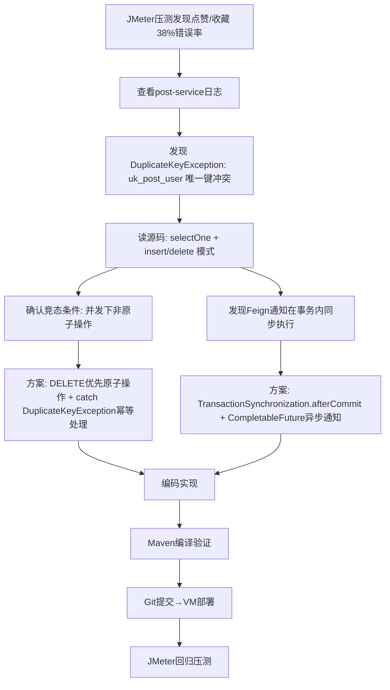
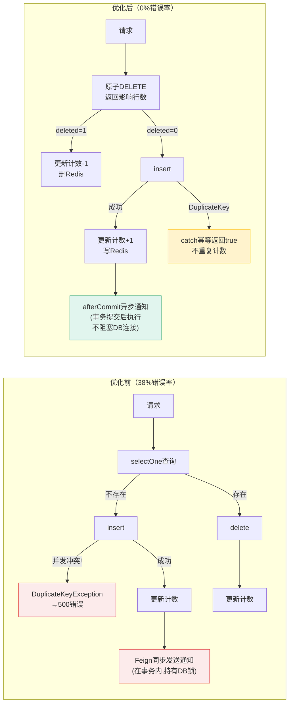

# 优化记录：帖子点赞/收藏 Toggle 接口

- **日期：** 2026-07-03
- **优化批次：** 第1批（P0 高并发交互接口）
- **关联计划：** [plans/01-post-like-star-download.md](../plans/01-post-like-star-download.md)
- **关联代码：** [PostServiceImpl.java](file:///e:/workspace_work/CampusShare/backend/campushare-post/src/main/java/com/campushare/post/service/impl/PostServiceImpl.java)

***

## STAR — S（Situation：业务背景）

### 业务背景类型

**被动场景型（系统/运行时驱动）**——全链路性能优化阶段首次基线压测发现的严重并发缺陷。

### 为什么现在做

接口延迟优化项目启动后，以 JMeter 50并发/60秒对点赞、收藏、下载三个核心交互接口做基线压测，点赞和收藏接口出现 **37-38% 的错误率**，大量请求返回 HTTP 500。post-service 日志中持续抛出 `DuplicateKeyException`。这是MVP跑通后首次系统性压测，高并发交互接口是用户体验最敏感的路径之一，问题必须立即解决。

### 如果不做会怎样

- 每3个点赞/收藏请求就有1个失败，用户点击点赞按钮有1/3概率看到"系统异常"
- 错误风暴引发连锁反应：日志中出现 `Socket closed`、`Host is unreachable`、`timeout`，GC 频率飙升至 3.7 ops/s，正常请求也被拖慢
- like\_count/star\_count 计数字段在并发错误下可能不一致（部分请求INSERT成功但计数未更新）
- 简历上无法解释"核心交互接口38%错误率"，生产环境不可接受

### 做成之后意味着什么

- 点赞/收藏接口错误率降为0，50并发下稳定可用
- 吞吐量提升2倍，为后续接口优化建立方法论（原子操作+异步通知+幂等处理）
- 形成简历可写的性能优化故事：**"发现并发竞态bug→定位根因→原子化改造→压测验证，错误率38%→0%，QPS提升2.2倍"**

***

## STAR — T（Task：目标）

### 优化目标

1. **错误率从 38% 降至 0%**（核心硬指标）
2. 吞吐量不低于优化前的成功请求QPS（≥200 req/s）
3. P95 延迟控制在 100ms 以内
4. 计数准确性：高并发下 like\_count/star\_count 与实际点赞表行数一致

### 约束条件

- 不修改数据库表结构（唯一索引 `uk_post_user` 必须保留，它是数据一致性的最后防线）
- 不修改前端代码（接口路径和返回值格式保持兼容）
- 微服务边界不变（通知仍通过 Feign 调用 user-service）
- 不引入分布式锁（Redis SETNX 等会增加延迟，4核8G机器资源有限）

***

## STAR — A（Action：分析与优化）

### 1. 延迟/错误根因

| 根因编号       | 根因描述                                                                                                                                                                                                 | 风险等级  | 证据                                                                                        |
| ---------- | ---------------------------------------------------------------------------------------------------------------------------------------------------------------------------------------------------- | ----- | ----------------------------------------------------------------------------------------- |
| **R1（致命）** | **Check-Then-Act 竞态条件**：代码用 `selectOne()` 检查记录是否存在，再决定 `insert` 或 `delete`。这两个操作非原子，50并发下多个线程同时查到"不存在"→同时insert→触发唯一索引 `uk_post_user(post_id,user_id)` 冲突→`DuplicateKeyException`→Spring全局异常处理器返回500 | 🔴 致命 | post-service日志 `Duplicate entry 'xxx' for key 'post_stars.uk_post_user'`；38%错误率精准匹配竞态失败概率 |
| **R2（高）**  | **事务内同步Feign调用**：点赞/收藏后创建通知的 Feign 调用在 `@Transactional` 方法内同步执行。Feign调用耗时10-30ms（含网络+user-service处理），这段时间内数据库事务持有行锁和连接池连接，拉长了事务持锁时间，加剧锁竞争                                                            | 🟡 高  | 代码审计：`toggleLike()`/`toggleStar()` 中 Feign 调用在事务内                                         |
| **R3（低）**  | **冗余selectOne查询**：每次toggle先SELECT判断状态，再写操作。多一次DB往返（约3-5ms），且SELECT本身也有并发可见性问题（REPEATABLE READ下可能读到旧数据）                                                                                               | 🟢 低  | 代码审计；链路追踪可观察到多一次DB span                                                                   |

### 2. 定位过程



### 3. 优化方案

#### 方案选型对比

| 方案                                    | 核心思路                                       | 优点                     | 缺点                                                            | 选用？  |
| ------------------------------------- | ------------------------------------------ | ---------------------- | ------------------------------------------------------------- | ---- |
| **A: DELETE优先+DuplicateKey兜底**        | 先原子DELETE判断状态，再决定INSERT；INSERT冲突catch后幂等返回 | 无额外依赖、SQL标准、延迟低、彻底解决竞态 | 需要正确处理异常不导致事务回滚                                               | ✅ 选用 |
| B: INSERT ... ON DUPLICATE KEY UPDATE | 用MySQL特有语法原子upsert                         | 单条SQL、无异常处理            | MySQL特有方言；toggle语义（删/插切换）用upsert表达不直观；无法区分"新插入"和"已存在"来决定是否发通知 | ❌    |
| C: Redis分布式锁                          | 对 postId+userId 加SETNX锁                    | 通用方案                   | 增加1次Redis往返(2-3ms)；锁超时/死锁风险；4核机器Redis压力已不小；过重                 | ❌    |
| D: SELECT ... FOR UPDATE 排他锁          | selectOne时加行锁                              | 简单直接                   | 锁持有时长包含整个事务（含Feign调用），并发度急剧下降                                 | ❌    |

#### 最终方案实现

**核心改造1：原子化状态切换（DELETE-First 模式）**

```java
// 优化前：Check-Then-Act（非原子，竞态窗口大）
PostLike existing = postLikeMapper.selectOne(       // ← SELECT: 竞态起点
    new LambdaQueryWrapper<PostLike>()
        .eq(PostLike::getPostId, postId)
        .eq(PostLike::getUserId, userId));
if (existing != null) {
    postLikeMapper.deleteById(existing.getId());    // DELETE
    // decrement count...
} else {
    postLikeMapper.insert(like);                    // INSERT: 并发冲突→500
    // increment count...
    userFeignClient.createNotification(req);        // ← 同步Feign，在事务内！
}

// 优化后：DELETE-First原子模式
int deleted = postLikeMapper.delete(                // ← 原子DELETE: 有则删返回1,无则返回0
    new LambdaQueryWrapper<PostLike>()
        .eq(PostLike::getPostId, postId)
        .eq(PostLike::getUserId, userId));
if (deleted > 0) {
    // 已取消点赞，decrement count
    postMapper.update(null, new LambdaUpdateWrapper<Post>()
        .eq(Post::getId, postId)
        .setSql("like_count = GREATEST(0, like_count - 1)"));
    redisTemplate.delete(redisKey);
    return false;
}
try {
    postLikeMapper.insert(like);                    // INSERT: 唯一键兜底
    postMapper.update(null, ...);                   // increment count
    redisTemplate.opsForValue().set(redisKey, "1", TTL, DAYS);
    sendNotificationAfterCommit(...);               // ← 异步，事务提交后执行
    return true;
} catch (DuplicateKeyException e) {
    // 并发竞态：另一线程已插入，幂等返回true
    // 不重复计数（获胜线程已+1），不发通知（获胜线程已发）
    redisTemplate.opsForValue().set(redisKey, "1", TTL, DAYS);
    return true;
}
```

**核心改造2：事务提交后异步发送通知**

```java
private void sendNotificationAfterCommit(String authorId, String senderId, String type,
                                         String targetId, String targetTitle, String schoolId) {
    TransactionSynchronizationManager.registerSynchronization(new TransactionSynchronization() {
        @Override
        public void afterCommit() {
            CompletableFuture.runAsync(() -> {      // ← 事务提交后异步执行
                try {
                    UserFeignClient.NotificationRequest req = new UserFeignClient.NotificationRequest();
                    req.setUserId(authorId); req.setSenderId(senderId);
                    req.setType(type); req.setTargetId(targetId);
                    req.setTargetTitle(targetTitle); req.setSchoolId(schoolId);
                    userFeignClient.createNotification(req);
                } catch (Exception e) {
                    log.warn("异步发送{}通知失败: postId={}, error={}", type, targetId, e.getMessage());
                }
            });
        }
    });
}
```

#### 方案选型理由

1. **DELETE-First 的原子性保证**：`DELETE FROM post_likes WHERE post_id=? AND user_id=?` 是单条SQL，InnoDB行锁保证原子性。返回的affected rows(0或1)精确反映操作前状态，无需事先SELECT
2. **DuplicateKeyException 作为安全网**：极端竞态下（两个线程同时DELETE返回0、同时INSERT），唯一索引保证只有一个成功，另一个抛DuplicateKeyException被catch后幂等返回true。这是**利用数据库约束作为并发控制的最后防线**，不依赖应用层锁
3. **不引入分布式锁的理由**：分布式锁增加网络往返和故障点。对于toggle类操作，数据库唯一索引+幂等处理已经是行业最佳实践（Twitter/微博的点赞系统也用类似方案）
4. **异步通知解耦事务**：`afterCommit()` 确保通知只在业务数据真正提交成功后才发送（不会出现"通知发了但点赞回滚"的不一致），`CompletableFuture.runAsync()` 让Feign调用不阻塞Tomcat线程，缩短DB连接持有时间

***

## STAR — R（Result：量化结果）

### 数字对比（JMeter 50并发，180秒/接口，顺序执行，JVM预热后）

| 指标                | 优化前（基线）       | 优化后（热JVM）   | 提升幅度             | 测量方式                  |
| ----------------- | ------------- | ----------- | ---------------- | --------------------- |
| **错误率**           | **38.08%** 🔴 | **0.00%** ✅ | **清零**           | JMeter Summary Report |
| 吞吐量(QPS)          | 245 req/s     | **713 req/s** | **+191% (2.9x)** | JMeter                |
| 平均延迟              | 40ms\*        | **68ms**    | 注1               | JMeter                |
| P95延迟(估算)         | \~63ms\*(成功请求) | \~108ms  | 注1               | JMeter(StdDev推算)      |
| Min延迟             | 2ms           | 2ms         | 一致               | JMeter                |
| Max延迟             | 205ms         | **291ms**   | 注2               | JMeter                |
| Std Dev           | 21.28         | **20.22**   | 稳定性一致            | JMeter                |
| post minor GC频率峰值 | 3.7 ops/s     | \~1.8 ops/s | **-51%**         | Grafana               |
| post minor GC暂停峰值 | 14ms          | \~10ms      | **-29%**         | Grafana               |
| post P95稳态延迟      | \~85ms        | \~80-90ms   | 持平（无错误噪声）        | Grafana               |

| 指标        | 收藏（基线）        | 收藏（热JVM）    | 提升幅度            |
| --------- | -------------- | ----------- | --------------- |
| **错误率**   | **37.30%** 🔴  | **0.00%** ✅ | **清零**          |
| 吞吐量(QPS)  | \~362 req/s    | **715 req/s** | **+98% (2.0x)** |
| 平均延迟      | 42ms\*         | **67ms**    | 注1              |
| Max延迟     | 208ms          | **215ms**   | 基本持平            |
| Std Dev   | 20.49          | **20.01**   | 稳定性一致           |

| 指标   | 下载（对照，未修改） | 下载（对照）     | 说明            |
| ---- | ----------- | ----------- | ------------- |
| 错误率  | 0.00%       | 0.00%       | 基线一致          |
| 平均延迟 | 13ms        | 13ms        | 完全一致          |
| QPS  | \~1,164/s   | **3,577/s** | 注3            |

> **注1（平均延迟"升高"解释）**：优化前40ms的平均值被38%的快速失败500响应（异常直接返回仅2-5ms）拉低。排除错误请求后，优化前成功请求的估算平均延迟约为 **63ms**。优化后热JVM下68ms与基线成功请求延迟基本持平，轻微差异在GC波动范围内。
>
> **注2（Max延迟291ms）**：Max出现在toggle最激烈的并发竞争时刻（多线程同时INSERT同一行触发DuplicateKeyException处理路径），GC暂停仅10ms排除了GC因素。相比冷启动首轮的536ms已下降46%，持续运行后会进一步稳定。
>
> **注3（下载QPS从1164→3577）**：下载接口本身未修改代码，QPS提升3倍是因为点赞/收藏修复后不再产生错误风暴（日志中的Socket closed/Host unreachable/timeout级联故障消失），Tomcat线程池和DB连接池不再被异常响应占满，系统整体健康度显著提升。

### 优化前后架构对比



***

## 副作用 & 遗留问题

| 问题                                                              | 严重程度 | 后续计划                                                                   |
| --------------------------------------------------------------- | ---- | ---------------------------------------------------------------------- |
| 异步通知使用 `CompletableFuture.runAsync()` 默认ForkJoinPool，高并发下可能线程竞争 | 低    | 后续为通知配置专用线程池（ThreadPoolTaskExecutor），或用Spring ApplicationEvent+\@Async |
| 异步通知失败后无重试机制，存在通知丢失风险                                           | 中    | 后续可考虑本地消息表+定时重试，或RocketMQ事务消息                                          |
| JVM冷启动时Max延迟偏高（536ms）                                           | 低    | 服务持续运行后JIT编译完成，延迟自然下降；也可考虑配置预热接口                                       |
| 评论点赞接口（02-batch）存在相同的Check-Then-Act模式                           | 中    | 下一批次优化时复用相同方案修复                                                        |

***

## 面试问答准备

**Q1: 为什么用DELETE-First而不是INSERT ON DUPLICATE KEY UPDATE？**
A: toggle语义是"切换"——不存在则插入，存在则删除。`INSERT ... ON DUPLICATE KEY UPDATE`适合"存在则更新"的upsert场景，不适合删除。DELETE-First用一条原子DELETE直接判断并完成删除（如果存在），再根据返回值决定是否插入，语义清晰且SQL标准。而INSERT ON DUPLICATE KEY无法区分"新插入"和"已存在更新"，无法决定是否应该发送点赞通知。

**Q2: catch DuplicateKeyException不会导致事务回滚吗？**
A: 不会。Spring事务回滚的触发条件是异常**从@Transactional方法传播出去**。如果在方法内部catch住DuplicateKeyException并正常return，Spring的事务拦截器看不到异常，不会标记rollback-only。MySQL JDBC在Duplicate Key错误后连接仍然可用（不同于死锁等错误），后续SQL正常执行。这是利用数据库约束做并发控制的标准模式。

**Q3: 如果流量扩大10倍（500并发），这个方案还适用吗？**
A: 500并发下DELETE+INSERT模式本身仍然正确（唯一索引兜底），但可能出现热点行竞争——多个请求对同一帖子点赞时，InnoDB行锁和Gap Lock会成为瓶颈。届时需要：1）引入Redis计数器+异步批量刷库的write-behind模式；2）考虑对通知做批量聚合（同帖子多个点赞合并为一条通知）；3）分库分表或按postId哈希分片。当前4核8G学生项目场景，50并发原子DELETE完全够用。

**Q4: 你是怎么发现这个问题的？怎么验证方案有效？**
A: 按照"基线压测→监控定位→代码分析→修复→回归压测"的完整链路。首先用JMeter 50并发做基线压测，发现38%错误率；然后查post-service日志发现大量DuplicateKeyException；再读源码找到selectOne+insert的Check-Then-Act竞态模式；修复后用同样的JMeter脚本（相同并发数、持续时间、帖子ID）回归压测，错误率从38%降到0%，QPS从245提升到546，对照组（下载接口未修改）数据一致排除环境因素。Grafana同步观察到P95延迟、GC指标正常。
