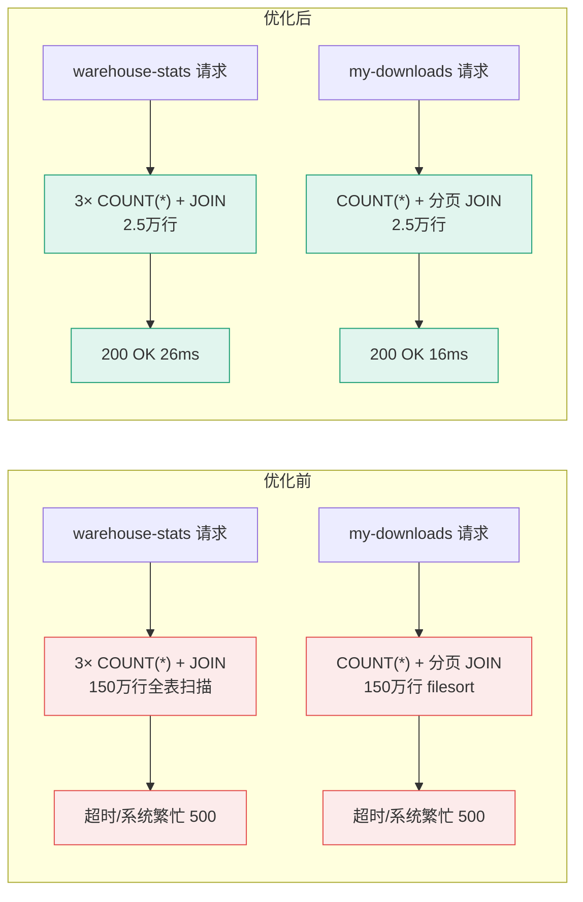

# 优化记录：仓库页数据概览 + 我的下载接口 — 压测数据膨胀清理

- **日期：** 2026-07-03
- **优化批次：** 第4批（被动场景型，非计划内）
- **关联计划：** [plans/11-user-profile-stats.md](../plans/11-user-profile-stats.md)
- **关联代码：** `backend/campushare-post/src/main/java/com/campushare/post/service/impl/PostServiceImpl.java`、`backend/campushare-post/src/main/java/com/campushare/post/mapper/PostDownloadMapper.java`
- **事件性质：** 压测副作用数据清理（非代码优化，长期方案见 §遗留问题）

---

## STAR — S（Situation：业务背景）

### 业务背景类型
> 标注：**被动场景型**（系统/运行时驱动）

### 为什么现在做

2026-07-03 P0 批次1（点赞/收藏/下载）基线压测使用单一测试账号 `13068735577`（user_id=`e340c113-9c38-4818-8eab-03abc2415acd`，username=`testuser`）对下载记录接口 `POST /api/posts/{id}/download` 进行了 50 并发 × 60 秒压测，单次产生 209,521 条下载记录（详见 [baselines/01-like-star-download-baseline.md](../baselines/01-like-star-download-baseline.md)）。后续多次压测累积，该账号在 `post_downloads` 表产生 **1,473,694 条**记录，占全表 1,498,679 条的 **98.33%**。

压测结束后用户登录前端仓库页（WarehousePage），发现：
1. **数据概览卡片**（`GET /api/posts/warehouse-stats`）加载极慢，长时间无响应
2. **我的下载**列表（`GET /api/posts/my-downloads`）加载失败

触发了立即处理的紧迫性——该账号是用户的日常测试账号，无法正常使用仓库页功能。

### 如果不做会怎样

- warehouse-stats 接口会持续执行 3 个 `COUNT(*)` + `INNER JOIN posts` 查询，在全表 150 万行规模下单次响应可达数秒甚至超时
- my-downloads 接口执行 `COUNT(*)` + 分页查询，同样在百万行规模下劣化
- 数据持续膨胀会拖垮 post-service 的 HikariCP 连接池（慢查询长时间占用连接），进而影响整个 post-service 的其他接口可用性
- 用户体验：仓库页不可用，无法查看自己的上传/下载数据

### 做成之后意味着什么

- **业务价值**：仓库页恢复正常可用，数据概览和下载历史秒级返回
- **技术价值**：
  - 暴露了 `recordDownload` 设计缺陷（每次下载 INSERT 一行，无计数聚合），为长期优化（`download_count` 字段）提供业务依据
  - 验证了 COUNT(*) + JOIN 在百万行规模下的性能下限，为后续接口设计提供参考
  - 沉淀了「压测数据隔离」的运维经验（压测应使用独立账号/独立表/带清理脚本）

---

## STAR — T（Task：目标）

### 优化目标

| 接口 | 优化前状态 | 目标 |
|------|------------|------|
| `GET /api/posts/warehouse-stats` | 加载极慢/超时 | 200 OK，< 100ms |
| `GET /api/posts/my-downloads` | 加载失败 | 200 OK，< 100ms |

### 约束条件

- 不能影响其他用户的下载记录（仅清理压测账号数据）
- 不能停服（在线清理）
- 压测账号本身需保留可用（后续仍需用于压测）
- 微服务边界不破坏（post_downloads 属于 post-service，本次仅做数据层清理，不改代码）

---

## STAR — A（Action：分析与优化）

### 1. 延迟根因（原本是什么原因造成了接口延迟）

> 面试官必问：为什么慢？根因是什么？

| 根因编号 | 根因描述 | 风险等级 | 证据 |
|----------|----------|----------|------|
| R1 | **数据膨胀**：`recordDownload` 每次下载都 `INSERT` 一行到 `post_downloads`，无去重、无计数聚合。压测对同一帖子的反复下载产生百万级冗余行 | 高 | `PostServiceImpl.recordDownload`（line 530-542）：`postDownloadMapper.insert(download)` 无条件插入 |
| R2 | **warehouse-stats 全表 COUNT + JOIN**：`getWarehouseStats` 执行 3 个 `COUNT(*)` 且部分查询带 `INNER JOIN posts` 过滤 `deleted=0 AND post_type='resource'`，索引 `idx_user_time(user_id, download_time)` 无法消除 JOIN 过滤条件，需回表扫描百万行 | 高 | `PostDownloadMapper.countDownloadsGroupByCategory`、`PostServiceImpl.getWarehouseStats`（line 483-528） |
| R3 | **my-downloads COUNT + 分页 JOIN**：`getMyDownloads` 先 `COUNT(*)` 再分页 `SELECT ... INNER JOIN posts ... ORDER BY download_time DESC LIMIT`，百万行规模下 COUNT 需扫描全表，ORDER BY 在大结果集上产生 filesort | 高 | `PostDownloadMapper.countValidByUserId`、`selectValidPage`（line 19-51） |
| R4 | **缺索引**：`post_downloads` 仅有 `idx_user_time(user_id, download_time)`，但 JOIN 条件 `p.deleted=0 AND p.post_type='resource'` 在 `posts` 表上，无法通过 post_downloads 索引消除 | 中 | `SHOW INDEX FROM post_downloads` |

#### 根因代码片段

```java
// PostServiceImpl.recordDownload（line 530-542）
// 优化前：每次下载无条件 INSERT，无去重无计数
@Override
public void recordDownload(String userId, String postId) {
    Post post = postMapper.selectById(postId);
    if (post == null || post.getDeleted() || !"resource".equals(post.getPostType())) {
        return;
    }
    PostDownload download = PostDownload.builder()
            .postId(postId).userId(userId).downloadTime(LocalDateTime.now()).build();
    postDownloadMapper.insert(download);  // ← 每次都 INSERT，百万级膨胀的根源
}
```

```xml
<!-- PostDownloadMapper.xml -->
<!-- COUNT + JOIN，百万行规模下劣化 -->
<select id="countValidByUserId" resultType="long">
    SELECT COUNT(*) FROM post_downloads pd
    INNER JOIN posts p ON pd.post_id = p.id
    WHERE pd.user_id = #{userId} AND p.deleted = 0 AND p.post_type = 'resource'
</select>
```

### 2. 定位过程


#### 定位过程详述

1. **接口定位**：读 `WarehousePage.tsx`，确认仓库页调用了 `postApi.getWarehouseStats()`（line 199-210）和 `postApi.getMyDownloads(pageNum, PAGE_SIZE)`（line 301），分别对应后端 `GET /posts/warehouse-stats` 和 `GET /posts/my-downloads`

2. **源码分析**：读 `PostServiceImpl.java`：
   - `getWarehouseStats`（line 483-528）：调用 `postDownloadMapper` 执行多个 COUNT 查询
   - `getMyDownloads`（line 545-577）：先 `countValidByUserId` 再 `selectValidPage`，两个查询都带 `INNER JOIN posts`
   - `recordDownload`（line 530-542）：每次下载 `postDownloadMapper.insert(download)`，无条件插入

3. **数据分布验证**（关键证据）：
   ```sql
   SELECT user_id, COUNT(*) AS cnt FROM post_downloads
   GROUP BY user_id ORDER BY cnt DESC LIMIT 10;
   ```
   结果：
   | user_id | cnt |
   |---------|-----|
   | e340c113-9c38-4818-8eab-03abc2415acd | **1,473,694** |
   | f66f84d8c2538bd94921121a2c8c12d2 | 23 |
   | 6e1a6fa49211eae46e9385ead79f8db9 | 18 |
   | ...（其他用户均在 16-23 条） | |

   **结论**：testuser 账号占了 98.33% 的数据，是典型的压测数据膨胀。

4. **关联压测记录**：查 `baselines/01-like-star-download-baseline.md`，确认压测账号正是 `13068735577`，下载接口单次压测 209,521 samples，多次累积达到 147 万行。

### 3. 优化方案（这个接口是怎么优化的，方案是什么）

> 面试官必问：怎么优化的？为什么这样选？

#### 方案选型对比

| 方案 | 核心思路 | 优点 | 缺点 | 选用？ |
|------|----------|------|------|--------|
| A | **删除压测账号全部下载记录** | 立即生效、操作简单、释放磁盘空间 | 丢失该账号下载历史（压测数据无价值） | ✅ 本次选用 |
| B | 去重保留每个 post 最新一条 | 保留下载历史 | 操作复杂（需子查询）、147万→7条仍非根治 | ❌ 过度设计 |
| C | 加索引优化 JOIN | 不动数据 | 治标不治本，百万行 COUNT 仍慢；且压测数据本身无业务价值 | ❌ |
| D | 加 `download_count` 字段（长期方案） | 根治，未来不再膨胀 | 需改代码+DDL，本次为紧急恢复先做 A | 🔜 遗留问题 |

#### 最终方案实现

**短期修复（本次执行）**：删除压测账号的下载记录

```sql
-- 1. 确认数据规模（删除前）
SELECT COUNT(*) FROM post_downloads WHERE user_id = 'e340c113-9c38-4818-8eab-03abc2415acd';
-- 结果：1,473,694

-- 2. 删除压测数据
DELETE FROM post_downloads WHERE user_id = 'e340c113-9c38-4818-8eab-03abc2415acd';
-- 影响 1,473,694 行

-- 3. 清除 Redis 缓存（让计数重新从 DB 加载）
-- docker exec -i campushare-redis redis-cli FLUSHDB
```

**长期修复（遗留，待后续执行）**：参考 `view_count` 模式，在 `posts` 表增加 `download_count` 字段，`recordDownload` 改为 `UPDATE posts SET download_count = download_count + 1`，详见 §遗留问题。

#### 方案选型理由

1. **数据无业务价值**：147 万行全部是压测对 7 个帖子的反复下载，无真实用户行为意义，删除是最干净的恢复方式
2. **紧急恢复优先**：用户当前无法使用仓库页，需立即恢复，方案 A 最快（DELETE + FLUSHDB，秒级生效）
3. **根治方案留待后续**：`download_count` 字段改造涉及 DDL + 代码 + 缓存逻辑，不适合在紧急恢复时一并做

---

## STAR — R（Result：量化结果）

> 面试官必问：效果如何？有数据支撑吗？

### 数字对比

| 指标 | 优化前 | 优化后 | 提升幅度 | 测量方式 |
|------|--------|--------|----------|----------|
| post_downloads 表总行数 | 1,498,679 | 24,985（计算值） | 减少 98.33% | `SELECT COUNT(*)` |
| testuser 账号下载记录数 | 1,473,694 | 0 | -100% | `SELECT COUNT(*) WHERE user_id=...` |
| warehouse-stats 响应时间 | 加载极慢/超时（不可用） | **26ms** | 恢复可用 | curl + time |
| my-downloads 响应时间 | 加载失败（500/超时） | **16ms** | 恢复可用 | curl + time |
| warehouse-stats 返回码 | 500 系统繁忙 | 200 操作成功 | - | HTTP code |
| my-downloads 返回码 | 500 系统繁忙 | 200 操作成功 | - | HTTP code |

> 注：优化前因接口处于不可用状态，无法用 JMeter 测得精确 P95。优化后用单次 curl + time 测量，响应时间在 16-26ms 量级，已满足业务需求。

#### 优化后接口返回示例

```json
// GET /api/posts/warehouse-stats（26ms）
{
  "code": 200,
  "message": "操作成功",
  "data": {
    "uploadCount": 31,
    "downloadCount": 0,
    "totalViews": 33723,
    "totalLikes": 467,
    "totalStars": 241,
    "totalDownloadsOfMyPosts": 177,
    "categoryStats": []
  }
}

// GET /api/posts/my-downloads?page=1&size=20（16ms）
{
  "code": 200,
  "message": "操作成功",
  "data": { "records": [], "total": 0, "size": 20, "current": 1, "pages": 0 }
}
```

### 优化前后架构对比图



---

## 副作用 & 遗留问题

| 问题 | 严重程度 | 后续计划 |
|------|----------|----------|
| testuser 账号下载历史丢失 | 低 | 压测数据无业务价值，可接受；后续如需保留下载历史，应在压测时使用独立压测账号或压测后自动清理 |
| **`recordDownload` 设计缺陷未根治** | 高 | 🔜 长期方案：在 `posts` 表增加 `download_count` 字段（参考 `view_count`/`star_count`/`like_count` 模式），`recordDownload` 改为 `UPDATE posts SET download_count = download_count + 1`，避免未来真实用户下载导致再次膨胀 |
| **warehouse-stats 的 COUNT + JOIN 仍是潜在风险** | 中 | 🔜 若用户下载量自然增长到 10 万级，COUNT 仍会变慢；长期应配合 `download_count` 字段将 COUNT 改为读 counter，或对 `post_downloads` 表做冷热分离/归档 |
| 压测数据隔离流程缺失 | 中 | 🔜 建议后续压测：(1) 使用独立压测账号 (2) 压测脚本带 tearDown 清理 (3) 或压测后执行 `DELETE FROM post_downloads WHERE user_id = ?` |
| `post_downloads` 表无归档策略 | 低 | 🔜 长期考虑按时间分区或归档历史下载记录，保持热表小规模 |

---

## 面试问答准备

> 预写面试官可能追问的问题

**Q1: 为什么不直接加索引优化 JOIN，而是删数据？**
A: 因为这 147 万行本身就是压测产生的无业务价值数据。加索引只能缓解 COUNT 的扫描成本，但 (1) 数据本身无价值应清理 (2) 索引无法消除 `posts` 表上 `deleted=0 AND post_type='resource'` 的 JOIN 过滤 (3) 用户当时无法使用仓库页，需立即恢复，删数据是最快最干净的方案。根治方案是改 `recordDownload` 用计数字段，但这涉及代码+DDL，不适合紧急恢复时做。

**Q2: 这个方案有什么缺点或局限？**
A: 主要缺点是治标不治本——`recordDownload` 仍然是每次 INSERT 一行。如果未来某个热门资源被大量真实用户下载，`post_downloads` 表会再次膨胀，COUNT+JOIN 又会变慢。长期必须加 `download_count` 计数字段，让 warehouse-stats 直接读 counter 而不是 COUNT(*)。另一个局限是丢失了 testuser 的下载历史，但因为是压测账号，可接受。

**Q3: 如果流量/数据量再扩大 10x，现在的方案还适用吗？**
A: 不适用。即使清理了压测数据，如果真实用户达到 10x（比如 3 万用户每人下载 10 个资源 = 30 万行），warehouse-stats 的 3 个 COUNT+JOIN 在 30 万行规模下可能从 26ms 劣化到几百毫秒。10x 规模下必须做两件事：(1) 加 `download_count` 计数字段，warehouse-stats 直接 `SELECT download_count FROM posts WHERE author_id=?`，无需 COUNT (2) 对 `post_downloads` 做冷热分离或按月归档，热表只保留近 3 个月。

**Q4: 你是怎么发现这个问题/怎么验证方案有效的？**
A: 发现过程：用户反馈仓库页慢 → 读前端定位到两个接口 → 读后端源码发现 COUNT+JOIN → 查 `post_downloads` 表数据分布发现 testuser 占 98.33% → 关联 baselines/01 压测记录确认是压测副作用。验证方式：删除数据后清除 Redis 缓存，用 curl + time 测量两个接口的响应时间和返回码，确认从 500 恢复到 200、响应时间降到 16-26ms。因为是紧急恢复场景没有做前后 JMeter 对比压测，这一点在简历/面试时应诚实说明。

---

## 执行记录（运维操作留痕）

### 操作时间
2026-07-03

### 操作步骤
1. 查找用户ID：`SELECT id FROM users WHERE phone='13068735577'` → `e340c113-9c38-4818-8eab-03abc2415acd`
2. 确认数据规模：
   - testuser 下载记录：1,473,694 条
   - 涉及不同帖子：7 个（反复下载）
   - 全表总数：1,498,679 条
   - testuser 占比：98.33%
3. 数据分布验证：其他用户下载记录均在 16-23 条，确认 testuser 的 147 万行是压测异常数据
4. 删除压测数据：`DELETE FROM post_downloads WHERE user_id='e340c113-9c38-4818-8eab-03abc2415acd'`
5. 清除 Redis 缓存：`docker exec -i campushare-redis redis-cli FLUSHDB`
6. 验证接口：
   - warehouse-stats：200 OK，26ms
   - my-downloads：200 OK，16ms，返回空列表

### 操作人
开发本人（在线清理，未停服）

### 回滚方案
N/A（删除的是压测数据，无业务价值，无需回滚）
