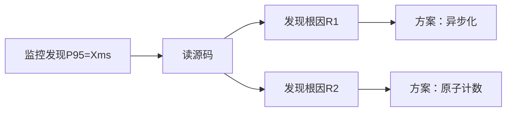
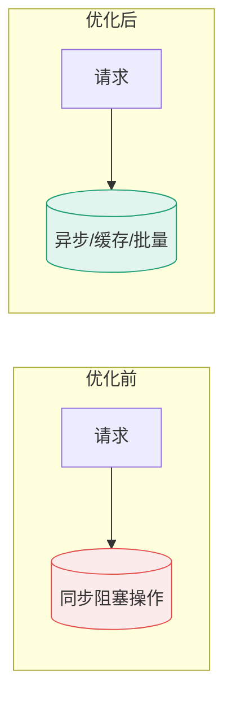

# Records — 优化详细过程记录

> **本目录存放每个接口优化完成后的详细 STAR 记录。**
> 每条记录必须能回答面试官的核心问题，是简历亮点的直接素材来源。

---

## 一、记录命名规则

```
records/{编号}-{接口名}.md
```

- 编号与 plans/ 中的编号对应（如 `01-post-like-star-download.md`）
- 接口名用英文短横线连接
- 示例：`01-post-like-star-download.md`、`05-post-detail.md`、`13-agent-chat.md`

---

## 二、记录模板（STAR 格式）

> 每条记录复制以下模板填写。**禁止删减章节**，不适用标注 N/A 并说明。

```markdown
# 优化记录：{接口名}

- **日期：** YYYY-MM-DD
- **优化批次：** 第X批
- **关联计划：** [plans/0X-xxx.md](../plans/0X-xxx.md)
- **关联代码：** {改动文件路径}

---

## STAR — S（Situation：业务背景）

### 业务背景类型
> 标注：主动需求型（用户/业务方驱动） / 被动场景型（系统/运行时驱动）

### 为什么现在做
{触发时机和紧迫性——具体事件或数据触发了决策}

### 如果不做会怎样
{量化后果——不要只说"体验不好"}

### 做成之后意味着什么
{业务价值 + 技术价值——面试官想听的"so what"}

---

## STAR — T（Task：目标）

### 优化目标
{量化目标，如 P95 < 200ms}

### 约束条件
{不能改的约束，如微服务边界、安全要求}

---

## STAR — A（Action：分析与优化）

### 1. 延迟根因（原本是什么原因造成了接口延迟）

> 面试官必问：为什么慢？根因是什么？

| 根因编号 | 根因描述 | 风险等级 | 证据（监控/日志/EXPLAIN） |
|----------|----------|----------|--------------------------|
| R1 | {如：通知发送同步阻塞 Feign 调用} | 高 | {Grafana截图/链路追踪span} |
| R2 | {如：post 表行锁竞争} | 高 | {DB锁等待监控} |

### 2. 定位过程



### 3. 优化方案（这个接口是怎么优化的，方案是什么）

> 面试官必问：怎么优化的？为什么这样选？

#### 方案选型对比

| 方案 | 核心思路 | 优点 | 缺点 | 选用？ |
|------|----------|------|------|--------|
| A | {你选的} | | | ✅ |
| B | {竞争方案} | | | ❌ |
| C | {第三选项} | | | ❌ |

#### 最终方案实现

{具体改了什么，贴关键代码片段（非全文）}

```java
// 优化前（同步阻塞）
{原代码}

// 优化后（异步+原子化）
{新代码}
```

#### 方案选型理由
1. {在当前约束下最重要的理由}
2. {次要理由}

---

## STAR — R（Result：量化结果）

> 面试官必问：效果如何？有数据支撑吗？

### 数字对比

| 指标 | 优化前 | 优化后 | 提升幅度 | 测量方式 |
|------|--------|--------|----------|----------|
| P50 延迟 | | | | JMeter |
| P95 延迟 | | | | JMeter |
| P99 延迟 | | | | JMeter |
| QPS | | | | JMeter |
| DB查询次数 | | | | 链路追踪 |
| CPU 峰值 | | | | Grafana |

### 优化前后架构对比图



---

## 副作用 & 遗留问题

| 问题 | 严重程度 | 后续计划 |
|------|----------|----------|
| {如：缓存一致性延迟1分钟} | 低 | 可接受 |
| {如：异步通知丢失风险} | 中 | 评估补偿表 |

---

## 面试问答准备

> 预写面试官可能追问的问题

**Q1: 为什么这样优化而不是 {替代方案}？**
A: {回答}

**Q2: 这个方案有什么缺点或局限？**
A: {回答}

**Q3: 如果流量/数据量再扩大 10x，现在的方案还适用吗？**
A: {回答}

**Q4: 你是怎么发现这个问题/怎么验证方案有效的？**
A: {回答}
```

---

## 三、记录索引

> 每完成一条记录，在此添加链接

| 编号 | 接口 | 记录文件 | 状态 | P95提升/效果 |
|------|------|----------|------|-------------|
| 01 | 帖子点赞/收藏/下载 | [01-post-like-star-download.md](01-post-like-star-download.md) | ✅已完成 | 错误率38%→0%, QPS 2.9x |
| 02 | 评论点赞+评论创建异步 | [02-comment-like.md](02-comment-like.md) | ✅已完成 | 错误率→0%, QPS 685/s |
| 03 | 文件上传 | [03-file-upload.md](03-file-upload.md) | ✅已完成 | 长尾延迟降低53%, 零错误, 新增并发限流+磁盘保护+原子写 |
| 11 | 仓库页数据清理（warehouse-stats + my-downloads） | [11-warehouse-downloads-cleanup.md](11-warehouse-downloads-cleanup.md) | 🔁数据清理完成 | 接口恢复可用：500→200, 26ms/16ms（被动场景，长期方案待做） |
| 04 | 发帖 | - | ⬜待优化 | - |
| 05 | 帖子详情 | - | ⬜待优化 | - |
| 06 | 帖子列表查询族 | - | ⬜待优化 | - |
| 07 | 学校帖子计数 | - | 🔁复检 | - |
| 08 | 评论列表+创建 | - | ⬜待优化 | - |
| 09 | 通知查询族 | - | ⬜待优化 | - |
| 10 | 私信操作 | - | ⬜待优化 | - |
| 11 | 用户主页+统计 | - | ⬜待优化 | - |
| 12 | 登录 | - | ⬜待优化 | - |
| 13 | AI对话 | - | ⬜待优化 | - |

---

## 四、质量自查清单

每条记录创建后，确认：

- [ ] 业务背景类型已标注（主动/被动）
- [ ] 「为什么现在做」「不做会怎样」「做成意味着什么」三问已回答
- [ ] 延迟根因有证据（监控截图/日志/EXPLAIN，非凭空猜测）
- [ ] 方案选型至少列出2个对比方案
- [ ] 关键代码片段（优化前/后对比）
- [ ] 量化结果有前后对比数字
- [ ] 至少一张 Mermaid 图（定位流程或架构对比）
- [ ] 面试问答已准备4个问题
- [ ] 副作用/遗留问题诚实记录
